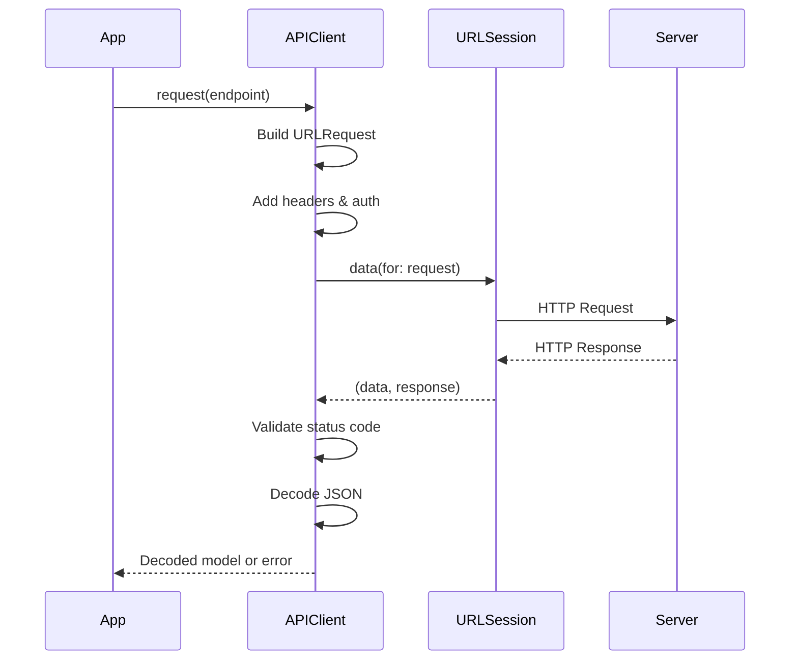

# How to Implement Networking with URLSession

Author: [nawazdhandala](https://www.github.com/nawazdhandala)

Tags: Swift, URLSession, iOS, Networking, API

Description: Learn how to implement networking in Swift using URLSession, covering GET/POST requests, JSON handling, async/await, error handling, and production-ready patterns.

---

Networking is a core part of almost every iOS app. Whether you're fetching data from a REST API, uploading images, or downloading files, URLSession is Apple's built-in framework for handling all HTTP communication. This guide walks through everything from basic requests to production-ready networking layers.

## Why URLSession?

URLSession is Apple's native networking framework, built right into iOS, macOS, tvOS, and watchOS. Here's why it's the go-to choice:

| Feature | URLSession | Third-party Libraries |
|---------|------------|----------------------|
| No dependencies | Yes | No |
| Apple maintained | Yes | No |
| Background transfers | Built-in | Varies |
| Certificate pinning | Built-in | Varies |
| Modern async/await | Native support | Wrapper needed |
| App size impact | None | Adds weight |

## Basic GET Request

Let's start with the simplest networking call - fetching JSON data from an API.

The following code demonstrates a basic GET request using URLSession's async/await syntax. We create a URL, call the data(from:) method, and decode the response.

```swift
import Foundation

// Define the model that matches the API response
struct User: Codable {
    let id: Int
    let name: String
    let email: String
}

// Basic GET request function
func fetchUser(id: Int) async throws -> User {
    // Build the URL for the API endpoint
    guard let url = URL(string: "https://api.example.com/users/\(id)") else {
        throw URLError(.badURL)
    }

    // Make the network request and get both data and response
    let (data, response) = try await URLSession.shared.data(from: url)

    // Verify we got a successful HTTP response
    guard let httpResponse = response as? HTTPURLResponse,
          (200...299).contains(httpResponse.statusCode) else {
        throw URLError(.badServerResponse)
    }

    // Decode the JSON response into our User model
    let user = try JSONDecoder().decode(User.self, from: data)
    return user
}

// Usage example
Task {
    do {
        let user = try await fetchUser(id: 123)
        print("Fetched user: \(user.name)")
    } catch {
        print("Error: \(error.localizedDescription)")
    }
}
```

## POST Request with JSON Body

Most APIs require sending data to the server. Here's how to make POST requests with JSON payloads.

This example shows how to configure a URLRequest with HTTP method, headers, and a JSON-encoded body for creating resources on the server.

```swift
import Foundation

struct CreateUserRequest: Codable {
    let name: String
    let email: String
    let role: String
}

struct CreateUserResponse: Codable {
    let id: Int
    let name: String
    let email: String
    let createdAt: String
}

func createUser(name: String, email: String, role: String) async throws -> CreateUserResponse {
    guard let url = URL(string: "https://api.example.com/users") else {
        throw URLError(.badURL)
    }

    // Create the request object
    var request = URLRequest(url: url)
    request.httpMethod = "POST"

    // Set headers for JSON communication
    request.setValue("application/json", forHTTPHeaderField: "Content-Type")
    request.setValue("application/json", forHTTPHeaderField: "Accept")

    // Encode the request body as JSON
    let requestBody = CreateUserRequest(name: name, email: email, role: role)
    request.httpBody = try JSONEncoder().encode(requestBody)

    // Make the request
    let (data, response) = try await URLSession.shared.data(for: request)

    // Check for successful response
    guard let httpResponse = response as? HTTPURLResponse else {
        throw URLError(.badServerResponse)
    }

    // Handle different status codes
    switch httpResponse.statusCode {
    case 200...299:
        return try JSONDecoder().decode(CreateUserResponse.self, from: data)
    case 400:
        throw NetworkError.badRequest
    case 401:
        throw NetworkError.unauthorized
    case 404:
        throw NetworkError.notFound
    case 500...599:
        throw NetworkError.serverError
    default:
        throw NetworkError.unknown(httpResponse.statusCode)
    }
}

// Custom error enum for better error handling
enum NetworkError: Error {
    case badRequest
    case unauthorized
    case notFound
    case serverError
    case unknown(Int)
}
```

## Configuring URLSession

For production apps, you'll want to customize URLSession's behavior. Here's how to configure timeouts, caching, and other settings.

This configuration creates a custom URLSession with specific timeout values, caching behavior, and connection settings appropriate for production use.

```swift
import Foundation

// Create a custom configuration
let configuration = URLSessionConfiguration.default

// Set timeout intervals
configuration.timeoutIntervalForRequest = 30    // Time for initial connection
configuration.timeoutIntervalForResource = 60   // Total time for entire transfer

// Configure caching behavior
configuration.requestCachePolicy = .reloadIgnoringLocalCacheData
configuration.urlCache = URLCache(
    memoryCapacity: 10 * 1024 * 1024,  // 10 MB memory cache
    diskCapacity: 50 * 1024 * 1024,     // 50 MB disk cache
    diskPath: "network_cache"
)

// Connection settings
configuration.httpMaximumConnectionsPerHost = 6
configuration.waitsForConnectivity = true

// Additional headers sent with every request
configuration.httpAdditionalHeaders = [
    "User-Agent": "MyApp/1.0 (iOS)",
    "Accept-Language": "en-US"
]

// Create the session with custom configuration
let session = URLSession(configuration: configuration)

// Use the custom session for requests
func fetchData() async throws -> Data {
    guard let url = URL(string: "https://api.example.com/data") else {
        throw URLError(.badURL)
    }

    let (data, _) = try await session.data(from: url)
    return data
}
```

## Building a Reusable Network Layer

For larger apps, you'll want a structured networking layer that handles authentication, retries, and common patterns.

This network layer implementation provides a clean API for making requests, automatic token injection, and centralized error handling.

```swift
import Foundation

// MARK: - API Client Protocol
protocol APIClientProtocol {
    func request<T: Decodable>(_ endpoint: Endpoint) async throws -> T
}

// MARK: - Endpoint Definition
struct Endpoint {
    let path: String
    let method: HTTPMethod
    let headers: [String: String]?
    let body: Data?
    let queryItems: [URLQueryItem]?

    init(
        path: String,
        method: HTTPMethod = .get,
        headers: [String: String]? = nil,
        body: Data? = nil,
        queryItems: [URLQueryItem]? = nil
    ) {
        self.path = path
        self.method = method
        self.headers = headers
        self.body = body
        self.queryItems = queryItems
    }
}

enum HTTPMethod: String {
    case get = "GET"
    case post = "POST"
    case put = "PUT"
    case patch = "PATCH"
    case delete = "DELETE"
}

// MARK: - API Client Implementation
final class APIClient: APIClientProtocol {
    private let baseURL: String
    private let session: URLSession
    private let decoder: JSONDecoder
    private var authToken: String?

    init(
        baseURL: String,
        session: URLSession = .shared,
        decoder: JSONDecoder = JSONDecoder()
    ) {
        self.baseURL = baseURL
        self.session = session
        self.decoder = decoder

        // Configure decoder for common date formats
        self.decoder.dateDecodingStrategy = .iso8601
        self.decoder.keyDecodingStrategy = .convertFromSnakeCase
    }

    // Set authentication token for subsequent requests
    func setAuthToken(_ token: String?) {
        self.authToken = token
    }

    // Main request method
    func request<T: Decodable>(_ endpoint: Endpoint) async throws -> T {
        // Build the URL with query parameters
        var urlComponents = URLComponents(string: baseURL + endpoint.path)
        urlComponents?.queryItems = endpoint.queryItems

        guard let url = urlComponents?.url else {
            throw APIError.invalidURL
        }

        // Create and configure the request
        var request = URLRequest(url: url)
        request.httpMethod = endpoint.method.rawValue
        request.httpBody = endpoint.body

        // Set default headers
        request.setValue("application/json", forHTTPHeaderField: "Content-Type")
        request.setValue("application/json", forHTTPHeaderField: "Accept")

        // Add auth token if available
        if let token = authToken {
            request.setValue("Bearer \(token)", forHTTPHeaderField: "Authorization")
        }

        // Add custom headers from endpoint
        endpoint.headers?.forEach { key, value in
            request.setValue(value, forHTTPHeaderField: key)
        }

        // Perform the request
        let (data, response) = try await session.data(for: request)

        // Validate the response
        guard let httpResponse = response as? HTTPURLResponse else {
            throw APIError.invalidResponse
        }

        // Handle different status codes
        switch httpResponse.statusCode {
        case 200...299:
            do {
                return try decoder.decode(T.self, from: data)
            } catch {
                throw APIError.decodingFailed(error)
            }
        case 401:
            throw APIError.unauthorized
        case 403:
            throw APIError.forbidden
        case 404:
            throw APIError.notFound
        case 429:
            throw APIError.rateLimited
        case 500...599:
            throw APIError.serverError(httpResponse.statusCode)
        default:
            throw APIError.httpError(httpResponse.statusCode, data)
        }
    }
}

// MARK: - API Errors
enum APIError: Error, LocalizedError {
    case invalidURL
    case invalidResponse
    case unauthorized
    case forbidden
    case notFound
    case rateLimited
    case serverError(Int)
    case httpError(Int, Data)
    case decodingFailed(Error)

    var errorDescription: String? {
        switch self {
        case .invalidURL:
            return "Invalid URL"
        case .invalidResponse:
            return "Invalid server response"
        case .unauthorized:
            return "Authentication required"
        case .forbidden:
            return "Access denied"
        case .notFound:
            return "Resource not found"
        case .rateLimited:
            return "Too many requests, please try again later"
        case .serverError(let code):
            return "Server error (\(code))"
        case .httpError(let code, _):
            return "HTTP error (\(code))"
        case .decodingFailed(let error):
            return "Failed to parse response: \(error.localizedDescription)"
        }
    }
}
```

## Using the Network Layer

With the network layer in place, making API calls becomes clean and straightforward.

This example shows how to use the APIClient to fetch users and create new records with type-safe responses.

```swift
import Foundation

// MARK: - Models
struct User: Codable {
    let id: Int
    let name: String
    let email: String
    let createdAt: Date
}

struct UsersResponse: Codable {
    let users: [User]
    let totalCount: Int
    let page: Int
}

// MARK: - User Service
final class UserService {
    private let client: APIClientProtocol

    init(client: APIClientProtocol) {
        self.client = client
    }

    // Fetch a list of users with pagination
    func fetchUsers(page: Int, limit: Int = 20) async throws -> UsersResponse {
        let endpoint = Endpoint(
            path: "/users",
            method: .get,
            queryItems: [
                URLQueryItem(name: "page", value: "\(page)"),
                URLQueryItem(name: "limit", value: "\(limit)")
            ]
        )

        return try await client.request(endpoint)
    }

    // Fetch a single user by ID
    func fetchUser(id: Int) async throws -> User {
        let endpoint = Endpoint(path: "/users/\(id)")
        return try await client.request(endpoint)
    }

    // Create a new user
    func createUser(name: String, email: String) async throws -> User {
        let body = try JSONEncoder().encode([
            "name": name,
            "email": email
        ])

        let endpoint = Endpoint(
            path: "/users",
            method: .post,
            body: body
        )

        return try await client.request(endpoint)
    }

    // Update an existing user
    func updateUser(id: Int, name: String) async throws -> User {
        let body = try JSONEncoder().encode(["name": name])

        let endpoint = Endpoint(
            path: "/users/\(id)",
            method: .patch,
            body: body
        )

        return try await client.request(endpoint)
    }

    // Delete a user
    func deleteUser(id: Int) async throws {
        let endpoint = Endpoint(
            path: "/users/\(id)",
            method: .delete
        )

        // For void responses, use EmptyResponse
        let _: EmptyResponse = try await client.request(endpoint)
    }
}

// Helper for endpoints that return no content
struct EmptyResponse: Codable {}

// MARK: - Usage
let client = APIClient(baseURL: "https://api.example.com")
client.setAuthToken("your-jwt-token")

let userService = UserService(client: client)

Task {
    do {
        // Fetch users
        let response = try await userService.fetchUsers(page: 1)
        print("Found \(response.totalCount) users")

        // Create a user
        let newUser = try await userService.createUser(
            name: "John Doe",
            email: "john@example.com"
        )
        print("Created user: \(newUser.id)")

    } catch let error as APIError {
        print("API Error: \(error.localizedDescription)")
    } catch {
        print("Unexpected error: \(error)")
    }
}
```

## Handling File Uploads

Uploading files requires multipart form data. Here's a clean implementation for file uploads.

This code creates a multipart form data request for uploading images with additional metadata fields.

```swift
import Foundation
import UIKit

final class FileUploader {
    private let session: URLSession
    private let baseURL: String

    init(baseURL: String, session: URLSession = .shared) {
        self.baseURL = baseURL
        self.session = session
    }

    func uploadImage(
        _ image: UIImage,
        filename: String,
        metadata: [String: String] = [:]
    ) async throws -> UploadResponse {
        guard let url = URL(string: "\(baseURL)/upload") else {
            throw URLError(.badURL)
        }

        // Generate a unique boundary string
        let boundary = "Boundary-\(UUID().uuidString)"

        // Create the request
        var request = URLRequest(url: url)
        request.httpMethod = "POST"
        request.setValue(
            "multipart/form-data; boundary=\(boundary)",
            forHTTPHeaderField: "Content-Type"
        )

        // Build the multipart body
        var body = Data()

        // Add metadata fields
        for (key, value) in metadata {
            body.append("--\(boundary)\r\n")
            body.append("Content-Disposition: form-data; name=\"\(key)\"\r\n\r\n")
            body.append("\(value)\r\n")
        }

        // Add the image file
        if let imageData = image.jpegData(compressionQuality: 0.8) {
            body.append("--\(boundary)\r\n")
            body.append("Content-Disposition: form-data; name=\"file\"; filename=\"\(filename)\"\r\n")
            body.append("Content-Type: image/jpeg\r\n\r\n")
            body.append(imageData)
            body.append("\r\n")
        }

        // Close the boundary
        body.append("--\(boundary)--\r\n")

        request.httpBody = body

        // Perform the upload
        let (data, response) = try await session.data(for: request)

        guard let httpResponse = response as? HTTPURLResponse,
              (200...299).contains(httpResponse.statusCode) else {
            throw URLError(.badServerResponse)
        }

        return try JSONDecoder().decode(UploadResponse.self, from: data)
    }
}

struct UploadResponse: Codable {
    let fileId: String
    let url: String
    let size: Int
}

// Data extension for building multipart bodies
extension Data {
    mutating func append(_ string: String) {
        if let data = string.data(using: .utf8) {
            append(data)
        }
    }
}

// Usage
let uploader = FileUploader(baseURL: "https://api.example.com")

Task {
    guard let image = UIImage(named: "photo") else { return }

    do {
        let response = try await uploader.uploadImage(
            image,
            filename: "profile.jpg",
            metadata: ["userId": "123", "type": "avatar"]
        )
        print("Uploaded file: \(response.url)")
    } catch {
        print("Upload failed: \(error)")
    }
}
```

## Download with Progress Tracking

For large downloads, users need to see progress. Here's how to implement progress tracking using URLSessionDownloadDelegate.

This implementation uses a delegate-based approach to report download progress and handle completion.

```swift
import Foundation

final class FileDownloader: NSObject {
    private lazy var session: URLSession = {
        let config = URLSessionConfiguration.default
        return URLSession(configuration: config, delegate: self, delegateQueue: nil)
    }()

    // Track active downloads with their progress handlers
    private var progressHandlers: [URLSessionTask: (Double) -> Void] = [:]
    private var completionHandlers: [URLSessionTask: (Result<URL, Error>) -> Void] = [:]

    func download(
        from url: URL,
        progress: @escaping (Double) -> Void,
        completion: @escaping (Result<URL, Error>) -> Void
    ) {
        let task = session.downloadTask(with: url)

        progressHandlers[task] = progress
        completionHandlers[task] = completion

        task.resume()
    }

    // Async wrapper for downloads
    func download(from url: URL, progress: @escaping (Double) -> Void) async throws -> URL {
        try await withCheckedThrowingContinuation { continuation in
            download(from: url, progress: progress) { result in
                continuation.resume(with: result)
            }
        }
    }
}

// MARK: - URLSessionDownloadDelegate
extension FileDownloader: URLSessionDownloadDelegate {

    // Called when download completes
    func urlSession(
        _ session: URLSession,
        downloadTask: URLSessionDownloadTask,
        didFinishDownloadingTo location: URL
    ) {
        // Move file to permanent location
        let documentsPath = FileManager.default.urls(
            for: .documentDirectory,
            in: .userDomainMask
        )[0]

        let filename = downloadTask.originalRequest?.url?.lastPathComponent ?? "download"
        let destinationURL = documentsPath.appendingPathComponent(filename)

        do {
            // Remove existing file if needed
            if FileManager.default.fileExists(atPath: destinationURL.path) {
                try FileManager.default.removeItem(at: destinationURL)
            }

            try FileManager.default.moveItem(at: location, to: destinationURL)
            completionHandlers[downloadTask]?(.success(destinationURL))
        } catch {
            completionHandlers[downloadTask]?(.failure(error))
        }

        // Cleanup
        progressHandlers.removeValue(forKey: downloadTask)
        completionHandlers.removeValue(forKey: downloadTask)
    }

    // Called periodically with progress updates
    func urlSession(
        _ session: URLSession,
        downloadTask: URLSessionDownloadTask,
        didWriteData bytesWritten: Int64,
        totalBytesWritten: Int64,
        totalBytesExpectedToWrite: Int64
    ) {
        let progress = Double(totalBytesWritten) / Double(totalBytesExpectedToWrite)

        DispatchQueue.main.async { [weak self] in
            self?.progressHandlers[downloadTask]?(progress)
        }
    }

    // Called when download fails
    func urlSession(
        _ session: URLSession,
        task: URLSessionTask,
        didCompleteWithError error: Error?
    ) {
        if let error = error {
            completionHandlers[task]?(.failure(error))
        }

        progressHandlers.removeValue(forKey: task)
        completionHandlers.removeValue(forKey: task)
    }
}

// Usage with async/await
let downloader = FileDownloader()

Task {
    let fileURL = URL(string: "https://example.com/largefile.zip")!

    do {
        let localURL = try await downloader.download(from: fileURL) { progress in
            print("Download progress: \(Int(progress * 100))%")
        }
        print("File saved to: \(localURL)")
    } catch {
        print("Download failed: \(error)")
    }
}
```

## Request Flow

Here's a visual representation of how a network request flows through the system:



## Retry Logic with Exponential Backoff

Network requests can fail temporarily. Implementing retry logic with exponential backoff helps handle transient failures gracefully.

This wrapper adds automatic retry functionality to any async throwing function with configurable delays between attempts.

```swift
import Foundation

struct RetryConfiguration {
    let maxAttempts: Int
    let initialDelay: TimeInterval
    let maxDelay: TimeInterval
    let multiplier: Double

    static let `default` = RetryConfiguration(
        maxAttempts: 3,
        initialDelay: 1.0,
        maxDelay: 30.0,
        multiplier: 2.0
    )
}

func withRetry<T>(
    config: RetryConfiguration = .default,
    shouldRetry: @escaping (Error) -> Bool = { _ in true },
    operation: @escaping () async throws -> T
) async throws -> T {
    var lastError: Error?
    var delay = config.initialDelay

    for attempt in 1...config.maxAttempts {
        do {
            return try await operation()
        } catch {
            lastError = error

            // Check if we should retry this error
            guard shouldRetry(error) else {
                throw error
            }

            // Don't delay after the last attempt
            if attempt < config.maxAttempts {
                print("Attempt \(attempt) failed, retrying in \(delay)s...")

                try await Task.sleep(nanoseconds: UInt64(delay * 1_000_000_000))

                // Calculate next delay with exponential backoff
                delay = min(delay * config.multiplier, config.maxDelay)
            }
        }
    }

    throw lastError ?? URLError(.unknown)
}

// Helper to determine if an error is retryable
func isRetryableError(_ error: Error) -> Bool {
    if let apiError = error as? APIError {
        switch apiError {
        case .serverError, .rateLimited:
            return true
        default:
            return false
        }
    }

    if let urlError = error as? URLError {
        switch urlError.code {
        case .timedOut, .networkConnectionLost, .notConnectedToInternet:
            return true
        default:
            return false
        }
    }

    return false
}

// Usage
let client = APIClient(baseURL: "https://api.example.com")
let userService = UserService(client: client)

Task {
    do {
        let users = try await withRetry(
            config: .default,
            shouldRetry: isRetryableError
        ) {
            try await userService.fetchUsers(page: 1)
        }
        print("Fetched \(users.totalCount) users")
    } catch {
        print("Failed after all retries: \(error)")
    }
}
```

## Certificate Pinning

For apps that handle sensitive data, certificate pinning adds an extra layer of security by validating the server's certificate.

This URLSessionDelegate implementation pins the server certificate to prevent man-in-the-middle attacks.

```swift
import Foundation
import Security

final class PinnedURLSessionDelegate: NSObject, URLSessionDelegate {
    // Store the expected certificate's public key hash
    private let pinnedPublicKeyHashes: [String]

    init(pinnedPublicKeyHashes: [String]) {
        self.pinnedPublicKeyHashes = pinnedPublicKeyHashes
        super.init()
    }

    func urlSession(
        _ session: URLSession,
        didReceive challenge: URLAuthenticationChallenge,
        completionHandler: @escaping (URLSession.AuthChallengeDisposition, URLCredential?) -> Void
    ) {
        // Only handle server trust challenges
        guard challenge.protectionSpace.authenticationMethod == NSURLAuthenticationMethodServerTrust,
              let serverTrust = challenge.protectionSpace.serverTrust else {
            completionHandler(.performDefaultHandling, nil)
            return
        }

        // Evaluate the server trust
        var error: CFError?
        let isValid = SecTrustEvaluateWithError(serverTrust, &error)

        guard isValid else {
            completionHandler(.cancelAuthenticationChallenge, nil)
            return
        }

        // Get the server's certificate
        guard let serverCertificate = SecTrustGetCertificateAtIndex(serverTrust, 0) else {
            completionHandler(.cancelAuthenticationChallenge, nil)
            return
        }

        // Extract the public key and compute its hash
        guard let serverPublicKey = SecCertificateCopyKey(serverCertificate),
              let serverPublicKeyData = SecKeyCopyExternalRepresentation(serverPublicKey, nil) as Data? else {
            completionHandler(.cancelAuthenticationChallenge, nil)
            return
        }

        let serverPublicKeyHash = sha256(data: serverPublicKeyData)

        // Check if the hash matches any pinned hash
        if pinnedPublicKeyHashes.contains(serverPublicKeyHash) {
            let credential = URLCredential(trust: serverTrust)
            completionHandler(.useCredential, credential)
        } else {
            print("Certificate pinning failed: hash mismatch")
            completionHandler(.cancelAuthenticationChallenge, nil)
        }
    }

    private func sha256(data: Data) -> String {
        var hash = [UInt8](repeating: 0, count: Int(CC_SHA256_DIGEST_LENGTH))
        data.withUnsafeBytes {
            _ = CC_SHA256($0.baseAddress, CC_LONG(data.count), &hash)
        }
        return Data(hash).base64EncodedString()
    }
}

// Usage - create a session with certificate pinning
let delegate = PinnedURLSessionDelegate(pinnedPublicKeyHashes: [
    "BBBBBBBBBBBBBBBBBBBBBBBBBBBBBBBBBBBBBBBBBBB="  // Your certificate's public key hash
])

let configuration = URLSessionConfiguration.default
let pinnedSession = URLSession(
    configuration: configuration,
    delegate: delegate,
    delegateQueue: nil
)

// Use this session for sensitive API calls
```

## Testing Network Code

Writing testable network code is important. Here's how to mock URLSession for unit tests.

This mock implementation allows you to control network responses in tests without making real HTTP requests.

```swift
import Foundation
import XCTest

// Protocol for making URLSession mockable
protocol URLSessionProtocol {
    func data(for request: URLRequest) async throws -> (Data, URLResponse)
    func data(from url: URL) async throws -> (Data, URLResponse)
}

extension URLSession: URLSessionProtocol {}

// Mock URLSession for testing
final class MockURLSession: URLSessionProtocol {
    var mockData: Data?
    var mockResponse: URLResponse?
    var mockError: Error?

    func data(for request: URLRequest) async throws -> (Data, URLResponse) {
        if let error = mockError {
            throw error
        }

        guard let data = mockData, let response = mockResponse else {
            throw URLError(.unknown)
        }

        return (data, response)
    }

    func data(from url: URL) async throws -> (Data, URLResponse) {
        if let error = mockError {
            throw error
        }

        guard let data = mockData, let response = mockResponse else {
            throw URLError(.unknown)
        }

        return (data, response)
    }

    // Helper to set up successful response
    func setMockResponse<T: Encodable>(
        _ object: T,
        statusCode: Int = 200
    ) throws {
        mockData = try JSONEncoder().encode(object)
        mockResponse = HTTPURLResponse(
            url: URL(string: "https://test.com")!,
            statusCode: statusCode,
            httpVersion: nil,
            headerFields: nil
        )
        mockError = nil
    }

    // Helper to set up error response
    func setMockError(_ error: Error) {
        mockData = nil
        mockResponse = nil
        mockError = error
    }
}

// Testable API client that accepts a session protocol
final class TestableAPIClient {
    private let session: URLSessionProtocol
    private let baseURL: String

    init(baseURL: String, session: URLSessionProtocol = URLSession.shared) {
        self.baseURL = baseURL
        self.session = session
    }

    func fetchUser(id: Int) async throws -> User {
        guard let url = URL(string: "\(baseURL)/users/\(id)") else {
            throw URLError(.badURL)
        }

        var request = URLRequest(url: url)
        request.setValue("application/json", forHTTPHeaderField: "Accept")

        let (data, response) = try await session.data(for: request)

        guard let httpResponse = response as? HTTPURLResponse,
              (200...299).contains(httpResponse.statusCode) else {
            throw URLError(.badServerResponse)
        }

        return try JSONDecoder().decode(User.self, from: data)
    }
}

// Unit tests
final class APIClientTests: XCTestCase {
    var mockSession: MockURLSession!
    var client: TestableAPIClient!

    override func setUp() {
        super.setUp()
        mockSession = MockURLSession()
        client = TestableAPIClient(
            baseURL: "https://api.example.com",
            session: mockSession
        )
    }

    func testFetchUserSuccess() async throws {
        // Arrange
        let expectedUser = User(
            id: 1,
            name: "John Doe",
            email: "john@example.com",
            createdAt: Date()
        )
        try mockSession.setMockResponse(expectedUser)

        // Act
        let user = try await client.fetchUser(id: 1)

        // Assert
        XCTAssertEqual(user.id, 1)
        XCTAssertEqual(user.name, "John Doe")
    }

    func testFetchUserNetworkError() async {
        // Arrange
        mockSession.setMockError(URLError(.notConnectedToInternet))

        // Act & Assert
        do {
            _ = try await client.fetchUser(id: 1)
            XCTFail("Expected error to be thrown")
        } catch let error as URLError {
            XCTAssertEqual(error.code, .notConnectedToInternet)
        } catch {
            XCTFail("Unexpected error type")
        }
    }
}
```

## Error Handling Best Practices

| Error Type | Handling Strategy | User Message |
|------------|-------------------|--------------|
| No internet | Show offline indicator, queue request | "No internet connection" |
| Timeout | Retry with backoff | "Request timed out, retrying..." |
| 401 Unauthorized | Clear token, redirect to login | "Please sign in again" |
| 403 Forbidden | Show access denied | "You don't have permission" |
| 404 Not Found | Handle gracefully | "Item not found" |
| 429 Rate Limited | Backoff and retry | "Too many requests, please wait" |
| 500+ Server Error | Retry, then show error | "Something went wrong on our end" |

## Summary

URLSession is a powerful, flexible framework for networking in Swift. Here's what we covered:

- **Basic requests**: GET and POST with async/await
- **Configuration**: Timeouts, caching, and custom settings
- **Network layer**: Reusable, testable architecture
- **File handling**: Uploads and downloads with progress
- **Security**: Certificate pinning for sensitive data
- **Reliability**: Retry logic with exponential backoff
- **Testing**: Mocking URLSession for unit tests

The key to good networking code is building a clean abstraction that handles errors gracefully, supports testing, and keeps your business logic separate from the HTTP details.

---

*Building an iOS app that needs reliable uptime monitoring? [OneUptime](https://oneuptime.com) provides comprehensive monitoring, alerting, and status pages to ensure your services stay online. Monitor your APIs, track response times, and get notified before your users notice any issues.*
