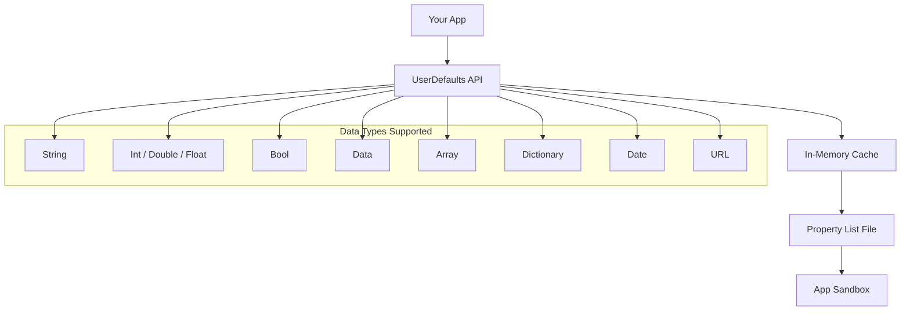
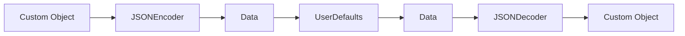
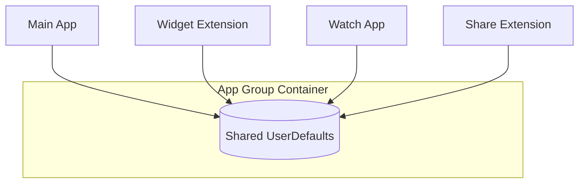

# How to Use UserDefaults for Simple Storage in Swift

Author: [nawazdhandala](https://www.github.com/nawazdhandala)

Tags: Swift, UserDefaults, iOS, Data Persistence, Storage, Apple

Description: Learn how to use UserDefaults in Swift for storing simple data like user preferences, settings, and small pieces of information with practical examples and best practices.

---

> UserDefaults provides a simple, lightweight interface for storing small amounts of data that persist across app launches. It is ideal for user preferences, settings, and simple application state, but should not be used for sensitive data or large datasets.

When building iOS applications, you often need to persist small pieces of data like user preferences, feature flags, or application settings. UserDefaults is the go-to solution for this type of storage because it is simple to use, requires no setup, and works reliably across all Apple platforms.

---

## Understanding UserDefaults

UserDefaults is a key-value storage system that persists data in a property list file within your app's sandbox. The data is loaded into memory when your app launches, making reads extremely fast.



### When to Use UserDefaults

| Use Case | Appropriate | Reason |
|----------|-------------|--------|
| **User preferences** | Yes | Small, non-sensitive settings |
| **App configuration** | Yes | Feature flags, theme settings |
| **First launch detection** | Yes | Simple boolean flag |
| **Authentication tokens** | No | Use Keychain for sensitive data |
| **Large datasets** | No | Use Core Data or files |
| **User credentials** | No | Use Keychain for passwords |
| **Cached API responses** | No | Use URLCache or file storage |

---

## Basic UserDefaults Operations

Let's start with the fundamental operations: saving, retrieving, and removing data from UserDefaults.

### Saving Data to UserDefaults

The following code demonstrates how to save different types of data to UserDefaults. Each data type has a corresponding setter method that handles the conversion automatically.

```swift
// BasicUserDefaultsExample.swift
import Foundation

// Access the shared UserDefaults instance
// This is the standard defaults database for your app
let defaults = UserDefaults.standard

// Store a string value
// The key is used to identify and retrieve the value later
defaults.set("John Doe", forKey: "username")

// Store an integer value
// Useful for counters, scores, or numeric settings
defaults.set(42, forKey: "highScore")

// Store a double value
// Use for precise decimal numbers like measurements
defaults.set(3.14159, forKey: "lastLatitude")

// Store a boolean value
// Perfect for on/off settings and feature flags
defaults.set(true, forKey: "isDarkModeEnabled")

// Store a Date value
// Useful for tracking timestamps and scheduling
defaults.set(Date(), forKey: "lastOpenedDate")

// Store a URL value
// For saving file paths or web addresses
defaults.set(URL(string: "https://api.example.com")!, forKey: "apiEndpoint")

// Store an array of strings
// Supports arrays of property list types
defaults.set(["Swift", "Objective-C", "Python"], forKey: "favoriteLanguages")

// Store a dictionary
// Useful for grouped settings or structured data
defaults.set(["theme": "dark", "fontSize": 14], forKey: "displaySettings")
```

### Retrieving Data from UserDefaults

When retrieving data, you must use the appropriate getter method for each data type. Some methods return optionals while others return default values if the key does not exist.

```swift
// RetrievingDataExample.swift
import Foundation

let defaults = UserDefaults.standard

// Retrieve a string value
// Returns nil if the key doesn't exist or value isn't a String
let username = defaults.string(forKey: "username")
print("Username: \(username ?? "Not set")")

// Retrieve an integer value
// Returns 0 if the key doesn't exist (not an optional)
let highScore = defaults.integer(forKey: "highScore")
print("High Score: \(highScore)")

// Retrieve a double value
// Returns 0.0 if the key doesn't exist
let latitude = defaults.double(forKey: "lastLatitude")
print("Latitude: \(latitude)")

// Retrieve a boolean value
// Returns false if the key doesn't exist
let isDarkMode = defaults.bool(forKey: "isDarkModeEnabled")
print("Dark Mode: \(isDarkMode)")

// Retrieve a Date value
// Returns nil if the key doesn't exist or value isn't a Date
let lastOpened = defaults.object(forKey: "lastOpenedDate") as? Date
print("Last Opened: \(lastOpened?.description ?? "Never")")

// Retrieve a URL value
// Returns nil if the key doesn't exist
let apiEndpoint = defaults.url(forKey: "apiEndpoint")
print("API Endpoint: \(apiEndpoint?.absoluteString ?? "Not set")")

// Retrieve an array value
// Returns nil if the key doesn't exist or value isn't an array
let languages = defaults.stringArray(forKey: "favoriteLanguages")
print("Languages: \(languages ?? [])")

// Retrieve a dictionary value
// Returns nil if the key doesn't exist
let settings = defaults.dictionary(forKey: "displaySettings")
print("Settings: \(settings ?? [:])")
```

### Removing Data from UserDefaults

Use removeObject to delete values from UserDefaults. This is useful for resetting settings or clearing user data during logout.

```swift
// RemovingDataExample.swift
import Foundation

let defaults = UserDefaults.standard

// Remove a single value by its key
defaults.removeObject(forKey: "username")

// Verify the removal by checking for nil
if defaults.string(forKey: "username") == nil {
    print("Username was successfully removed")
}

// Remove multiple values in a loop
let keysToRemove = ["highScore", "lastLatitude", "isDarkModeEnabled"]
for key in keysToRemove {
    defaults.removeObject(forKey: key)
}

// Reset all UserDefaults for your app (useful for debugging)
// This removes everything in your app's defaults domain
if let bundleIdentifier = Bundle.main.bundleIdentifier {
    defaults.removePersistentDomain(forName: bundleIdentifier)
}
```

---

## Type-Safe UserDefaults with Property Wrappers

Swift property wrappers provide an elegant way to create type-safe access to UserDefaults values. This approach reduces boilerplate code and prevents key typos.

### Creating a Generic Property Wrapper

The following property wrapper handles any type that can be stored in UserDefaults. It provides automatic synchronization and a clean API for reading and writing values.

```swift
// UserDefault.swift
import Foundation

// A property wrapper that provides type-safe access to UserDefaults
// The generic constraint ensures only property list types are used
@propertyWrapper
struct UserDefault<T> {

    // The key used to store and retrieve the value
    let key: String

    // The default value returned when no value exists
    let defaultValue: T

    // Optional custom UserDefaults instance (defaults to standard)
    let container: UserDefaults

    // Initialize with a key, default value, and optional container
    init(
        key: String,
        defaultValue: T,
        container: UserDefaults = .standard
    ) {
        self.key = key
        self.defaultValue = defaultValue
        self.container = container
    }

    // The wrapped value property provides transparent access
    var wrappedValue: T {
        get {
            // Attempt to retrieve the value, fall back to default
            container.object(forKey: key) as? T ?? defaultValue
        }
        set {
            // Store the new value
            container.set(newValue, forKey: key)
        }
    }
}
```

### Property Wrapper for Optional Values

When you want to distinguish between "no value set" and "value is default," use an optional property wrapper.

```swift
// OptionalUserDefault.swift
import Foundation

// Property wrapper for optional UserDefaults values
// Returns nil instead of a default when no value exists
@propertyWrapper
struct OptionalUserDefault<T> {

    let key: String
    let container: UserDefaults

    init(key: String, container: UserDefaults = .standard) {
        self.key = key
        self.container = container
    }

    var wrappedValue: T? {
        get {
            container.object(forKey: key) as? T
        }
        set {
            if let value = newValue {
                container.set(value, forKey: key)
            } else {
                // Remove the key when setting to nil
                container.removeObject(forKey: key)
            }
        }
    }
}
```

### Using Property Wrappers in Your App

Here is how to create a centralized settings manager using the property wrappers. This pattern keeps all your UserDefaults keys in one place and provides type safety.

```swift
// AppSettings.swift
import Foundation

// Centralized settings manager using property wrappers
// All UserDefaults access goes through this class
final class AppSettings {

    // Singleton instance for global access
    static let shared = AppSettings()

    // Private initializer prevents creating additional instances
    private init() {}

    // MARK: - User Preferences

    // Theme setting with a default value of "system"
    @UserDefault(key: "app.theme", defaultValue: "system")
    var theme: String

    // Font size preference with numeric default
    @UserDefault(key: "app.fontSize", defaultValue: 16)
    var fontSize: Int

    // Dark mode toggle
    @UserDefault(key: "app.isDarkModeEnabled", defaultValue: false)
    var isDarkModeEnabled: Bool

    // MARK: - App State

    // Track whether onboarding has been completed
    @UserDefault(key: "app.hasCompletedOnboarding", defaultValue: false)
    var hasCompletedOnboarding: Bool

    // Count of app launches for analytics
    @UserDefault(key: "app.launchCount", defaultValue: 0)
    var launchCount: Int

    // MARK: - Optional Values

    // Last logged in username (nil if never logged in)
    @OptionalUserDefault(key: "app.lastUsername")
    var lastUsername: String?

    // Last selected tab index
    @OptionalUserDefault(key: "app.lastSelectedTab")
    var lastSelectedTab: Int?
}

// Usage example
let settings = AppSettings.shared

// Reading values - type safe and auto-completing
print("Current theme: \(settings.theme)")
print("Font size: \(settings.fontSize)")

// Writing values - simple assignment
settings.theme = "dark"
settings.fontSize = 18
settings.hasCompletedOnboarding = true

// Incrementing launch count
settings.launchCount += 1
print("This is launch number \(settings.launchCount)")

// Working with optional values
if let username = settings.lastUsername {
    print("Welcome back, \(username)!")
} else {
    print("Please log in")
}
settings.lastUsername = "john@example.com"
```

---

## Storing Custom Objects with Codable

UserDefaults only supports property list types natively. To store custom objects, you need to encode them as Data using the Codable protocol.



### Creating a Codable Property Wrapper

The following property wrapper automatically handles encoding and decoding of Codable types, making it easy to store custom objects.

```swift
// CodableUserDefault.swift
import Foundation

// Property wrapper for storing Codable objects in UserDefaults
// Handles JSON encoding/decoding automatically
@propertyWrapper
struct CodableUserDefault<T: Codable> {

    let key: String
    let defaultValue: T
    let container: UserDefaults

    // JSON encoder and decoder for serialization
    private let encoder = JSONEncoder()
    private let decoder = JSONDecoder()

    init(
        key: String,
        defaultValue: T,
        container: UserDefaults = .standard
    ) {
        self.key = key
        self.defaultValue = defaultValue
        self.container = container
    }

    var wrappedValue: T {
        get {
            // Retrieve data and decode it
            guard let data = container.data(forKey: key) else {
                return defaultValue
            }

            do {
                return try decoder.decode(T.self, from: data)
            } catch {
                // Return default if decoding fails
                print("Failed to decode \(key): \(error)")
                return defaultValue
            }
        }
        set {
            do {
                // Encode and store the value
                let data = try encoder.encode(newValue)
                container.set(data, forKey: key)
            } catch {
                print("Failed to encode \(key): \(error)")
            }
        }
    }
}
```

### Storing Custom Models

Define your custom models conforming to Codable, then use the CodableUserDefault property wrapper to persist them.

```swift
// UserPreferences.swift
import Foundation

// Custom model for user preferences
// Conforms to Codable for automatic serialization
struct UserPreferences: Codable {
    var notificationsEnabled: Bool
    var emailFrequency: String
    var preferredLanguage: String
    var maxCacheSize: Int

    // Default preferences for new users
    static let `default` = UserPreferences(
        notificationsEnabled: true,
        emailFrequency: "daily",
        preferredLanguage: "en",
        maxCacheSize: 100
    )
}

// Model for recently viewed items
struct RecentItem: Codable {
    let id: String
    let title: String
    let viewedAt: Date
}

// Extended settings manager with custom objects
final class AdvancedSettings {

    static let shared = AdvancedSettings()
    private init() {}

    // Store complex user preferences as a single object
    @CodableUserDefault(
        key: "settings.userPreferences",
        defaultValue: UserPreferences.default
    )
    var userPreferences: UserPreferences

    // Store an array of recent items
    @CodableUserDefault(
        key: "settings.recentItems",
        defaultValue: []
    )
    var recentItems: [RecentItem]
}

// Usage example
let advancedSettings = AdvancedSettings.shared

// Modify nested properties
advancedSettings.userPreferences.notificationsEnabled = false
advancedSettings.userPreferences.emailFrequency = "weekly"

// Add a recent item
let newItem = RecentItem(
    id: "item-123",
    title: "Getting Started Guide",
    viewedAt: Date()
)

// Append to the array
advancedSettings.recentItems.append(newItem)

// Keep only the last 10 items
if advancedSettings.recentItems.count > 10 {
    advancedSettings.recentItems = Array(advancedSettings.recentItems.suffix(10))
}
```

---

## Observing UserDefaults Changes

Sometimes you need to react when UserDefaults values change. Swift provides multiple ways to observe these changes.

### Using Key-Value Observing (KVO)

KVO allows you to monitor changes to specific UserDefaults keys and respond accordingly.

```swift
// UserDefaultsObserver.swift
import Foundation
import Combine

// Observer class that monitors UserDefaults changes
class UserDefaultsObserver: NSObject {

    // Keys to observe
    private let observedKeys: [String]

    // Callback when a change occurs
    var onValueChanged: ((String, Any?) -> Void)?

    init(keys: [String]) {
        self.observedKeys = keys
        super.init()

        // Register observers for each key
        for key in keys {
            UserDefaults.standard.addObserver(
                self,
                forKeyPath: key,
                options: [.old, .new],
                context: nil
            )
        }
    }

    deinit {
        // Remove observers when the object is deallocated
        for key in observedKeys {
            UserDefaults.standard.removeObserver(self, forKeyPath: key)
        }
    }

    // Called when an observed value changes
    override func observeValue(
        forKeyPath keyPath: String?,
        of object: Any?,
        change: [NSKeyValueChangeKey : Any]?,
        context: UnsafeMutableRawPointer?
    ) {
        guard let key = keyPath else { return }
        let newValue = change?[.newKey]
        onValueChanged?(key, newValue)
    }
}

// Usage example
let observer = UserDefaultsObserver(keys: ["app.theme", "app.fontSize"])

observer.onValueChanged = { key, value in
    print("Value changed for \(key): \(value ?? "nil")")

    // Respond to specific changes
    if key == "app.theme" {
        // Update UI theme
        print("Updating app theme...")
    }
}
```

### Using Combine for Reactive Updates

For SwiftUI and Combine-based apps, you can create a publisher that emits values when UserDefaults change.

```swift
// UserDefaultsPublisher.swift
import Foundation
import Combine

// Extension to create Combine publishers for UserDefaults
extension UserDefaults {

    // Create a publisher for a specific key
    func publisher<T>(for key: String) -> AnyPublisher<T?, Never> {
        NotificationCenter.default
            .publisher(for: UserDefaults.didChangeNotification, object: self)
            .map { _ in self.object(forKey: key) as? T }
            .prepend(self.object(forKey: key) as? T)
            .removeDuplicates()
            .eraseToAnyPublisher()
    }
}

// Observable settings class for SwiftUI
import SwiftUI

class ObservableSettings: ObservableObject {

    // Published properties automatically trigger view updates
    @Published var theme: String {
        didSet {
            UserDefaults.standard.set(theme, forKey: "app.theme")
        }
    }

    @Published var fontSize: Int {
        didSet {
            UserDefaults.standard.set(fontSize, forKey: "app.fontSize")
        }
    }

    @Published var isDarkModeEnabled: Bool {
        didSet {
            UserDefaults.standard.set(isDarkModeEnabled, forKey: "app.isDarkModeEnabled")
        }
    }

    private var cancellables = Set<AnyCancellable>()

    init() {
        // Load initial values
        let defaults = UserDefaults.standard
        self.theme = defaults.string(forKey: "app.theme") ?? "system"
        self.fontSize = defaults.integer(forKey: "app.fontSize")
        self.isDarkModeEnabled = defaults.bool(forKey: "app.isDarkModeEnabled")

        // Observe external changes (e.g., from other processes)
        NotificationCenter.default
            .publisher(for: UserDefaults.didChangeNotification)
            .sink { [weak self] _ in
                self?.syncFromDefaults()
            }
            .store(in: &cancellables)
    }

    private func syncFromDefaults() {
        let defaults = UserDefaults.standard

        // Only update if values differ to avoid loops
        let newTheme = defaults.string(forKey: "app.theme") ?? "system"
        if newTheme != theme {
            theme = newTheme
        }

        let newFontSize = defaults.integer(forKey: "app.fontSize")
        if newFontSize != fontSize {
            fontSize = newFontSize
        }
    }
}

// SwiftUI usage
struct SettingsView: View {
    @StateObject private var settings = ObservableSettings()

    var body: some View {
        Form {
            Section("Appearance") {
                Picker("Theme", selection: $settings.theme) {
                    Text("System").tag("system")
                    Text("Light").tag("light")
                    Text("Dark").tag("dark")
                }

                Stepper("Font Size: \(settings.fontSize)", value: $settings.fontSize, in: 12...24)

                Toggle("Dark Mode", isOn: $settings.isDarkModeEnabled)
            }
        }
    }
}
```

---

## App Groups for Sharing Data

When building app extensions like widgets, Today extensions, or watch apps, you need to share UserDefaults data between your main app and extensions using App Groups.



### Configuring App Groups

First, enable App Groups in your Xcode project capabilities. Then use the shared container for UserDefaults.

```swift
// SharedDefaults.swift
import Foundation

// Shared UserDefaults manager for App Group access
final class SharedDefaults {

    // Your App Group identifier (configure in Xcode capabilities)
    static let appGroupIdentifier = "group.com.yourcompany.yourapp"

    // Shared UserDefaults instance for the App Group
    static let shared: UserDefaults = {
        guard let defaults = UserDefaults(suiteName: appGroupIdentifier) else {
            // Fall back to standard if App Group is not configured
            print("Warning: App Group not configured, using standard defaults")
            return UserDefaults.standard
        }
        return defaults
    }()

    // Prevent instantiation
    private init() {}
}

// Property wrapper using shared defaults
@propertyWrapper
struct SharedUserDefault<T> {

    let key: String
    let defaultValue: T

    var wrappedValue: T {
        get {
            SharedDefaults.shared.object(forKey: key) as? T ?? defaultValue
        }
        set {
            SharedDefaults.shared.set(newValue, forKey: key)
        }
    }
}

// Settings accessible from both main app and extensions
final class SharedSettings {

    static let instance = SharedSettings()
    private init() {}

    // Data shared with widget
    @SharedUserDefault(key: "shared.lastRefreshDate", defaultValue: nil)
    var lastRefreshDate: Date?

    @SharedUserDefault(key: "shared.widgetData", defaultValue: "")
    var widgetData: String

    @SharedUserDefault(key: "shared.isLoggedIn", defaultValue: false)
    var isLoggedIn: Bool
}

// Usage in main app
func updateWidgetData() {
    let settings = SharedSettings.instance
    settings.widgetData = "Latest data from main app"
    settings.lastRefreshDate = Date()

    // Trigger widget refresh
    import WidgetKit
    WidgetCenter.shared.reloadAllTimelines()
}

// Usage in widget extension
struct MyWidget: Widget {
    var body: some WidgetConfiguration {
        StaticConfiguration(kind: "MyWidget", provider: Provider()) { entry in
            let settings = SharedSettings.instance
            WidgetView(data: settings.widgetData)
        }
    }
}
```

---

## Registering Default Values

Register default values at app launch to ensure your app always has sensible defaults before any user interaction.

```swift
// DefaultsRegistration.swift
import Foundation

// Register default values at app launch
// Call this in application(_:didFinishLaunchingWithOptions:)
func registerDefaultValues() {
    // Dictionary of default values for each key
    let defaults: [String: Any] = [
        // Appearance settings
        "app.theme": "system",
        "app.fontSize": 16,
        "app.isDarkModeEnabled": false,

        // Feature flags
        "feature.newHomeEnabled": false,
        "feature.darkModeAvailable": true,

        // App behavior
        "app.autoSaveInterval": 30,
        "app.maxRecentItems": 10,
        "app.showTutorialOnFirstLaunch": true,

        // Analytics
        "analytics.enabled": true,
        "analytics.shareAnonymousData": true
    ]

    // Register the defaults
    // These values are used only if no value exists for a key
    UserDefaults.standard.register(defaults: defaults)
}

// AppDelegate example
import UIKit

@main
class AppDelegate: UIResponder, UIApplicationDelegate {

    func application(
        _ application: UIApplication,
        didFinishLaunchingWithOptions launchOptions: [UIApplication.LaunchOptionsKey: Any]?
    ) -> Bool {

        // Register defaults before any other code accesses UserDefaults
        registerDefaultValues()

        // Track app launches
        let launchCount = UserDefaults.standard.integer(forKey: "app.launchCount")
        UserDefaults.standard.set(launchCount + 1, forKey: "app.launchCount")

        return true
    }
}

// SwiftUI App example
import SwiftUI

@main
struct MyApp: App {

    init() {
        // Register defaults in the app initializer
        registerDefaultValues()
    }

    var body: some Scene {
        WindowGroup {
            ContentView()
        }
    }
}
```

---

## Best Practices

### 1. Use Constants for Keys

Define keys as constants to prevent typos and enable autocomplete.

```swift
// UserDefaultsKeys.swift
import Foundation

// Namespace for all UserDefaults keys
enum UserDefaultsKey {
    // Use static constants to prevent typos
    static let theme = "app.theme"
    static let fontSize = "app.fontSize"
    static let isDarkModeEnabled = "app.isDarkModeEnabled"
    static let hasCompletedOnboarding = "app.hasCompletedOnboarding"
    static let launchCount = "app.launchCount"
    static let lastUsername = "app.lastUsername"

    // Group related keys with prefixes
    enum Notifications {
        static let enabled = "notifications.enabled"
        static let sound = "notifications.sound"
        static let badge = "notifications.badge"
    }

    enum Cache {
        static let maxSize = "cache.maxSize"
        static let expirationDays = "cache.expirationDays"
    }
}

// Usage
let defaults = UserDefaults.standard
defaults.set(true, forKey: UserDefaultsKey.isDarkModeEnabled)
defaults.set(true, forKey: UserDefaultsKey.Notifications.enabled)
```

### 2. Avoid Storing Sensitive Data

Never store passwords, tokens, or personal information in UserDefaults.

```swift
// BAD: Never do this
// UserDefaults.standard.set("password123", forKey: "userPassword")
// UserDefaults.standard.set("sk_live_xxx", forKey: "apiKey")

// GOOD: Use Keychain for sensitive data
import Security

func storeInKeychain(password: String, account: String) throws {
    let data = password.data(using: .utf8)!
    let query: [String: Any] = [
        kSecClass as String: kSecClassGenericPassword,
        kSecAttrAccount as String: account,
        kSecValueData as String: data
    ]
    SecItemAdd(query as CFDictionary, nil)
}
```

### 3. Handle Missing Values Gracefully

Always provide sensible defaults and handle the case where values might not exist.

```swift
// SafeDefaults.swift
import Foundation

// Safe wrapper that always returns a valid value
struct SafeDefaults {

    private let defaults = UserDefaults.standard

    // Get string with guaranteed non-nil return
    func string(forKey key: String, default defaultValue: String) -> String {
        defaults.string(forKey: key) ?? defaultValue
    }

    // Get integer with custom default
    func integer(forKey key: String, default defaultValue: Int) -> Int {
        if defaults.object(forKey: key) != nil {
            return defaults.integer(forKey: key)
        }
        return defaultValue
    }

    // Get bool with explicit default
    func bool(forKey key: String, default defaultValue: Bool) -> Bool {
        if defaults.object(forKey: key) != nil {
            return defaults.bool(forKey: key)
        }
        return defaultValue
    }
}

// Usage
let safe = SafeDefaults()
let theme = safe.string(forKey: "theme", default: "light")
let retryCount = safe.integer(forKey: "retryCount", default: 3)
```

### 4. Clear Data Appropriately

Provide a way to reset settings and clear user data.

```swift
// DataCleaner.swift
import Foundation

// Utility for clearing UserDefaults data
struct DataCleaner {

    // Clear all app settings (for logout or reset)
    static func clearAllSettings() {
        guard let bundleId = Bundle.main.bundleIdentifier else { return }
        UserDefaults.standard.removePersistentDomain(forName: bundleId)
        UserDefaults.standard.synchronize()
    }

    // Clear specific categories of settings
    static func clearUserSettings() {
        let keysToRemove = [
            "app.lastUsername",
            "app.userPreferences",
            "app.recentItems"
        ]

        for key in keysToRemove {
            UserDefaults.standard.removeObject(forKey: key)
        }
    }

    // Clear cached data while preserving user preferences
    static func clearCache() {
        let cacheKeys = UserDefaults.standard.dictionaryRepresentation().keys
            .filter { $0.hasPrefix("cache.") }

        for key in cacheKeys {
            UserDefaults.standard.removeObject(forKey: key)
        }
    }
}
```

---

## Testing UserDefaults

When writing tests, use a separate UserDefaults suite to avoid affecting your app's actual data.

```swift
// UserDefaultsTests.swift
import XCTest
@testable import YourApp

class UserDefaultsTests: XCTestCase {

    // Use a test-specific suite name
    private let testSuiteName = "com.yourapp.tests"
    private var testDefaults: UserDefaults!

    override func setUp() {
        super.setUp()
        // Create a fresh UserDefaults for testing
        testDefaults = UserDefaults(suiteName: testSuiteName)
        testDefaults.removePersistentDomain(forName: testSuiteName)
    }

    override func tearDown() {
        // Clean up after each test
        testDefaults.removePersistentDomain(forName: testSuiteName)
        testDefaults = nil
        super.tearDown()
    }

    func testSavingAndRetrievingString() {
        // Arrange
        let key = "testKey"
        let value = "testValue"

        // Act
        testDefaults.set(value, forKey: key)
        let retrieved = testDefaults.string(forKey: key)

        // Assert
        XCTAssertEqual(retrieved, value)
    }

    func testDefaultValueForMissingKey() {
        // Act
        let value = testDefaults.string(forKey: "nonExistentKey")

        // Assert
        XCTAssertNil(value)
    }

    func testRemovingValue() {
        // Arrange
        testDefaults.set("value", forKey: "keyToRemove")

        // Act
        testDefaults.removeObject(forKey: "keyToRemove")

        // Assert
        XCTAssertNil(testDefaults.string(forKey: "keyToRemove"))
    }

    func testCodableStorage() throws {
        // Arrange
        struct TestModel: Codable, Equatable {
            let name: String
            let count: Int
        }

        let model = TestModel(name: "Test", count: 42)
        let key = "codableKey"

        // Act
        let data = try JSONEncoder().encode(model)
        testDefaults.set(data, forKey: key)

        let retrievedData = testDefaults.data(forKey: key)!
        let retrieved = try JSONDecoder().decode(TestModel.self, from: retrievedData)

        // Assert
        XCTAssertEqual(retrieved, model)
    }
}
```

---

## Common Pitfalls to Avoid

1. **Do not use UserDefaults for large data** - Property lists are loaded into memory. Store large data in files or databases.

2. **Do not store sensitive information** - UserDefaults is not encrypted. Use Keychain for passwords and tokens.

3. **Do not rely on synchronize()** - Modern iOS handles persistence automatically. Calling synchronize() is rarely necessary.

4. **Do not use dynamic keys carelessly** - Unpredictable keys can lead to data leaks and make debugging difficult.

5. **Do not forget to handle optionals** - Methods like string(forKey:) return nil if the key does not exist.

---

## Conclusion

UserDefaults is a simple yet powerful tool for persisting small amounts of data in your iOS applications. By following the patterns and best practices outlined in this guide, you can build maintainable and type-safe data persistence layers.

Key takeaways:

- Use UserDefaults for preferences and simple settings, not sensitive data
- Create type-safe property wrappers to reduce boilerplate
- Use Codable for storing custom objects
- Register default values at app launch
- Use App Groups to share data with extensions
- Keep all keys in a central location to prevent typos
- Use separate UserDefaults suites for testing

With the property wrappers and patterns provided in this guide, you have a production-ready solution for managing user preferences and application state in your Swift applications.

---

*Need to monitor your iOS app's performance and user experience? [OneUptime](https://oneuptime.com) provides comprehensive application monitoring, real-time alerting, and incident management to keep your apps running smoothly in production.*

**Related Reading:**
- [How to Use Keychain for Secure Storage in Swift](/blog/post/2026-02-02-swift-keychain-secure-storage)
