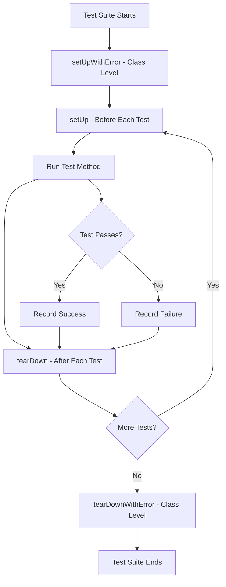

# How to Write Unit Tests with XCTest

Author: [nawazdhandala](https://www.github.com/nawazdhandala)

Tags: Swift, XCTest, iOS, Testing, Unit Tests

Description: Learn how to write effective unit tests in Swift using XCTest, Apple's native testing framework, with practical examples covering test organization, assertions, mocking, and async testing.

---

> Testing is not about finding bugs. It is about building confidence in your code. XCTest gives you the tools to verify that your Swift code works correctly and continues to work as you make changes.

XCTest is Apple's built-in testing framework for Swift and Objective-C. It comes bundled with Xcode and provides everything you need to write unit tests, performance tests, and UI tests for iOS, macOS, watchOS, and tvOS applications.

---

## Setting Up Your Test Target

When you create a new Xcode project, it offers to include unit tests. If you skipped this step, you can add a test target manually.

In Xcode, go to File > New > Target, then select Unit Testing Bundle. Name it something like `YourAppTests`.

Your test files will live in a separate target that has access to your main app's code. The test target's Info.plist specifies the host application to test against.

---

## Test File Structure

XCTest uses a simple class-based structure. Test methods must start with the word "test" to be recognized by the test runner.

This example shows the basic anatomy of a test case class with setup and teardown methods.

```swift
// UserServiceTests.swift
// Unit tests for the UserService class

import XCTest
@testable import MyApp  // Import your app module with internal access

final class UserServiceTests: XCTestCase {

    // Properties for test dependencies
    var sut: UserService!  // System Under Test
    var mockRepository: MockUserRepository!

    // Called before each test method
    override func setUp() {
        super.setUp()
        mockRepository = MockUserRepository()
        sut = UserService(repository: mockRepository)
    }

    // Called after each test method
    override func tearDown() {
        sut = nil
        mockRepository = nil
        super.tearDown()
    }

    // Test methods follow the pattern: test_methodName_expectedBehavior
    func test_fetchUser_returnsUserWhenFound() {
        // Arrange - set up test data
        let expectedUser = User(id: "123", name: "John")
        mockRepository.userToReturn = expectedUser

        // Act - call the method being tested
        let result = sut.fetchUser(id: "123")

        // Assert - verify the outcome
        XCTAssertEqual(result?.name, "John")
    }
}
```

---

## XCTest Assertions

XCTest provides a rich set of assertion methods. Choosing the right assertion makes test failures more informative.

### Basic Assertions

These are the most commonly used assertions for checking equality, truthiness, and nil values.

```swift
// BasicAssertionsTests.swift
// Examples of common XCTest assertions

import XCTest

final class BasicAssertionsTests: XCTestCase {

    func test_equalityAssertions() {
        let value = 42
        let name = "Swift"
        let items = [1, 2, 3]

        // Check if two values are equal
        XCTAssertEqual(value, 42, "Value should be 42")

        // Check if two values are not equal
        XCTAssertNotEqual(value, 0, "Value should not be zero")

        // Compare with accuracy for floating point
        XCTAssertEqual(3.14159, 3.14, accuracy: 0.01)

        // String equality
        XCTAssertEqual(name, "Swift")

        // Array equality
        XCTAssertEqual(items, [1, 2, 3])
    }

    func test_booleanAssertions() {
        let isEnabled = true
        let isEmpty = false

        // Assert true condition
        XCTAssertTrue(isEnabled, "Feature should be enabled")

        // Assert false condition
        XCTAssertFalse(isEmpty, "Collection should not be empty")
    }

    func test_nilAssertions() {
        let optionalValue: String? = "Hello"
        let nilValue: String? = nil

        // Assert value is not nil
        XCTAssertNotNil(optionalValue)

        // Assert value is nil
        XCTAssertNil(nilValue)

        // Unwrap and use the value
        let unwrapped = try XCTUnwrap(optionalValue)
        XCTAssertEqual(unwrapped, "Hello")
    }

    func test_comparisonAssertions() {
        let count = 10

        // Greater than
        XCTAssertGreaterThan(count, 5)

        // Greater than or equal
        XCTAssertGreaterThanOrEqual(count, 10)

        // Less than
        XCTAssertLessThan(count, 20)

        // Less than or equal
        XCTAssertLessThanOrEqual(count, 10)
    }
}
```

### Testing Errors and Exceptions

XCTest provides specific assertions for testing code that throws errors.

```swift
// ErrorAssertionsTests.swift
// Testing code that throws errors

import XCTest
@testable import MyApp

final class ErrorAssertionsTests: XCTestCase {

    var validator: InputValidator!

    override func setUp() {
        super.setUp()
        validator = InputValidator()
    }

    func test_validateEmail_throwsErrorForInvalidEmail() {
        // Assert that a specific error is thrown
        XCTAssertThrowsError(try validator.validateEmail("invalid")) { error in
            // Verify the specific error type
            XCTAssertTrue(error is ValidationError)

            if let validationError = error as? ValidationError {
                XCTAssertEqual(validationError, .invalidFormat)
            }
        }
    }

    func test_validateEmail_succeedsForValidEmail() {
        // Assert that no error is thrown
        XCTAssertNoThrow(try validator.validateEmail("user@example.com"))
    }

    func test_parseJSON_throwsDecodingError() {
        let invalidJSON = "not json"

        XCTAssertThrowsError(try JSONDecoder().decode(User.self, from: Data(invalidJSON.utf8))) { error in
            XCTAssertTrue(error is DecodingError)
        }
    }
}

// Supporting types
enum ValidationError: Error, Equatable {
    case invalidFormat
    case tooShort
    case tooLong
}

class InputValidator {
    func validateEmail(_ email: String) throws {
        guard email.contains("@") else {
            throw ValidationError.invalidFormat
        }
    }
}
```

---

## The Test Flow

Understanding the lifecycle of test execution helps you write reliable tests.



---

## Testing Asynchronous Code

Modern Swift uses async/await extensively. XCTest fully supports testing async code.

### Testing Async Functions

This example demonstrates how to test async functions that return values or throw errors.

```swift
// AsyncTests.swift
// Testing async/await code

import XCTest
@testable import MyApp

final class AsyncTests: XCTestCase {

    var networkService: NetworkService!
    var mockURLSession: MockURLSession!

    override func setUp() {
        super.setUp()
        mockURLSession = MockURLSession()
        networkService = NetworkService(session: mockURLSession)
    }

    // Test async function that returns a value
    func test_fetchUser_returnsDecodedUser() async throws {
        // Arrange - configure mock response
        let userData = """
        {"id": "123", "name": "John Doe", "email": "john@example.com"}
        """.data(using: .utf8)!

        mockURLSession.dataToReturn = userData
        mockURLSession.responseToReturn = HTTPURLResponse(
            url: URL(string: "https://api.example.com")!,
            statusCode: 200,
            httpVersion: nil,
            headerFields: nil
        )

        // Act - call async function
        let user = try await networkService.fetchUser(id: "123")

        // Assert
        XCTAssertEqual(user.id, "123")
        XCTAssertEqual(user.name, "John Doe")
        XCTAssertEqual(user.email, "john@example.com")
    }

    // Test async function that throws
    func test_fetchUser_throwsErrorOnNetworkFailure() async {
        // Arrange
        mockURLSession.errorToThrow = URLError(.notConnectedToInternet)

        // Act and Assert
        do {
            _ = try await networkService.fetchUser(id: "123")
            XCTFail("Expected error to be thrown")
        } catch {
            XCTAssertTrue(error is URLError)
        }
    }

    // Alternative using async assertion
    func test_fetchUser_throwsErrorOnServerError() async throws {
        mockURLSession.dataToReturn = Data()
        mockURLSession.responseToReturn = HTTPURLResponse(
            url: URL(string: "https://api.example.com")!,
            statusCode: 500,
            httpVersion: nil,
            headerFields: nil
        )

        await XCTAssertThrowsErrorAsync(
            try await networkService.fetchUser(id: "123")
        )
    }
}

// Helper for async error assertions
func XCTAssertThrowsErrorAsync<T>(
    _ expression: @autoclosure () async throws -> T,
    file: StaticString = #file,
    line: UInt = #line
) async {
    do {
        _ = try await expression()
        XCTFail("Expected error to be thrown", file: file, line: line)
    } catch {
        // Error was thrown as expected
    }
}
```

### Testing with Expectations

For callback-based async code or when you need to wait for multiple events, use XCTestExpectation.

```swift
// ExpectationTests.swift
// Testing callback-based async code

import XCTest
@testable import MyApp

final class ExpectationTests: XCTestCase {

    var notificationService: NotificationService!

    override func setUp() {
        super.setUp()
        notificationService = NotificationService()
    }

    func test_fetchData_callsCompletionWithData() {
        // Create expectation
        let expectation = expectation(description: "Fetch completes")
        var receivedData: Data?

        // Call method with callback
        notificationService.fetchData { result in
            switch result {
            case .success(let data):
                receivedData = data
            case .failure:
                XCTFail("Expected success")
            }
            expectation.fulfill()
        }

        // Wait for expectation with timeout
        wait(for: [expectation], timeout: 5.0)

        // Assert after completion
        XCTAssertNotNil(receivedData)
    }

    func test_multipleNotifications_receivedInOrder() {
        // Create multiple expectations
        let first = expectation(description: "First notification")
        let second = expectation(description: "Second notification")
        let third = expectation(description: "Third notification")

        var receivedOrder: [Int] = []

        notificationService.onNotification = { index in
            receivedOrder.append(index)
            switch index {
            case 1: first.fulfill()
            case 2: second.fulfill()
            case 3: third.fulfill()
            default: break
            }
        }

        notificationService.sendNotifications()

        // Wait for all expectations in order
        wait(for: [first, second, third], timeout: 10.0, enforceOrder: true)

        XCTAssertEqual(receivedOrder, [1, 2, 3])
    }

    func test_notification_receivedExpectedCount() {
        // Expect exactly 3 fulfillments
        let expectation = expectation(description: "Receive 3 events")
        expectation.expectedFulfillmentCount = 3

        var eventCount = 0

        notificationService.onEvent = {
            eventCount += 1
            expectation.fulfill()
        }

        notificationService.sendEvents(count: 3)

        wait(for: [expectation], timeout: 5.0)
        XCTAssertEqual(eventCount, 3)
    }

    func test_inverted_noUnexpectedCalls() {
        // Inverted expectation - test fails if fulfilled
        let shouldNotBeCalled = expectation(description: "Should not be called")
        shouldNotBeCalled.isInverted = true

        notificationService.onUnexpectedEvent = {
            shouldNotBeCalled.fulfill()
        }

        notificationService.doSomethingSafe()

        // Wait briefly - test passes if expectation is NOT fulfilled
        wait(for: [shouldNotBeCalled], timeout: 1.0)
    }
}
```

---

## Creating Test Doubles

Test doubles (mocks, stubs, fakes) help you isolate the code under test from its dependencies.

### Protocols for Testability

Design your code with protocols to enable easy mocking.

```swift
// Protocols and Mocks Example
// Using protocols to create testable code

import Foundation

// Protocol defining the contract
protocol UserRepositoryProtocol {
    func fetchUser(id: String) async throws -> User
    func saveUser(_ user: User) async throws
    func deleteUser(id: String) async throws
}

// Production implementation
class UserRepository: UserRepositoryProtocol {
    private let apiClient: APIClient

    init(apiClient: APIClient) {
        self.apiClient = apiClient
    }

    func fetchUser(id: String) async throws -> User {
        return try await apiClient.get("/users/\(id)")
    }

    func saveUser(_ user: User) async throws {
        try await apiClient.post("/users", body: user)
    }

    func deleteUser(id: String) async throws {
        try await apiClient.delete("/users/\(id)")
    }
}

// Mock implementation for testing
class MockUserRepository: UserRepositoryProtocol {
    // Track method calls
    var fetchUserCallCount = 0
    var fetchUserCalledWith: String?
    var saveUserCallCount = 0
    var savedUser: User?
    var deleteUserCallCount = 0

    // Configure return values
    var userToReturn: User?
    var errorToThrow: Error?

    func fetchUser(id: String) async throws -> User {
        fetchUserCallCount += 1
        fetchUserCalledWith = id

        if let error = errorToThrow {
            throw error
        }

        guard let user = userToReturn else {
            throw RepositoryError.notFound
        }

        return user
    }

    func saveUser(_ user: User) async throws {
        saveUserCallCount += 1
        savedUser = user

        if let error = errorToThrow {
            throw error
        }
    }

    func deleteUser(id: String) async throws {
        deleteUserCallCount += 1

        if let error = errorToThrow {
            throw error
        }
    }
}

enum RepositoryError: Error {
    case notFound
    case networkError
}
```

### Using Mocks in Tests

This shows how to use mock objects to test the service layer in isolation.

```swift
// UserServiceTests.swift
// Testing service layer with mocked repository

import XCTest
@testable import MyApp

final class UserServiceTests: XCTestCase {

    var sut: UserService!
    var mockRepository: MockUserRepository!

    override func setUp() {
        super.setUp()
        mockRepository = MockUserRepository()
        sut = UserService(repository: mockRepository)
    }

    override func tearDown() {
        sut = nil
        mockRepository = nil
        super.tearDown()
    }

    func test_getUser_callsRepositoryWithCorrectId() async throws {
        // Arrange
        let expectedUser = User(id: "user-123", name: "Alice", email: "alice@example.com")
        mockRepository.userToReturn = expectedUser

        // Act
        _ = try await sut.getUser(id: "user-123")

        // Assert - verify interaction
        XCTAssertEqual(mockRepository.fetchUserCallCount, 1)
        XCTAssertEqual(mockRepository.fetchUserCalledWith, "user-123")
    }

    func test_getUser_returnsUserFromRepository() async throws {
        // Arrange
        let expectedUser = User(id: "123", name: "Bob", email: "bob@example.com")
        mockRepository.userToReturn = expectedUser

        // Act
        let result = try await sut.getUser(id: "123")

        // Assert - verify result
        XCTAssertEqual(result.id, expectedUser.id)
        XCTAssertEqual(result.name, expectedUser.name)
        XCTAssertEqual(result.email, expectedUser.email)
    }

    func test_getUser_throwsWhenRepositoryFails() async {
        // Arrange
        mockRepository.errorToThrow = RepositoryError.networkError

        // Act and Assert
        do {
            _ = try await sut.getUser(id: "123")
            XCTFail("Expected error to be thrown")
        } catch {
            XCTAssertTrue(error is RepositoryError)
        }
    }

    func test_createUser_savesToRepository() async throws {
        // Arrange
        let newUser = User(id: "new-123", name: "Charlie", email: "charlie@example.com")

        // Act
        try await sut.createUser(newUser)

        // Assert
        XCTAssertEqual(mockRepository.saveUserCallCount, 1)
        XCTAssertEqual(mockRepository.savedUser?.id, newUser.id)
        XCTAssertEqual(mockRepository.savedUser?.name, newUser.name)
    }
}

// Service being tested
class UserService {
    private let repository: UserRepositoryProtocol

    init(repository: UserRepositoryProtocol) {
        self.repository = repository
    }

    func getUser(id: String) async throws -> User {
        return try await repository.fetchUser(id: id)
    }

    func createUser(_ user: User) async throws {
        try await repository.saveUser(user)
    }
}

// Domain model
struct User: Equatable {
    let id: String
    let name: String
    let email: String
}
```

---

## Testing View Models

View models in MVVM architecture often contain business logic worth testing.

```swift
// LoginViewModelTests.swift
// Testing a view model with state management

import XCTest
import Combine
@testable import MyApp

final class LoginViewModelTests: XCTestCase {

    var sut: LoginViewModel!
    var mockAuthService: MockAuthService!
    var cancellables: Set<AnyCancellable>!

    override func setUp() {
        super.setUp()
        mockAuthService = MockAuthService()
        sut = LoginViewModel(authService: mockAuthService)
        cancellables = []
    }

    override func tearDown() {
        sut = nil
        mockAuthService = nil
        cancellables = nil
        super.tearDown()
    }

    func test_initialState_isIdle() {
        XCTAssertEqual(sut.state, .idle)
        XCTAssertFalse(sut.isLoading)
        XCTAssertNil(sut.errorMessage)
    }

    func test_login_updatesStateToLoading() {
        // Use expectation to wait for async state change
        let expectation = expectation(description: "State changes to loading")

        sut.$state
            .dropFirst()  // Skip initial value
            .first()
            .sink { state in
                if state == .loading {
                    expectation.fulfill()
                }
            }
            .store(in: &cancellables)

        sut.login(email: "test@example.com", password: "password")

        wait(for: [expectation], timeout: 1.0)
    }

    func test_login_withValidCredentials_updatesStateToSuccess() async {
        // Arrange
        mockAuthService.loginResult = .success(User(id: "123", name: "Test", email: "test@example.com"))

        // Act
        await sut.loginAsync(email: "test@example.com", password: "password123")

        // Assert
        XCTAssertEqual(sut.state, .success)
        XCTAssertFalse(sut.isLoading)
        XCTAssertNotNil(sut.loggedInUser)
    }

    func test_login_withInvalidCredentials_updatesStateToError() async {
        // Arrange
        mockAuthService.loginResult = .failure(AuthError.invalidCredentials)

        // Act
        await sut.loginAsync(email: "wrong@example.com", password: "wrong")

        // Assert
        XCTAssertEqual(sut.state, .error)
        XCTAssertEqual(sut.errorMessage, "Invalid email or password")
        XCTAssertNil(sut.loggedInUser)
    }

    func test_emailValidation_returnsFalseForInvalidEmail() {
        XCTAssertFalse(sut.isValidEmail("invalid"))
        XCTAssertFalse(sut.isValidEmail("missing@domain"))
        XCTAssertFalse(sut.isValidEmail("@nodomain.com"))
    }

    func test_emailValidation_returnsTrueForValidEmail() {
        XCTAssertTrue(sut.isValidEmail("user@example.com"))
        XCTAssertTrue(sut.isValidEmail("user.name@company.co.uk"))
    }

    func test_canSubmit_requiresValidEmailAndPassword() {
        sut.email = ""
        sut.password = ""
        XCTAssertFalse(sut.canSubmit)

        sut.email = "user@example.com"
        sut.password = ""
        XCTAssertFalse(sut.canSubmit)

        sut.email = "invalid"
        sut.password = "password123"
        XCTAssertFalse(sut.canSubmit)

        sut.email = "user@example.com"
        sut.password = "password123"
        XCTAssertTrue(sut.canSubmit)
    }
}

// Mock auth service
class MockAuthService: AuthServiceProtocol {
    var loginResult: Result<User, Error> = .failure(AuthError.unknown)
    var loginCallCount = 0

    func login(email: String, password: String) async throws -> User {
        loginCallCount += 1
        return try loginResult.get()
    }
}

enum AuthError: Error {
    case invalidCredentials
    case networkError
    case unknown
}
```

---

## Testing Core Data

Core Data requires special setup for testing. Use an in-memory store to avoid affecting production data.

```swift
// CoreDataTests.swift
// Testing Core Data operations

import XCTest
import CoreData
@testable import MyApp

final class CoreDataTests: XCTestCase {

    var persistentContainer: NSPersistentContainer!
    var context: NSManagedObjectContext!
    var sut: TaskRepository!

    override func setUp() {
        super.setUp()

        // Create in-memory persistent container for testing
        persistentContainer = NSPersistentContainer(name: "MyApp")

        let description = NSPersistentStoreDescription()
        description.type = NSInMemoryStoreType
        persistentContainer.persistentStoreDescriptions = [description]

        persistentContainer.loadPersistentStores { _, error in
            XCTAssertNil(error)
        }

        context = persistentContainer.viewContext
        sut = TaskRepository(context: context)
    }

    override func tearDown() {
        sut = nil
        context = nil
        persistentContainer = nil
        super.tearDown()
    }

    func test_createTask_savesToContext() throws {
        // Act
        let task = try sut.createTask(title: "Buy groceries", priority: .medium)

        // Assert
        XCTAssertNotNil(task)
        XCTAssertEqual(task.title, "Buy groceries")
        XCTAssertEqual(task.priority, .medium)
        XCTAssertFalse(task.isCompleted)
    }

    func test_fetchAllTasks_returnsAllSavedTasks() throws {
        // Arrange
        _ = try sut.createTask(title: "Task 1", priority: .high)
        _ = try sut.createTask(title: "Task 2", priority: .low)
        _ = try sut.createTask(title: "Task 3", priority: .medium)

        // Act
        let tasks = try sut.fetchAllTasks()

        // Assert
        XCTAssertEqual(tasks.count, 3)
    }

    func test_deleteTask_removesFromContext() throws {
        // Arrange
        let task = try sut.createTask(title: "To delete", priority: .low)

        // Act
        try sut.deleteTask(task)
        let tasks = try sut.fetchAllTasks()

        // Assert
        XCTAssertEqual(tasks.count, 0)
    }

    func test_updateTask_persistsChanges() throws {
        // Arrange
        let task = try sut.createTask(title: "Original", priority: .low)

        // Act
        task.title = "Updated"
        task.isCompleted = true
        try context.save()

        // Fetch again to verify persistence
        let tasks = try sut.fetchAllTasks()

        // Assert
        XCTAssertEqual(tasks.first?.title, "Updated")
        XCTAssertTrue(tasks.first?.isCompleted ?? false)
    }

    func test_fetchTasks_filtersByPriority() throws {
        // Arrange
        _ = try sut.createTask(title: "High 1", priority: .high)
        _ = try sut.createTask(title: "High 2", priority: .high)
        _ = try sut.createTask(title: "Low 1", priority: .low)

        // Act
        let highPriorityTasks = try sut.fetchTasks(priority: .high)

        // Assert
        XCTAssertEqual(highPriorityTasks.count, 2)
        XCTAssertTrue(highPriorityTasks.allSatisfy { $0.priority == .high })
    }
}
```

---

## Performance Testing

XCTest includes built-in support for measuring code performance.

```swift
// PerformanceTests.swift
// Measuring code performance

import XCTest
@testable import MyApp

final class PerformanceTests: XCTestCase {

    var sut: DataProcessor!

    override func setUp() {
        super.setUp()
        sut = DataProcessor()
    }

    func test_sortLargeArray_performance() {
        // Create test data
        let largeArray = (0..<10000).map { _ in Int.random(in: 0...1000000) }

        // Measure performance
        measure {
            _ = sut.sort(largeArray)
        }
    }

    func test_parseJSON_performance() {
        let jsonData = generateLargeJSON(itemCount: 1000)

        // Measure with options for more control
        let metrics: [XCTMetric] = [
            XCTClockMetric(),        // Wall clock time
            XCTCPUMetric(),          // CPU time
            XCTMemoryMetric()        // Memory usage
        ]

        let options = XCTMeasureOptions()
        options.iterationCount = 5

        measure(metrics: metrics, options: options) {
            _ = try? JSONDecoder().decode([Item].self, from: jsonData)
        }
    }

    func test_imageProcessing_performanceBaseline() {
        let image = createTestImage(width: 1000, height: 1000)

        // Set a baseline - test fails if performance degrades significantly
        measure(metrics: [XCTClockMetric()]) {
            _ = sut.applyFilter(to: image)
        }
    }

    private func generateLargeJSON(itemCount: Int) -> Data {
        let items = (0..<itemCount).map { index in
            ["id": index, "name": "Item \(index)", "value": Double.random(in: 0...100)]
        }
        return try! JSONSerialization.data(withJSONObject: items)
    }

    private func createTestImage(width: Int, height: Int) -> UIImage {
        UIGraphicsBeginImageContext(CGSize(width: width, height: height))
        let image = UIGraphicsGetImageFromCurrentImageContext()!
        UIGraphicsEndImageContext()
        return image
    }
}

struct Item: Codable {
    let id: Int
    let name: String
    let value: Double
}
```

---

## Test Organization Best Practices

Organize your tests to mirror your source code structure.

```
MyAppTests/
├── Services/
│   ├── UserServiceTests.swift
│   ├── AuthServiceTests.swift
│   └── PaymentServiceTests.swift
├── ViewModels/
│   ├── LoginViewModelTests.swift
│   └── ProfileViewModelTests.swift
├── Repositories/
│   ├── UserRepositoryTests.swift
│   └── TaskRepositoryTests.swift
├── Utilities/
│   ├── DateFormatterTests.swift
│   └── ValidatorTests.swift
├── Mocks/
│   ├── MockUserRepository.swift
│   ├── MockAuthService.swift
│   └── MockNetworkClient.swift
└── Helpers/
    ├── TestDataFactory.swift
    └── XCTestCase+Extensions.swift
```

### Test Data Factory

Create reusable test data to avoid duplication.

```swift
// TestDataFactory.swift
// Factory for creating test data

import Foundation
@testable import MyApp

enum TestDataFactory {

    // MARK: - Users

    static func makeUser(
        id: String = UUID().uuidString,
        name: String = "Test User",
        email: String = "test@example.com"
    ) -> User {
        User(id: id, name: name, email: email)
    }

    static func makeUsers(count: Int) -> [User] {
        (0..<count).map { index in
            makeUser(
                id: "user-\(index)",
                name: "User \(index)",
                email: "user\(index)@example.com"
            )
        }
    }

    // MARK: - Tasks

    static func makeTask(
        id: UUID = UUID(),
        title: String = "Test Task",
        priority: TaskPriority = .medium,
        isCompleted: Bool = false
    ) -> Task {
        Task(id: id, title: title, priority: priority, isCompleted: isCompleted)
    }

    // MARK: - API Responses

    static func makeSuccessResponse(statusCode: Int = 200) -> HTTPURLResponse {
        HTTPURLResponse(
            url: URL(string: "https://api.example.com")!,
            statusCode: statusCode,
            httpVersion: nil,
            headerFields: nil
        )!
    }

    static func makeErrorResponse(statusCode: Int = 500) -> HTTPURLResponse {
        HTTPURLResponse(
            url: URL(string: "https://api.example.com")!,
            statusCode: statusCode,
            httpVersion: nil,
            headerFields: nil
        )!
    }

    // MARK: - JSON Data

    static func makeUserJSON(id: String = "123", name: String = "Test") -> Data {
        """
        {"id": "\(id)", "name": "\(name)", "email": "\(name.lowercased())@example.com"}
        """.data(using: .utf8)!
    }
}
```

---

## Running Tests

### From Xcode

- Press Cmd+U to run all tests
- Click the diamond next to a test method to run a single test
- Use the Test Navigator (Cmd+6) to see all tests

### From Command Line

Run tests using xcodebuild for CI/CD integration.

```bash
# Run all tests
xcodebuild test \
  -project MyApp.xcodeproj \
  -scheme MyApp \
  -destination 'platform=iOS Simulator,name=iPhone 15'

# Run specific test class
xcodebuild test \
  -project MyApp.xcodeproj \
  -scheme MyApp \
  -destination 'platform=iOS Simulator,name=iPhone 15' \
  -only-testing:MyAppTests/UserServiceTests

# Run with code coverage
xcodebuild test \
  -project MyApp.xcodeproj \
  -scheme MyApp \
  -destination 'platform=iOS Simulator,name=iPhone 15' \
  -enableCodeCoverage YES

# Output results as JSON
xcodebuild test \
  -project MyApp.xcodeproj \
  -scheme MyApp \
  -destination 'platform=iOS Simulator,name=iPhone 15' \
  -resultBundlePath TestResults.xcresult
```

---

## Summary

| Concept | Description |
|---------|-------------|
| XCTestCase | Base class for all test classes |
| setUp/tearDown | Lifecycle methods for test preparation and cleanup |
| XCTAssert* | Assertion methods for verifying expected outcomes |
| XCTestExpectation | Handle asynchronous test scenarios |
| async/await | Native support for testing async Swift code |
| Mocks | Test doubles to isolate code under test |
| measure() | Performance testing with baseline comparisons |

Writing good tests takes practice. Start with simple unit tests for pure functions, then work your way up to testing components with dependencies. The investment pays off with fewer bugs and more confidence when refactoring.

---

*Monitoring your iOS app in production is just as important as testing. [OneUptime](https://oneuptime.com) provides real-time monitoring and alerting for your mobile applications, helping you catch issues before your users do.*
