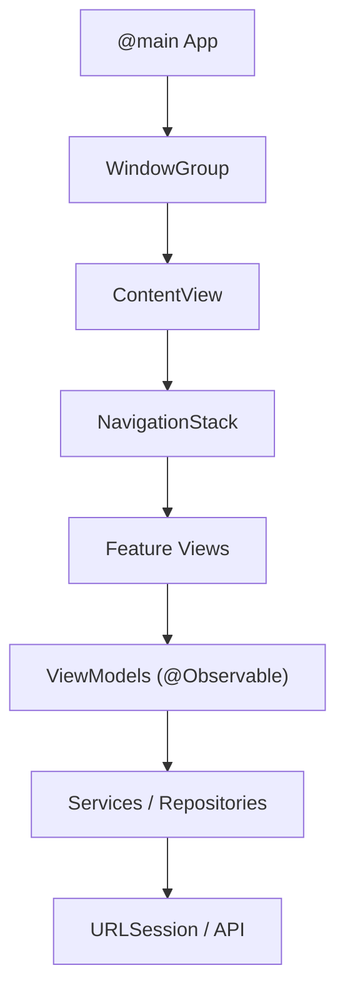

# How to Build iOS Apps with SwiftUI

Author: [nawazdhandala](https://github.com/nawazdhandala)

Tags: Swift, SwiftUI, iOS, Apple, Mobile Development

Description: A comprehensive guide to building iOS applications with SwiftUI, covering views, state management, navigation, and modern app architecture patterns.

---

SwiftUI changed how we build iOS apps. Instead of the imperative approach where you manually manipulate UI elements (set this label's text, hide this button, reload this table), SwiftUI uses a declarative model. You describe what the UI should look like for a given state, and the framework figures out the transitions.

If you've worked with React or Flutter, this will feel familiar. If you're coming from UIKit, it takes a bit of mental adjustment - but once it clicks, you'll wonder how you ever built apps the old way.

---

## Getting Started

You'll need Xcode 15 or later. Create a new project and select "App" under iOS, making sure SwiftUI is selected for the interface. Xcode generates a basic project with `ContentView.swift` as your starting point.

```swift
// ContentView.swift
import SwiftUI

struct ContentView: View {
    // Every SwiftUI view must have a body property
    // that returns some View
    var body: some View {
        VStack {
            Image(systemName: "globe")
                .imageScale(.large)
                .foregroundStyle(.tint)
            Text("Hello, world!")
        }
        .padding()
    }
}

// Preview provider lets you see changes in real-time
#Preview {
    ContentView()
}
```

The `body` property is where you define your view hierarchy. SwiftUI views are structs, not classes - they're lightweight value types that get recreated whenever state changes.

---

## Building Basic Views

SwiftUI provides a rich set of built-in views. Here are the ones you'll use constantly:

```swift
struct BasicViewsExample: View {
    var body: some View {
        VStack(alignment: .leading, spacing: 16) {
            // Text with styling
            Text("Welcome Back")
                .font(.largeTitle)
                .fontWeight(.bold)

            // Text field for user input
            TextField("Enter your email", text: .constant(""))
                .textFieldStyle(.roundedBorder)
                .keyboardType(.emailAddress)

            // Secure field for passwords
            SecureField("Password", text: .constant(""))
                .textFieldStyle(.roundedBorder)

            // Button with action
            Button("Sign In") {
                print("Sign in tapped")
            }
            .buttonStyle(.borderedProminent)

            // Horizontal stack for side-by-side layout
            HStack {
                Image(systemName: "checkmark.circle.fill")
                    .foregroundColor(.green)
                Text("Remember me")
            }
        }
        .padding()
    }
}
```

Layout in SwiftUI uses stacks: `VStack` for vertical, `HStack` for horizontal, and `ZStack` for layering views on top of each other. You control spacing and alignment through initializer parameters.

---

## State Management with Property Wrappers

This is where SwiftUI really shines - and where beginners often get confused. SwiftUI uses property wrappers to manage state and trigger UI updates automatically.

| Property Wrapper | Use Case | Ownership |
|-----------------|----------|-----------|
| `@State` | Local view state (toggles, text input) | View owns it |
| `@Binding` | Two-way connection to parent's state | Parent owns it |
| `@StateObject` | Reference type that view creates | View owns it |
| `@ObservedObject` | Reference type passed from parent | Parent owns it |
| `@EnvironmentObject` | Shared data across view hierarchy | App/parent owns it |

Here's a practical example showing `@State` and `@Binding`:

```swift
// Parent view owns the state
struct CounterView: View {
    // @State creates a source of truth for this view
    @State private var count = 0

    var body: some View {
        VStack(spacing: 20) {
            Text("Count: \(count)")
                .font(.title)

            // Pass a binding to the child view
            // The $ prefix creates a Binding from State
            CounterControls(count: $count)
        }
    }
}

// Child view receives a binding
struct CounterControls: View {
    // @Binding lets this view read and write parent's state
    @Binding var count: Int

    var body: some View {
        HStack(spacing: 20) {
            Button("-") { count -= 1 }
                .buttonStyle(.bordered)

            Button("+") { count += 1 }
                .buttonStyle(.bordered)
        }
    }
}
```

When `count` changes, both views automatically re-render. You don't need to manually update labels or call any refresh methods.

---

## Lists and Navigation

Most apps need to display collections of data. Here's how to build a list with navigation:

```swift
// Model - must be Identifiable for lists
struct Task: Identifiable {
    let id = UUID()
    var title: String
    var isComplete: Bool
}

struct TaskListView: View {
    @State private var tasks = [
        Task(title: "Review pull request", isComplete: false),
        Task(title: "Update documentation", isComplete: true),
        Task(title: "Fix login bug", isComplete: false)
    ]

    var body: some View {
        NavigationStack {
            List {
                ForEach($tasks) { $task in
                    // NavigationLink pushes detail view
                    NavigationLink {
                        TaskDetailView(task: $task)
                    } label: {
                        TaskRow(task: task)
                    }
                }
                .onDelete(perform: deleteTasks)
            }
            .navigationTitle("Tasks")
            .toolbar {
                EditButton()
            }
        }
    }

    private func deleteTasks(at offsets: IndexSet) {
        tasks.remove(atOffsets: offsets)
    }
}

struct TaskRow: View {
    let task: Task

    var body: some View {
        HStack {
            Image(systemName: task.isComplete ? "checkmark.circle.fill" : "circle")
                .foregroundColor(task.isComplete ? .green : .gray)
            Text(task.title)
                .strikethrough(task.isComplete)
        }
    }
}

struct TaskDetailView: View {
    @Binding var task: Task

    var body: some View {
        Form {
            TextField("Title", text: $task.title)
            Toggle("Completed", isOn: $task.isComplete)
        }
        .navigationTitle("Edit Task")
    }
}
```

Notice how `ForEach($tasks)` gives us bindings to each element, which we pass down to detail views. Changes in the detail view automatically reflect in the list.

---

## Networking with async/await

Modern Swift uses structured concurrency for async operations. Here's a complete example fetching data from an API:

```swift
// Model matching your JSON response
struct User: Codable, Identifiable {
    let id: Int
    let name: String
    let email: String
}

// Network layer - keeps API calls separate
class UserService {
    func fetchUsers() async throws -> [User] {
        let url = URL(string: "https://jsonplaceholder.typicode.com/users")!
        let (data, response) = try await URLSession.shared.data(from: url)

        guard let httpResponse = response as? HTTPURLResponse,
              httpResponse.statusCode == 200 else {
            throw URLError(.badServerResponse)
        }

        return try JSONDecoder().decode([User].self, from: data)
    }
}

struct UserListView: View {
    @State private var users: [User] = []
    @State private var isLoading = false
    @State private var errorMessage: String?

    private let service = UserService()

    var body: some View {
        NavigationStack {
            Group {
                if isLoading {
                    ProgressView("Loading users...")
                } else if let error = errorMessage {
                    ContentUnavailableView(
                        "Failed to Load",
                        systemImage: "wifi.exclamationmark",
                        description: Text(error)
                    )
                } else {
                    List(users) { user in
                        VStack(alignment: .leading) {
                            Text(user.name)
                                .font(.headline)
                            Text(user.email)
                                .font(.subheadline)
                                .foregroundColor(.secondary)
                        }
                    }
                }
            }
            .navigationTitle("Users")
            .task {
                // .task runs when view appears and cancels on disappear
                await loadUsers()
            }
            .refreshable {
                // Pull-to-refresh support
                await loadUsers()
            }
        }
    }

    private func loadUsers() async {
        isLoading = true
        errorMessage = nil

        do {
            users = try await service.fetchUsers()
        } catch {
            errorMessage = error.localizedDescription
        }

        isLoading = false
    }
}
```

The `.task` modifier is perfect for loading data - it automatically handles cancellation when the view disappears.

---

## MVVM Architecture

For larger apps, separating view logic into a ViewModel keeps things manageable:

```swift
// ViewModel - handles business logic and state
@Observable
class TaskViewModel {
    var tasks: [Task] = []
    var isLoading = false
    var errorMessage: String?

    private let repository: TaskRepository

    init(repository: TaskRepository = TaskRepository()) {
        self.repository = repository
    }

    func loadTasks() async {
        isLoading = true
        do {
            tasks = try await repository.fetchTasks()
            errorMessage = nil
        } catch {
            errorMessage = error.localizedDescription
        }
        isLoading = false
    }

    func addTask(_ title: String) {
        let task = Task(title: title, isComplete: false)
        tasks.append(task)
    }

    func toggleComplete(_ task: Task) {
        if let index = tasks.firstIndex(where: { $0.id == task.id }) {
            tasks[index].isComplete.toggle()
        }
    }
}

// View stays focused on presentation
struct TaskView: View {
    @State private var viewModel = TaskViewModel()
    @State private var newTaskTitle = ""

    var body: some View {
        NavigationStack {
            List {
                Section {
                    HStack {
                        TextField("New task", text: $newTaskTitle)
                        Button("Add") {
                            viewModel.addTask(newTaskTitle)
                            newTaskTitle = ""
                        }
                        .disabled(newTaskTitle.isEmpty)
                    }
                }

                Section("Tasks") {
                    ForEach(viewModel.tasks) { task in
                        Button {
                            viewModel.toggleComplete(task)
                        } label: {
                            TaskRow(task: task)
                        }
                        .buttonStyle(.plain)
                    }
                }
            }
            .navigationTitle("My Tasks")
            .task {
                await viewModel.loadTasks()
            }
        }
    }
}
```

The `@Observable` macro (iOS 17+) simplifies observation - any property changes automatically trigger view updates. For earlier iOS versions, use `ObservableObject` with `@Published` properties.

---

## App Structure



---

## Common Patterns and Tips

A few things that will save you time:

1. **Use preview liberally** - Create multiple `#Preview` blocks with different states (loading, error, empty, populated).

2. **Extract reusable views** - If you copy-paste a view more than once, pull it into its own struct.

3. **Keep views small** - A view doing too much is hard to reason about. Split early.

4. **Prefer value types** - Use structs for models when possible. Only reach for classes (and `@Observable`) when you need shared mutable state.

5. **Test ViewModels** - Since they're plain Swift classes, ViewModels are easy to unit test without UI testing frameworks.

---

## Wrapping Up

SwiftUI makes iOS development faster and more enjoyable once you get comfortable with the declarative mindset. Start with simple views, understand the property wrappers, and gradually add complexity as needed.

The examples in this post should give you a solid foundation. From here, explore modifiers, custom animations, and integrating with UIKit when SwiftUI doesn't have what you need.

Build something, break it, fix it - that's how you really learn.
