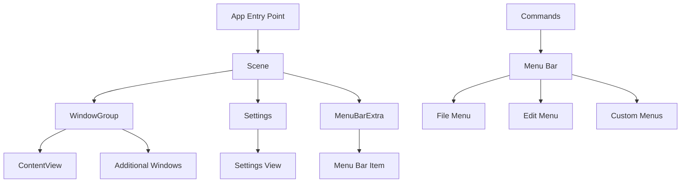

# How to Build macOS Applications with SwiftUI

Author: [nawazdhandala](https://github.com/nawazdhandala)

Tags: Swift, SwiftUI, macOS, Desktop, Apple, Native Development

Description: A comprehensive guide to building native macOS applications with SwiftUI, covering window management, menu bars, document-based apps, system integration, and desktop-specific UI patterns.

---

SwiftUI has transformed macOS development. What once required deep knowledge of AppKit, delegates, and manual memory management can now be expressed in clean, declarative Swift code. You describe what you want, and SwiftUI handles the rest.

But macOS is not iOS with a bigger screen. Desktop apps have different expectations: multiple windows, menu bars, keyboard shortcuts, drag and drop, and integration with system services. This guide covers everything you need to build professional macOS applications with SwiftUI.

---

## Why SwiftUI for macOS?

Before diving into code, let's understand why SwiftUI makes sense for macOS development:

| Aspect | AppKit | SwiftUI |
|--------|--------|---------|
| **Learning Curve** | Steep | Moderate |
| **Code Volume** | High | Low |
| **UI Updates** | Manual | Automatic |
| **Preview Support** | Limited | Excellent |
| **Cross-Platform** | No | Yes (iOS, watchOS, tvOS) |
| **System Integration** | Full | Good (improving) |

SwiftUI does not replace AppKit completely. For complex requirements, you can still drop down to AppKit using `NSViewRepresentable`. But for most applications, SwiftUI provides everything you need.

---

## Setting Up Your First macOS App

Open Xcode and create a new project. Select macOS > App, choose SwiftUI for the interface, and Swift for the language. Xcode generates a basic project structure.

```swift
// YourAppNameApp.swift
// This is the entry point for your macOS application
// The @main attribute tells Swift this is where execution begins
import SwiftUI

@main
struct MacOSExampleApp: App {
    var body: some Scene {
        // WindowGroup creates a standard resizable window
        // SwiftUI handles window lifecycle automatically
        WindowGroup {
            ContentView()
        }
        // Add commands to the menu bar
        .commands {
            // Custom commands go here
            CommandMenu("Tools") {
                Button("Run Analysis") {
                    print("Running analysis...")
                }
                .keyboardShortcut("r", modifiers: [.command, .shift])
            }
        }
    }
}
```

The `App` protocol defines your application's structure. Unlike iOS where you typically have one window, macOS apps use `Scene` to manage multiple windows, settings panels, and menu bar items.

---

## Understanding macOS App Architecture

macOS applications have a unique structure that differs from iOS. Here's how the pieces fit together:



This architecture gives you flexibility to create different types of macOS applications:

- **Single Window Apps**: Calculators, utilities, simple tools
- **Multi-Window Apps**: Code editors, image processors
- **Document-Based Apps**: Text editors, spreadsheets
- **Menu Bar Apps**: System monitors, quick utilities

---

## Building Your First View

Let's create a practical example: a system monitor that displays CPU and memory usage.

```swift
// ContentView.swift
// Main view displaying system information
// This demonstrates macOS-specific layout patterns
import SwiftUI

struct ContentView: View {
    // State to hold our system metrics
    // @State creates a source of truth for this view
    @State private var cpuUsage: Double = 0.0
    @State private var memoryUsage: Double = 0.0
    @State private var isMonitoring = false

    var body: some View {
        VStack(spacing: 20) {
            // Header with system icon
            HStack {
                Image(systemName: "cpu")
                    .font(.largeTitle)
                    .foregroundStyle(.blue)
                Text("System Monitor")
                    .font(.title)
                    .fontWeight(.semibold)
            }

            Divider()

            // CPU Usage gauge
            GaugeView(
                title: "CPU Usage",
                value: cpuUsage,
                color: cpuUsage > 80 ? .red : .green
            )

            // Memory Usage gauge
            GaugeView(
                title: "Memory Usage",
                value: memoryUsage,
                color: memoryUsage > 80 ? .orange : .blue
            )

            Divider()

            // Control button
            Button(isMonitoring ? "Stop Monitoring" : "Start Monitoring") {
                isMonitoring.toggle()
                if isMonitoring {
                    startMonitoring()
                }
            }
            .buttonStyle(.borderedProminent)
            .controlSize(.large)
        }
        .padding(30)
        .frame(minWidth: 300, minHeight: 400)
    }

    // Simulated monitoring function
    // In production, you would use system APIs
    private func startMonitoring() {
        Timer.scheduledTimer(withTimeInterval: 1.0, repeats: true) { timer in
            if !isMonitoring {
                timer.invalidate()
                return
            }
            cpuUsage = Double.random(in: 20...80)
            memoryUsage = Double.random(in: 40...70)
        }
    }
}
```

Now let's create the reusable gauge component:

```swift
// GaugeView.swift
// A reusable circular gauge component for displaying percentages
// Demonstrates custom drawing and animation in SwiftUI
import SwiftUI

struct GaugeView: View {
    let title: String
    let value: Double
    let color: Color

    var body: some View {
        VStack(spacing: 8) {
            // Circular progress indicator
            ZStack {
                // Background circle
                Circle()
                    .stroke(Color.gray.opacity(0.2), lineWidth: 10)

                // Progress circle
                Circle()
                    .trim(from: 0, to: value / 100)
                    .stroke(color, style: StrokeStyle(
                        lineWidth: 10,
                        lineCap: .round
                    ))
                    .rotationEffect(.degrees(-90))
                    .animation(.easeInOut(duration: 0.5), value: value)

                // Percentage text
                Text("\(Int(value))%")
                    .font(.title2)
                    .fontWeight(.bold)
                    .monospacedDigit()
            }
            .frame(width: 100, height: 100)

            Text(title)
                .font(.headline)
                .foregroundStyle(.secondary)
        }
    }
}
```

---

## Window Management

macOS apps often need multiple windows. SwiftUI makes this straightforward with different scene types.

```swift
// App with multiple window types
// Shows how to manage different window configurations
import SwiftUI

@main
struct MultiWindowApp: App {
    var body: some Scene {
        // Main window group - users can open multiple instances
        WindowGroup {
            ContentView()
        }
        .windowStyle(.automatic)
        .defaultSize(width: 800, height: 600)

        // Settings window - single instance
        // Accessible via Preferences menu (Cmd+,)
        Settings {
            SettingsView()
        }

        // Auxiliary window for a specific purpose
        // Opens with Window > Inspector menu
        WindowGroup("Inspector", id: "inspector") {
            InspectorView()
        }
        .defaultSize(width: 300, height: 400)
        .defaultPosition(.trailing)

        // Menu bar extra - lives in the system menu bar
        MenuBarExtra("Monitor", systemImage: "chart.bar") {
            MenuBarView()
        }
        .menuBarExtraStyle(.window)
    }
}
```

### Opening Windows Programmatically

You can open windows from anywhere in your app using the environment:

```swift
// View that can open other windows
// Demonstrates programmatic window management
import SwiftUI

struct MainView: View {
    // Access the openWindow action from the environment
    @Environment(\.openWindow) private var openWindow

    var body: some View {
        VStack(spacing: 20) {
            Text("Main Application")
                .font(.largeTitle)

            Button("Open Inspector") {
                // Opens the window with the matching id
                openWindow(id: "inspector")
            }

            Button("Open New Document") {
                // Opens a new instance of the default WindowGroup
                openWindow(id: "document")
            }
        }
        .padding()
    }
}
```

---

## Menu Bar Integration

A well-designed macOS app integrates with the system menu bar. SwiftUI provides the `Commands` modifier for this purpose.

```swift
// Comprehensive menu bar configuration
// Shows standard and custom menu implementations
import SwiftUI

@main
struct MenuBarApp: App {
    // App state that can be accessed from menus
    @State private var selectedDocument: Document?

    var body: some Scene {
        WindowGroup {
            ContentView()
        }
        .commands {
            // Replace the default New Item command
            CommandGroup(replacing: .newItem) {
                Button("New Document") {
                    createNewDocument()
                }
                .keyboardShortcut("n", modifiers: .command)

                Button("New from Template...") {
                    showTemplateSheet()
                }
                .keyboardShortcut("n", modifiers: [.command, .shift])
            }

            // Add items after the pasteboard commands (copy, paste, etc.)
            CommandGroup(after: .pasteboard) {
                Divider()
                Button("Paste and Match Style") {
                    pasteMatchingStyle()
                }
                .keyboardShortcut("v", modifiers: [.command, .option, .shift])
            }

            // Create entirely new menu
            CommandMenu("Analysis") {
                Button("Run Full Analysis") {
                    runAnalysis()
                }
                .keyboardShortcut("r", modifiers: .command)

                Button("Quick Scan") {
                    runQuickScan()
                }
                .keyboardShortcut("r", modifiers: [.command, .shift])

                Divider()

                Menu("Export Results") {
                    Button("As PDF") { exportPDF() }
                    Button("As CSV") { exportCSV() }
                    Button("As JSON") { exportJSON() }
                }
            }

            // Sidebar toggle for NavigationSplitView
            SidebarCommands()

            // Standard toolbar customization
            ToolbarCommands()
        }
    }

    private func createNewDocument() { }
    private func showTemplateSheet() { }
    private func pasteMatchingStyle() { }
    private func runAnalysis() { }
    private func runQuickScan() { }
    private func exportPDF() { }
    private func exportCSV() { }
    private func exportJSON() { }
}
```

---

## Navigation Patterns for macOS

Desktop applications typically use sidebar navigation with a three-column layout. SwiftUI's `NavigationSplitView` handles this elegantly.

```swift
// Three-column navigation layout
// Standard pattern for productivity apps like Mail, Notes, Finder
import SwiftUI

struct NavigationExample: View {
    // Track selected items at each level
    @State private var selectedCategory: Category?
    @State private var selectedItem: Item?

    var body: some View {
        NavigationSplitView {
            // First column: Categories
            List(Category.all, selection: $selectedCategory) { category in
                Label(category.name, systemImage: category.icon)
            }
            .navigationSplitViewColumnWidth(min: 180, ideal: 200)
        } content: {
            // Second column: Items in selected category
            if let category = selectedCategory {
                List(category.items, selection: $selectedItem) { item in
                    ItemRow(item: item)
                }
                .navigationSplitViewColumnWidth(min: 200, ideal: 250)
            } else {
                Text("Select a category")
                    .foregroundStyle(.secondary)
            }
        } detail: {
            // Third column: Detail view
            if let item = selectedItem {
                ItemDetailView(item: item)
            } else {
                Text("Select an item to view details")
                    .foregroundStyle(.secondary)
                    .frame(maxWidth: .infinity, maxHeight: .infinity)
            }
        }
        .navigationTitle("My Application")
    }
}

// Supporting types
struct Category: Identifiable, Hashable {
    let id = UUID()
    let name: String
    let icon: String
    var items: [Item] = []

    static let all = [
        Category(name: "Documents", icon: "doc.fill"),
        Category(name: "Images", icon: "photo.fill"),
        Category(name: "Archives", icon: "archivebox.fill")
    ]
}

struct Item: Identifiable, Hashable {
    let id = UUID()
    let name: String
    let dateModified: Date
}
```

---

## Tables for Data Display

macOS excels at displaying tabular data. SwiftUI provides a native `Table` view that supports sorting, selection, and column customization.

```swift
// Table view with sorting and selection
// Ideal for file managers, database viewers, log analyzers
import SwiftUI

struct TableExample: View {
    // Sample data
    @State private var files: [FileItem] = FileItem.sampleData

    // Track which columns are sorted
    @State private var sortOrder = [KeyPathComparator(\FileItem.name)]

    // Track selected rows
    @State private var selection = Set<FileItem.ID>()

    var body: some View {
        Table(files, selection: $selection, sortOrder: $sortOrder) {
            // Name column with icon
            TableColumn("Name", sortUsing: KeyPathComparator(\FileItem.name)) { file in
                Label(file.name, systemImage: file.icon)
            }
            .width(min: 150, ideal: 200)

            // Size column
            TableColumn("Size", sortUsing: KeyPathComparator(\FileItem.size)) { file in
                Text(file.formattedSize)
                    .monospacedDigit()
            }
            .width(80)

            // Date column
            TableColumn("Date Modified", sortUsing: KeyPathComparator(\FileItem.dateModified)) { file in
                Text(file.dateModified, style: .date)
            }
            .width(min: 100, ideal: 120)

            // Kind column
            TableColumn("Kind") { file in
                Text(file.kind)
                    .foregroundStyle(.secondary)
            }
            .width(min: 80, ideal: 100)
        }
        .onChange(of: sortOrder) { _, newOrder in
            files.sort(using: newOrder)
        }
        .contextMenu(forSelectionType: FileItem.ID.self) { items in
            // Context menu for selected items
            Button("Open") { openFiles(items) }
            Button("Delete", role: .destructive) { deleteFiles(items) }
        } primaryAction: { items in
            // Double-click action
            openFiles(items)
        }
    }

    private func openFiles(_ ids: Set<FileItem.ID>) { }
    private func deleteFiles(_ ids: Set<FileItem.ID>) { }
}

// Data model for table
struct FileItem: Identifiable {
    let id = UUID()
    let name: String
    let size: Int64
    let dateModified: Date
    let kind: String
    let icon: String

    var formattedSize: String {
        ByteCountFormatter.string(fromByteCount: size, countStyle: .file)
    }

    static let sampleData = [
        FileItem(name: "Document.pdf", size: 1024000, dateModified: Date(), kind: "PDF", icon: "doc.fill"),
        FileItem(name: "Photo.jpg", size: 2048000, dateModified: Date().addingTimeInterval(-86400), kind: "Image", icon: "photo.fill"),
        FileItem(name: "Archive.zip", size: 5120000, dateModified: Date().addingTimeInterval(-172800), kind: "Archive", icon: "archivebox.fill")
    ]
}
```

---

## Drag and Drop

Desktop users expect drag and drop. SwiftUI makes this surprisingly simple.

```swift
// Drag and drop implementation
// Shows both dragging from and dropping onto views
import SwiftUI
import UniformTypeIdentifiers

struct DragDropExample: View {
    @State private var items: [String] = ["Item 1", "Item 2", "Item 3"]
    @State private var droppedText: String = ""

    var body: some View {
        HStack(spacing: 20) {
            // Source list - items can be dragged from here
            VStack(alignment: .leading) {
                Text("Source")
                    .font(.headline)

                ForEach(items, id: \.self) { item in
                    Text(item)
                        .padding(8)
                        .background(Color.blue.opacity(0.1))
                        .cornerRadius(6)
                        // Make this view draggable
                        .draggable(item) {
                            // Custom drag preview
                            Text(item)
                                .padding(8)
                                .background(Color.blue)
                                .foregroundColor(.white)
                                .cornerRadius(6)
                        }
                }
            }
            .frame(width: 150)

            // Drop target - items can be dropped here
            VStack {
                Text("Drop Zone")
                    .font(.headline)

                ZStack {
                    RoundedRectangle(cornerRadius: 12)
                        .strokeBorder(style: StrokeStyle(lineWidth: 2, dash: [10]))
                        .foregroundStyle(.secondary)

                    if droppedText.isEmpty {
                        Text("Drop items here")
                            .foregroundStyle(.secondary)
                    } else {
                        Text("Dropped: \(droppedText)")
                    }
                }
                .frame(height: 200)
                // Accept drops of String type
                .dropDestination(for: String.self) { items, location in
                    droppedText = items.joined(separator: ", ")
                    return true
                }
            }
        }
        .padding()
    }
}
```

### File Drop Support

For accepting file drops, use `URL` as the transferable type:

```swift
// File drop zone
// Accepts dropped files from Finder
import SwiftUI

struct FileDropZone: View {
    @State private var droppedFiles: [URL] = []
    @State private var isTargeted = false

    var body: some View {
        VStack {
            ZStack {
                RoundedRectangle(cornerRadius: 12)
                    .fill(isTargeted ? Color.blue.opacity(0.2) : Color.gray.opacity(0.1))
                    .strokeBorder(isTargeted ? Color.blue : Color.gray, lineWidth: 2)

                VStack(spacing: 12) {
                    Image(systemName: "arrow.down.doc")
                        .font(.system(size: 48))
                        .foregroundStyle(isTargeted ? .blue : .secondary)

                    Text("Drop files here")
                        .font(.headline)
                        .foregroundStyle(isTargeted ? .blue : .secondary)
                }
            }
            .frame(height: 200)
            .dropDestination(for: URL.self) { urls, location in
                droppedFiles = urls
                return true
            } isTargeted: { targeted in
                isTargeted = targeted
            }

            // Show dropped files
            if !droppedFiles.isEmpty {
                List(droppedFiles, id: \.self) { url in
                    Label(url.lastPathComponent, systemImage: "doc.fill")
                }
            }
        }
        .padding()
    }
}
```

---

## Keyboard Shortcuts

Professional macOS apps respond to keyboard shortcuts. SwiftUI makes this easy with the `keyboardShortcut` modifier.

```swift
// Keyboard shortcut examples
// Shows various shortcut patterns for macOS
import SwiftUI

struct KeyboardShortcutExample: View {
    @State private var isPlaying = false
    @State private var volume: Double = 0.5

    var body: some View {
        VStack(spacing: 20) {
            // Play/Pause with Space
            Button(isPlaying ? "Pause" : "Play") {
                isPlaying.toggle()
            }
            .keyboardShortcut(.space, modifiers: [])

            // Volume controls with arrow keys
            HStack {
                Button("Volume Down") {
                    volume = max(0, volume - 0.1)
                }
                .keyboardShortcut(.downArrow, modifiers: .command)

                Slider(value: $volume)
                    .frame(width: 200)

                Button("Volume Up") {
                    volume = min(1, volume + 0.1)
                }
                .keyboardShortcut(.upArrow, modifiers: .command)
            }

            // Common shortcuts
            HStack(spacing: 40) {
                Button("Save") { save() }
                    .keyboardShortcut("s", modifiers: .command)

                Button("Save As...") { saveAs() }
                    .keyboardShortcut("s", modifiers: [.command, .shift])

                Button("Export") { export() }
                    .keyboardShortcut("e", modifiers: .command)
            }
            .buttonStyle(.bordered)
        }
        .padding()
    }

    private func save() { }
    private func saveAs() { }
    private func export() { }
}
```

---

## Document-Based Apps

For apps that work with files (text editors, image editors, etc.), SwiftUI provides the `DocumentGroup` scene.

```swift
// Document-based application setup
// Handles file creation, opening, and saving automatically
import SwiftUI
import UniformTypeIdentifiers

@main
struct DocumentApp: App {
    var body: some Scene {
        DocumentGroup(newDocument: TextDocument()) { file in
            DocumentEditor(document: file.$document)
        }
        .commands {
            TextFormattingCommands()
        }
    }
}

// Define your document type
struct TextDocument: FileDocument {
    // Supported file types
    static var readableContentTypes: [UTType] { [.plainText] }

    var text: String

    // Initialize empty document
    init(text: String = "") {
        self.text = text
    }

    // Read from file
    init(configuration: ReadConfiguration) throws {
        guard let data = configuration.file.regularFileContents,
              let string = String(data: data, encoding: .utf8)
        else {
            throw CocoaError(.fileReadCorruptFile)
        }
        text = string
    }

    // Write to file
    func fileWrapper(configuration: WriteConfiguration) throws -> FileWrapper {
        let data = text.data(using: .utf8)!
        return FileWrapper(regularFileWithContents: data)
    }
}

// Document editor view
struct DocumentEditor: View {
    @Binding var document: TextDocument

    var body: some View {
        TextEditor(text: $document.text)
            .font(.system(.body, design: .monospaced))
            .padding()
    }
}
```

---

## System Integration

macOS apps can integrate with system services like notifications and file system access.

```swift
// System integration examples
// Shows notifications, file dialogs, and system preferences
import SwiftUI
import UserNotifications

struct SystemIntegrationView: View {
    @State private var selectedFile: URL?

    var body: some View {
        VStack(spacing: 20) {
            // Send notification
            Button("Send Notification") {
                sendNotification()
            }

            // File picker
            Button("Select File") {
                selectFile()
            }

            if let file = selectedFile {
                Text("Selected: \(file.lastPathComponent)")
            }

            // Open system preferences
            Button("Open System Settings") {
                NSWorkspace.shared.open(URL(string: "x-apple.systempreferences:")!)
            }
        }
        .padding()
    }

    private func sendNotification() {
        let content = UNMutableNotificationContent()
        content.title = "Task Complete"
        content.body = "Your analysis has finished."
        content.sound = .default

        let request = UNNotificationRequest(
            identifier: UUID().uuidString,
            content: content,
            trigger: nil
        )

        UNUserNotificationCenter.current().add(request)
    }

    private func selectFile() {
        let panel = NSOpenPanel()
        panel.allowsMultipleSelection = false
        panel.canChooseDirectories = false
        panel.canChooseFiles = true

        if panel.runModal() == .OK {
            selectedFile = panel.url
        }
    }
}
```

---

## Styling and Theming

macOS apps should respect the user's appearance settings while maintaining their own identity.

```swift
// Custom styling that respects system appearance
// Shows how to create consistent visual identity
import SwiftUI

struct StyledView: View {
    // Detect current color scheme
    @Environment(\.colorScheme) var colorScheme

    var body: some View {
        VStack(spacing: 16) {
            // Card with adaptive background
            VStack(alignment: .leading, spacing: 12) {
                Label("Status", systemImage: "checkmark.circle.fill")
                    .foregroundStyle(.green)
                    .font(.headline)

                Text("All systems operational")
                    .foregroundStyle(.secondary)
            }
            .padding()
            .frame(maxWidth: .infinity, alignment: .leading)
            .background {
                RoundedRectangle(cornerRadius: 12)
                    .fill(colorScheme == .dark
                        ? Color.white.opacity(0.05)
                        : Color.black.opacity(0.03))
            }

            // Vibrancy effect for sidebar-like appearance
            VStack {
                Text("Sidebar Item")
            }
            .padding()
            .background(.ultraThinMaterial)
            .cornerRadius(8)
        }
        .padding()
    }
}

// Custom button style
struct MacButtonStyle: ButtonStyle {
    func makeBody(configuration: Configuration) -> some View {
        configuration.label
            .padding(.horizontal, 16)
            .padding(.vertical, 8)
            .background(
                RoundedRectangle(cornerRadius: 6)
                    .fill(configuration.isPressed
                        ? Color.accentColor.opacity(0.8)
                        : Color.accentColor)
            )
            .foregroundColor(.white)
            .scaleEffect(configuration.isPressed ? 0.98 : 1.0)
    }
}
```

---

## AppKit Integration

When SwiftUI does not provide what you need, wrap AppKit components:

```swift
// Wrapping NSView for SwiftUI
// Use this pattern for AppKit functionality not yet in SwiftUI
import SwiftUI
import AppKit

// Example: Color well (color picker)
struct ColorWell: NSViewRepresentable {
    @Binding var color: Color

    func makeNSView(context: Context) -> NSColorWell {
        let well = NSColorWell()
        well.color = NSColor(color)
        well.target = context.coordinator
        well.action = #selector(Coordinator.colorChanged(_:))
        return well
    }

    func updateNSView(_ nsView: NSColorWell, context: Context) {
        nsView.color = NSColor(color)
    }

    func makeCoordinator() -> Coordinator {
        Coordinator(color: $color)
    }

    class Coordinator: NSObject {
        var color: Binding<Color>

        init(color: Binding<Color>) {
            self.color = color
        }

        @objc func colorChanged(_ sender: NSColorWell) {
            color.wrappedValue = Color(sender.color)
        }
    }
}

// Usage
struct ColorPickerExample: View {
    @State private var selectedColor = Color.blue

    var body: some View {
        HStack {
            Text("Select Color:")
            ColorWell(color: $selectedColor)
                .frame(width: 44, height: 24)
        }
    }
}
```

---

## Best Practices

Building professional macOS apps requires attention to platform conventions:

### 1. Respect System Preferences

```swift
// Check for reduced motion preference
@Environment(\.accessibilityReduceMotion) var reduceMotion

// Use appropriate animation
.animation(reduceMotion ? nil : .spring(), value: isExpanded)
```

### 2. Use Standard Keyboard Shortcuts

Follow Apple's Human Interface Guidelines for shortcuts:

- Command+N: New
- Command+O: Open
- Command+S: Save
- Command+W: Close window
- Command+Q: Quit

### 3. Support Window Restoration

macOS can restore windows on relaunch. Use `@SceneStorage` to persist state:

```swift
// Persist state across app launches
@SceneStorage("selectedTab") private var selectedTab = 0
```

### 4. Handle Window Size Appropriately

```swift
WindowGroup {
    ContentView()
}
.defaultSize(width: 800, height: 600)
.windowResizability(.contentSize)
```

### 5. Provide Contextual Help

```swift
Text("API Key")
    .help("Enter your API key from the dashboard")
```

---

## Data Flow in macOS Apps

Understanding how data flows through your application is critical for building maintainable macOS apps.

```mermaid
flowchart TD
    A[App State] --> B[Observable Object]
    B --> C[View Model]
    C --> D[View]
    D --> E[User Action]
    E --> F[Intent/Command]
    F --> B

    G[@Environment] --> D
    H[@AppStorage] --> B
    I[@SceneStorage] --> D
```

---

## Performance Considerations

SwiftUI is efficient, but macOS apps often handle larger datasets than mobile apps:

```swift
// Use LazyVStack for long lists
ScrollView {
    LazyVStack {
        ForEach(items) { item in
            ItemRow(item: item)
        }
    }
}

// Implement pagination for very large datasets
struct PaginatedList: View {
    @State private var visibleItems: [Item] = []
    @State private var page = 0
    let pageSize = 50

    var body: some View {
        List(visibleItems) { item in
            ItemRow(item: item)
                .onAppear {
                    if item == visibleItems.last {
                        loadMore()
                    }
                }
        }
    }

    private func loadMore() {
        // Load next page
    }
}
```

---

## Testing Your macOS App

SwiftUI views are testable. Write unit tests for your view models and UI tests for critical flows:

```swift
// Unit test for view model
import XCTest
@testable import YourApp

final class DocumentViewModelTests: XCTestCase {
    func testSaveDocument() async throws {
        let viewModel = DocumentViewModel()
        viewModel.text = "Test content"

        try await viewModel.save()

        XCTAssertTrue(viewModel.isSaved)
    }
}
```

---

## Conclusion

SwiftUI has made macOS development more approachable than ever. You can now build native, performant desktop applications with less code and faster iteration cycles. The framework handles window management, menu integration, and system appearance automatically.

Key takeaways:

- Use `WindowGroup` for multi-window apps and `DocumentGroup` for document-based apps
- Integrate with the menu bar using `Commands`
- Support drag and drop with `draggable` and `dropDestination`
- Use `Table` for data-heavy views
- Wrap AppKit when needed with `NSViewRepresentable`
- Always respect system preferences and accessibility settings

Start small, understand the patterns, and incrementally add complexity. The SwiftUI ecosystem continues to improve with each release, closing the gap with AppKit while maintaining its declarative simplicity.

---

*Building reliable macOS applications requires robust monitoring. [OneUptime](https://oneuptime.com) helps you track application health, performance metrics, and user-reported issues across all your platforms.*

**Related Reading:**
- [How to Build iOS Apps with SwiftUI](https://oneuptime.com/blog/post/2026-02-02-swiftui-ios-apps/view)
- [How to Implement MVVM Architecture in SwiftUI](https://oneuptime.com/blog/post/2026-02-02-swiftui-mvvm-architecture/view)
