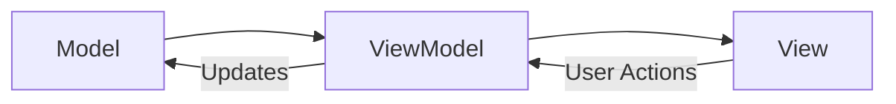

# How to Implement MVVM Architecture in SwiftUI

Author: [nawazdhandala](https://github.com/nawazdhandala)

Tags: Swift, SwiftUI, MVVM, Architecture, iOS

Description: Learn how to structure SwiftUI applications using MVVM architecture with ObservableObject, @Published, and clean separation of concerns.

---

If you've been building SwiftUI apps for a while, you've probably noticed that dumping all your logic into views gets messy fast. MVVM (Model-View-ViewModel) is a pattern that helps you organize code in a way that's easier to test, maintain, and reason about. The good news is that SwiftUI was basically designed with MVVM in mind - the framework provides tools like `ObservableObject` and `@Published` that make this pattern feel natural.

## What is MVVM?

MVVM splits your code into three layers:

- **Model**: Your data structures and business logic. Plain Swift types, no UI knowledge.
- **View**: The SwiftUI views that render UI. They observe ViewModels and react to changes.
- **ViewModel**: The middle layer that holds state, handles user actions, and prepares data for the View.

Here's how the data flows:



The View never touches the Model directly. Everything goes through the ViewModel.

## Building a ViewModel with ObservableObject

Let's build a simple task list app to see MVVM in action. First, the Model:

```swift
// Model - plain data structure
struct Task: Identifiable {
    let id: UUID
    var title: String
    var isCompleted: Bool

    init(id: UUID = UUID(), title: String, isCompleted: Bool = false) {
        self.id = id
        self.title = title
        self.isCompleted = isCompleted
    }
}
```

Now the ViewModel. This is where `ObservableObject` and `@Published` come in:

```swift
import Foundation
import Combine

// ViewModel - manages state and business logic
class TaskListViewModel: ObservableObject {
    // @Published properties automatically notify observers when they change
    @Published var tasks: [Task] = []
    @Published var newTaskTitle: String = ""
    @Published var isLoading: Bool = false
    @Published var errorMessage: String?

    // Computed property for filtered tasks
    var completedTasks: [Task] {
        tasks.filter { $0.isCompleted }
    }

    var pendingTasks: [Task] {
        tasks.filter { !$0.isCompleted }
    }

    // Add a new task
    func addTask() {
        // Validate input
        guard !newTaskTitle.trimmingCharacters(in: .whitespaces).isEmpty else {
            return
        }

        let task = Task(title: newTaskTitle)
        tasks.append(task)
        newTaskTitle = "" // Clear the input field
    }

    // Toggle task completion status
    func toggleTask(_ task: Task) {
        if let index = tasks.firstIndex(where: { $0.id == task.id }) {
            tasks[index].isCompleted.toggle()
        }
    }

    // Delete a task
    func deleteTask(at offsets: IndexSet) {
        tasks.remove(atOffsets: offsets)
    }
}
```

The `@Published` property wrapper is doing the heavy lifting here. Whenever a published property changes, SwiftUI automatically re-renders any views that depend on it.

## Connecting the View to the ViewModel

Now let's wire up the View:

```swift
import SwiftUI

struct TaskListView: View {
    // @StateObject creates and owns the ViewModel instance
    @StateObject private var viewModel = TaskListViewModel()

    var body: some View {
        NavigationView {
            VStack {
                // Input section
                HStack {
                    TextField("New task...", text: $viewModel.newTaskTitle)
                        .textFieldStyle(RoundedBorderTextFieldStyle())

                    Button(action: viewModel.addTask) {
                        Image(systemName: "plus.circle.fill")
                            .font(.title2)
                    }
                    .disabled(viewModel.newTaskTitle.isEmpty)
                }
                .padding()

                // Task list
                List {
                    ForEach(viewModel.tasks) { task in
                        TaskRowView(task: task) {
                            viewModel.toggleTask(task)
                        }
                    }
                    .onDelete(perform: viewModel.deleteTask)
                }
            }
            .navigationTitle("Tasks")
        }
    }
}

// Reusable row component
struct TaskRowView: View {
    let task: Task
    let onToggle: () -> Void

    var body: some View {
        HStack {
            Image(systemName: task.isCompleted ? "checkmark.circle.fill" : "circle")
                .foregroundColor(task.isCompleted ? .green : .gray)
                .onTapGesture(perform: onToggle)

            Text(task.title)
                .strikethrough(task.isCompleted)
                .foregroundColor(task.isCompleted ? .gray : .primary)
        }
    }
}
```

## @StateObject vs @ObservedObject

This trips up a lot of developers. Here's when to use each:

| Property Wrapper | Use When | Lifecycle |
|-----------------|----------|-----------|
| `@StateObject` | You're creating the ViewModel | Survives view re-renders |
| `@ObservedObject` | You're receiving a ViewModel from a parent | Can be recreated on re-render |

The rule is simple: **use `@StateObject` for ownership, `@ObservedObject` for passing down.**

```swift
// Parent view OWNS the ViewModel
struct ParentView: View {
    @StateObject private var viewModel = TaskListViewModel()

    var body: some View {
        // Child view RECEIVES the ViewModel
        ChildView(viewModel: viewModel)
    }
}

struct ChildView: View {
    // Use @ObservedObject because we don't own this ViewModel
    @ObservedObject var viewModel: TaskListViewModel

    var body: some View {
        Text("Tasks: \(viewModel.tasks.count)")
    }
}
```

## Dependency Injection for Better Testing

Hard-coding dependencies makes testing difficult. Instead, inject them into your ViewModel:

```swift
// Protocol for the data service
protocol TaskServiceProtocol {
    func fetchTasks() async throws -> [Task]
    func saveTasks(_ tasks: [Task]) async throws
}

// Real implementation
class TaskService: TaskServiceProtocol {
    func fetchTasks() async throws -> [Task] {
        // Fetch from API or database
        return []
    }

    func saveTasks(_ tasks: [Task]) async throws {
        // Save to storage
    }
}

// ViewModel with injected dependency
class TaskListViewModel: ObservableObject {
    @Published var tasks: [Task] = []
    @Published var isLoading: Bool = false
    @Published var errorMessage: String?

    private let taskService: TaskServiceProtocol

    // Inject the service - defaults to real implementation
    init(taskService: TaskServiceProtocol = TaskService()) {
        self.taskService = taskService
    }

    func loadTasks() async {
        isLoading = true
        errorMessage = nil

        do {
            let fetchedTasks = try await taskService.fetchTasks()
            // Update on main thread since @Published triggers UI updates
            await MainActor.run {
                self.tasks = fetchedTasks
                self.isLoading = false
            }
        } catch {
            await MainActor.run {
                self.errorMessage = error.localizedDescription
                self.isLoading = false
            }
        }
    }
}
```

## Testing Your ViewModel

Now testing becomes straightforward. Create a mock service and inject it:

```swift
import XCTest
@testable import YourApp

// Mock service for testing
class MockTaskService: TaskServiceProtocol {
    var tasksToReturn: [Task] = []
    var shouldThrowError = false

    func fetchTasks() async throws -> [Task] {
        if shouldThrowError {
            throw NSError(domain: "test", code: 1, userInfo: nil)
        }
        return tasksToReturn
    }

    func saveTasks(_ tasks: [Task]) async throws {
        // Track calls if needed
    }
}

class TaskListViewModelTests: XCTestCase {

    func testAddTask() {
        // Arrange
        let viewModel = TaskListViewModel()
        viewModel.newTaskTitle = "Buy groceries"

        // Act
        viewModel.addTask()

        // Assert
        XCTAssertEqual(viewModel.tasks.count, 1)
        XCTAssertEqual(viewModel.tasks.first?.title, "Buy groceries")
        XCTAssertTrue(viewModel.newTaskTitle.isEmpty) // Should be cleared
    }

    func testToggleTask() {
        // Arrange
        let viewModel = TaskListViewModel()
        let task = Task(title: "Test task")
        viewModel.tasks = [task]

        // Act
        viewModel.toggleTask(task)

        // Assert
        XCTAssertTrue(viewModel.tasks.first?.isCompleted == true)
    }

    func testLoadTasksSuccess() async {
        // Arrange
        let mockService = MockTaskService()
        mockService.tasksToReturn = [Task(title: "Fetched task")]
        let viewModel = TaskListViewModel(taskService: mockService)

        // Act
        await viewModel.loadTasks()

        // Assert
        XCTAssertEqual(viewModel.tasks.count, 1)
        XCTAssertFalse(viewModel.isLoading)
        XCTAssertNil(viewModel.errorMessage)
    }

    func testLoadTasksFailure() async {
        // Arrange
        let mockService = MockTaskService()
        mockService.shouldThrowError = true
        let viewModel = TaskListViewModel(taskService: mockService)

        // Act
        await viewModel.loadTasks()

        // Assert
        XCTAssertTrue(viewModel.tasks.isEmpty)
        XCTAssertFalse(viewModel.isLoading)
        XCTAssertNotNil(viewModel.errorMessage)
    }
}
```

## Quick Tips

1. **Keep ViewModels focused** - one ViewModel per screen or feature, not one giant ViewModel for the whole app.

2. **Don't import SwiftUI in ViewModels** - they should only import Foundation and Combine. This keeps them testable without UI dependencies.

3. **Use `@MainActor`** - if your ViewModel does a lot of async work, consider marking the whole class with `@MainActor` to avoid threading issues:

```swift
@MainActor
class TaskListViewModel: ObservableObject {
    // All updates happen on main thread automatically
}
```

4. **Avoid putting navigation logic in ViewModels** - let the View handle navigation. ViewModels expose state, Views decide how to present it.

## Wrapping Up

MVVM in SwiftUI is really about keeping your Views dumb and your logic testable. The framework gives you `ObservableObject` and `@Published` to make this easy - use them. Start with a simple ViewModel, inject your dependencies, and write tests. Your future self will thank you when you need to debug that weird state bug at 2 AM.
