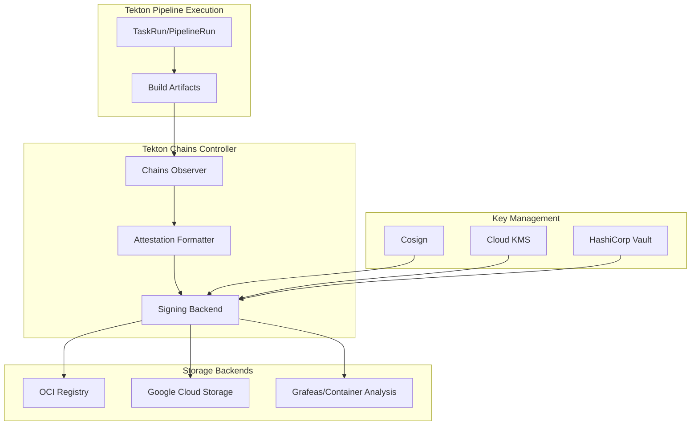
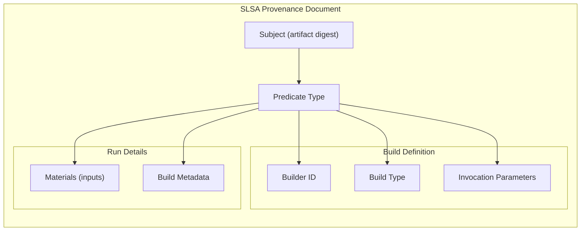
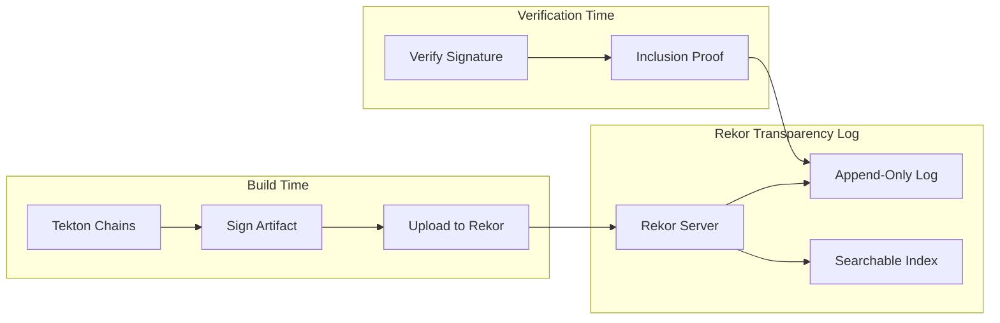
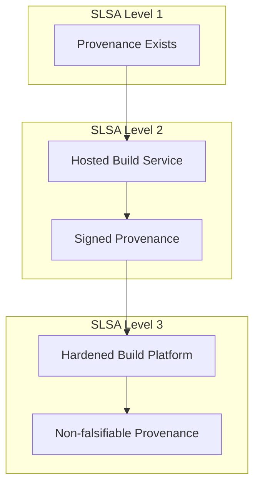

# How to Use Tekton Chains for Security

Author: [nawazdhandala](https://www.github.com/nawazdhandala)

Tags: Tekton, Kubernetes, CI/CD, Security, Supply Chain, Sigstore, Cosign, SLSA

Description: A hands-on guide to securing your CI/CD pipelines with Tekton Chains, covering installation, artifact signing, provenance generation, and verification workflows.

> Software supply chain attacks have become increasingly sophisticated. Tekton Chains provides cryptographic signing and provenance generation to protect your build pipeline and verify the integrity of your artifacts.

## What is Tekton Chains?

Tekton Chains is a Kubernetes Custom Resource Definition (CRD) controller that observes TaskRun and PipelineRun completions. When a build finishes, Chains automatically signs the resulting artifacts and generates cryptographic provenance attestations. Your development teams can keep using Tekton Pipelines as they always have while Chains operates transparently in the background.

The project implements the SLSA (Supply-chain Levels for Software Artifacts) framework, which provides a security checklist for achieving different levels of supply chain integrity. By generating and signing provenance, Chains helps you achieve SLSA Level 2 and work toward Level 3 compliance.

## Why Supply Chain Security Matters

Recent attacks on software supply chains have demonstrated how vulnerabilities in build systems can cascade to affect millions of users. Attackers target the CI/CD pipeline itself because compromising a single build can distribute malicious code to countless downstream consumers.

Consider a scenario where an attacker gains access to your build infrastructure. Without proper verification mechanisms, they could:

- Modify build artifacts after they pass tests
- Inject malicious dependencies during compilation
- Replace legitimate images in your container registry
- Alter deployment configurations before they reach production

Tekton Chains addresses these threats by creating an immutable record of what was built, when, and from which source code. Every artifact gets signed, and the provenance document captures the complete build context.

## Architecture Overview

Tekton Chains operates as a separate controller that watches Tekton pipeline executions and acts upon their completion.



The controller monitors TaskRuns and PipelineRuns. When an execution completes successfully, Chains extracts information about the build inputs and outputs, generates a provenance attestation document, signs everything using your configured key backend, and stores the signatures and attestations in your chosen storage backend.

## Prerequisites

Before installing Tekton Chains, ensure you have:

- A Kubernetes cluster running version 1.25 or later
- Tekton Pipelines already installed and operational
- kubectl configured with cluster admin access
- Cosign installed locally for key generation and verification

If you need to set up Tekton Pipelines first, refer to our guide on [getting started with Tekton Pipelines](https://oneuptime.com/blog/post/2026-01-26-tekton-pipelines-guide/view).

## Installing Tekton Chains

The following command deploys Tekton Chains to your cluster.

```bash
# Install the latest Tekton Chains release
kubectl apply --filename https://storage.googleapis.com/tekton-releases/chains/latest/release.yaml

# Wait for the deployment to become ready
kubectl wait --for=condition=available deployment/tekton-chains-controller -n tekton-chains --timeout=120s
```

Verify the installation by checking the controller pod status.

```bash
# Check that the Chains controller is running
kubectl get pods -n tekton-chains

# Expected output shows a running controller pod
# NAME                                        READY   STATUS    RESTARTS   AGE
# tekton-chains-controller-7f4dc5d8b-x2j4k    1/1     Running   0          30s
```

## Configuring Signing Keys

Tekton Chains needs cryptographic keys to sign artifacts and attestations. You have several options for key management, ranging from simple file-based keys to enterprise-grade cloud KMS solutions.

### Option 1: Cosign Key Pair

For development and testing, generate a local Cosign key pair and store it as a Kubernetes secret.

Cosign generates an ECDSA key pair suitable for signing container images and attestations.

```bash
# Generate a new Cosign key pair
# You will be prompted for a password to encrypt the private key
cosign generate-key-pair k8s://tekton-chains/signing-secrets
```

The command creates a Kubernetes secret named `signing-secrets` in the `tekton-chains` namespace containing your encrypted private key. Cosign also outputs the public key to `cosign.pub` in your current directory.

### Option 2: Google Cloud KMS

For production environments, using a cloud KMS provides better key protection and audit logging.

First, create a KMS key ring and key for signing.

```bash
# Set your project and location
export PROJECT_ID=your-gcp-project
export LOCATION=global
export KEYRING=tekton-signing
export KEY=chains-key

# Create the key ring
gcloud kms keyrings create ${KEYRING} \
    --location=${LOCATION} \
    --project=${PROJECT_ID}

# Create an asymmetric signing key
gcloud kms keys create ${KEY} \
    --keyring=${KEYRING} \
    --location=${LOCATION} \
    --purpose=asymmetric-signing \
    --default-algorithm=ec-sign-p256-sha256 \
    --project=${PROJECT_ID}
```

Grant the Tekton Chains service account permission to use the key.

```bash
# Get the Chains controller service account
export SA_EMAIL=$(kubectl get sa tekton-chains-controller -n tekton-chains -o jsonpath='{.metadata.name}')

# Grant signing permissions via Workload Identity
gcloud iam service-accounts add-iam-policy-binding \
    ${SA_EMAIL}@${PROJECT_ID}.iam.gserviceaccount.com \
    --role=roles/cloudkms.signer \
    --member="serviceAccount:${PROJECT_ID}.svc.id.goog[tekton-chains/tekton-chains-controller]"
```

### Option 3: HashiCorp Vault

Vault provides another enterprise option for key management with comprehensive audit capabilities.

The following configuration connects Chains to a Vault transit secrets engine.

```yaml
# vault-signing-config.yaml
# ConfigMap to configure Vault as the signing backend
apiVersion: v1
kind: ConfigMap
metadata:
  name: chains-config
  namespace: tekton-chains
data:
  signers.x509.vault.addr: "https://vault.example.com:8200"
  signers.x509.vault.path: "transit"
  signers.x509.vault.key: "tekton-signing-key"
```

## Configuring Chains Behavior

Tekton Chains uses a ConfigMap to control its behavior. The configuration determines which artifacts to sign, what format to use for attestations, and where to store the results.

Create or update the chains-config ConfigMap with your desired settings.

```yaml
# chains-config.yaml
# Core configuration for Tekton Chains behavior
apiVersion: v1
kind: ConfigMap
metadata:
  name: chains-config
  namespace: tekton-chains
data:
  # Artifact signing configuration
  # Supported formats: x509, cosign
  artifacts.taskrun.format: slsa/v1
  artifacts.taskrun.storage: oci
  artifacts.taskrun.signer: cosign

  # OCI artifact settings
  # Sign container images pushed during builds
  artifacts.oci.format: simplesigning
  artifacts.oci.storage: oci
  artifacts.oci.signer: cosign

  # Enable artifact signing
  artifacts.taskrun.enabled: "true"
  artifacts.pipelinerun.enabled: "true"

  # Transparency log configuration
  # Set to true to upload signatures to Rekor public transparency log
  transparency.enabled: "true"
  transparency.url: "https://rekor.sigstore.dev"
```

Apply the configuration.

```bash
kubectl apply -f chains-config.yaml

# Restart the controller to pick up configuration changes
kubectl rollout restart deployment/tekton-chains-controller -n tekton-chains
```

## Understanding Provenance Formats

Tekton Chains supports multiple provenance formats. The SLSA provenance format captures comprehensive build metadata that enables verification of your supply chain.



A provenance attestation contains information about the build including the builder identity, source materials (git commits, base images), build parameters, and timestamps. Consumers can use this information to make trust decisions about whether to deploy an artifact.

## Creating a Signed Pipeline

Let's build a complete pipeline that produces signed artifacts. The pipeline will clone source code, build a container image, and push it to a registry where Chains will automatically sign it.

First, define the pipeline parameters and structure.

```yaml
# signed-build-pipeline.yaml
# Pipeline that builds and pushes a container image
# Tekton Chains will automatically sign the resulting artifact
apiVersion: tekton.dev/v1
kind: Pipeline
metadata:
  name: signed-build
  namespace: default
spec:
  description: Build and push a container image with automatic Chains signing

  params:
    - name: git-url
      description: Git repository URL
      type: string
    - name: git-revision
      description: Git revision to build
      type: string
      default: main
    - name: image-reference
      description: Container image reference including registry and tag
      type: string

  workspaces:
    - name: source
      description: Workspace for cloning and building

  results:
    - name: image-digest
      description: Digest of the built image
      value: $(tasks.build-push.results.IMAGE_DIGEST)

  tasks:
    - name: clone
      taskRef:
        name: git-clone
        kind: Task
      params:
        - name: url
          value: $(params.git-url)
        - name: revision
          value: $(params.git-revision)
      workspaces:
        - name: output
          workspace: source

    - name: build-push
      taskRef:
        name: kaniko
        kind: Task
      runAfter:
        - clone
      params:
        - name: IMAGE
          value: $(params.image-reference)
      workspaces:
        - name: source
          workspace: source
```

The Kaniko task referenced above builds OCI-compliant container images without requiring a Docker daemon. Install it from the Tekton catalog.

```bash
# Install the Kaniko task from Tekton Hub
kubectl apply -f https://api.hub.tekton.dev/v1/resource/tekton/task/kaniko/0.6/raw

# Install the git-clone task if not already present
kubectl apply -f https://api.hub.tekton.dev/v1/resource/tekton/task/git-clone/0.9/raw
```

Now create a PipelineRun to execute the build.

```yaml
# signed-build-pipelinerun.yaml
# Execute the signed-build pipeline
apiVersion: tekton.dev/v1
kind: PipelineRun
metadata:
  generateName: signed-build-run-
  namespace: default
spec:
  pipelineRef:
    name: signed-build
  params:
    - name: git-url
      value: "https://github.com/your-org/your-app"
    - name: git-revision
      value: "main"
    - name: image-reference
      value: "gcr.io/your-project/your-app:v1.0.0"
  workspaces:
    - name: source
      volumeClaimTemplate:
        spec:
          accessModes:
            - ReadWriteOnce
          resources:
            requests:
              storage: 2Gi
```

Run the pipeline.

```bash
# Create the PipelineRun
kubectl create -f signed-build-pipelinerun.yaml

# Monitor the execution
tkn pipelinerun logs -f --last
```

## Verifying Signed Artifacts

After Chains signs your artifacts, you can verify them using Cosign. Verification confirms that the artifact was signed by a trusted key and hasn't been modified.

Verify a signed container image using your public key.

```bash
# Verify the image signature
cosign verify \
    --key cosign.pub \
    gcr.io/your-project/your-app:v1.0.0

# For images signed with keyless signing (Fulcio)
cosign verify \
    --certificate-identity=your-identity \
    --certificate-oidc-issuer=https://accounts.google.com \
    gcr.io/your-project/your-app:v1.0.0
```

Retrieve and inspect the provenance attestation.

```bash
# Download the attestation
cosign download attestation \
    gcr.io/your-project/your-app:v1.0.0 > attestation.json

# Verify the attestation signature
cosign verify-attestation \
    --key cosign.pub \
    --type slsaprovenance \
    gcr.io/your-project/your-app:v1.0.0
```

The attestation contains detailed build information that you can parse and analyze.

```bash
# Extract the predicate from the attestation
cat attestation.json | jq -r '.payload' | base64 -d | jq '.predicate'
```

## Implementing Policy Enforcement

Signing artifacts is only half the equation. To complete the security model, you need to enforce that only properly signed artifacts can be deployed.

### Using Kyverno for Policy Enforcement

Kyverno is a policy engine designed for Kubernetes. The following policy requires valid signatures on all container images in a namespace.

```yaml
# image-verify-policy.yaml
# Kyverno policy requiring Tekton Chains signatures on all images
apiVersion: kyverno.io/v1
kind: ClusterPolicy
metadata:
  name: verify-tekton-chains-signature
spec:
  validationFailureAction: Enforce
  background: false
  webhookTimeoutSeconds: 30
  failurePolicy: Fail
  rules:
    - name: verify-signature
      match:
        any:
          - resources:
              kinds:
                - Pod
      verifyImages:
        - imageReferences:
            - "gcr.io/your-project/*"
          attestors:
            - count: 1
              entries:
                - keys:
                    publicKeys: |-
                      -----BEGIN PUBLIC KEY-----
                      MFkwEwYHKoZIzj0CAQYIKoZIzj0DAQcDQgAE...your-key...
                      -----END PUBLIC KEY-----
          attestations:
            - predicateType: https://slsa.dev/provenance/v0.2
              conditions:
                - all:
                    - key: "{{ builder.id }}"
                      operator: Equals
                      value: "https://tekton.dev/chains/v2"
```

### Using Sigstore Policy Controller

The Sigstore policy-controller provides another option for admission control.

```yaml
# sigstore-policy.yaml
# Policy requiring signed images for production namespace
apiVersion: policy.sigstore.dev/v1beta1
kind: ClusterImagePolicy
metadata:
  name: require-chains-signature
spec:
  images:
    - glob: "gcr.io/your-project/**"
  authorities:
    - key:
        secretRef:
          name: cosign-public-key
          namespace: sigstore-system
      attestations:
        - name: must-have-provenance
          predicateType: slsaprovenance
          policy:
            type: cue
            data: |
              predicateType: "https://slsa.dev/provenance/v0.2"
```

## Integrating with Transparency Logs

Transparency logs provide a public, append-only record of all signing operations. Rekor is the Sigstore transparency log that Chains can integrate with.



When transparency logging is enabled, Chains uploads a signed entry to Rekor for every artifact it signs. Anyone can query the transparency log to verify that a signature was recorded at a specific time.

Query the transparency log for signatures.

```bash
# Search for entries related to a specific artifact
rekor-cli search --artifact gcr.io/your-project/your-app@sha256:abc123...

# Get the full log entry
rekor-cli get --uuid 24296fb24b8ad77a...

# Verify the inclusion proof
rekor-cli verify --artifact gcr.io/your-project/your-app@sha256:abc123...
```

## Type Hinting for Build Results

Tekton Chains uses type hints to understand what artifacts your pipeline produces. Adding proper result types ensures Chains correctly identifies and signs all outputs.

The following task demonstrates proper type hinting for OCI images.

```yaml
# typed-build-task.yaml
# Task with proper type hints for Chains to identify artifacts
apiVersion: tekton.dev/v1
kind: Task
metadata:
  name: build-with-type-hints
  namespace: default
spec:
  params:
    - name: IMAGE
      description: Image reference to build
      type: string

  results:
    # Type hint tells Chains this result contains an image digest
    - name: IMAGE_DIGEST
      description: Digest of the built image
      type: string
    # Type hint for the full image reference with digest
    - name: IMAGE_URL
      description: URL of the built image
      type: string

  steps:
    - name: build
      image: gcr.io/kaniko-project/executor:v1.19.0
      args:
        - --dockerfile=Dockerfile
        - --context=.
        - --destination=$(params.IMAGE)
        - --digest-file=$(results.IMAGE_DIGEST.path)
      script: |
        #!/bin/sh
        set -e
        /kaniko/executor \
          --dockerfile=Dockerfile \
          --context=. \
          --destination=$(params.IMAGE) \
          --digest-file=/tekton/results/IMAGE_DIGEST

        # Write the full image URL with digest
        echo "$(params.IMAGE)@$(cat /tekton/results/IMAGE_DIGEST)" > $(results.IMAGE_URL.path)
```

## Troubleshooting Chains

When signatures or attestations are missing, investigate the Chains controller logs.

```bash
# View Chains controller logs
kubectl logs -n tekton-chains deployment/tekton-chains-controller

# Check for signing errors in a specific TaskRun
kubectl get taskrun <taskrun-name> -o jsonpath='{.metadata.annotations}' | jq .
```

Common issues and solutions include:

**Missing signatures**: Verify that your signing keys are properly configured and the Chains controller has permission to access them.

**Attestation format errors**: Check that your Tasks produce results in the expected format with proper type hints.

**Storage failures**: Ensure the Chains service account has push access to your container registry or storage backend.

**Key permission errors**: For cloud KMS, verify Workload Identity or service account bindings are correct.

Check the signing status annotation on completed TaskRuns.

```bash
# Get the chains status for a TaskRun
kubectl get taskrun <taskrun-name> -o jsonpath='{.metadata.annotations.chains\.tekton\.dev/signed}'

# Expected value: "true"
```

## Production Considerations

When deploying Tekton Chains in production, keep these recommendations in mind.

**Key Rotation**: Establish a key rotation schedule and process. Cloud KMS solutions support automatic rotation, but you need to maintain old public keys for verifying historical artifacts.

**High Availability**: Deploy multiple replicas of the Chains controller for redundancy. Use pod disruption budgets to maintain availability during cluster upgrades.

```yaml
# chains-deployment-ha.yaml
# High availability configuration for Chains controller
apiVersion: apps/v1
kind: Deployment
metadata:
  name: tekton-chains-controller
  namespace: tekton-chains
spec:
  replicas: 3
  strategy:
    type: RollingUpdate
    rollingUpdate:
      maxSurge: 1
      maxUnavailable: 1
```

**Monitoring**: Export Chains metrics to your observability platform. Monitor signing latency, error rates, and key usage patterns.

**Network Policies**: Restrict egress from the Chains controller to only required destinations (registry, KMS, transparency log).

## Achieving SLSA Compliance

Tekton Chains helps you achieve SLSA compliance levels through automated provenance generation. Understanding the requirements at each level guides your implementation.



**Level 1** requires that provenance exists showing how the artifact was built. Chains automatically generates this documentation.

**Level 2** requires the build to run on a hosted service with signed provenance. Running Tekton on a managed Kubernetes cluster with Chains signing meets this requirement.

**Level 3** requires additional hardening measures including isolated build environments and tamper-evident provenance. Achieving this level requires careful configuration of your Kubernetes cluster and build infrastructure.

## Conclusion

Tekton Chains transforms your CI/CD pipeline from a potential attack vector into a verifiable, auditable system. By automatically signing artifacts and generating provenance attestations, Chains enables you to detect tampering and enforce policies about what code can reach production.

Start by deploying Chains in your development environment to understand the signing workflow. Progress to production by implementing cloud KMS integration and policy enforcement. Consider enabling transparency logging to provide public verifiability of your build outputs.

Your software supply chain security journey doesn't end with signing. Combine Chains with vulnerability scanning, SBOM generation, and runtime security controls for comprehensive protection. The attestations Chains produces integrate with policy engines throughout your deployment pipeline, creating defense in depth against supply chain attacks.
