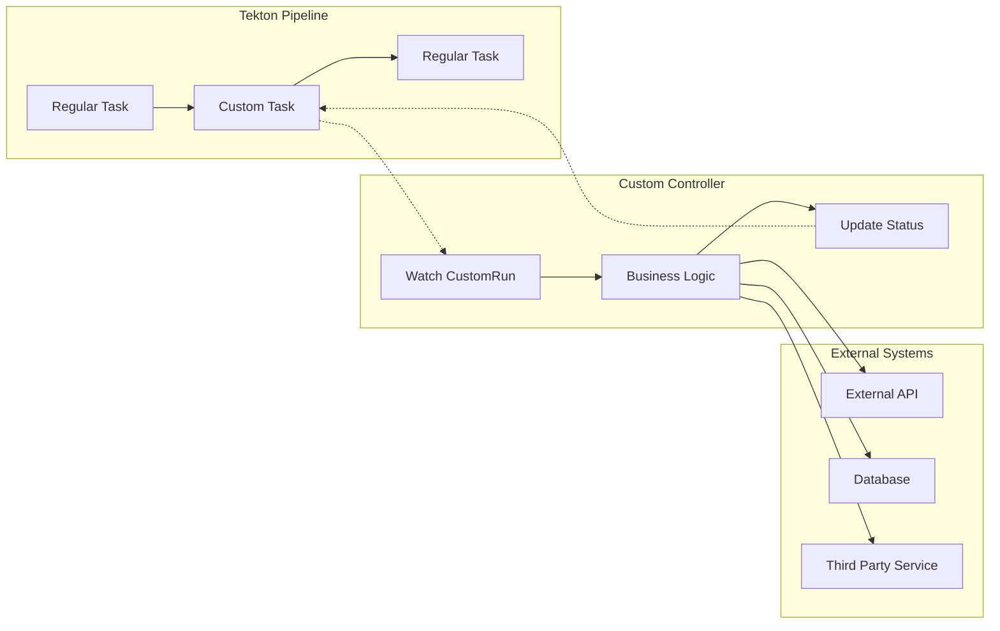
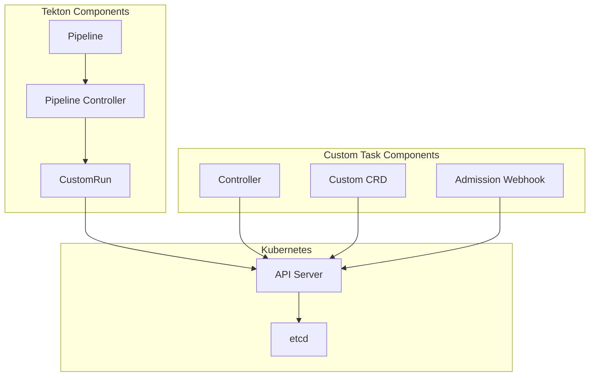

# How to Build Tekton Custom Tasks

Author: [nawazdhandala](https://www.github.com/nawazdhandala)

Tags: Tekton, Kubernetes, CI/CD, Custom Tasks, Cloud Native, DevOps, Pipelines

Description: A practical guide to building Tekton Custom Tasks for extending your CI/CD pipelines with custom logic, external integrations, and specialized workflow steps.

---

Tekton has become the go-to framework for building cloud-native CI/CD pipelines on Kubernetes. While the built-in Tasks cover many common scenarios, real-world pipelines often require custom functionality that goes beyond what standard Tasks can provide. Custom Tasks let you extend Tekton with your own controllers, enabling powerful integrations with external systems, approval workflows, and specialized processing logic.

## Understanding Tekton Custom Tasks

Custom Tasks in Tekton work differently from regular Tasks. Instead of running containers directly, they delegate execution to external controllers that you build and deploy. The controller watches for Custom Task Run resources and handles the actual work.



## When to Use Custom Tasks

Custom Tasks shine in scenarios where regular Tasks fall short:

- Integrating with external approval systems that require polling
- Running long-running operations that exceed container timeouts
- Implementing custom retry logic with exponential backoff
- Coordinating with external orchestration systems
- Building platform-specific integrations that require direct API access

## Prerequisites

Before diving in, ensure you have:

- A Kubernetes cluster (1.24+) with Tekton Pipelines installed
- kubectl configured to access your cluster
- Go 1.21+ installed for building the controller
- Basic familiarity with Kubernetes controllers and CRDs

Verify your Tekton installation with this command.

```bash
# Check Tekton Pipelines version
kubectl get deploy tekton-pipelines-controller -n tekton-pipelines -o jsonpath='{.spec.template.spec.containers[0].image}'
```

## Custom Task Architecture

A Custom Task implementation consists of three main components: the API definition, the controller logic, and the Tekton integration manifest.



## Building a Custom Task Controller

Let me walk you through building a Custom Task that integrates with an external approval system. Users can request approval through a third-party service before the pipeline continues.

### Project Structure

Set up your project with the following structure.

```bash
approval-task/
├── api/
│   └── v1alpha1/
│       ├── approval_types.go
│       ├── groupversion_info.go
│       └── zz_generated.deepcopy.go
├── controllers/
│   └── approval_controller.go
├── config/
│   ├── crd/
│   │   └── bases/
│   │       └── approval.tekton.dev_approvalrequests.yaml
│   ├── manager/
│   │   └── manager.yaml
│   └── rbac/
│       ├── role.yaml
│       └── role_binding.yaml
├── main.go
├── go.mod
└── Dockerfile
```

### Define the Custom Resource

Create the API types that define your Custom Task. The ApprovalRequest CRD represents an approval that must be granted before the pipeline proceeds.

```go
// api/v1alpha1/approval_types.go
// Package v1alpha1 contains API Schema definitions for the approval v1alpha1 API group
package v1alpha1

import (
    metav1 "k8s.io/apimachinery/pkg/apis/meta/v1"
)

// ApprovalRequestSpec defines the desired state of an approval request
// The Approvers field specifies who can approve, and Timeout sets the maximum wait time
type ApprovalRequestSpec struct {
    // Approvers is the list of users or groups who can approve the request
    // +kubebuilder:validation:MinItems=1
    Approvers []string `json:"approvers"`

    // Timeout specifies how long to wait for approval before failing
    // +kubebuilder:default="1h"
    Timeout string `json:"timeout,omitempty"`

    // Message provides context about what is being approved
    Message string `json:"message,omitempty"`

    // ExternalURL is the URL to the external approval system
    ExternalURL string `json:"externalURL,omitempty"`
}

// ApprovalRequestStatus defines the observed state of ApprovalRequest
// The controller updates these fields based on the approval state
type ApprovalRequestStatus struct {
    // State represents the current approval state: Pending, Approved, Rejected, or TimedOut
    // +kubebuilder:validation:Enum=Pending;Approved;Rejected;TimedOut
    State string `json:"state,omitempty"`

    // ApprovedBy records who approved the request
    ApprovedBy string `json:"approvedBy,omitempty"`

    // ApprovedAt records when the approval was granted
    ApprovedAt *metav1.Time `json:"approvedAt,omitempty"`

    // ExternalRequestID is the ID from the external approval system
    ExternalRequestID string `json:"externalRequestID,omitempty"`

    // Conditions provide detailed status information
    Conditions []metav1.Condition `json:"conditions,omitempty"`
}

// +kubebuilder:object:root=true
// +kubebuilder:subresource:status
// +kubebuilder:printcolumn:name="State",type=string,JSONPath=`.status.state`
// +kubebuilder:printcolumn:name="Approver",type=string,JSONPath=`.status.approvedBy`
// +kubebuilder:printcolumn:name="Age",type=date,JSONPath=`.metadata.creationTimestamp`

// ApprovalRequest is the Schema for the approvalrequests API
// It represents a request for approval that blocks pipeline execution
type ApprovalRequest struct {
    metav1.TypeMeta   `json:",inline"`
    metav1.ObjectMeta `json:"metadata,omitempty"`

    Spec   ApprovalRequestSpec   `json:"spec,omitempty"`
    Status ApprovalRequestStatus `json:"status,omitempty"`
}

// +kubebuilder:object:root=true

// ApprovalRequestList contains a list of ApprovalRequest
type ApprovalRequestList struct {
    metav1.TypeMeta `json:",inline"`
    metav1.ListMeta `json:"metadata,omitempty"`
    Items           []ApprovalRequest `json:"items"`
}

func init() {
    SchemeBuilder.Register(&ApprovalRequest{}, &ApprovalRequestList{})
}
```

### Implement the Controller

The controller is where the real work happens. It watches for CustomRun resources, creates ApprovalRequest objects, polls the external approval system, and updates the CustomRun status accordingly.

```go
// controllers/approval_controller.go
// Package controllers contains the reconciliation logic for approval requests
package controllers

import (
    "context"
    "fmt"
    "time"

    "github.com/go-logr/logr"
    tektonv1beta1 "github.com/tektoncd/pipeline/pkg/apis/pipeline/v1beta1"
    corev1 "k8s.io/api/core/v1"
    "k8s.io/apimachinery/pkg/api/errors"
    metav1 "k8s.io/apimachinery/pkg/apis/meta/v1"
    "k8s.io/apimachinery/pkg/runtime"
    ctrl "sigs.k8s.io/controller-runtime"
    "sigs.k8s.io/controller-runtime/pkg/client"

    approvalv1alpha1 "github.com/example/approval-task/api/v1alpha1"
)

// ApprovalReconciler reconciles CustomRun objects that reference our approval task
// It creates approval requests and polls the external system for status updates
type ApprovalReconciler struct {
    client.Client
    Log            logr.Logger
    Scheme         *runtime.Scheme
    ApprovalClient ApprovalServiceClient
}

// ApprovalServiceClient defines the interface for external approval systems
// Implement this interface to integrate with your specific approval service
type ApprovalServiceClient interface {
    CreateRequest(ctx context.Context, req ApprovalCreateRequest) (string, error)
    GetStatus(ctx context.Context, requestID string) (ApprovalStatus, error)
}

// ApprovalCreateRequest contains the data needed to create an external approval request
type ApprovalCreateRequest struct {
    Approvers   []string
    Message     string
    CallbackURL string
}

// ApprovalStatus represents the status returned from the external approval system
type ApprovalStatus struct {
    State      string
    ApprovedBy string
    ApprovedAt time.Time
}

// Reconcile handles the reconciliation loop for CustomRun objects
// The function processes approval requests and updates the CustomRun status
// +kubebuilder:rbac:groups=tekton.dev,resources=customruns,verbs=get;list;watch;update;patch
// +kubebuilder:rbac:groups=tekton.dev,resources=customruns/status,verbs=get;update;patch
// +kubebuilder:rbac:groups=approval.tekton.dev,resources=approvalrequests,verbs=get;list;watch;create;update;patch;delete
func (r *ApprovalReconciler) Reconcile(ctx context.Context, req ctrl.Request) (ctrl.Result, error) {
    log := r.Log.WithValues("customrun", req.NamespacedName)

    // Fetch the CustomRun instance that triggered reconciliation
    var customRun tektonv1beta1.CustomRun
    if err := r.Get(ctx, req.NamespacedName, &customRun); err != nil {
        if errors.IsNotFound(err) {
            // CustomRun was deleted, nothing to do
            return ctrl.Result{}, nil
        }
        log.Error(err, "unable to fetch CustomRun")
        return ctrl.Result{}, err
    }

    // Only process CustomRuns that reference our approval task
    // Skip if the apiVersion or kind does not match our expectations
    if customRun.Spec.CustomRef == nil ||
        customRun.Spec.CustomRef.APIVersion != "approval.tekton.dev/v1alpha1" ||
        customRun.Spec.CustomRef.Kind != "ApprovalRequest" {
        return ctrl.Result{}, nil
    }

    // Skip if the CustomRun has already completed
    if customRun.IsDone() {
        return ctrl.Result{}, nil
    }

    // Extract parameters from the CustomRun
    params := extractParams(customRun.Spec.Params)

    // Check if we already created an approval request for this CustomRun
    approvalReq, exists, err := r.findExistingApproval(ctx, &customRun)
    if err != nil {
        return ctrl.Result{}, err
    }

    if !exists {
        // Create a new approval request in the external system
        approvalReq, err = r.createApproval(ctx, &customRun, params)
        if err != nil {
            log.Error(err, "failed to create approval request")
            return r.markFailed(ctx, &customRun, "FailedToCreateApproval", err.Error())
        }
    }

    // Poll the external approval system for the current status
    status, err := r.ApprovalClient.GetStatus(ctx, approvalReq.Status.ExternalRequestID)
    if err != nil {
        log.Error(err, "failed to get approval status")
        // Requeue to try again later
        return ctrl.Result{RequeueAfter: 30 * time.Second}, nil
    }

    // Handle the approval status returned from the external system
    switch status.State {
    case "Approved":
        return r.markSucceeded(ctx, &customRun, status)
    case "Rejected":
        return r.markFailed(ctx, &customRun, "ApprovalRejected",
            fmt.Sprintf("Request rejected by %s", status.ApprovedBy))
    case "Pending":
        // Check for timeout based on the configured duration
        timeout, _ := time.ParseDuration(params["timeout"])
        if timeout == 0 {
            timeout = 1 * time.Hour
        }
        if time.Since(customRun.CreationTimestamp.Time) > timeout {
            return r.markFailed(ctx, &customRun, "ApprovalTimeout",
                "Approval request timed out")
        }
        // Still pending, requeue to check again
        return ctrl.Result{RequeueAfter: 30 * time.Second}, nil
    default:
        log.Info("Unknown approval state", "state", status.State)
        return ctrl.Result{RequeueAfter: 30 * time.Second}, nil
    }
}

// createApproval creates a new approval request in both Kubernetes and the external system
// Returns the created ApprovalRequest or an error
func (r *ApprovalReconciler) createApproval(
    ctx context.Context,
    customRun *tektonv1beta1.CustomRun,
    params map[string]string,
) (*approvalv1alpha1.ApprovalRequest, error) {

    // Parse the approvers list from the comma-separated parameter
    approvers := parseApprovers(params["approvers"])

    // Create the request in the external approval system first
    externalID, err := r.ApprovalClient.CreateRequest(ctx, ApprovalCreateRequest{
        Approvers: approvers,
        Message:   params["message"],
    })
    if err != nil {
        return nil, fmt.Errorf("failed to create external approval: %w", err)
    }

    // Create the Kubernetes ApprovalRequest to track the state
    approvalReq := &approvalv1alpha1.ApprovalRequest{
        ObjectMeta: metav1.ObjectMeta{
            Name:      customRun.Name + "-approval",
            Namespace: customRun.Namespace,
            Labels: map[string]string{
                "tekton.dev/customRun": customRun.Name,
            },
            OwnerReferences: []metav1.OwnerReference{
                {
                    APIVersion: customRun.APIVersion,
                    Kind:       customRun.Kind,
                    Name:       customRun.Name,
                    UID:        customRun.UID,
                    Controller: boolPtr(true),
                },
            },
        },
        Spec: approvalv1alpha1.ApprovalRequestSpec{
            Approvers: approvers,
            Timeout:   params["timeout"],
            Message:   params["message"],
        },
        Status: approvalv1alpha1.ApprovalRequestStatus{
            State:             "Pending",
            ExternalRequestID: externalID,
        },
    }

    if err := r.Create(ctx, approvalReq); err != nil {
        return nil, fmt.Errorf("failed to create ApprovalRequest: %w", err)
    }

    return approvalReq, nil
}

// findExistingApproval looks for an ApprovalRequest that was already created for this CustomRun
// Returns the approval, whether it exists, and any error
func (r *ApprovalReconciler) findExistingApproval(
    ctx context.Context,
    customRun *tektonv1beta1.CustomRun,
) (*approvalv1alpha1.ApprovalRequest, bool, error) {

    var approvalList approvalv1alpha1.ApprovalRequestList
    if err := r.List(ctx, &approvalList,
        client.InNamespace(customRun.Namespace),
        client.MatchingLabels{"tekton.dev/customRun": customRun.Name},
    ); err != nil {
        return nil, false, err
    }

    if len(approvalList.Items) > 0 {
        return &approvalList.Items[0], true, nil
    }
    return nil, false, nil
}

// markSucceeded updates the CustomRun to indicate successful completion
// Includes the approval details in the results
func (r *ApprovalReconciler) markSucceeded(
    ctx context.Context,
    customRun *tektonv1beta1.CustomRun,
    status ApprovalStatus,
) (ctrl.Result, error) {

    customRun.Status.SetCondition(&apis.Condition{
        Type:    apis.ConditionSucceeded,
        Status:  corev1.ConditionTrue,
        Reason:  "Approved",
        Message: fmt.Sprintf("Approved by %s", status.ApprovedBy),
    })

    // Add results that downstream tasks can consume
    customRun.Status.Results = append(customRun.Status.Results,
        tektonv1beta1.CustomRunResult{
            Name:  "approvedBy",
            Value: status.ApprovedBy,
        },
        tektonv1beta1.CustomRunResult{
            Name:  "approvedAt",
            Value: status.ApprovedAt.Format(time.RFC3339),
        },
    )

    if err := r.Status().Update(ctx, customRun); err != nil {
        return ctrl.Result{}, err
    }
    return ctrl.Result{}, nil
}

// markFailed updates the CustomRun to indicate failure with the given reason
func (r *ApprovalReconciler) markFailed(
    ctx context.Context,
    customRun *tektonv1beta1.CustomRun,
    reason, message string,
) (ctrl.Result, error) {

    customRun.Status.SetCondition(&apis.Condition{
        Type:    apis.ConditionSucceeded,
        Status:  corev1.ConditionFalse,
        Reason:  reason,
        Message: message,
    })

    if err := r.Status().Update(ctx, customRun); err != nil {
        return ctrl.Result{}, err
    }
    return ctrl.Result{}, nil
}

// extractParams converts the Tekton Params slice to a map for easier access
func extractParams(params []tektonv1beta1.Param) map[string]string {
    result := make(map[string]string)
    for _, p := range params {
        result[p.Name] = p.Value.StringVal
    }
    return result
}

// parseApprovers splits a comma-separated list of approvers into a slice
func parseApprovers(approvers string) []string {
    // Implementation would split on commas and trim whitespace
    return []string{approvers}
}

func boolPtr(b bool) *bool {
    return &b
}

// SetupWithManager configures the controller with the manager
// It sets up watches for both CustomRun and ApprovalRequest resources
func (r *ApprovalReconciler) SetupWithManager(mgr ctrl.Manager) error {
    return ctrl.NewControllerManagedBy(mgr).
        For(&tektonv1beta1.CustomRun{}).
        Owns(&approvalv1alpha1.ApprovalRequest{}).
        Complete(r)
}
```

### Create the Main Entry Point

Wire up the controller with the Kubernetes manager.

```go
// main.go
// Main entry point for the approval task controller
package main

import (
    "flag"
    "os"

    "k8s.io/apimachinery/pkg/runtime"
    utilruntime "k8s.io/apimachinery/pkg/util/runtime"
    clientgoscheme "k8s.io/client-go/kubernetes/scheme"
    ctrl "sigs.k8s.io/controller-runtime"
    "sigs.k8s.io/controller-runtime/pkg/healthz"
    "sigs.k8s.io/controller-runtime/pkg/log/zap"

    tektonv1beta1 "github.com/tektoncd/pipeline/pkg/apis/pipeline/v1beta1"

    approvalv1alpha1 "github.com/example/approval-task/api/v1alpha1"
    "github.com/example/approval-task/controllers"
)

var (
    scheme   = runtime.NewScheme()
    setupLog = ctrl.Log.WithName("setup")
)

func init() {
    // Register all required schemes with the runtime
    utilruntime.Must(clientgoscheme.AddToScheme(scheme))
    utilruntime.Must(tektonv1beta1.AddToScheme(scheme))
    utilruntime.Must(approvalv1alpha1.AddToScheme(scheme))
}

func main() {
    var metricsAddr string
    var probeAddr string
    var enableLeaderElection bool

    // Parse command-line flags for configuration
    flag.StringVar(&metricsAddr, "metrics-bind-address", ":8080",
        "The address the metric endpoint binds to.")
    flag.StringVar(&probeAddr, "health-probe-bind-address", ":8081",
        "The address the probe endpoint binds to.")
    flag.BoolVar(&enableLeaderElection, "leader-elect", false,
        "Enable leader election for controller manager.")

    opts := zap.Options{Development: true}
    opts.BindFlags(flag.CommandLine)
    flag.Parse()

    ctrl.SetLogger(zap.New(zap.UseFlagOptions(&opts)))

    // Create the controller manager with the configured options
    mgr, err := ctrl.NewManager(ctrl.GetConfigOrDie(), ctrl.Options{
        Scheme:                 scheme,
        MetricsBindAddress:     metricsAddr,
        Port:                   9443,
        HealthProbeBindAddress: probeAddr,
        LeaderElection:         enableLeaderElection,
        LeaderElectionID:       "approval-task.tekton.dev",
    })
    if err != nil {
        setupLog.Error(err, "unable to start manager")
        os.Exit(1)
    }

    // Initialize the external approval service client
    approvalClient := NewApprovalServiceClient(os.Getenv("APPROVAL_SERVICE_URL"))

    // Register the approval reconciler with the manager
    if err = (&controllers.ApprovalReconciler{
        Client:         mgr.GetClient(),
        Log:            ctrl.Log.WithName("controllers").WithName("Approval"),
        Scheme:         mgr.GetScheme(),
        ApprovalClient: approvalClient,
    }).SetupWithManager(mgr); err != nil {
        setupLog.Error(err, "unable to create controller", "controller", "Approval")
        os.Exit(1)
    }

    // Add health check endpoints for Kubernetes probes
    if err := mgr.AddHealthzCheck("healthz", healthz.Ping); err != nil {
        setupLog.Error(err, "unable to set up health check")
        os.Exit(1)
    }
    if err := mgr.AddReadyzCheck("readyz", healthz.Ping); err != nil {
        setupLog.Error(err, "unable to set up ready check")
        os.Exit(1)
    }

    setupLog.Info("starting manager")
    if err := mgr.Start(ctrl.SetupSignalHandler()); err != nil {
        setupLog.Error(err, "problem running manager")
        os.Exit(1)
    }
}

// NewApprovalServiceClient creates a client for the external approval service
func NewApprovalServiceClient(url string) controllers.ApprovalServiceClient {
    // Implementation would create an HTTP client for the approval service
    return &httpApprovalClient{baseURL: url}
}
```

## Deploying the Custom Task Controller

Package your controller as a container image and deploy it to Kubernetes.

### Dockerfile

Build a minimal container image for the controller.

```dockerfile
# Dockerfile
# Multi-stage build for a minimal container image

# Build stage compiles the Go binary
FROM golang:1.21-alpine AS builder

WORKDIR /workspace

# Copy dependency files first for better layer caching
COPY go.mod go.sum ./
RUN go mod download

# Copy source code and build the binary
COPY . .
RUN CGO_ENABLED=0 GOOS=linux GOARCH=amd64 go build -a -o manager main.go

# Runtime stage creates the final minimal image
FROM gcr.io/distroless/static:nonroot

WORKDIR /
COPY --from=builder /workspace/manager .
USER 65532:65532

ENTRYPOINT ["/manager"]
```

### Kubernetes Deployment

Deploy the controller with proper RBAC permissions.

```yaml
# config/manager/manager.yaml
# Deployment for the approval task controller
apiVersion: apps/v1
kind: Deployment
metadata:
  name: approval-task-controller
  namespace: tekton-pipelines
  labels:
    app.kubernetes.io/name: approval-task-controller
    app.kubernetes.io/component: controller
spec:
  replicas: 1
  selector:
    matchLabels:
      app.kubernetes.io/name: approval-task-controller
  template:
    metadata:
      labels:
        app.kubernetes.io/name: approval-task-controller
    spec:
      serviceAccountName: approval-task-controller
      containers:
        - name: manager
          image: your-registry/approval-task-controller:latest
          args:
            - --leader-elect
          env:
            # URL for the external approval service
            - name: APPROVAL_SERVICE_URL
              valueFrom:
                configMapKeyRef:
                  name: approval-task-config
                  key: approval-service-url
          ports:
            - containerPort: 8080
              name: metrics
              protocol: TCP
            - containerPort: 8081
              name: health
              protocol: TCP
          livenessProbe:
            httpGet:
              path: /healthz
              port: 8081
            initialDelaySeconds: 15
            periodSeconds: 20
          readinessProbe:
            httpGet:
              path: /readyz
              port: 8081
            initialDelaySeconds: 5
            periodSeconds: 10
          resources:
            limits:
              cpu: 500m
              memory: 256Mi
            requests:
              cpu: 100m
              memory: 128Mi
          securityContext:
            allowPrivilegeEscalation: false
            readOnlyRootFilesystem: true
            runAsNonRoot: true
            capabilities:
              drop:
                - ALL
```

### RBAC Configuration

Grant the controller permissions to watch and update the required resources.

```yaml
# config/rbac/role.yaml
# ClusterRole granting permissions needed by the approval task controller
apiVersion: rbac.authorization.k8s.io/v1
kind: ClusterRole
metadata:
  name: approval-task-controller-role
rules:
  # Permission to watch and update CustomRuns
  - apiGroups:
      - tekton.dev
    resources:
      - customruns
    verbs:
      - get
      - list
      - watch
      - update
      - patch
  - apiGroups:
      - tekton.dev
    resources:
      - customruns/status
    verbs:
      - get
      - update
      - patch
  # Permission to manage ApprovalRequest custom resources
  - apiGroups:
      - approval.tekton.dev
    resources:
      - approvalrequests
    verbs:
      - create
      - delete
      - get
      - list
      - patch
      - update
      - watch
  - apiGroups:
      - approval.tekton.dev
    resources:
      - approvalrequests/status
    verbs:
      - get
      - patch
      - update
  # Permission to emit events for visibility
  - apiGroups:
      - ""
    resources:
      - events
    verbs:
      - create
      - patch
---
# config/rbac/role_binding.yaml
# Bind the role to the controller service account
apiVersion: rbac.authorization.k8s.io/v1
kind: ClusterRoleBinding
metadata:
  name: approval-task-controller-rolebinding
roleRef:
  apiGroup: rbac.authorization.k8s.io
  kind: ClusterRole
  name: approval-task-controller-role
subjects:
  - kind: ServiceAccount
    name: approval-task-controller
    namespace: tekton-pipelines
```

## Using Custom Tasks in Pipelines

With the controller deployed, you can now use the Custom Task in your Tekton Pipelines.

### Basic Usage

Reference the Custom Task using the customRef field in your Pipeline definition.

```yaml
# pipeline-with-approval.yaml
# Pipeline that includes an approval gate before deployment
apiVersion: tekton.dev/v1beta1
kind: Pipeline
metadata:
  name: deploy-with-approval
spec:
  params:
    - name: environment
      type: string
      description: Target deployment environment
    - name: approvers
      type: string
      description: Comma-separated list of approvers
      default: "platform-team,security-team"

  tasks:
    # First task runs the test suite
    - name: run-tests
      taskRef:
        name: run-test-suite
      params:
        - name: environment
          value: $(params.environment)

    # Custom task waits for approval before proceeding
    - name: approval-gate
      runAfter:
        - run-tests
      taskRef:
        apiVersion: approval.tekton.dev/v1alpha1
        kind: ApprovalRequest
      params:
        - name: approvers
          value: $(params.approvers)
        - name: message
          value: "Approve deployment to $(params.environment)?"
        - name: timeout
          value: "2h"

    # Deployment only runs after approval is granted
    - name: deploy
      runAfter:
        - approval-gate
      taskRef:
        name: deploy-application
      params:
        - name: environment
          value: $(params.environment)
        - name: approved-by
          value: $(tasks.approval-gate.results.approvedBy)
```

### Consuming Custom Task Results

Custom Tasks can emit results that downstream tasks consume. Access these results using the standard Tekton result reference syntax.

```yaml
# pipeline-with-results.yaml
# Demonstrates consuming results from a Custom Task
apiVersion: tekton.dev/v1beta1
kind: Pipeline
metadata:
  name: pipeline-with-custom-results
spec:
  tasks:
    - name: get-approval
      taskRef:
        apiVersion: approval.tekton.dev/v1alpha1
        kind: ApprovalRequest
      params:
        - name: approvers
          value: "release-managers"
        - name: message
          value: "Approve production release?"

    - name: log-approval
      runAfter:
        - get-approval
      taskRef:
        name: log-message
      params:
        # Reference results from the Custom Task using standard syntax
        - name: message
          value: "Deployment approved by $(tasks.get-approval.results.approvedBy) at $(tasks.get-approval.results.approvedAt)"
```

## Advanced Patterns

Several advanced patterns help build robust Custom Tasks for production use.

### Timeout Handling

Implement proper timeout handling to prevent pipelines from hanging indefinitely.

```go
// controllers/timeout.go
// Timeout handling logic for long-running approval requests
package controllers

import (
    "context"
    "time"

    tektonv1beta1 "github.com/tektoncd/pipeline/pkg/apis/pipeline/v1beta1"
)

// checkTimeout determines if the approval request has exceeded its timeout
// Returns true if the timeout has elapsed since the CustomRun was created
func (r *ApprovalReconciler) checkTimeout(
    customRun *tektonv1beta1.CustomRun,
    timeoutStr string,
) bool {
    // Parse the timeout duration from the parameter
    timeout, err := time.ParseDuration(timeoutStr)
    if err != nil {
        // Use default timeout of 1 hour if parsing fails
        timeout = 1 * time.Hour
    }

    // Calculate elapsed time since the CustomRun was created
    elapsed := time.Since(customRun.CreationTimestamp.Time)

    return elapsed > timeout
}

// scheduleTimeoutCheck calculates when to requeue for timeout checking
// Returns a duration that ensures we check right after the timeout expires
func (r *ApprovalReconciler) scheduleTimeoutCheck(
    customRun *tektonv1beta1.CustomRun,
    timeoutStr string,
) time.Duration {
    timeout, _ := time.ParseDuration(timeoutStr)
    if timeout == 0 {
        timeout = 1 * time.Hour
    }

    // Calculate remaining time until timeout
    elapsed := time.Since(customRun.CreationTimestamp.Time)
    remaining := timeout - elapsed

    // Add a small buffer to ensure we check after timeout
    if remaining > 0 {
        return remaining + 5*time.Second
    }

    // Already past timeout, check immediately
    return 0
}
```

### Retry Logic with Exponential Backoff

Implement exponential backoff for resilient external service communication.

```go
// controllers/retry.go
// Retry logic with exponential backoff for external API calls
package controllers

import (
    "context"
    "math"
    "time"
)

// RetryConfig defines the parameters for retry behavior
type RetryConfig struct {
    MaxRetries     int
    InitialBackoff time.Duration
    MaxBackoff     time.Duration
    BackoffFactor  float64
}

// DefaultRetryConfig provides sensible defaults for retry behavior
func DefaultRetryConfig() RetryConfig {
    return RetryConfig{
        MaxRetries:     5,
        InitialBackoff: 1 * time.Second,
        MaxBackoff:     30 * time.Second,
        BackoffFactor:  2.0,
    }
}

// withRetry executes the given function with exponential backoff
// Returns the result of the function or the last error after all retries fail
func withRetry[T any](
    ctx context.Context,
    config RetryConfig,
    fn func(context.Context) (T, error),
) (T, error) {
    var lastErr error
    var zero T

    for attempt := 0; attempt <= config.MaxRetries; attempt++ {
        // Execute the function
        result, err := fn(ctx)
        if err == nil {
            return result, nil
        }
        lastErr = err

        // Calculate backoff duration with exponential increase
        backoff := float64(config.InitialBackoff) * math.Pow(config.BackoffFactor, float64(attempt))
        if backoff > float64(config.MaxBackoff) {
            backoff = float64(config.MaxBackoff)
        }

        // Wait before next retry, respecting context cancellation
        select {
        case <-ctx.Done():
            return zero, ctx.Err()
        case <-time.After(time.Duration(backoff)):
            // Continue to next attempt
        }
    }

    return zero, lastErr
}
```

### Webhook Integration

Allow external systems to notify the controller directly instead of polling.

```go
// controllers/webhook.go
// Webhook handler for receiving approval notifications from external systems
package controllers

import (
    "context"
    "encoding/json"
    "net/http"

    "sigs.k8s.io/controller-runtime/pkg/client"

    approvalv1alpha1 "github.com/example/approval-task/api/v1alpha1"
)

// WebhookPayload represents the incoming webhook data from the approval system
type WebhookPayload struct {
    RequestID  string `json:"requestId"`
    State      string `json:"state"`
    ApprovedBy string `json:"approvedBy,omitempty"`
    Comment    string `json:"comment,omitempty"`
}

// WebhookHandler processes incoming approval notifications
// Update the ApprovalRequest status when a webhook is received
type WebhookHandler struct {
    Client client.Client
}

// ServeHTTP handles incoming webhook requests from the external approval system
func (h *WebhookHandler) ServeHTTP(w http.ResponseWriter, r *http.Request) {
    if r.Method != http.MethodPost {
        http.Error(w, "Method not allowed", http.StatusMethodNotAllowed)
        return
    }

    // Parse the webhook payload
    var payload WebhookPayload
    if err := json.NewDecoder(r.Body).Decode(&payload); err != nil {
        http.Error(w, "Invalid payload", http.StatusBadRequest)
        return
    }

    // Find the ApprovalRequest by external ID
    ctx := r.Context()
    var approvalList approvalv1alpha1.ApprovalRequestList
    if err := h.Client.List(ctx, &approvalList); err != nil {
        http.Error(w, "Failed to list approvals", http.StatusInternalServerError)
        return
    }

    // Look for the matching approval request
    var targetApproval *approvalv1alpha1.ApprovalRequest
    for i := range approvalList.Items {
        if approvalList.Items[i].Status.ExternalRequestID == payload.RequestID {
            targetApproval = &approvalList.Items[i]
            break
        }
    }

    if targetApproval == nil {
        http.Error(w, "Approval request not found", http.StatusNotFound)
        return
    }

    // Update the approval status based on the webhook payload
    targetApproval.Status.State = payload.State
    targetApproval.Status.ApprovedBy = payload.ApprovedBy

    if err := h.Client.Status().Update(ctx, targetApproval); err != nil {
        http.Error(w, "Failed to update approval", http.StatusInternalServerError)
        return
    }

    w.WriteHeader(http.StatusOK)
    json.NewEncoder(w).Encode(map[string]string{"status": "updated"})
}
```

## Testing Custom Tasks

Thorough testing ensures your Custom Task behaves correctly across various scenarios.

### Unit Testing the Controller

Write unit tests using the controller-runtime fake client.

```go
// controllers/approval_controller_test.go
// Unit tests for the approval controller reconciliation logic
package controllers

import (
    "context"
    "testing"
    "time"

    "github.com/stretchr/testify/assert"
    tektonv1beta1 "github.com/tektoncd/pipeline/pkg/apis/pipeline/v1beta1"
    metav1 "k8s.io/apimachinery/pkg/apis/meta/v1"
    "k8s.io/apimachinery/pkg/runtime"
    "k8s.io/apimachinery/pkg/types"
    ctrl "sigs.k8s.io/controller-runtime"
    "sigs.k8s.io/controller-runtime/pkg/client/fake"

    approvalv1alpha1 "github.com/example/approval-task/api/v1alpha1"
)

// mockApprovalClient provides a mock implementation for testing
type mockApprovalClient struct {
    createResponse string
    createError    error
    statusResponse ApprovalStatus
    statusError    error
}

func (m *mockApprovalClient) CreateRequest(ctx context.Context, req ApprovalCreateRequest) (string, error) {
    return m.createResponse, m.createError
}

func (m *mockApprovalClient) GetStatus(ctx context.Context, requestID string) (ApprovalStatus, error) {
    return m.statusResponse, m.statusError
}

func TestReconcile_ApprovedRequest(t *testing.T) {
    // Set up the test scheme with required types
    scheme := runtime.NewScheme()
    _ = tektonv1beta1.AddToScheme(scheme)
    _ = approvalv1alpha1.AddToScheme(scheme)

    // Create a CustomRun that references our approval task
    customRun := &tektonv1beta1.CustomRun{
        ObjectMeta: metav1.ObjectMeta{
            Name:      "test-run",
            Namespace: "default",
        },
        Spec: tektonv1beta1.CustomRunSpec{
            CustomRef: &tektonv1beta1.TaskRef{
                APIVersion: "approval.tekton.dev/v1alpha1",
                Kind:       "ApprovalRequest",
            },
            Params: []tektonv1beta1.Param{
                {Name: "approvers", Value: tektonv1beta1.ParamValue{StringVal: "team-lead"}},
                {Name: "message", Value: tektonv1beta1.ParamValue{StringVal: "Test approval"}},
            },
        },
    }

    // Create an existing approval request
    approval := &approvalv1alpha1.ApprovalRequest{
        ObjectMeta: metav1.ObjectMeta{
            Name:      "test-run-approval",
            Namespace: "default",
            Labels: map[string]string{
                "tekton.dev/customRun": "test-run",
            },
        },
        Status: approvalv1alpha1.ApprovalRequestStatus{
            ExternalRequestID: "ext-123",
            State:             "Pending",
        },
    }

    // Create a fake client with the test objects
    client := fake.NewClientBuilder().
        WithScheme(scheme).
        WithObjects(customRun, approval).
        Build()

    // Create the reconciler with a mock that returns approved status
    reconciler := &ApprovalReconciler{
        Client: client,
        Scheme: scheme,
        ApprovalClient: &mockApprovalClient{
            statusResponse: ApprovalStatus{
                State:      "Approved",
                ApprovedBy: "team-lead",
                ApprovedAt: time.Now(),
            },
        },
    }

    // Run reconciliation
    result, err := reconciler.Reconcile(context.Background(), ctrl.Request{
        NamespacedName: types.NamespacedName{
            Name:      "test-run",
            Namespace: "default",
        },
    })

    // Verify the result
    assert.NoError(t, err)
    assert.Equal(t, ctrl.Result{}, result)

    // Verify the CustomRun was updated
    var updatedRun tektonv1beta1.CustomRun
    err = client.Get(context.Background(), types.NamespacedName{
        Name:      "test-run",
        Namespace: "default",
    }, &updatedRun)
    assert.NoError(t, err)
    assert.True(t, updatedRun.IsSuccessful())
}
```

### Integration Testing with Kind

Run integration tests against a real Kubernetes cluster using Kind.

```yaml
# test/e2e/kind-config.yaml
# Kind cluster configuration for integration testing
kind: Cluster
apiVersion: kind.x-k8s.io/v1alpha4
nodes:
  - role: control-plane
  - role: worker
```

The test script sets up the environment and runs the integration tests.

```bash
#!/bin/bash
# test/e2e/run-tests.sh
# Script to run integration tests against a Kind cluster

set -e

# Create a Kind cluster for testing
kind create cluster --name tekton-test --config test/e2e/kind-config.yaml

# Install Tekton Pipelines
kubectl apply -f https://storage.googleapis.com/tekton-releases/pipeline/latest/release.yaml

# Wait for Tekton to be ready
kubectl wait --for=condition=ready pod -l app=tekton-pipelines-controller -n tekton-pipelines --timeout=120s

# Build and load the controller image
docker build -t approval-task-controller:test .
kind load docker-image approval-task-controller:test --name tekton-test

# Deploy the controller
kubectl apply -f config/crd/
kubectl apply -f config/rbac/
kubectl apply -f config/manager/

# Wait for the controller to be ready
kubectl wait --for=condition=ready pod -l app.kubernetes.io/name=approval-task-controller -n tekton-pipelines --timeout=60s

# Run the test suite
go test -v ./test/e2e/...

# Clean up
kind delete cluster --name tekton-test
```

## Monitoring Custom Tasks

Expose metrics to track the performance and health of your Custom Task controller.

### Prometheus Metrics

Add custom metrics to the controller for observability.

```go
// controllers/metrics.go
// Prometheus metrics for monitoring the approval task controller
package controllers

import (
    "github.com/prometheus/client_golang/prometheus"
    "sigs.k8s.io/controller-runtime/pkg/metrics"
)

var (
    // approvalRequestsTotal counts the total number of approval requests processed
    approvalRequestsTotal = prometheus.NewCounterVec(
        prometheus.CounterOpts{
            Name: "approval_requests_total",
            Help: "Total number of approval requests processed",
        },
        []string{"namespace", "state"},
    )

    // approvalDurationSeconds tracks how long approvals take to complete
    approvalDurationSeconds = prometheus.NewHistogramVec(
        prometheus.HistogramOpts{
            Name:    "approval_duration_seconds",
            Help:    "Duration of approval requests in seconds",
            Buckets: prometheus.ExponentialBuckets(60, 2, 10), // 1min to ~17hrs
        },
        []string{"namespace"},
    )

    // externalAPICallsTotal counts calls to the external approval service
    externalAPICallsTotal = prometheus.NewCounterVec(
        prometheus.CounterOpts{
            Name: "external_api_calls_total",
            Help: "Total number of calls to the external approval API",
        },
        []string{"operation", "status"},
    )

    // reconcileErrorsTotal counts reconciliation errors by reason
    reconcileErrorsTotal = prometheus.NewCounterVec(
        prometheus.CounterOpts{
            Name: "reconcile_errors_total",
            Help: "Total number of reconciliation errors",
        },
        []string{"reason"},
    )
)

func init() {
    // Register all metrics with the controller-runtime metrics registry
    metrics.Registry.MustRegister(
        approvalRequestsTotal,
        approvalDurationSeconds,
        externalAPICallsTotal,
        reconcileErrorsTotal,
    )
}

// recordApprovalCompleted records metrics when an approval completes
func recordApprovalCompleted(namespace, state string, durationSeconds float64) {
    approvalRequestsTotal.WithLabelValues(namespace, state).Inc()
    approvalDurationSeconds.WithLabelValues(namespace).Observe(durationSeconds)
}

// recordExternalAPICall records metrics for external API calls
func recordExternalAPICall(operation string, success bool) {
    status := "success"
    if !success {
        status = "error"
    }
    externalAPICallsTotal.WithLabelValues(operation, status).Inc()
}

// recordReconcileError records metrics for reconciliation errors
func recordReconcileError(reason string) {
    reconcileErrorsTotal.WithLabelValues(reason).Inc()
}
```

### ServiceMonitor Configuration

Configure Prometheus to scrape metrics from the controller.

```yaml
# config/prometheus/servicemonitor.yaml
# ServiceMonitor for Prometheus Operator to scrape controller metrics
apiVersion: monitoring.coreos.com/v1
kind: ServiceMonitor
metadata:
  name: approval-task-controller
  namespace: tekton-pipelines
  labels:
    app.kubernetes.io/name: approval-task-controller
spec:
  selector:
    matchLabels:
      app.kubernetes.io/name: approval-task-controller
  endpoints:
    - port: metrics
      interval: 30s
      path: /metrics
```

## Production Considerations

Keep these factors in mind when deploying Custom Tasks in production environments.

### High Availability

Run multiple replicas with leader election for high availability.

```yaml
# config/manager/manager-ha.yaml
# High availability deployment configuration
apiVersion: apps/v1
kind: Deployment
metadata:
  name: approval-task-controller
  namespace: tekton-pipelines
spec:
  replicas: 2
  selector:
    matchLabels:
      app.kubernetes.io/name: approval-task-controller
  template:
    spec:
      containers:
        - name: manager
          args:
            # Enable leader election for HA deployments
            - --leader-elect=true
          resources:
            requests:
              cpu: 100m
              memory: 128Mi
            limits:
              cpu: 500m
              memory: 256Mi
      # Spread replicas across availability zones
      topologySpreadConstraints:
        - maxSkew: 1
          topologyKey: topology.kubernetes.io/zone
          whenUnsatisfiable: ScheduleAnyway
          labelSelector:
            matchLabels:
              app.kubernetes.io/name: approval-task-controller
```

### Resource Quotas

Set appropriate resource limits to prevent runaway resource consumption.

```yaml
# config/quota/resourcequota.yaml
# Resource quota for the custom task controller namespace
apiVersion: v1
kind: ResourceQuota
metadata:
  name: approval-task-quota
  namespace: tekton-pipelines
spec:
  hard:
    requests.cpu: "1"
    requests.memory: 512Mi
    limits.cpu: "2"
    limits.memory: 1Gi
    pods: "10"
```

---

Building Tekton Custom Tasks opens up a world of possibilities for extending your CI/CD pipelines. By implementing your own controllers, you can integrate with any external system, implement complex approval workflows, and create domain-specific pipeline steps tailored to your organization's needs. Start with the approval example presented here, then adapt the patterns to build Custom Tasks for your specific requirements. The investment in building custom controllers pays off through more flexible, maintainable, and powerful pipelines.
