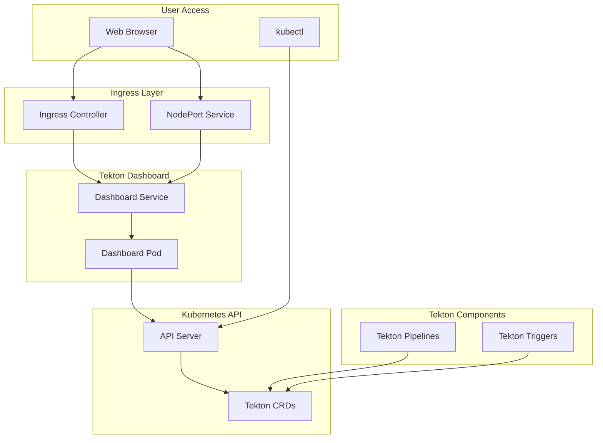
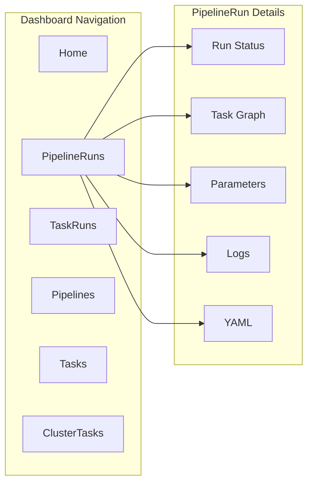
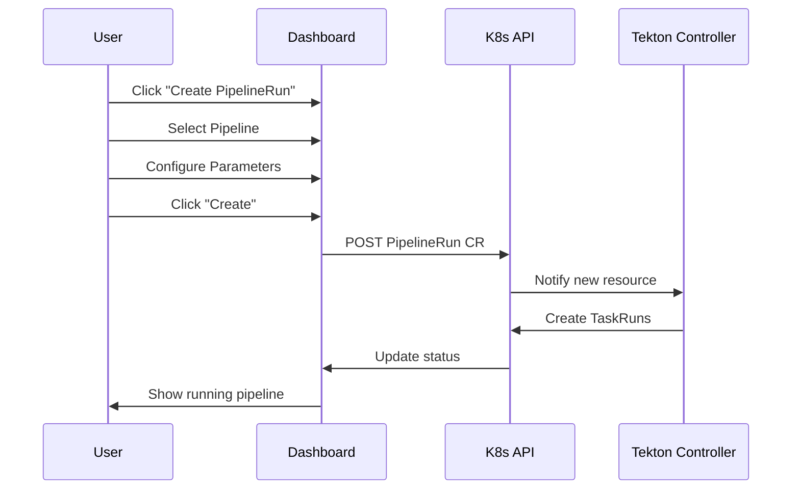

# How to Configure Tekton Dashboard

Author: [nawazdhandala](https://www.github.com/nawazdhandala)

Tags: Tekton, Kubernetes, CI/CD, Dashboard, DevOps, Cloud Native, Monitoring

Description: A hands-on guide to installing and configuring Tekton Dashboard for visualizing and managing your CI/CD pipelines on Kubernetes.

> Tekton Dashboard provides a web-based interface for monitoring and managing Tekton resources. Learn how to install, configure, secure, and customize it for your Kubernetes cluster.

## Why Use Tekton Dashboard?

Managing CI/CD pipelines through kubectl commands alone can become cumbersome as your system grows. Tekton Dashboard offers a visual interface that makes it easier to monitor pipeline runs, debug failures, and manage resources without memorizing complex CLI commands.

Key benefits include:

- **Real-time monitoring**: Watch pipeline and task runs as they execute
- **Log streaming**: View container logs directly in the browser
- **Resource management**: Create, view, and delete Tekton resources through the UI
- **Multi-namespace support**: Monitor pipelines across different namespaces
- **Extension support**: Add custom functionality through extensions

## Architecture Overview

Understanding how Tekton Dashboard fits into your cluster helps with troubleshooting and customization.



## Prerequisites

Before installing Tekton Dashboard, ensure you have the following components in place:

- Kubernetes cluster version 1.25 or later
- Tekton Pipelines installed and running
- kubectl configured with cluster access
- Cluster admin permissions for installation

You can verify your Tekton Pipelines installation with the following command that checks for running pods in the tekton-pipelines namespace.

```bash
# Check if Tekton Pipelines is installed and running
kubectl get pods -n tekton-pipelines

# Expected output shows pods in Running state:
# NAME                                           READY   STATUS    RESTARTS   AGE
# tekton-pipelines-controller-7d9bc7c8b5-2xjkl   1/1     Running   0          2d
# tekton-pipelines-webhook-6f8dc7c4d9-8vmnp      1/1     Running   0          2d
```

## Installing Tekton Dashboard

### Basic Installation

The simplest way to install Tekton Dashboard uses the official release manifests. Apply them directly from the Tekton releases storage.

```bash
# Install the latest stable release of Tekton Dashboard
kubectl apply --filename https://storage.googleapis.com/tekton-releases/dashboard/latest/release.yaml

# Wait for the dashboard pods to become ready
kubectl wait --for=condition=ready pod \
  -l app.kubernetes.io/part-of=tekton-dashboard \
  -n tekton-pipelines \
  --timeout=120s
```

### Verify Installation

After installation, verify that all dashboard components are running properly. The dashboard service should be available in the tekton-pipelines namespace.

```bash
# Check the dashboard pod status
kubectl get pods -n tekton-pipelines -l app.kubernetes.io/part-of=tekton-dashboard

# View the dashboard service
kubectl get svc tekton-dashboard -n tekton-pipelines

# Expected output:
# NAME               TYPE        CLUSTER-IP      EXTERNAL-IP   PORT(S)    AGE
# tekton-dashboard   ClusterIP   10.96.123.45    <none>        9097/TCP   5m
```

## Accessing the Dashboard

### Method 1: Port Forwarding

For quick access during development, port forwarding provides the simplest solution. Run the following command to forward local port 9097 to the dashboard service.

```bash
# Forward local port 9097 to the dashboard service
kubectl port-forward svc/tekton-dashboard -n tekton-pipelines 9097:9097

# Access the dashboard at http://localhost:9097
```

### Method 2: NodePort Service

For persistent access without port forwarding, convert the service to NodePort type. Patch the existing service to expose it on a node port.

```bash
# Patch the dashboard service to use NodePort
kubectl patch svc tekton-dashboard -n tekton-pipelines \
  --type='json' \
  -p='[{"op": "replace", "path": "/spec/type", "value": "NodePort"}]'

# Get the assigned NodePort
kubectl get svc tekton-dashboard -n tekton-pipelines -o jsonpath='{.spec.ports[0].nodePort}'

# Access via http://<node-ip>:<nodeport>
```

### Method 3: Ingress Configuration

For production environments, an Ingress provides the most flexible access method with support for TLS and custom domains. Create an Ingress resource that routes traffic to the dashboard service.

```yaml
# tekton-dashboard-ingress.yaml
# Ingress resource for exposing Tekton Dashboard with TLS termination
apiVersion: networking.k8s.io/v1
kind: Ingress
metadata:
  name: tekton-dashboard
  namespace: tekton-pipelines
  annotations:
    # Configure your ingress controller annotations here
    nginx.ingress.kubernetes.io/ssl-redirect: "true"
    nginx.ingress.kubernetes.io/backend-protocol: "HTTP"
spec:
  ingressClassName: nginx
  tls:
    - hosts:
        - tekton.example.com
      secretName: tekton-dashboard-tls
  rules:
    - host: tekton.example.com
      http:
        paths:
          - path: /
            pathType: Prefix
            backend:
              service:
                name: tekton-dashboard
                port:
                  number: 9097
```

Apply the Ingress configuration with the standard kubectl apply command.

```bash
# Apply the ingress configuration
kubectl apply -f tekton-dashboard-ingress.yaml

# Verify the ingress was created
kubectl get ingress tekton-dashboard -n tekton-pipelines
```

## Configuring Dashboard Options

### Read-Only Mode

In production environments, you might want to prevent accidental modifications through the dashboard. Enable read-only mode by modifying the deployment.

```bash
# Patch the deployment to enable read-only mode
kubectl patch deployment tekton-dashboard -n tekton-pipelines \
  --type='json' \
  -p='[{
    "op": "add",
    "path": "/spec/template/spec/containers/0/args/-",
    "value": "--read-only=true"
  }]'
```

### Namespace Filtering

Limit the dashboard to show resources from specific namespaces only. Configure the allowed namespaces through deployment arguments.

```yaml
# tekton-dashboard-namespace-config.yaml
# ConfigMap for restricting dashboard to specific namespaces
apiVersion: v1
kind: ConfigMap
metadata:
  name: tekton-dashboard-config
  namespace: tekton-pipelines
data:
  # Comma-separated list of namespaces to monitor
  ALLOWED_NAMESPACES: "dev,staging,production"
```

Apply namespace restrictions by updating the dashboard deployment with environment variables that reference the ConfigMap.

```yaml
# tekton-dashboard-deployment-patch.yaml
# Deployment patch for namespace filtering
apiVersion: apps/v1
kind: Deployment
metadata:
  name: tekton-dashboard
  namespace: tekton-pipelines
spec:
  template:
    spec:
      containers:
        - name: tekton-dashboard
          args:
            - --namespaces=dev,staging,production
            - --pipelines-namespace=tekton-pipelines
            - --triggers-namespace=tekton-pipelines
```

### Log Streaming Configuration

Configure log retention and streaming behavior for better debugging capabilities. Update the dashboard arguments to customize log handling.

```bash
# Enable external log streaming (useful with external logging systems)
kubectl patch deployment tekton-dashboard -n tekton-pipelines \
  --type='json' \
  -p='[{
    "op": "add",
    "path": "/spec/template/spec/containers/0/args/-",
    "value": "--external-logs=https://logging.example.com"
  }]'
```

## Security Configuration

### RBAC Setup

Tekton Dashboard requires proper RBAC configuration to access Tekton resources. For restricted access, create a custom ServiceAccount with limited permissions.

```yaml
# tekton-dashboard-rbac.yaml
# ServiceAccount and ClusterRole for limited dashboard access
apiVersion: v1
kind: ServiceAccount
metadata:
  name: tekton-dashboard-readonly
  namespace: tekton-pipelines
---
# ClusterRole granting read-only access to Tekton resources
apiVersion: rbac.authorization.k8s.io/v1
kind: ClusterRole
metadata:
  name: tekton-dashboard-readonly
rules:
  # Read access to Tekton pipeline resources
  - apiGroups: ["tekton.dev"]
    resources:
      - pipelineruns
      - taskruns
      - pipelines
      - tasks
      - clustertasks
    verbs: ["get", "list", "watch"]
  # Read access to Tekton trigger resources
  - apiGroups: ["triggers.tekton.dev"]
    resources:
      - eventlisteners
      - triggerbindings
      - triggertemplates
      - triggers
    verbs: ["get", "list", "watch"]
  # Read access to pods for log viewing
  - apiGroups: [""]
    resources: ["pods", "pods/log"]
    verbs: ["get", "list", "watch"]
---
# Bind the ClusterRole to the ServiceAccount
apiVersion: rbac.authorization.k8s.io/v1
kind: ClusterRoleBinding
metadata:
  name: tekton-dashboard-readonly
subjects:
  - kind: ServiceAccount
    name: tekton-dashboard-readonly
    namespace: tekton-pipelines
roleRef:
  kind: ClusterRole
  name: tekton-dashboard-readonly
  apiGroup: rbac.authorization.k8s.io
```

### OAuth2 Proxy Integration

For production deployments, protect the dashboard with OAuth2 authentication. Configure an OAuth2 proxy in front of the dashboard service.

```yaml
# oauth2-proxy-deployment.yaml
# OAuth2 Proxy deployment for dashboard authentication
apiVersion: apps/v1
kind: Deployment
metadata:
  name: oauth2-proxy
  namespace: tekton-pipelines
spec:
  replicas: 1
  selector:
    matchLabels:
      app: oauth2-proxy
  template:
    metadata:
      labels:
        app: oauth2-proxy
    spec:
      containers:
        - name: oauth2-proxy
          image: quay.io/oauth2-proxy/oauth2-proxy:v7.5.1
          args:
            - --provider=github
            - --email-domain=*
            - --upstream=http://tekton-dashboard:9097
            - --http-address=0.0.0.0:4180
            - --cookie-secure=true
            - --cookie-httponly=true
          env:
            # Store these in a Secret for production use
            - name: OAUTH2_PROXY_CLIENT_ID
              valueFrom:
                secretKeyRef:
                  name: oauth2-proxy-secret
                  key: client-id
            - name: OAUTH2_PROXY_CLIENT_SECRET
              valueFrom:
                secretKeyRef:
                  name: oauth2-proxy-secret
                  key: client-secret
            - name: OAUTH2_PROXY_COOKIE_SECRET
              valueFrom:
                secretKeyRef:
                  name: oauth2-proxy-secret
                  key: cookie-secret
          ports:
            - containerPort: 4180
              protocol: TCP
---
# Service for OAuth2 Proxy
apiVersion: v1
kind: Service
metadata:
  name: oauth2-proxy
  namespace: tekton-pipelines
spec:
  selector:
    app: oauth2-proxy
  ports:
    - port: 4180
      targetPort: 4180
```

Create the required secrets for OAuth2 proxy configuration. Replace the placeholder values with your actual OAuth credentials.

```bash
# Create the OAuth2 proxy secrets
# Replace with your actual OAuth provider credentials
kubectl create secret generic oauth2-proxy-secret \
  -n tekton-pipelines \
  --from-literal=client-id=YOUR_CLIENT_ID \
  --from-literal=client-secret=YOUR_CLIENT_SECRET \
  --from-literal=cookie-secret=$(openssl rand -base64 32)
```

## Dashboard Customization

### Custom Logo and Branding

Customize the dashboard appearance by mounting a custom logo. Create a ConfigMap containing your logo and mount it in the deployment.

```yaml
# tekton-dashboard-branding.yaml
# ConfigMap for custom branding assets
apiVersion: v1
kind: ConfigMap
metadata:
  name: tekton-dashboard-branding
  namespace: tekton-pipelines
data:
  # Base64-encoded logo or reference to an image URL
  logo-url: "https://your-company.com/logo.png"
---
# Patch to mount custom branding
apiVersion: apps/v1
kind: Deployment
metadata:
  name: tekton-dashboard
  namespace: tekton-pipelines
spec:
  template:
    spec:
      containers:
        - name: tekton-dashboard
          args:
            - --logo-url=https://your-company.com/logo.png
```

### Extension Installation

Tekton Dashboard supports extensions for additional functionality. Install the Webhooks extension to manage webhook configurations through the UI.

```bash
# Install the Tekton Dashboard Webhooks Extension
kubectl apply --filename https://storage.googleapis.com/tekton-releases/dashboard/latest/webhooks-extension-release.yaml

# Verify the extension is installed
kubectl get pods -n tekton-pipelines -l app=webhooks-extension
```

## Monitoring Pipeline Runs

### Viewing Active Runs

Navigate through the dashboard to monitor your pipeline executions. The main sections you will use most frequently include:



### Triggering Runs from Dashboard

When running in read-write mode, you can create new pipeline runs directly from the dashboard interface. Follow these steps to trigger a pipeline execution.



## High Availability Configuration

### Multi-Replica Deployment

For production environments, run multiple dashboard replicas to ensure availability. Update the deployment replica count and add anti-affinity rules.

```yaml
# tekton-dashboard-ha.yaml
# High availability configuration for Tekton Dashboard
apiVersion: apps/v1
kind: Deployment
metadata:
  name: tekton-dashboard
  namespace: tekton-pipelines
spec:
  # Run multiple replicas for high availability
  replicas: 3
  strategy:
    type: RollingUpdate
    rollingUpdate:
      maxSurge: 1
      maxUnavailable: 0
  template:
    spec:
      # Spread replicas across nodes
      affinity:
        podAntiAffinity:
          preferredDuringSchedulingIgnoredDuringExecution:
            - weight: 100
              podAffinityTerm:
                labelSelector:
                  matchLabels:
                    app.kubernetes.io/part-of: tekton-dashboard
                topologyKey: kubernetes.io/hostname
      # Resource limits for predictable performance
      containers:
        - name: tekton-dashboard
          resources:
            requests:
              cpu: 100m
              memory: 128Mi
            limits:
              cpu: 500m
              memory: 512Mi
```

### Health Checks

Configure proper health checks for the dashboard pods to ensure Kubernetes can detect and replace unhealthy instances.

```yaml
# Health check configuration for dashboard containers
apiVersion: apps/v1
kind: Deployment
metadata:
  name: tekton-dashboard
  namespace: tekton-pipelines
spec:
  template:
    spec:
      containers:
        - name: tekton-dashboard
          # Liveness probe checks if the container is running
          livenessProbe:
            httpGet:
              path: /health
              port: 9097
            initialDelaySeconds: 10
            periodSeconds: 10
            timeoutSeconds: 5
            failureThreshold: 3
          # Readiness probe checks if the container can serve traffic
          readinessProbe:
            httpGet:
              path: /readiness
              port: 9097
            initialDelaySeconds: 5
            periodSeconds: 5
            timeoutSeconds: 3
            failureThreshold: 3
```

## Troubleshooting

### Common Issues

When the dashboard fails to display resources, check the service account permissions. View the dashboard logs for RBAC-related errors.

```bash
# Check dashboard pod logs for errors
kubectl logs -n tekton-pipelines -l app.kubernetes.io/part-of=tekton-dashboard

# Verify RBAC permissions
kubectl auth can-i list pipelineruns \
  --as=system:serviceaccount:tekton-pipelines:tekton-dashboard \
  -n default
```

### Connection Problems

If you cannot access the dashboard, verify the service and pod status. Run these diagnostic commands to identify the issue.

```bash
# Check if the dashboard pod is running
kubectl get pods -n tekton-pipelines -l app.kubernetes.io/part-of=tekton-dashboard -o wide

# Verify the service endpoints
kubectl get endpoints tekton-dashboard -n tekton-pipelines

# Test connectivity from within the cluster
kubectl run test-curl --rm -it --restart=Never --image=curlimages/curl -- \
  curl -s http://tekton-dashboard.tekton-pipelines:9097/health
```

### Performance Issues

When the dashboard becomes slow with many pipeline runs, configure resource pruning to clean up old runs automatically.

```yaml
# tekton-prune-cronjob.yaml
# CronJob to prune old PipelineRuns and TaskRuns
apiVersion: batch/v1
kind: CronJob
metadata:
  name: tekton-resource-pruner
  namespace: tekton-pipelines
spec:
  # Run daily at midnight
  schedule: "0 0 * * *"
  jobTemplate:
    spec:
      template:
        spec:
          serviceAccountName: tekton-dashboard
          containers:
            - name: pruner
              image: bitnami/kubectl:latest
              command:
                - /bin/sh
                - -c
                - |
                  # Delete PipelineRuns older than 7 days
                  kubectl delete pipelineruns \
                    --field-selector=status.completionTime!="" \
                    --all-namespaces \
                    --selector='tekton.dev/pipeline' \
                    --field-selector="metadata.creationTimestamp<$(date -d '7 days ago' -Iseconds)"
          restartPolicy: OnFailure
```

## Integration with External Tools

### Grafana Dashboard

Export Tekton metrics to Prometheus and visualize them in Grafana for comprehensive monitoring beyond what the Tekton Dashboard provides.

```yaml
# tekton-grafana-dashboard.yaml
# ConfigMap containing Grafana dashboard JSON
apiVersion: v1
kind: ConfigMap
metadata:
  name: tekton-grafana-dashboard
  namespace: monitoring
  labels:
    grafana_dashboard: "1"
data:
  tekton-dashboard.json: |
    {
      "dashboard": {
        "title": "Tekton Pipeline Metrics",
        "panels": [
          {
            "title": "PipelineRun Duration",
            "type": "graph",
            "targets": [
              {
                "expr": "histogram_quantile(0.95, sum(rate(tekton_pipelines_controller_pipelinerun_duration_seconds_bucket[5m])) by (le, pipeline))",
                "legendFormat": "{{pipeline}} p95"
              }
            ]
          },
          {
            "title": "TaskRun Success Rate",
            "type": "gauge",
            "targets": [
              {
                "expr": "sum(tekton_pipelines_controller_taskrun_count{status=\"success\"}) / sum(tekton_pipelines_controller_taskrun_count) * 100"
              }
            ]
          }
        ]
      }
    }
```

### Slack Notifications

Configure Tekton to send notifications to Slack when pipelines complete. Create a trigger that posts to a webhook URL.

```yaml
# slack-notification-task.yaml
# Task for sending Slack notifications about pipeline status
apiVersion: tekton.dev/v1beta1
kind: Task
metadata:
  name: send-slack-notification
  namespace: tekton-pipelines
spec:
  params:
    - name: webhook-url
      type: string
      description: Slack webhook URL
    - name: message
      type: string
      description: Message to send
    - name: pipeline-name
      type: string
      description: Name of the pipeline
    - name: status
      type: string
      description: Pipeline status (succeeded/failed)
  steps:
    - name: send-notification
      image: curlimages/curl:latest
      script: |
        #!/bin/sh
        # Determine emoji based on status
        if [ "$(params.status)" = "succeeded" ]; then
          EMOJI=":white_check_mark:"
          COLOR="good"
        else
          EMOJI=":x:"
          COLOR="danger"
        fi

        # Send notification to Slack
        curl -X POST -H 'Content-type: application/json' \
          --data "{
            \"attachments\": [{
              \"color\": \"${COLOR}\",
              \"text\": \"${EMOJI} Pipeline *$(params.pipeline-name)* $(params.status)\\n$(params.message)\"
            }]
          }" \
          $(params.webhook-url)
```

## Best Practices

Following these recommendations will help you maintain a secure and performant Tekton Dashboard installation:

1. **Always use TLS**: Encrypt traffic to the dashboard, especially in production
2. **Implement authentication**: Never expose the dashboard without proper authentication
3. **Use read-only mode in production**: Prevent accidental changes through the UI
4. **Configure resource pruning**: Automatically clean up old pipeline runs
5. **Monitor dashboard health**: Set up alerts for dashboard availability
6. **Limit namespace access**: Only show relevant namespaces to each team
7. **Regular updates**: Keep the dashboard version aligned with Tekton Pipelines

## Conclusion

Tekton Dashboard transforms pipeline management from a command-line exercise into a visual experience. After configuring access methods, security controls, and customizations covered in this guide, your team can monitor and manage CI/CD workflows more effectively.

For deeper integration with your existing infrastructure, explore the Tekton Catalog for additional tasks and consider building custom extensions to meet your specific requirements. More information about Tekton Dashboard can be found in the official documentation at tekton.dev.

Related Articles:
- [Getting Started with Tekton Pipelines](https://oneuptime.com/blog/post/tekton-pipelines-guide/view)
