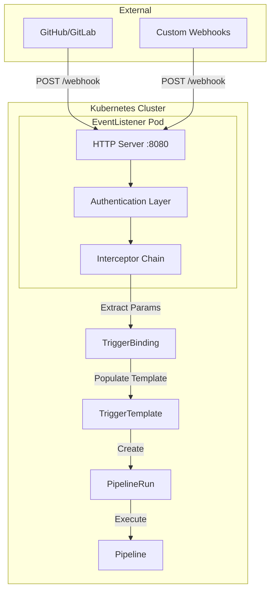
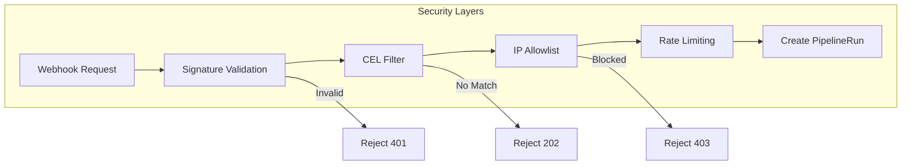
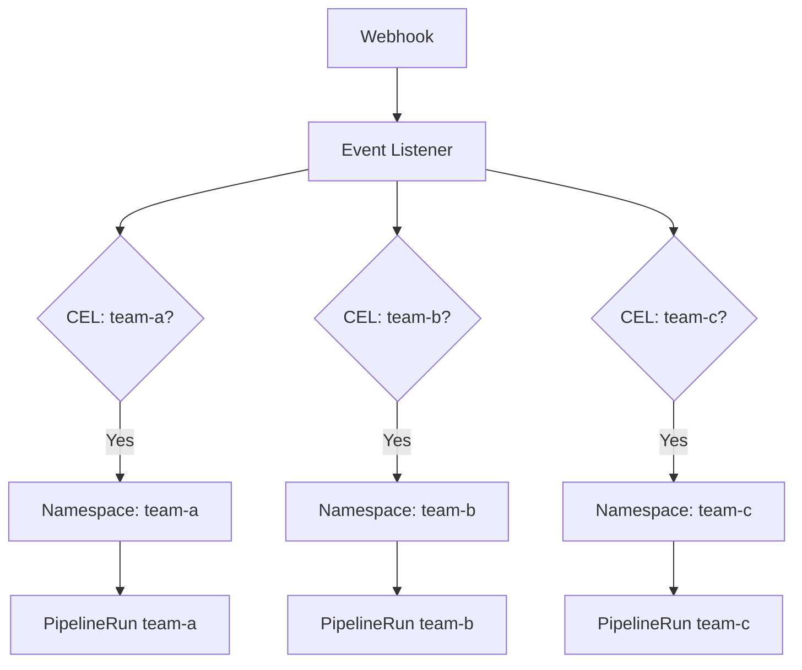

# How to Implement Tekton Event Listeners

Author: [nawazdhandala](https://www.github.com/nawazdhandala)

Tags: Tekton, Kubernetes, CI/CD, Event Listeners, DevOps, Webhooks, GitOps, Automation

Description: A hands-on guide to implementing Tekton Event Listeners for webhook-driven CI/CD pipelines, covering architecture patterns, security hardening, scaling strategies, and production deployment configurations.

---

Event Listeners are the gateway to automated CI/CD in Tekton. They receive webhooks from GitHub, GitLab, Bitbucket, or any HTTP source and kick off pipeline runs automatically. No polling. No manual intervention. Just push code and watch your pipelines run.

## Understanding Event Listener Architecture

An Event Listener is essentially a Kubernetes Deployment that runs a small HTTP server. When webhooks hit the endpoint, the server processes them through interceptors, extracts parameters via bindings, and creates resources using templates.



Key components in the flow:

1. **HTTP Server** - Listens on port 8080 by default, receives POST requests
2. **Authentication Layer** - Validates webhook signatures using secrets
3. **Interceptor Chain** - Filters, transforms, and enriches event data
4. **TriggerBinding** - Maps webhook payload fields to parameters
5. **TriggerTemplate** - Generates Kubernetes resources from parameters

## Installing Prerequisites

Before creating Event Listeners, you need Tekton Pipelines and Triggers installed in your cluster.

Install Tekton Pipelines and Triggers along with the interceptors that validate webhooks:

```bash
# Install Tekton Pipelines
kubectl apply --filename https://storage.googleapis.com/tekton-releases/pipeline/latest/release.yaml

# Install Tekton Triggers
kubectl apply --filename https://storage.googleapis.com/tekton-releases/triggers/latest/release.yaml

# Install interceptors (GitHub, GitLab, Bitbucket, CEL)
kubectl apply --filename https://storage.googleapis.com/tekton-releases/triggers/latest/interceptors.yaml

# Wait for all pods to be ready
kubectl wait --for=condition=Ready pods --all -n tekton-pipelines --timeout=300s
```

Verify the installation by checking for running interceptor pods:

```bash
kubectl get pods -n tekton-pipelines | grep interceptor
```

## Creating Your First Event Listener

Start with a basic Event Listener that receives GitHub push events and triggers a pipeline.

Define the Event Listener resource with a single trigger configuration:

```yaml
# event-listener-basic.yaml
apiVersion: triggers.tekton.dev/v1beta1
kind: EventListener
metadata:
  name: github-listener
  namespace: tekton-pipelines
spec:
  # Service account with permissions to create PipelineRuns
  serviceAccountName: tekton-triggers-sa

  triggers:
    - name: github-push
      # Interceptors process events in order
      interceptors:
        - ref:
            name: "github"
          params:
            - name: "secretRef"
              value:
                secretName: github-webhook-secret
                secretKey: secret
            - name: "eventTypes"
              value: ["push"]
      # Map webhook data to parameters
      bindings:
        - ref: github-push-binding
      # Template to create PipelineRun
      template:
        ref: build-template
```

The TriggerBinding extracts values from the webhook JSON payload:

```yaml
# trigger-binding.yaml
apiVersion: triggers.tekton.dev/v1beta1
kind: TriggerBinding
metadata:
  name: github-push-binding
  namespace: tekton-pipelines
spec:
  params:
    # $(body.xxx) references JSON fields in the webhook payload
    - name: git-revision
      value: $(body.after)
    - name: git-repo-url
      value: $(body.repository.clone_url)
    - name: git-repo-name
      value: $(body.repository.name)
    - name: git-branch
      value: $(body.ref)
```

Create the TriggerTemplate that generates PipelineRun resources:

```yaml
# trigger-template.yaml
apiVersion: triggers.tekton.dev/v1beta1
kind: TriggerTemplate
metadata:
  name: build-template
  namespace: tekton-pipelines
spec:
  params:
    - name: git-revision
      description: Git commit SHA
    - name: git-repo-url
      description: Repository clone URL
    - name: git-repo-name
      description: Repository name
    - name: git-branch
      description: Branch reference
      default: refs/heads/main

  resourcetemplates:
    - apiVersion: tekton.dev/v1beta1
      kind: PipelineRun
      metadata:
        # generateName creates unique names for each run
        generateName: $(tt.params.git-repo-name)-build-
        namespace: tekton-pipelines
        labels:
          tekton.dev/pipeline: build-pipeline
          app.kubernetes.io/managed-by: tekton-triggers
      spec:
        pipelineRef:
          name: build-pipeline
        params:
          - name: repo-url
            value: $(tt.params.git-repo-url)
          - name: revision
            value: $(tt.params.git-revision)
        workspaces:
          - name: source
            volumeClaimTemplate:
              spec:
                accessModes:
                  - ReadWriteOnce
                resources:
                  requests:
                    storage: 1Gi
```

## Setting Up RBAC Permissions

Event Listeners need appropriate permissions to create PipelineRuns and access secrets.

Create the service account and RBAC resources required for Event Listeners:

```yaml
# rbac.yaml
apiVersion: v1
kind: ServiceAccount
metadata:
  name: tekton-triggers-sa
  namespace: tekton-pipelines

---
# Role for namespace-scoped resources
apiVersion: rbac.authorization.k8s.io/v1
kind: Role
metadata:
  name: tekton-triggers-role
  namespace: tekton-pipelines
rules:
  # Create and manage pipeline runs
  - apiGroups: ["tekton.dev"]
    resources: ["pipelineruns", "taskruns"]
    verbs: ["create", "get", "list", "watch"]

  # Access trigger resources
  - apiGroups: ["triggers.tekton.dev"]
    resources: ["eventlisteners", "triggerbindings", "triggertemplates", "triggers", "interceptors"]
    verbs: ["get", "list", "watch"]

  # Read secrets for webhook validation
  - apiGroups: [""]
    resources: ["secrets"]
    verbs: ["get", "list", "watch"]

  # Create ConfigMaps for build artifacts
  - apiGroups: [""]
    resources: ["configmaps"]
    verbs: ["create", "get", "update", "delete"]

---
apiVersion: rbac.authorization.k8s.io/v1
kind: RoleBinding
metadata:
  name: tekton-triggers-rolebinding
  namespace: tekton-pipelines
subjects:
  - kind: ServiceAccount
    name: tekton-triggers-sa
    namespace: tekton-pipelines
roleRef:
  kind: Role
  name: tekton-triggers-role
  apiGroup: rbac.authorization.k8s.io

---
# ClusterRole for cluster-scoped trigger resources
apiVersion: rbac.authorization.k8s.io/v1
kind: ClusterRole
metadata:
  name: tekton-triggers-clusterrole
rules:
  - apiGroups: ["triggers.tekton.dev"]
    resources: ["clustertriggerbindings", "clusterinterceptors"]
    verbs: ["get", "list", "watch"]

---
apiVersion: rbac.authorization.k8s.io/v1
kind: ClusterRoleBinding
metadata:
  name: tekton-triggers-clusterrolebinding
subjects:
  - kind: ServiceAccount
    name: tekton-triggers-sa
    namespace: tekton-pipelines
roleRef:
  kind: ClusterRole
  name: tekton-triggers-clusterrole
  apiGroup: rbac.authorization.k8s.io
```

## Securing Event Listeners

Webhook endpoints must validate incoming requests to prevent unauthorized pipeline execution.



### Webhook Signature Validation

Generate and configure a webhook secret for GitHub:

```bash
# Generate a cryptographically secure random secret
WEBHOOK_SECRET=$(openssl rand -hex 32)

# Store the secret in Kubernetes
kubectl create secret generic github-webhook-secret \
  --from-literal=secret=$WEBHOOK_SECRET \
  -n tekton-pipelines

# Display the secret for configuring in GitHub
echo "Add this secret to your GitHub webhook configuration:"
echo $WEBHOOK_SECRET
```

For GitLab webhooks, create a separate secret with the token format GitLab expects:

```bash
# GitLab uses a different header for webhook tokens
GITLAB_TOKEN=$(openssl rand -hex 32)

kubectl create secret generic gitlab-webhook-secret \
  --from-literal=token=$GITLAB_TOKEN \
  -n tekton-pipelines
```

### IP Allowlisting with Network Policies

Restrict Event Listener access to known webhook source IPs:

```yaml
# network-policy.yaml
apiVersion: networking.k8s.io/v1
kind: NetworkPolicy
metadata:
  name: eventlistener-ingress
  namespace: tekton-pipelines
spec:
  podSelector:
    matchLabels:
      eventlistener: github-listener
  policyTypes:
    - Ingress
  ingress:
    - from:
        # GitHub webhook IP ranges
        # Check https://api.github.com/meta for current ranges
        - ipBlock:
            cidr: 140.82.112.0/20
        - ipBlock:
            cidr: 185.199.108.0/22
        - ipBlock:
            cidr: 192.30.252.0/22
      ports:
        - protocol: TCP
          port: 8080
```

### Rate Limiting Configuration

Protect against webhook floods by configuring resource limits:

```yaml
# event-listener-rate-limited.yaml
apiVersion: triggers.tekton.dev/v1beta1
kind: EventListener
metadata:
  name: github-listener
  namespace: tekton-pipelines
spec:
  serviceAccountName: tekton-triggers-sa
  triggers:
    - name: github-push
      interceptors:
        - ref:
            name: "github"
          params:
            - name: "secretRef"
              value:
                secretName: github-webhook-secret
                secretKey: secret
      bindings:
        - ref: github-push-binding
      template:
        ref: build-template

  # Resource configuration for the EventListener pod
  resources:
    kubernetesResource:
      spec:
        template:
          spec:
            containers:
              - resources:
                  requests:
                    memory: "64Mi"
                    cpu: "50m"
                  limits:
                    memory: "256Mi"
                    cpu: "500m"
```

## Advanced Interceptor Patterns

Interceptors provide powerful filtering and transformation capabilities beyond simple event type matching.

### Chaining Multiple Interceptors

Process events through a sequence of interceptors that each add validation or transformation:

```yaml
# chained-interceptors.yaml
apiVersion: triggers.tekton.dev/v1beta1
kind: EventListener
metadata:
  name: advanced-listener
  namespace: tekton-pipelines
spec:
  serviceAccountName: tekton-triggers-sa
  triggers:
    - name: filtered-push
      interceptors:
        # First: Validate GitHub signature
        - ref:
            name: "github"
          params:
            - name: "secretRef"
              value:
                secretName: github-webhook-secret
                secretKey: secret
            - name: "eventTypes"
              value: ["push"]

        # Second: Filter by branch pattern
        - ref:
            name: "cel"
          params:
            - name: "filter"
              value: >
                body.ref.startsWith('refs/heads/main') ||
                body.ref.startsWith('refs/heads/release/')

        # Third: Skip if commit message contains [skip ci]
        - ref:
            name: "cel"
          params:
            - name: "filter"
              value: "!body.head_commit.message.contains('[skip ci]')"

        # Fourth: Add computed fields for use in bindings
        - ref:
            name: "cel"
          params:
            - name: "overlays"
              value:
                - key: branch_name
                  expression: "body.ref.split('/')[2]"
                - key: short_sha
                  expression: "body.after.substring(0, 8)"
                - key: is_main
                  expression: "body.ref == 'refs/heads/main'"

      bindings:
        - ref: github-push-binding
      template:
        ref: build-template
```

### CEL Expression Examples

CEL (Common Expression Language) provides rich filtering capabilities.

Common CEL patterns for filtering webhook events:

```yaml
# cel-patterns.yaml
interceptors:
  - ref:
      name: "cel"
    params:
      # Match specific file changes
      - name: "filter"
        value: >
          body.commits.exists(c,
            c.added.exists(f, f.startsWith('src/')) ||
            c.modified.exists(f, f.startsWith('src/'))
          )

      # Match by commit author
      - name: "filter"
        value: "body.pusher.name != 'dependabot[bot]'"

      # Match by repository topics
      - name: "filter"
        value: "body.repository.topics.exists(t, t == 'production')"

      # Combine conditions with logical operators
      - name: "filter"
        value: >
          body.ref == 'refs/heads/main' &&
          body.repository.private == false &&
          size(body.commits) > 0
```

### Custom Interceptor for Validation

Create a custom interceptor webhook for complex validation logic:

```yaml
# custom-interceptor-deployment.yaml
apiVersion: apps/v1
kind: Deployment
metadata:
  name: custom-validator
  namespace: tekton-pipelines
spec:
  replicas: 2
  selector:
    matchLabels:
      app: custom-validator
  template:
    metadata:
      labels:
        app: custom-validator
    spec:
      containers:
        - name: validator
          image: your-registry/custom-validator:v1
          ports:
            - containerPort: 8080
          env:
            - name: ALLOWED_REPOS
              value: "myorg/repo1,myorg/repo2"

---
apiVersion: v1
kind: Service
metadata:
  name: custom-validator
  namespace: tekton-pipelines
spec:
  selector:
    app: custom-validator
  ports:
    - port: 80
      targetPort: 8080
```

Reference the custom interceptor in your Event Listener:

```yaml
# event-listener-custom-interceptor.yaml
interceptors:
  - ref:
      name: "github"
    params:
      - name: "secretRef"
        value:
          secretName: github-webhook-secret
          secretKey: secret

  # Call custom validation service
  - webhook:
      objectRef:
        kind: Service
        name: custom-validator
        namespace: tekton-pipelines
        apiVersion: v1
```

## Multi-Tenant Event Listeners

Support multiple teams or projects with a single Event Listener using namespaced triggers.



Configure an Event Listener that routes to different namespaces based on repository:

```yaml
# multi-tenant-eventlistener.yaml
apiVersion: triggers.tekton.dev/v1beta1
kind: EventListener
metadata:
  name: multi-tenant-listener
  namespace: tekton-pipelines
spec:
  serviceAccountName: tekton-triggers-sa
  triggers:
    # Team A repositories
    - name: team-a-trigger
      interceptors:
        - ref:
            name: "github"
          params:
            - name: "secretRef"
              value:
                secretName: github-webhook-secret
                secretKey: secret
        - ref:
            name: "cel"
          params:
            - name: "filter"
              value: "body.repository.full_name.startsWith('myorg/team-a-')"
            - name: "overlays"
              value:
                - key: target_namespace
                  expression: "'team-a'"
      bindings:
        - ref: github-push-binding
        - name: namespace-binding
          value: team-a
      template:
        ref: namespaced-build-template

    # Team B repositories
    - name: team-b-trigger
      interceptors:
        - ref:
            name: "github"
          params:
            - name: "secretRef"
              value:
                secretName: github-webhook-secret
                secretKey: secret
        - ref:
            name: "cel"
          params:
            - name: "filter"
              value: "body.repository.full_name.startsWith('myorg/team-b-')"
      bindings:
        - ref: github-push-binding
        - name: namespace-binding
          value: team-b
      template:
        ref: namespaced-build-template
```

Create the TriggerTemplate that uses the namespace parameter:

```yaml
# namespaced-trigger-template.yaml
apiVersion: triggers.tekton.dev/v1beta1
kind: TriggerTemplate
metadata:
  name: namespaced-build-template
  namespace: tekton-pipelines
spec:
  params:
    - name: git-revision
    - name: git-repo-url
    - name: git-repo-name
    - name: target-namespace
      description: Namespace where PipelineRun will be created

  resourcetemplates:
    - apiVersion: tekton.dev/v1beta1
      kind: PipelineRun
      metadata:
        generateName: $(tt.params.git-repo-name)-
        # PipelineRun created in team's namespace
        namespace: $(tt.params.target-namespace)
      spec:
        pipelineRef:
          name: build-pipeline
        params:
          - name: repo-url
            value: $(tt.params.git-repo-url)
          - name: revision
            value: $(tt.params.git-revision)
```

## Scaling Event Listeners

Production deployments need high availability and horizontal scaling.

### Replica Configuration

Scale the Event Listener deployment for high availability:

```yaml
# scaled-eventlistener.yaml
apiVersion: triggers.tekton.dev/v1beta1
kind: EventListener
metadata:
  name: ha-listener
  namespace: tekton-pipelines
spec:
  serviceAccountName: tekton-triggers-sa
  triggers:
    - name: github-push
      interceptors:
        - ref:
            name: "github"
          params:
            - name: "secretRef"
              value:
                secretName: github-webhook-secret
                secretKey: secret
      bindings:
        - ref: github-push-binding
      template:
        ref: build-template

  resources:
    kubernetesResource:
      # Configure replicas for high availability
      replicas: 3
      spec:
        template:
          spec:
            # Spread pods across nodes
            affinity:
              podAntiAffinity:
                preferredDuringSchedulingIgnoredDuringExecution:
                  - weight: 100
                    podAffinityTerm:
                      labelSelector:
                        matchLabels:
                          eventlistener: ha-listener
                      topologyKey: kubernetes.io/hostname
            containers:
              - resources:
                  requests:
                    memory: "128Mi"
                    cpu: "100m"
                  limits:
                    memory: "512Mi"
                    cpu: "1000m"
```

### Horizontal Pod Autoscaler

Configure automatic scaling based on webhook traffic:

```yaml
# eventlistener-hpa.yaml
apiVersion: autoscaling/v2
kind: HorizontalPodAutoscaler
metadata:
  name: eventlistener-hpa
  namespace: tekton-pipelines
spec:
  scaleTargetRef:
    apiVersion: apps/v1
    kind: Deployment
    # Event Listener deployments follow naming pattern: el-<name>
    name: el-ha-listener
  minReplicas: 2
  maxReplicas: 10
  metrics:
    - type: Resource
      resource:
        name: cpu
        target:
          type: Utilization
          averageUtilization: 70
    - type: Resource
      resource:
        name: memory
        target:
          type: Utilization
          averageUtilization: 80
```

## Exposing Event Listeners

Event Listeners need external access to receive webhooks from Git providers.

### Ingress Configuration

Expose the Event Listener through an Ingress controller:

```yaml
# ingress.yaml
apiVersion: networking.k8s.io/v1
kind: Ingress
metadata:
  name: tekton-webhooks
  namespace: tekton-pipelines
  annotations:
    kubernetes.io/ingress.class: nginx
    cert-manager.io/cluster-issuer: letsencrypt-prod
    nginx.ingress.kubernetes.io/ssl-redirect: "true"
spec:
  tls:
    - hosts:
        - webhooks.example.com
      secretName: webhooks-tls
  rules:
    - host: webhooks.example.com
      http:
        paths:
          # Route to Event Listener service
          # Service name follows pattern: el-<eventlistener-name>
          - path: /github
            pathType: Prefix
            backend:
              service:
                name: el-github-listener
                port:
                  number: 8080
          - path: /gitlab
            pathType: Prefix
            backend:
              service:
                name: el-gitlab-listener
                port:
                  number: 8080
```

### LoadBalancer Service

For simpler setups, expose directly via LoadBalancer:

```yaml
# loadbalancer-service.yaml
apiVersion: v1
kind: Service
metadata:
  name: github-listener-lb
  namespace: tekton-pipelines
  annotations:
    # Cloud provider specific annotations
    service.beta.kubernetes.io/aws-load-balancer-type: nlb
    service.beta.kubernetes.io/aws-load-balancer-scheme: internet-facing
spec:
  type: LoadBalancer
  selector:
    eventlistener: github-listener
  ports:
    - port: 443
      targetPort: 8080
      protocol: TCP
```

## Monitoring and Observability

Track Event Listener health and webhook processing metrics.

### Prometheus Metrics

Event Listeners expose metrics on the `/metrics` endpoint:

```yaml
# servicemonitor.yaml
apiVersion: monitoring.coreos.com/v1
kind: ServiceMonitor
metadata:
  name: eventlistener-metrics
  namespace: tekton-pipelines
spec:
  selector:
    matchLabels:
      eventlistener: github-listener
  endpoints:
    - port: http-metrics
      interval: 30s
      path: /metrics
```

### Key Metrics to Monitor

Important metrics exposed by Event Listeners:

```yaml
# Useful PromQL queries for Tekton Event Listeners

# Webhook requests per minute by listener
rate(http_requests_total{job="tekton-triggers"}[5m])

# Failed webhook validations
rate(interceptor_validation_failures_total[5m])

# PipelineRun creation latency
histogram_quantile(0.95, rate(trigger_resource_creation_duration_seconds_bucket[5m]))

# Active Event Listener pods
count(up{job="tekton-triggers"})
```

### Alerting Rules

Configure alerts for Event Listener issues:

```yaml
# alerting-rules.yaml
apiVersion: monitoring.coreos.com/v1
kind: PrometheusRule
metadata:
  name: tekton-triggers-alerts
  namespace: tekton-pipelines
spec:
  groups:
    - name: tekton-triggers
      rules:
        - alert: EventListenerDown
          expr: up{job="tekton-triggers"} == 0
          for: 5m
          labels:
            severity: critical
          annotations:
            summary: "Tekton Event Listener is down"
            description: "No Event Listener pods are running"

        - alert: HighWebhookFailureRate
          expr: >
            rate(interceptor_validation_failures_total[5m]) /
            rate(http_requests_total{job="tekton-triggers"}[5m]) > 0.1
          for: 10m
          labels:
            severity: warning
          annotations:
            summary: "High webhook validation failure rate"
            description: "More than 10% of webhooks are failing validation"
```

## Debugging Event Listeners

When webhooks fail to trigger pipelines, systematic debugging helps identify the issue.

### Check Event Listener Logs

View logs from the Event Listener pod:

```bash
# Find the Event Listener pod
kubectl get pods -n tekton-pipelines -l eventlistener=github-listener

# Stream logs from the Event Listener
kubectl logs -n tekton-pipelines -l eventlistener=github-listener -f

# Check for specific errors
kubectl logs -n tekton-pipelines -l eventlistener=github-listener | grep -i error
```

### Verify Service Endpoint

Confirm the Event Listener service is accessible:

```bash
# Get the service details
kubectl get svc -n tekton-pipelines el-github-listener

# Test local connectivity
kubectl port-forward svc/el-github-listener 8080:8080 -n tekton-pipelines

# In another terminal, send a test request
curl -v http://localhost:8080
```

### Simulate Webhook Delivery

Send a test webhook to verify the Event Listener is processing events:

```bash
# Create a sample GitHub push payload
cat > /tmp/payload.json << 'EOF'
{
  "ref": "refs/heads/main",
  "after": "abc123def456789",
  "repository": {
    "name": "test-repo",
    "clone_url": "https://github.com/myorg/test-repo.git"
  },
  "head_commit": {
    "message": "Test commit"
  },
  "pusher": {
    "name": "testuser"
  }
}
EOF

# Calculate the signature (requires the webhook secret)
SIGNATURE=$(echo -n "$(cat /tmp/payload.json)" | openssl dgst -sha256 -hmac "your-webhook-secret" | cut -d' ' -f2)

# Send the request
curl -X POST http://localhost:8080 \
  -H "Content-Type: application/json" \
  -H "X-GitHub-Event: push" \
  -H "X-Hub-Signature-256: sha256=$SIGNATURE" \
  -d @/tmp/payload.json
```

### Inspect Created Resources

Check if PipelineRuns were created successfully:

```bash
# List recent PipelineRuns
kubectl get pipelineruns -n tekton-pipelines --sort-by=.metadata.creationTimestamp | tail -10

# Describe a specific PipelineRun for details
kubectl describe pipelinerun <name> -n tekton-pipelines

# Check for failed runs
kubectl get pipelineruns -n tekton-pipelines -o custom-columns=NAME:.metadata.name,STATUS:.status.conditions[0].reason
```

## Production Deployment Checklist

Before deploying Event Listeners to production, verify each configuration aspect.

### Security Checklist

```yaml
# production-checklist.yaml
# Verify these items before going live

security:
  - webhook_secrets_configured: true
  - secrets_rotated_regularly: true
  - network_policies_applied: true
  - rbac_least_privilege: true
  - tls_enabled_on_ingress: true

reliability:
  - multiple_replicas: 3
  - pod_anti_affinity: true
  - resource_limits_set: true
  - hpa_configured: true
  - pdb_configured: true

observability:
  - metrics_exposed: true
  - logs_aggregated: true
  - alerts_configured: true
  - dashboards_created: true

operations:
  - runbook_documented: true
  - backup_strategy_defined: true
  - disaster_recovery_tested: true
```

### Pod Disruption Budget

Ensure availability during cluster maintenance:

```yaml
# pdb.yaml
apiVersion: policy/v1
kind: PodDisruptionBudget
metadata:
  name: eventlistener-pdb
  namespace: tekton-pipelines
spec:
  minAvailable: 2
  selector:
    matchLabels:
      eventlistener: github-listener
```

### Complete Production Configuration

A production-ready Event Listener with all security and reliability features:

```yaml
# production-eventlistener.yaml
apiVersion: triggers.tekton.dev/v1beta1
kind: EventListener
metadata:
  name: production-listener
  namespace: tekton-pipelines
  labels:
    app.kubernetes.io/name: tekton-triggers
    app.kubernetes.io/component: eventlistener
    environment: production
spec:
  serviceAccountName: tekton-triggers-sa

  triggers:
    - name: github-push-main
      interceptors:
        # Validate webhook signature
        - ref:
            name: "github"
          params:
            - name: "secretRef"
              value:
                secretName: github-webhook-secret
                secretKey: secret
            - name: "eventTypes"
              value: ["push"]

        # Filter to main branch only
        - ref:
            name: "cel"
          params:
            - name: "filter"
              value: "body.ref == 'refs/heads/main'"
            - name: "overlays"
              value:
                - key: short_sha
                  expression: "body.after.substring(0, 8)"

      bindings:
        - ref: github-push-binding
      template:
        ref: production-build-template

  resources:
    kubernetesResource:
      replicas: 3
      spec:
        template:
          metadata:
            labels:
              eventlistener: production-listener
          spec:
            affinity:
              podAntiAffinity:
                requiredDuringSchedulingIgnoredDuringExecution:
                  - labelSelector:
                      matchLabels:
                        eventlistener: production-listener
                    topologyKey: kubernetes.io/hostname

            containers:
              - resources:
                  requests:
                    memory: "128Mi"
                    cpu: "100m"
                  limits:
                    memory: "512Mi"
                    cpu: "500m"

                livenessProbe:
                  httpGet:
                    path: /live
                    port: 8080
                  initialDelaySeconds: 10
                  periodSeconds: 10

                readinessProbe:
                  httpGet:
                    path: /ready
                    port: 8080
                  initialDelaySeconds: 5
                  periodSeconds: 5
```

---

Event Listeners transform Tekton into a fully event-driven CI/CD platform. By properly configuring security, scaling, and monitoring, you can build a robust webhook processing infrastructure that automatically triggers pipelines on every code change.

For monitoring your Tekton pipelines and Event Listeners in production, consider using [OneUptime](https://oneuptime.com) to track webhook delivery success rates, pipeline execution times, and get alerts when builds fail.
