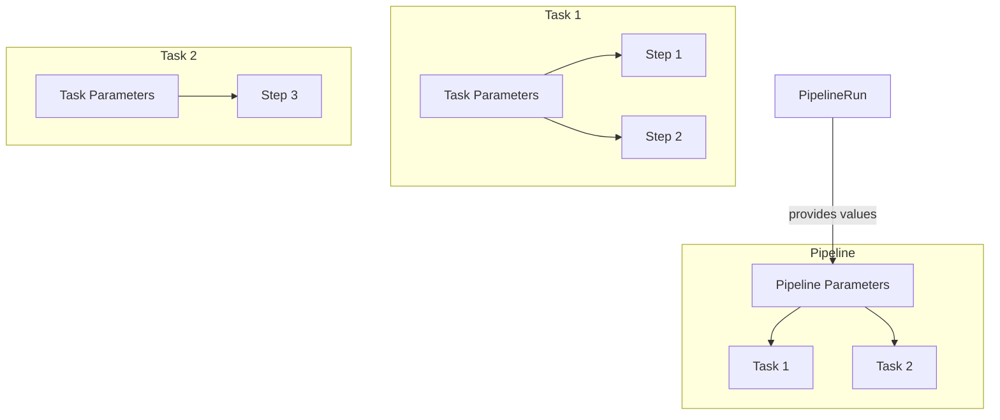
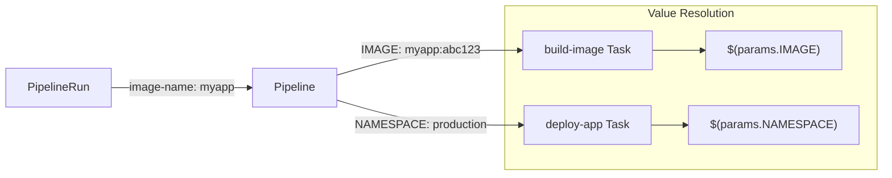
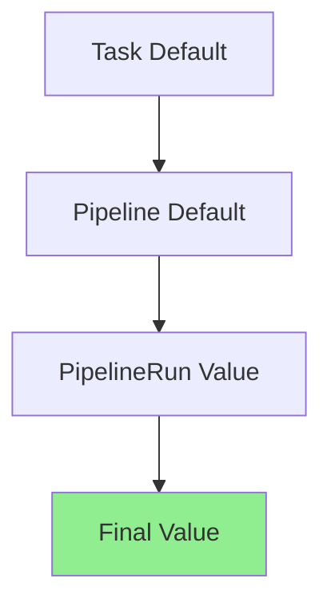

# How to Handle Tekton Parameters

Author: [nawazdhandala](https://www.github.com/nawazdhandala)

Tags: Tekton, Kubernetes, CI/CD, DevOps, Parameters, Pipelines

Description: A practical guide to working with Tekton parameters in Tasks and Pipelines. Learn how to define, pass, and validate parameters for flexible and reusable CI/CD workflows.

---

Tekton parameters let you create reusable Tasks and Pipelines. Instead of hardcoding values, you pass them at runtime. Your CI/CD components become templates that work across different projects, environments, and use cases.

## Understanding Tekton Parameters



Parameters flow from PipelineRuns to Pipelines to Tasks to Steps. Each level can define its own parameters and pass values down the chain.

## Task Parameters

### Basic Parameter Definition

Parameters are declared in the Task spec. Each parameter has a name, type, and optional default value.

```yaml
apiVersion: tekton.dev/v1
kind: Task
metadata:
  name: build-image
spec:
  params:
    # Required string parameter with no default
    - name: IMAGE
      type: string
      description: The fully qualified image name to build

    # Optional string parameter with a default value
    - name: DOCKERFILE
      type: string
      description: Path to the Dockerfile
      default: "./Dockerfile"

    # Array parameter for build arguments
    - name: BUILD_ARGS
      type: array
      description: Additional build arguments
      default: []

  steps:
    - name: build
      image: gcr.io/kaniko-project/executor:latest
      args:
        - --dockerfile=$(params.DOCKERFILE)
        - --destination=$(params.IMAGE)
        - --context=/workspace/source
        # Array parameters expand as multiple arguments
        - $(params.BUILD_ARGS[*])
```

### Parameter Types

Tekton supports three parameter types:

```yaml
apiVersion: tekton.dev/v1
kind: Task
metadata:
  name: param-types-example
spec:
  params:
    # String type - single text value
    - name: version
      type: string
      default: "1.0.0"

    # Array type - list of strings
    - name: targets
      type: array
      default:
        - "linux/amd64"
        - "linux/arm64"

    # Object type - key-value pairs (Tekton v0.40+)
    - name: config
      type: object
      properties:
        host:
          type: string
        port:
          type: string
        secure:
          type: string
      default:
        host: "localhost"
        port: "8080"
        secure: "false"

  steps:
    - name: show-params
      image: alpine
      script: |
        echo "Version: $(params.version)"
        echo "Host: $(params.config.host)"
        echo "Port: $(params.config.port)"
      args:
        # Array expansion in args
        - $(params.targets[*])
```

### Using Parameters in Steps

Parameters can be referenced in multiple places within a step definition.

```yaml
apiVersion: tekton.dev/v1
kind: Task
metadata:
  name: deploy-app
spec:
  params:
    - name: APP_NAME
      type: string
    - name: NAMESPACE
      type: string
      default: "default"
    - name: REPLICAS
      type: string
      default: "2"

  steps:
    # Parameters in the image field - useful for version pinning
    - name: deploy
      image: bitnami/kubectl:$(params.KUBECTL_VERSION)
      script: |
        # Parameters in inline scripts
        kubectl -n $(params.NAMESPACE) set image \
          deployment/$(params.APP_NAME) \
          $(params.APP_NAME)=$(params.IMAGE)

        kubectl -n $(params.NAMESPACE) scale \
          deployment/$(params.APP_NAME) \
          --replicas=$(params.REPLICAS)

    # Parameters in environment variables
    - name: verify
      image: curlimages/curl
      env:
        - name: APP_ENDPOINT
          value: "http://$(params.APP_NAME).$(params.NAMESPACE).svc.cluster.local"
      script: |
        curl -f $APP_ENDPOINT/health || exit 1
```

## Pipeline Parameters

### Passing Parameters to Tasks

Pipelines define their own parameters and pass them to Tasks.

```yaml
apiVersion: tekton.dev/v1
kind: Pipeline
metadata:
  name: build-and-deploy
spec:
  params:
    # Pipeline-level parameters
    - name: repo-url
      type: string
      description: Git repository URL
    - name: image-name
      type: string
      description: Target image name
    - name: deploy-namespace
      type: string
      default: "production"

  tasks:
    - name: clone
      taskRef:
        name: git-clone
      params:
        # Pass pipeline param to task param
        - name: url
          value: $(params.repo-url)

    - name: build
      taskRef:
        name: build-image
      params:
        # Combine static and dynamic values
        - name: IMAGE
          value: "$(params.image-name):$(tasks.clone.results.commit)"

    - name: deploy
      taskRef:
        name: deploy-app
      params:
        - name: NAMESPACE
          value: $(params.deploy-namespace)
```

### Parameter Propagation Flow



## Running with Parameters

### TaskRun with Parameters

Directly run a Task with specific parameter values.

```yaml
apiVersion: tekton.dev/v1
kind: TaskRun
metadata:
  name: build-myapp-v1
spec:
  taskRef:
    name: build-image
  params:
    # Required parameter - must be provided
    - name: IMAGE
      value: "registry.example.com/myapp:v1.0.0"

    # Override the default Dockerfile path
    - name: DOCKERFILE
      value: "./docker/Dockerfile.prod"

    # Array parameter values
    - name: BUILD_ARGS
      value:
        - "--build-arg=ENV=production"
        - "--build-arg=VERSION=1.0.0"
```

### PipelineRun with Parameters

Execute a Pipeline with parameters that flow to all Tasks.

```yaml
apiVersion: tekton.dev/v1
kind: PipelineRun
metadata:
  generateName: build-and-deploy-
spec:
  pipelineRef:
    name: build-and-deploy
  params:
    - name: repo-url
      value: "https://github.com/myorg/myapp.git"
    - name: image-name
      value: "registry.example.com/myapp"
    - name: deploy-namespace
      value: "staging"
```

### Using tkn CLI

The Tekton CLI provides convenient parameter passing.

```bash
# Run a task with parameters
tkn task start build-image \
  --param IMAGE=registry.example.com/myapp:latest \
  --param DOCKERFILE=./Dockerfile.prod \
  --param BUILD_ARGS="--build-arg=ENV=prod","--build-arg=DEBUG=false"

# Run a pipeline with parameters
tkn pipeline start build-and-deploy \
  --param repo-url=https://github.com/myorg/myapp.git \
  --param image-name=registry.example.com/myapp \
  --param deploy-namespace=production \
  --showlog
```

## Advanced Parameter Patterns

### Conditional Logic with Parameters

Use parameters to control task execution.

```yaml
apiVersion: tekton.dev/v1
kind: Pipeline
metadata:
  name: conditional-deploy
spec:
  params:
    - name: environment
      type: string
    - name: run-tests
      type: string
      default: "true"

  tasks:
    - name: unit-tests
      when:
        # Only run tests if parameter is "true"
        - input: $(params.run-tests)
          operator: in
          values: ["true", "yes", "1"]
      taskRef:
        name: run-tests

    - name: deploy-staging
      when:
        # Environment-based branching
        - input: $(params.environment)
          operator: in
          values: ["staging", "dev"]
      taskRef:
        name: deploy
      params:
        - name: NAMESPACE
          value: "staging"

    - name: deploy-production
      when:
        - input: $(params.environment)
          operator: in
          values: ["production", "prod"]
      taskRef:
        name: deploy
      params:
        - name: NAMESPACE
          value: "production"
```

### Object Parameters for Complex Configuration

Object parameters group related values together.

```yaml
apiVersion: tekton.dev/v1
kind: Task
metadata:
  name: database-migration
spec:
  params:
    - name: database
      type: object
      properties:
        host:
          type: string
        port:
          type: string
        name:
          type: string
        user:
          type: string

  steps:
    - name: migrate
      image: migrate/migrate
      env:
        - name: DB_HOST
          value: $(params.database.host)
        - name: DB_PORT
          value: $(params.database.port)
        - name: DB_NAME
          value: $(params.database.name)
        - name: DB_USER
          value: $(params.database.user)
      script: |
        migrate -database "postgres://$DB_USER@$DB_HOST:$DB_PORT/$DB_NAME" up
```

Provide object values in PipelineRun or TaskRun.

```yaml
apiVersion: tekton.dev/v1
kind: TaskRun
metadata:
  name: migrate-prod-db
spec:
  taskRef:
    name: database-migration
  params:
    - name: database
      value:
        host: "db.example.com"
        port: "5432"
        name: "myapp_production"
        user: "admin"
```

### Parameter Validation with CEL

Custom validation ensures parameters meet requirements.

```yaml
apiVersion: tekton.dev/v1
kind: Task
metadata:
  name: validated-build
spec:
  params:
    - name: IMAGE
      type: string
      description: Image must include registry and tag
    - name: REPLICAS
      type: string
      description: Number of replicas (1-10)

  # Validation using CEL expressions
  steps:
    - name: validate
      image: alpine
      script: |
        #!/bin/sh
        set -e

        # Validate image format
        IMAGE="$(params.IMAGE)"
        if ! echo "$IMAGE" | grep -E '^[a-z0-9.-]+/[a-z0-9/.-]+:[a-z0-9.-]+$'; then
          echo "ERROR: IMAGE must be in format registry/name:tag"
          exit 1
        fi

        # Validate replicas range
        REPLICAS="$(params.REPLICAS)"
        if [ "$REPLICAS" -lt 1 ] || [ "$REPLICAS" -gt 10 ]; then
          echo "ERROR: REPLICAS must be between 1 and 10"
          exit 1
        fi

        echo "Validation passed"

    - name: build
      image: gcr.io/kaniko-project/executor:latest
      args:
        - --destination=$(params.IMAGE)
```

### Matrix Parameters for Parallel Execution

Run the same task with different parameter combinations.

```yaml
apiVersion: tekton.dev/v1
kind: Pipeline
metadata:
  name: multi-platform-build
spec:
  params:
    - name: image-base
      type: string

  tasks:
    - name: build
      matrix:
        params:
          # Each combination runs as a separate TaskRun
          - name: platform
            value:
              - "linux/amd64"
              - "linux/arm64"
              - "linux/arm/v7"
          - name: variant
            value:
              - "alpine"
              - "debian"
      taskRef:
        name: build-image
      params:
        - name: IMAGE
          value: "$(params.image-base):$(matrix.platform)-$(matrix.variant)"
        - name: PLATFORM
          value: $(matrix.platform)
        - name: BASE_IMAGE
          value: $(matrix.variant)
```

## Parameter Defaults and Overrides

### Default Value Strategies

Set sensible defaults at multiple levels.

```yaml
apiVersion: tekton.dev/v1
kind: Task
metadata:
  name: flexible-build
spec:
  params:
    # No default - always required
    - name: IMAGE
      type: string

    # Sensible default for most cases
    - name: CONTEXT
      type: string
      default: "."

    # Default to empty for optional flags
    - name: EXTRA_ARGS
      type: array
      default: []

    # Default with placeholder for validation
    - name: REGISTRY_SECRET
      type: string
      default: ""

  steps:
    - name: build
      image: gcr.io/kaniko-project/executor:latest
      script: |
        #!/bin/sh
        ARGS="--context=$(params.CONTEXT)"
        ARGS="$ARGS --destination=$(params.IMAGE)"

        # Conditionally add registry secret
        if [ -n "$(params.REGISTRY_SECRET)" ]; then
          ARGS="$ARGS --registry-secret=$(params.REGISTRY_SECRET)"
        fi

        /kaniko/executor $ARGS $(params.EXTRA_ARGS[*])
```

### Override Hierarchy



The final parameter value follows a clear precedence: PipelineRun values override Pipeline defaults, which override Task defaults.

## Practical Examples

### Multi-Environment Deployment Pipeline

A complete pipeline that deploys to different environments using parameters.

```yaml
apiVersion: tekton.dev/v1
kind: Pipeline
metadata:
  name: deploy-application
spec:
  params:
    - name: git-url
      type: string
    - name: git-revision
      type: string
      default: "main"
    - name: image-registry
      type: string
      default: "registry.example.com"
    - name: app-name
      type: string
    - name: environment
      type: string
      description: "Target environment: dev, staging, or production"
    - name: replicas
      type: string
      default: "2"

  tasks:
    - name: fetch-source
      taskRef:
        name: git-clone
      params:
        - name: url
          value: $(params.git-url)
        - name: revision
          value: $(params.git-revision)

    - name: run-tests
      runAfter: [fetch-source]
      taskRef:
        name: run-tests
      params:
        - name: test-type
          value: "unit"

    - name: build-push
      runAfter: [run-tests]
      taskRef:
        name: build-image
      params:
        - name: IMAGE
          value: "$(params.image-registry)/$(params.app-name):$(params.git-revision)"

    - name: deploy
      runAfter: [build-push]
      taskRef:
        name: kubectl-deploy
      params:
        - name: image
          value: "$(params.image-registry)/$(params.app-name):$(params.git-revision)"
        - name: namespace
          value: "$(params.app-name)-$(params.environment)"
        - name: replicas
          value: $(params.replicas)
```

Run for different environments.

```yaml
# Development deployment
apiVersion: tekton.dev/v1
kind: PipelineRun
metadata:
  generateName: deploy-myapp-dev-
spec:
  pipelineRef:
    name: deploy-application
  params:
    - name: git-url
      value: "https://github.com/myorg/myapp.git"
    - name: git-revision
      value: "feature-branch"
    - name: app-name
      value: "myapp"
    - name: environment
      value: "dev"
    - name: replicas
      value: "1"
---
# Production deployment
apiVersion: tekton.dev/v1
kind: PipelineRun
metadata:
  generateName: deploy-myapp-prod-
spec:
  pipelineRef:
    name: deploy-application
  params:
    - name: git-url
      value: "https://github.com/myorg/myapp.git"
    - name: git-revision
      value: "v1.2.3"
    - name: app-name
      value: "myapp"
    - name: environment
      value: "production"
    - name: replicas
      value: "5"
```

### Reusable Build Task with Complete Options

A production-ready build task with comprehensive parameter handling.

```yaml
apiVersion: tekton.dev/v1
kind: Task
metadata:
  name: kaniko-build
  labels:
    app.kubernetes.io/version: "1.0"
spec:
  description: >
    Build and push a container image using Kaniko.
    Supports multi-platform builds, caching, and custom build arguments.

  params:
    - name: IMAGE
      type: string
      description: Fully qualified image name including tag

    - name: DOCKERFILE
      type: string
      description: Path to the Dockerfile relative to context
      default: "Dockerfile"

    - name: CONTEXT
      type: string
      description: Build context path
      default: "."

    - name: BUILD_ARGS
      type: array
      description: Build arguments in KEY=VALUE format
      default: []

    - name: CACHE
      type: string
      description: Enable layer caching (true/false)
      default: "true"

    - name: CACHE_REPO
      type: string
      description: Repository for cache layers
      default: ""

    - name: PLATFORMS
      type: array
      description: Target platforms for multi-arch build
      default:
        - "linux/amd64"

    - name: LABELS
      type: array
      description: Image labels in KEY=VALUE format
      default: []

    - name: PUSH
      type: string
      description: Push image to registry (true/false)
      default: "true"

    - name: INSECURE_REGISTRY
      type: string
      description: Allow insecure registry connections
      default: "false"

  workspaces:
    - name: source
      description: Source code workspace

  results:
    - name: IMAGE_DIGEST
      description: Digest of the built image
    - name: IMAGE_URL
      description: URL of the built image

  steps:
    - name: build-and-push
      image: gcr.io/kaniko-project/executor:v1.19.0
      workingDir: $(workspaces.source.path)
      env:
        - name: DOCKER_CONFIG
          value: /kaniko/.docker
      script: |
        #!/busybox/sh
        set -e

        # Build base command
        CMD="/kaniko/executor"
        CMD="$CMD --dockerfile=$(params.DOCKERFILE)"
        CMD="$CMD --context=$(workspaces.source.path)/$(params.CONTEXT)"
        CMD="$CMD --destination=$(params.IMAGE)"

        # Handle caching
        if [ "$(params.CACHE)" = "true" ]; then
          CMD="$CMD --cache=true"
          if [ -n "$(params.CACHE_REPO)" ]; then
            CMD="$CMD --cache-repo=$(params.CACHE_REPO)"
          fi
        fi

        # Handle push setting
        if [ "$(params.PUSH)" = "false" ]; then
          CMD="$CMD --no-push"
        fi

        # Handle insecure registry
        if [ "$(params.INSECURE_REGISTRY)" = "true" ]; then
          CMD="$CMD --insecure"
        fi

        # Add digest file for results
        CMD="$CMD --digest-file=/tekton/results/IMAGE_DIGEST"

        echo "Executing: $CMD"
        eval $CMD

        # Write image URL to results
        echo -n "$(params.IMAGE)" > /tekton/results/IMAGE_URL
      args:
        # Build arguments passed as array
        - $(params.BUILD_ARGS[*])
        # Labels passed as array
        - $(params.LABELS[*])
```

## Troubleshooting Parameters

### Common Issues and Solutions

**Parameter not found errors** occur when referencing undefined parameters.

```bash
# Check task parameters
tkn task describe build-image

# View pipeline parameters
tkn pipeline describe my-pipeline

# Inspect a failed run
tkn pipelinerun describe my-run-xyz --output yaml | grep -A 50 params
```

**Type mismatch errors** happen when providing wrong types.

```yaml
# Wrong: providing string for array parameter
params:
  - name: BUILD_ARGS
    value: "--build-arg=FOO=bar"  # Error!

# Correct: provide as array
params:
  - name: BUILD_ARGS
    value:
      - "--build-arg=FOO=bar"
```

**Missing required parameters** cause immediate failures.

```bash
# List required parameters before running
tkn task start build-image --dry-run

# See which parameters have defaults
kubectl get task build-image -o jsonpath='{.spec.params[*].default}'
```

### Debugging Parameter Values

Add a debug step to verify parameter resolution.

```yaml
steps:
  - name: debug-params
    image: alpine
    script: |
      echo "=== Parameter Values ==="
      echo "IMAGE: $(params.IMAGE)"
      echo "DOCKERFILE: $(params.DOCKERFILE)"
      echo "BUILD_ARGS: $(params.BUILD_ARGS[*])"
      echo "========================"
```

---

Tekton parameters transform static CI/CD definitions into flexible, reusable components. Start with simple string parameters, then graduate to arrays for multi-value inputs and objects for structured configuration. Combined with default values and validation, parameters let you build a library of Tasks and Pipelines that serve your entire organization.
