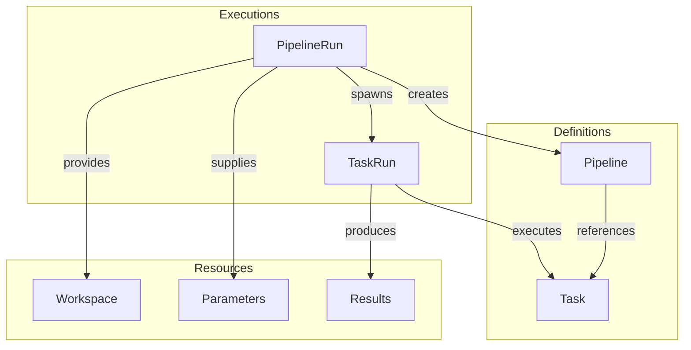
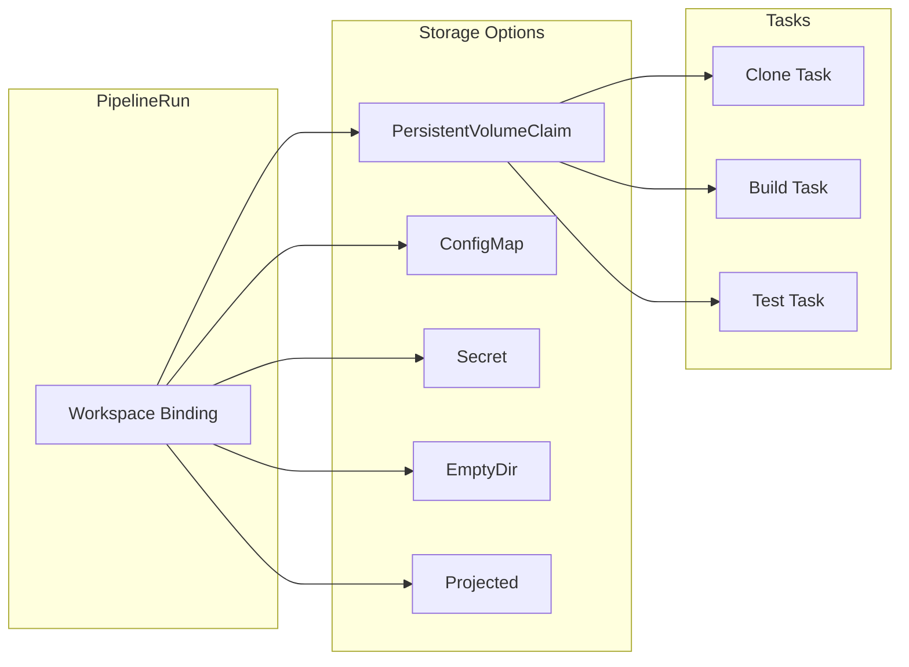
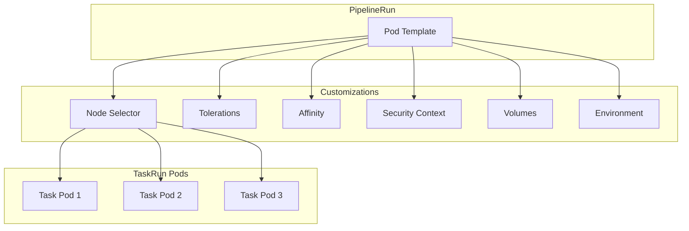

# How to Configure Tekton PipelineRuns

Author: [nawazdhandala](https://www.github.com/nawazdhandala)

Tags: Tekton, Kubernetes, CI/CD, PipelineRuns, DevOps, Cloud Native, Automation

Description: A hands-on guide to configuring Tekton PipelineRuns for orchestrating CI/CD workflows in Kubernetes, covering parameters, workspaces, timeouts, retry policies, and production best practices.

---

Tekton brings cloud-native CI/CD pipelines directly into Kubernetes. PipelineRuns are the execution instances that trigger your pipelines with specific parameters, workspaces, and configurations. Mastering PipelineRun configuration unlocks powerful automation workflows.

## Understanding Tekton Architecture

Before diving into PipelineRuns, understanding how Tekton components fit together helps clarify the configuration options.



Key concepts:
- **Task** - A reusable unit of work with steps
- **Pipeline** - A collection of Tasks arranged in a DAG
- **PipelineRun** - An execution of a Pipeline with specific inputs
- **TaskRun** - An execution of a single Task

## Installing Tekton

The following commands install Tekton Pipelines and the CLI tool for interacting with your pipelines from the command line.

```bash
# Install Tekton Pipelines
kubectl apply --filename https://storage.googleapis.com/tekton-releases/pipeline/latest/release.yaml

# Wait for Tekton to be ready
kubectl wait --for=condition=Ready pods --all -n tekton-pipelines --timeout=300s

# Install Tekton CLI (tkn)
# macOS
brew install tektoncd-cli

# Linux
curl -LO https://github.com/tektoncd/cli/releases/download/v0.35.0/tkn_0.35.0_Linux_x86_64.tar.gz
tar xvzf tkn_0.35.0_Linux_x86_64.tar.gz
sudo mv tkn /usr/local/bin/
```

## Basic PipelineRun Configuration

A minimal PipelineRun needs to reference a Pipeline and can optionally provide parameters and workspaces.

The following PipelineRun triggers a simple build pipeline with two parameters - the Git repository URL and the target branch name.

```yaml
apiVersion: tekton.dev/v1
kind: PipelineRun
metadata:
  # generateName creates unique run names with a timestamp suffix
  generateName: build-app-run-
  namespace: tekton-pipelines
spec:
  # Reference to the Pipeline definition
  pipelineRef:
    name: build-and-deploy
  # Parameters passed to the pipeline
  params:
    - name: repo-url
      value: "https://github.com/myorg/myapp.git"
    - name: branch
      value: "main"
```

### Running an Embedded Pipeline

For one-off executions or testing, you can embed the Pipeline definition directly in the PipelineRun.

The embedded approach bundles the pipeline definition with its execution, making it self-contained and portable for ad-hoc runs.

```yaml
apiVersion: tekton.dev/v1
kind: PipelineRun
metadata:
  generateName: quick-test-
spec:
  pipelineSpec:
    params:
      - name: message
        type: string
        default: "Hello from Tekton!"
    tasks:
      - name: echo-message
        params:
          - name: msg
            value: $(params.message)
        taskSpec:
          params:
            - name: msg
          steps:
            - name: echo
              image: alpine:3.19
              script: |
                #!/bin/sh
                echo "$(params.msg)"
  params:
    - name: message
      value: "Running embedded pipeline!"
```

## Working with Parameters

Parameters make pipelines reusable. Tekton supports string, array, and object parameter types.

### String Parameters

String parameters are the most common type and work well for simple values like URLs, branch names, and configuration options.

```yaml
apiVersion: tekton.dev/v1
kind: PipelineRun
metadata:
  generateName: deploy-run-
spec:
  pipelineRef:
    name: deploy-pipeline
  params:
    # Simple string parameter
    - name: environment
      value: "production"
    # String with special characters needs quoting
    - name: commit-sha
      value: "abc123def456"
    # Empty string is valid
    - name: optional-flag
      value: ""
```

### Array Parameters

Array parameters pass multiple values to a single parameter, useful for build arguments, test targets, or file lists.

```yaml
apiVersion: tekton.dev/v1
kind: PipelineRun
metadata:
  generateName: multi-target-build-
spec:
  pipelineRef:
    name: multi-build
  params:
    # Array of build targets
    - name: targets
      value:
        - "linux/amd64"
        - "linux/arm64"
        - "darwin/amd64"
    # Array of test packages
    - name: test-packages
      value:
        - "./pkg/..."
        - "./cmd/..."
        - "./internal/..."
```

### Object Parameters

Object parameters group related values together, keeping configurations organized and type-safe.

```yaml
apiVersion: tekton.dev/v1
kind: PipelineRun
metadata:
  generateName: deploy-with-config-
spec:
  pipelineRef:
    name: kubernetes-deploy
  params:
    # Object parameter with multiple properties
    - name: deployment-config
      value:
        replicas: "3"
        cpu-limit: "500m"
        memory-limit: "512Mi"
        image-tag: "v1.2.3"
```

## Configuring Workspaces

Workspaces provide persistent storage for pipeline data. Common use cases include source code checkouts, build caches, and artifact storage.



### PersistentVolumeClaim Workspace

PersistentVolumeClaims provide durable storage that survives pod restarts and can be shared between tasks.

```yaml
apiVersion: tekton.dev/v1
kind: PipelineRun
metadata:
  generateName: build-with-cache-
spec:
  pipelineRef:
    name: build-pipeline
  workspaces:
    # Existing PVC for source code
    - name: source
      persistentVolumeClaim:
        claimName: source-pvc
    # Dynamically provisioned PVC using volumeClaimTemplate
    - name: build-cache
      volumeClaimTemplate:
        spec:
          accessModes:
            - ReadWriteOnce
          resources:
            requests:
              storage: 5Gi
          storageClassName: fast-ssd
```

### ConfigMap and Secret Workspaces

ConfigMaps and Secrets work well for configuration files that tasks need to read.

```yaml
apiVersion: tekton.dev/v1
kind: PipelineRun
metadata:
  generateName: deploy-with-creds-
spec:
  pipelineRef:
    name: deploy-pipeline
  workspaces:
    # ConfigMap for non-sensitive configuration
    - name: config
      configMap:
        name: app-config
        items:
          - key: settings.yaml
            path: settings.yaml
    # Secret for credentials
    - name: credentials
      secret:
        secretName: deploy-credentials
```

### EmptyDir Workspace

EmptyDir provides ephemeral storage useful for temporary files that do not need persistence between runs.

```yaml
apiVersion: tekton.dev/v1
kind: PipelineRun
metadata:
  generateName: quick-build-
spec:
  pipelineRef:
    name: build-pipeline
  workspaces:
    # Fast ephemeral storage
    - name: temp
      emptyDir: {}
    # Memory-backed for speed (limited by node memory)
    - name: fast-temp
      emptyDir:
        medium: Memory
        sizeLimit: 256Mi
```

## Timeout Configuration

Proper timeout configuration prevents runaway pipelines and ensures resources are freed promptly.

The following configuration sets both pipeline-level and task-level timeouts to handle slow builds gracefully.

```yaml
apiVersion: tekton.dev/v1
kind: PipelineRun
metadata:
  generateName: build-with-timeouts-
spec:
  pipelineRef:
    name: long-running-build
  # Overall pipeline timeout (includes all tasks)
  timeouts:
    # Total time for the entire pipeline
    pipeline: "2h"
    # Maximum time for all tasks combined
    tasks: "1h45m"
    # Time for finally tasks
    finally: "15m"
  params:
    - name: repo-url
      value: "https://github.com/myorg/large-monorepo.git"
```

### Task-Level Timeout Override

Individual tasks can have their own timeout settings when certain steps need more time.

```yaml
apiVersion: tekton.dev/v1
kind: PipelineRun
metadata:
  generateName: mixed-timeouts-
spec:
  pipelineRef:
    name: integration-tests
  timeouts:
    pipeline: "3h"
  # Override timeout for specific tasks
  taskRunSpecs:
    - pipelineTaskName: run-e2e-tests
      # Extended timeout for E2E tests
      computeResources:
        requests:
          cpu: "2"
          memory: "4Gi"
```

## Retry Policies

Retry policies handle transient failures like network issues or flaky tests.

```yaml
apiVersion: tekton.dev/v1
kind: Pipeline
metadata:
  name: resilient-pipeline
spec:
  tasks:
    - name: fetch-dependencies
      taskRef:
        name: npm-install
      # Retry up to 3 times on failure
      retries: 3
    - name: run-tests
      taskRef:
        name: test-runner
      # Flaky tests might need retries
      retries: 2
      runAfter:
        - fetch-dependencies
```

When triggering the pipeline, you can see retry status in the PipelineRun output.

```yaml
apiVersion: tekton.dev/v1
kind: PipelineRun
metadata:
  generateName: test-with-retries-
spec:
  pipelineRef:
    name: resilient-pipeline
  params:
    - name: test-suite
      value: "integration"
```

## Service Account Configuration

Service accounts control what Kubernetes resources the pipeline can access.

The following configuration runs the pipeline with a dedicated service account that has permissions to push images and deploy to the cluster.

```yaml
apiVersion: tekton.dev/v1
kind: PipelineRun
metadata:
  generateName: secure-deploy-
spec:
  pipelineRef:
    name: build-and-deploy
  # Service account with necessary permissions
  taskRunTemplate:
    serviceAccountName: tekton-deployer
  params:
    - name: image-name
      value: "registry.example.com/myapp"
```

### Creating a Service Account with Registry Credentials

A service account needs proper credentials to pull base images and push built images.

```yaml
# First, create the secret with registry credentials
apiVersion: v1
kind: Secret
metadata:
  name: registry-creds
  namespace: tekton-pipelines
  annotations:
    tekton.dev/docker-0: https://registry.example.com
type: kubernetes.io/dockerconfigjson
data:
  .dockerconfigjson: <base64-encoded-docker-config>
---
# Service account referencing the secret
apiVersion: v1
kind: ServiceAccount
metadata:
  name: tekton-deployer
  namespace: tekton-pipelines
secrets:
  - name: registry-creds
imagePullSecrets:
  - name: registry-creds
```

## Pod Template Customization

Pod templates customize the execution environment for pipeline tasks.



The pod template below configures node selection, security settings, and custom environment variables for all tasks.

```yaml
apiVersion: tekton.dev/v1
kind: PipelineRun
metadata:
  generateName: customized-build-
spec:
  pipelineRef:
    name: build-pipeline
  taskRunTemplate:
    podTemplate:
      # Schedule on specific nodes
      nodeSelector:
        workload: ci-builds
      # Tolerate CI node taints
      tolerations:
        - key: "ci-workload"
          operator: "Equal"
          value: "true"
          effect: "NoSchedule"
      # Security settings
      securityContext:
        runAsNonRoot: true
        runAsUser: 1000
        fsGroup: 1000
      # Environment variables for all containers
      env:
        - name: GOPROXY
          value: "https://proxy.golang.org,direct"
        - name: DOCKER_HOST
          value: "tcp://dind-service:2375"
```

### Task-Specific Pod Templates

Different tasks might need different resource configurations or node placement.

```yaml
apiVersion: tekton.dev/v1
kind: PipelineRun
metadata:
  generateName: heterogeneous-build-
spec:
  pipelineRef:
    name: ml-pipeline
  taskRunSpecs:
    # GPU task needs special nodes
    - pipelineTaskName: train-model
      podTemplate:
        nodeSelector:
          accelerator: nvidia-tesla-v100
        tolerations:
          - key: "nvidia.com/gpu"
            operator: "Exists"
            effect: "NoSchedule"
    # Build task needs fast storage
    - pipelineTaskName: build-container
      podTemplate:
        nodeSelector:
          storage: nvme
```

## Controlling Pipeline Execution Flow

PipelineRuns can specify which tasks to run or skip using when expressions evaluated at runtime.

### Conditional Execution

The following Pipeline uses when expressions to run tasks based on parameter values.

```yaml
apiVersion: tekton.dev/v1
kind: Pipeline
metadata:
  name: conditional-deploy
spec:
  params:
    - name: deploy-environment
      type: string
    - name: run-integration-tests
      type: string
      default: "true"
  tasks:
    - name: build
      taskRef:
        name: kaniko-build
    - name: integration-tests
      taskRef:
        name: test-runner
      runAfter:
        - build
      # Only run if parameter is "true"
      when:
        - input: $(params.run-integration-tests)
          operator: in
          values: ["true"]
    - name: deploy-staging
      taskRef:
        name: kubectl-deploy
      runAfter:
        - integration-tests
      when:
        - input: $(params.deploy-environment)
          operator: in
          values: ["staging", "production"]
    - name: deploy-production
      taskRef:
        name: kubectl-deploy
      runAfter:
        - deploy-staging
      when:
        - input: $(params.deploy-environment)
          operator: in
          values: ["production"]
```

Triggering the pipeline with specific conditions.

```yaml
apiVersion: tekton.dev/v1
kind: PipelineRun
metadata:
  generateName: conditional-deploy-run-
spec:
  pipelineRef:
    name: conditional-deploy
  params:
    - name: deploy-environment
      value: "staging"
    - name: run-integration-tests
      value: "true"
```

## Finally Tasks

Finally tasks run after all other tasks complete, regardless of success or failure. Common uses include cleanup, notifications, and reporting.

```yaml
apiVersion: tekton.dev/v1
kind: Pipeline
metadata:
  name: build-with-cleanup
spec:
  params:
    - name: repo-url
      type: string
  workspaces:
    - name: source
  tasks:
    - name: clone
      taskRef:
        name: git-clone
      workspaces:
        - name: output
          workspace: source
      params:
        - name: url
          value: $(params.repo-url)
    - name: build
      taskRef:
        name: golang-build
      runAfter:
        - clone
      workspaces:
        - name: source
          workspace: source
  # Finally block runs regardless of task outcomes
  finally:
    - name: cleanup
      taskRef:
        name: cleanup-workspace
      workspaces:
        - name: source
          workspace: source
    - name: notify
      taskRef:
        name: slack-notify
      params:
        - name: status
          # Access aggregated status of all tasks
          value: $(tasks.status)
```

## Matrix Builds

Matrix parameters run a task multiple times with different parameter combinations.

```yaml
apiVersion: tekton.dev/v1
kind: Pipeline
metadata:
  name: matrix-build
spec:
  params:
    - name: platforms
      type: array
    - name: go-versions
      type: array
  tasks:
    - name: build
      taskRef:
        name: go-build
      matrix:
        params:
          - name: PLATFORM
            value: $(params.platforms)
          - name: GO_VERSION
            value: $(params.go-versions)
```

Running the matrix pipeline creates multiple TaskRuns covering all combinations.

```yaml
apiVersion: tekton.dev/v1
kind: PipelineRun
metadata:
  generateName: matrix-build-run-
spec:
  pipelineRef:
    name: matrix-build
  params:
    - name: platforms
      value:
        - "linux/amd64"
        - "linux/arm64"
        - "darwin/amd64"
    - name: go-versions
      value:
        - "1.21"
        - "1.22"
```

## Monitoring PipelineRuns

Use the Tekton CLI to monitor and debug PipelineRuns effectively.

```bash
# List recent PipelineRuns
tkn pipelinerun list -n tekton-pipelines

# Watch a running PipelineRun
tkn pipelinerun logs build-app-run-abc123 -f -n tekton-pipelines

# Describe a PipelineRun for detailed status
tkn pipelinerun describe build-app-run-abc123 -n tekton-pipelines

# Get all TaskRuns for a PipelineRun
kubectl get taskruns -l tekton.dev/pipelineRun=build-app-run-abc123

# Debug a failed task
tkn taskrun logs build-app-run-abc123-build-task -n tekton-pipelines
```

### Programmatic Status Checking

Kubernetes status conditions provide machine-readable pipeline status.

```bash
# Get PipelineRun status as JSON
kubectl get pipelinerun build-app-run-abc123 -o jsonpath='{.status.conditions[0].reason}'

# Possible values: Succeeded, Failed, Running, Cancelled, PipelineRunPending
```

## Production Best Practices

### 1. Resource Limits

Always set resource requests and limits to prevent resource starvation.

```yaml
apiVersion: tekton.dev/v1
kind: PipelineRun
metadata:
  generateName: production-build-
spec:
  pipelineRef:
    name: build-pipeline
  taskRunSpecs:
    - pipelineTaskName: build
      computeResources:
        requests:
          cpu: "1"
          memory: "2Gi"
        limits:
          cpu: "2"
          memory: "4Gi"
```

### 2. Affinity and Anti-Affinity

Spread build pods across nodes for resilience.

```yaml
apiVersion: tekton.dev/v1
kind: PipelineRun
metadata:
  generateName: resilient-build-
spec:
  pipelineRef:
    name: critical-pipeline
  taskRunTemplate:
    podTemplate:
      affinity:
        podAntiAffinity:
          preferredDuringSchedulingIgnoredDuringExecution:
            - weight: 100
              podAffinityTerm:
                labelSelector:
                  matchLabels:
                    tekton.dev/pipeline: critical-pipeline
                topologyKey: kubernetes.io/hostname
```

### 3. Cleanup Policies

Configure automatic cleanup of completed PipelineRuns.

```yaml
# In Tekton config
apiVersion: v1
kind: ConfigMap
metadata:
  name: feature-flags
  namespace: tekton-pipelines
data:
  # Keep last 5 successful and 3 failed runs
  keep-pod-on-cancel: "false"
---
# Or use labels for cleanup scripts
apiVersion: tekton.dev/v1
kind: PipelineRun
metadata:
  generateName: build-
  labels:
    cleanup-policy: "7d"
    team: "backend"
spec:
  pipelineRef:
    name: build-pipeline
```

### 4. Results and Artifacts

Capture build outputs for downstream use.

```yaml
apiVersion: tekton.dev/v1
kind: Pipeline
metadata:
  name: build-with-results
spec:
  results:
    - name: image-digest
      description: Built image digest
      value: $(tasks.build.results.IMAGE_DIGEST)
    - name: image-url
      description: Built image URL
      value: $(tasks.build.results.IMAGE_URL)
  tasks:
    - name: build
      taskRef:
        name: kaniko-build
```

## Troubleshooting Common Issues

### PipelineRun Stuck in Pending

```bash
# Check for resource issues
kubectl describe pipelinerun <name> | grep -A 10 "Conditions"

# Common causes:
# - Missing workspace PVCs
# - Service account not found
# - Insufficient cluster resources

# Check events for details
kubectl get events --field-selector involvedObject.name=<pipelinerun-name>
```

### Task Failures

```bash
# Get detailed task logs
tkn taskrun logs <taskrun-name> --all

# Check step statuses
kubectl get taskrun <name> -o jsonpath='{.status.steps[*].terminated.reason}'

# Inspect pod for debugging
kubectl describe pod <taskrun-pod-name>
```

### Workspace Permission Issues

```bash
# Verify PVC exists and is bound
kubectl get pvc <workspace-pvc>

# Check security context matches PVC permissions
# Common fix: set fsGroup in pod template
```

---

Tekton PipelineRuns provide the execution layer for cloud-native CI/CD. Starting with simple configurations and progressively adding workspaces, parameters, and advanced features like matrix builds creates flexible, maintainable pipelines. The Kubernetes-native approach means your CI/CD infrastructure scales with your cluster and benefits from the same observability and management tools as your applications.
