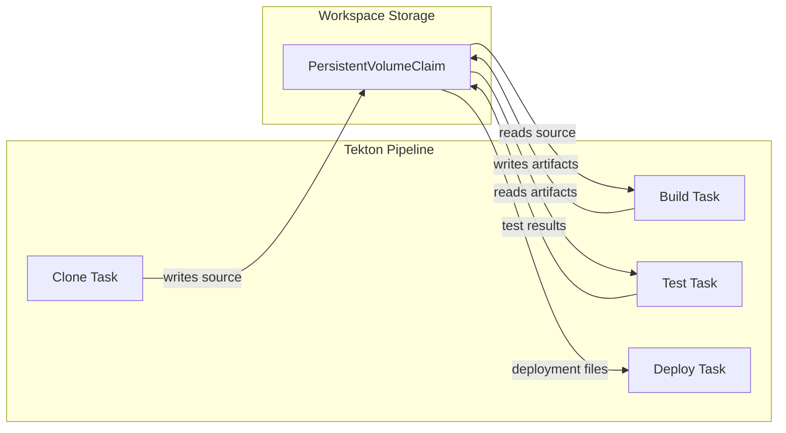
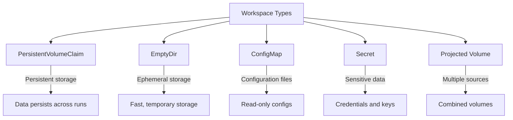
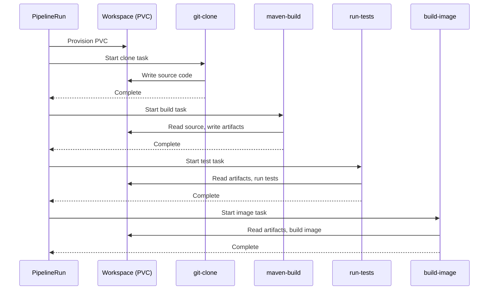
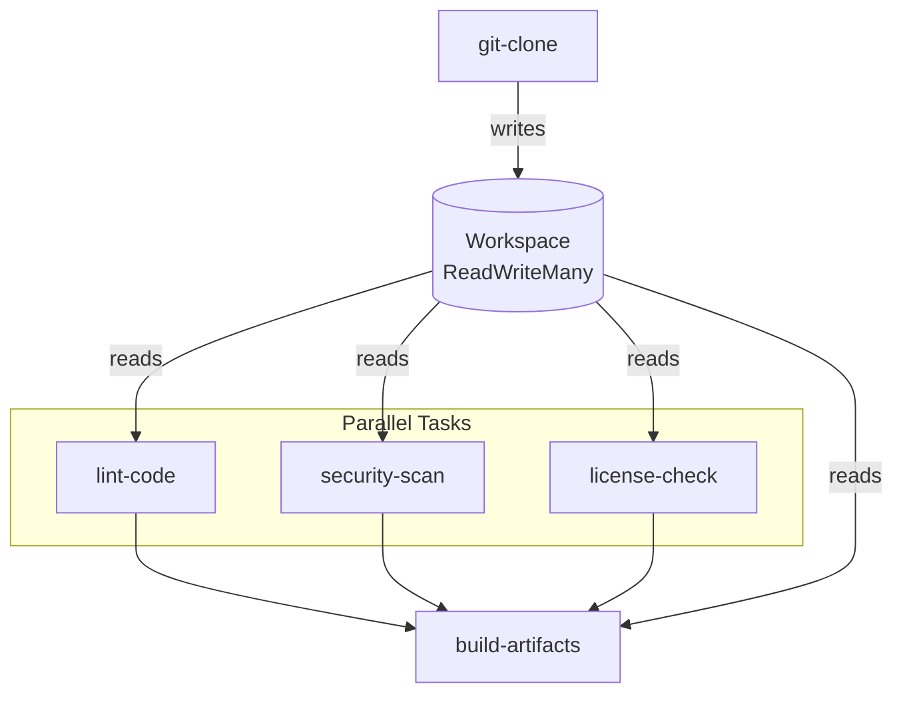

# How to Use Tekton Workspaces

Author: [nawazdhandala](https://www.github.com/nawazdhandala)

Tags: Tekton, Kubernetes, CI/CD, Pipelines, Workspaces, Cloud Native, DevOps

Description: A practical guide to using Tekton workspaces for sharing data between pipeline tasks, including PersistentVolumeClaims, ConfigMaps, Secrets, and EmptyDir volumes with real-world examples.

---

Tekton pipelines often require sharing files and data between tasks. Whether you need to pass build artifacts, share source code, or provide configuration files, workspaces provide a clean abstraction for mounting storage into your pipeline runs. Without workspaces, each task runs in isolation with no way to access outputs from previous steps.

## Understanding Tekton Workspaces

Workspaces in Tekton serve as the bridge between tasks, enabling data flow throughout your pipeline. A workspace declaration defines what storage a task needs, while the pipeline run determines how that storage is provided.



## Workspace Types

Tekton supports several workspace binding types, each suited for different use cases.



## Creating Your First Workspace

Let me walk you through creating a simple task that uses a workspace to store and retrieve files.

The following task definition declares a workspace named "source" where files can be read and written.

```yaml
# task-with-workspace.yaml
# A basic task demonstrating workspace usage for file operations
apiVersion: tekton.dev/v1
kind: Task
metadata:
  name: write-message
  namespace: tekton-pipelines
spec:
  # Declare the workspace this task requires
  workspaces:
    - name: source
      description: Storage for source files and build outputs
      # Optional: mark as read-only if task only reads from it
      readOnly: false

  params:
    - name: message
      type: string
      description: Message to write to the workspace
      default: "Hello from Tekton!"

  steps:
    # First step writes a message to a file in the workspace
    - name: write-file
      image: alpine:3.19
      script: |
        #!/bin/sh
        set -ex

        # The workspace is mounted at /workspace/<workspace-name>
        echo "Writing message to workspace..."
        echo "$(params.message)" > $(workspaces.source.path)/message.txt

        # Verify the file was created
        cat $(workspaces.source.path)/message.txt
        echo "File written successfully!"
```

Now create a task that reads from the same workspace to verify data sharing works correctly.

```yaml
# task-read-workspace.yaml
# Task that reads files from a workspace created by another task
apiVersion: tekton.dev/v1
kind: Task
metadata:
  name: read-message
  namespace: tekton-pipelines
spec:
  workspaces:
    - name: source
      description: Storage containing files to read
      readOnly: true

  results:
    - name: content
      description: Content read from the workspace file

  steps:
    - name: read-file
      image: alpine:3.19
      script: |
        #!/bin/sh
        set -ex

        # Read the message from the file written by the previous task
        if [ -f "$(workspaces.source.path)/message.txt" ]; then
          MESSAGE=$(cat $(workspaces.source.path)/message.txt)
          echo "Read message: ${MESSAGE}"

          # Store in task result for downstream consumption
          echo -n "${MESSAGE}" > $(results.content.path)
        else
          echo "Error: message.txt not found!"
          exit 1
        fi
```

## Building a Complete Pipeline with Workspaces

Real-world pipelines chain multiple tasks together, passing data through shared workspaces. Here is a pipeline that clones a repository, builds the application, runs tests, and creates a container image.



The pipeline definition below declares workspaces at the pipeline level and maps them to each task.

```yaml
# pipeline-full-build.yaml
# Complete CI pipeline demonstrating workspace usage across multiple tasks
apiVersion: tekton.dev/v1
kind: Pipeline
metadata:
  name: build-and-test
  namespace: tekton-pipelines
spec:
  description: |
    Clones source code, builds with Maven, runs tests,
    and creates a container image using shared workspaces.

  # Pipeline-level workspace declarations
  workspaces:
    - name: shared-workspace
      description: Workspace for source code and build artifacts
    - name: maven-settings
      description: Maven settings.xml for custom repositories
    - name: docker-credentials
      description: Docker registry credentials for pushing images

  params:
    - name: repo-url
      type: string
      description: Git repository URL to clone
    - name: revision
      type: string
      description: Git revision (branch, tag, or commit SHA)
      default: main
    - name: image-name
      type: string
      description: Name of the container image to build

  tasks:
    # Task 1: Clone the Git repository into the shared workspace
    - name: clone
      taskRef:
        name: git-clone
        kind: ClusterTask
      workspaces:
        # Map pipeline workspace to task workspace
        - name: output
          workspace: shared-workspace
      params:
        - name: url
          value: $(params.repo-url)
        - name: revision
          value: $(params.revision)

    # Task 2: Build with Maven using source from workspace
    - name: build
      taskRef:
        name: maven
        kind: ClusterTask
      runAfter:
        - clone
      workspaces:
        - name: source
          workspace: shared-workspace
        - name: maven-settings
          workspace: maven-settings
      params:
        - name: GOALS
          value:
            - clean
            - package
            - -DskipTests

    # Task 3: Run unit tests on the built code
    - name: test
      taskRef:
        name: maven
        kind: ClusterTask
      runAfter:
        - build
      workspaces:
        - name: source
          workspace: shared-workspace
        - name: maven-settings
          workspace: maven-settings
      params:
        - name: GOALS
          value:
            - test

    # Task 4: Build and push container image
    - name: build-image
      taskRef:
        name: kaniko
        kind: ClusterTask
      runAfter:
        - test
      workspaces:
        - name: source
          workspace: shared-workspace
        - name: dockerconfig
          workspace: docker-credentials
      params:
        - name: IMAGE
          value: $(params.image-name)
```

## Using PersistentVolumeClaims

PersistentVolumeClaims provide durable storage that persists across task runs. For most CI/CD workloads, PVCs offer the best balance of reliability and performance.

Create a PVC that will be used by the pipeline for storing build artifacts.

```yaml
# workspace-pvc.yaml
# PersistentVolumeClaim for pipeline workspace storage
apiVersion: v1
kind: PersistentVolumeClaim
metadata:
  name: pipeline-workspace-pvc
  namespace: tekton-pipelines
spec:
  accessModes:
    # ReadWriteOnce limits to single node but offers best performance
    - ReadWriteOnce
  resources:
    requests:
      storage: 5Gi
  # Use your cluster's storage class
  storageClassName: standard
```

Reference the PVC in your PipelineRun to bind it to the workspace.

```yaml
# pipelinerun-with-pvc.yaml
# PipelineRun demonstrating PVC workspace binding
apiVersion: tekton.dev/v1
kind: PipelineRun
metadata:
  generateName: build-and-test-run-
  namespace: tekton-pipelines
spec:
  pipelineRef:
    name: build-and-test

  params:
    - name: repo-url
      value: https://github.com/myorg/myapp.git
    - name: revision
      value: main
    - name: image-name
      value: registry.example.com/myapp:latest

  workspaces:
    # Bind PVC to the shared workspace
    - name: shared-workspace
      persistentVolumeClaim:
        claimName: pipeline-workspace-pvc
      # Optional: use a subdirectory within the PVC
      subPath: build-$(context.pipelineRun.uid)

    # Maven settings from ConfigMap
    - name: maven-settings
      configMap:
        name: maven-settings-cm

    # Docker credentials from Secret
    - name: docker-credentials
      secret:
        secretName: docker-registry-secret
```

## Dynamic PVC Provisioning with VolumeClaimTemplates

For ephemeral workloads, VolumeClaimTemplates create a fresh PVC for each pipeline run. The PVC is automatically deleted when the pipeline run completes.

```yaml
# pipelinerun-volumeclaimtemplate.yaml
# PipelineRun with dynamic PVC provisioning
apiVersion: tekton.dev/v1
kind: PipelineRun
metadata:
  generateName: build-with-dynamic-pvc-
  namespace: tekton-pipelines
spec:
  pipelineRef:
    name: build-and-test

  params:
    - name: repo-url
      value: https://github.com/myorg/myapp.git
    - name: image-name
      value: registry.example.com/myapp:$(context.pipelineRun.uid)

  workspaces:
    # VolumeClaimTemplate creates a unique PVC per run
    - name: shared-workspace
      volumeClaimTemplate:
        spec:
          accessModes:
            - ReadWriteOnce
          resources:
            requests:
              storage: 10Gi
          storageClassName: fast-ssd

    - name: maven-settings
      configMap:
        name: maven-settings-cm

    - name: docker-credentials
      secret:
        secretName: docker-registry-secret
```

## Using EmptyDir for Temporary Storage

EmptyDir volumes provide fast, ephemeral storage that exists only for the duration of the task run. Use EmptyDir when you need temporary scratch space that does not need to persist.

```yaml
# pipelinerun-emptydir.yaml
# PipelineRun using EmptyDir for temporary workspace
apiVersion: tekton.dev/v1
kind: PipelineRun
metadata:
  generateName: quick-build-
  namespace: tekton-pipelines
spec:
  pipelineRef:
    name: lint-only

  workspaces:
    # EmptyDir for temporary files during linting
    - name: temp-workspace
      emptyDir: {}

    # EmptyDir backed by memory for fastest access
    - name: cache
      emptyDir:
        medium: Memory
        sizeLimit: 512Mi
```

## Sharing Workspaces Between Parallel Tasks

Tekton allows multiple tasks to run in parallel while sharing a workspace. Use ReadWriteMany access mode when tasks on different nodes need simultaneous access.



Configure a PVC with ReadWriteMany access for parallel task execution.

```yaml
# pvc-readwritemany.yaml
# PVC configured for parallel task access
apiVersion: v1
kind: PersistentVolumeClaim
metadata:
  name: shared-parallel-pvc
  namespace: tekton-pipelines
spec:
  accessModes:
    # ReadWriteMany allows concurrent access from multiple pods/nodes
    - ReadWriteMany
  resources:
    requests:
      storage: 20Gi
  # NFS or cloud file storage classes typically support RWX
  storageClassName: nfs-storage
```

Define a pipeline where multiple tasks read from the same workspace concurrently.

```yaml
# pipeline-parallel.yaml
# Pipeline with parallel tasks sharing a workspace
apiVersion: tekton.dev/v1
kind: Pipeline
metadata:
  name: parallel-analysis
  namespace: tekton-pipelines
spec:
  workspaces:
    - name: source
      description: Source code workspace accessed by parallel tasks

  params:
    - name: repo-url
      type: string

  tasks:
    - name: clone
      taskRef:
        name: git-clone
        kind: ClusterTask
      workspaces:
        - name: output
          workspace: source
      params:
        - name: url
          value: $(params.repo-url)

    # All three tasks run in parallel after clone completes
    - name: lint
      taskRef:
        name: golangci-lint
      runAfter:
        - clone
      workspaces:
        - name: source
          workspace: source
          # Mark as read-only since this task only reads
          readOnly: true

    - name: security-scan
      taskRef:
        name: trivy-scan
      runAfter:
        - clone
      workspaces:
        - name: source
          workspace: source
          readOnly: true

    - name: license-check
      taskRef:
        name: license-finder
      runAfter:
        - clone
      workspaces:
        - name: source
          workspace: source
          readOnly: true

    # Build runs after all parallel tasks complete
    - name: build
      taskRef:
        name: go-build
      runAfter:
        - lint
        - security-scan
        - license-check
      workspaces:
        - name: source
          workspace: source
```

## Using ConfigMaps as Workspaces

ConfigMaps work well for providing configuration files to pipeline tasks. Mount them as read-only workspaces to supply settings, scripts, or templates.

Create a ConfigMap containing Maven settings for custom repository configuration.

```yaml
# configmap-maven-settings.yaml
# ConfigMap with Maven settings for workspace mounting
apiVersion: v1
kind: ConfigMap
metadata:
  name: maven-settings-cm
  namespace: tekton-pipelines
data:
  settings.xml: |
    <?xml version="1.0" encoding="UTF-8"?>
    <settings xmlns="http://maven.apache.org/SETTINGS/1.0.0"
              xmlns:xsi="http://www.w3.org/2001/XMLSchema-instance"
              xsi:schemaLocation="http://maven.apache.org/SETTINGS/1.0.0
                                  https://maven.apache.org/xsd/settings-1.0.0.xsd">
      <mirrors>
        <mirror>
          <id>nexus</id>
          <mirrorOf>*</mirrorOf>
          <url>https://nexus.company.com/repository/maven-public/</url>
        </mirror>
      </mirrors>

      <servers>
        <server>
          <id>nexus</id>
          <username>${env.NEXUS_USERNAME}</username>
          <password>${env.NEXUS_PASSWORD}</password>
        </server>
      </servers>

      <profiles>
        <profile>
          <id>company</id>
          <repositories>
            <repository>
              <id>central</id>
              <url>https://nexus.company.com/repository/maven-central/</url>
            </repository>
          </repositories>
        </profile>
      </profiles>

      <activeProfiles>
        <activeProfile>company</activeProfile>
      </activeProfiles>
    </settings>
```

Reference the ConfigMap as a workspace in the PipelineRun.

```yaml
# pipelinerun-with-configmap.yaml
# PipelineRun using ConfigMap workspace for Maven settings
apiVersion: tekton.dev/v1
kind: PipelineRun
metadata:
  generateName: maven-build-
  namespace: tekton-pipelines
spec:
  pipelineRef:
    name: maven-pipeline

  workspaces:
    - name: source
      volumeClaimTemplate:
        spec:
          accessModes:
            - ReadWriteOnce
          resources:
            requests:
              storage: 5Gi

    # ConfigMap mounted as workspace
    - name: maven-settings
      configMap:
        name: maven-settings-cm
        # Optional: specify which keys to mount
        items:
          - key: settings.xml
            path: settings.xml
```

## Using Secrets as Workspaces

Secrets provide a secure way to pass sensitive data like credentials, API keys, and certificates to pipeline tasks.

Create a Secret containing Docker registry credentials for image pushing.

```yaml
# secret-docker-config.yaml
# Secret with Docker registry credentials
apiVersion: v1
kind: Secret
metadata:
  name: docker-registry-secret
  namespace: tekton-pipelines
type: kubernetes.io/dockerconfigjson
data:
  # Base64 encoded Docker config.json
  .dockerconfigjson: ewogICJhdXRocyI6IHsKICAgICJyZWdpc3RyeS5leGFtcGxlLmNvbSI6IHsKICAgICAgInVzZXJuYW1lIjogImJ1aWxkLXVzZXIiLAogICAgICAicGFzc3dvcmQiOiAic2VjcmV0LXBhc3N3b3JkIiwKICAgICAgImF1dGgiOiAiWW5WcGJHUXRkWE5sY2pwelpXTnlaWFF0Y0dGemMzZHZjbVE9IgogICAgfQogIH0KfQ==
```

For SSH keys used in Git operations, create a dedicated Secret.

```yaml
# secret-git-ssh.yaml
# Secret containing SSH key for Git authentication
apiVersion: v1
kind: Secret
metadata:
  name: git-ssh-credentials
  namespace: tekton-pipelines
type: kubernetes.io/ssh-auth
data:
  # Base64 encoded private key
  ssh-privatekey: LS0tLS1CRUdJTiBPUEVOU1...
  # Base64 encoded known_hosts file
  known_hosts: Z2l0aHViLmNvbSBzc2gtcnNhIEFBQUFCM056YUN...
```

Use the Secret as a workspace in tasks that need Git access.

```yaml
# task-git-clone-ssh.yaml
# Task using SSH credentials from Secret workspace
apiVersion: tekton.dev/v1
kind: Task
metadata:
  name: git-clone-ssh
  namespace: tekton-pipelines
spec:
  workspaces:
    - name: output
      description: Cloned repository destination
    - name: ssh-credentials
      description: SSH credentials for Git authentication
      readOnly: true

  params:
    - name: repo-url
      type: string
    - name: revision
      type: string
      default: main

  steps:
    - name: clone
      image: alpine/git:2.43.0
      env:
        - name: GIT_SSH_COMMAND
          value: "ssh -i $(workspaces.ssh-credentials.path)/ssh-privatekey -o UserKnownHostsFile=$(workspaces.ssh-credentials.path)/known_hosts -o StrictHostKeyChecking=yes"
      script: |
        #!/bin/sh
        set -ex

        # Configure SSH key permissions
        chmod 600 $(workspaces.ssh-credentials.path)/ssh-privatekey

        # Clone the repository
        git clone $(params.repo-url) $(workspaces.output.path)
        cd $(workspaces.output.path)
        git checkout $(params.revision)

        echo "Repository cloned successfully"
        ls -la
```

## Projected Volumes for Combined Workspaces

Projected volumes combine multiple sources into a single workspace mount point, useful when tasks need data from various ConfigMaps and Secrets.

```yaml
# pipelinerun-projected.yaml
# PipelineRun with projected volume workspace
apiVersion: tekton.dev/v1
kind: PipelineRun
metadata:
  generateName: build-with-projected-
  namespace: tekton-pipelines
spec:
  pipelineRef:
    name: deployment-pipeline

  workspaces:
    - name: source
      volumeClaimTemplate:
        spec:
          accessModes:
            - ReadWriteOnce
          resources:
            requests:
              storage: 5Gi

    # Projected volume combining multiple sources
    - name: credentials
      projected:
        sources:
          # Docker credentials
          - secret:
              name: docker-registry-secret
              items:
                - key: .dockerconfigjson
                  path: config.json
          # Cloud provider credentials
          - secret:
              name: aws-credentials
              items:
                - key: credentials
                  path: aws/credentials
                - key: config
                  path: aws/config
          # SSH keys for Git
          - secret:
              name: git-ssh-credentials
              items:
                - key: ssh-privatekey
                  path: ssh/id_rsa
                  mode: 0600
          # Additional configuration
          - configMap:
              name: deployment-config
              items:
                - key: environments.yaml
                  path: config/environments.yaml
```

## Optional Workspaces

Some tasks may support optional workspaces that change behavior when provided. Declare optional workspaces in tasks using the optional field.

```yaml
# task-with-optional-workspace.yaml
# Task demonstrating optional workspace usage
apiVersion: tekton.dev/v1
kind: Task
metadata:
  name: build-with-cache
  namespace: tekton-pipelines
spec:
  workspaces:
    - name: source
      description: Source code to build
    - name: cache
      description: Optional build cache for faster builds
      optional: true

  steps:
    - name: build
      image: golang:1.22
      script: |
        #!/bin/bash
        set -ex

        cd $(workspaces.source.path)

        # Check if cache workspace was provided
        if [ "$(workspaces.cache.bound)" = "true" ]; then
          echo "Cache workspace available, using cached dependencies"
          export GOCACHE=$(workspaces.cache.path)/go-build
          export GOMODCACHE=$(workspaces.cache.path)/go-mod
          mkdir -p $GOCACHE $GOMODCACHE
        else
          echo "No cache workspace provided, building without cache"
        fi

        # Build the application
        go build -o app ./cmd/server

        # Copy artifacts
        cp app $(workspaces.source.path)/
```

Run the pipeline without the optional workspace when caching is not needed.

```yaml
# pipelinerun-without-cache.yaml
# PipelineRun omitting the optional cache workspace
apiVersion: tekton.dev/v1
kind: PipelineRun
metadata:
  generateName: quick-build-no-cache-
  namespace: tekton-pipelines
spec:
  pipelineRef:
    name: go-build-pipeline

  workspaces:
    - name: source
      volumeClaimTemplate:
        spec:
          accessModes:
            - ReadWriteOnce
          resources:
            requests:
              storage: 2Gi
    # cache workspace intentionally omitted
```

## Workspace Isolation with SubPaths

SubPaths allow multiple workspaces to share the same PVC while maintaining isolation. Each workspace gets its own directory within the volume.

```yaml
# pipelinerun-subpaths.yaml
# PipelineRun using subPaths for workspace isolation
apiVersion: tekton.dev/v1
kind: PipelineRun
metadata:
  generateName: multi-project-build-
  namespace: tekton-pipelines
spec:
  pipelineRef:
    name: monorepo-build

  workspaces:
    # All workspaces use the same PVC with different subPaths
    - name: frontend-source
      persistentVolumeClaim:
        claimName: monorepo-pvc
      subPath: frontend

    - name: backend-source
      persistentVolumeClaim:
        claimName: monorepo-pvc
      subPath: backend

    - name: shared-libs
      persistentVolumeClaim:
        claimName: monorepo-pvc
      subPath: libs

    - name: artifacts
      persistentVolumeClaim:
        claimName: monorepo-pvc
      subPath: artifacts/$(context.pipelineRun.name)
```

## Best Practices for Workspace Management

### Size Your PVCs Appropriately

Estimate storage needs based on repository size, build artifacts, and dependencies.

```yaml
# Example: Sizing for a Java project
# Source code: ~500MB
# Maven dependencies: ~2GB
# Build artifacts: ~500MB
# Safety margin: 2x
# Total: 6GB recommended

apiVersion: v1
kind: PersistentVolumeClaim
metadata:
  name: java-build-pvc
spec:
  accessModes:
    - ReadWriteOnce
  resources:
    requests:
      storage: 6Gi
  storageClassName: fast-ssd
```

### Clean Up Workspace Data

Implement cleanup steps to prevent storage from filling up over time.

```yaml
# task-cleanup.yaml
# Task to clean up workspace after pipeline completion
apiVersion: tekton.dev/v1
kind: Task
metadata:
  name: workspace-cleanup
  namespace: tekton-pipelines
spec:
  workspaces:
    - name: workspace
      description: Workspace to clean up

  params:
    - name: preserve-patterns
      type: array
      default:
        - "*.log"
        - "reports/"

  steps:
    - name: cleanup
      image: alpine:3.19
      script: |
        #!/bin/sh
        set -ex

        cd $(workspaces.workspace.path)

        # Create temp directory for files to preserve
        mkdir -p /tmp/preserve

        # Preserve specified patterns
        for pattern in $(params.preserve-patterns); do
          if ls $pattern 1> /dev/null 2>&1; then
            cp -r $pattern /tmp/preserve/ || true
          fi
        done

        # Remove everything
        rm -rf ./*
        rm -rf ./.[!.]*

        # Restore preserved files
        cp -r /tmp/preserve/* ./ 2>/dev/null || true

        echo "Workspace cleaned up"
        du -sh .
```

### Use Affinity Rules for Performance

When using ReadWriteOnce PVCs, ensure all tasks run on the same node to avoid mount conflicts.

```yaml
# pipelinerun-affinity.yaml
# PipelineRun with pod affinity for workspace access
apiVersion: tekton.dev/v1
kind: PipelineRun
metadata:
  generateName: affinity-build-
  namespace: tekton-pipelines
spec:
  pipelineRef:
    name: build-and-test

  workspaces:
    - name: source
      persistentVolumeClaim:
        claimName: build-pvc

  # Ensure all TaskRuns schedule on the same node
  podTemplate:
    affinity:
      podAffinity:
        requiredDuringSchedulingIgnoredDuringExecution:
          - labelSelector:
              matchLabels:
                tekton.dev/pipelineRun: $(context.pipelineRun.name)
            topologyKey: kubernetes.io/hostname
```

## Troubleshooting Workspace Issues

### PVC Mount Failures

When pods fail to mount a PVC, check for access mode conflicts and node affinity issues.

```bash
# Check PVC status and bound state
kubectl get pvc -n tekton-pipelines

# Describe PVC for events and errors
kubectl describe pvc pipeline-workspace-pvc -n tekton-pipelines

# Check if PVC is stuck in Pending state
kubectl get pvc pipeline-workspace-pvc -n tekton-pipelines -o yaml | grep -A 10 status

# View events for mount failures
kubectl get events -n tekton-pipelines --sort-by='.lastTimestamp' | grep -i mount
```

### Permission Denied Errors

File permission issues often occur when different container images use different user IDs.

```yaml
# task-fix-permissions.yaml
# Task with security context to handle permission issues
apiVersion: tekton.dev/v1
kind: Task
metadata:
  name: build-with-permissions
spec:
  workspaces:
    - name: source

  stepTemplate:
    # Run as root to avoid permission issues
    securityContext:
      runAsUser: 0
      runAsGroup: 0

  steps:
    - name: fix-permissions
      image: alpine:3.19
      script: |
        #!/bin/sh
        # Ensure workspace is writable by all users
        chmod -R 777 $(workspaces.source.path)

    - name: build
      image: node:20
      # Node image runs as non-root user 1000
      securityContext:
        runAsUser: 1000
      script: |
        cd $(workspaces.source.path)
        npm install
        npm run build
```

### Workspace Not Found Errors

Verify workspace bindings match between Pipeline and PipelineRun definitions.

```bash
# List workspace declarations in the pipeline
kubectl get pipeline build-and-test -n tekton-pipelines -o jsonpath='{.spec.workspaces[*].name}'

# Compare with workspace bindings in the PipelineRun
kubectl get pipelinerun -n tekton-pipelines -o jsonpath='{.items[0].spec.workspaces[*].name}'

# Check TaskRun for workspace binding errors
kubectl describe taskrun -n tekton-pipelines | grep -A 5 "workspace"
```

---

Tekton workspaces provide flexible mechanisms for sharing data between pipeline tasks. By choosing the right workspace type for each use case, you can build efficient CI/CD pipelines that scale with your team's needs. Start with PersistentVolumeClaims for most workloads, use ConfigMaps and Secrets for configuration data, and consider VolumeClaimTemplates when you need ephemeral storage per pipeline run.
