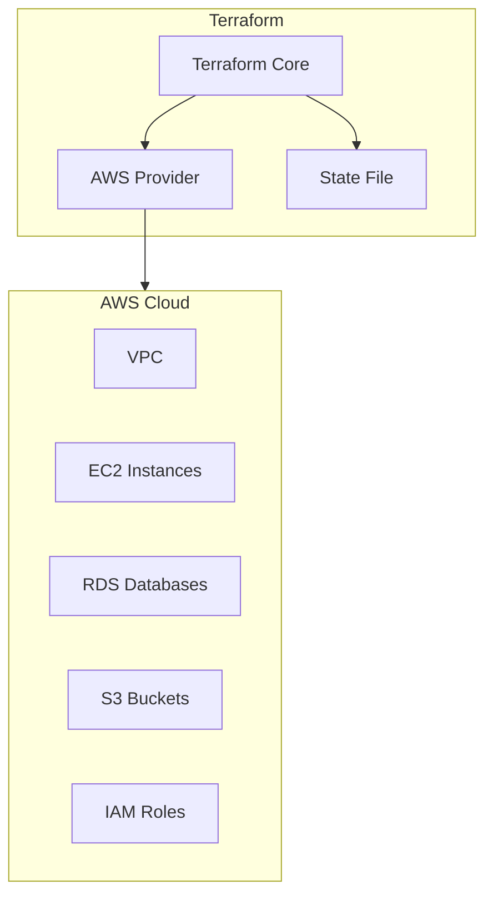
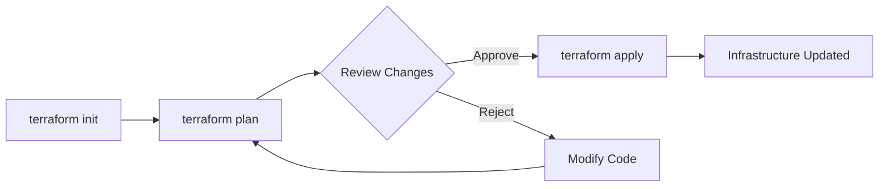

# How to Use Terraform with AWS

Author: [nawazdhandala](https://www.github.com/nawazdhandala)

Tags: Terraform, AWS, Infrastructure as Code, DevOps, Cloud, Automation

Description: A comprehensive guide to using Terraform for AWS infrastructure management. Learn how to provision EC2 instances, VPCs, RDS databases, and implement best practices for production environments.

---

> Infrastructure as Code transforms cloud management from clicking through consoles to writing reviewable, versioned, and repeatable configurations. Terraform with AWS is the industry standard for this approach.

Managing AWS infrastructure manually is error-prone and difficult to scale. Terraform enables you to define your entire AWS infrastructure in code, version control it, and deploy consistently across environments.

---

## Understanding Terraform and AWS

Terraform uses the AWS provider to interact with AWS services. Here's how the pieces fit together:



---

## Setting Up the AWS Provider

### Basic Provider Configuration

```hcl
# providers.tf
terraform {
  required_version = ">= 1.0.0"
  
  required_providers {
    aws = {
      source  = "hashicorp/aws"
      version = "~> 5.0"
    }
  }
}

# Configure the AWS Provider
provider "aws" {
  region = var.aws_region
  
  default_tags {
    tags = {
      Environment = var.environment
      ManagedBy   = "terraform"
      Project     = var.project_name
    }
  }
}

# Variables
variable "aws_region" {
  description = "AWS region for resources"
  type        = string
  default     = "us-east-1"
}

variable "environment" {
  description = "Environment name (dev, staging, prod)"
  type        = string
}

variable "project_name" {
  description = "Project name for tagging"
  type        = string
}
```

---

## Creating a VPC with Subnets

### Complete VPC Module

```hcl
# vpc.tf
# Create a VPC with public and private subnets

resource "aws_vpc" "main" {
  cidr_block           = var.vpc_cidr
  enable_dns_hostnames = true
  enable_dns_support   = true
  
  tags = {
    Name = "${var.project_name}-vpc"
  }
}

# Internet Gateway for public subnets
resource "aws_internet_gateway" "main" {
  vpc_id = aws_vpc.main.id
  
  tags = {
    Name = "${var.project_name}-igw"
  }
}

# Public Subnets
resource "aws_subnet" "public" {
  count             = length(var.availability_zones)
  vpc_id            = aws_vpc.main.id
  cidr_block        = cidrsubnet(var.vpc_cidr, 8, count.index)
  availability_zone = var.availability_zones[count.index]
  
  map_public_ip_on_launch = true
  
  tags = {
    Name = "${var.project_name}-public-${count.index + 1}"
    Type = "public"
  }
}

# Private Subnets
resource "aws_subnet" "private" {
  count             = length(var.availability_zones)
  vpc_id            = aws_vpc.main.id
  cidr_block        = cidrsubnet(var.vpc_cidr, 8, count.index + 10)
  availability_zone = var.availability_zones[count.index]
  
  tags = {
    Name = "${var.project_name}-private-${count.index + 1}"
    Type = "private"
  }
}

# NAT Gateway for private subnets
resource "aws_eip" "nat" {
  count  = length(var.availability_zones)
  domain = "vpc"
  
  tags = {
    Name = "${var.project_name}-nat-eip-${count.index + 1}"
  }
}

resource "aws_nat_gateway" "main" {
  count         = length(var.availability_zones)
  allocation_id = aws_eip.nat[count.index].id
  subnet_id     = aws_subnet.public[count.index].id
  
  tags = {
    Name = "${var.project_name}-nat-${count.index + 1}"
  }
}

# Route Tables
resource "aws_route_table" "public" {
  vpc_id = aws_vpc.main.id
  
  route {
    cidr_block = "0.0.0.0/0"
    gateway_id = aws_internet_gateway.main.id
  }
  
  tags = {
    Name = "${var.project_name}-public-rt"
  }
}

resource "aws_route_table" "private" {
  count  = length(var.availability_zones)
  vpc_id = aws_vpc.main.id
  
  route {
    cidr_block     = "0.0.0.0/0"
    nat_gateway_id = aws_nat_gateway.main[count.index].id
  }
  
  tags = {
    Name = "${var.project_name}-private-rt-${count.index + 1}"
  }
}

# Route Table Associations
resource "aws_route_table_association" "public" {
  count          = length(var.availability_zones)
  subnet_id      = aws_subnet.public[count.index].id
  route_table_id = aws_route_table.public.id
}

resource "aws_route_table_association" "private" {
  count          = length(var.availability_zones)
  subnet_id      = aws_subnet.private[count.index].id
  route_table_id = aws_route_table.private[count.index].id
}
```

---

## Provisioning EC2 Instances

### EC2 with Security Groups

```hcl
# ec2.tf
# Security Group for web servers
resource "aws_security_group" "web" {
  name        = "${var.project_name}-web-sg"
  description = "Security group for web servers"
  vpc_id      = aws_vpc.main.id
  
  ingress {
    description = "HTTP"
    from_port   = 80
    to_port     = 80
    protocol    = "tcp"
    cidr_blocks = ["0.0.0.0/0"]
  }
  
  ingress {
    description = "HTTPS"
    from_port   = 443
    to_port     = 443
    protocol    = "tcp"
    cidr_blocks = ["0.0.0.0/0"]
  }
  
  ingress {
    description = "SSH"
    from_port   = 22
    to_port     = 22
    protocol    = "tcp"
    cidr_blocks = [var.admin_cidr]
  }
  
  egress {
    from_port   = 0
    to_port     = 0
    protocol    = "-1"
    cidr_blocks = ["0.0.0.0/0"]
  }
  
  tags = {
    Name = "${var.project_name}-web-sg"
  }
}

# EC2 Instance
resource "aws_instance" "web" {
  count                  = var.instance_count
  ami                    = data.aws_ami.amazon_linux.id
  instance_type          = var.instance_type
  subnet_id              = aws_subnet.public[count.index % length(aws_subnet.public)].id
  vpc_security_group_ids = [aws_security_group.web.id]
  key_name               = var.key_pair_name
  
  root_block_device {
    volume_size = 30
    volume_type = "gp3"
    encrypted   = true
  }
  
  user_data = base64encode(templatefile("${path.module}/scripts/user_data.sh", {
    environment = var.environment
  }))
  
  tags = {
    Name = "${var.project_name}-web-${count.index + 1}"
  }
}

# Get the latest Amazon Linux 2 AMI
data "aws_ami" "amazon_linux" {
  most_recent = true
  owners      = ["amazon"]
  
  filter {
    name   = "name"
    values = ["amzn2-ami-hvm-*-x86_64-gp2"]
  }
  
  filter {
    name   = "virtualization-type"
    values = ["hvm"]
  }
}
```

---

## Creating RDS Databases

### RDS PostgreSQL with Multi-AZ

```hcl
# rds.tf
resource "aws_db_subnet_group" "main" {
  name       = "${var.project_name}-db-subnet"
  subnet_ids = aws_subnet.private[*].id
  
  tags = {
    Name = "${var.project_name}-db-subnet-group"
  }
}

resource "aws_security_group" "rds" {
  name        = "${var.project_name}-rds-sg"
  description = "Security group for RDS"
  vpc_id      = aws_vpc.main.id
  
  ingress {
    description     = "PostgreSQL from web servers"
    from_port       = 5432
    to_port         = 5432
    protocol        = "tcp"
    security_groups = [aws_security_group.web.id]
  }
  
  tags = {
    Name = "${var.project_name}-rds-sg"
  }
}

resource "aws_db_instance" "main" {
  identifier     = "${var.project_name}-db"
  engine         = "postgres"
  engine_version = "15.4"
  instance_class = var.db_instance_class
  
  allocated_storage     = 20
  max_allocated_storage = 100
  storage_type          = "gp3"
  storage_encrypted     = true
  
  db_name  = var.db_name
  username = var.db_username
  password = var.db_password
  
  db_subnet_group_name   = aws_db_subnet_group.main.name
  vpc_security_group_ids = [aws_security_group.rds.id]
  
  multi_az               = var.environment == "prod"
  backup_retention_period = var.environment == "prod" ? 30 : 7
  skip_final_snapshot    = var.environment != "prod"
  
  tags = {
    Name = "${var.project_name}-db"
  }
}
```

---

## S3 Buckets with Versioning

```hcl
# s3.tf
resource "aws_s3_bucket" "main" {
  bucket = "${var.project_name}-${var.environment}-assets"
  
  tags = {
    Name = "${var.project_name}-assets"
  }
}

resource "aws_s3_bucket_versioning" "main" {
  bucket = aws_s3_bucket.main.id
  
  versioning_configuration {
    status = "Enabled"
  }
}

resource "aws_s3_bucket_server_side_encryption_configuration" "main" {
  bucket = aws_s3_bucket.main.id
  
  rule {
    apply_server_side_encryption_by_default {
      sse_algorithm = "AES256"
    }
  }
}

resource "aws_s3_bucket_public_access_block" "main" {
  bucket = aws_s3_bucket.main.id
  
  block_public_acls       = true
  block_public_policy     = true
  ignore_public_acls      = true
  restrict_public_buckets = true
}
```

---

## Remote State Management

### S3 Backend for State

```hcl
# backend.tf
terraform {
  backend "s3" {
    bucket         = "my-terraform-state-bucket"
    key            = "myproject/terraform.tfstate"
    region         = "us-east-1"
    encrypt        = true
    dynamodb_table = "terraform-locks"
  }
}
```

---

## Terraform Workflow



---

## Best Practices

1. **Use Remote State** - Store state in S3 with DynamoDB locking
2. **Enable Encryption** - Encrypt all data at rest
3. **Use Variables** - Parameterize configurations for reusability
4. **Implement Modules** - Create reusable infrastructure modules
5. **Tag Resources** - Apply consistent tags for cost tracking
6. **Use Workspaces** - Separate environments with workspaces
7. **Pin Provider Versions** - Avoid unexpected changes

---

## Summary

| Resource Type | Key Considerations |
|---------------|-------------------|
| VPC | Plan CIDR blocks, enable DNS |
| EC2 | Use launch templates, enable IMDSv2 |
| RDS | Enable Multi-AZ for production |
| S3 | Enable versioning and encryption |
| Security Groups | Follow least privilege principle |

Terraform with AWS provides a powerful foundation for infrastructure management. Start with simple resources and gradually adopt modules and advanced patterns as your infrastructure grows.
