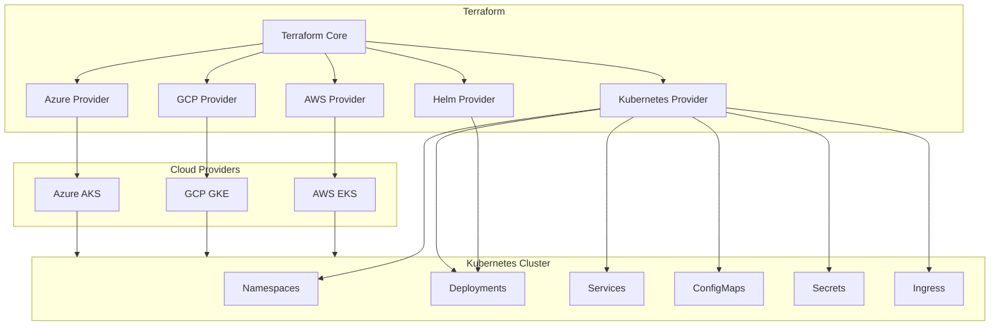
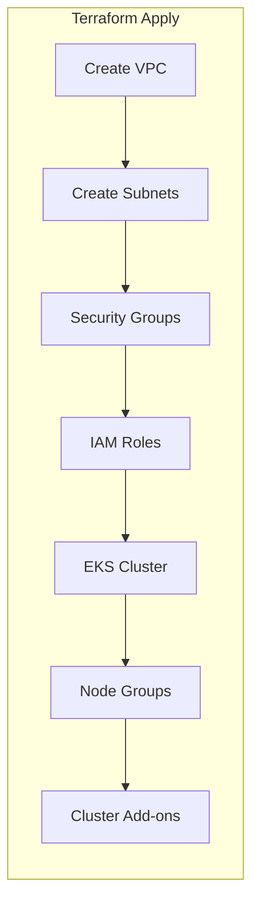
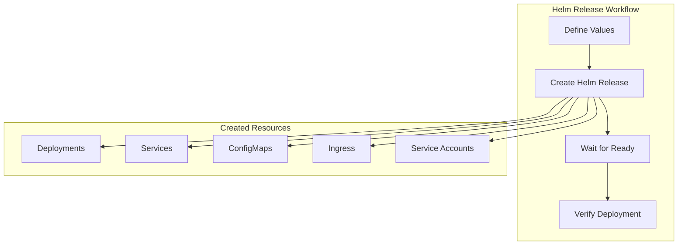

# How to Use Terraform for Kubernetes

Author: [nawazdhandala](https://www.github.com/nawazdhandala)

Tags: Terraform, Kubernetes, IaC, Infrastructure, DevOps, Cloud Native, Automation

Description: A comprehensive guide to using Terraform for Kubernetes infrastructure management. Learn how to provision clusters, deploy workloads, manage resources, and implement best practices for production-ready Kubernetes environments.

---

Managing Kubernetes infrastructure manually is error-prone and difficult to scale. Terraform brings Infrastructure as Code (IaC) principles to Kubernetes, enabling you to version control your infrastructure, automate deployments, and maintain consistency across environments. This guide covers everything from basic concepts to advanced patterns for using Terraform with Kubernetes effectively.

## Why Use Terraform for Kubernetes?

Before diving into implementation, let's understand the key benefits of combining Terraform with Kubernetes:

1. **Unified Infrastructure Management**: Manage cloud resources and Kubernetes workloads with a single tool
2. **Version Control**: Track all infrastructure changes in Git
3. **Reproducibility**: Create identical environments across development, staging, and production
4. **State Management**: Terraform tracks the current state of your infrastructure
5. **Dependency Resolution**: Automatically handle resource creation order
6. **Drift Detection**: Identify when infrastructure deviates from the desired state

## Understanding the Terraform-Kubernetes Ecosystem



## Project Structure for Terraform Kubernetes Projects

A well-organized project structure makes maintenance easier and promotes code reuse. Here is a recommended layout for Terraform Kubernetes projects.

```
terraform-kubernetes/
├── environments/
│   ├── dev/
│   │   ├── main.tf
│   │   ├── variables.tf
│   │   ├── terraform.tfvars
│   │   └── backend.tf
│   ├── staging/
│   │   └── ...
│   └── prod/
│       └── ...
├── modules/
│   ├── eks-cluster/
│   │   ├── main.tf
│   │   ├── variables.tf
│   │   └── outputs.tf
│   ├── kubernetes-resources/
│   │   ├── main.tf
│   │   ├── variables.tf
│   │   └── outputs.tf
│   └── helm-releases/
│       ├── main.tf
│       ├── variables.tf
│       └── outputs.tf
├── scripts/
│   └── deploy.sh
└── README.md
```

## Setting Up Terraform Providers

The first step is configuring the required providers. Terraform needs multiple providers to interact with both cloud platforms and Kubernetes clusters.

This configuration block specifies the required Terraform version and declares all providers needed for the project.

```hcl
# versions.tf

terraform {
  required_version = ">= 1.5.0"

  required_providers {
    # AWS provider for EKS cluster provisioning
    aws = {
      source  = "hashicorp/aws"
      version = "~> 5.0"
    }

    # Kubernetes provider for managing K8s resources
    kubernetes = {
      source  = "hashicorp/kubernetes"
      version = "~> 2.25"
    }

    # Helm provider for deploying Helm charts
    helm = {
      source  = "hashicorp/helm"
      version = "~> 2.12"
    }

    # kubectl provider for raw manifest support
    kubectl = {
      source  = "gavinbunney/kubectl"
      version = "~> 1.14"
    }
  }
}
```

## Configuring Provider Authentication

Different scenarios require different authentication methods. Here are the common patterns for connecting Terraform to Kubernetes clusters.

### Authentication for EKS Clusters

When working with AWS EKS, use the AWS provider to fetch cluster credentials dynamically.

```hcl
# providers.tf - EKS Authentication

# Configure AWS provider with region and default tags
provider "aws" {
  region = var.aws_region

  default_tags {
    tags = {
      Project     = var.project_name
      Environment = var.environment
      ManagedBy   = "terraform"
    }
  }
}

# Fetch EKS cluster details using data sources
data "aws_eks_cluster" "cluster" {
  name = var.cluster_name
}

data "aws_eks_cluster_auth" "cluster" {
  name = var.cluster_name
}

# Configure Kubernetes provider with EKS credentials
provider "kubernetes" {
  # Cluster API endpoint
  host = data.aws_eks_cluster.cluster.endpoint

  # Decode the base64-encoded CA certificate
  cluster_ca_certificate = base64decode(
    data.aws_eks_cluster.cluster.certificate_authority[0].data
  )

  # Use the token from EKS auth data source
  token = data.aws_eks_cluster_auth.cluster.token
}

# Configure Helm provider with the same credentials
provider "helm" {
  kubernetes {
    host                   = data.aws_eks_cluster.cluster.endpoint
    cluster_ca_certificate = base64decode(
      data.aws_eks_cluster.cluster.certificate_authority[0].data
    )
    token = data.aws_eks_cluster_auth.cluster.token
  }
}
```

### Authentication Using Kubeconfig

For local development or when using a kubeconfig file, configure providers to read from the config file.

```hcl
# providers.tf - Kubeconfig Authentication

# Configure Kubernetes provider to use local kubeconfig
provider "kubernetes" {
  # Path to the kubeconfig file
  config_path = "~/.kube/config"

  # Specify which context to use (optional)
  config_context = var.kube_context
}

# Helm provider using the same kubeconfig
provider "helm" {
  kubernetes {
    config_path    = "~/.kube/config"
    config_context = var.kube_context
  }
}
```

### Authentication for GKE Clusters

Google Kubernetes Engine requires different authentication using the Google provider.

```hcl
# providers.tf - GKE Authentication

# Configure Google provider
provider "google" {
  project = var.gcp_project_id
  region  = var.gcp_region
}

# Fetch GKE cluster details
data "google_container_cluster" "cluster" {
  name     = var.cluster_name
  location = var.gcp_region
}

# Get access token for authentication
data "google_client_config" "default" {}

# Configure Kubernetes provider for GKE
provider "kubernetes" {
  host  = "https://${data.google_container_cluster.cluster.endpoint}"
  token = data.google_client_config.default.access_token

  cluster_ca_certificate = base64decode(
    data.google_container_cluster.cluster.master_auth[0].cluster_ca_certificate
  )
}
```

## Provisioning a Kubernetes Cluster

Terraform excels at creating the underlying Kubernetes cluster infrastructure. Here is a complete example for provisioning an EKS cluster.



This module creates a complete EKS cluster with all necessary networking components.

```hcl
# modules/eks-cluster/main.tf

# Local variables for resource naming
locals {
  cluster_name = "${var.project_name}-${var.environment}"

  common_tags = {
    Project     = var.project_name
    Environment = var.environment
    ManagedBy   = "terraform"
  }
}

# Get available availability zones
data "aws_availability_zones" "available" {
  state = "available"
}

# Create VPC for the EKS cluster
module "vpc" {
  source  = "terraform-aws-modules/vpc/aws"
  version = "5.4.0"

  name = "${local.cluster_name}-vpc"
  cidr = var.vpc_cidr

  # Use 3 availability zones for high availability
  azs = slice(data.aws_availability_zones.available.names, 0, 3)

  # Calculate subnet CIDRs automatically
  private_subnets = [
    cidrsubnet(var.vpc_cidr, 4, 0),
    cidrsubnet(var.vpc_cidr, 4, 1),
    cidrsubnet(var.vpc_cidr, 4, 2)
  ]

  public_subnets = [
    cidrsubnet(var.vpc_cidr, 4, 4),
    cidrsubnet(var.vpc_cidr, 4, 5),
    cidrsubnet(var.vpc_cidr, 4, 6)
  ]

  # Enable NAT gateway for private subnet internet access
  enable_nat_gateway     = true
  single_nat_gateway     = var.environment != "prod"
  one_nat_gateway_per_az = var.environment == "prod"

  # Required for EKS
  enable_dns_hostnames = true
  enable_dns_support   = true

  # Tags required for EKS subnet discovery
  public_subnet_tags = {
    "kubernetes.io/cluster/${local.cluster_name}" = "shared"
    "kubernetes.io/role/elb"                      = 1
  }

  private_subnet_tags = {
    "kubernetes.io/cluster/${local.cluster_name}" = "shared"
    "kubernetes.io/role/internal-elb"             = 1
  }

  tags = local.common_tags
}

# Create the EKS cluster
module "eks" {
  source  = "terraform-aws-modules/eks/aws"
  version = "20.2.0"

  cluster_name    = local.cluster_name
  cluster_version = var.kubernetes_version

  # Network configuration
  vpc_id     = module.vpc.vpc_id
  subnet_ids = module.vpc.private_subnets

  # Cluster endpoint access
  cluster_endpoint_public_access  = true
  cluster_endpoint_private_access = true

  # Enable control plane logging
  cluster_enabled_log_types = [
    "api",
    "audit",
    "authenticator",
    "controllerManager",
    "scheduler"
  ]

  # EKS managed add-ons
  cluster_addons = {
    coredns = {
      most_recent = true
    }
    kube-proxy = {
      most_recent = true
    }
    vpc-cni = {
      most_recent = true
    }
  }

  # Managed node groups
  eks_managed_node_groups = {
    # General purpose node group
    general = {
      name           = "general"
      instance_types = var.node_instance_types

      min_size     = var.node_min_count
      max_size     = var.node_max_count
      desired_size = var.node_desired_count

      labels = {
        role = "general"
      }
    }
  }

  tags = local.common_tags
}
```

Define the variables for the cluster module.

```hcl
# modules/eks-cluster/variables.tf

variable "project_name" {
  description = "Name of the project for resource naming"
  type        = string
}

variable "environment" {
  description = "Environment name (dev, staging, prod)"
  type        = string
}

variable "vpc_cidr" {
  description = "CIDR block for the VPC"
  type        = string
  default     = "10.0.0.0/16"
}

variable "kubernetes_version" {
  description = "Kubernetes version for EKS"
  type        = string
  default     = "1.29"
}

variable "node_instance_types" {
  description = "EC2 instance types for worker nodes"
  type        = list(string)
  default     = ["t3.medium"]
}

variable "node_min_count" {
  description = "Minimum number of worker nodes"
  type        = number
  default     = 1
}

variable "node_max_count" {
  description = "Maximum number of worker nodes"
  type        = number
  default     = 5
}

variable "node_desired_count" {
  description = "Desired number of worker nodes"
  type        = number
  default     = 2
}
```

## Managing Kubernetes Resources with Terraform

Once the cluster is provisioned, Terraform can manage Kubernetes resources directly using the Kubernetes provider.

### Creating Namespaces

Namespaces provide isolation between different applications and teams. Here is how to create namespaces with resource quotas.

```hcl
# namespaces.tf

# Create application namespaces using for_each for multiple namespaces
resource "kubernetes_namespace" "app_namespaces" {
  for_each = toset(var.namespaces)

  metadata {
    name = each.key

    labels = {
      name        = each.key
      environment = var.environment
      managed-by  = "terraform"
    }

    annotations = {
      "description" = "Namespace for ${each.key} workloads"
    }
  }
}

# Create resource quota for each namespace to limit resource usage
resource "kubernetes_resource_quota" "namespace_quota" {
  for_each = kubernetes_namespace.app_namespaces

  metadata {
    name      = "${each.key}-quota"
    namespace = each.value.metadata[0].name
  }

  spec {
    hard = {
      # CPU limits
      "requests.cpu"    = var.namespace_cpu_request
      "limits.cpu"      = var.namespace_cpu_limit

      # Memory limits
      "requests.memory" = var.namespace_memory_request
      "limits.memory"   = var.namespace_memory_limit

      # Object count limits
      "pods"            = var.namespace_max_pods
      "services"        = "20"
      "secrets"         = "50"
      "configmaps"      = "50"
    }
  }
}

# Create limit range to set default resource limits for pods
resource "kubernetes_limit_range" "namespace_limits" {
  for_each = kubernetes_namespace.app_namespaces

  metadata {
    name      = "${each.key}-limits"
    namespace = each.value.metadata[0].name
  }

  spec {
    limit {
      type = "Container"

      # Default resource requests if not specified
      default_request = {
        cpu    = "100m"
        memory = "128Mi"
      }

      # Default resource limits if not specified
      default = {
        cpu    = "500m"
        memory = "512Mi"
      }

      # Maximum allowed resources per container
      max = {
        cpu    = "2"
        memory = "4Gi"
      }

      # Minimum required resources per container
      min = {
        cpu    = "50m"
        memory = "64Mi"
      }
    }
  }
}
```

### Deploying Applications

Deploy applications using Kubernetes deployments, services, and other resources.

```hcl
# deployment.tf

# Create a deployment for the application
resource "kubernetes_deployment" "app" {
  metadata {
    name      = var.app_name
    namespace = var.namespace

    labels = {
      app         = var.app_name
      version     = var.app_version
      environment = var.environment
    }
  }

  spec {
    # Number of pod replicas
    replicas = var.replicas

    # Selector to match pods
    selector {
      match_labels = {
        app = var.app_name
      }
    }

    # Deployment strategy for updates
    strategy {
      type = "RollingUpdate"

      rolling_update {
        # Maximum pods that can be created above desired count
        max_surge = "25%"
        # Maximum pods that can be unavailable during update
        max_unavailable = "25%"
      }
    }

    # Pod template specification
    template {
      metadata {
        labels = {
          app         = var.app_name
          version     = var.app_version
          environment = var.environment
        }

        annotations = {
          # Force redeployment when config changes
          "config-hash" = sha256(jsonencode(var.app_config))
        }
      }

      spec {
        # Use dedicated service account
        service_account_name = kubernetes_service_account.app.metadata[0].name

        # Container specification
        container {
          name  = var.app_name
          image = "${var.image_repository}:${var.image_tag}"

          # Container port
          port {
            container_port = var.container_port
            protocol       = "TCP"
          }

          # Environment variables from ConfigMap
          env_from {
            config_map_ref {
              name = kubernetes_config_map.app_config.metadata[0].name
            }
          }

          # Environment variables from Secret
          env_from {
            secret_ref {
              name = kubernetes_secret.app_secrets.metadata[0].name
            }
          }

          # Resource requests and limits
          resources {
            requests = {
              cpu    = var.cpu_request
              memory = var.memory_request
            }
            limits = {
              cpu    = var.cpu_limit
              memory = var.memory_limit
            }
          }

          # Liveness probe to check if container is alive
          liveness_probe {
            http_get {
              path = "/health"
              port = var.container_port
            }
            initial_delay_seconds = 30
            period_seconds        = 10
            timeout_seconds       = 5
            failure_threshold     = 3
          }

          # Readiness probe to check if container is ready for traffic
          readiness_probe {
            http_get {
              path = "/ready"
              port = var.container_port
            }
            initial_delay_seconds = 5
            period_seconds        = 5
            timeout_seconds       = 3
            failure_threshold     = 3
          }

          # Security context for the container
          security_context {
            run_as_non_root             = true
            run_as_user                 = 1000
            read_only_root_filesystem   = true
            allow_privilege_escalation  = false
          }
        }

        # Pod anti-affinity to spread pods across nodes
        affinity {
          pod_anti_affinity {
            preferred_during_scheduling_ignored_during_execution {
              weight = 100
              pod_affinity_term {
                label_selector {
                  match_labels = {
                    app = var.app_name
                  }
                }
                topology_key = "kubernetes.io/hostname"
              }
            }
          }
        }
      }
    }
  }

  # Wait for deployment to complete
  wait_for_rollout = true

  timeouts {
    create = "10m"
    update = "10m"
  }
}

# Create a service to expose the deployment
resource "kubernetes_service" "app" {
  metadata {
    name      = var.app_name
    namespace = var.namespace

    labels = {
      app = var.app_name
    }
  }

  spec {
    selector = {
      app = var.app_name
    }

    port {
      name        = "http"
      port        = 80
      target_port = var.container_port
      protocol    = "TCP"
    }

    type = "ClusterIP"
  }
}
```

### Managing ConfigMaps and Secrets

Configuration and secrets management is critical for Kubernetes applications.

```hcl
# config.tf

# ConfigMap for application configuration
resource "kubernetes_config_map" "app_config" {
  metadata {
    name      = "${var.app_name}-config"
    namespace = var.namespace
  }

  # Configuration data as key-value pairs
  data = {
    # Individual environment variables
    LOG_LEVEL   = var.log_level
    API_TIMEOUT = tostring(var.api_timeout)

    # Configuration file content
    "config.yaml" = yamlencode({
      server = {
        port    = var.container_port
        timeout = "${var.api_timeout}s"
      }
      logging = {
        level  = var.log_level
        format = "json"
      }
      features = var.feature_flags
    })
  }
}

# Secret for sensitive data
resource "kubernetes_secret" "app_secrets" {
  metadata {
    name      = "${var.app_name}-secrets"
    namespace = var.namespace
  }

  # Secret data (values are automatically base64 encoded)
  data = {
    DATABASE_URL     = var.database_url
    API_KEY          = var.api_key
    ENCRYPTION_KEY   = var.encryption_key
  }

  type = "Opaque"
}

# TLS Secret for ingress
resource "kubernetes_secret" "tls" {
  metadata {
    name      = "${var.app_name}-tls"
    namespace = var.namespace
  }

  data = {
    "tls.crt" = var.tls_certificate
    "tls.key" = var.tls_private_key
  }

  type = "kubernetes.io/tls"
}
```

## Deploying Helm Charts with Terraform

Helm charts package complex applications with multiple Kubernetes resources. Terraform's Helm provider makes it easy to deploy and manage Helm releases.



### Installing NGINX Ingress Controller

The NGINX Ingress Controller routes external traffic to services inside the cluster.

```hcl
# ingress-controller.tf

# Deploy NGINX Ingress Controller using Helm
resource "helm_release" "nginx_ingress" {
  name       = "nginx-ingress"
  repository = "https://kubernetes.github.io/ingress-nginx"
  chart      = "ingress-nginx"
  version    = "4.9.0"
  namespace  = "ingress-nginx"

  # Create namespace if it does not exist
  create_namespace = true

  # Wait for all resources to be ready
  wait          = true
  wait_for_jobs = true
  timeout       = 600

  # Configuration values using set blocks
  set {
    name  = "controller.replicaCount"
    value = var.environment == "prod" ? "3" : "2"
  }

  set {
    name  = "controller.service.type"
    value = "LoadBalancer"
  }

  # AWS-specific annotations for NLB
  set {
    name  = "controller.service.annotations.service\\.beta\\.kubernetes\\.io/aws-load-balancer-type"
    value = "nlb"
  }

  set {
    name  = "controller.service.annotations.service\\.beta\\.kubernetes\\.io/aws-load-balancer-cross-zone-load-balancing-enabled"
    value = "true"
  }

  # Enable metrics for monitoring
  set {
    name  = "controller.metrics.enabled"
    value = "true"
  }

  set {
    name  = "controller.metrics.serviceMonitor.enabled"
    value = var.prometheus_enabled ? "true" : "false"
  }

  # Resource limits
  values = [
    yamlencode({
      controller = {
        resources = {
          requests = {
            cpu    = "100m"
            memory = "128Mi"
          }
          limits = {
            cpu    = "500m"
            memory = "512Mi"
          }
        }

        # Pod disruption budget for high availability
        podDisruptionBudget = {
          enabled      = true
          minAvailable = 1
        }

        # Topology spread for better distribution
        topologySpreadConstraints = [
          {
            maxSkew           = 1
            topologyKey       = "topology.kubernetes.io/zone"
            whenUnsatisfiable = "ScheduleAnyway"
            labelSelector = {
              matchLabels = {
                "app.kubernetes.io/component" = "controller"
              }
            }
          }
        ]
      }
    })
  ]
}
```

### Deploying a Monitoring Stack

Deploy Prometheus and Grafana for monitoring your Kubernetes cluster.

```hcl
# monitoring.tf

# Deploy Prometheus stack using the community Helm chart
resource "helm_release" "prometheus_stack" {
  name       = "prometheus"
  repository = "https://prometheus-community.github.io/helm-charts"
  chart      = "kube-prometheus-stack"
  version    = "56.0.0"
  namespace  = "monitoring"

  create_namespace = true

  wait    = true
  timeout = 900

  # Use external values file for complex configuration
  values = [
    file("${path.module}/helm-values/prometheus-stack.yaml")
  ]

  # Override specific values
  set {
    name  = "grafana.adminPassword"
    value = var.grafana_admin_password
  }

  # Sensitive values
  set_sensitive {
    name  = "alertmanager.config.global.slack_api_url"
    value = var.slack_webhook_url
  }

  # Storage configuration
  set {
    name  = "prometheus.prometheusSpec.retention"
    value = var.prometheus_retention
  }

  set {
    name  = "prometheus.prometheusSpec.storageSpec.volumeClaimTemplate.spec.resources.requests.storage"
    value = var.prometheus_storage_size
  }
}
```

Create a values file for the Prometheus stack configuration.

```yaml
# helm-values/prometheus-stack.yaml

# Grafana configuration
grafana:
  enabled: true

  # Persistence for dashboards
  persistence:
    enabled: true
    size: 10Gi

  # Default dashboards
  defaultDashboardsEnabled: true

  # Data source configuration
  sidecar:
    dashboards:
      enabled: true
      searchNamespace: ALL

# Prometheus configuration
prometheus:
  prometheusSpec:
    # Service monitor selector
    serviceMonitorSelectorNilUsesHelmValues: false
    podMonitorSelectorNilUsesHelmValues: false

    # Resource limits
    resources:
      requests:
        cpu: 200m
        memory: 1Gi
      limits:
        cpu: 1000m
        memory: 2Gi

# Alertmanager configuration
alertmanager:
  alertmanagerSpec:
    storage:
      volumeClaimTemplate:
        spec:
          accessModes: ["ReadWriteOnce"]
          resources:
            requests:
              storage: 10Gi

# Node exporter for node metrics
nodeExporter:
  enabled: true

# Kube-state-metrics for Kubernetes object metrics
kubeStateMetrics:
  enabled: true
```

## Implementing RBAC with Terraform

Role-Based Access Control (RBAC) is essential for securing Kubernetes clusters. Terraform can manage all RBAC resources declaratively.

```hcl
# rbac.tf

# Create a service account for the application
resource "kubernetes_service_account" "app" {
  metadata {
    name      = var.app_name
    namespace = var.namespace

    annotations = {
      # AWS IRSA annotation for IAM role binding
      "eks.amazonaws.com/role-arn" = var.iam_role_arn
    }
  }
}

# Create a Role with namespace-scoped permissions
resource "kubernetes_role" "app" {
  metadata {
    name      = "${var.app_name}-role"
    namespace = var.namespace
  }

  # Allow reading ConfigMaps
  rule {
    api_groups = [""]
    resources  = ["configmaps"]
    verbs      = ["get", "list", "watch"]
  }

  # Allow reading Secrets
  rule {
    api_groups = [""]
    resources  = ["secrets"]
    verbs      = ["get", "list"]
  }

  # Allow reading and updating pods
  rule {
    api_groups = [""]
    resources  = ["pods"]
    verbs      = ["get", "list", "watch"]
  }

  # Allow reading services
  rule {
    api_groups = [""]
    resources  = ["services"]
    verbs      = ["get", "list"]
  }
}

# Bind the role to the service account
resource "kubernetes_role_binding" "app" {
  metadata {
    name      = "${var.app_name}-role-binding"
    namespace = var.namespace
  }

  role_ref {
    api_group = "rbac.authorization.k8s.io"
    kind      = "Role"
    name      = kubernetes_role.app.metadata[0].name
  }

  subject {
    kind      = "ServiceAccount"
    name      = kubernetes_service_account.app.metadata[0].name
    namespace = var.namespace
  }
}

# ClusterRole for cluster-wide permissions
resource "kubernetes_cluster_role" "monitoring" {
  metadata {
    name = "monitoring-reader"
  }

  # Allow reading nodes across the cluster
  rule {
    api_groups = [""]
    resources  = ["nodes", "nodes/metrics", "nodes/proxy"]
    verbs      = ["get", "list", "watch"]
  }

  # Allow reading pod metrics
  rule {
    api_groups = [""]
    resources  = ["pods", "services", "endpoints"]
    verbs      = ["get", "list", "watch"]
  }

  # Allow reading metrics API
  rule {
    api_groups = ["metrics.k8s.io"]
    resources  = ["pods", "nodes"]
    verbs      = ["get", "list", "watch"]
  }
}

# ClusterRoleBinding for monitoring service account
resource "kubernetes_cluster_role_binding" "monitoring" {
  metadata {
    name = "monitoring-reader-binding"
  }

  role_ref {
    api_group = "rbac.authorization.k8s.io"
    kind      = "ClusterRole"
    name      = kubernetes_cluster_role.monitoring.metadata[0].name
  }

  subject {
    kind      = "ServiceAccount"
    name      = "prometheus"
    namespace = "monitoring"
  }
}
```

## Managing Network Policies

Network policies control traffic flow between pods. Terraform makes it easy to define and maintain these policies.

```hcl
# network-policies.tf

# Default deny all ingress traffic
resource "kubernetes_network_policy" "default_deny" {
  metadata {
    name      = "default-deny-ingress"
    namespace = var.namespace
  }

  spec {
    # Apply to all pods in namespace
    pod_selector {}

    # Default deny all ingress
    policy_types = ["Ingress"]
  }
}

# Allow traffic from ingress controller to application
resource "kubernetes_network_policy" "allow_ingress" {
  metadata {
    name      = "${var.app_name}-allow-ingress"
    namespace = var.namespace
  }

  spec {
    pod_selector {
      match_labels = {
        app = var.app_name
      }
    }

    ingress {
      # Allow from ingress controller namespace
      from {
        namespace_selector {
          match_labels = {
            name = "ingress-nginx"
          }
        }
      }

      ports {
        port     = var.container_port
        protocol = "TCP"
      }
    }

    policy_types = ["Ingress"]
  }
}

# Allow inter-service communication
resource "kubernetes_network_policy" "allow_internal" {
  metadata {
    name      = "${var.app_name}-allow-internal"
    namespace = var.namespace
  }

  spec {
    pod_selector {
      match_labels = {
        app = var.app_name
      }
    }

    ingress {
      # Allow from same namespace
      from {
        namespace_selector {
          match_labels = {
            name = var.namespace
          }
        }
      }
    }

    policy_types = ["Ingress"]
  }
}

# Allow egress to specific services
resource "kubernetes_network_policy" "allow_egress" {
  metadata {
    name      = "${var.app_name}-allow-egress"
    namespace = var.namespace
  }

  spec {
    pod_selector {
      match_labels = {
        app = var.app_name
      }
    }

    egress {
      # Allow DNS resolution
      to {
        namespace_selector {}
        pod_selector {
          match_labels = {
            k8s-app = "kube-dns"
          }
        }
      }
      ports {
        port     = 53
        protocol = "UDP"
      }
    }

    egress {
      # Allow HTTPS to external services
      ports {
        port     = 443
        protocol = "TCP"
      }
    }

    policy_types = ["Egress"]
  }
}
```

## Horizontal Pod Autoscaling

Configure automatic scaling based on resource utilization or custom metrics.

```hcl
# autoscaling.tf

# Horizontal Pod Autoscaler for the application
resource "kubernetes_horizontal_pod_autoscaler_v2" "app" {
  metadata {
    name      = "${var.app_name}-hpa"
    namespace = var.namespace
  }

  spec {
    # Reference the deployment to scale
    scale_target_ref {
      api_version = "apps/v1"
      kind        = "Deployment"
      name        = kubernetes_deployment.app.metadata[0].name
    }

    # Scaling limits
    min_replicas = var.min_replicas
    max_replicas = var.max_replicas

    # CPU-based scaling
    metric {
      type = "Resource"
      resource {
        name = "cpu"
        target {
          type                = "Utilization"
          average_utilization = var.cpu_target_utilization
        }
      }
    }

    # Memory-based scaling
    metric {
      type = "Resource"
      resource {
        name = "memory"
        target {
          type                = "Utilization"
          average_utilization = var.memory_target_utilization
        }
      }
    }

    # Custom metrics scaling (requires metrics adapter)
    dynamic "metric" {
      for_each = var.custom_metrics_enabled ? [1] : []
      content {
        type = "Pods"
        pods {
          metric {
            name = "requests_per_second"
          }
          target {
            type          = "AverageValue"
            average_value = var.requests_per_second_target
          }
        }
      }
    }

    # Scaling behavior configuration
    behavior {
      scale_down {
        stabilization_window_seconds = 300
        select_policy                = "Min"

        policy {
          type           = "Percent"
          value          = 10
          period_seconds = 60
        }
      }

      scale_up {
        stabilization_window_seconds = 0
        select_policy                = "Max"

        policy {
          type           = "Percent"
          value          = 100
          period_seconds = 15
        }

        policy {
          type           = "Pods"
          value          = 4
          period_seconds = 15
        }
      }
    }
  }
}
```

## Handling Raw Kubernetes Manifests

Sometimes you need to deploy resources not directly supported by the Kubernetes provider. Use the kubectl provider for raw manifests.

```hcl
# custom-resources.tf

# Deploy a custom resource using kubectl provider
resource "kubectl_manifest" "prometheus_rule" {
  yaml_body = yamlencode({
    apiVersion = "monitoring.coreos.com/v1"
    kind       = "PrometheusRule"
    metadata = {
      name      = "${var.app_name}-alerts"
      namespace = var.namespace
      labels = {
        prometheus = "prometheus"
      }
    }
    spec = {
      groups = [
        {
          name = var.app_name
          rules = [
            {
              alert = "HighErrorRate"
              expr  = "sum(rate(http_requests_total{status=~\"5..\",app=\"${var.app_name}\"}[5m])) / sum(rate(http_requests_total{app=\"${var.app_name}\"}[5m])) > 0.05"
              for   = "5m"
              labels = {
                severity = "critical"
              }
              annotations = {
                summary     = "High error rate detected for ${var.app_name}"
                description = "Error rate is above 5% for the last 5 minutes"
              }
            },
            {
              alert = "HighLatency"
              expr  = "histogram_quantile(0.95, sum(rate(http_request_duration_seconds_bucket{app=\"${var.app_name}\"}[5m])) by (le)) > 1"
              for   = "10m"
              labels = {
                severity = "warning"
              }
              annotations = {
                summary     = "High latency detected for ${var.app_name}"
                description = "95th percentile latency is above 1 second"
              }
            }
          ]
        }
      ]
    }
  })
}

# Deploy a ServiceMonitor for Prometheus scraping
resource "kubectl_manifest" "service_monitor" {
  yaml_body = yamlencode({
    apiVersion = "monitoring.coreos.com/v1"
    kind       = "ServiceMonitor"
    metadata = {
      name      = var.app_name
      namespace = var.namespace
      labels = {
        app = var.app_name
      }
    }
    spec = {
      selector = {
        matchLabels = {
          app = var.app_name
        }
      }
      endpoints = [
        {
          port     = "http"
          path     = "/metrics"
          interval = "30s"
        }
      ]
    }
  })
}
```

## Best Practices for Terraform Kubernetes Projects

### 1. Use Remote State with Locking

Always use remote state storage with locking to prevent concurrent modifications.

```hcl
# backend.tf

terraform {
  backend "s3" {
    bucket         = "my-terraform-state"
    key            = "kubernetes/terraform.tfstate"
    region         = "us-east-1"
    encrypt        = true
    dynamodb_table = "terraform-locks"
  }
}
```

### 2. Implement Resource Dependencies

Ensure resources are created in the correct order using explicit dependencies.

```hcl
# Order matters: namespace before deployment, deployment before HPA
resource "kubernetes_deployment" "app" {
  depends_on = [
    kubernetes_namespace.app_namespaces,
    kubernetes_config_map.app_config,
    kubernetes_secret.app_secrets,
  ]

  # ... deployment configuration
}

resource "kubernetes_horizontal_pod_autoscaler_v2" "app" {
  depends_on = [kubernetes_deployment.app]

  # ... HPA configuration
}
```

### 3. Use Terraform Modules for Reusability

Create reusable modules for common patterns.

```hcl
# Using a module for application deployment
module "api_service" {
  source = "./modules/kubernetes-app"

  app_name         = "api"
  namespace        = "backend"
  image_repository = "my-registry/api"
  image_tag        = var.api_version
  replicas         = 3

  cpu_request    = "100m"
  memory_request = "256Mi"
  cpu_limit      = "500m"
  memory_limit   = "512Mi"

  environment_variables = {
    LOG_LEVEL = "info"
  }
}

module "worker_service" {
  source = "./modules/kubernetes-app"

  app_name         = "worker"
  namespace        = "backend"
  image_repository = "my-registry/worker"
  image_tag        = var.worker_version
  replicas         = 2

  # ... similar configuration
}
```

### 4. Implement Proper Timeouts and Rollout Settings

Configure appropriate timeouts to handle slow deployments gracefully.

```hcl
resource "kubernetes_deployment" "app" {
  wait_for_rollout = true

  timeouts {
    create = "10m"
    update = "10m"
    delete = "5m"
  }

  # ... deployment configuration
}

resource "helm_release" "complex_chart" {
  wait          = true
  wait_for_jobs = true
  timeout       = 900  # 15 minutes

  # ... helm release configuration
}
```

### 5. Use Data Sources for Dynamic Configuration

Fetch dynamic values from the cluster or cloud provider.

```hcl
# Get the load balancer hostname after it is created
data "kubernetes_service" "ingress" {
  depends_on = [helm_release.nginx_ingress]

  metadata {
    name      = "nginx-ingress-ingress-nginx-controller"
    namespace = "ingress-nginx"
  }
}

output "ingress_hostname" {
  value = data.kubernetes_service.ingress.status[0].load_balancer[0].ingress[0].hostname
}
```

## Debugging and Troubleshooting

### Common Issues and Solutions

**Provider Authentication Failures**
```bash
# Verify AWS credentials
aws sts get-caller-identity

# Update kubeconfig
aws eks update-kubeconfig --region us-east-1 --name my-cluster

# Verify kubectl access
kubectl get nodes
```

**State Drift Detection**
```bash
# Detect drift between state and actual resources
terraform plan -refresh-only

# Import existing resources into state
terraform import kubernetes_namespace.existing default
```

**Deployment Rollout Issues**
```bash
# Check deployment status
kubectl rollout status deployment/my-app -n my-namespace

# View deployment events
kubectl describe deployment my-app -n my-namespace

# Check pod logs
kubectl logs -l app=my-app -n my-namespace
```

## Conclusion

Terraform provides a powerful and consistent way to manage Kubernetes infrastructure. By treating your Kubernetes resources as code, you gain version control, reproducibility, and automation benefits that are essential for production environments.

Key takeaways from this guide:

1. **Start with cluster provisioning**: Use Terraform to create your Kubernetes clusters on any cloud provider
2. **Manage resources declaratively**: Define all Kubernetes resources in Terraform for consistency
3. **Use Helm for complex applications**: The Helm provider simplifies deploying packaged applications
4. **Implement proper RBAC**: Security should be defined as code alongside your infrastructure
5. **Follow best practices**: Use modules, remote state, and proper dependency management

The combination of Terraform and Kubernetes creates a robust foundation for cloud-native infrastructure. Whether you are managing a single cluster or multiple environments across regions, Terraform provides the tooling needed to maintain consistency and reliability.

Start small with namespace and deployment management, then progressively adopt more advanced patterns like custom resources, network policies, and autoscaling as your needs grow. The investment in Infrastructure as Code pays dividends in reduced operational overhead and increased deployment confidence.
