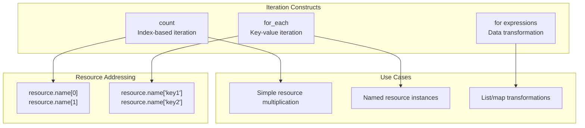
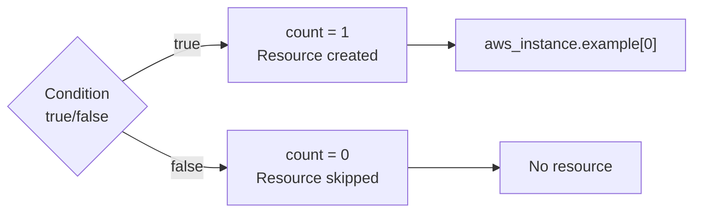
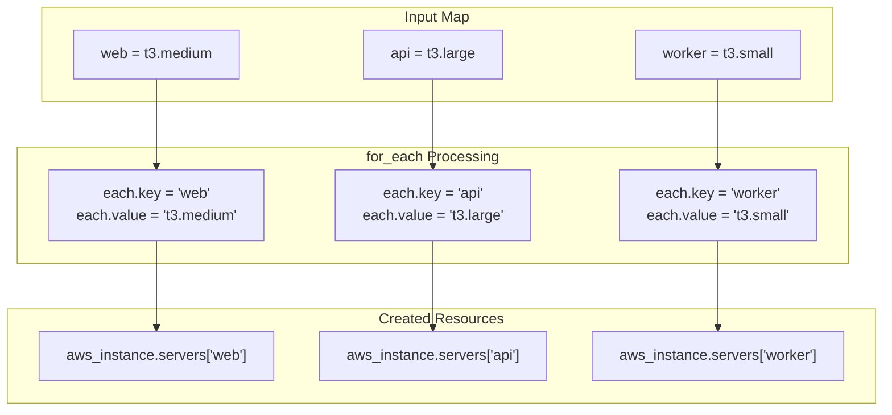
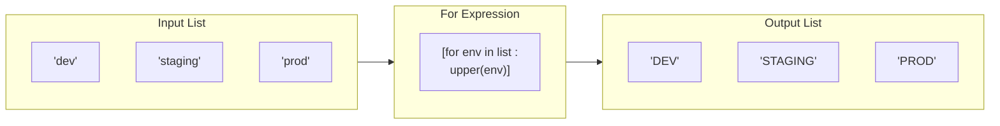
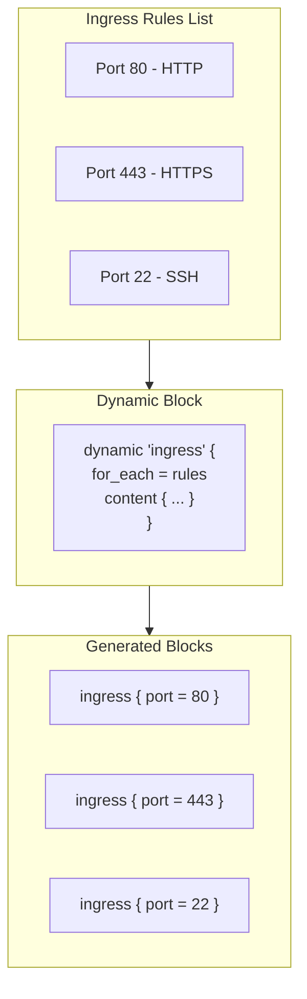
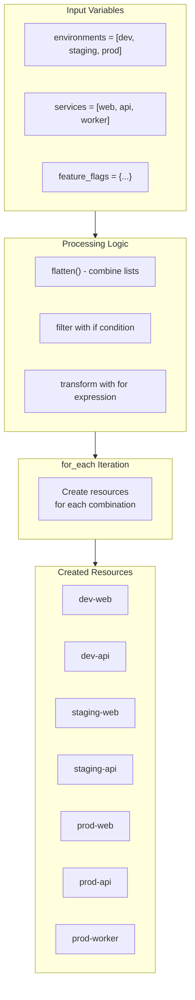
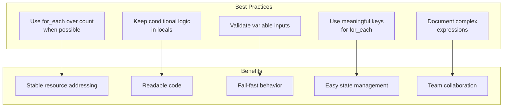

# How to Implement Terraform Loops and Conditionals

Author: [nawazdhandala](https://www.github.com/nawazdhandala)

Tags: Terraform, Infrastructure as Code, DevOps, HCL, Automation, Cloud

Description: Learn how to implement loops and conditionals in Terraform using count, for_each, for expressions, and conditional operators. Covers practical examples for dynamic infrastructure provisioning and resource management.

---

> Infrastructure as Code requires flexibility to handle varying configurations across environments. Terraform provides powerful looping and conditional constructs that enable you to write DRY (Don't Repeat Yourself) code while maintaining readability and predictability.

Terraform's HashiCorp Configuration Language (HCL) offers several mechanisms for iteration and conditional logic. Understanding when to use each construct helps you build maintainable infrastructure code that scales with your organization's needs.

---

## Understanding Terraform's Iteration Constructs

Terraform provides three primary ways to create multiple resources or transform data: `count`, `for_each`, and `for` expressions. Each serves different use cases and has distinct behaviors.



---

## Using count for Simple Iteration

The `count` meta-argument creates multiple instances of a resource based on a numeric value. Each instance receives a unique index starting from zero.

Creating multiple EC2 instances demonstrates the basic count pattern.

```hcl
# Define the number of instances to create
variable "instance_count" {
  description = "Number of EC2 instances to provision"
  type        = number
  default     = 3
}

# Create multiple EC2 instances using count
# Each instance gets a unique index accessible via count.index
resource "aws_instance" "web_server" {
  count = var.instance_count

  ami           = "ami-0c55b159cbfafe1f0"
  instance_type = "t3.micro"

  # Use count.index to create unique names for each instance
  tags = {
    Name        = "web-server-${count.index + 1}"
    Environment = "production"
    Index       = count.index
  }
}

# Output the IDs of all created instances
# The splat expression [*] collects attributes from all instances
output "instance_ids" {
  description = "List of EC2 instance IDs"
  value       = aws_instance.web_server[*].id
}

# Output the private IPs of all instances
output "private_ips" {
  description = "List of private IP addresses"
  value       = aws_instance.web_server[*].private_ip
}
```

---

## Conditional Resource Creation with count

The `count` argument accepts expressions, making it useful for conditional resource creation. Setting count to 0 prevents the resource from being created.



Creating resources conditionally based on environment or feature flags is a common pattern.

```hcl
# Variables to control conditional resource creation
variable "environment" {
  description = "Deployment environment"
  type        = string
  default     = "production"
}

variable "enable_monitoring" {
  description = "Whether to create monitoring resources"
  type        = bool
  default     = true
}

# Create a bastion host only in non-production environments
# The conditional expression evaluates to 1 (create) or 0 (skip)
resource "aws_instance" "bastion" {
  count = var.environment != "production" ? 1 : 0

  ami           = "ami-0c55b159cbfafe1f0"
  instance_type = "t3.micro"

  tags = {
    Name        = "bastion-${var.environment}"
    Environment = var.environment
    Purpose     = "SSH access for debugging"
  }
}

# Create CloudWatch alarm only when monitoring is enabled
resource "aws_cloudwatch_metric_alarm" "high_cpu" {
  count = var.enable_monitoring ? 1 : 0

  alarm_name          = "high-cpu-utilization"
  comparison_operator = "GreaterThanThreshold"
  evaluation_periods  = 2
  metric_name         = "CPUUtilization"
  namespace           = "AWS/EC2"
  period              = 300
  statistic           = "Average"
  threshold           = 80

  alarm_description = "Triggered when CPU exceeds 80%"
  alarm_actions     = [aws_sns_topic.alerts.arn]
}

# Safely reference conditionally created resources
# Use try() to handle cases where the resource might not exist
output "bastion_ip" {
  description = "Bastion host IP address if created"
  value       = try(aws_instance.bastion[0].public_ip, "Not created")
}
```

---

## Using for_each for Map and Set Iteration

The `for_each` meta-argument iterates over maps or sets, creating instances with meaningful keys instead of numeric indices. Resources created with for_each are more stable when items are added or removed.



Using for_each with a map provides both a key and value for each iteration.

```hcl
# Define servers as a map with configuration details
variable "servers" {
  description = "Map of server configurations"
  type = map(object({
    instance_type = string
    ami           = string
    subnet_id     = string
    volume_size   = number
  }))
  default = {
    web = {
      instance_type = "t3.medium"
      ami           = "ami-0c55b159cbfafe1f0"
      subnet_id     = "subnet-12345"
      volume_size   = 50
    }
    api = {
      instance_type = "t3.large"
      ami           = "ami-0c55b159cbfafe1f0"
      subnet_id     = "subnet-67890"
      volume_size   = 100
    }
    worker = {
      instance_type = "t3.xlarge"
      ami           = "ami-0c55b159cbfafe1f0"
      subnet_id     = "subnet-11111"
      volume_size   = 200
    }
  }
}

# Create EC2 instances using for_each
# each.key provides the server name, each.value provides the configuration
resource "aws_instance" "servers" {
  for_each = var.servers

  ami           = each.value.ami
  instance_type = each.value.instance_type
  subnet_id     = each.value.subnet_id

  root_block_device {
    volume_size = each.value.volume_size
    volume_type = "gp3"
  }

  tags = {
    Name        = "${each.key}-server"
    Role        = each.key
    Environment = "production"
  }
}

# Create corresponding EBS volumes for each server
resource "aws_ebs_volume" "data" {
  for_each = var.servers

  availability_zone = aws_instance.servers[each.key].availability_zone
  size              = each.value.volume_size * 2
  type              = "gp3"

  tags = {
    Name = "${each.key}-data-volume"
  }
}

# Output server information as a map
output "server_info" {
  description = "Information about created servers"
  value = {
    for name, instance in aws_instance.servers : name => {
      id         = instance.id
      private_ip = instance.private_ip
      public_ip  = instance.public_ip
    }
  }
}
```

---

## Converting Lists to Sets for for_each

The `for_each` argument requires a map or set, not a list. Convert lists to sets using the `toset()` function.

```hcl
# Define a list of availability zones
variable "availability_zones" {
  description = "List of AZs for subnet creation"
  type        = list(string)
  default     = ["us-east-1a", "us-east-1b", "us-east-1c"]
}

# Convert the list to a set for use with for_each
# toset() removes duplicates and creates an unordered collection
resource "aws_subnet" "private" {
  for_each = toset(var.availability_zones)

  vpc_id            = aws_vpc.main.id
  cidr_block        = cidrsubnet(aws_vpc.main.cidr_block, 8, index(var.availability_zones, each.value))
  availability_zone = each.value

  # When iterating over a set, each.key and each.value are identical
  tags = {
    Name = "private-subnet-${each.value}"
    AZ   = each.value
    Type = "private"
  }
}

# Create a map from a list using for expression with for_each
locals {
  # Transform list into map with index-based keys
  az_map = { for idx, az in var.availability_zones : "zone-${idx}" => az }
}

resource "aws_subnet" "public" {
  for_each = local.az_map

  vpc_id                  = aws_vpc.main.id
  cidr_block              = cidrsubnet(aws_vpc.main.cidr_block, 8, index(var.availability_zones, each.value) + 100)
  availability_zone       = each.value
  map_public_ip_on_launch = true

  tags = {
    Name = "public-${each.key}"
    AZ   = each.value
    Type = "public"
  }
}
```

---

## For Expressions: Transforming Collections

For expressions transform lists and maps into new collections. They provide powerful data manipulation capabilities similar to list comprehensions in Python.



Transforming lists with for expressions enables data manipulation before resource creation.

```hcl
# Input variables for transformation examples
variable "users" {
  description = "List of user configurations"
  type = list(object({
    name       = string
    department = string
    role       = string
  }))
  default = [
    { name = "alice", department = "engineering", role = "developer" },
    { name = "bob", department = "engineering", role = "sre" },
    { name = "carol", department = "product", role = "manager" },
    { name = "david", department = "engineering", role = "developer" }
  ]
}

locals {
  # Transform list to create uppercase names
  # Square brackets [] produce a list
  uppercase_names = [for user in var.users : upper(user.name)]

  # Filter list to include only engineering users
  # The 'if' clause filters elements
  engineering_users = [for user in var.users : user if user.department == "engineering"]

  # Create a map from list using curly braces {}
  # Produces a map with name as key and role as value
  user_roles = { for user in var.users : user.name => user.role }

  # Group users by department
  # Using ... creates a map with lists as values (grouping)
  users_by_department = {
    for user in var.users : user.department => user.name...
  }

  # Transform and restructure data
  user_details = {
    for user in var.users : user.name => {
      department  = user.department
      role        = user.role
      email       = "${user.name}@company.com"
      is_engineer = user.department == "engineering"
    }
  }

  # Flatten nested structures
  # Useful when working with multiple lists that need combining
  server_tags = flatten([
    for env in ["dev", "staging", "prod"] : [
      for role in ["web", "api", "worker"] : {
        environment = env
        role        = role
        name        = "${env}-${role}"
      }
    ]
  ])
}

# Output transformed data
output "uppercase_names" {
  value = local.uppercase_names
  # Result: ["ALICE", "BOB", "CAROL", "DAVID"]
}

output "engineering_users" {
  value = local.engineering_users
  # Result: List of users in engineering department
}

output "user_roles" {
  value = local.user_roles
  # Result: { "alice" = "developer", "bob" = "sre", ... }
}

output "users_by_department" {
  value = local.users_by_department
  # Result: { "engineering" = ["alice", "bob", "david"], "product" = ["carol"] }
}
```

---

## Conditional Expressions

Terraform's conditional expression follows the pattern `condition ? true_value : false_value`. Combine conditionals with other constructs for powerful configurations.

```hcl
# Variables for conditional examples
variable "environment" {
  description = "Deployment environment"
  type        = string
  default     = "production"
}

variable "high_availability" {
  description = "Enable high availability configuration"
  type        = bool
  default     = true
}

variable "custom_domain" {
  description = "Custom domain name, if provided"
  type        = string
  default     = ""
}

locals {
  # Simple conditional for instance type selection
  instance_type = var.environment == "production" ? "t3.large" : "t3.micro"

  # Nested conditionals for multi-tier selection
  instance_class = (
    var.environment == "production" ? "t3.xlarge" :
    var.environment == "staging" ? "t3.large" :
    "t3.micro"
  )

  # Conditional with coalesce for default values
  # coalesce returns the first non-null, non-empty value
  domain_name = coalesce(var.custom_domain, "${var.environment}.example.com")

  # Conditional list - different CIDR blocks per environment
  private_subnets = var.environment == "production" ? [
    "10.0.1.0/24",
    "10.0.2.0/24",
    "10.0.3.0/24"
  ] : [
    "10.0.1.0/24"
  ]

  # Conditional map merging
  base_tags = {
    Environment = var.environment
    ManagedBy   = "terraform"
  }

  production_tags = var.environment == "production" ? {
    CostCenter = "production-ops"
    Compliance = "required"
  } : {}

  # Merge base tags with environment-specific tags
  all_tags = merge(local.base_tags, local.production_tags)
}

# Apply conditional configurations to resources
resource "aws_instance" "app" {
  ami           = "ami-0c55b159cbfafe1f0"
  instance_type = local.instance_type

  # Conditional block using dynamic
  dynamic "ebs_block_device" {
    for_each = var.environment == "production" ? [1] : []
    content {
      device_name = "/dev/sdf"
      volume_size = 100
      volume_type = "gp3"
      encrypted   = true
    }
  }

  tags = local.all_tags
}

# Conditional replica count for RDS
resource "aws_rds_cluster" "database" {
  cluster_identifier = "app-${var.environment}"
  engine             = "aurora-postgresql"
  engine_version     = "14.6"
  database_name      = "appdb"
  master_username    = "admin"
  master_password    = var.db_password

  # More instances in production for high availability
  # Staging gets 2 instances, development gets 1
  instance_count = (
    var.environment == "production" ? 3 :
    var.environment == "staging" ? 2 :
    1
  )

  # Enable deletion protection only in production
  deletion_protection = var.environment == "production"

  # Skip final snapshot only in development
  skip_final_snapshot = var.environment == "development"
}
```

---

## Dynamic Blocks for Conditional Nested Configuration

Dynamic blocks generate nested configuration blocks based on collections. They are essential for creating variable numbers of nested blocks within a resource.



Using dynamic blocks with security group rules demonstrates flexible infrastructure configuration.

```hcl
# Define ingress rules as a variable
variable "ingress_rules" {
  description = "List of ingress rules for the security group"
  type = list(object({
    port        = number
    protocol    = string
    cidr_blocks = list(string)
    description = string
  }))
  default = [
    {
      port        = 80
      protocol    = "tcp"
      cidr_blocks = ["0.0.0.0/0"]
      description = "HTTP traffic"
    },
    {
      port        = 443
      protocol    = "tcp"
      cidr_blocks = ["0.0.0.0/0"]
      description = "HTTPS traffic"
    },
    {
      port        = 22
      protocol    = "tcp"
      cidr_blocks = ["10.0.0.0/8"]
      description = "SSH from internal network"
    }
  ]
}

variable "enable_ssh" {
  description = "Whether to include SSH access rule"
  type        = bool
  default     = true
}

locals {
  # Filter rules based on conditions
  filtered_rules = [
    for rule in var.ingress_rules : rule
    if !(rule.port == 22 && !var.enable_ssh)
  ]
}

# Security group with dynamic ingress blocks
resource "aws_security_group" "web" {
  name        = "web-sg"
  description = "Security group for web servers"
  vpc_id      = aws_vpc.main.id

  # Dynamic block generates multiple ingress blocks
  # Each iteration creates one ingress block
  dynamic "ingress" {
    for_each = local.filtered_rules
    content {
      from_port   = ingress.value.port
      to_port     = ingress.value.port
      protocol    = ingress.value.protocol
      cidr_blocks = ingress.value.cidr_blocks
      description = ingress.value.description
    }
  }

  # Static egress rule
  egress {
    from_port   = 0
    to_port     = 0
    protocol    = "-1"
    cidr_blocks = ["0.0.0.0/0"]
    description = "Allow all outbound traffic"
  }

  tags = {
    Name = "web-security-group"
  }
}

# Complex dynamic block example with IAM policy
variable "s3_bucket_permissions" {
  description = "S3 bucket access permissions"
  type = map(object({
    actions   = list(string)
    resources = list(string)
  }))
  default = {
    read = {
      actions   = ["s3:GetObject", "s3:ListBucket"]
      resources = ["arn:aws:s3:::my-bucket", "arn:aws:s3:::my-bucket/*"]
    }
    write = {
      actions   = ["s3:PutObject", "s3:DeleteObject"]
      resources = ["arn:aws:s3:::my-bucket/*"]
    }
  }
}

data "aws_iam_policy_document" "s3_access" {
  # Generate multiple statement blocks from the permissions map
  dynamic "statement" {
    for_each = var.s3_bucket_permissions
    content {
      sid       = statement.key
      effect    = "Allow"
      actions   = statement.value.actions
      resources = statement.value.resources
    }
  }
}

resource "aws_iam_policy" "s3_access" {
  name   = "s3-bucket-access"
  policy = data.aws_iam_policy_document.s3_access.json
}
```

---

## Combining Loops and Conditionals

Real-world infrastructure often requires combining multiple iteration and conditional constructs. Here is a comprehensive example demonstrating advanced patterns.



Building a multi-environment, multi-service infrastructure with conditions showcases advanced Terraform patterns.

```hcl
# Complex variable definitions
variable "environments" {
  description = "Environment configurations"
  type = map(object({
    instance_type    = string
    min_instances    = number
    max_instances    = number
    enable_autoscale = bool
    vpc_cidr         = string
  }))
  default = {
    development = {
      instance_type    = "t3.micro"
      min_instances    = 1
      max_instances    = 2
      enable_autoscale = false
      vpc_cidr         = "10.0.0.0/16"
    }
    staging = {
      instance_type    = "t3.small"
      min_instances    = 2
      max_instances    = 4
      enable_autoscale = true
      vpc_cidr         = "10.1.0.0/16"
    }
    production = {
      instance_type    = "t3.medium"
      min_instances    = 3
      max_instances    = 10
      enable_autoscale = true
      vpc_cidr         = "10.2.0.0/16"
    }
  }
}

variable "services" {
  description = "Service configurations"
  type = map(object({
    port            = number
    health_path     = string
    cpu             = number
    memory          = number
    environments    = list(string)
  }))
  default = {
    web = {
      port         = 80
      health_path  = "/health"
      cpu          = 256
      memory       = 512
      environments = ["development", "staging", "production"]
    }
    api = {
      port         = 8080
      health_path  = "/api/health"
      cpu          = 512
      memory       = 1024
      environments = ["development", "staging", "production"]
    }
    worker = {
      port         = 0
      health_path  = "/worker/health"
      cpu          = 1024
      memory       = 2048
      environments = ["staging", "production"]
    }
  }
}

locals {
  # Generate all valid environment-service combinations
  # Only include services that are enabled for each environment
  service_deployments = merge([
    for env_name, env_config in var.environments : {
      for svc_name, svc_config in var.services : "${env_name}-${svc_name}" => {
        environment    = env_name
        service        = svc_name
        instance_type  = env_config.instance_type
        min_instances  = env_config.min_instances
        max_instances  = env_config.max_instances
        enable_autoscale = env_config.enable_autoscale
        port           = svc_config.port
        health_path    = svc_config.health_path
        cpu            = svc_config.cpu
        memory         = svc_config.memory
      }
      if contains(svc_config.environments, env_name)
    }
  ]...)

  # Separate deployments that need autoscaling
  autoscale_deployments = {
    for k, v in local.service_deployments : k => v
    if v.enable_autoscale
  }

  # Generate subnet configurations for each environment
  subnet_configs = merge([
    for env_name, env_config in var.environments : {
      for idx, az in ["a", "b", "c"] : "${env_name}-${az}" => {
        environment = env_name
        az          = "us-east-1${az}"
        cidr        = cidrsubnet(env_config.vpc_cidr, 8, idx)
        type        = idx < 2 ? "private" : "public"
      }
    }
  ]...)
}

# Create VPCs for each environment
resource "aws_vpc" "main" {
  for_each = var.environments

  cidr_block           = each.value.vpc_cidr
  enable_dns_hostnames = true
  enable_dns_support   = true

  tags = {
    Name        = "${each.key}-vpc"
    Environment = each.key
  }
}

# Create subnets using the generated configuration
resource "aws_subnet" "main" {
  for_each = local.subnet_configs

  vpc_id            = aws_vpc.main[each.value.environment].id
  cidr_block        = each.value.cidr
  availability_zone = each.value.az

  # Public subnets get public IPs
  map_public_ip_on_launch = each.value.type == "public"

  tags = {
    Name        = each.key
    Environment = each.value.environment
    Type        = each.value.type
  }
}

# Create ECS services for each deployment
resource "aws_ecs_service" "main" {
  for_each = local.service_deployments

  name            = each.key
  cluster         = aws_ecs_cluster.main[each.value.environment].id
  task_definition = aws_ecs_task_definition.main[each.key].arn
  desired_count   = each.value.min_instances
  launch_type     = "FARGATE"

  network_configuration {
    subnets = [
      for subnet_key, subnet in aws_subnet.main :
      subnet.id
      if subnet.tags["Environment"] == each.value.environment && subnet.tags["Type"] == "private"
    ]
    security_groups = [aws_security_group.service[each.value.environment].id]
  }

  # Only add load balancer for services with ports
  dynamic "load_balancer" {
    for_each = each.value.port > 0 ? [1] : []
    content {
      target_group_arn = aws_lb_target_group.main[each.key].arn
      container_name   = each.value.service
      container_port   = each.value.port
    }
  }

  tags = {
    Environment = each.value.environment
    Service     = each.value.service
  }
}

# Create autoscaling only for enabled deployments
resource "aws_appautoscaling_target" "ecs" {
  for_each = local.autoscale_deployments

  max_capacity       = each.value.max_instances
  min_capacity       = each.value.min_instances
  resource_id        = "service/${aws_ecs_cluster.main[each.value.environment].name}/${aws_ecs_service.main[each.key].name}"
  scalable_dimension = "ecs:service:DesiredCount"
  service_namespace  = "ecs"
}

resource "aws_appautoscaling_policy" "ecs_cpu" {
  for_each = local.autoscale_deployments

  name               = "${each.key}-cpu-autoscaling"
  policy_type        = "TargetTrackingScaling"
  resource_id        = aws_appautoscaling_target.ecs[each.key].resource_id
  scalable_dimension = aws_appautoscaling_target.ecs[each.key].scalable_dimension
  service_namespace  = aws_appautoscaling_target.ecs[each.key].service_namespace

  target_tracking_scaling_policy_configuration {
    predefined_metric_specification {
      predefined_metric_type = "ECSServiceAverageCPUUtilization"
    }
    target_value       = 70.0
    scale_in_cooldown  = 300
    scale_out_cooldown = 60
  }
}

# Output deployment summary
output "deployments" {
  description = "Summary of all service deployments"
  value = {
    for k, v in local.service_deployments : k => {
      environment  = v.environment
      service      = v.service
      autoscaling  = v.enable_autoscale
      instance_range = "${v.min_instances}-${v.max_instances}"
    }
  }
}
```

---

## Best Practices

Following these guidelines helps you write maintainable Terraform code that scales with your infrastructure needs.



Here are key recommendations for using loops and conditionals effectively.

```hcl
# 1. Prefer for_each over count for stable resource addressing
# Bad: Using count makes resources depend on list order
resource "aws_instance" "bad_example" {
  count = length(var.server_names)
  # Removing an item shifts all indices
}

# Good: Using for_each with meaningful keys
resource "aws_instance" "good_example" {
  for_each = toset(var.server_names)
  # Each resource has a stable key
}

# 2. Use locals to simplify complex expressions
# Bad: Complex expression inline
resource "aws_instance" "complex" {
  for_each = {
    for k, v in var.servers : k => v
    if v.enabled && (var.env == "prod" || v.always_deploy)
  }
  # Hard to read and maintain
}

# Good: Break down into locals
locals {
  enabled_servers = {
    for k, v in var.servers : k => v
    if v.enabled
  }

  deployable_servers = {
    for k, v in local.enabled_servers : k => v
    if var.env == "prod" || v.always_deploy
  }
}

resource "aws_instance" "clean" {
  for_each = local.deployable_servers
  # Clear and maintainable
}

# 3. Add validation to variables
variable "environment" {
  description = "Deployment environment"
  type        = string

  validation {
    condition     = contains(["development", "staging", "production"], var.environment)
    error_message = "Environment must be development, staging, or production."
  }
}

variable "instance_count" {
  description = "Number of instances to create"
  type        = number

  validation {
    condition     = var.instance_count >= 1 && var.instance_count <= 10
    error_message = "Instance count must be between 1 and 10."
  }
}

# 4. Use try() for safe attribute access
output "optional_resource_id" {
  description = "ID of optional resource if it exists"
  value       = try(aws_instance.optional[0].id, null)
}

# 5. Use one() for single-element lists
output "single_instance_id" {
  description = "ID of the single instance"
  value       = one(aws_instance.single[*].id)
}
```

---

## Common Patterns Reference

Here is a quick reference for common loop and conditional patterns you will use frequently.

```hcl
# Pattern 1: Conditional resource creation
resource "aws_resource" "conditional" {
  count = var.create_resource ? 1 : 0
}

# Pattern 2: Iterate over list with for_each
resource "aws_resource" "from_list" {
  for_each = toset(var.items)
}

# Pattern 3: Iterate over map with for_each
resource "aws_resource" "from_map" {
  for_each = var.item_map
  name     = each.key
  value    = each.value.some_attribute
}

# Pattern 4: Transform list to map
locals {
  list_to_map = { for item in var.items : item.name => item }
}

# Pattern 5: Filter and transform
locals {
  filtered = [for item in var.items : item if item.enabled]
}

# Pattern 6: Nested iteration with flatten
locals {
  combinations = flatten([
    for a in var.list_a : [
      for b in var.list_b : {
        a = a
        b = b
      }
    ]
  ])
}

# Pattern 7: Dynamic blocks for variable nested config
dynamic "block_name" {
  for_each = var.block_configs
  content {
    attribute = block_name.value.some_attr
  }
}

# Pattern 8: Conditional dynamic block
dynamic "optional_block" {
  for_each = var.enable_feature ? [1] : []
  content {
    setting = "value"
  }
}

# Pattern 9: Group by attribute
locals {
  grouped = {
    for item in var.items : item.category => item.name...
  }
}

# Pattern 10: Merge maps conditionally
locals {
  merged = merge(
    var.base_config,
    var.environment == "production" ? var.prod_config : {}
  )
}
```

---

## Summary

Terraform's loops and conditionals provide the flexibility needed to manage infrastructure at scale. The `count` meta-argument works well for simple numeric iteration and conditional resource creation. The `for_each` meta-argument offers stable resource addressing with meaningful keys, making it the preferred choice for most use cases. For expressions enable powerful data transformations, and dynamic blocks allow variable nested configurations.

Start with simple patterns and gradually introduce complexity as your infrastructure requirements grow. Keep logic readable by moving complex expressions to locals, and always validate your variable inputs to catch errors early. With these constructs mastered, you can build DRY, maintainable Terraform configurations that adapt to any environment.
