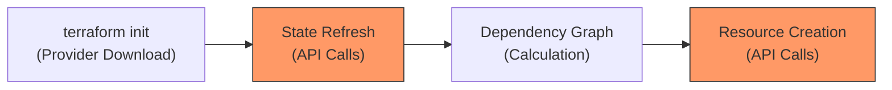
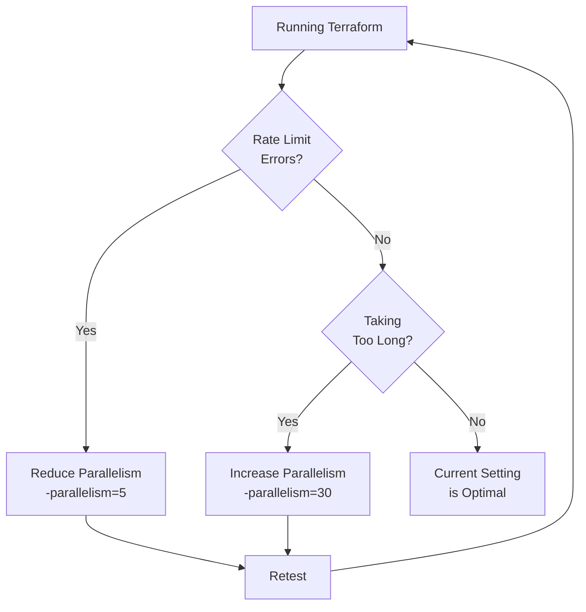
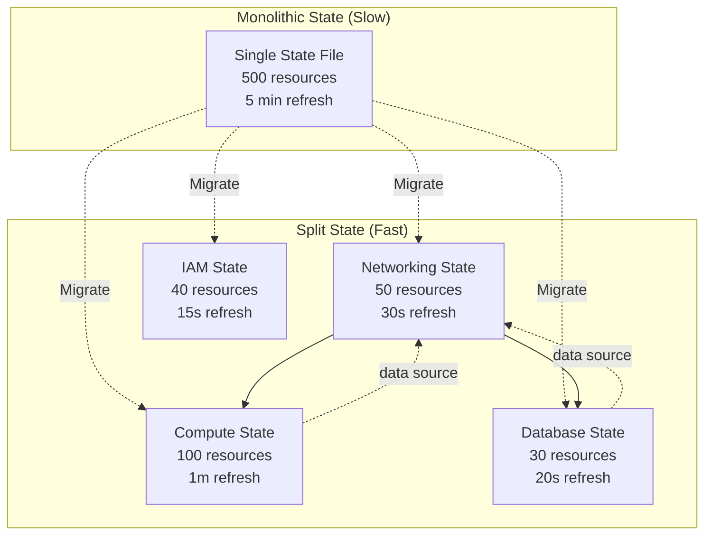
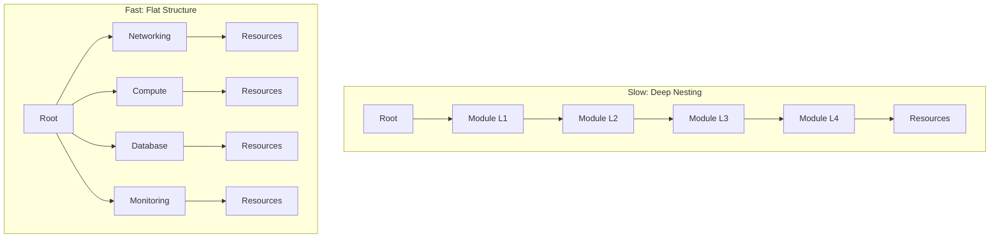
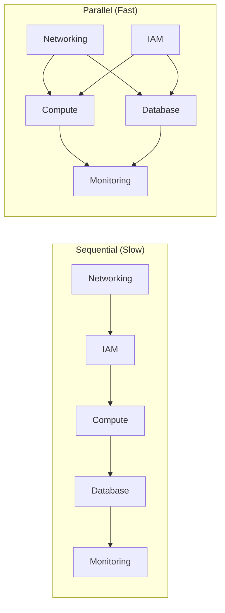
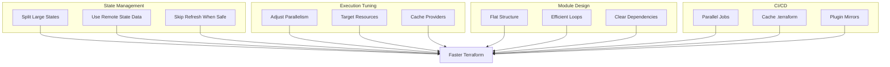

# How to Optimize Terraform Performance

Author: [nawazdhandala](https://www.github.com/nawazdhandala)

Tags: Terraform, Infrastructure as Code, DevOps, Performance Optimization, State Management, Parallelism

Description: Learn how to optimize Terraform performance for faster plan and apply operations. Covers state management strategies, parallelism tuning, module optimization, provider configuration, and caching techniques for large-scale infrastructure deployments.

---

> Terraform operations can become painfully slow as your infrastructure grows. Waiting 20+ minutes for a plan to complete kills productivity. Optimizing your Terraform setup reduces execution time from hours to minutes, letting teams deploy faster and iterate more confidently.

Slow Terraform runs frustrate teams and delay deployments. Understanding what causes slowdowns and how to fix them transforms your infrastructure workflow.

---

## Understanding Terraform Performance Bottlenecks

Before optimizing, you need to understand where Terraform spends its time. The main phases are:



Most performance issues come from two sources:

- **State refresh** - Terraform queries every resource to check current state
- **API rate limits** - Cloud providers throttle too many concurrent requests

---

## Parallelism Tuning

Terraform processes resources in parallel by default, but the default setting of 10 may not be optimal for your environment.

### Increasing Parallelism

For environments with high API rate limits or many independent resources, increasing parallelism speeds up operations significantly.

```bash
# Increase parallelism for faster operations
# Default is 10, increase for more concurrent API calls
terraform apply -parallelism=20

# For very large deployments with independent resources
terraform apply -parallelism=50

# Set via environment variable for all operations
export TF_CLI_ARGS_apply="-parallelism=30"
export TF_CLI_ARGS_plan="-parallelism=30"
```

### When to Reduce Parallelism

Sometimes reducing parallelism prevents API throttling errors and actually speeds up total execution time.

```bash
# Reduce parallelism when hitting rate limits
terraform apply -parallelism=5

# For providers with strict rate limits (some regions, smaller accounts)
terraform apply -parallelism=2
```

### Parallelism Decision Flow



---

## State Management Optimization

Large state files slow down every Terraform operation. Optimizing state management provides the biggest performance gains.

### Split State by Component

Breaking a monolithic state into smaller, focused states reduces refresh time dramatically.

```hcl
# Before: Everything in one state file
# infrastructure/
#   main.tf      <- 500 resources, 5 minute refresh

# After: Split by component
# infrastructure/
#   networking/
#     backend.tf  <- 50 resources, 30 second refresh
#   compute/
#     backend.tf  <- 100 resources, 1 minute refresh
#   databases/
#     backend.tf  <- 30 resources, 20 second refresh
```

The configuration below demonstrates separate backend configuration for the networking component:

```hcl
# infrastructure/networking/backend.tf
terraform {
  backend "s3" {
    bucket         = "terraform-state-prod"
    key            = "networking/terraform.tfstate"
    region         = "us-east-1"
    dynamodb_table = "terraform-locks"
    encrypt        = true
  }
}

# infrastructure/networking/main.tf
# Only networking resources here
resource "aws_vpc" "main" {
  cidr_block           = var.vpc_cidr
  enable_dns_hostnames = true
  enable_dns_support   = true

  tags = {
    Name = "${var.environment}-vpc"
  }
}

resource "aws_subnet" "private" {
  count             = length(var.private_subnet_cidrs)
  vpc_id            = aws_vpc.main.id
  cidr_block        = var.private_subnet_cidrs[count.index]
  availability_zone = var.availability_zones[count.index]

  tags = {
    Name = "${var.environment}-private-${count.index + 1}"
    Type = "private"
  }
}
```

### Use Data Sources for Cross-State References

When resources are split across states, use remote state data sources or dedicated data sources to reference them:

```hcl
# infrastructure/compute/data.tf
# Reference networking outputs without coupling the state files
data "terraform_remote_state" "networking" {
  backend = "s3"

  config = {
    bucket = "terraform-state-prod"
    key    = "networking/terraform.tfstate"
    region = "us-east-1"
  }
}

# infrastructure/compute/main.tf
# Use the VPC ID from the networking state
resource "aws_instance" "app" {
  count         = var.instance_count
  ami           = data.aws_ami.ubuntu.id
  instance_type = var.instance_type
  subnet_id     = data.terraform_remote_state.networking.outputs.private_subnet_ids[count.index % length(data.terraform_remote_state.networking.outputs.private_subnet_ids)]

  tags = {
    Name = "${var.environment}-app-${count.index + 1}"
  }
}
```

### State Splitting Architecture



---

## Refresh Optimization

State refresh is often the slowest part of Terraform operations. Several strategies reduce refresh time.

### Skip Refresh When Safe

For operations where you know the state is current, skipping refresh saves significant time:

```bash
# Skip refresh when you just ran apply
terraform plan -refresh=false

# Useful for syntax validation and dependency checking
terraform validate

# Target specific resources to reduce refresh scope
terraform plan -target=aws_instance.app[0] -target=aws_instance.app[1]
```

### Use Refresh-Only Mode

When you only need to update state without making changes, use refresh-only mode:

```bash
# Update state to match actual infrastructure
terraform apply -refresh-only -auto-approve

# Combine with targeting for faster partial refreshes
terraform apply -refresh-only -target=module.compute -auto-approve
```

### Configure Provider Timeouts

Slow API responses extend refresh time. Configure appropriate timeouts to fail fast on unresponsive endpoints:

```hcl
# providers.tf
provider "aws" {
  region = var.aws_region

  # Reduce default timeouts for faster failure detection
  default_tags {
    tags = {
      Environment = var.environment
      ManagedBy   = "terraform"
    }
  }
}

# For resources with known slow operations, set explicit timeouts
resource "aws_db_instance" "main" {
  identifier     = "${var.environment}-database"
  engine         = "postgres"
  engine_version = "15.4"
  instance_class = var.db_instance_class

  # RDS operations are slow - set appropriate timeouts
  timeouts {
    create = "60m"
    update = "60m"
    delete = "60m"
  }
}
```

---

## Module Optimization

Poorly structured modules cause performance problems. Optimizing module design improves both speed and maintainability.

### Avoid Deep Module Nesting

Deeply nested modules create complex dependency graphs that slow down planning:

```hcl
# Bad: Deep nesting creates complex graphs
module "infrastructure" {
  source = "./modules/infrastructure"
  # This module calls another module
  # which calls another module
  # 5 levels deep = slow planning
}

# Good: Flat module structure with clear dependencies
module "networking" {
  source      = "./modules/networking"
  environment = var.environment
  vpc_cidr    = var.vpc_cidr
}

module "compute" {
  source     = "./modules/compute"
  depends_on = [module.networking]

  vpc_id     = module.networking.vpc_id
  subnet_ids = module.networking.private_subnet_ids
}

module "database" {
  source     = "./modules/database"
  depends_on = [module.networking]

  vpc_id     = module.networking.vpc_id
  subnet_ids = module.networking.database_subnet_ids
}
```

### Use Count and For_Each Efficiently

Choosing between count and for_each affects both performance and state management:

```hcl
# Using for_each with a map - better for resources that may be added/removed
# Terraform can identify resources by key, avoiding recreation
variable "instances" {
  type = map(object({
    instance_type = string
    ami           = string
  }))
  default = {
    web-1 = { instance_type = "t3.medium", ami = "ami-12345678" }
    web-2 = { instance_type = "t3.medium", ami = "ami-12345678" }
    api-1 = { instance_type = "t3.large", ami = "ami-12345678" }
  }
}

resource "aws_instance" "app" {
  for_each = var.instances

  ami           = each.value.ami
  instance_type = each.value.instance_type

  tags = {
    Name = "${var.environment}-${each.key}"
  }
}

# Using count for simple scaling - faster for homogeneous resources
resource "aws_instance" "worker" {
  count = var.worker_count

  ami           = var.worker_ami
  instance_type = var.worker_instance_type

  tags = {
    Name = "${var.environment}-worker-${count.index + 1}"
  }
}
```

### Module Structure for Performance



---

## Provider Configuration

Proper provider configuration reduces API calls and improves caching.

### Use Provider Aliases for Multi-Region

Configure provider aliases to avoid redundant authentication:

```hcl
# providers.tf
# Primary region provider
provider "aws" {
  region = "us-east-1"
  alias  = "us_east"

  # Assume role for cross-account access with session caching
  assume_role {
    role_arn     = var.assume_role_arn
    session_name = "terraform-${var.environment}"
    # Longer session duration reduces re-authentication
    duration     = "1h"
  }
}

# Secondary region provider
provider "aws" {
  region = "us-west-2"
  alias  = "us_west"

  assume_role {
    role_arn     = var.assume_role_arn
    session_name = "terraform-${var.environment}"
    duration     = "1h"
  }
}

# Use specific providers for resources
resource "aws_instance" "east_app" {
  provider      = aws.us_east
  ami           = var.east_ami
  instance_type = var.instance_type
}

resource "aws_instance" "west_app" {
  provider      = aws.us_west
  ami           = var.west_ami
  instance_type = var.instance_type
}
```

### Cache Provider Plugins

Provider downloads can be slow. Configure a shared plugin cache:

```bash
# Set plugin cache directory (add to ~/.bashrc or ~/.zshrc)
export TF_PLUGIN_CACHE_DIR="$HOME/.terraform.d/plugin-cache"

# Create the cache directory
mkdir -p "$TF_PLUGIN_CACHE_DIR"

# For CI/CD, use a persistent cache location
export TF_PLUGIN_CACHE_DIR="/opt/terraform/plugin-cache"
```

### Provider Caching Configuration

The following terraformrc file configures provider caching and installation behavior:

```hcl
# ~/.terraformrc
plugin_cache_dir = "$HOME/.terraform.d/plugin-cache"

# Use filesystem mirror for air-gapped environments
provider_installation {
  filesystem_mirror {
    path    = "/opt/terraform/providers"
    include = ["registry.terraform.io/*/*"]
  }
  direct {
    exclude = ["registry.terraform.io/*/*"]
  }
}
```

---

## CI/CD Optimization

Terraform in CI/CD pipelines benefits from specific optimizations.

### Cache Terraform Directory

Caching the .terraform directory between runs avoids repeated provider downloads:

```yaml
# .github/workflows/terraform.yml
name: Terraform

on:
  push:
    branches: [main]
  pull_request:
    branches: [main]

env:
  TF_PLUGIN_CACHE_DIR: ${{ github.workspace }}/.terraform-cache

jobs:
  terraform:
    runs-on: ubuntu-latest

    steps:
      - uses: actions/checkout@v4

      # Cache Terraform providers and modules
      - name: Cache Terraform
        uses: actions/cache@v4
        with:
          path: |
            .terraform
            .terraform-cache
          key: terraform-${{ hashFiles('**/.terraform.lock.hcl') }}
          restore-keys: |
            terraform-

      - name: Setup Terraform
        uses: hashicorp/setup-terraform@v3
        with:
          terraform_version: 1.7.0

      # Create cache directory
      - name: Prepare Cache Directory
        run: mkdir -p $TF_PLUGIN_CACHE_DIR

      - name: Terraform Init
        run: terraform init

      - name: Terraform Plan
        run: terraform plan -out=tfplan -parallelism=30

      - name: Terraform Apply
        if: github.ref == 'refs/heads/main'
        run: terraform apply -auto-approve -parallelism=30 tfplan
```

### Parallel Job Execution

For multi-component infrastructure, run independent components in parallel:

```yaml
# .github/workflows/terraform-parallel.yml
name: Terraform Parallel

on:
  push:
    branches: [main]

jobs:
  # Independent components run in parallel
  networking:
    runs-on: ubuntu-latest
    steps:
      - uses: actions/checkout@v4
      - uses: hashicorp/setup-terraform@v3
      - name: Apply Networking
        working-directory: infrastructure/networking
        run: |
          terraform init
          terraform apply -auto-approve -parallelism=20

  iam:
    runs-on: ubuntu-latest
    steps:
      - uses: actions/checkout@v4
      - uses: hashicorp/setup-terraform@v3
      - name: Apply IAM
        working-directory: infrastructure/iam
        run: |
          terraform init
          terraform apply -auto-approve

  # Dependent components wait for prerequisites
  compute:
    needs: [networking, iam]
    runs-on: ubuntu-latest
    steps:
      - uses: actions/checkout@v4
      - uses: hashicorp/setup-terraform@v3
      - name: Apply Compute
        working-directory: infrastructure/compute
        run: |
          terraform init
          terraform apply -auto-approve -parallelism=30

  database:
    needs: [networking, iam]
    runs-on: ubuntu-latest
    steps:
      - uses: actions/checkout@v4
      - uses: hashicorp/setup-terraform@v3
      - name: Apply Database
        working-directory: infrastructure/database
        run: |
          terraform init
          terraform apply -auto-approve
```

### CI/CD Pipeline Flow



---

## Resource Targeting

When working on specific resources, targeting reduces scope and speeds up operations.

### Target Specific Resources

Use targeting to limit operations to resources you are actively changing:

```bash
# Target a specific resource
terraform plan -target=aws_instance.app[0]

# Target multiple resources
terraform plan -target=aws_instance.app[0] -target=aws_instance.app[1]

# Target an entire module
terraform plan -target=module.compute

# Combine targeting with refresh skip for maximum speed
terraform plan -target=module.compute -refresh=false
```

### Create Targeting Scripts

Automate common targeting patterns with helper scripts:

```bash
#!/bin/bash
# scripts/fast-plan.sh
# Quick plan for specific component with optimizations

set -e

COMPONENT=$1

if [ -z "$COMPONENT" ]; then
    echo "Usage: $0 <component>"
    echo "Components: networking, compute, database, monitoring"
    exit 1
fi

echo "Running fast plan for: $COMPONENT"

# Map component to module
case $COMPONENT in
    networking)
        TARGET="-target=module.networking"
        ;;
    compute)
        TARGET="-target=module.compute"
        ;;
    database)
        TARGET="-target=module.database"
        ;;
    monitoring)
        TARGET="-target=module.monitoring"
        ;;
    *)
        echo "Unknown component: $COMPONENT"
        exit 1
        ;;
esac

# Run plan with targeting and increased parallelism
terraform plan $TARGET -parallelism=30

echo "Fast plan complete for: $COMPONENT"
```

---

## Monitoring Terraform Performance

Measure performance to identify bottlenecks and track improvements.

### Enable Detailed Logging

Terraform logging reveals where time is spent:

```bash
# Enable trace logging to see all operations
export TF_LOG=TRACE
export TF_LOG_PATH="./terraform.log"

# Run your operation
terraform plan

# Analyze the log for slow operations
grep -E "^\d{4}" terraform.log | head -100

# More targeted logging levels
export TF_LOG=DEBUG  # Less verbose than TRACE
export TF_LOG=INFO   # High-level operations only
```

### Time Your Operations

Track execution time to measure optimization impact:

```bash
#!/bin/bash
# scripts/timed-terraform.sh
# Run Terraform with timing information

set -e

OPERATION=$1
shift

echo "Starting Terraform $OPERATION at $(date)"
START_TIME=$(date +%s)

terraform $OPERATION "$@"

END_TIME=$(date +%s)
DURATION=$((END_TIME - START_TIME))

echo ""
echo "Terraform $OPERATION completed in ${DURATION} seconds"
echo "Finished at $(date)"

# Log to file for tracking
echo "$(date -I),$OPERATION,$DURATION" >> terraform-timing.csv
```

### Performance Metrics Dashboard

Create a simple tracking mechanism to visualize performance trends:

```hcl
# monitoring/main.tf
# Track Terraform execution times in CloudWatch

resource "aws_cloudwatch_metric_alarm" "terraform_duration" {
  alarm_name          = "terraform-plan-duration"
  comparison_operator = "GreaterThanThreshold"
  evaluation_periods  = 1
  metric_name         = "TerraformPlanDuration"
  namespace           = "Terraform/Performance"
  period              = 300
  statistic           = "Average"
  threshold           = 300  # Alert if plan takes more than 5 minutes

  alarm_description = "Terraform plan duration exceeded 5 minutes"
  alarm_actions     = [var.alert_sns_topic_arn]

  dimensions = {
    Environment = var.environment
    Component   = "infrastructure"
  }
}
```

---

## Quick Reference: Performance Commands

Here is a summary of the most useful performance optimization commands:

```bash
# Increase parallelism for faster operations
terraform apply -parallelism=30

# Skip refresh when state is known to be current
terraform plan -refresh=false

# Target specific resources to reduce scope
terraform plan -target=module.compute

# Combine optimizations for maximum speed
terraform plan -target=module.compute -refresh=false -parallelism=30

# Set environment variables for consistent optimization
export TF_CLI_ARGS_plan="-parallelism=30"
export TF_CLI_ARGS_apply="-parallelism=30"
export TF_PLUGIN_CACHE_DIR="$HOME/.terraform.d/plugin-cache"

# Validate syntax without refreshing state (instant)
terraform validate

# Format check without any API calls (instant)
terraform fmt -check
```

---

## Summary

Optimizing Terraform performance requires a multi-faceted approach:



Key takeaways:

1. **Split state files** - Smaller states mean faster refreshes
2. **Tune parallelism** - Balance speed against API rate limits
3. **Use targeting** - Limit scope when working on specific resources
4. **Cache everything** - Provider plugins, .terraform directory, credentials
5. **Parallelize CI/CD** - Run independent components simultaneously
6. **Measure and iterate** - Track performance to identify bottlenecks

Implementing these optimizations transforms Terraform from a bottleneck into a fast, reliable part of your deployment pipeline.
