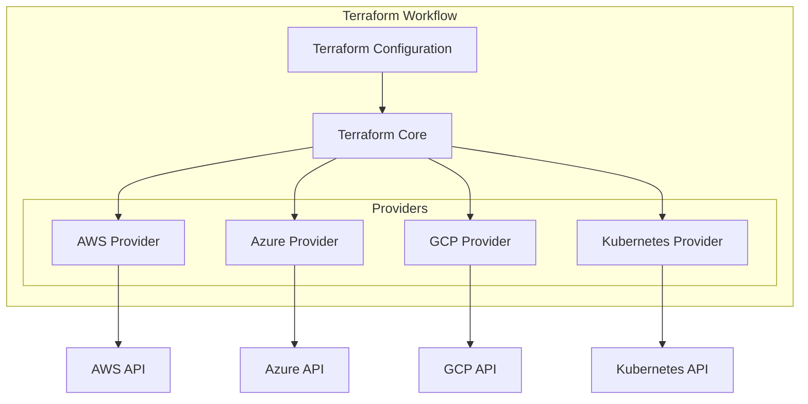
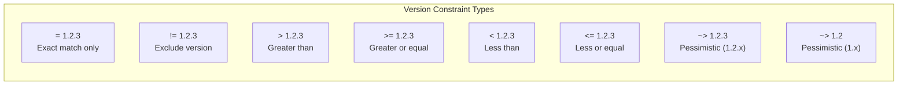
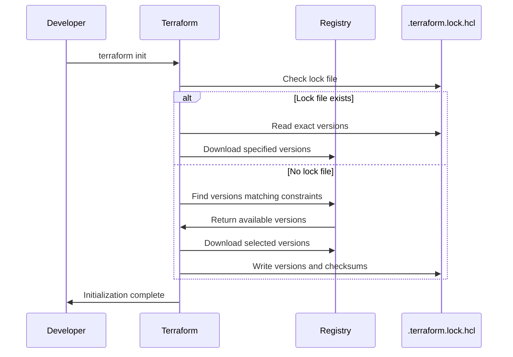
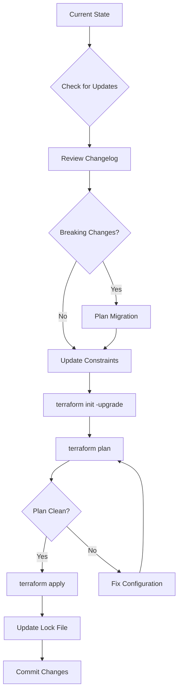
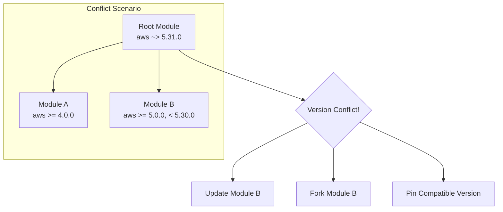
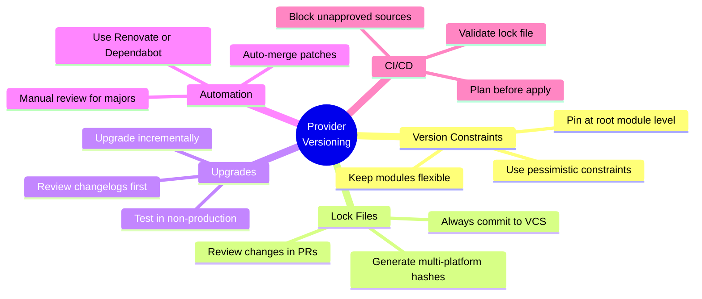

# How to Handle Terraform Provider Versioning

Author: [nawazdhandala](https://www.github.com/nawazdhandala)

Tags: Terraform, Infrastructure as Code, DevOps, Cloud, Provider Versioning, AWS, Azure, GCP

Description: Learn how to manage Terraform provider versions effectively, including version constraints, lock files, upgrade strategies, and best practices for maintaining stable infrastructure deployments.

Terraform providers are the bridge between your configuration files and the APIs of cloud platforms and services. Managing provider versions correctly is crucial for reproducible infrastructure deployments. A mismatch in provider versions can lead to unexpected behavior, failed deployments, or security vulnerabilities. In this guide, you will learn how to declare provider versions, use lock files, handle upgrades safely, and implement organizational policies for provider management.

## Understanding Terraform Providers

Providers are plugins that Terraform uses to interact with cloud providers, SaaS services, and other APIs. Each provider has its own release cycle, bug fixes, and breaking changes.



## Declaring Provider Versions

Every Terraform configuration should explicitly declare provider versions. Without version constraints, Terraform will download the latest version, which can introduce breaking changes.

The required_providers block inside terraform block defines which providers your configuration needs and their version constraints.

```hcl
# main.tf - Declaring provider versions with constraints
terraform {
  # Minimum Terraform version required
  required_version = ">= 1.5.0"

  required_providers {
    # AWS provider with version constraint
    # ~> allows only patch version updates (e.g., 5.31.0 to 5.31.x)
    aws = {
      source  = "hashicorp/aws"
      version = "~> 5.31.0"
    }

    # Azure provider with range constraint
    # >= and < define a specific version range
    azurerm = {
      source  = "hashicorp/azurerm"
      version = ">= 3.85.0, < 4.0.0"
    }

    # Google Cloud provider with exact version
    # = pins to exactly this version
    google = {
      source  = "hashicorp/google"
      version = "= 5.12.0"
    }

    # Kubernetes provider allowing minor updates
    # ~> 2.24 allows 2.24.x and 2.25.x, but not 3.0.0
    kubernetes = {
      source  = "hashicorp/kubernetes"
      version = "~> 2.24"
    }
  }
}
```

## Version Constraint Operators

Terraform supports several operators for version constraints. Understanding these operators helps you balance stability with the need for updates.



The following table explains each operator with practical examples.

```hcl
# examples/version-constraints.tf
# Demonstrating different version constraint strategies

terraform {
  required_providers {
    # EXACT VERSION - Use when you need complete reproducibility
    # Only version 5.31.0 will be installed
    # Risk: Won't get security patches automatically
    exact_example = {
      source  = "hashicorp/aws"
      version = "= 5.31.0"
    }

    # PESSIMISTIC CONSTRAINT (Patch level) - Recommended for production
    # Allows 5.31.0, 5.31.1, 5.31.2, etc.
    # Blocks 5.32.0 and above
    # Balances stability with security updates
    patch_updates = {
      source  = "hashicorp/aws"
      version = "~> 5.31.0"
    }

    # PESSIMISTIC CONSTRAINT (Minor level) - Good for development
    # Allows 5.31.0, 5.32.0, 5.33.0, etc.
    # Blocks 6.0.0 and above
    minor_updates = {
      source  = "hashicorp/aws"
      version = "~> 5.31"
    }

    # RANGE CONSTRAINT - Maximum control
    # Allows any version from 5.20.0 to 5.35.x
    # Useful when you know specific versions work
    range_example = {
      source  = "hashicorp/aws"
      version = ">= 5.20.0, < 5.36.0"
    }

    # COMPOUND CONSTRAINT - Exclude problematic versions
    # Allows 5.x but excludes a known buggy version
    exclude_buggy = {
      source  = "hashicorp/aws"
      version = "~> 5.0, != 5.25.0"
    }
  }
}
```

## The Dependency Lock File

Terraform generates a `.terraform.lock.hcl` file to record the exact provider versions and their checksums. Committing this file to version control ensures all team members use identical provider versions.



The lock file contains provider version information and cryptographic hashes for verification.

```hcl
# .terraform.lock.hcl - Auto-generated by Terraform
# DO NOT EDIT MANUALLY - Commit this file to version control

provider "registry.terraform.io/hashicorp/aws" {
  # The exact version that will be used
  version     = "5.31.0"

  # Version constraints from your configuration
  constraints = "~> 5.31.0"

  # Cryptographic hashes for verification
  # h1: is the hash of the provider zip file
  # zh: are ziphash checksums for different platforms
  hashes = [
    "h1:EXAMPLE_HASH_VALUE_HERE==",
    "zh:0123456789abcdef...",
    "zh:fedcba9876543210...",
    "zh:abcdef0123456789...",
  ]
}

provider "registry.terraform.io/hashicorp/azurerm" {
  version     = "3.85.0"
  constraints = ">= 3.85.0, < 4.0.0"

  hashes = [
    "h1:ANOTHER_EXAMPLE_HASH==",
    "zh:1111111111111111...",
    "zh:2222222222222222...",
  ]
}
```

## Managing Lock Files Across Platforms

When your team uses different operating systems, the lock file needs hashes for all platforms. Use the `-platform` flag during initialization.

The following script generates a lock file compatible with Linux, macOS, and Windows.

```bash
#!/bin/bash
# scripts/init-multiplatform.sh
# Generate lock file with hashes for all platforms

set -e

echo "Initializing Terraform with multi-platform support..."

# Remove existing provider cache to ensure fresh download
rm -rf .terraform/providers

# Initialize with platform-specific hashes
# This ensures the lock file works on Linux, macOS (Intel and ARM), and Windows
terraform providers lock \
  -platform=linux_amd64 \
  -platform=linux_arm64 \
  -platform=darwin_amd64 \
  -platform=darwin_arm64 \
  -platform=windows_amd64

echo "Lock file updated for all platforms"
echo "Contents of .terraform.lock.hcl:"
cat .terraform.lock.hcl
```

## Upgrading Provider Versions

Upgrading providers requires careful planning. Terraform provides commands to check for updates and upgrade safely.



The following commands help you manage provider upgrades systematically.

```bash
#!/bin/bash
# scripts/upgrade-providers.sh
# Safe provider upgrade workflow

set -e

# Step 1: Check current provider versions
echo "=== Current Provider Versions ==="
terraform providers

# Step 2: Check for available updates
echo "=== Checking for Updates ==="
terraform init -upgrade

# Step 3: See what changed in the lock file
echo "=== Lock File Changes ==="
git diff .terraform.lock.hcl

# Step 4: Run plan to detect any issues
echo "=== Running Terraform Plan ==="
terraform plan -out=upgrade.tfplan

# Step 5: If plan looks good, apply changes
read -p "Apply changes? (yes/no): " confirm
if [ "$confirm" == "yes" ]; then
  terraform apply upgrade.tfplan
  echo "Upgrade complete"
else
  echo "Upgrade cancelled"
fi

# Cleanup
rm -f upgrade.tfplan
```

## Provider Version Constraints in Modules

Modules should declare flexible version constraints to allow consumers to choose specific versions. Avoid pinning exact versions in reusable modules.

```hcl
# modules/vpc/versions.tf
# Module-level provider requirements with flexible constraints

terraform {
  # Require a minimum Terraform version that supports features used
  required_version = ">= 1.3.0"

  required_providers {
    aws = {
      source = "hashicorp/aws"
      # Use >= for modules to give consumers flexibility
      # Document the minimum tested version
      version = ">= 5.0.0"
    }
  }
}

# Note: The root module (caller) should pin to specific versions
# This module only declares the minimum required version
```

The root module should pin versions while child modules remain flexible.

```hcl
# root/main.tf
# Root module pins specific versions

terraform {
  required_version = ">= 1.5.0"

  required_providers {
    aws = {
      source  = "hashicorp/aws"
      # Root module pins the exact minor version
      version = "~> 5.31.0"
    }
  }
}

# Use the VPC module which requires AWS >= 5.0.0
# Our pinned version 5.31.x satisfies this constraint
module "vpc" {
  source = "./modules/vpc"

  vpc_cidr    = "10.0.0.0/16"
  environment = "production"
}
```

## Handling Provider Version Conflicts

When multiple modules require different provider versions, you may encounter conflicts. The following diagram shows how to resolve such situations.



The following configuration shows how to diagnose and resolve provider conflicts.

```hcl
# Diagnosing version conflicts

# First, check what versions each module requires:
# terraform providers

# Example output showing conflict:
# Providers required by configuration:
# .
# ├── provider[registry.terraform.io/hashicorp/aws] ~> 5.31.0
# ├── module.old_module
# │   └── provider[registry.terraform.io/hashicorp/aws] >= 4.0.0, < 5.30.0  # CONFLICT!
# └── module.new_module
#     └── provider[registry.terraform.io/hashicorp/aws] >= 5.0.0

# Resolution Option 1: Find a compatible version range
terraform {
  required_providers {
    aws = {
      source  = "hashicorp/aws"
      # Changed from ~> 5.31.0 to satisfy old_module's < 5.30.0 constraint
      version = "~> 5.29.0"
    }
  }
}

# Resolution Option 2: Use provider aliases for different versions
# Note: This only works when modules accept provider configuration
provider "aws" {
  alias  = "current"
  region = "us-east-1"
}

provider "aws" {
  alias  = "legacy"
  region = "us-east-1"
  # Different configuration for legacy resources
}

module "new_resources" {
  source = "./modules/new_module"
  providers = {
    aws = aws.current
  }
}
```

## Automating Version Updates with Renovate

Renovate can automatically create pull requests when new provider versions are available. Configure it to respect your version constraints.

```json
{
  "$schema": "https://docs.renovatebot.com/renovate-schema.json",
  "extends": [
    "config:recommended"
  ],
  "terraform": {
    "enabled": true
  },
  "packageRules": [
    {
      "description": "Group all Terraform provider updates",
      "matchManagers": ["terraform"],
      "matchDepTypes": ["provider"],
      "groupName": "terraform providers",
      "schedule": ["before 9am on monday"]
    },
    {
      "description": "Auto-merge patch updates for providers",
      "matchManagers": ["terraform"],
      "matchDepTypes": ["provider"],
      "matchUpdateTypes": ["patch"],
      "automerge": true,
      "automergeType": "pr"
    },
    {
      "description": "Require manual review for major provider updates",
      "matchManagers": ["terraform"],
      "matchDepTypes": ["provider"],
      "matchUpdateTypes": ["major"],
      "labels": ["breaking-change", "requires-testing"],
      "reviewers": ["team:infrastructure"]
    }
  ],
  "lockFileMaintenance": {
    "enabled": true,
    "schedule": ["before 5am on monday"]
  }
}
```

## Version Constraints for Private Providers

Private providers from Terraform Cloud or custom registries follow the same versioning rules. Configure the required_providers block with the appropriate source.

```hcl
# versions.tf - Using private providers

terraform {
  required_version = ">= 1.5.0"

  required_providers {
    # Public provider from HashiCorp registry
    aws = {
      source  = "hashicorp/aws"
      version = "~> 5.31.0"
    }

    # Private provider from Terraform Cloud private registry
    # Format: <organization>/<namespace>/<provider>
    internal = {
      source  = "app.terraform.io/myorg/internal"
      version = "~> 2.0"
    }

    # Custom provider from self-hosted registry
    custom = {
      source  = "registry.example.com/mycompany/custom"
      version = ">= 1.0.0, < 2.0.0"
    }
  }
}

# Configure credentials for private registry in ~/.terraformrc or environment
# TF_TOKEN_app_terraform_io=your-token-here
```

## CI/CD Pipeline Integration

Your CI/CD pipeline should validate provider versions and prevent unintended changes to the lock file.

```yaml
# .github/workflows/terraform.yml
# GitHub Actions workflow with provider version checks

name: Terraform

on:
  pull_request:
    paths:
      - '**/*.tf'
      - '.terraform.lock.hcl'
  push:
    branches:
      - main

jobs:
  validate:
    runs-on: ubuntu-latest
    steps:
      - name: Checkout
        uses: actions/checkout@v4

      - name: Setup Terraform
        uses: hashicorp/setup-terraform@v3
        with:
          terraform_version: 1.6.0

      # Verify lock file is committed and up to date
      - name: Check Lock File
        run: |
          # Initialize without upgrading
          terraform init -backend=false

          # Check if lock file changed
          if ! git diff --exit-code .terraform.lock.hcl; then
            echo "ERROR: Lock file is out of date!"
            echo "Run 'terraform init' locally and commit the lock file"
            exit 1
          fi

      - name: Validate Configuration
        run: terraform validate

      # Verify no provider version drift
      - name: Check Provider Versions
        run: |
          # List current providers and versions
          terraform providers

          # Ensure all providers are from approved sources
          terraform providers | grep -E "hashicorp/|app.terraform.io/myorg/" || {
            echo "ERROR: Unapproved provider source detected!"
            exit 1
          }

  plan:
    needs: validate
    runs-on: ubuntu-latest
    steps:
      - name: Checkout
        uses: actions/checkout@v4

      - name: Setup Terraform
        uses: hashicorp/setup-terraform@v3

      - name: Initialize
        run: terraform init

      - name: Plan
        run: terraform plan -out=tfplan
        env:
          AWS_ACCESS_KEY_ID: ${{ secrets.AWS_ACCESS_KEY_ID }}
          AWS_SECRET_ACCESS_KEY: ${{ secrets.AWS_SECRET_ACCESS_KEY }}

      - name: Upload Plan
        uses: actions/upload-artifact@v4
        with:
          name: tfplan
          path: tfplan
```

## Best Practices Summary

Following these best practices ensures stable and predictable infrastructure deployments.



The following checklist summarizes the key practices for managing Terraform provider versions.

```hcl
# checklist.tf - Provider versioning best practices

# 1. Always declare required_version for Terraform itself
terraform {
  required_version = ">= 1.5.0, < 2.0.0"
}

# 2. Use pessimistic constraints (~>) for stability with patches
# Good: ~> 5.31.0 allows 5.31.x
# Bad: >= 5.0.0 allows any version including breaking changes

# 3. Document why specific versions are chosen
# Comment: Pinned to 5.31.x due to bug in 5.32.0 (GitHub issue #12345)

# 4. Keep provider blocks separate from resource configurations
# File: versions.tf contains terraform and provider requirements
# File: main.tf contains resources

# 5. Use provider aliases only when necessary
# Single provider configuration is easier to maintain

# 6. Review provider changelogs before upgrading
# terraform providers to see current versions
# Check GitHub releases for changelogs

# 7. Test upgrades in development environments first
# Never upgrade production directly

# 8. Commit .terraform.lock.hcl to version control
# Ensures team consistency

# 9. Generate multi-platform hashes if team uses different OS
# terraform providers lock -platform=...

# 10. Automate updates with Renovate or Dependabot
# Review PRs before merging
```

## Troubleshooting Common Issues

Several common issues arise when managing provider versions. Here are solutions for each scenario.

```bash
#!/bin/bash
# scripts/troubleshoot-providers.sh
# Common provider versioning issues and solutions

# Issue 1: Lock file hash mismatch
# Error: "provider registry.terraform.io/hashicorp/aws:
#        the current package does not match the existing checksum"
echo "=== Fix: Hash Mismatch ==="
# Solution: Regenerate lock file
terraform providers lock \
  -platform=linux_amd64 \
  -platform=darwin_amd64 \
  -platform=darwin_arm64

# Issue 2: Provider version not available
# Error: "no available releases match the given constraints"
echo "=== Fix: Version Not Available ==="
# Solution: Check available versions
curl -s "https://registry.terraform.io/v1/providers/hashicorp/aws/versions" | jq '.versions[].version' | head -20

# Issue 3: Cached provider causing issues
# Error: Unexpected provider behavior after upgrade
echo "=== Fix: Clear Provider Cache ==="
# Solution: Clear local cache and reinitialize
rm -rf .terraform/providers
terraform init

# Issue 4: Lock file conflicts in git merge
echo "=== Fix: Lock File Merge Conflict ==="
# Solution: Accept either version and regenerate
git checkout --theirs .terraform.lock.hcl
terraform init -upgrade

# Issue 5: Provider not found
# Error: "provider registry.terraform.io/company/provider was not found"
echo "=== Fix: Provider Source ==="
# Solution: Check provider source and configure credentials
terraform login app.terraform.io
# Or set TF_TOKEN_app_terraform_io environment variable
```

## Conclusion

Effective provider versioning is essential for maintaining reliable infrastructure as code. By using appropriate version constraints, committing lock files, and following a structured upgrade process, you can avoid unexpected failures and ensure consistent deployments across your team. Remember to use pessimistic constraints in production, keep modules flexible, and automate updates where possible. Regular reviews of provider changelogs and testing upgrades in non-production environments will help you stay current while maintaining stability.
