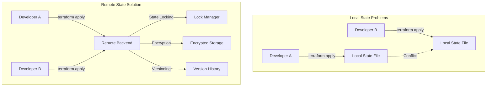
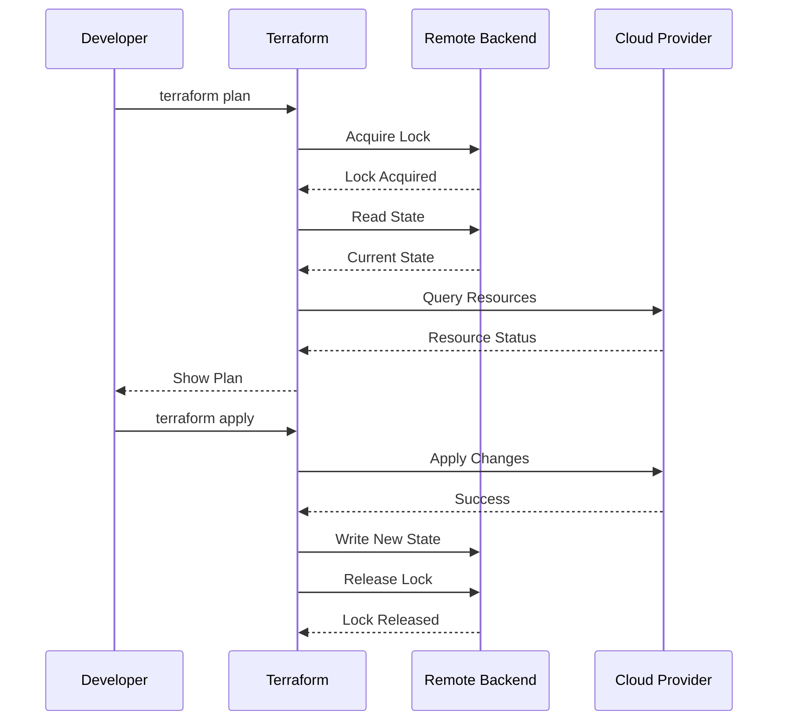
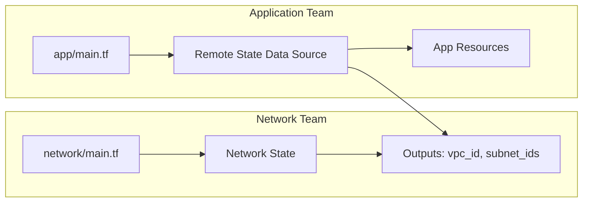
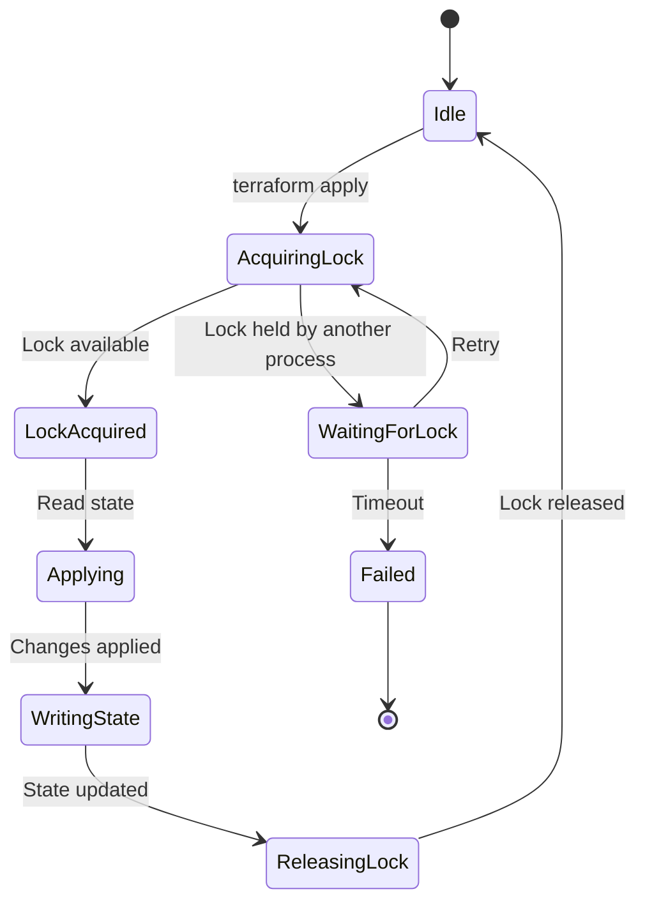
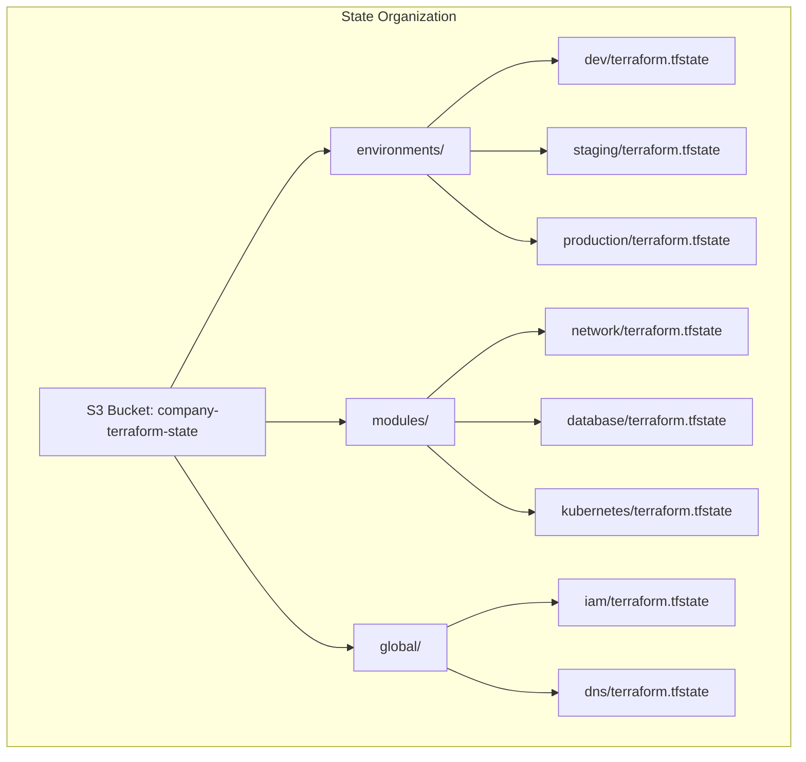

# How to Use Remote State Backends in Terraform

Author: [nawazdhandala](https://github.com/nawazdhandala)

Tags: Terraform, Remote State, Backend, IaC

Description: Learn how to configure and use remote state backends in Terraform for secure, collaborative infrastructure management. This comprehensive guide covers S3, Azure Blob, GCS, and Terraform Cloud backends with practical examples.

---

Terraform state is the single source of truth for your infrastructure. By default, Terraform stores state locally in a `terraform.tfstate` file, but this approach breaks down quickly when multiple engineers work on the same infrastructure or when you need disaster recovery capabilities.

Remote state backends solve these challenges by storing state in a centralized, secure location that supports locking, versioning, and team collaboration.

## Why Remote State Backends Matter

Local state files create several problems in production environments:

1. **No Collaboration**: Team members cannot work on infrastructure simultaneously
2. **No Locking**: Concurrent runs can corrupt state
3. **No Versioning**: Rolling back to previous states is impossible
4. **Security Risks**: State files contain sensitive data and can be accidentally committed to Git
5. **No Disaster Recovery**: Losing the state file means losing track of your infrastructure

Remote backends address all these concerns while enabling features like state locking and encryption at rest.



## Understanding Terraform State

Before diving into backends, let's understand what state contains and why it's critical.

Terraform state tracks the mapping between your configuration and real-world resources. When you run `terraform apply`, Terraform:

1. Reads the current state
2. Compares it with your configuration
3. Calculates required changes
4. Applies changes and updates state

The state file contains resource IDs, metadata, and often sensitive values like database passwords or API keys. This makes proper state management essential for both operations and security.



## Configuring AWS S3 Backend

Amazon S3 is one of the most popular backends for Terraform state. Combined with DynamoDB for state locking, it provides a robust, scalable solution.

### Prerequisites

Before configuring the S3 backend, you need to create the required AWS resources. This Terraform configuration creates an S3 bucket with versioning and encryption, plus a DynamoDB table for state locking.

```hcl
# bootstrap/main.tf
# This configuration creates the infrastructure needed for the S3 backend
# Run this once with local state, then migrate to the remote backend

terraform {
  required_providers {
    aws = {
      source  = "hashicorp/aws"
      version = "~> 5.0"
    }
  }
}

provider "aws" {
  region = "us-east-1"
}

# S3 bucket for storing Terraform state files
# Bucket names must be globally unique across all AWS accounts
resource "aws_s3_bucket" "terraform_state" {
  bucket = "my-company-terraform-state-prod"

  # Prevent accidental deletion of this critical bucket
  lifecycle {
    prevent_destroy = true
  }

  tags = {
    Name        = "Terraform State Bucket"
    Environment = "production"
    ManagedBy   = "terraform"
  }
}

# Enable versioning to maintain history of state files
# This allows rollback to previous states if needed
resource "aws_s3_bucket_versioning" "terraform_state" {
  bucket = aws_s3_bucket.terraform_state.id

  versioning_configuration {
    status = "Enabled"
  }
}

# Enable server-side encryption for state files at rest
# State files often contain sensitive data like passwords
resource "aws_s3_bucket_server_side_encryption_configuration" "terraform_state" {
  bucket = aws_s3_bucket.terraform_state.id

  rule {
    apply_server_side_encryption_by_default {
      sse_algorithm = "aws:kms"
    }
  }
}

# Block all public access to the state bucket
# State files should never be publicly accessible
resource "aws_s3_bucket_public_access_block" "terraform_state" {
  bucket = aws_s3_bucket.terraform_state.id

  block_public_acls       = true
  block_public_policy     = true
  ignore_public_acls      = true
  restrict_public_buckets = true
}

# DynamoDB table for state locking
# Prevents concurrent Terraform runs from corrupting state
resource "aws_dynamodb_table" "terraform_locks" {
  name         = "terraform-state-locks"
  billing_mode = "PAY_PER_REQUEST"
  hash_key     = "LockID"

  attribute {
    name = "LockID"
    type = "S"
  }

  tags = {
    Name        = "Terraform Lock Table"
    Environment = "production"
    ManagedBy   = "terraform"
  }
}

# Output the bucket name and DynamoDB table name for reference
output "state_bucket_name" {
  value       = aws_s3_bucket.terraform_state.id
  description = "Name of the S3 bucket for Terraform state"
}

output "dynamodb_table_name" {
  value       = aws_dynamodb_table.terraform_locks.name
  description = "Name of the DynamoDB table for state locking"
}
```

### Configuring the Backend

Once your S3 bucket and DynamoDB table exist, configure your Terraform projects to use them. The backend block goes in your main Terraform configuration.

```hcl
# main.tf
# Configure Terraform to use the S3 backend for state storage
# This replaces local state with centralized, locked state management

terraform {
  # Backend configuration cannot use variables
  # All values must be hardcoded or passed via -backend-config
  backend "s3" {
    bucket = "my-company-terraform-state-prod"
    key    = "environments/production/terraform.tfstate"
    region = "us-east-1"

    # DynamoDB table for state locking
    dynamodb_table = "terraform-state-locks"

    # Enable encryption at rest
    encrypt = true

    # Use a specific KMS key (optional, uses default if not specified)
    # kms_key_id = "alias/terraform-state-key"
  }

  required_providers {
    aws = {
      source  = "hashicorp/aws"
      version = "~> 5.0"
    }
  }
}

provider "aws" {
  region = "us-east-1"
}

# Your infrastructure resources go here
resource "aws_vpc" "main" {
  cidr_block = "10.0.0.0/16"

  tags = {
    Name = "production-vpc"
  }
}
```

### Migrating Existing State to S3

If you have existing infrastructure managed with local state, Terraform can migrate it to the remote backend. This process copies your state file to S3 without affecting your infrastructure.

```bash
# Initialize the backend and migrate state
# Terraform will detect the new backend configuration and prompt for migration
terraform init -migrate-state

# Verify the migration succeeded by listing resources
terraform state list

# The local terraform.tfstate file is no longer needed
# but keep a backup just in case
mv terraform.tfstate terraform.tfstate.backup
```

## Configuring Azure Blob Storage Backend

For teams using Azure, Blob Storage provides an excellent backend with built-in locking capabilities.

### Creating Azure Storage Resources

This configuration creates the necessary Azure resources for the Terraform backend. Azure provides native locking through Blob leases, so no separate lock resource is needed.

```hcl
# bootstrap/azure-backend.tf
# Create Azure resources for Terraform state storage

terraform {
  required_providers {
    azurerm = {
      source  = "hashicorp/azurerm"
      version = "~> 3.0"
    }
  }
}

provider "azurerm" {
  features {}
}

# Resource group to contain all state-related resources
resource "azurerm_resource_group" "terraform_state" {
  name     = "rg-terraform-state"
  location = "East US"

  tags = {
    environment = "infrastructure"
    purpose     = "terraform-state"
  }
}

# Storage account for state files
# Account names must be globally unique and lowercase
resource "azurerm_storage_account" "terraform_state" {
  name                     = "stterraformstateprod"
  resource_group_name      = azurerm_resource_group.terraform_state.name
  location                 = azurerm_resource_group.terraform_state.location
  account_tier             = "Standard"
  account_replication_type = "GRS"

  # Enable encryption and secure transfer
  min_tls_version               = "TLS1_2"
  enable_https_traffic_only     = true

  blob_properties {
    versioning_enabled = true

    # Delete old versions after 90 days
    delete_retention_policy {
      days = 90
    }
  }

  tags = {
    environment = "infrastructure"
    purpose     = "terraform-state"
  }
}

# Container to hold state files
resource "azurerm_storage_container" "terraform_state" {
  name                  = "tfstate"
  storage_account_name  = azurerm_storage_account.terraform_state.name
  container_access_type = "private"
}

# Output values needed for backend configuration
output "storage_account_name" {
  value = azurerm_storage_account.terraform_state.name
}

output "container_name" {
  value = azurerm_storage_container.terraform_state.name
}

output "resource_group_name" {
  value = azurerm_resource_group.terraform_state.name
}
```

### Configuring the Azure Backend

Configure your Terraform projects to use Azure Blob Storage. Azure handles state locking automatically through Blob leases.

```hcl
# main.tf
# Configure Terraform to use Azure Blob Storage backend

terraform {
  backend "azurerm" {
    resource_group_name  = "rg-terraform-state"
    storage_account_name = "stterraformstateprod"
    container_name       = "tfstate"
    key                  = "production/terraform.tfstate"

    # Optional: Use a specific Azure subscription
    # subscription_id = "00000000-0000-0000-0000-000000000000"
  }

  required_providers {
    azurerm = {
      source  = "hashicorp/azurerm"
      version = "~> 3.0"
    }
  }
}

provider "azurerm" {
  features {}
}

# Your Azure resources go here
resource "azurerm_resource_group" "main" {
  name     = "rg-production"
  location = "East US"
}
```

## Configuring Google Cloud Storage Backend

Google Cloud Storage (GCS) provides a simple yet powerful backend for Terraform state with built-in versioning and locking.

### Creating GCS Resources

Create the GCS bucket with appropriate settings for state storage. GCS handles locking natively through object versioning.

```hcl
# bootstrap/gcs-backend.tf
# Create GCS bucket for Terraform state

terraform {
  required_providers {
    google = {
      source  = "hashicorp/google"
      version = "~> 5.0"
    }
  }
}

provider "google" {
  project = "my-gcp-project"
  region  = "us-central1"
}

# GCS bucket for state storage
# Bucket names must be globally unique
resource "google_storage_bucket" "terraform_state" {
  name     = "my-company-terraform-state"
  location = "US"

  # Enable versioning for state history
  versioning {
    enabled = true
  }

  # Prevent accidental deletion
  lifecycle {
    prevent_destroy = true
  }

  # Uniform bucket-level access for better security
  uniform_bucket_level_access = true

  # Lifecycle rule to clean up old versions
  lifecycle_rule {
    condition {
      num_newer_versions = 10
      with_state         = "ARCHIVED"
    }
    action {
      type = "Delete"
    }
  }

  labels = {
    environment = "infrastructure"
    purpose     = "terraform-state"
  }
}

output "bucket_name" {
  value = google_storage_bucket.terraform_state.name
}
```

### Configuring the GCS Backend

Configure your Terraform configuration to use GCS for state storage.

```hcl
# main.tf
# Configure Terraform to use GCS backend

terraform {
  backend "gcs" {
    bucket = "my-company-terraform-state"
    prefix = "terraform/production"
  }

  required_providers {
    google = {
      source  = "hashicorp/google"
      version = "~> 5.0"
    }
  }
}

provider "google" {
  project = "my-gcp-project"
  region  = "us-central1"
}

# Your GCP resources go here
resource "google_compute_network" "main" {
  name                    = "production-network"
  auto_create_subnetworks = false
}
```

## Using Terraform Cloud Backend

Terraform Cloud (and Terraform Enterprise) provides a managed backend with additional features like remote execution, policy enforcement, and a web UI.

### Configuring Terraform Cloud

Terraform Cloud backend configuration is straightforward. The platform handles state storage, locking, versioning, and access control.

```hcl
# main.tf
# Configure Terraform to use Terraform Cloud backend

terraform {
  cloud {
    organization = "my-organization"

    workspaces {
      name = "production-infrastructure"
    }
  }

  required_providers {
    aws = {
      source  = "hashicorp/aws"
      version = "~> 5.0"
    }
  }
}

# Provider configuration
# Credentials are managed in Terraform Cloud workspace settings
provider "aws" {
  region = "us-east-1"
}

# Your infrastructure resources
resource "aws_instance" "web" {
  ami           = "ami-0c55b159cbfafe1f0"
  instance_type = "t3.micro"

  tags = {
    Name = "web-server"
  }
}
```

### Authenticating with Terraform Cloud

Before using Terraform Cloud, authenticate using the CLI login command. This stores your API token locally for subsequent operations.

```bash
# Login to Terraform Cloud
# This opens a browser to generate an API token
terraform login

# Initialize the workspace
# Terraform Cloud creates the workspace if it doesn't exist
terraform init

# Run plan remotely
terraform plan
```

## Partial Backend Configuration

For flexibility across environments, use partial backend configuration. This lets you specify some values in code and others at runtime.

### Backend Configuration File

Create a separate file for backend configuration values. This file is not committed to version control and can vary by environment.

```hcl
# backend.hcl
# Partial backend configuration for S3
# Pass this file to terraform init with -backend-config

bucket         = "my-company-terraform-state-prod"
region         = "us-east-1"
dynamodb_table = "terraform-state-locks"
encrypt        = true
```

### Main Configuration with Partial Backend

The main configuration specifies only the state file path, allowing the bucket and other settings to be provided at runtime.

```hcl
# main.tf
# Backend with partial configuration
# Other settings provided via -backend-config

terraform {
  backend "s3" {
    # Only the key is specified here
    # Other values come from backend.hcl or CLI arguments
    key = "environments/production/terraform.tfstate"
  }

  required_providers {
    aws = {
      source  = "hashicorp/aws"
      version = "~> 5.0"
    }
  }
}
```

### Initializing with Partial Configuration

Initialize Terraform by providing the backend configuration file. This approach works well in CI/CD pipelines where environment-specific values come from secrets.

```bash
# Initialize with backend configuration file
terraform init -backend-config=backend.hcl

# Or provide values directly via CLI
terraform init \
  -backend-config="bucket=my-company-terraform-state-prod" \
  -backend-config="region=us-east-1" \
  -backend-config="dynamodb_table=terraform-state-locks" \
  -backend-config="encrypt=true"

# For CI/CD, use environment variables
terraform init \
  -backend-config="bucket=${TF_STATE_BUCKET}" \
  -backend-config="region=${AWS_REGION}" \
  -backend-config="dynamodb_table=${TF_LOCK_TABLE}"
```

## Accessing Remote State Data

Terraform allows you to read state from other configurations using the `terraform_remote_state` data source. This enables sharing outputs between separate Terraform configurations.



### Reading Remote State

Use the `terraform_remote_state` data source to access outputs from another Terraform configuration. This creates a dependency between configurations while maintaining separation.

```hcl
# app/main.tf
# Read network configuration from another Terraform state
# This allows the app team to deploy into the network team's VPC

terraform {
  backend "s3" {
    bucket         = "my-company-terraform-state-prod"
    key            = "environments/production/app/terraform.tfstate"
    region         = "us-east-1"
    dynamodb_table = "terraform-state-locks"
    encrypt        = true
  }

  required_providers {
    aws = {
      source  = "hashicorp/aws"
      version = "~> 5.0"
    }
  }
}

provider "aws" {
  region = "us-east-1"
}

# Data source to read outputs from the network team's state
data "terraform_remote_state" "network" {
  backend = "s3"

  config = {
    bucket = "my-company-terraform-state-prod"
    key    = "environments/production/network/terraform.tfstate"
    region = "us-east-1"
  }
}

# Use outputs from the network state
resource "aws_instance" "web" {
  ami           = "ami-0c55b159cbfafe1f0"
  instance_type = "t3.micro"

  # Reference the VPC ID from the network state
  subnet_id = data.terraform_remote_state.network.outputs.public_subnet_ids[0]

  vpc_security_group_ids = [
    data.terraform_remote_state.network.outputs.web_security_group_id
  ]

  tags = {
    Name = "web-server"
  }
}
```

### Network Configuration with Outputs

The network configuration must expose outputs that other configurations can consume.

```hcl
# network/main.tf
# Network infrastructure with outputs for other teams

terraform {
  backend "s3" {
    bucket         = "my-company-terraform-state-prod"
    key            = "environments/production/network/terraform.tfstate"
    region         = "us-east-1"
    dynamodb_table = "terraform-state-locks"
    encrypt        = true
  }

  required_providers {
    aws = {
      source  = "hashicorp/aws"
      version = "~> 5.0"
    }
  }
}

provider "aws" {
  region = "us-east-1"
}

resource "aws_vpc" "main" {
  cidr_block           = "10.0.0.0/16"
  enable_dns_hostnames = true

  tags = {
    Name = "production-vpc"
  }
}

resource "aws_subnet" "public" {
  count = 3

  vpc_id            = aws_vpc.main.id
  cidr_block        = "10.0.${count.index + 1}.0/24"
  availability_zone = data.aws_availability_zones.available.names[count.index]

  tags = {
    Name = "public-subnet-${count.index + 1}"
  }
}

resource "aws_security_group" "web" {
  name        = "web-security-group"
  description = "Security group for web servers"
  vpc_id      = aws_vpc.main.id

  ingress {
    from_port   = 80
    to_port     = 80
    protocol    = "tcp"
    cidr_blocks = ["0.0.0.0/0"]
  }

  ingress {
    from_port   = 443
    to_port     = 443
    protocol    = "tcp"
    cidr_blocks = ["0.0.0.0/0"]
  }

  egress {
    from_port   = 0
    to_port     = 0
    protocol    = "-1"
    cidr_blocks = ["0.0.0.0/0"]
  }
}

data "aws_availability_zones" "available" {
  state = "available"
}

# Outputs consumed by other Terraform configurations
output "vpc_id" {
  value       = aws_vpc.main.id
  description = "ID of the production VPC"
}

output "public_subnet_ids" {
  value       = aws_subnet.public[*].id
  description = "IDs of public subnets"
}

output "web_security_group_id" {
  value       = aws_security_group.web.id
  description = "ID of the web security group"
}
```

## State Locking Best Practices

State locking prevents concurrent operations that could corrupt your state. Understanding how locking works helps you handle lock-related issues.

### How State Locking Works

When Terraform starts an operation that could modify state, it acquires a lock. Other Terraform processes must wait or fail until the lock is released.



### Handling Lock Timeouts

Sometimes locks are not released properly due to crashes or network issues. Use the force-unlock command carefully to release stuck locks.

```bash
# View lock information
terraform plan

# If a lock is stuck, you can force unlock
# WARNING: Only do this if you are certain no other process is running
terraform force-unlock LOCK_ID

# The LOCK_ID is displayed in the error message when a lock is held
# Example output when lock is held:
# Error: Error locking state: Error acquiring the state lock
# Lock Info:
#   ID:        a1b2c3d4-e5f6-7890-abcd-ef1234567890
#   Path:      my-company-terraform-state-prod/environments/production/terraform.tfstate
#   Operation: OperationTypeApply
#   Who:       user@hostname
#   Version:   1.5.0
#   Created:   2024-01-15 10:30:00.000000000 +0000 UTC
```

### Disabling Locking (Not Recommended)

In rare cases, you might need to disable locking. This should only be done for read-only operations.

```bash
# Disable locking for plan (read-only, generally safe)
terraform plan -lock=false

# NEVER disable locking for apply unless absolutely necessary
# This can lead to state corruption
terraform apply -lock=false  # DANGER: Do not do this
```

## Security Best Practices

Securing your Terraform state is critical because it contains sensitive information about your infrastructure.

### Encrypting State at Rest

Always enable encryption for state storage. Each cloud provider offers different encryption options.

```hcl
# AWS S3 with KMS encryption
terraform {
  backend "s3" {
    bucket         = "my-company-terraform-state-prod"
    key            = "production/terraform.tfstate"
    region         = "us-east-1"
    encrypt        = true
    kms_key_id     = "arn:aws:kms:us-east-1:123456789012:key/12345678-1234-1234-1234-123456789012"
    dynamodb_table = "terraform-state-locks"
  }
}
```

### IAM Policy for S3 Backend

Create a minimal IAM policy that grants only the permissions needed for Terraform state operations.

```hcl
# iam.tf
# IAM policy for Terraform state access
# Apply principle of least privilege

data "aws_iam_policy_document" "terraform_state" {
  # S3 bucket permissions
  statement {
    sid    = "ListBucket"
    effect = "Allow"
    actions = [
      "s3:ListBucket"
    ]
    resources = [
      "arn:aws:s3:::my-company-terraform-state-prod"
    ]
  }

  statement {
    sid    = "ReadWriteState"
    effect = "Allow"
    actions = [
      "s3:GetObject",
      "s3:PutObject",
      "s3:DeleteObject"
    ]
    resources = [
      "arn:aws:s3:::my-company-terraform-state-prod/*"
    ]
  }

  # DynamoDB permissions for locking
  statement {
    sid    = "StateLocking"
    effect = "Allow"
    actions = [
      "dynamodb:GetItem",
      "dynamodb:PutItem",
      "dynamodb:DeleteItem"
    ]
    resources = [
      "arn:aws:dynamodb:us-east-1:123456789012:table/terraform-state-locks"
    ]
  }

  # KMS permissions for encryption
  statement {
    sid    = "KMSEncryption"
    effect = "Allow"
    actions = [
      "kms:Encrypt",
      "kms:Decrypt",
      "kms:GenerateDataKey"
    ]
    resources = [
      "arn:aws:kms:us-east-1:123456789012:key/12345678-1234-1234-1234-123456789012"
    ]
  }
}

resource "aws_iam_policy" "terraform_state" {
  name        = "TerraformStateAccess"
  description = "Policy for Terraform state backend access"
  policy      = data.aws_iam_policy_document.terraform_state.json
}
```

### Protecting Sensitive State Data

Use the `sensitive` attribute on outputs and consider using external secret management for highly sensitive values.

```hcl
# Mark outputs as sensitive to prevent accidental exposure
output "database_password" {
  value       = random_password.db_password.result
  sensitive   = true
  description = "Database password (sensitive)"
}

# Use data sources for existing secrets instead of storing in state
data "aws_secretsmanager_secret_version" "db_password" {
  secret_id = "production/database/password"
}

resource "aws_db_instance" "main" {
  # ... other configuration
  password = data.aws_secretsmanager_secret_version.db_password.secret_string
}
```

## Organizing State for Multiple Environments

Structure your state files to support multiple environments while maintaining clear separation and easy management.



### Environment-Specific Backend Configuration

Use workspaces or separate state files for each environment. Here is an example using separate state files with a shared module pattern.

```hcl
# environments/production/main.tf
# Production environment configuration

terraform {
  backend "s3" {
    bucket         = "my-company-terraform-state-prod"
    key            = "environments/production/terraform.tfstate"
    region         = "us-east-1"
    dynamodb_table = "terraform-state-locks"
    encrypt        = true
  }
}

module "infrastructure" {
  source = "../../modules/infrastructure"

  environment = "production"
  vpc_cidr    = "10.0.0.0/16"

  instance_type = "t3.large"
  min_instances = 3
  max_instances = 10
}
```

```hcl
# environments/staging/main.tf
# Staging environment configuration

terraform {
  backend "s3" {
    bucket         = "my-company-terraform-state-prod"
    key            = "environments/staging/terraform.tfstate"
    region         = "us-east-1"
    dynamodb_table = "terraform-state-locks"
    encrypt        = true
  }
}

module "infrastructure" {
  source = "../../modules/infrastructure"

  environment = "staging"
  vpc_cidr    = "10.1.0.0/16"

  instance_type = "t3.medium"
  min_instances = 1
  max_instances = 3
}
```

## Troubleshooting Common Issues

### State Lock Errors

When you see lock errors, first verify no other processes are running before force-unlocking.

```bash
# Check who holds the lock (information is in the error message)
# Common causes:
# - Another team member running Terraform
# - CI/CD pipeline in progress
# - Previous run crashed without releasing lock

# Verify no other process is running
ps aux | grep terraform

# If certain no process is running, force unlock
terraform force-unlock LOCK_ID
```

### State Corruption Recovery

If state becomes corrupted, you can restore from a previous version using bucket versioning.

```bash
# List state file versions (AWS S3)
aws s3api list-object-versions \
  --bucket my-company-terraform-state-prod \
  --prefix environments/production/terraform.tfstate

# Download a previous version
aws s3api get-object \
  --bucket my-company-terraform-state-prod \
  --key environments/production/terraform.tfstate \
  --version-id "versionId123" \
  terraform.tfstate.backup

# Restore by uploading the backup
aws s3 cp terraform.tfstate.backup \
  s3://my-company-terraform-state-prod/environments/production/terraform.tfstate
```

### Backend Migration

Moving state between backends requires careful planning to avoid losing state.

```bash
# Step 1: Pull current state locally
terraform state pull > terraform.tfstate.backup

# Step 2: Update backend configuration in your .tf files

# Step 3: Reinitialize with migration
terraform init -migrate-state

# Step 4: Verify state was migrated correctly
terraform state list
terraform plan  # Should show no changes if migration was successful
```

## Summary

Remote state backends are essential for production Terraform deployments. They provide:

| Feature | Benefit |
|---------|---------|
| **Centralized Storage** | Single source of truth for infrastructure state |
| **State Locking** | Prevents concurrent modifications and corruption |
| **Versioning** | Enables rollback and audit trails |
| **Encryption** | Protects sensitive data in state files |
| **Team Collaboration** | Multiple engineers can work safely |
| **Disaster Recovery** | State survives local machine failures |

Choose your backend based on your cloud provider and team requirements. S3, Azure Blob Storage, and GCS all provide robust solutions with native locking support. For teams wanting a managed experience, Terraform Cloud adds features like remote execution and policy enforcement.

Remember these key principles:

1. Always enable state locking to prevent corruption
2. Enable versioning for disaster recovery
3. Encrypt state at rest and in transit
4. Use minimal IAM permissions for state access
5. Organize state files by environment and component
6. Never commit state files to version control
7. Test state migration in a non-production environment first

With proper remote state configuration, your team can collaborate safely on infrastructure changes while maintaining security and reliability.
