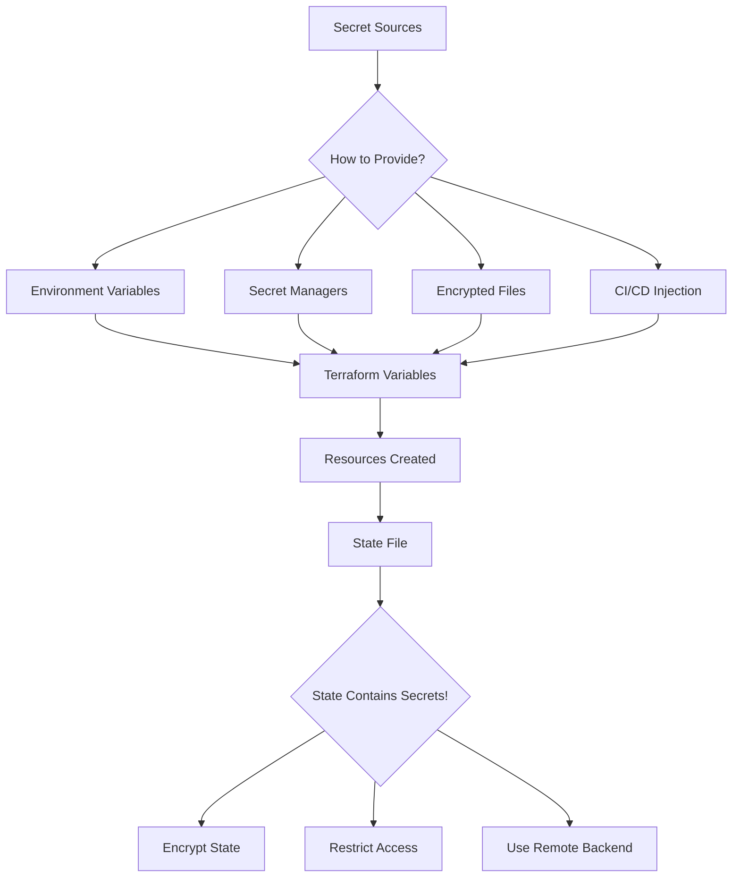
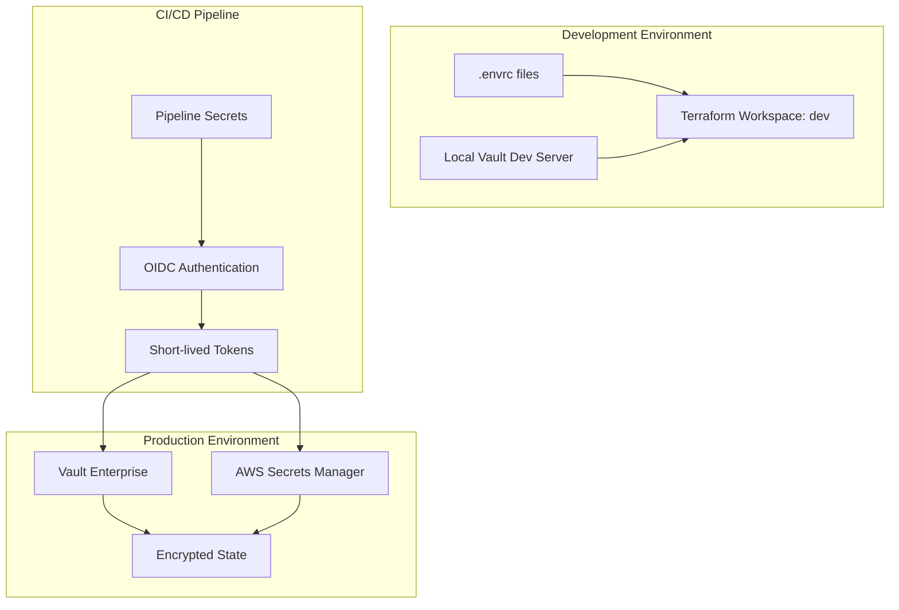

# How to Handle Secrets in Terraform

Author: [nawazdhandala](https://www.github.com/nawazdhandala)

Tags: Terraform, Secrets, Security, IaC, DevOps, HashiCorp Vault, AWS Secrets Manager

Description: Learn best practices for managing secrets in Terraform, including integration with secret managers like HashiCorp Vault, AWS Secrets Manager, and Azure Key Vault, plus techniques for secure variable handling and preventing exposure.

---

Managing secrets in infrastructure as code presents unique challenges. Terraform configurations often need access to sensitive data like database passwords, API keys, and certificates. Hardcoding these values or storing them in plain text creates security vulnerabilities. This guide covers comprehensive strategies for handling secrets securely in Terraform.

## The Challenge of Secrets in IaC

When working with Terraform, you encounter secrets in several contexts:

- Database credentials for RDS, Cloud SQL, or Azure SQL
- API keys for third-party services
- SSL/TLS certificates and private keys
- Service account credentials
- Encryption keys
- SSH keys for provisioning

The challenge is providing these secrets to Terraform without exposing them in version control, logs, or state files.



## Method 1: Environment Variables

The simplest approach is using environment variables. Terraform automatically reads variables prefixed with `TF_VAR_`.

### Basic Environment Variable Usage

Set up variables in your Terraform configuration that will receive secret values from the environment. The sensitive flag prevents values from appearing in logs.

```hcl
# variables.tf
variable "database_password" {
  description = "Password for the production database"
  type        = string
  sensitive   = true
}

variable "api_key" {
  description = "API key for external service integration"
  type        = string
  sensitive   = true
}
```

Export the environment variables before running Terraform. The TF_VAR prefix tells Terraform to map these to the corresponding variables.

```bash
# Set environment variables before running terraform
export TF_VAR_database_password="your-secure-password"
export TF_VAR_api_key="your-api-key"

# Now run terraform
terraform plan
terraform apply
```

### Using .env Files with direnv

For local development, direnv provides automatic environment loading. Create a .envrc file that will be loaded when you enter the directory.

```bash
# .envrc (add to .gitignore!)
export TF_VAR_database_password="dev-password"
export TF_VAR_api_key="dev-api-key"
```

Configure direnv to allow the file. This security measure prevents automatic execution of untrusted .envrc files.

```bash
# Allow direnv for this directory
direnv allow .
```

Add protective entries to your .gitignore to prevent accidental commits of sensitive files.

```gitignore
# .gitignore
.envrc
*.tfvars
!example.tfvars
```

## Method 2: HashiCorp Vault Integration

HashiCorp Vault is the gold standard for secrets management. It provides dynamic secrets, encryption as a service, and detailed audit logs.

### Configuring the Vault Provider

First, configure the Vault provider with your server address. The provider will use the VAULT_TOKEN environment variable for authentication.

```hcl
# providers.tf
provider "vault" {
  address = "https://vault.example.com:8200"
  # Token can be set via VAULT_TOKEN environment variable
}
```

### Reading Static Secrets from Vault

Use data sources to fetch secrets from Vault's KV secrets engine. The path corresponds to where you stored the secret in Vault.

```hcl
# Read a secret from Vault's KV v2 secrets engine
data "vault_kv_secret_v2" "database" {
  mount = "secret"
  name  = "production/database"
}

# Use the secret values in your resources
resource "aws_db_instance" "main" {
  identifier           = "production-db"
  engine               = "postgres"
  engine_version       = "15.4"
  instance_class       = "db.t3.medium"
  allocated_storage    = 100

  db_name              = "application"
  username             = data.vault_kv_secret_v2.database.data["username"]
  password             = data.vault_kv_secret_v2.database.data["password"]

  skip_final_snapshot  = false
  final_snapshot_identifier = "production-db-final"
}
```

### Dynamic Database Credentials with Vault

Vault can generate short-lived database credentials on demand. This eliminates long-lived passwords and provides automatic rotation.

```hcl
# Configure Vault to generate dynamic PostgreSQL credentials
# First, set up the database secrets engine in Vault

# Request dynamic credentials from Vault
data "vault_database_credentials" "app" {
  backend = "database"
  role    = "app-readonly"
}

# Use the dynamic credentials
# These expire automatically based on Vault's TTL settings
resource "kubernetes_secret" "db_credentials" {
  metadata {
    name      = "db-credentials"
    namespace = "application"
  }

  data = {
    username = data.vault_database_credentials.app.username
    password = data.vault_database_credentials.app.password
  }
}
```

### Vault AWS Secrets Engine

Vault can generate temporary AWS credentials, eliminating the need for long-lived access keys.

```hcl
# Request dynamic AWS credentials from Vault
data "vault_aws_access_credentials" "deploy" {
  backend = "aws"
  role    = "deploy-role"
  type    = "sts"
}

# Use dynamic credentials for AWS provider
provider "aws" {
  region     = "us-east-1"
  access_key = data.vault_aws_access_credentials.deploy.access_key
  secret_key = data.vault_aws_access_credentials.deploy.secret_key
  token      = data.vault_aws_access_credentials.deploy.security_token
}
```

## Method 3: AWS Secrets Manager

AWS Secrets Manager provides native secret storage with automatic rotation capabilities.

### Reading Secrets from AWS Secrets Manager

Fetch existing secrets using data sources. The secret must already exist in Secrets Manager before Terraform can read it.

```hcl
# Retrieve an existing secret from AWS Secrets Manager
data "aws_secretsmanager_secret" "database" {
  name = "production/database/credentials"
}

data "aws_secretsmanager_secret_version" "database" {
  secret_id = data.aws_secretsmanager_secret.database.id
}

# Parse the JSON secret value
locals {
  db_credentials = jsondecode(data.aws_secretsmanager_secret_version.database.secret_string)
}

# Use the parsed credentials
resource "aws_db_instance" "main" {
  identifier        = "production-db"
  engine            = "postgres"
  instance_class    = "db.t3.medium"
  allocated_storage = 100

  username = local.db_credentials["username"]
  password = local.db_credentials["password"]

  skip_final_snapshot = false
}
```

### Creating Secrets with Terraform

Create secrets in AWS Secrets Manager and store generated values. Use the random provider to generate secure passwords.

```hcl
# Generate a random password
resource "random_password" "database" {
  length           = 32
  special          = true
  override_special = "!#$%&*()-_=+[]{}|:?"
}

# Create the secret container
resource "aws_secretsmanager_secret" "database" {
  name        = "production/database/credentials"
  description = "Production database credentials"

  tags = {
    Environment = "production"
    ManagedBy   = "terraform"
  }
}

# Store the secret value
resource "aws_secretsmanager_secret_version" "database" {
  secret_id = aws_secretsmanager_secret.database.id
  secret_string = jsonencode({
    username = "admin"
    password = random_password.database.result
    host     = aws_db_instance.main.endpoint
    port     = 5432
    dbname   = "application"
  })
}
```

### RDS Managed Passwords

AWS RDS can manage passwords directly in Secrets Manager, avoiding Terraform state exposure entirely.

```hcl
# Let RDS manage the master password in Secrets Manager
resource "aws_db_instance" "main" {
  identifier        = "production-db"
  engine            = "postgres"
  engine_version    = "15.4"
  instance_class    = "db.t3.medium"
  allocated_storage = 100

  db_name  = "application"
  username = "admin"

  # RDS creates and manages the password in Secrets Manager
  manage_master_user_password   = true
  master_user_secret_kms_key_id = aws_kms_key.rds.arn

  skip_final_snapshot = false
}

# KMS key for encrypting the managed secret
resource "aws_kms_key" "rds" {
  description             = "KMS key for RDS master password"
  deletion_window_in_days = 7
  enable_key_rotation     = true
}

# Output the secret ARN for application configuration
output "database_secret_arn" {
  description = "ARN of the secret containing database credentials"
  value       = aws_db_instance.main.master_user_secret[0].secret_arn
}
```

## Method 4: Azure Key Vault

Azure Key Vault provides secure secret storage for Azure deployments.

### Reading Secrets from Key Vault

Configure the Key Vault data source to read existing secrets. The Key Vault must grant your service principal access.

```hcl
# Reference an existing Key Vault
data "azurerm_key_vault" "main" {
  name                = "production-keyvault"
  resource_group_name = "security-rg"
}

# Read a secret from Key Vault
data "azurerm_key_vault_secret" "database_password" {
  name         = "database-admin-password"
  key_vault_id = data.azurerm_key_vault.main.id
}

# Use the secret in your resources
resource "azurerm_mssql_server" "main" {
  name                         = "production-sql-server"
  resource_group_name          = azurerm_resource_group.main.name
  location                     = azurerm_resource_group.main.location
  version                      = "12.0"
  administrator_login          = "sqladmin"
  administrator_login_password = data.azurerm_key_vault_secret.database_password.value

  minimum_tls_version = "1.2"
}
```

### Creating Key Vault Secrets

Store generated secrets in Key Vault with proper access policies.

```hcl
# Create a Key Vault for storing secrets
resource "azurerm_key_vault" "main" {
  name                = "app-secrets-${var.environment}"
  location            = azurerm_resource_group.main.location
  resource_group_name = azurerm_resource_group.main.name
  tenant_id           = data.azurerm_client_config.current.tenant_id
  sku_name            = "standard"

  # Enable soft delete for recovery
  soft_delete_retention_days = 7
  purge_protection_enabled   = true

  # Allow the current service principal to manage secrets
  access_policy {
    tenant_id = data.azurerm_client_config.current.tenant_id
    object_id = data.azurerm_client_config.current.object_id

    secret_permissions = [
      "Get",
      "List",
      "Set",
      "Delete",
      "Recover",
      "Backup",
      "Restore"
    ]
  }
}

# Generate and store a secret
resource "random_password" "api_key" {
  length  = 64
  special = false
}

resource "azurerm_key_vault_secret" "api_key" {
  name         = "external-api-key"
  value        = random_password.api_key.result
  key_vault_id = azurerm_key_vault.main.id

  content_type = "password"

  tags = {
    Environment = var.environment
    Purpose     = "External API authentication"
  }
}
```

## Method 5: Google Cloud Secret Manager

GCP Secret Manager integrates with IAM for fine-grained access control.

### Reading GCP Secrets

Fetch secrets from Google Cloud Secret Manager using data sources.

```hcl
# Read a secret from GCP Secret Manager
data "google_secret_manager_secret_version" "database" {
  secret = "production-database-password"
}

# Use in Cloud SQL instance
resource "google_sql_database_instance" "main" {
  name             = "production-instance"
  database_version = "POSTGRES_15"
  region           = "us-central1"

  settings {
    tier = "db-custom-2-4096"

    ip_configuration {
      ipv4_enabled = false
      private_network = google_compute_network.main.id
    }
  }

  deletion_protection = true
}

resource "google_sql_user" "admin" {
  name     = "admin"
  instance = google_sql_database_instance.main.name
  password = data.google_secret_manager_secret_version.database.secret_data
}
```

### Creating GCP Secrets

Create secrets and grant appropriate IAM permissions.

```hcl
# Create a secret in GCP Secret Manager
resource "google_secret_manager_secret" "api_key" {
  secret_id = "external-api-key"

  replication {
    auto {}
  }

  labels = {
    environment = var.environment
    managed_by  = "terraform"
  }
}

# Add a secret version with the actual value
resource "google_secret_manager_secret_version" "api_key" {
  secret      = google_secret_manager_secret.api_key.id
  secret_data = random_password.api_key.result
}

# Grant the application service account access to read the secret
resource "google_secret_manager_secret_iam_member" "app_access" {
  secret_id = google_secret_manager_secret.api_key.id
  role      = "roles/secretmanager.secretAccessor"
  member    = "serviceAccount:${google_service_account.app.email}"
}
```

## Method 6: SOPS for Encrypted Files

Mozilla SOPS encrypts files while keeping keys visible, making diffs and code review possible.

### Setting Up SOPS with AWS KMS

Configure SOPS to use AWS KMS for encryption. The .sops.yaml file defines encryption rules.

```yaml
# .sops.yaml
creation_rules:
  - path_regex: \.enc\.json$
    kms: arn:aws:kms:us-east-1:123456789012:key/12345678-1234-1234-1234-123456789012
  - path_regex: \.enc\.yaml$
    kms: arn:aws:kms:us-east-1:123456789012:key/12345678-1234-1234-1234-123456789012
```

Create and encrypt a secrets file. SOPS encrypts values while leaving keys readable.

```bash
# Create a secrets file
cat > secrets.enc.json << 'EOF'
{
    "database_password": "super-secret-password",
    "api_key": "sk-1234567890abcdef"
}
EOF

# Encrypt it with SOPS
sops --encrypt --in-place secrets.enc.json
```

### Using SOPS Secrets in Terraform

Use the external data source or SOPS provider to decrypt secrets at runtime.

```hcl
# Option 1: Using external data source
data "external" "secrets" {
  program = ["sops", "-d", "--output-type", "json", "${path.module}/secrets.enc.json"]
}

resource "aws_db_instance" "main" {
  identifier        = "production-db"
  engine            = "postgres"
  instance_class    = "db.t3.medium"
  allocated_storage = 100

  username = "admin"
  password = data.external.secrets.result["database_password"]

  skip_final_snapshot = false
}
```

Use the dedicated SOPS provider for cleaner integration.

```hcl
# Option 2: Using SOPS provider
terraform {
  required_providers {
    sops = {
      source  = "carlpett/sops"
      version = "~> 1.0"
    }
  }
}

data "sops_file" "secrets" {
  source_file = "${path.module}/secrets.enc.json"
}

resource "aws_db_instance" "main" {
  identifier        = "production-db"
  engine            = "postgres"
  instance_class    = "db.t3.medium"
  allocated_storage = 100

  username = "admin"
  password = data.sops_file.secrets.data["database_password"]

  skip_final_snapshot = false
}
```

## Method 7: CI/CD Pipeline Injection

Inject secrets through your CI/CD system for automated deployments.

### GitHub Actions Example

Configure secrets in GitHub and reference them in your workflow. Secrets are masked in logs automatically.

```yaml
# .github/workflows/terraform.yml
name: Terraform Deploy

on:
  push:
    branches: [main]

env:
  TF_VAR_database_password: ${{ secrets.DATABASE_PASSWORD }}
  TF_VAR_api_key: ${{ secrets.API_KEY }}
  AWS_ACCESS_KEY_ID: ${{ secrets.AWS_ACCESS_KEY_ID }}
  AWS_SECRET_ACCESS_KEY: ${{ secrets.AWS_SECRET_ACCESS_KEY }}

jobs:
  deploy:
    runs-on: ubuntu-latest
    steps:
      - uses: actions/checkout@v4

      - name: Setup Terraform
        uses: hashicorp/setup-terraform@v3
        with:
          terraform_version: 1.7.0

      - name: Terraform Init
        run: terraform init

      - name: Terraform Plan
        run: terraform plan -out=tfplan

      - name: Terraform Apply
        if: github.ref == 'refs/heads/main'
        run: terraform apply -auto-approve tfplan
```

### GitLab CI Example

GitLab CI provides masked and protected variables for sensitive data.

```yaml
# .gitlab-ci.yml
variables:
  TF_ROOT: ${CI_PROJECT_DIR}/terraform

stages:
  - validate
  - plan
  - apply

.terraform-base:
  image: hashicorp/terraform:1.7
  before_script:
    - cd ${TF_ROOT}
    - terraform init

validate:
  extends: .terraform-base
  stage: validate
  script:
    - terraform validate

plan:
  extends: .terraform-base
  stage: plan
  script:
    - terraform plan -out=plan.tfplan
  artifacts:
    paths:
      - ${TF_ROOT}/plan.tfplan
    expire_in: 1 week

apply:
  extends: .terraform-base
  stage: apply
  script:
    - terraform apply -auto-approve plan.tfplan
  dependencies:
    - plan
  only:
    - main
  when: manual
```

## Protecting Terraform State

Regardless of how you inject secrets, they often end up in state. Protect your state files appropriately.

### Encrypted S3 Backend

Configure S3 with server-side encryption and strict access controls.

```hcl
# backend.tf
terraform {
  backend "s3" {
    bucket         = "company-terraform-state"
    key            = "production/infrastructure.tfstate"
    region         = "us-east-1"

    # Enable encryption at rest
    encrypt        = true
    kms_key_id     = "alias/terraform-state"

    # Enable state locking
    dynamodb_table = "terraform-locks"

    # Require specific IAM role
    role_arn       = "arn:aws:iam::123456789012:role/TerraformStateAccess"
  }
}
```

### State Bucket Security

Create the state bucket with proper security controls.

```hcl
# state-infrastructure/main.tf
resource "aws_s3_bucket" "terraform_state" {
  bucket = "company-terraform-state"

  tags = {
    Purpose   = "Terraform State Storage"
    ManagedBy = "terraform"
  }
}

# Block all public access
resource "aws_s3_bucket_public_access_block" "terraform_state" {
  bucket = aws_s3_bucket.terraform_state.id

  block_public_acls       = true
  block_public_policy     = true
  ignore_public_acls      = true
  restrict_public_buckets = true
}

# Enable versioning for state recovery
resource "aws_s3_bucket_versioning" "terraform_state" {
  bucket = aws_s3_bucket.terraform_state.id

  versioning_configuration {
    status = "Enabled"
  }
}

# Server-side encryption with KMS
resource "aws_s3_bucket_server_side_encryption_configuration" "terraform_state" {
  bucket = aws_s3_bucket.terraform_state.id

  rule {
    apply_server_side_encryption_by_default {
      kms_master_key_id = aws_kms_key.terraform_state.arn
      sse_algorithm     = "aws:kms"
    }
    bucket_key_enabled = true
  }
}

# DynamoDB table for state locking
resource "aws_dynamodb_table" "terraform_locks" {
  name         = "terraform-locks"
  billing_mode = "PAY_PER_REQUEST"
  hash_key     = "LockID"

  attribute {
    name = "LockID"
    type = "S"
  }

  tags = {
    Purpose   = "Terraform State Locking"
    ManagedBy = "terraform"
  }
}
```

## Secret Architecture Best Practices



## Security Checklist

Follow this checklist to ensure your secrets handling is secure:

### Source Control Safety
- Never commit plaintext secrets to version control
- Add `.tfvars`, `.env`, and `.envrc` to `.gitignore`
- Use git-secrets or pre-commit hooks to prevent accidental commits
- Store encrypted secrets (SOPS) if secrets must be in the repository

### Variable Configuration
- Mark all secret variables as `sensitive = true`
- Provide descriptions without revealing secret purposes
- Use validation blocks where appropriate
- Never use default values for secrets

### Secret Manager Integration
- Use dedicated secret managers (Vault, AWS SM, Azure KV, GCP SM)
- Implement automatic secret rotation
- Grant minimum required permissions
- Enable audit logging

### State Protection
- Always use remote state backends
- Enable encryption at rest
- Restrict state access with IAM policies
- Enable state versioning for recovery

### CI/CD Security
- Use OIDC authentication when possible
- Avoid long-lived credentials
- Mask secrets in pipeline logs
- Use separate credentials per environment

## Common Patterns and Anti-Patterns

### Anti-Pattern: Hardcoded Secrets

Never hardcode secrets directly in Terraform configurations.

```hcl
# BAD - Never do this!
resource "aws_db_instance" "main" {
  identifier = "production-db"
  username   = "admin"
  password   = "super-secret-password-123"  # Exposed in code!
}
```

### Pattern: Variable with Sensitive Flag

Use variables marked as sensitive.

```hcl
# GOOD - Use sensitive variables
variable "database_password" {
  type      = string
  sensitive = true
}

resource "aws_db_instance" "main" {
  identifier = "production-db"
  username   = "admin"
  password   = var.database_password
}
```

### Anti-Pattern: Outputting Secrets

Never output secret values, even with sensitive marking.

```hcl
# BAD - Don't output secrets
output "database_password" {
  value     = random_password.database.result
  sensitive = true  # Still bad practice!
}
```

### Pattern: Output Secret References

Output references to secrets, not the values themselves.

```hcl
# GOOD - Output the reference, not the value
output "database_secret_arn" {
  description = "ARN of secret containing database credentials"
  value       = aws_secretsmanager_secret.database.arn
}
```

## Troubleshooting

### Secret Not Being Read

If your data source returns empty or fails:

```hcl
# Debug by checking if secret exists
data "aws_secretsmanager_secret" "test" {
  name = "my-secret"
}

output "debug_secret_arn" {
  value = data.aws_secretsmanager_secret.test.arn
}
```

Verify permissions with AWS CLI:

```bash
aws secretsmanager get-secret-value --secret-id my-secret
```

### Vault Authentication Issues

Test Vault connectivity before running Terraform:

```bash
# Check Vault status
vault status

# Verify authentication
vault token lookup

# Test secret access
vault kv get secret/production/database
```

### State Shows Sensitive Values

If sensitive values appear in state unexpectedly:

1. Check that variables have `sensitive = true`
2. Verify resource attributes support sensitive handling
3. Consider using `lifecycle { ignore_changes = [password] }`
4. Use managed passwords (RDS, Azure SQL) when available

## Conclusion

Handling secrets in Terraform requires a multi-layered approach. Use dedicated secret managers for storage, inject secrets through environment variables or data sources, and protect your state files with encryption and access controls. The best approach combines:

1. External secret managers (Vault, AWS Secrets Manager, Azure Key Vault)
2. Dynamic credentials where possible
3. Encrypted remote state backends
4. CI/CD pipeline secret injection
5. Proper variable sensitivity marking

By following these practices, you can maintain secure infrastructure while still benefiting from Terraform's declarative approach to infrastructure management. Remember that security is not a one-time setup but an ongoing process requiring regular audits and updates to your secrets handling procedures.
