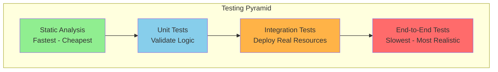
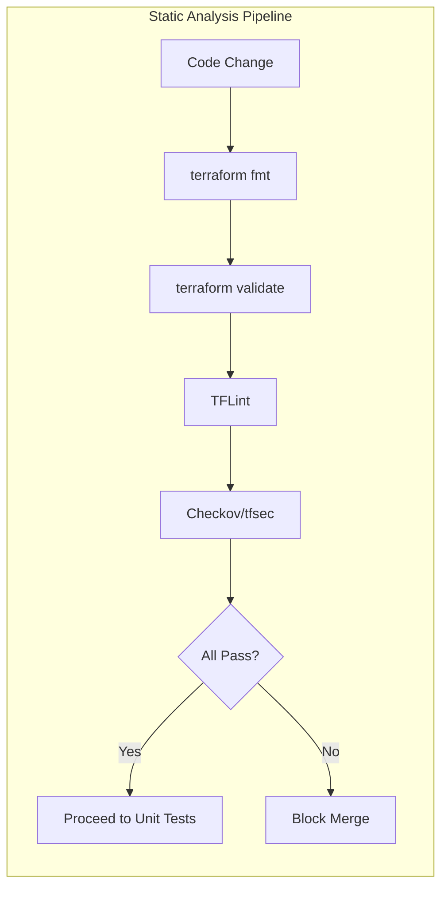
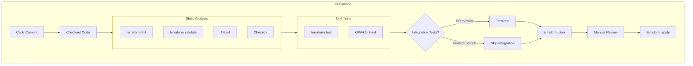
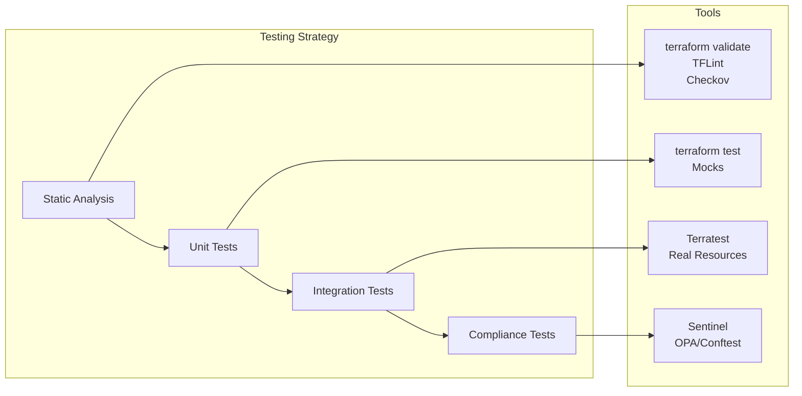

# How to Implement Infrastructure Testing with Terraform

Author: [nawazdhandala](https://www.github.com/nawazdhandala)

Tags: Terraform, Infrastructure Testing, DevOps, IaC, CI/CD, Validation

Description: Learn how to implement comprehensive infrastructure testing strategies for Terraform, covering static analysis, unit testing, integration testing, compliance testing, and contract testing to build reliable infrastructure as code.

---

Infrastructure as Code (IaC) has transformed how teams provision and manage cloud resources. However, deploying untested infrastructure code can lead to outages, security vulnerabilities, and compliance violations. A robust testing strategy for Terraform helps catch issues before they reach production.

## The Infrastructure Testing Pyramid

Similar to software testing, infrastructure testing follows a pyramid structure where faster, cheaper tests form the base.



## Static Analysis - The First Line of Defense

Static analysis catches issues without provisioning any infrastructure. These tests run in seconds and should be part of every commit.

### Terraform Validate

The built-in validate command checks syntax and configuration validity.

```bash
# Initialize the working directory first
terraform init -backend=false

# Validate the configuration files
terraform validate
```

### Terraform Format Check

Consistent formatting makes code reviews easier and prevents merge conflicts.

```bash
# Check if files are properly formatted (returns non-zero exit code if not)
terraform fmt -check -recursive

# Auto-format files (use in pre-commit hooks)
terraform fmt -recursive
```

### TFLint for Linting

TFLint catches provider-specific issues that validate misses. Install and configure it for deeper analysis.

The following configuration file enables AWS-specific rules and enforces naming conventions.

```hcl
# .tflint.hcl - TFLint configuration file
plugin "aws" {
  enabled = true
  version = "0.27.0"
  source  = "github.com/terraform-linters/tflint-ruleset-aws"
}

# Enforce naming conventions for resources
rule "terraform_naming_convention" {
  enabled = true
  format  = "snake_case"
}

# Require descriptions on variables
rule "terraform_documented_variables" {
  enabled = true
}

# Require descriptions on outputs
rule "terraform_documented_outputs" {
  enabled = true
}

# Disallow deprecated syntax
rule "terraform_deprecated_interpolation" {
  enabled = true
}
```

Run TFLint to scan your Terraform code for issues.

```bash
# Initialize TFLint and download plugins
tflint --init

# Run linting on the current directory
tflint --recursive
```

### Checkov for Security Scanning

Checkov identifies security misconfigurations and compliance violations in your Terraform code.

```bash
# Install Checkov
pip install checkov

# Scan Terraform directory for security issues
checkov -d . --framework terraform

# Output results in JUnit format for CI integration
checkov -d . --framework terraform -o junitxml > checkov-results.xml

# Skip specific checks if needed (use sparingly)
checkov -d . --skip-check CKV_AWS_20,CKV_AWS_21
```

The following diagram shows how static analysis fits into your workflow.



## Unit Testing with Terraform Test

Terraform 1.6 introduced native testing with the `terraform test` command. Tests verify module behavior without deploying resources.

### Creating Test Files

Test files use the `.tftest.hcl` extension and live alongside your Terraform modules.

The following test validates an AWS S3 bucket module by checking expected outputs.

```hcl
# tests/s3_bucket.tftest.hcl - Unit test for S3 bucket module

# Define test variables
variables {
  bucket_name = "test-bucket-unit-test"
  environment = "test"
}

# Test that the bucket name follows naming convention
run "bucket_naming_convention" {
  command = plan

  # Assert the bucket name contains the environment prefix
  assert {
    condition     = startswith(aws_s3_bucket.main.bucket, "test-")
    error_message = "Bucket name must start with environment prefix"
  }
}

# Test that versioning is enabled
run "versioning_enabled" {
  command = plan

  assert {
    condition     = aws_s3_bucket_versioning.main.versioning_configuration[0].status == "Enabled"
    error_message = "Bucket versioning must be enabled"
  }
}

# Test that public access is blocked
run "public_access_blocked" {
  command = plan

  assert {
    condition     = aws_s3_bucket_public_access_block.main.block_public_acls == true
    error_message = "Public ACLs must be blocked"
  }

  assert {
    condition     = aws_s3_bucket_public_access_block.main.block_public_policy == true
    error_message = "Public policies must be blocked"
  }
}
```

### Testing Module Logic with Mocks

Mocks allow testing module logic without any provider interaction. The following test uses mock providers to validate a VPC module.

```hcl
# tests/vpc_logic.tftest.hcl - Test VPC module logic using mocks

# Use mock provider to avoid real API calls
mock_provider "aws" {}

variables {
  vpc_cidr           = "10.0.0.0/16"
  availability_zones = ["us-east-1a", "us-east-1b", "us-east-1c"]
  environment        = "production"
}

# Test subnet CIDR calculation logic
run "subnet_cidr_calculation" {
  command = plan

  # Verify we create the correct number of subnets
  assert {
    condition     = length(aws_subnet.private) == 3
    error_message = "Should create one private subnet per AZ"
  }

  assert {
    condition     = length(aws_subnet.public) == 3
    error_message = "Should create one public subnet per AZ"
  }
}

# Test tagging logic
run "resource_tagging" {
  command = plan

  assert {
    condition     = aws_vpc.main.tags["Environment"] == "production"
    error_message = "VPC must be tagged with environment"
  }
}
```

Run the tests using the terraform test command.

```bash
# Run all tests in the tests directory
terraform test

# Run tests with verbose output
terraform test -verbose

# Run specific test file
terraform test -filter=tests/s3_bucket.tftest.hcl
```

## Integration Testing with Terratest

Terratest deploys real infrastructure, validates it works correctly, then destroys it. Written in Go, it provides maximum flexibility.

### Setting Up Terratest

Create a Go module for your tests and install Terratest.

```bash
# Initialize Go module in your test directory
cd test
go mod init github.com/yourorg/infrastructure/test

# Install Terratest and required dependencies
go get github.com/gruntwork-io/terratest/modules/terraform
go get github.com/stretchr/testify/assert
```

### Basic Integration Test

The following test deploys an EC2 instance, verifies it's running, then cleans up.

```go
// test/ec2_instance_test.go - Integration test for EC2 module
package test

import (
    "testing"
    "time"

    "github.com/gruntwork-io/terratest/modules/aws"
    "github.com/gruntwork-io/terratest/modules/terraform"
    "github.com/stretchr/testify/assert"
)

func TestEC2Instance(t *testing.T) {
    // Run tests in parallel for faster execution
    t.Parallel()

    // Define Terraform options pointing to the module directory
    terraformOptions := terraform.WithDefaultRetryableErrors(t, &terraform.Options{
        // Path to Terraform code being tested
        TerraformDir: "../modules/ec2-instance",

        // Variables to pass to Terraform
        Vars: map[string]interface{}{
            "instance_type": "t3.micro",
            "environment":   "test",
            "name":          "terratest-example",
        },

        // Environment variables for AWS authentication
        EnvVars: map[string]string{
            "AWS_DEFAULT_REGION": "us-east-1",
        },
    })

    // Destroy infrastructure at the end of the test
    defer terraform.Destroy(t, terraformOptions)

    // Deploy the infrastructure
    terraform.InitAndApply(t, terraformOptions)

    // Retrieve outputs from Terraform
    instanceID := terraform.Output(t, terraformOptions, "instance_id")
    publicIP := terraform.Output(t, terraformOptions, "public_ip")

    // Verify instance ID format
    assert.Regexp(t, `^i-[a-f0-9]+$`, instanceID, "Instance ID should match expected format")

    // Verify public IP was assigned
    assert.NotEmpty(t, publicIP, "Public IP should be assigned")

    // Verify the instance is actually running in AWS
    instanceState := aws.GetInstanceState(t, "us-east-1", instanceID)
    assert.Equal(t, "running", instanceState, "Instance should be in running state")
}
```

### Testing HTTP Endpoints

For web infrastructure, verify that deployed services respond correctly.

```go
// test/alb_test.go - Test ALB responds with expected status
package test

import (
    "crypto/tls"
    "fmt"
    "net/http"
    "testing"
    "time"

    "github.com/gruntwork-io/terratest/modules/http-helper"
    "github.com/gruntwork-io/terratest/modules/terraform"
)

func TestALBHealthEndpoint(t *testing.T) {
    t.Parallel()

    terraformOptions := terraform.WithDefaultRetryableErrors(t, &terraform.Options{
        TerraformDir: "../modules/web-service",
        Vars: map[string]interface{}{
            "environment": "test",
            "app_name":    "terratest-web",
        },
    })

    defer terraform.Destroy(t, terraformOptions)
    terraform.InitAndApply(t, terraformOptions)

    // Get the ALB DNS name from Terraform outputs
    albDNS := terraform.Output(t, terraformOptions, "alb_dns_name")
    healthURL := fmt.Sprintf("http://%s/health", albDNS)

    // Configure TLS to skip verification for test environments
    tlsConfig := &tls.Config{InsecureSkipVerify: true}

    // Retry the HTTP request for up to 5 minutes
    // ALB and targets may take time to become healthy
    maxRetries := 30
    timeBetweenRetries := 10 * time.Second

    http_helper.HttpGetWithRetryWithCustomValidation(
        t,
        healthURL,
        tlsConfig,
        maxRetries,
        timeBetweenRetries,
        func(statusCode int, body string) bool {
            // Validate response indicates healthy service
            return statusCode == 200
        },
    )
}
```

### Database Integration Testing

Verify database infrastructure by testing actual connectivity.

```go
// test/rds_test.go - Test RDS database connectivity
package test

import (
    "database/sql"
    "fmt"
    "testing"

    _ "github.com/lib/pq"
    "github.com/gruntwork-io/terratest/modules/terraform"
    "github.com/stretchr/testify/assert"
    "github.com/stretchr/testify/require"
)

func TestRDSConnectivity(t *testing.T) {
    t.Parallel()

    terraformOptions := terraform.WithDefaultRetryableErrors(t, &terraform.Options{
        TerraformDir: "../modules/rds-postgres",
        Vars: map[string]interface{}{
            "environment":    "test",
            "instance_class": "db.t3.micro",
            "db_name":        "testdb",
        },
    })

    defer terraform.Destroy(t, terraformOptions)
    terraform.InitAndApply(t, terraformOptions)

    // Retrieve connection details from outputs
    endpoint := terraform.Output(t, terraformOptions, "db_endpoint")
    port := terraform.Output(t, terraformOptions, "db_port")
    username := terraform.Output(t, terraformOptions, "db_username")
    password := terraform.Output(t, terraformOptions, "db_password")

    // Build connection string
    connStr := fmt.Sprintf(
        "host=%s port=%s user=%s password=%s dbname=testdb sslmode=require",
        endpoint, port, username, password,
    )

    // Attempt database connection
    db, err := sql.Open("postgres", connStr)
    require.NoError(t, err, "Should connect to database")
    defer db.Close()

    // Verify connection is actually working
    err = db.Ping()
    assert.NoError(t, err, "Database should respond to ping")

    // Run a simple query to verify functionality
    var result int
    err = db.QueryRow("SELECT 1").Scan(&result)
    assert.NoError(t, err, "Should execute simple query")
    assert.Equal(t, 1, result, "Query should return expected value")
}
```

## Contract Testing with Sentinel

HashiCorp Sentinel enables policy-as-code for Terraform Enterprise and Cloud. Define guardrails that prevent non-compliant infrastructure.

### Sentinel Policy Structure

The following policy enforces tagging requirements on all resources.

```python
# policies/enforce-tags.sentinel - Require mandatory tags on all resources

import "tfplan/v2" as tfplan

# Define required tags that must exist on all taggable resources
required_tags = ["Environment", "Owner", "CostCenter", "Project"]

# Get all resources that support tags
allTaggableResources = filter tfplan.resource_changes as _, rc {
    rc.mode is "managed" and
    rc.change.after is not null and
    keys(rc.change.after) contains "tags"
}

# Check if resource has all required tags
resourceHasRequiredTags = func(resource) {
    tags = resource.change.after.tags else {}

    for required_tags as tag {
        if tags[tag] is null or tags[tag] is "" {
            print("Resource", resource.address, "missing required tag:", tag)
            return false
        }
    }
    return true
}

# Main rule - all taggable resources must have required tags
main = rule {
    all allTaggableResources as _, resource {
        resourceHasRequiredTags(resource)
    }
}
```

### Instance Size Restrictions

Prevent deploying oversized instances that exceed budget constraints.

```python
# policies/restrict-instance-sizes.sentinel - Limit allowed instance types

import "tfplan/v2" as tfplan

# Define allowed instance types per environment
allowed_instance_types = {
    "development": ["t3.micro", "t3.small", "t3.medium"],
    "staging":     ["t3.small", "t3.medium", "t3.large"],
    "production":  ["t3.medium", "t3.large", "t3.xlarge", "m5.large", "m5.xlarge"],
}

# Get all EC2 instances being created or modified
ec2Instances = filter tfplan.resource_changes as _, rc {
    rc.type is "aws_instance" and
    rc.mode is "managed" and
    rc.change.actions contains "create"
}

# Validate instance type is allowed for the environment
validateInstanceType = func(instance) {
    instance_type = instance.change.after.instance_type
    environment = instance.change.after.tags["Environment"] else "development"

    allowed = allowed_instance_types[environment] else []

    if instance_type not in allowed {
        print("Instance", instance.address, "uses type", instance_type)
        print("Allowed types for", environment, ":", allowed)
        return false
    }
    return true
}

# Main rule
main = rule {
    all ec2Instances as _, instance {
        validateInstanceType(instance)
    }
}
```

## Open Policy Agent (OPA) with Conftest

For teams not using Terraform Cloud, OPA provides flexible policy enforcement.

### Writing Rego Policies

Rego policies evaluate Terraform plan JSON output. The following policy prevents public S3 buckets.

```rego
# policy/s3.rego - Prevent public S3 buckets

package terraform.s3

# Deny if S3 bucket allows public read access
deny[msg] {
    resource := input.resource_changes[_]
    resource.type == "aws_s3_bucket"
    resource.change.after.acl == "public-read"

    msg := sprintf(
        "S3 bucket '%s' has public-read ACL which is not allowed",
        [resource.address]
    )
}

# Deny if S3 bucket public access block is not configured
deny[msg] {
    resource := input.resource_changes[_]
    resource.type == "aws_s3_bucket"

    # Check if there's a corresponding public access block
    not has_public_access_block(resource.change.after.bucket)

    msg := sprintf(
        "S3 bucket '%s' must have a public access block configured",
        [resource.address]
    )
}

# Helper to check for public access block
has_public_access_block(bucket_name) {
    resource := input.resource_changes[_]
    resource.type == "aws_s3_bucket_public_access_block"
    resource.change.after.bucket == bucket_name
}

# Deny if bucket versioning is not enabled
deny[msg] {
    resource := input.resource_changes[_]
    resource.type == "aws_s3_bucket_versioning"
    resource.change.after.versioning_configuration[0].status != "Enabled"

    msg := sprintf(
        "S3 bucket versioning must be enabled for '%s'",
        [resource.address]
    )
}
```

### Running Conftest

Generate a Terraform plan and evaluate it against policies.

```bash
# Generate Terraform plan in JSON format
terraform plan -out=tfplan.binary
terraform show -json tfplan.binary > tfplan.json

# Run Conftest against the plan
conftest test tfplan.json --policy policy/

# Run with specific policy namespace
conftest test tfplan.json --policy policy/ --namespace terraform.s3

# Output results in different formats
conftest test tfplan.json --policy policy/ --output json
conftest test tfplan.json --policy policy/ --output junit > conftest-results.xml
```

## CI/CD Pipeline Integration

Integrate all testing stages into your CI/CD pipeline for comprehensive validation.



### GitHub Actions Workflow

The following workflow runs all testing stages on pull requests.

```yaml
# .github/workflows/terraform-test.yml
name: Terraform Testing Pipeline

on:
  pull_request:
    branches: [main]
  push:
    branches: [main]

env:
  TF_VERSION: "1.6.0"
  GO_VERSION: "1.21"

jobs:
  static-analysis:
    name: Static Analysis
    runs-on: ubuntu-latest
    steps:
      - name: Checkout code
        uses: actions/checkout@v4

      - name: Setup Terraform
        uses: hashicorp/setup-terraform@v3
        with:
          terraform_version: ${{ env.TF_VERSION }}

      # Check formatting - fails if any files need reformatting
      - name: Terraform Format Check
        run: terraform fmt -check -recursive

      # Validate configuration syntax
      - name: Terraform Init and Validate
        run: |
          terraform init -backend=false
          terraform validate

      # Run TFLint for provider-specific checks
      - name: TFLint
        uses: terraform-linters/setup-tflint@v4
      - run: |
          tflint --init
          tflint --recursive

      # Security scanning with Checkov
      - name: Checkov Security Scan
        uses: bridgecrewio/checkov-action@v12
        with:
          directory: .
          framework: terraform
          output_format: sarif
          output_file_path: checkov-results.sarif

      - name: Upload Checkov Results
        uses: github/codeql-action/upload-sarif@v2
        with:
          sarif_file: checkov-results.sarif

  unit-tests:
    name: Unit Tests
    runs-on: ubuntu-latest
    needs: static-analysis
    steps:
      - name: Checkout code
        uses: actions/checkout@v4

      - name: Setup Terraform
        uses: hashicorp/setup-terraform@v3
        with:
          terraform_version: ${{ env.TF_VERSION }}

      # Run native Terraform tests
      - name: Terraform Test
        run: |
          terraform init -backend=false
          terraform test -verbose

      # Run OPA policy tests
      - name: Setup OPA
        uses: open-policy-agent/setup-opa@v2

      - name: Generate Plan JSON
        run: |
          terraform init -backend=false
          terraform plan -out=tfplan.binary
          terraform show -json tfplan.binary > tfplan.json

      - name: Run Conftest
        uses: open-policy-agent/conftest-action@v2
        with:
          files: tfplan.json
          policy: policy/

  integration-tests:
    name: Integration Tests
    runs-on: ubuntu-latest
    needs: unit-tests
    # Only run on PRs to main to control costs
    if: github.event_name == 'pull_request'
    steps:
      - name: Checkout code
        uses: actions/checkout@v4

      - name: Setup Go
        uses: actions/setup-go@v5
        with:
          go-version: ${{ env.GO_VERSION }}

      - name: Setup Terraform
        uses: hashicorp/setup-terraform@v3
        with:
          terraform_version: ${{ env.TF_VERSION }}
          terraform_wrapper: false

      # Configure AWS credentials for Terratest
      - name: Configure AWS Credentials
        uses: aws-actions/configure-aws-credentials@v4
        with:
          aws-access-key-id: ${{ secrets.AWS_ACCESS_KEY_ID }}
          aws-secret-access-key: ${{ secrets.AWS_SECRET_ACCESS_KEY }}
          aws-region: us-east-1

      # Run Terratest integration tests
      - name: Run Terratest
        working-directory: test
        run: |
          go mod download
          go test -v -timeout 30m ./...
```

## Testing Best Practices

Follow these guidelines to build an effective infrastructure testing strategy.

### 1. Test Environment Isolation

Use separate AWS accounts or resource prefixes for testing to avoid conflicts.

```hcl
# modules/common/variables.tf - Ensure test isolation

variable "environment" {
  type        = string
  description = "Environment name used for resource naming and isolation"

  validation {
    condition     = contains(["development", "staging", "production", "test"], var.environment)
    error_message = "Environment must be one of: development, staging, production, test"
  }
}

# Generate unique names for test resources
locals {
  # Include timestamp to prevent naming collisions in parallel tests
  resource_prefix = var.environment == "test" ? "test-${random_id.test.hex}" : var.environment
}

resource "random_id" "test" {
  byte_length = 4
}
```

### 2. Cleanup on Failure

Ensure resources are destroyed even when tests fail to prevent cost accumulation.

```go
// test/cleanup_test.go - Robust cleanup handling
package test

import (
    "testing"
    "os"

    "github.com/gruntwork-io/terratest/modules/terraform"
)

func TestWithRobustCleanup(t *testing.T) {
    t.Parallel()

    terraformOptions := &terraform.Options{
        TerraformDir: "../modules/expensive-resources",
    }

    // Always destroy, even if test panics
    defer func() {
        if r := recover(); r != nil {
            t.Logf("Test panicked, still cleaning up: %v", r)
            terraform.Destroy(t, terraformOptions)
            panic(r) // Re-panic after cleanup
        }
    }()

    defer terraform.Destroy(t, terraformOptions)

    // If SKIP_DESTROY is set, preserve infrastructure for debugging
    if os.Getenv("SKIP_DESTROY") != "" {
        t.Log("SKIP_DESTROY set, infrastructure will not be destroyed")
    }

    terraform.InitAndApply(t, terraformOptions)

    // Run validations...
}
```

### 3. Parallel Test Execution

Run tests in parallel to reduce total execution time. Use unique resource names.

```go
// test/parallel_test.go - Configure parallel test execution
package test

import (
    "fmt"
    "testing"
    "time"

    "github.com/gruntwork-io/terratest/modules/random"
    "github.com/gruntwork-io/terratest/modules/terraform"
)

func TestVPCModule(t *testing.T) {
    t.Parallel()

    // Generate unique identifier for this test run
    uniqueID := random.UniqueId()

    terraformOptions := &terraform.Options{
        TerraformDir: "../modules/vpc",
        Vars: map[string]interface{}{
            // Use unique names to allow parallel execution
            "vpc_name": fmt.Sprintf("test-vpc-%s", uniqueID),
        },
    }

    defer terraform.Destroy(t, terraformOptions)
    terraform.InitAndApply(t, terraformOptions)
}

func TestEKSModule(t *testing.T) {
    t.Parallel()

    uniqueID := random.UniqueId()

    terraformOptions := &terraform.Options{
        TerraformDir: "../modules/eks",
        Vars: map[string]interface{}{
            "cluster_name": fmt.Sprintf("test-eks-%s", uniqueID),
        },
    }

    defer terraform.Destroy(t, terraformOptions)
    terraform.InitAndApply(t, terraformOptions)
}
```

### 4. Cost Control

Implement budget alerts and auto-destroy mechanisms for test resources.

```hcl
# modules/test-budget/main.tf - Automatic cost control for test environments

resource "aws_budgets_budget" "test_environment" {
  name              = "test-environment-budget"
  budget_type       = "COST"
  limit_amount      = "100"
  limit_unit        = "USD"
  time_unit         = "MONTHLY"

  notification {
    comparison_operator        = "GREATER_THAN"
    threshold                  = 80
    threshold_type             = "PERCENTAGE"
    notification_type          = "ACTUAL"
    subscriber_email_addresses = ["devops@example.com"]
  }
}

# Tag all test resources with auto-delete timestamp
locals {
  auto_delete_after = timeadd(timestamp(), "4h")
}

# Example resource with auto-delete tag
resource "aws_instance" "test" {
  # ... instance configuration ...

  tags = {
    Environment     = "test"
    AutoDeleteAfter = local.auto_delete_after
  }
}
```

## Summary

A comprehensive infrastructure testing strategy combines multiple approaches.



Key takeaways for effective Terraform testing:

- **Start with static analysis** - Fast feedback catches most issues
- **Use native terraform test** - Validate module logic without deploying resources
- **Reserve integration tests for critical paths** - Balance thoroughness with cost and time
- **Enforce policies as code** - Prevent compliance violations before deployment
- **Automate everything** - Tests only provide value when they run consistently

By implementing these testing practices, teams can deploy infrastructure changes confidently, catching bugs before they impact production environments.
