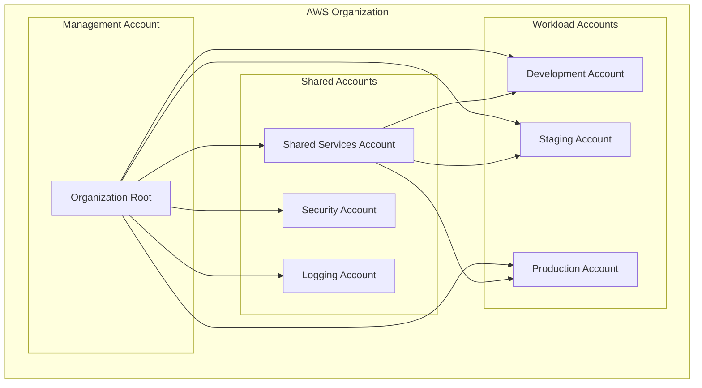
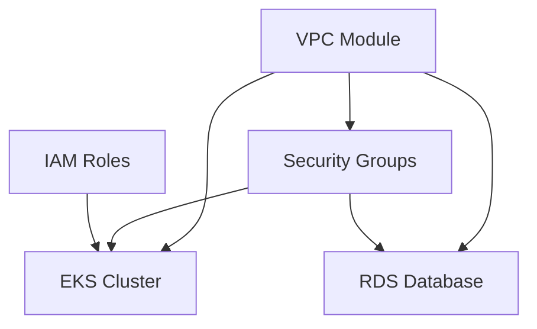
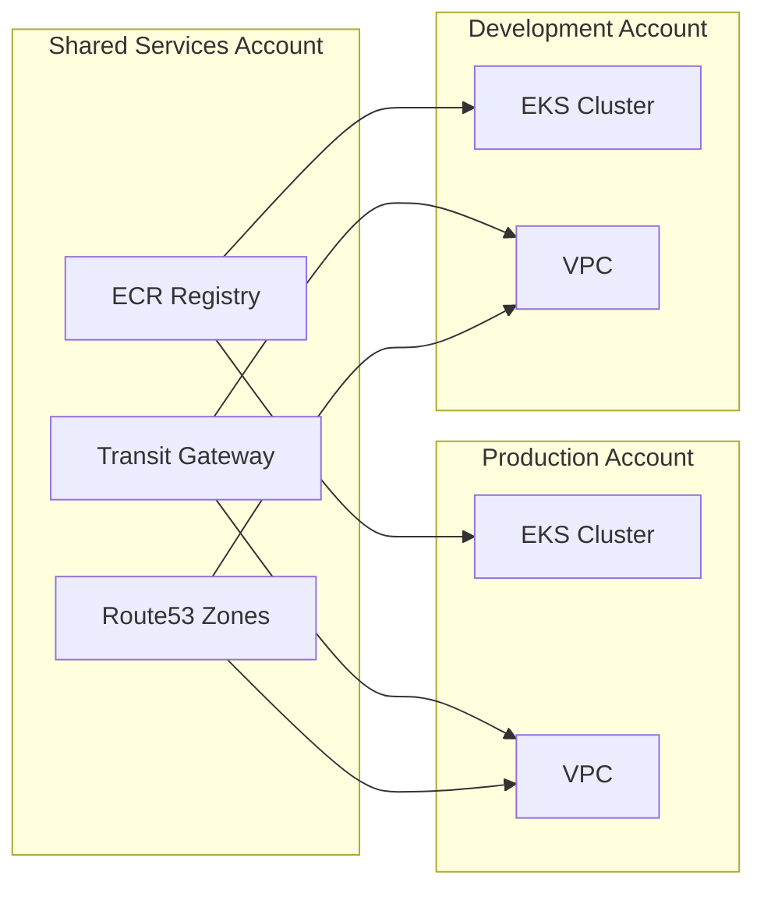
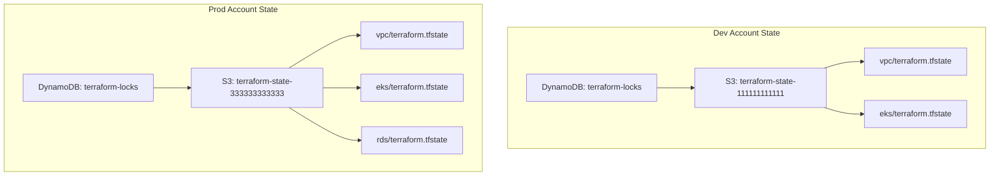

# How to Structure Terragrunt for Multi-Account AWS

Author: [nawazdhandala](https://www.github.com/nawazdhandala)

Tags: Terragrunt, Terraform, AWS, Multi-Account, Infrastructure as Code, DevOps

Description: A comprehensive guide to structuring Terragrunt for multi-account AWS deployments, covering directory organization, DRY configurations, account isolation, and production-ready patterns.

---

Managing infrastructure across multiple AWS accounts is challenging. Terragrunt solves the DRY (Don't Repeat Yourself) problem by providing a thin wrapper around Terraform that enables configuration reuse, remote state management, and dependency handling across accounts.

## Why Multi-Account AWS Architecture?

Organizations use multiple AWS accounts to achieve security isolation, billing separation, and blast radius reduction. A typical setup includes development, staging, and production accounts, often with additional accounts for shared services, security, and logging.

The following diagram shows a common multi-account structure where each environment lives in its own AWS account, with a shared services account for common infrastructure.



## Terragrunt Directory Structure

A well-organized directory structure is critical for maintainability. The recommended approach separates environments, regions, and modules into distinct directories.

The structure below demonstrates a production-ready layout with clear separation between accounts, regions, and resource types.

```
infrastructure/
├── terragrunt.hcl                    # Root configuration
├── _envcommon/                       # Shared module configurations
│   ├── vpc.hcl
│   ├── eks.hcl
│   ├── rds.hcl
│   └── s3.hcl
├── accounts/
│   ├── dev/
│   │   ├── account.hcl               # Dev account settings
│   │   ├── us-east-1/
│   │   │   ├── region.hcl
│   │   │   ├── vpc/
│   │   │   │   └── terragrunt.hcl
│   │   │   ├── eks/
│   │   │   │   └── terragrunt.hcl
│   │   │   └── rds/
│   │   │       └── terragrunt.hcl
│   │   └── us-west-2/
│   │       ├── region.hcl
│   │       └── vpc/
│   │           └── terragrunt.hcl
│   ├── staging/
│   │   ├── account.hcl
│   │   └── us-east-1/
│   │       ├── region.hcl
│   │       ├── vpc/
│   │       └── eks/
│   └── prod/
│       ├── account.hcl
│       └── us-east-1/
│           ├── region.hcl
│           ├── vpc/
│           ├── eks/
│           └── rds/
└── modules/                          # Terraform modules
    ├── vpc/
    ├── eks/
    ├── rds/
    └── s3/
```

## Root Terragrunt Configuration

The root `terragrunt.hcl` file contains settings inherited by all child configurations. It defines remote state configuration, provider generation, and common variables.

Place the following configuration at the root of your infrastructure directory. It configures S3 backend with DynamoDB locking and generates the AWS provider for each account.

```hcl
# infrastructure/terragrunt.hcl
# Root configuration inherited by all child modules

# Configure remote state in S3 with DynamoDB locking
remote_state {
  backend = "s3"

  generate = {
    path      = "backend.tf"
    if_exists = "overwrite_terragrunt"
  }

  config = {
    # Each account gets its own state bucket
    bucket         = "terraform-state-${local.account_id}"
    key            = "${path_relative_to_include()}/terraform.tfstate"
    region         = local.aws_region
    encrypt        = true
    dynamodb_table = "terraform-locks"

    # Enable state file versioning for recovery
    s3_bucket_tags = {
      Owner       = "terraform"
      Environment = local.environment
    }
  }
}

# Generate provider configuration for each deployment
generate "provider" {
  path      = "provider.tf"
  if_exists = "overwrite_terragrunt"

  contents = <<EOF
provider "aws" {
  region = "${local.aws_region}"

  # Assume role into the target account
  assume_role {
    role_arn = "arn:aws:iam::${local.account_id}:role/TerraformExecutionRole"
  }

  default_tags {
    tags = {
      Environment = "${local.environment}"
      ManagedBy   = "terraform"
      Project     = "${local.project_name}"
    }
  }
}
EOF
}

# Load account and region configuration from child directories
locals {
  # Parse the path to determine account and region
  account_vars = read_terragrunt_config(find_in_parent_folders("account.hcl"))
  region_vars  = read_terragrunt_config(find_in_parent_folders("region.hcl"))

  account_id   = local.account_vars.locals.account_id
  environment  = local.account_vars.locals.environment
  aws_region   = local.region_vars.locals.aws_region
  project_name = "myproject"
}

# Common inputs passed to all modules
inputs = {
  environment = local.environment
  aws_region  = local.aws_region
  project     = local.project_name
}
```

## Account Configuration

Each account directory contains an `account.hcl` file with account-specific settings. These settings cascade down to all resources in that account.

Create an account.hcl file for each AWS account with its specific ID, environment name, and any account-level configurations.

```hcl
# infrastructure/accounts/dev/account.hcl
# Development account configuration

locals {
  account_id   = "111111111111"
  environment  = "dev"
  account_name = "development"

  # Account-specific settings
  budget_limit = 1000
  alert_email  = "dev-team@example.com"

  # Feature flags for this account
  enable_monitoring    = true
  enable_backup        = false
  deletion_protection  = false
}
```

```hcl
# infrastructure/accounts/prod/account.hcl
# Production account configuration

locals {
  account_id   = "333333333333"
  environment  = "prod"
  account_name = "production"

  # Production-specific settings
  budget_limit = 50000
  alert_email  = "platform-team@example.com"

  # Stricter settings for production
  enable_monitoring    = true
  enable_backup        = true
  deletion_protection  = true
}
```

## Region Configuration

Region-specific settings live in `region.hcl` files, enabling multi-region deployments with region-specific configurations.

The following configuration defines region-specific settings like availability zones and regional service endpoints.

```hcl
# infrastructure/accounts/dev/us-east-1/region.hcl
# US East 1 region configuration

locals {
  aws_region = "us-east-1"

  # Region-specific availability zones
  availability_zones = [
    "us-east-1a",
    "us-east-1b",
    "us-east-1c"
  ]

  # Regional configurations
  ami_id = "ami-0123456789abcdef0"
}
```

## Creating DRY Module Configurations

Shared module configurations in `_envcommon/` eliminate duplication across accounts. Each file defines defaults that can be overridden by individual deployments.

The VPC module configuration below shows how to define a reusable configuration with sensible defaults and environment-aware sizing.

```hcl
# infrastructure/_envcommon/vpc.hcl
# Shared VPC configuration used across all accounts

terraform {
  source = "${dirname(find_in_parent_folders())}/modules/vpc"
}

# Include the root configuration
include "root" {
  path = find_in_parent_folders()
}

# Load account and region settings
locals {
  account_vars = read_terragrunt_config(find_in_parent_folders("account.hcl"))
  region_vars  = read_terragrunt_config(find_in_parent_folders("region.hcl"))

  environment        = local.account_vars.locals.environment
  availability_zones = local.region_vars.locals.availability_zones

  # Environment-specific CIDR ranges
  vpc_cidr_map = {
    dev     = "10.0.0.0/16"
    staging = "10.1.0.0/16"
    prod    = "10.2.0.0/16"
  }

  # Subnet sizing based on environment
  subnet_config = {
    dev = {
      public_subnets  = ["10.0.1.0/24", "10.0.2.0/24", "10.0.3.0/24"]
      private_subnets = ["10.0.11.0/24", "10.0.12.0/24", "10.0.13.0/24"]
      database_subnets = ["10.0.21.0/24", "10.0.22.0/24", "10.0.23.0/24"]
    }
    staging = {
      public_subnets  = ["10.1.1.0/24", "10.1.2.0/24", "10.1.3.0/24"]
      private_subnets = ["10.1.11.0/24", "10.1.12.0/24", "10.1.13.0/24"]
      database_subnets = ["10.1.21.0/24", "10.1.22.0/24", "10.1.23.0/24"]
    }
    prod = {
      public_subnets  = ["10.2.1.0/24", "10.2.2.0/24", "10.2.3.0/24"]
      private_subnets = ["10.2.11.0/24", "10.2.12.0/24", "10.2.13.0/24"]
      database_subnets = ["10.2.21.0/24", "10.2.22.0/24", "10.2.23.0/24"]
    }
  }
}

# Default inputs for VPC module
inputs = {
  vpc_name           = "main-vpc"
  vpc_cidr           = local.vpc_cidr_map[local.environment]
  availability_zones = local.availability_zones

  public_subnets   = local.subnet_config[local.environment].public_subnets
  private_subnets  = local.subnet_config[local.environment].private_subnets
  database_subnets = local.subnet_config[local.environment].database_subnets

  # NAT Gateway configuration
  enable_nat_gateway     = true
  single_nat_gateway     = local.environment == "dev" ? true : false
  one_nat_gateway_per_az = local.environment == "prod" ? true : false

  # VPC Flow Logs
  enable_flow_logs          = true
  flow_logs_retention_days  = local.environment == "prod" ? 90 : 30
}
```

## Resource-Level Configuration

Individual resource configurations include the shared module and can override specific values as needed.

The following example shows how a VPC resource in development inherits from the shared configuration while adding environment-specific overrides.

```hcl
# infrastructure/accounts/dev/us-east-1/vpc/terragrunt.hcl
# Development VPC in us-east-1

# Include the shared VPC configuration
include "envcommon" {
  path   = "${dirname(find_in_parent_folders())}_envcommon/vpc.hcl"
  expose = true
}

# Include root configuration
include "root" {
  path = find_in_parent_folders()
}

# Override or extend defaults for this specific deployment
inputs = {
  # Development-specific overrides
  vpc_name = "dev-main-vpc"

  # Enable VPC endpoints for cost savings in dev
  enable_s3_endpoint       = true
  enable_dynamodb_endpoint = true

  # Additional tags for this VPC
  tags = {
    Team = "platform"
  }
}
```

## Handling Dependencies Between Resources

Terragrunt manages dependencies between resources using the `dependency` block. Dependencies ensure resources are created in the correct order and enable passing outputs between modules.

The following diagram illustrates typical dependencies in a multi-tier application where EKS depends on VPC, and RDS depends on both VPC and security configurations.



The EKS configuration below demonstrates how to declare dependencies and use outputs from other modules.

```hcl
# infrastructure/accounts/prod/us-east-1/eks/terragrunt.hcl
# Production EKS cluster configuration

include "envcommon" {
  path   = "${dirname(find_in_parent_folders())}_envcommon/eks.hcl"
  expose = true
}

include "root" {
  path = find_in_parent_folders()
}

# Declare dependency on VPC - must be created first
dependency "vpc" {
  config_path = "../vpc"

  # Mock outputs for plan when VPC doesn't exist yet
  mock_outputs = {
    vpc_id          = "vpc-mock"
    private_subnets = ["subnet-mock-1", "subnet-mock-2"]
  }
  mock_outputs_allowed_terraform_commands = ["validate", "plan"]
}

# Declare dependency on IAM roles
dependency "iam" {
  config_path = "../../_global/iam"

  mock_outputs = {
    cluster_role_arn    = "arn:aws:iam::123456789012:role/mock"
    node_role_arn       = "arn:aws:iam::123456789012:role/mock"
  }
  mock_outputs_allowed_terraform_commands = ["validate", "plan"]
}

# Use outputs from dependencies as inputs
inputs = {
  cluster_name = "prod-eks-cluster"

  # Pass VPC outputs to EKS module
  vpc_id     = dependency.vpc.outputs.vpc_id
  subnet_ids = dependency.vpc.outputs.private_subnets

  # Pass IAM outputs
  cluster_role_arn = dependency.iam.outputs.cluster_role_arn
  node_role_arn    = dependency.iam.outputs.node_role_arn

  # Production-specific settings
  cluster_version = "1.28"

  node_groups = {
    general = {
      desired_size = 3
      min_size     = 2
      max_size     = 10

      instance_types = ["m6i.xlarge"]
      capacity_type  = "ON_DEMAND"
    }

    spot = {
      desired_size = 2
      min_size     = 0
      max_size     = 20

      instance_types = ["m6i.large", "m5.large", "m5a.large"]
      capacity_type  = "SPOT"
    }
  }
}
```

## Cross-Account Dependencies

Sometimes resources in one account need to reference resources in another account. Terragrunt handles cross-account dependencies by specifying the full path to the dependency.

The following diagram shows a common pattern where workload accounts reference shared resources from a central shared services account.



Configure cross-account dependencies by specifying the relative path to resources in other account directories.

```hcl
# infrastructure/accounts/prod/us-east-1/vpc/terragrunt.hcl
# Production VPC with cross-account dependencies

include "envcommon" {
  path   = "${dirname(find_in_parent_folders())}_envcommon/vpc.hcl"
  expose = true
}

include "root" {
  path = find_in_parent_folders()
}

# Reference Transit Gateway from shared services account
dependency "transit_gateway" {
  config_path = "../../../shared-services/us-east-1/transit-gateway"

  mock_outputs = {
    transit_gateway_id = "tgw-mock"
  }
  mock_outputs_allowed_terraform_commands = ["validate", "plan"]
}

inputs = {
  vpc_name = "prod-main-vpc"

  # Attach to shared Transit Gateway
  enable_transit_gateway_attachment = true
  transit_gateway_id = dependency.transit_gateway.outputs.transit_gateway_id

  # Routes to other accounts via Transit Gateway
  transit_gateway_routes = [
    {
      destination_cidr = "10.0.0.0/16"  # Dev VPC
      description      = "Route to Development"
    },
    {
      destination_cidr = "10.1.0.0/16"  # Staging VPC
      description      = "Route to Staging"
    }
  ]
}
```

## AWS Provider Configuration for Cross-Account Access

Configure IAM roles in each account that Terragrunt can assume for deployments. The execution role should have the necessary permissions for managing infrastructure.

The following Terraform module creates the execution role that Terragrunt assumes in each account.

```hcl
# modules/terraform-execution-role/main.tf
# IAM role for Terraform/Terragrunt execution

variable "trusted_account_id" {
  description = "AWS account ID allowed to assume this role"
  type        = string
}

variable "environment" {
  description = "Environment name"
  type        = string
}

# Create the execution role
resource "aws_iam_role" "terraform_execution" {
  name = "TerraformExecutionRole"

  # Trust policy allowing the CI/CD account to assume this role
  assume_role_policy = jsonencode({
    Version = "2012-10-17"
    Statement = [
      {
        Effect = "Allow"
        Principal = {
          AWS = "arn:aws:iam::${var.trusted_account_id}:root"
        }
        Action = "sts:AssumeRole"
        Condition = {
          StringEquals = {
            "sts:ExternalId" = "terragrunt-${var.environment}"
          }
        }
      }
    ]
  })

  tags = {
    Purpose = "Terraform execution"
  }
}

# Attach AdministratorAccess for full infrastructure management
# In production, consider creating a more restrictive custom policy
resource "aws_iam_role_policy_attachment" "admin" {
  role       = aws_iam_role.terraform_execution.name
  policy_arn = "arn:aws:iam::aws:policy/AdministratorAccess"
}

# Output the role ARN for use in Terragrunt configuration
output "role_arn" {
  value = aws_iam_role.terraform_execution.arn
}
```

## Running Terragrunt Commands

Terragrunt provides commands for managing infrastructure across multiple accounts and regions.

Execute these commands from your infrastructure directory to manage deployments. The run-all command operates on all modules in the current directory tree.

```bash
# Initialize all modules in development account
cd infrastructure/accounts/dev
terragrunt run-all init

# Plan changes across all resources in an account
terragrunt run-all plan

# Apply changes to all resources with dependency ordering
terragrunt run-all apply

# Apply only VPC changes in us-east-1
cd infrastructure/accounts/dev/us-east-1/vpc
terragrunt apply

# Destroy all resources in development (with confirmation)
cd infrastructure/accounts/dev
terragrunt run-all destroy

# Show the dependency graph
terragrunt graph-dependencies | dot -Tpng > dependencies.png

# Validate all configurations
terragrunt run-all validate

# Format all HCL files
terragrunt hclfmt
```

## Environment-Specific Module Configurations

Different environments often need different resource configurations. Use conditional logic and maps to handle environment-specific settings.

The RDS configuration below demonstrates environment-aware sizing and backup policies.

```hcl
# infrastructure/_envcommon/rds.hcl
# Shared RDS configuration with environment-specific settings

terraform {
  source = "${dirname(find_in_parent_folders())}/modules/rds"
}

include "root" {
  path = find_in_parent_folders()
}

locals {
  account_vars = read_terragrunt_config(find_in_parent_folders("account.hcl"))
  environment  = local.account_vars.locals.environment

  # Instance sizing by environment
  instance_class_map = {
    dev     = "db.t3.medium"
    staging = "db.r6g.large"
    prod    = "db.r6g.2xlarge"
  }

  # Storage configuration by environment
  storage_config = {
    dev = {
      allocated_storage     = 20
      max_allocated_storage = 100
      storage_type          = "gp3"
    }
    staging = {
      allocated_storage     = 100
      max_allocated_storage = 500
      storage_type          = "gp3"
    }
    prod = {
      allocated_storage     = 500
      max_allocated_storage = 2000
      storage_type          = "io1"
      iops                  = 10000
    }
  }

  # Backup and maintenance windows
  maintenance_config = {
    dev = {
      backup_retention_period = 7
      backup_window           = "03:00-04:00"
      maintenance_window      = "Mon:04:00-Mon:05:00"
      deletion_protection     = false
      skip_final_snapshot     = true
    }
    staging = {
      backup_retention_period = 14
      backup_window           = "03:00-04:00"
      maintenance_window      = "Mon:04:00-Mon:05:00"
      deletion_protection     = false
      skip_final_snapshot     = false
    }
    prod = {
      backup_retention_period = 35
      backup_window           = "03:00-04:00"
      maintenance_window      = "Sun:04:00-Sun:05:00"
      deletion_protection     = true
      skip_final_snapshot     = false
    }
  }
}

inputs = {
  engine         = "postgres"
  engine_version = "15.4"

  instance_class = local.instance_class_map[local.environment]

  allocated_storage     = local.storage_config[local.environment].allocated_storage
  max_allocated_storage = local.storage_config[local.environment].max_allocated_storage
  storage_type          = local.storage_config[local.environment].storage_type

  backup_retention_period = local.maintenance_config[local.environment].backup_retention_period
  backup_window           = local.maintenance_config[local.environment].backup_window
  maintenance_window      = local.maintenance_config[local.environment].maintenance_window
  deletion_protection     = local.maintenance_config[local.environment].deletion_protection
  skip_final_snapshot     = local.maintenance_config[local.environment].skip_final_snapshot

  # Multi-AZ only for production
  multi_az = local.environment == "prod" ? true : false

  # Performance Insights for prod and staging
  performance_insights_enabled = local.environment != "dev"

  # Enhanced monitoring for production
  monitoring_interval = local.environment == "prod" ? 60 : 0
}
```

## CI/CD Pipeline Integration

Integrate Terragrunt with your CI/CD pipeline for automated deployments. The following example shows a GitHub Actions workflow for multi-account deployments.

The workflow below runs on pull requests for planning and on merges to main for applying changes, with environment-specific approval gates.

```yaml
# .github/workflows/terragrunt.yml
# GitHub Actions workflow for Terragrunt multi-account deployments

name: Terragrunt Multi-Account Deploy

on:
  push:
    branches: [main]
    paths:
      - 'infrastructure/**'
  pull_request:
    branches: [main]
    paths:
      - 'infrastructure/**'

env:
  AWS_REGION: us-east-1
  TERRAGRUNT_VERSION: 0.54.0
  TERRAFORM_VERSION: 1.6.0

jobs:
  # Detect which accounts have changes
  detect-changes:
    runs-on: ubuntu-latest
    outputs:
      dev: ${{ steps.filter.outputs.dev }}
      staging: ${{ steps.filter.outputs.staging }}
      prod: ${{ steps.filter.outputs.prod }}
    steps:
      - uses: actions/checkout@v4

      - uses: dorny/paths-filter@v2
        id: filter
        with:
          filters: |
            dev:
              - 'infrastructure/accounts/dev/**'
              - 'infrastructure/_envcommon/**'
              - 'infrastructure/modules/**'
            staging:
              - 'infrastructure/accounts/staging/**'
              - 'infrastructure/_envcommon/**'
              - 'infrastructure/modules/**'
            prod:
              - 'infrastructure/accounts/prod/**'
              - 'infrastructure/_envcommon/**'
              - 'infrastructure/modules/**'

  # Plan and apply for development
  dev:
    needs: detect-changes
    if: needs.detect-changes.outputs.dev == 'true'
    runs-on: ubuntu-latest
    environment: development
    steps:
      - uses: actions/checkout@v4

      - name: Setup Terraform
        uses: hashicorp/setup-terraform@v3
        with:
          terraform_version: ${{ env.TERRAFORM_VERSION }}
          terraform_wrapper: false

      - name: Setup Terragrunt
        run: |
          wget -q https://github.com/gruntwork-io/terragrunt/releases/download/v${{ env.TERRAGRUNT_VERSION }}/terragrunt_linux_amd64
          chmod +x terragrunt_linux_amd64
          sudo mv terragrunt_linux_amd64 /usr/local/bin/terragrunt

      - name: Configure AWS Credentials
        uses: aws-actions/configure-aws-credentials@v4
        with:
          role-to-assume: arn:aws:iam::${{ secrets.DEV_ACCOUNT_ID }}:role/GitHubActionsRole
          aws-region: ${{ env.AWS_REGION }}

      - name: Terragrunt Plan
        working-directory: infrastructure/accounts/dev
        run: terragrunt run-all plan -out=tfplan --terragrunt-non-interactive

      - name: Terragrunt Apply
        if: github.event_name == 'push' && github.ref == 'refs/heads/main'
        working-directory: infrastructure/accounts/dev
        run: terragrunt run-all apply tfplan --terragrunt-non-interactive

  # Production with manual approval
  prod:
    needs: [detect-changes, staging]
    if: needs.detect-changes.outputs.prod == 'true' && github.event_name == 'push'
    runs-on: ubuntu-latest
    environment:
      name: production
      url: https://console.aws.amazon.com
    steps:
      - uses: actions/checkout@v4

      - name: Setup Terraform
        uses: hashicorp/setup-terraform@v3
        with:
          terraform_version: ${{ env.TERRAFORM_VERSION }}
          terraform_wrapper: false

      - name: Setup Terragrunt
        run: |
          wget -q https://github.com/gruntwork-io/terragrunt/releases/download/v${{ env.TERRAGRUNT_VERSION }}/terragrunt_linux_amd64
          chmod +x terragrunt_linux_amd64
          sudo mv terragrunt_linux_amd64 /usr/local/bin/terragrunt

      - name: Configure AWS Credentials
        uses: aws-actions/configure-aws-credentials@v4
        with:
          role-to-assume: arn:aws:iam::${{ secrets.PROD_ACCOUNT_ID }}:role/GitHubActionsRole
          aws-region: ${{ env.AWS_REGION }}

      - name: Terragrunt Plan
        working-directory: infrastructure/accounts/prod
        run: terragrunt run-all plan -out=tfplan --terragrunt-non-interactive

      - name: Terragrunt Apply
        working-directory: infrastructure/accounts/prod
        run: terragrunt run-all apply tfplan --terragrunt-non-interactive
```

## State Management Best Practices

Each account should have its own state bucket to maintain isolation. The following diagram shows how state files are organized across accounts.



Bootstrap state storage in each account before running Terragrunt by creating the S3 bucket and DynamoDB table.

```bash
#!/bin/bash
# bootstrap-state.sh
# Run this script once per AWS account to create state storage

set -e

ACCOUNT_ID=$(aws sts get-caller-identity --query Account --output text)
REGION=${AWS_REGION:-us-east-1}
BUCKET_NAME="terraform-state-${ACCOUNT_ID}"
DYNAMODB_TABLE="terraform-locks"

echo "Bootstrapping Terraform state for account ${ACCOUNT_ID}"

# Create S3 bucket for state storage
aws s3api create-bucket \
  --bucket "${BUCKET_NAME}" \
  --region "${REGION}" \
  --create-bucket-configuration LocationConstraint="${REGION}" 2>/dev/null || true

# Enable versioning for state recovery
aws s3api put-bucket-versioning \
  --bucket "${BUCKET_NAME}" \
  --versioning-configuration Status=Enabled

# Enable encryption at rest
aws s3api put-bucket-encryption \
  --bucket "${BUCKET_NAME}" \
  --server-side-encryption-configuration '{
    "Rules": [{
      "ApplyServerSideEncryptionByDefault": {
        "SSEAlgorithm": "aws:kms"
      }
    }]
  }'

# Block public access
aws s3api put-public-access-block \
  --bucket "${BUCKET_NAME}" \
  --public-access-block-configuration '{
    "BlockPublicAcls": true,
    "IgnorePublicAcls": true,
    "BlockPublicPolicy": true,
    "RestrictPublicBuckets": true
  }'

# Create DynamoDB table for state locking
aws dynamodb create-table \
  --table-name "${DYNAMODB_TABLE}" \
  --attribute-definitions AttributeName=LockID,AttributeType=S \
  --key-schema AttributeName=LockID,KeyType=HASH \
  --billing-mode PAY_PER_REQUEST \
  --region "${REGION}" 2>/dev/null || true

echo "State storage bootstrapped successfully"
echo "Bucket: ${BUCKET_NAME}"
echo "Lock Table: ${DYNAMODB_TABLE}"
```

## Terragrunt Hooks for Validation

Use hooks to run validation, linting, and security checks before and after Terraform operations.

The following configuration adds pre-apply validation and post-apply notifications.

```hcl
# infrastructure/terragrunt.hcl
# Add hooks to root configuration

terraform {
  # Run tflint before plan
  before_hook "tflint" {
    commands = ["plan"]
    execute  = ["tflint", "--init", "--config=${get_repo_root()}/.tflint.hcl"]
  }

  # Run tfsec security scan before apply
  before_hook "tfsec" {
    commands = ["apply"]
    execute  = ["tfsec", ".", "--minimum-severity=HIGH"]
  }

  # Validate Terraform configuration
  before_hook "validate" {
    commands = ["plan", "apply"]
    execute  = ["terraform", "validate"]
  }

  # Send notification after successful apply
  after_hook "notify" {
    commands     = ["apply"]
    execute      = ["${get_repo_root()}/scripts/notify-slack.sh"]
    run_on_error = false
  }

  # Clean up plan files after apply
  after_hook "cleanup" {
    commands = ["apply"]
    execute  = ["rm", "-f", "tfplan"]
  }
}
```

## Troubleshooting Common Issues

### Circular Dependencies

Terragrunt will fail if modules have circular dependencies. Use the graph command to visualize and resolve dependency cycles.

```bash
# Generate dependency graph
cd infrastructure/accounts/dev
terragrunt graph-dependencies | dot -Tpng > deps.png

# Check for cycles in the output
terragrunt graph-dependencies 2>&1 | grep -i "cycle"
```

### State Lock Conflicts

When multiple processes try to modify the same state, you may encounter lock conflicts.

```bash
# Force unlock a stuck state lock (use with caution)
cd infrastructure/accounts/dev/us-east-1/vpc
terragrunt force-unlock LOCK_ID

# List current locks in DynamoDB
aws dynamodb scan --table-name terraform-locks
```

### Plan Shows Changes When None Expected

State drift can occur when resources are modified outside of Terraform.

```bash
# Refresh state to sync with actual infrastructure
cd infrastructure/accounts/dev
terragrunt run-all refresh

# Import existing resources into state
cd infrastructure/accounts/dev/us-east-1/vpc
terragrunt import aws_vpc.main vpc-12345678
```

---

Structuring Terragrunt for multi-account AWS deployments requires careful planning but pays dividends in maintainability and security. Start with a clear directory structure, use shared configurations to stay DRY, and implement proper dependency management. Remember that each account should have isolated state storage, and always test changes in lower environments before promoting to production.
