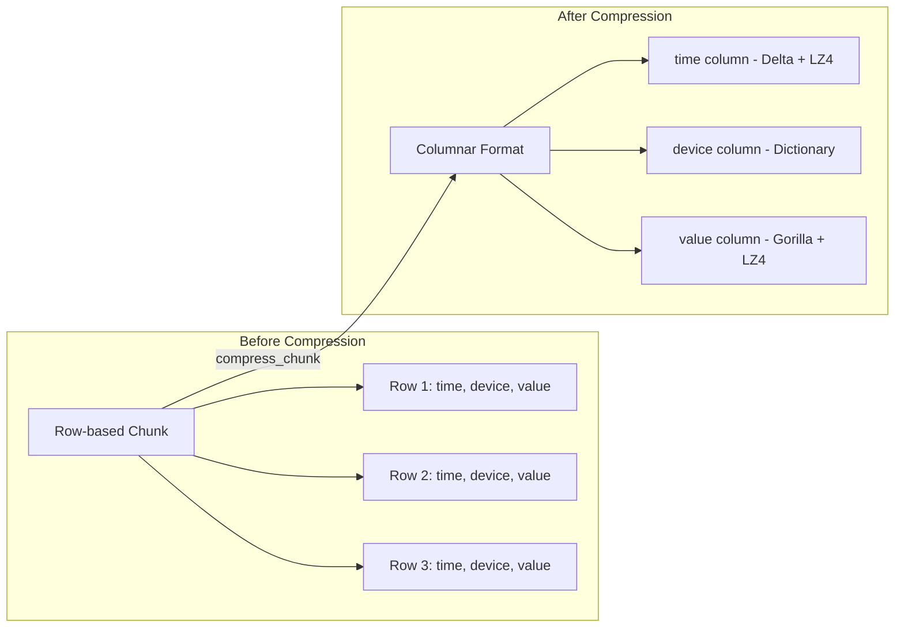
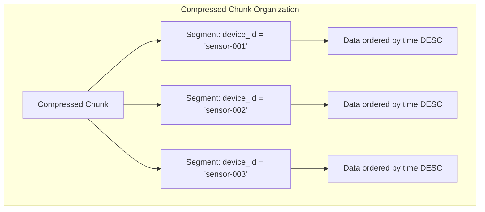
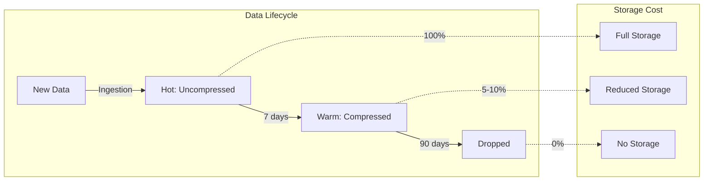

# How to Compress Data in TimescaleDB

Author: [nawazdhandala](https://www.github.com/nawazdhandala)

Tags: TimescaleDB, PostgreSQL, Data Compression, Time-Series, Database Optimization, Storage

Description: Learn how to compress data in TimescaleDB to reduce storage costs and improve query performance. Covers compression policies, segmentBy and orderBy configuration, monitoring compression ratios, and best practices for time-series data management.

---

TimescaleDB's native compression can reduce storage requirements by 90-95% while maintaining query performance. Unlike general-purpose compression, TimescaleDB uses columnar compression optimized for time-series data patterns. Understanding how to configure and manage compression effectively can dramatically reduce your infrastructure costs.

## How TimescaleDB Compression Works

TimescaleDB converts row-based chunks into a columnar format and applies type-specific compression algorithms. Each column is compressed independently using the most efficient algorithm for its data type.



### Compression Algorithms by Data Type

TimescaleDB automatically selects the optimal algorithm based on column type.

| Data Type | Compression Algorithm | Best For |
|-----------|----------------------|----------|
| TIMESTAMP | Delta-of-delta + LZ4 | Time-series timestamps |
| INTEGER/BIGINT | Delta + LZ4 | Sequential IDs, counters |
| FLOAT/DOUBLE | Gorilla + LZ4 | Metric values |
| TEXT/VARCHAR | Dictionary + LZ4 | Low-cardinality strings |
| JSONB | LZ4 | Semi-structured metadata |

## Setting Up Compression

Before enabling compression, you need a hypertable. Here is a complete setup example.

### Creating a Hypertable for Metrics

The following SQL creates a metrics table and converts it to a hypertable with 1-day chunks, which is optimal for compression scheduling.

```sql
-- Create the metrics table
CREATE TABLE metrics (
    time        TIMESTAMPTZ NOT NULL,
    device_id   TEXT NOT NULL,
    metric_name TEXT NOT NULL,
    value       DOUBLE PRECISION,
    tags        JSONB
);

-- Convert to hypertable with 1-day chunks
-- Smaller chunks compress faster and allow more granular retention
SELECT create_hypertable(
    'metrics',
    'time',
    chunk_time_interval => INTERVAL '1 day'
);

-- Create indexes for common query patterns
-- These will be converted to compressed indexes automatically
CREATE INDEX idx_metrics_device ON metrics (device_id, time DESC);
CREATE INDEX idx_metrics_name ON metrics (metric_name, time DESC);
```

### Enabling Compression on the Hypertable

Compression settings define how data is organized within compressed chunks. The segmentBy and orderBy clauses are critical for query performance.

```sql
-- Enable compression with segment and order configuration
ALTER TABLE metrics SET (
    timescaledb.compress,
    timescaledb.compress_segmentby = 'device_id',
    timescaledb.compress_orderby = 'time DESC'
);
```



### Understanding segmentBy and orderBy

Choosing the right segmentBy columns is crucial. Queries that filter by segmentBy columns only need to decompress relevant segments.

```sql
-- Example: Multiple segment columns for multi-tenant time-series
ALTER TABLE metrics SET (
    timescaledb.compress,
    timescaledb.compress_segmentby = 'device_id, metric_name',
    timescaledb.compress_orderby = 'time DESC'
);

-- Query that benefits from segmentation (only decompresses one segment)
SELECT time, value
FROM metrics
WHERE device_id = 'sensor-001'
  AND metric_name = 'temperature'
  AND time > now() - INTERVAL '1 hour';

-- Query that must scan all segments (less efficient on compressed data)
SELECT device_id, AVG(value)
FROM metrics
WHERE time > now() - INTERVAL '1 hour'
GROUP BY device_id;
```

## Compression Policies

Manual compression is tedious and error-prone. Compression policies automate the process by compressing chunks older than a specified age.

### Adding an Automatic Compression Policy

The following command creates a policy that compresses chunks older than 7 days. The scheduler runs periodically and compresses eligible chunks.

```sql
-- Compress chunks older than 7 days automatically
SELECT add_compression_policy('metrics', INTERVAL '7 days');

-- Verify the policy was created
SELECT * FROM timescaledb_information.jobs
WHERE proc_name = 'policy_compression';
```

### Viewing Compression Policy Status

Monitor your compression policies to ensure they are running successfully.

```sql
-- Check compression policy details
SELECT
    hypertable_name,
    compress_after
FROM timescaledb_information.compression_settings;

-- View recent compression job runs
SELECT
    job_id,
    total_runs,
    total_successes,
    total_failures,
    last_run_status,
    last_run_started_at,
    last_run_duration
FROM timescaledb_information.job_stats
WHERE job_id IN (
    SELECT job_id FROM timescaledb_information.jobs
    WHERE proc_name = 'policy_compression'
);
```

### Modifying or Removing Compression Policies

You can adjust compression timing or remove policies entirely.

```sql
-- Change compression age threshold
SELECT remove_compression_policy('metrics');
SELECT add_compression_policy('metrics', INTERVAL '3 days');

-- Alternatively, compress more aggressively for cost savings
SELECT add_compression_policy('metrics', INTERVAL '1 day');
```

## Manual Compression Operations

Sometimes you need to compress or decompress specific chunks manually, such as during maintenance or data corrections.

### Compressing Specific Chunks

The following query identifies uncompressed chunks and compresses them.

```sql
-- Find all uncompressed chunks older than 7 days
SELECT show_chunks('metrics', older_than => INTERVAL '7 days')
EXCEPT
SELECT chunk_name FROM timescaledb_information.chunks
WHERE hypertable_name = 'metrics' AND is_compressed = true;

-- Compress a specific chunk
SELECT compress_chunk('_timescaledb_internal._hyper_1_10_chunk');

-- Compress all chunks older than a threshold
SELECT compress_chunk(c)
FROM show_chunks('metrics', older_than => INTERVAL '7 days') c;
```

### Decompressing Chunks for Updates

Compressed chunks are read-only. To modify data, you must first decompress.

```sql
-- Decompress a specific chunk
SELECT decompress_chunk('_timescaledb_internal._hyper_1_10_chunk');

-- Update the data
UPDATE metrics
SET value = value * 1.1
WHERE time >= '2026-01-01' AND time < '2026-01-02'
  AND device_id = 'sensor-001';

-- Recompress the chunk
SELECT compress_chunk('_timescaledb_internal._hyper_1_10_chunk');
```

## Monitoring Compression

Tracking compression ratios and status helps you optimize settings and plan capacity.

### Compression Statistics Query

The following query provides detailed compression statistics for each hypertable.

```sql
-- Comprehensive compression statistics
SELECT
    hypertable_name,
    total_chunks,
    compressed_chunks,
    uncompressed_chunks,
    pg_size_pretty(before_compression_total_bytes) AS before_compression,
    pg_size_pretty(after_compression_total_bytes) AS after_compression,
    ROUND(
        (1 - after_compression_total_bytes::numeric /
             NULLIF(before_compression_total_bytes, 0)) * 100,
        2
    ) AS compression_ratio_pct
FROM (
    SELECT
        hypertable_name,
        COUNT(*) AS total_chunks,
        COUNT(*) FILTER (WHERE is_compressed) AS compressed_chunks,
        COUNT(*) FILTER (WHERE NOT is_compressed) AS uncompressed_chunks,
        SUM(before_compression_total_bytes) AS before_compression_total_bytes,
        SUM(after_compression_total_bytes) AS after_compression_total_bytes
    FROM timescaledb_information.chunks
    GROUP BY hypertable_name
) stats;
```

### Per-Chunk Compression Details

Examine individual chunks to identify compression issues or outliers.

```sql
-- Detailed chunk-level statistics
SELECT
    chunk_name,
    is_compressed,
    pg_size_pretty(before_compression_total_bytes) AS original_size,
    pg_size_pretty(after_compression_total_bytes) AS compressed_size,
    CASE
        WHEN before_compression_total_bytes > 0 THEN
            ROUND((1 - after_compression_total_bytes::numeric /
                   before_compression_total_bytes) * 100, 2)
        ELSE 0
    END AS savings_pct,
    range_start,
    range_end
FROM timescaledb_information.chunks
WHERE hypertable_name = 'metrics'
ORDER BY range_start DESC
LIMIT 20;
```

### Monitoring Dashboard Query

Create a monitoring view for ongoing observability.

```sql
-- Create a view for compression monitoring
CREATE OR REPLACE VIEW compression_dashboard AS
SELECT
    h.hypertable_name,
    COUNT(c.chunk_name) AS total_chunks,
    COUNT(c.chunk_name) FILTER (WHERE c.is_compressed) AS compressed,
    COUNT(c.chunk_name) FILTER (WHERE NOT c.is_compressed) AS uncompressed,
    pg_size_pretty(SUM(c.before_compression_total_bytes)) AS raw_size,
    pg_size_pretty(SUM(c.after_compression_total_bytes)) AS compressed_size,
    pg_size_pretty(
        SUM(c.before_compression_total_bytes) -
        COALESCE(SUM(c.after_compression_total_bytes), 0)
    ) AS space_saved,
    ROUND(
        100.0 * SUM(c.after_compression_total_bytes) /
        NULLIF(SUM(c.before_compression_total_bytes), 0),
        1
    ) AS compression_pct
FROM timescaledb_information.hypertables h
LEFT JOIN timescaledb_information.chunks c
    ON h.hypertable_name = c.hypertable_name
GROUP BY h.hypertable_name;

-- Query the dashboard
SELECT * FROM compression_dashboard;
```

## Compression with Data Retention

Combining compression with retention policies creates an efficient data lifecycle.



### Setting Up a Complete Data Lifecycle

The following configuration implements a typical hot/warm/drop lifecycle pattern.

```sql
-- Create hypertable with appropriate chunk interval
SELECT create_hypertable('metrics', 'time', chunk_time_interval => INTERVAL '1 day');

-- Enable compression
ALTER TABLE metrics SET (
    timescaledb.compress,
    timescaledb.compress_segmentby = 'device_id',
    timescaledb.compress_orderby = 'time DESC'
);

-- Compress data after 7 days (warm tier)
SELECT add_compression_policy('metrics', INTERVAL '7 days');

-- Drop data after 90 days
SELECT add_retention_policy('metrics', INTERVAL '90 days');

-- Verify both policies
SELECT
    job_id,
    proc_name,
    schedule_interval,
    config
FROM timescaledb_information.jobs
WHERE hypertable_name = 'metrics';
```

## Optimizing Compression Performance

Several factors affect compression efficiency and query performance on compressed data.

### Chunk Sizing Recommendations

Chunk size affects both compression ratio and query performance.

```sql
-- For high-ingest workloads (millions of rows per day)
-- Use smaller chunks for faster compression
SELECT create_hypertable(
    'high_volume_metrics',
    'time',
    chunk_time_interval => INTERVAL '1 hour'
);

-- For lower-ingest workloads (thousands of rows per day)
-- Use larger chunks for better compression ratios
SELECT create_hypertable(
    'low_volume_metrics',
    'time',
    chunk_time_interval => INTERVAL '1 week'
);
```

### Optimizing segmentBy Selection

The segmentBy columns should match your most common query filters.

```sql
-- Analyze query patterns to determine segmentBy
-- Look for columns frequently used in WHERE clauses
SELECT
    query,
    calls,
    mean_exec_time
FROM pg_stat_statements
WHERE query ILIKE '%metrics%'
ORDER BY calls DESC
LIMIT 10;

-- Good segmentBy: columns with moderate cardinality (100-10000 unique values)
-- Bad segmentBy: high-cardinality columns (millions of unique values)
-- Bad segmentBy: columns rarely used in WHERE clauses

-- Example: Multi-column segmentBy for complex query patterns
ALTER TABLE metrics SET (
    timescaledb.compress,
    timescaledb.compress_segmentby = 'device_id, region',
    timescaledb.compress_orderby = 'metric_name, time DESC'
);
```

### Recompression After Schema Changes

When you modify compression settings, existing compressed chunks use old settings. Recompress to apply new configuration.

```sql
-- Update compression settings
ALTER TABLE metrics SET (
    timescaledb.compress,
    timescaledb.compress_segmentby = 'device_id, metric_name',
    timescaledb.compress_orderby = 'time DESC'
);

-- Recompress existing chunks with new settings
-- First decompress, then recompress
DO $$
DECLARE
    chunk_rec RECORD;
BEGIN
    FOR chunk_rec IN
        SELECT chunk_name
        FROM timescaledb_information.chunks
        WHERE hypertable_name = 'metrics'
        AND is_compressed = true
    LOOP
        PERFORM decompress_chunk(chunk_rec.chunk_name);
        PERFORM compress_chunk(chunk_rec.chunk_name);
    END LOOP;
END $$;
```

## Querying Compressed Data

Compressed data remains fully queryable. TimescaleDB transparently decompresses data during query execution.

### Query Performance Considerations

Certain query patterns perform better on compressed data than others.

```sql
-- Efficient query: Uses segmentBy column in filter
-- Only decompresses segments for device_id = 'sensor-001'
EXPLAIN ANALYZE
SELECT time, value
FROM metrics
WHERE device_id = 'sensor-001'
  AND time > now() - INTERVAL '24 hours'
ORDER BY time DESC;

-- Less efficient: Must scan all segments
-- Consider adding time-based partitioning or adjusting segmentBy
EXPLAIN ANALYZE
SELECT device_id, AVG(value)
FROM metrics
WHERE time > now() - INTERVAL '24 hours'
GROUP BY device_id;
```

### Using Continuous Aggregates with Compression

Continuous aggregates work seamlessly with compressed data and can improve query performance dramatically.

```sql
-- Create a continuous aggregate for hourly rollups
CREATE MATERIALIZED VIEW metrics_hourly
WITH (timescaledb.continuous) AS
SELECT
    time_bucket('1 hour', time) AS bucket,
    device_id,
    metric_name,
    AVG(value) AS avg_value,
    MIN(value) AS min_value,
    MAX(value) AS max_value,
    COUNT(*) AS sample_count
FROM metrics
GROUP BY bucket, device_id, metric_name;

-- Add refresh policy
SELECT add_continuous_aggregate_policy(
    'metrics_hourly',
    start_offset => INTERVAL '3 hours',
    end_offset => INTERVAL '1 hour',
    schedule_interval => INTERVAL '1 hour'
);

-- Enable compression on the continuous aggregate
ALTER MATERIALIZED VIEW metrics_hourly SET (
    timescaledb.compress = true
);

SELECT add_compression_policy('metrics_hourly', INTERVAL '30 days');
```

## Troubleshooting Common Issues

Address common compression problems with these diagnostic queries and solutions.

### Compression Job Failures

Identify and resolve compression job failures.

```sql
-- Check for failed compression jobs
SELECT
    job_id,
    proc_name,
    last_run_status,
    last_run_started_at,
    total_failures,
    config
FROM timescaledb_information.job_stats js
JOIN timescaledb_information.jobs j USING (job_id)
WHERE proc_name = 'policy_compression'
  AND last_run_status != 'Success';

-- View detailed job errors
SELECT
    job_id,
    finish_time,
    err_message
FROM timescaledb_information.job_errors
WHERE job_id IN (
    SELECT job_id FROM timescaledb_information.jobs
    WHERE proc_name = 'policy_compression'
)
ORDER BY finish_time DESC
LIMIT 10;
```

### Poor Compression Ratios

Investigate chunks with lower-than-expected compression.

```sql
-- Find chunks with poor compression (less than 50% reduction)
SELECT
    chunk_name,
    pg_size_pretty(before_compression_total_bytes) AS original,
    pg_size_pretty(after_compression_total_bytes) AS compressed,
    ROUND(
        100.0 * after_compression_total_bytes /
        NULLIF(before_compression_total_bytes, 0),
        1
    ) AS ratio_pct
FROM timescaledb_information.chunks
WHERE hypertable_name = 'metrics'
  AND is_compressed = true
  AND after_compression_total_bytes::numeric /
      NULLIF(before_compression_total_bytes, 0) > 0.5
ORDER BY ratio_pct DESC;

-- Common causes of poor compression:
-- 1. High cardinality in segmentBy columns
-- 2. Random data patterns in value columns
-- 3. Large JSONB or TEXT columns with unique values
-- 4. Very small chunks (insufficient data for compression)
```

### Lock Contention During Compression

Compression can block or be blocked by concurrent operations.

```sql
-- Monitor compression-related locks
SELECT
    l.pid,
    a.query,
    l.mode,
    l.granted,
    a.wait_event_type,
    a.wait_event
FROM pg_locks l
JOIN pg_stat_activity a ON l.pid = a.pid
WHERE a.query ILIKE '%compress%'
   OR l.relation::regclass::text LIKE '%hyper%';

-- Schedule compression during low-traffic periods
-- Remove and recreate policy with specific schedule
SELECT remove_compression_policy('metrics');
SELECT add_compression_policy(
    'metrics',
    INTERVAL '7 days',
    schedule_interval => INTERVAL '1 day',
    initial_start => '2026-02-03 03:00:00'::timestamptz  -- 3 AM start
);
```

## Summary

TimescaleDB compression provides significant storage savings for time-series data with minimal query performance impact.

Key takeaways:

1. **Enable compression early** - Plan compression settings during schema design
2. **Choose segmentBy wisely** - Match columns to your most common query filters
3. **Automate with policies** - Let TimescaleDB handle compression scheduling
4. **Combine with retention** - Create a complete data lifecycle strategy
5. **Monitor continuously** - Track compression ratios and job success rates
6. **Use continuous aggregates** - Pre-aggregate data for faster analytical queries
7. **Size chunks appropriately** - Balance compression efficiency with operational needs

Proper compression configuration can reduce storage costs by 90% or more while maintaining excellent query performance on your time-series workloads.

---

**Need to monitor your TimescaleDB instances in production?** [OneUptime](https://oneuptime.com) provides comprehensive database monitoring with support for PostgreSQL and TimescaleDB. Track query performance, monitor compression job status, and set up alerts for storage usage and job failures. Start monitoring your time-series infrastructure today with OneUptime's free tier.
