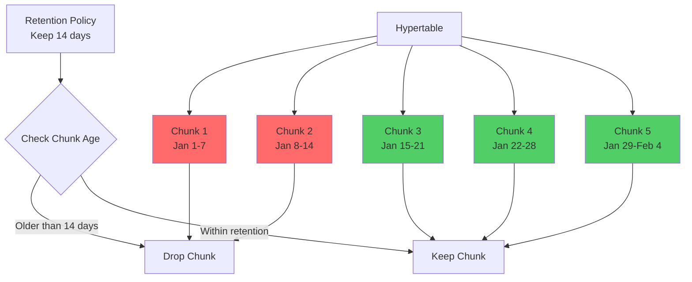
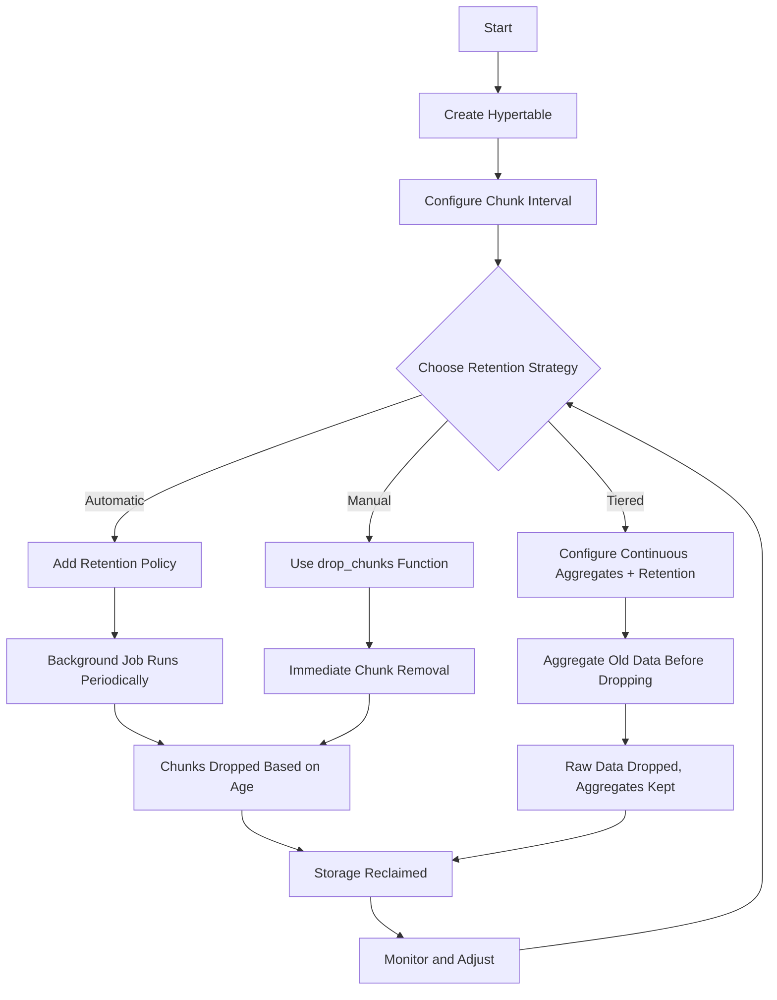
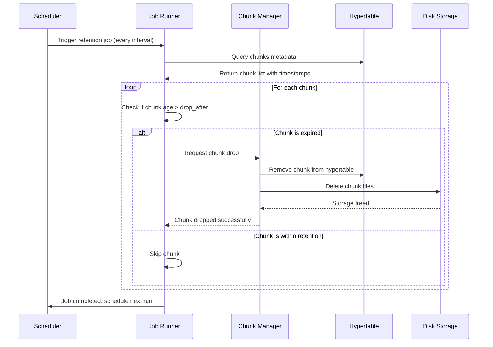
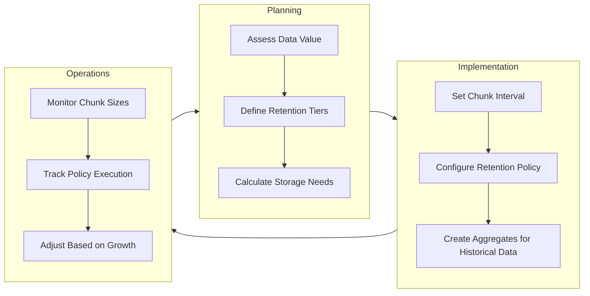

# How to Configure Data Retention Policies in TimescaleDB

Author: [nawazdhandala](https://github.com/nawazdhandala)

Tags: TimescaleDB, PostgreSQL, Data Retention, Time-Series, Database

Description: Learn how to configure data retention policies in TimescaleDB to automatically manage time-series data lifecycle, optimize storage costs, and maintain query performance with practical examples and best practices.

---

Time-series databases accumulate data rapidly, making storage management a critical concern. TimescaleDB provides powerful built-in tools for automating data retention through policies that delete old data based on age thresholds. Properly configured retention policies help you balance storage costs, query performance, and compliance requirements.

## Understanding Data Retention in TimescaleDB

TimescaleDB stores time-series data in chunks, which are automatically partitioned based on time intervals. Retention policies leverage this chunked architecture to efficiently drop entire chunks instead of deleting individual rows.

The following diagram illustrates how TimescaleDB organizes data into chunks and applies retention policies:



## Prerequisites

Before configuring retention policies, ensure you have the TimescaleDB extension enabled and a hypertable created.

The following SQL enables the TimescaleDB extension and creates a sample hypertable for sensor metrics:

```sql
-- Enable TimescaleDB extension
CREATE EXTENSION IF NOT EXISTS timescaledb;

-- Create a regular table for sensor data
CREATE TABLE sensor_metrics (
    time        TIMESTAMPTZ NOT NULL,
    sensor_id   INTEGER NOT NULL,
    temperature DOUBLE PRECISION,
    humidity    DOUBLE PRECISION,
    pressure    DOUBLE PRECISION
);

-- Convert to hypertable with 1-day chunks
-- The chunk_time_interval determines how data is partitioned
SELECT create_hypertable(
    'sensor_metrics',
    'time',
    chunk_time_interval => INTERVAL '1 day'
);

-- Create an index for efficient queries by sensor
CREATE INDEX idx_sensor_metrics_sensor_id ON sensor_metrics (sensor_id, time DESC);
```

## Basic Retention Policy Configuration

TimescaleDB provides the `add_retention_policy` function to automatically drop chunks older than a specified interval.

The following example creates a retention policy that keeps data for 30 days:

```sql
-- Add a retention policy to keep data for 30 days
-- The policy runs automatically in the background
SELECT add_retention_policy(
    'sensor_metrics',
    drop_after => INTERVAL '30 days'
);

-- Verify the policy was created
SELECT * FROM timescaledb_information.jobs
WHERE proc_name = 'policy_retention';
```

The output shows the scheduled job details:

```
 job_id |    application_name    | schedule_interval | max_runtime | max_retries | retry_period |     proc_schema      |    proc_name     |       owner
--------+------------------------+-------------------+-------------+-------------+--------------+----------------------+------------------+-------------------
   1001 | Retention Policy [1001] | 1 day            | 00:05:00    | -1          | 00:05:00     | _timescaledb_internal | policy_retention | postgres
```

## Configuring Policy Schedule

By default, retention policies run once per day. You can customize the schedule using additional parameters.

The following example creates a policy that runs every 12 hours with custom retry settings:

```sql
-- Add a retention policy with custom schedule
-- schedule_interval: How often to run the policy
-- initial_start: When to start the first run
-- if_not_exists: Avoid error if policy already exists
SELECT add_retention_policy(
    'sensor_metrics',
    drop_after => INTERVAL '30 days',
    schedule_interval => INTERVAL '12 hours',
    initial_start => '2026-02-02 00:00:00'::timestamptz,
    if_not_exists => true
);
```

## Manual Data Retention

Sometimes you need to manually remove old data without waiting for the scheduled policy. TimescaleDB provides the `drop_chunks` function for immediate chunk removal.

The following SQL demonstrates different ways to manually drop chunks:

```sql
-- Drop all chunks older than 30 days from a specific hypertable
SELECT drop_chunks(
    'sensor_metrics',
    older_than => INTERVAL '30 days'
);

-- Drop chunks older than a specific timestamp
SELECT drop_chunks(
    'sensor_metrics',
    older_than => '2026-01-01 00:00:00'::timestamptz
);

-- Drop chunks within a time range (useful for GDPR compliance)
-- newer_than and older_than create a window
SELECT drop_chunks(
    'sensor_metrics',
    older_than => '2026-01-15 00:00:00'::timestamptz,
    newer_than => '2026-01-01 00:00:00'::timestamptz
);
```

## Data Retention Workflow

The following diagram shows the complete workflow for implementing data retention in TimescaleDB:



## Tiered Data Retention with Continuous Aggregates

For many use cases, you want to keep detailed data for recent periods and aggregated summaries for historical analysis. Continuous aggregates enable this tiered approach.

The following example creates a continuous aggregate for hourly summaries before dropping raw data:

```sql
-- Create a continuous aggregate for hourly summaries
-- WITH (timescaledb.continuous) marks this as a continuous aggregate
CREATE MATERIALIZED VIEW sensor_metrics_hourly
WITH (timescaledb.continuous) AS
SELECT
    time_bucket('1 hour', time) AS bucket,
    sensor_id,
    AVG(temperature) AS avg_temperature,
    MIN(temperature) AS min_temperature,
    MAX(temperature) AS max_temperature,
    AVG(humidity) AS avg_humidity,
    AVG(pressure) AS avg_pressure,
    COUNT(*) AS sample_count
FROM sensor_metrics
GROUP BY bucket, sensor_id
WITH NO DATA;

-- Add a refresh policy to keep the aggregate up to date
-- The aggregate refreshes data between end_offset and start_offset
SELECT add_continuous_aggregate_policy(
    'sensor_metrics_hourly',
    start_offset => INTERVAL '3 days',
    end_offset => INTERVAL '1 hour',
    schedule_interval => INTERVAL '1 hour'
);

-- Now add retention policies for both raw and aggregated data
-- Raw data: keep 7 days
SELECT add_retention_policy(
    'sensor_metrics',
    drop_after => INTERVAL '7 days'
);

-- Aggregated data: keep 1 year
SELECT add_retention_policy(
    'sensor_metrics_hourly',
    drop_after => INTERVAL '365 days'
);
```

## Monitoring Retention Policies

Regularly monitoring your retention policies ensures they are running correctly and maintaining expected storage levels.

The following queries help you monitor retention policy status and chunk information:

```sql
-- View all retention policies and their status
SELECT
    j.job_id,
    j.hypertable_name,
    j.proc_name,
    j.schedule_interval,
    js.last_run_started_at,
    js.last_successful_finish,
    js.next_start,
    js.total_runs,
    js.total_successes,
    js.total_failures
FROM timescaledb_information.jobs j
LEFT JOIN timescaledb_information.job_stats js ON j.job_id = js.job_id
WHERE j.proc_name = 'policy_retention';

-- View chunks and their sizes for a hypertable
SELECT
    chunk_schema,
    chunk_name,
    range_start,
    range_end,
    pg_size_pretty(total_bytes) AS size,
    pg_size_pretty(table_bytes) AS table_size,
    pg_size_pretty(index_bytes) AS index_size
FROM chunks_detailed_size('sensor_metrics')
ORDER BY range_start DESC;

-- Check total hypertable size
SELECT
    hypertable_name,
    pg_size_pretty(hypertable_size(format('%I.%I', hypertable_schema, hypertable_name)::regclass)) AS total_size,
    num_chunks
FROM timescaledb_information.hypertables;
```

## Retention Policy Architecture

The following diagram illustrates the internal architecture of TimescaleDB retention policies:



## Managing Multiple Retention Policies

Large applications often have multiple hypertables with different retention requirements.

The following example shows how to manage retention policies across multiple tables:

```sql
-- Create multiple hypertables with different purposes
CREATE TABLE access_logs (
    time        TIMESTAMPTZ NOT NULL,
    user_id     INTEGER,
    endpoint    TEXT,
    status_code INTEGER,
    duration_ms INTEGER
);

CREATE TABLE error_logs (
    time        TIMESTAMPTZ NOT NULL,
    service     TEXT,
    level       TEXT,
    message     TEXT,
    stack_trace TEXT
);

CREATE TABLE audit_logs (
    time        TIMESTAMPTZ NOT NULL,
    user_id     INTEGER,
    action      TEXT,
    resource    TEXT,
    details     JSONB
);

-- Convert to hypertables
SELECT create_hypertable('access_logs', 'time', chunk_time_interval => INTERVAL '1 day');
SELECT create_hypertable('error_logs', 'time', chunk_time_interval => INTERVAL '1 day');
SELECT create_hypertable('audit_logs', 'time', chunk_time_interval => INTERVAL '7 days');

-- Apply different retention policies based on data importance
-- Access logs: 30 days (operational monitoring)
SELECT add_retention_policy('access_logs', drop_after => INTERVAL '30 days');

-- Error logs: 90 days (debugging and analysis)
SELECT add_retention_policy('error_logs', drop_after => INTERVAL '90 days');

-- Audit logs: 7 years (compliance requirements)
SELECT add_retention_policy('audit_logs', drop_after => INTERVAL '7 years');

-- View all retention policies in the database
SELECT
    j.hypertable_schema,
    j.hypertable_name,
    config->>'drop_after' AS retention_period,
    j.schedule_interval
FROM timescaledb_information.jobs j
WHERE j.proc_name = 'policy_retention'
ORDER BY j.hypertable_name;
```

## Modifying and Removing Retention Policies

Requirements change over time, and you may need to update or remove existing policies.

The following examples demonstrate how to modify and remove retention policies:

```sql
-- Remove an existing retention policy
-- First, find the job_id
SELECT job_id, hypertable_name, config
FROM timescaledb_information.jobs
WHERE proc_name = 'policy_retention'
  AND hypertable_name = 'sensor_metrics';

-- Remove the policy using its job_id
SELECT remove_retention_policy('sensor_metrics');

-- Add a new policy with updated settings
SELECT add_retention_policy(
    'sensor_metrics',
    drop_after => INTERVAL '60 days'  -- Changed from 30 to 60 days
);

-- Alternative: Modify the job directly for schedule changes
-- Find the job_id first
SELECT alter_job(
    1001,  -- Replace with actual job_id
    schedule_interval => INTERVAL '6 hours',
    next_start => NOW() + INTERVAL '1 hour'
);
```

## Best Practices

The following diagram summarizes key best practices for data retention in TimescaleDB:



### Chunk Interval Guidelines

Choosing the right chunk interval affects both retention efficiency and query performance.

The following table provides guidelines for chunk interval selection:

| Data Ingestion Rate | Recommended Chunk Interval | Retention Granularity |
|---------------------|---------------------------|----------------------|
| < 1 GB/day          | 1 week                    | Weekly               |
| 1-10 GB/day         | 1 day                     | Daily                |
| 10-100 GB/day       | 6-12 hours                | Sub-daily            |
| > 100 GB/day        | 1-4 hours                 | Hourly               |

### Storage Estimation

The following SQL helps estimate storage requirements based on current data patterns:

```sql
-- Calculate average chunk size and estimate future storage
WITH chunk_stats AS (
    SELECT
        hypertable_name,
        AVG(total_bytes) AS avg_chunk_bytes,
        COUNT(*) AS chunk_count,
        MIN(range_start) AS oldest_chunk,
        MAX(range_end) AS newest_chunk
    FROM chunks_detailed_size('sensor_metrics')
    GROUP BY hypertable_name
)
SELECT
    hypertable_name,
    pg_size_pretty(avg_chunk_bytes::bigint) AS avg_chunk_size,
    chunk_count,
    -- Estimate storage for different retention periods
    pg_size_pretty((avg_chunk_bytes * 30)::bigint) AS est_30_day_storage,
    pg_size_pretty((avg_chunk_bytes * 90)::bigint) AS est_90_day_storage,
    pg_size_pretty((avg_chunk_bytes * 365)::bigint) AS est_1_year_storage
FROM chunk_stats;
```

## Troubleshooting Common Issues

### Policy Not Running

When a retention policy is not executing as expected, check the job status and logs.

```sql
-- Check for failed jobs
SELECT
    job_id,
    hypertable_name,
    last_run_started_at,
    last_successful_finish,
    last_run_status,
    total_failures
FROM timescaledb_information.job_stats js
JOIN timescaledb_information.jobs j USING (job_id)
WHERE j.proc_name = 'policy_retention';

-- View job errors in PostgreSQL logs
-- Or query the job_errors table if available
SELECT * FROM timescaledb_information.job_errors
ORDER BY finish_time DESC
LIMIT 10;

-- Manually run a retention policy for testing
CALL run_job(1001);  -- Replace with actual job_id
```

### Chunks Not Being Dropped

Chunks may not be dropped if there are active transactions or locks.

```sql
-- Check for long-running transactions that might block chunk drops
SELECT
    pid,
    usename,
    state,
    query_start,
    NOW() - query_start AS duration,
    LEFT(query, 100) AS query_preview
FROM pg_stat_activity
WHERE state != 'idle'
  AND query_start < NOW() - INTERVAL '5 minutes'
ORDER BY query_start;

-- Verify chunk timestamps match expectations
SELECT
    chunk_name,
    range_start,
    range_end,
    NOW() - range_end AS age
FROM timescaledb_information.chunks
WHERE hypertable_name = 'sensor_metrics'
ORDER BY range_start;
```

## Complete Example: Production Setup

The following example demonstrates a complete production setup with tiered retention:

```sql
-- Production-ready data retention configuration

-- 1. Create the main metrics table
CREATE TABLE app_metrics (
    time           TIMESTAMPTZ NOT NULL,
    host           TEXT NOT NULL,
    service        TEXT NOT NULL,
    metric_name    TEXT NOT NULL,
    metric_value   DOUBLE PRECISION,
    tags           JSONB
);

-- 2. Convert to hypertable with appropriate chunk interval
SELECT create_hypertable(
    'app_metrics',
    'time',
    chunk_time_interval => INTERVAL '6 hours',
    create_default_indexes => false
);

-- 3. Create optimized indexes
CREATE INDEX idx_app_metrics_time ON app_metrics (time DESC);
CREATE INDEX idx_app_metrics_host_time ON app_metrics (host, time DESC);
CREATE INDEX idx_app_metrics_service_metric ON app_metrics (service, metric_name, time DESC);

-- 4. Enable compression for older chunks (requires TimescaleDB 2.0+)
ALTER TABLE app_metrics SET (
    timescaledb.compress,
    timescaledb.compress_segmentby = 'host, service, metric_name'
);

-- Add compression policy - compress chunks older than 1 day
SELECT add_compression_policy('app_metrics', INTERVAL '1 day');

-- 5. Create hourly aggregate for historical analysis
CREATE MATERIALIZED VIEW app_metrics_hourly
WITH (timescaledb.continuous) AS
SELECT
    time_bucket('1 hour', time) AS bucket,
    host,
    service,
    metric_name,
    AVG(metric_value) AS avg_value,
    MIN(metric_value) AS min_value,
    MAX(metric_value) AS max_value,
    COUNT(*) AS sample_count
FROM app_metrics
GROUP BY bucket, host, service, metric_name
WITH NO DATA;

-- 6. Create daily aggregate for long-term trends
CREATE MATERIALIZED VIEW app_metrics_daily
WITH (timescaledb.continuous) AS
SELECT
    time_bucket('1 day', bucket) AS bucket,
    host,
    service,
    metric_name,
    AVG(avg_value) AS avg_value,
    MIN(min_value) AS min_value,
    MAX(max_value) AS max_value,
    SUM(sample_count) AS sample_count
FROM app_metrics_hourly
GROUP BY time_bucket('1 day', bucket), host, service, metric_name
WITH NO DATA;

-- 7. Configure refresh policies for aggregates
SELECT add_continuous_aggregate_policy(
    'app_metrics_hourly',
    start_offset => INTERVAL '2 days',
    end_offset => INTERVAL '1 hour',
    schedule_interval => INTERVAL '1 hour'
);

SELECT add_continuous_aggregate_policy(
    'app_metrics_daily',
    start_offset => INTERVAL '7 days',
    end_offset => INTERVAL '1 day',
    schedule_interval => INTERVAL '1 day'
);

-- 8. Configure tiered retention policies
-- Raw data: 7 days (high granularity for recent debugging)
SELECT add_retention_policy('app_metrics', drop_after => INTERVAL '7 days');

-- Hourly aggregates: 90 days (medium granularity for analysis)
SELECT add_retention_policy('app_metrics_hourly', drop_after => INTERVAL '90 days');

-- Daily aggregates: 2 years (low granularity for trends)
SELECT add_retention_policy('app_metrics_daily', drop_after => INTERVAL '730 days');

-- 9. Verify the complete setup
SELECT
    j.hypertable_name,
    j.proc_name,
    CASE j.proc_name
        WHEN 'policy_retention' THEN config->>'drop_after'
        WHEN 'policy_compression' THEN config->>'compress_after'
        WHEN 'policy_refresh_continuous_aggregate' THEN
            config->>'start_offset' || ' to ' || config->>'end_offset'
    END AS policy_config,
    j.schedule_interval
FROM timescaledb_information.jobs j
WHERE j.proc_name LIKE 'policy_%'
ORDER BY j.hypertable_name, j.proc_name;
```

## Summary

Data retention policies in TimescaleDB provide an automated, efficient way to manage time-series data lifecycle. By leveraging the chunked architecture, retention operations are fast and non-disruptive. Key takeaways include:

- Use `add_retention_policy` for automatic chunk removal based on age
- Combine retention with continuous aggregates for tiered data strategies
- Monitor policy execution and chunk sizes regularly
- Choose chunk intervals based on your data ingestion rate
- Consider compression policies alongside retention for additional storage savings

Properly configured retention policies ensure your TimescaleDB deployment remains performant and cost-effective as your data grows.
