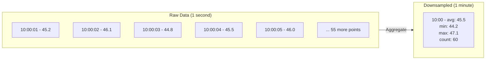
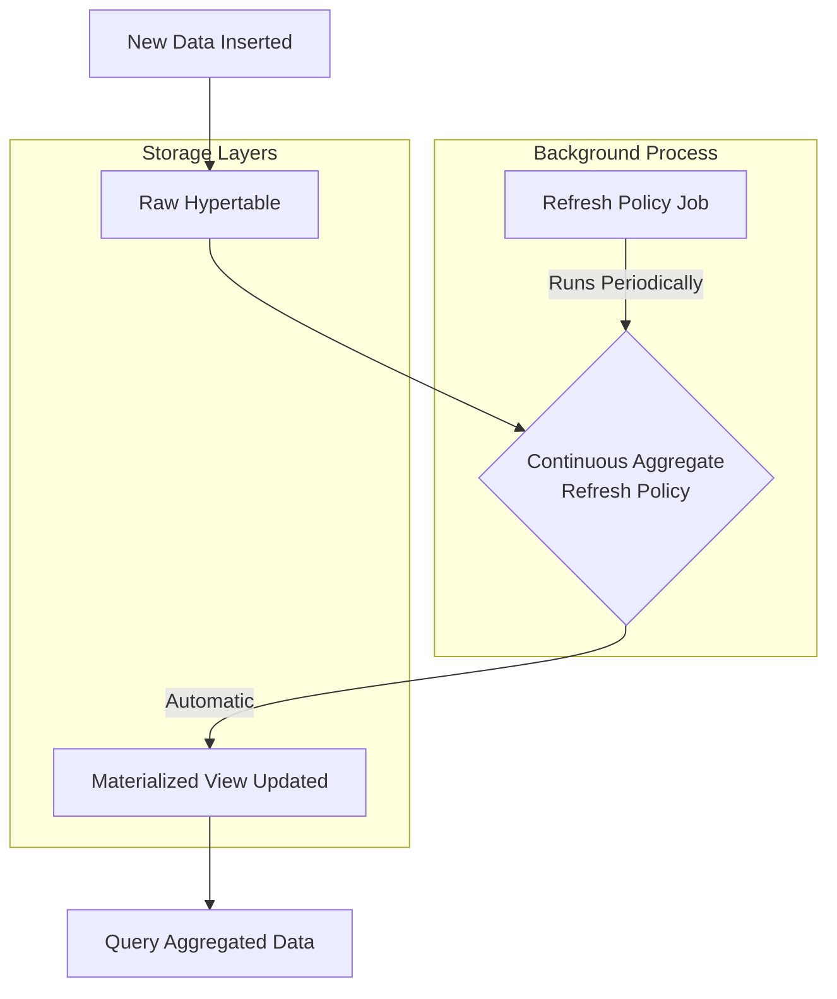
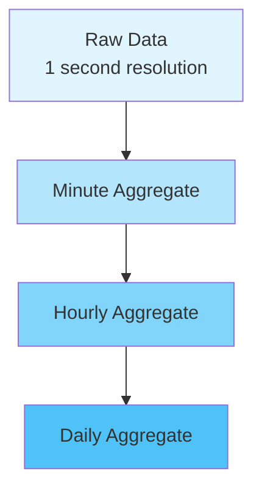
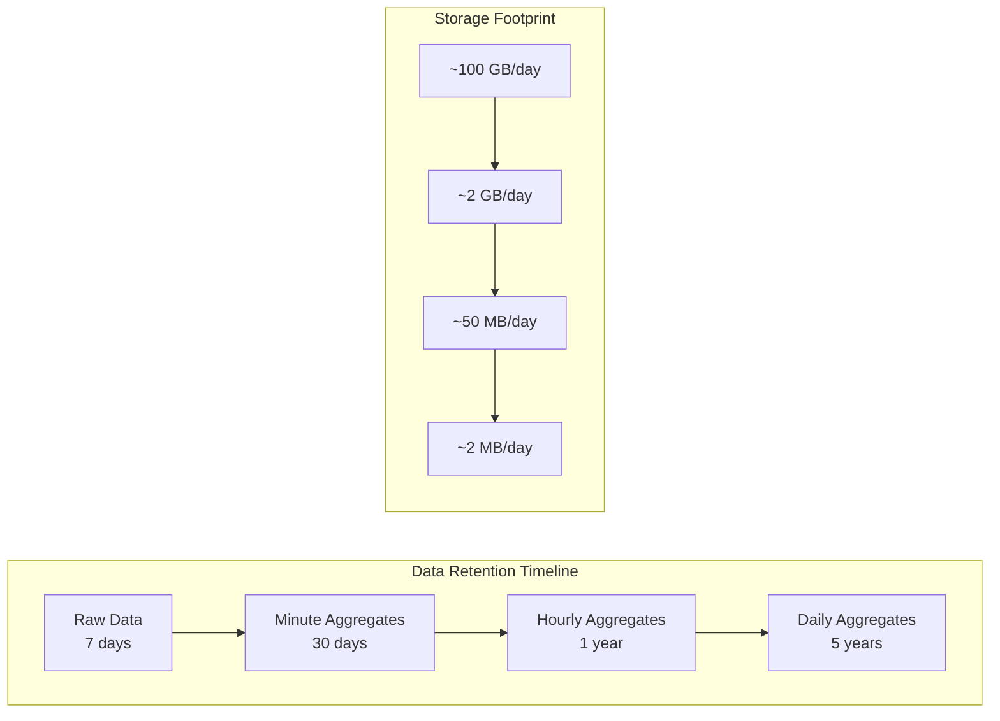
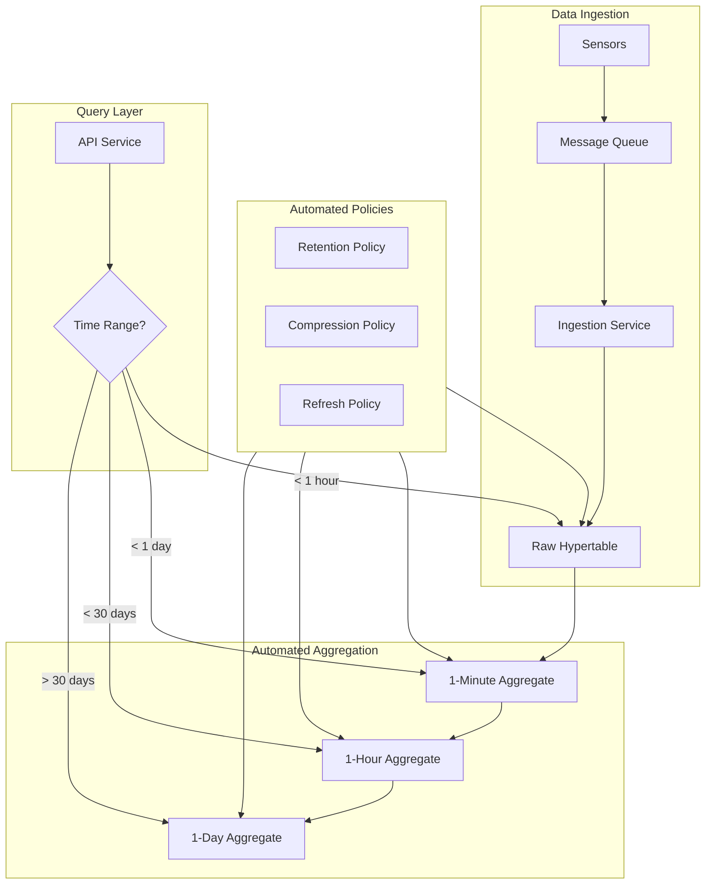

# How to Implement Downsampling in TimescaleDB

Author: [nawazdhandala](https://www.github.com/nawazdhandala)

Tags: TimescaleDB, PostgreSQL, Time-Series, Downsampling, Data Management, Performance

Description: Learn how to implement downsampling in TimescaleDB to reduce storage costs and improve query performance. Covering continuous aggregates, retention policies, manual downsampling techniques, and production best practices.

---

Managing time-series data at scale presents significant storage and performance challenges. As data accumulates over months and years, storage costs increase dramatically while older high-resolution data provides diminishing analytical value. Downsampling solves these problems by aggregating fine-grained data into coarser time buckets, preserving trends while reducing storage requirements by 90% or more.

## Understanding Downsampling

Downsampling transforms high-resolution time-series data into lower-resolution summaries. Instead of storing every data point collected at one-second intervals, you aggregate them into minute, hour, or day-level summaries containing statistical measures like averages, minimums, maximums, and counts.

The following diagram illustrates the downsampling concept.



## Setting Up TimescaleDB

Before implementing downsampling, ensure TimescaleDB is properly installed and your hypertable is configured.

The following SQL creates a sample metrics table and converts it to a hypertable.

```sql
-- Create the TimescaleDB extension if not already installed
CREATE EXTENSION IF NOT EXISTS timescaledb;

-- Create a table for storing sensor metrics
-- The time column will be used for hypertable partitioning
CREATE TABLE sensor_metrics (
    time        TIMESTAMPTZ NOT NULL,
    sensor_id   INTEGER NOT NULL,
    temperature DOUBLE PRECISION,
    humidity    DOUBLE PRECISION,
    pressure    DOUBLE PRECISION
);

-- Convert the regular table to a hypertable
-- Partitions data by time in 1-day chunks for optimal query performance
SELECT create_hypertable('sensor_metrics', 'time', chunk_time_interval => INTERVAL '1 day');

-- Create an index on sensor_id for faster filtering
CREATE INDEX idx_sensor_metrics_sensor_id ON sensor_metrics (sensor_id, time DESC);
```

## Continuous Aggregates Overview

Continuous aggregates are TimescaleDB's recommended approach for downsampling. They automatically maintain materialized views that update incrementally as new data arrives, without requiring manual refresh operations.

The following diagram shows how continuous aggregates work.



## Creating Continuous Aggregates

Continuous aggregates support multiple time granularities. Create separate aggregates for different analysis needs.

The following SQL creates a minute-level continuous aggregate with common statistical functions.

```sql
-- Create a continuous aggregate for minute-level summaries
-- WITH NO DATA skips initial materialization for faster creation
-- Materialization will happen when the refresh policy runs
CREATE MATERIALIZED VIEW sensor_metrics_minute
WITH (timescaledb.continuous) AS
SELECT
    -- time_bucket groups data into 1-minute intervals
    time_bucket('1 minute', time) AS bucket,
    sensor_id,
    -- Calculate statistical aggregates for each bucket
    AVG(temperature) AS avg_temperature,
    MIN(temperature) AS min_temperature,
    MAX(temperature) AS max_temperature,
    -- Count provides data density information
    COUNT(*) AS sample_count,
    -- Standard deviation helps identify anomalies
    STDDEV(temperature) AS stddev_temperature,
    -- Aggregate other metrics similarly
    AVG(humidity) AS avg_humidity,
    AVG(pressure) AS avg_pressure
FROM sensor_metrics
GROUP BY bucket, sensor_id
WITH NO DATA;

-- Add a refresh policy to automatically update the aggregate
-- Runs every minute, processing data from 3 minutes ago to 1 minute ago
-- The lag accounts for late-arriving data
SELECT add_continuous_aggregate_policy('sensor_metrics_minute',
    start_offset => INTERVAL '3 minutes',
    end_offset => INTERVAL '1 minute',
    schedule_interval => INTERVAL '1 minute'
);
```

The following SQL creates an hourly aggregate for longer-term analysis.

```sql
-- Create an hourly continuous aggregate
-- Ideal for dashboards showing daily or weekly trends
CREATE MATERIALIZED VIEW sensor_metrics_hourly
WITH (timescaledb.continuous) AS
SELECT
    time_bucket('1 hour', time) AS bucket,
    sensor_id,
    AVG(temperature) AS avg_temperature,
    MIN(temperature) AS min_temperature,
    MAX(temperature) AS max_temperature,
    COUNT(*) AS sample_count,
    -- Percentiles provide distribution insights
    -- Note: percentile_cont requires ordered data within each bucket
    PERCENTILE_CONT(0.50) WITHIN GROUP (ORDER BY temperature) AS median_temperature,
    PERCENTILE_CONT(0.95) WITHIN GROUP (ORDER BY temperature) AS p95_temperature,
    AVG(humidity) AS avg_humidity,
    AVG(pressure) AS avg_pressure
FROM sensor_metrics
GROUP BY bucket, sensor_id
WITH NO DATA;

-- Refresh policy for hourly aggregate
-- Processes data from 4 hours ago to 1 hour ago
SELECT add_continuous_aggregate_policy('sensor_metrics_hourly',
    start_offset => INTERVAL '4 hours',
    end_offset => INTERVAL '1 hour',
    schedule_interval => INTERVAL '1 hour'
);
```

The following SQL creates a daily aggregate for long-term storage.

```sql
-- Create a daily continuous aggregate for historical analysis
-- Daily aggregates are typically retained for years
CREATE MATERIALIZED VIEW sensor_metrics_daily
WITH (timescaledb.continuous) AS
SELECT
    time_bucket('1 day', time) AS bucket,
    sensor_id,
    AVG(temperature) AS avg_temperature,
    MIN(temperature) AS min_temperature,
    MAX(temperature) AS max_temperature,
    COUNT(*) AS sample_count,
    -- First and last values help identify trends
    FIRST(temperature, time) AS first_temperature,
    LAST(temperature, time) AS last_temperature,
    AVG(humidity) AS avg_humidity,
    AVG(pressure) AS avg_pressure
FROM sensor_metrics
GROUP BY bucket, sensor_id
WITH NO DATA;

-- Refresh policy for daily aggregate
SELECT add_continuous_aggregate_policy('sensor_metrics_daily',
    start_offset => INTERVAL '3 days',
    end_offset => INTERVAL '1 day',
    schedule_interval => INTERVAL '1 day'
);
```

## Hierarchical Continuous Aggregates

TimescaleDB supports creating continuous aggregates from other continuous aggregates. Building hierarchical aggregates improves refresh performance by avoiding repeated scans of raw data.

The following diagram shows a hierarchical aggregate structure.



The following SQL creates a hierarchical hourly aggregate from the minute aggregate.

```sql
-- Create hourly aggregate from minute aggregate instead of raw data
-- Significantly faster refresh since minute data is already aggregated
CREATE MATERIALIZED VIEW sensor_metrics_hourly_hierarchical
WITH (timescaledb.continuous) AS
SELECT
    -- Bucket the already-bucketed minute data into hours
    time_bucket('1 hour', bucket) AS bucket,
    sensor_id,
    -- Use weighted average based on sample counts for accuracy
    SUM(avg_temperature * sample_count) / SUM(sample_count) AS avg_temperature,
    MIN(min_temperature) AS min_temperature,
    MAX(max_temperature) AS max_temperature,
    SUM(sample_count) AS sample_count,
    AVG(avg_humidity) AS avg_humidity,
    AVG(avg_pressure) AS avg_pressure
FROM sensor_metrics_minute
GROUP BY time_bucket('1 hour', bucket), sensor_id
WITH NO DATA;

-- Add refresh policy
SELECT add_continuous_aggregate_policy('sensor_metrics_hourly_hierarchical',
    start_offset => INTERVAL '4 hours',
    end_offset => INTERVAL '1 hour',
    schedule_interval => INTERVAL '1 hour'
);
```

## Retention Policies for Storage Management

Combine downsampling with retention policies to automatically delete old high-resolution data while preserving aggregated summaries.

The following diagram illustrates a tiered retention strategy.



The following SQL configures retention policies for each data tier.

```sql
-- Add retention policy to drop raw data older than 7 days
-- Raw data is expensive to store and less valuable over time
SELECT add_retention_policy('sensor_metrics', INTERVAL '7 days');

-- Retain minute-level aggregates for 30 days
-- Useful for detailed analysis of recent events
SELECT add_retention_policy('sensor_metrics_minute', INTERVAL '30 days');

-- Retain hourly aggregates for 1 year
-- Supports monthly and quarterly reporting
SELECT add_retention_policy('sensor_metrics_hourly', INTERVAL '1 year');

-- Daily aggregates can be kept indefinitely or for several years
SELECT add_retention_policy('sensor_metrics_daily', INTERVAL '5 years');

-- Verify all retention policies are active
SELECT * FROM timescaledb_information.jobs
WHERE proc_name = 'policy_retention';
```

## Manual Downsampling for Historical Data

When migrating existing data or performing one-time aggregation, use manual downsampling queries.

The following SQL performs manual downsampling into a summary table.

```sql
-- Create a destination table for downsampled historical data
CREATE TABLE sensor_metrics_archive (
    bucket      TIMESTAMPTZ NOT NULL,
    sensor_id   INTEGER NOT NULL,
    avg_temperature DOUBLE PRECISION,
    min_temperature DOUBLE PRECISION,
    max_temperature DOUBLE PRECISION,
    sample_count    BIGINT,
    PRIMARY KEY (bucket, sensor_id)
);

-- Convert to hypertable for efficient storage
SELECT create_hypertable('sensor_metrics_archive', 'bucket',
    chunk_time_interval => INTERVAL '1 month');

-- Insert downsampled data in batches to avoid memory issues
-- Process one month at a time for large datasets
DO $$
DECLARE
    batch_start TIMESTAMPTZ := '2024-01-01';
    batch_end TIMESTAMPTZ;
BEGIN
    WHILE batch_start < '2025-01-01' LOOP
        batch_end := batch_start + INTERVAL '1 month';

        INSERT INTO sensor_metrics_archive
        SELECT
            time_bucket('1 hour', time) AS bucket,
            sensor_id,
            AVG(temperature) AS avg_temperature,
            MIN(temperature) AS min_temperature,
            MAX(temperature) AS max_temperature,
            COUNT(*) AS sample_count
        FROM sensor_metrics
        WHERE time >= batch_start AND time < batch_end
        GROUP BY time_bucket('1 hour', time), sensor_id
        ON CONFLICT (bucket, sensor_id) DO UPDATE SET
            avg_temperature = EXCLUDED.avg_temperature,
            min_temperature = EXCLUDED.min_temperature,
            max_temperature = EXCLUDED.max_temperature,
            sample_count = EXCLUDED.sample_count;

        -- Log progress
        RAISE NOTICE 'Processed data from % to %', batch_start, batch_end;

        batch_start := batch_end;
    END LOOP;
END $$;
```

## Querying Downsampled Data

Write queries that automatically select the appropriate resolution based on the requested time range.

The following SQL demonstrates a function that routes queries to the optimal aggregate.

```sql
-- Create a function that selects the appropriate aggregate based on time range
-- Longer time ranges use coarser aggregates for faster queries
CREATE OR REPLACE FUNCTION get_sensor_temperature(
    p_sensor_id INTEGER,
    p_start_time TIMESTAMPTZ,
    p_end_time TIMESTAMPTZ
) RETURNS TABLE (
    bucket TIMESTAMPTZ,
    avg_temperature DOUBLE PRECISION,
    min_temperature DOUBLE PRECISION,
    max_temperature DOUBLE PRECISION,
    sample_count BIGINT
) AS $$
DECLARE
    time_range INTERVAL := p_end_time - p_start_time;
BEGIN
    -- For ranges under 1 hour, use raw data
    IF time_range <= INTERVAL '1 hour' THEN
        RETURN QUERY
        SELECT
            time_bucket('1 second', time) AS bucket,
            temperature AS avg_temperature,
            temperature AS min_temperature,
            temperature AS max_temperature,
            1::BIGINT AS sample_count
        FROM sensor_metrics
        WHERE sensor_id = p_sensor_id
          AND time >= p_start_time
          AND time < p_end_time
        ORDER BY bucket;

    -- For ranges under 1 day, use minute aggregates
    ELSIF time_range <= INTERVAL '1 day' THEN
        RETURN QUERY
        SELECT
            m.bucket,
            m.avg_temperature,
            m.min_temperature,
            m.max_temperature,
            m.sample_count
        FROM sensor_metrics_minute m
        WHERE m.sensor_id = p_sensor_id
          AND m.bucket >= p_start_time
          AND m.bucket < p_end_time
        ORDER BY m.bucket;

    -- For ranges under 30 days, use hourly aggregates
    ELSIF time_range <= INTERVAL '30 days' THEN
        RETURN QUERY
        SELECT
            h.bucket,
            h.avg_temperature,
            h.min_temperature,
            h.max_temperature,
            h.sample_count
        FROM sensor_metrics_hourly h
        WHERE h.sensor_id = p_sensor_id
          AND h.bucket >= p_start_time
          AND h.bucket < p_end_time
        ORDER BY h.bucket;

    -- For longer ranges, use daily aggregates
    ELSE
        RETURN QUERY
        SELECT
            d.bucket,
            d.avg_temperature,
            d.min_temperature,
            d.max_temperature,
            d.sample_count
        FROM sensor_metrics_daily d
        WHERE d.sensor_id = p_sensor_id
          AND d.bucket >= p_start_time
          AND d.bucket < p_end_time
        ORDER BY d.bucket;
    END IF;
END;
$$ LANGUAGE plpgsql STABLE;

-- Example usage of the routing function
SELECT * FROM get_sensor_temperature(
    1,
    NOW() - INTERVAL '7 days',
    NOW()
);
```

## Compression with Downsampling

Combine TimescaleDB's native compression with downsampling for maximum storage efficiency.

The following SQL enables compression on hypertables and continuous aggregates.

```sql
-- Enable compression on the raw data hypertable
-- Compress chunks older than 2 days
ALTER TABLE sensor_metrics SET (
    timescaledb.compress,
    timescaledb.compress_segmentby = 'sensor_id',
    timescaledb.compress_orderby = 'time DESC'
);

-- Add compression policy to automatically compress old chunks
SELECT add_compression_policy('sensor_metrics', INTERVAL '2 days');

-- Enable compression on continuous aggregates
-- Note: Continuous aggregate compression requires TimescaleDB 2.9+
ALTER MATERIALIZED VIEW sensor_metrics_minute SET (
    timescaledb.compress = true
);

SELECT add_compression_policy('sensor_metrics_minute', INTERVAL '7 days');

-- Check compression statistics
SELECT
    hypertable_name,
    chunk_name,
    before_compression_total_bytes,
    after_compression_total_bytes,
    ROUND(
        (1 - after_compression_total_bytes::NUMERIC /
         before_compression_total_bytes::NUMERIC) * 100, 2
    ) AS compression_ratio_percent
FROM timescaledb_information.compressed_chunk_stats
WHERE compression_status = 'Compressed';
```

## Monitoring Downsampling Jobs

Track the health and performance of your continuous aggregate refresh jobs.

The following SQL provides monitoring queries for downsampling operations.

```sql
-- View all continuous aggregate jobs and their status
SELECT
    j.job_id,
    j.application_name,
    j.schedule_interval,
    j.max_runtime,
    js.last_run_status,
    js.last_run_started_at,
    js.last_run_duration,
    js.next_start
FROM timescaledb_information.jobs j
JOIN timescaledb_information.job_stats js ON j.job_id = js.job_id
WHERE j.proc_name = 'policy_refresh_continuous_aggregate';

-- Check for failed jobs in the last 24 hours
SELECT
    job_id,
    pid,
    started_at,
    finished_at,
    succeeded,
    data
FROM timescaledb_information.job_history
WHERE started_at > NOW() - INTERVAL '24 hours'
  AND succeeded = false;

-- Monitor continuous aggregate freshness
-- Shows how far behind each aggregate is from real-time
SELECT
    view_name,
    completed_threshold AS materialized_up_to,
    NOW() - completed_threshold AS lag
FROM timescaledb_information.continuous_aggregate_stats;

-- Check aggregate storage sizes
SELECT
    view_name,
    pg_size_pretty(
        pg_total_relation_size(
            format('%I.%I', view_schema, view_name)::regclass
        )
    ) AS total_size
FROM timescaledb_information.continuous_aggregates;
```

## Real-Time Aggregates with Latest Data

Configure continuous aggregates to include the most recent, not-yet-materialized data in query results.

The following SQL demonstrates real-time aggregate configuration.

```sql
-- Enable real-time aggregation when creating the view
-- Queries will combine materialized data with fresh raw data
CREATE MATERIALIZED VIEW sensor_metrics_realtime
WITH (timescaledb.continuous, timescaledb.materialized_only = false) AS
SELECT
    time_bucket('5 minutes', time) AS bucket,
    sensor_id,
    AVG(temperature) AS avg_temperature,
    COUNT(*) AS sample_count
FROM sensor_metrics
GROUP BY bucket, sensor_id
WITH NO DATA;

-- Alternatively, enable real-time on an existing aggregate
ALTER MATERIALIZED VIEW sensor_metrics_minute
SET (timescaledb.materialized_only = false);

-- Query the real-time aggregate
-- Results include both materialized historical data and live recent data
SELECT
    bucket,
    avg_temperature,
    sample_count
FROM sensor_metrics_realtime
WHERE sensor_id = 1
  AND bucket > NOW() - INTERVAL '1 hour'
ORDER BY bucket DESC;
```

## Multi-Resolution Storage Architecture

Design a complete architecture for handling time-series data at various resolutions.

The following diagram shows a production-ready multi-resolution architecture.



## Handling Late-Arriving Data

Configure your downsampling strategy to accommodate data that arrives out of order.

The following SQL demonstrates handling late-arriving data.

```sql
-- Configure refresh policy with sufficient start_offset for late data
-- Data arriving up to 1 hour late will be included in aggregates
SELECT add_continuous_aggregate_policy('sensor_metrics_minute',
    start_offset => INTERVAL '1 hour',    -- Re-process data from 1 hour ago
    end_offset => INTERVAL '1 minute',     -- Up to 1 minute ago
    schedule_interval => INTERVAL '1 minute'
);

-- For very late data, manually refresh specific time ranges
-- Use this when you know late data has arrived
CALL refresh_continuous_aggregate(
    'sensor_metrics_minute',
    '2025-01-15 00:00:00',    -- Start of range to refresh
    '2025-01-15 12:00:00'     -- End of range to refresh
);

-- Create a function to handle bulk late data updates
CREATE OR REPLACE FUNCTION refresh_aggregates_for_range(
    start_time TIMESTAMPTZ,
    end_time TIMESTAMPTZ
) RETURNS void AS $$
BEGIN
    -- Refresh all aggregates for the affected time range
    CALL refresh_continuous_aggregate('sensor_metrics_minute', start_time, end_time);
    CALL refresh_continuous_aggregate('sensor_metrics_hourly', start_time, end_time);
    CALL refresh_continuous_aggregate('sensor_metrics_daily',
        date_trunc('day', start_time),
        date_trunc('day', end_time) + INTERVAL '1 day'
    );

    RAISE NOTICE 'Refreshed all aggregates from % to %', start_time, end_time;
END;
$$ LANGUAGE plpgsql;
```

## Performance Benchmarking

Compare query performance across different aggregation levels.

The following SQL demonstrates benchmarking downsampled queries.

```sql
-- Enable timing for performance comparison
\timing on

-- Benchmark: Query 30 days of raw data
EXPLAIN ANALYZE
SELECT
    time_bucket('1 hour', time) AS bucket,
    sensor_id,
    AVG(temperature),
    COUNT(*)
FROM sensor_metrics
WHERE time > NOW() - INTERVAL '30 days'
  AND sensor_id = 1
GROUP BY bucket, sensor_id
ORDER BY bucket;

-- Benchmark: Query 30 days from hourly aggregate
-- Expect 10x to 100x faster performance
EXPLAIN ANALYZE
SELECT
    bucket,
    sensor_id,
    avg_temperature,
    sample_count
FROM sensor_metrics_hourly
WHERE bucket > NOW() - INTERVAL '30 days'
  AND sensor_id = 1
ORDER BY bucket;

-- Create a performance summary view
CREATE OR REPLACE VIEW downsampling_performance AS
SELECT
    'raw_data' AS source,
    pg_size_pretty(pg_total_relation_size('sensor_metrics')) AS storage_size,
    (SELECT COUNT(*) FROM sensor_metrics WHERE time > NOW() - INTERVAL '1 day') AS rows_per_day
UNION ALL
SELECT
    'minute_aggregate',
    pg_size_pretty(pg_total_relation_size('sensor_metrics_minute')),
    (SELECT COUNT(*) FROM sensor_metrics_minute WHERE bucket > NOW() - INTERVAL '1 day')
UNION ALL
SELECT
    'hourly_aggregate',
    pg_size_pretty(pg_total_relation_size('sensor_metrics_hourly')),
    (SELECT COUNT(*) FROM sensor_metrics_hourly WHERE bucket > NOW() - INTERVAL '1 day')
UNION ALL
SELECT
    'daily_aggregate',
    pg_size_pretty(pg_total_relation_size('sensor_metrics_daily')),
    (SELECT COUNT(*) FROM sensor_metrics_daily WHERE bucket > NOW() - INTERVAL '1 day');
```

## Best Practices Summary

Consider these key recommendations when implementing downsampling:

1. **Choose appropriate bucket sizes**: Match aggregation intervals to your query patterns and retention requirements.

2. **Use hierarchical aggregates**: Build coarser aggregates from finer ones to reduce refresh overhead.

3. **Configure realistic offsets**: Account for late-arriving data in your refresh policies.

4. **Combine with compression**: Enable compression on both raw data and aggregates for maximum storage efficiency.

5. **Monitor job health**: Regularly check that refresh and retention jobs are running successfully.

6. **Test query routing**: Verify that queries are hitting the optimal aggregate for their time range.

7. **Plan retention carefully**: Ensure aggregated data exists before raw data is deleted.

The following table summarizes typical configurations for different use cases.

| Use Case | Raw Retention | Minute Agg | Hourly Agg | Daily Agg |
|----------|--------------|------------|------------|-----------|
| IoT Monitoring | 7 days | 30 days | 1 year | 5 years |
| Financial Data | 30 days | 90 days | 2 years | 10 years |
| Log Analytics | 3 days | 14 days | 90 days | 1 year |
| Dev/Test | 1 day | 7 days | 30 days | 90 days |

Downsampling in TimescaleDB provides an elegant solution for managing time-series data growth while maintaining query performance. By combining continuous aggregates, retention policies, and compression, you can build systems that efficiently handle years of historical data without compromising on analytical capabilities.
