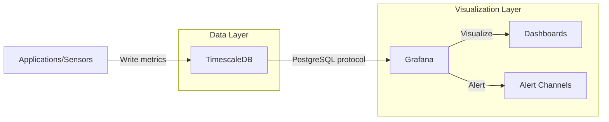
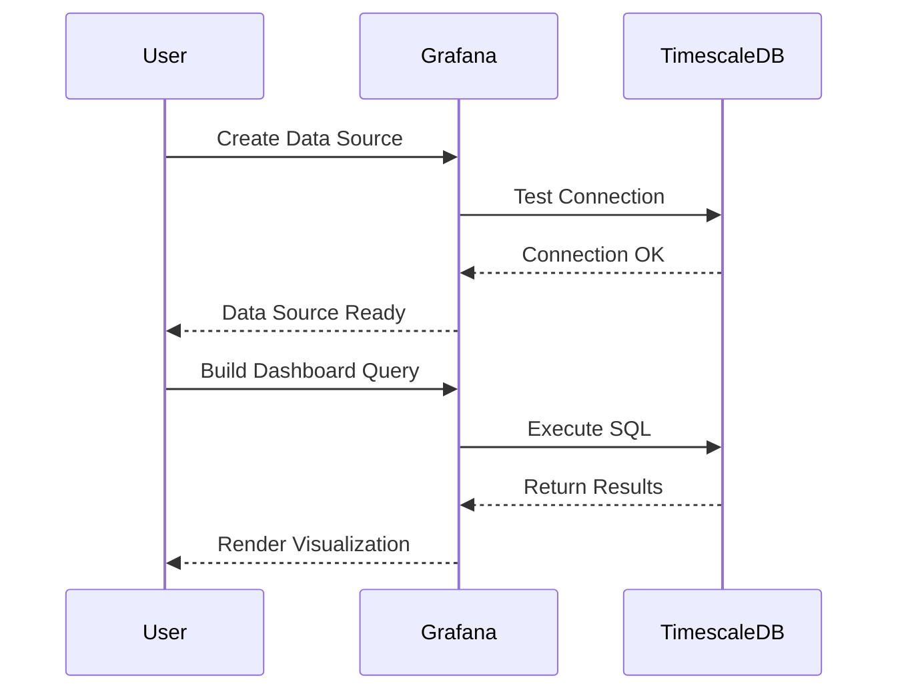
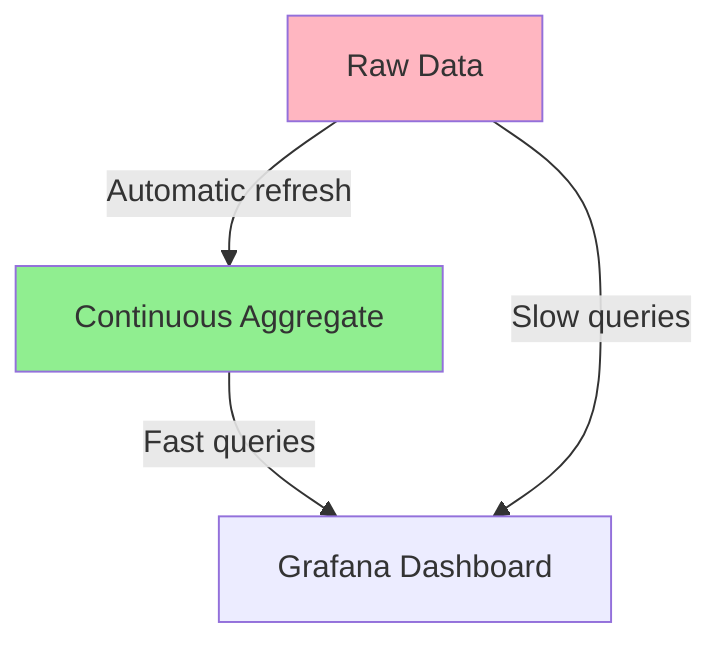
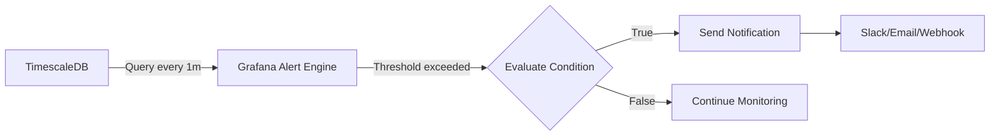
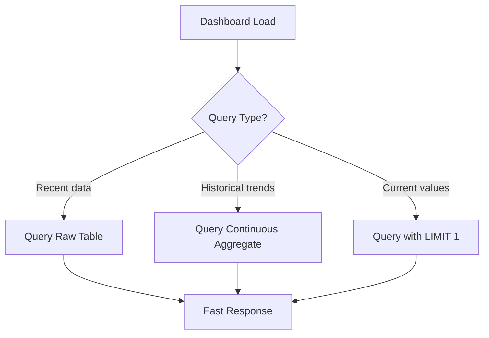

# How to Use TimescaleDB with Grafana

Author: [nawazdhandala](https://www.github.com/nawazdhandala)

Tags: TimescaleDB, Grafana, Time-Series, PostgreSQL, Monitoring, Visualization, Database

Description: Learn how to connect TimescaleDB with Grafana for powerful time-series visualization. Covers installation, data source configuration, dashboard creation, and best practices for building production-ready monitoring dashboards.

Time-series data powers modern observability. Metrics, IoT sensor readings, financial tick data, and application logs all share a common trait: they arrive in time-ordered streams that grow continuously. PostgreSQL can handle time-series workloads, but it wasn't designed for them. Enter TimescaleDB, a PostgreSQL extension that transforms your favorite relational database into a time-series powerhouse, and Grafana, the visualization layer that turns raw data into actionable insights.

Together, TimescaleDB and Grafana form a compelling open-source stack for monitoring, analytics, and alerting. You get the familiarity of SQL, the reliability of PostgreSQL, and the flexibility of Grafana dashboards, all without vendor lock-in.

## Architecture Overview

Before diving into configuration, let's understand how the pieces fit together.



TimescaleDB stores your time-series data in hypertables, which are automatically partitioned by time. Grafana connects via the standard PostgreSQL data source, executing SQL queries to fetch and render data. No special plugins or connectors required.

## Installing TimescaleDB

Let's start by setting up TimescaleDB. The following instructions cover Ubuntu/Debian systems.

The installation process adds the TimescaleDB repository and installs the extension alongside PostgreSQL 15.

```bash
# Add TimescaleDB repository
sudo apt install gnupg postgresql-common apt-transport-https lsb-release wget

# Add repository signing key
wget --quiet -O - https://packagecloud.io/timescale/timescaledb/gpgkey | sudo gpg --dearmor -o /etc/apt/trusted.gpg.d/timescaledb.gpg

# Add repository to sources
echo "deb https://packagecloud.io/timescale/timescaledb/ubuntu/ $(lsb_release -c -s) main" | sudo tee /etc/apt/sources.list.d/timescaledb.list

# Update and install
sudo apt update
sudo apt install timescaledb-2-postgresql-15

# Run the tuning script to optimize PostgreSQL settings
sudo timescaledb-tune --quiet --yes

# Restart PostgreSQL
sudo systemctl restart postgresql
```

After installation, enable the extension in your database.

Creating the extension inside your target database enables all TimescaleDB features including hypertables and continuous aggregates.

```sql
-- Connect to your database and enable TimescaleDB
CREATE EXTENSION IF NOT EXISTS timescaledb;

-- Verify installation
SELECT default_version, installed_version
FROM pg_available_extensions
WHERE name = 'timescaledb';
```

## Creating Your First Hypertable

Hypertables are the foundation of TimescaleDB. They look and act like regular PostgreSQL tables but automatically partition data by time.

The following schema creates a metrics table suitable for storing application performance data with automatic chunking on the timestamp column.

```sql
-- Create a regular table for metrics
CREATE TABLE metrics (
    time        TIMESTAMPTZ       NOT NULL,
    device_id   TEXT              NOT NULL,
    metric_name TEXT              NOT NULL,
    value       DOUBLE PRECISION  NOT NULL,
    tags        JSONB
);

-- Convert it to a hypertable, partitioned by time
-- chunk_time_interval sets the size of each time partition (7 days here)
SELECT create_hypertable(
    'metrics',
    'time',
    chunk_time_interval => INTERVAL '7 days'
);

-- Create an index for common query patterns
CREATE INDEX idx_metrics_device_time ON metrics (device_id, time DESC);
CREATE INDEX idx_metrics_name_time ON metrics (metric_name, time DESC);
```

Insert some sample data to test the setup.

The following inserts generate synthetic metrics data spanning the last 24 hours for testing your Grafana queries.

```sql
-- Insert sample data for testing
INSERT INTO metrics (time, device_id, metric_name, value, tags)
SELECT
    time,
    'device-' || (random() * 10)::int,
    (ARRAY['cpu_usage', 'memory_usage', 'disk_io', 'network_rx'])[1 + (random() * 3)::int],
    random() * 100,
    jsonb_build_object('region', (ARRAY['us-east', 'us-west', 'eu-west'])[1 + (random() * 2)::int])
FROM generate_series(
    NOW() - INTERVAL '24 hours',
    NOW(),
    INTERVAL '1 minute'
) AS time;
```

## Setting Up Grafana

With TimescaleDB ready, let's install and configure Grafana.

The installation adds the official Grafana repository and installs the latest stable version.

```bash
# Add Grafana repository
sudo apt install -y apt-transport-https software-properties-common wget
sudo mkdir -p /etc/apt/keyrings/
wget -q -O - https://apt.grafana.com/gpg.key | gpg --dearmor | sudo tee /etc/apt/keyrings/grafana.gpg > /dev/null

# Add repository
echo "deb [signed-by=/etc/apt/keyrings/grafana.gpg] https://apt.grafana.com stable main" | sudo tee -a /etc/apt/sources.list.d/grafana.list

# Install Grafana
sudo apt update
sudo apt install grafana

# Start and enable service
sudo systemctl daemon-reload
sudo systemctl start grafana-server
sudo systemctl enable grafana-server
```

Grafana runs on port 3000 by default. Access it at `http://your-server:3000` with default credentials `admin/admin`.

## Configuring the Data Source

Grafana connects to TimescaleDB using the built-in PostgreSQL data source. The connection flow looks like this:



Navigate to **Configuration > Data Sources > Add data source > PostgreSQL** and enter the following settings:

| Setting | Value |
|---------|-------|
| Host | `localhost:5432` |
| Database | `your_database` |
| User | `grafana_reader` |
| TLS/SSL Mode | `require` (for production) |
| Version | PostgreSQL 15+ |
| TimescaleDB | Enable toggle |

Create a dedicated read-only user for Grafana to follow the principle of least privilege.

The following SQL creates a restricted user that can only read from the metrics schema, preventing accidental data modification from Grafana.

```sql
-- Create a read-only user for Grafana
CREATE USER grafana_reader WITH PASSWORD 'secure_password_here';

-- Grant connect permission
GRANT CONNECT ON DATABASE your_database TO grafana_reader;

-- Grant usage on schema
GRANT USAGE ON SCHEMA public TO grafana_reader;

-- Grant select on specific tables
GRANT SELECT ON metrics TO grafana_reader;

-- Grant select on future tables (optional)
ALTER DEFAULT PRIVILEGES IN SCHEMA public
GRANT SELECT ON TABLES TO grafana_reader;
```

## Building Your First Dashboard

Let's create a dashboard that visualizes our metrics data. Grafana dashboards consist of panels, each executing a query against your data source.

### Time-Series Panel for CPU Usage

Create a new panel and enter the following query. Grafana expects a `time` column and one or more value columns.

The query uses time_bucket, a TimescaleDB function that groups data into fixed intervals, similar to date_trunc but optimized for time-series workloads.

```sql
-- CPU usage over time, grouped into 1-minute buckets
SELECT
    time_bucket('1 minute', time) AS time,
    device_id,
    AVG(value) AS cpu_usage
FROM metrics
WHERE
    metric_name = 'cpu_usage'
    AND $__timeFilter(time)
GROUP BY 1, 2
ORDER BY 1
```

The `$__timeFilter(time)` macro automatically applies Grafana's selected time range to your query.

### Multi-Metric Comparison Panel

Compare multiple metrics in a single visualization using conditional aggregation.

The CASE expressions pivot metric names into separate columns, enabling side-by-side comparison in Grafana's time-series panel.

```sql
-- Compare multiple metrics for a specific device
SELECT
    time_bucket('5 minutes', time) AS time,
    AVG(CASE WHEN metric_name = 'cpu_usage' THEN value END) AS cpu,
    AVG(CASE WHEN metric_name = 'memory_usage' THEN value END) AS memory,
    AVG(CASE WHEN metric_name = 'disk_io' THEN value END) AS disk
FROM metrics
WHERE
    device_id = 'device-1'
    AND $__timeFilter(time)
GROUP BY 1
ORDER BY 1
```

### Stat Panel with Current Values

Stat panels display single values, perfect for showing current status.

The query retrieves the most recent value for each device, using DISTINCT ON to efficiently get the latest record per group.

```sql
-- Latest CPU reading per device
SELECT DISTINCT ON (device_id)
    device_id,
    value AS current_cpu,
    time AS last_updated
FROM metrics
WHERE
    metric_name = 'cpu_usage'
    AND time > NOW() - INTERVAL '5 minutes'
ORDER BY device_id, time DESC
```

## Advanced TimescaleDB Features for Grafana

### Continuous Aggregates

Continuous aggregates pre-compute query results, dramatically speeding up dashboard loads for common queries.



The following creates a materialized view that automatically maintains hourly statistics, refreshing in the background without blocking queries.

```sql
-- Create a continuous aggregate for hourly statistics
CREATE MATERIALIZED VIEW metrics_hourly
WITH (timescaledb.continuous) AS
SELECT
    time_bucket('1 hour', time) AS bucket,
    device_id,
    metric_name,
    AVG(value) AS avg_value,
    MIN(value) AS min_value,
    MAX(value) AS max_value,
    COUNT(*) AS sample_count
FROM metrics
GROUP BY 1, 2, 3
WITH NO DATA;

-- Set up automatic refresh policy
SELECT add_continuous_aggregate_policy('metrics_hourly',
    start_offset => INTERVAL '3 hours',
    end_offset => INTERVAL '1 hour',
    schedule_interval => INTERVAL '1 hour'
);

-- Manually refresh historical data
CALL refresh_continuous_aggregate('metrics_hourly', NULL, NOW());
```

Query the continuous aggregate from Grafana for faster dashboard loads.

Using the pre-aggregated view eliminates expensive GROUP BY operations at query time.

```sql
-- Query the continuous aggregate instead of raw data
SELECT
    bucket AS time,
    device_id,
    avg_value
FROM metrics_hourly
WHERE
    metric_name = 'cpu_usage'
    AND $__timeFilter(bucket)
ORDER BY 1
```

### Compression for Cost Efficiency

TimescaleDB can compress older data by 90% or more while keeping it queryable.

The compression policy automatically compresses chunks older than 7 days, reducing storage costs while maintaining query capability.

```sql
-- Enable compression on the hypertable
ALTER TABLE metrics SET (
    timescaledb.compress,
    timescaledb.compress_segmentby = 'device_id, metric_name'
);

-- Create a compression policy (compress data older than 7 days)
SELECT add_compression_policy('metrics', INTERVAL '7 days');

-- Check compression stats
SELECT
    chunk_name,
    before_compression_total_bytes,
    after_compression_total_bytes,
    compression_ratio
FROM chunk_compression_stats('metrics');
```

### Retention Policies

Automatically drop old data to control storage growth.

The retention policy runs in the background, removing chunks older than 90 days without blocking ongoing queries.

```sql
-- Create a retention policy (keep 90 days of data)
SELECT add_retention_policy('metrics', INTERVAL '90 days');

-- View active policies
SELECT * FROM timescaledb_information.jobs
WHERE proc_name IN ('policy_compression', 'policy_retention');
```

## Grafana Dashboard Variables

Variables make dashboards interactive and reusable. Create a variable for device selection.

Navigate to **Dashboard Settings > Variables > Add variable** and configure:

| Setting | Value |
|---------|-------|
| Name | `device` |
| Type | Query |
| Data source | Your TimescaleDB source |

The query populates the dropdown with all available device IDs.

```sql
-- Variable query for device selection
SELECT DISTINCT device_id FROM metrics ORDER BY 1
```

Use the variable in panel queries with `$device` syntax.

The WHERE clause filters results to only the selected device, enabling drill-down analysis.

```sql
-- Panel query using the variable
SELECT
    time_bucket('1 minute', time) AS time,
    AVG(value) AS value
FROM metrics
WHERE
    device_id = '$device'
    AND metric_name = 'cpu_usage'
    AND $__timeFilter(time)
GROUP BY 1
ORDER BY 1
```

## Setting Up Alerts

Grafana can alert when metrics exceed thresholds. Create an alert rule for high CPU usage.

The alert query calculates average CPU over the last 5 minutes and triggers when any device exceeds 80%.

```sql
-- Alert query: Average CPU over last 5 minutes
SELECT
    device_id,
    AVG(value) AS avg_cpu
FROM metrics
WHERE
    metric_name = 'cpu_usage'
    AND time > NOW() - INTERVAL '5 minutes'
GROUP BY device_id
HAVING AVG(value) > 80
```

Configure the alert in Grafana's unified alerting:

1. Create a new alert rule
2. Set the query above as the data source
3. Configure condition: `avg_cpu > 80`
4. Set evaluation interval: `1m`
5. Configure notification channel (Slack, email, webhook)



## Performance Optimization Tips

### Query Best Practices

Optimize your Grafana queries for TimescaleDB with these patterns.

Selecting only required columns and using appropriate time buckets reduces data transfer and improves rendering speed.

```sql
-- Good: Use time_bucket for aggregation
SELECT
    time_bucket('$__interval', time) AS time,
    AVG(value) AS value
FROM metrics
WHERE $__timeFilter(time)
GROUP BY 1
ORDER BY 1;

-- Good: Limit columns in SELECT
SELECT time, value FROM metrics
WHERE device_id = 'device-1' AND $__timeFilter(time);

-- Avoid: SELECT * with large time ranges
-- SELECT * FROM metrics WHERE time > NOW() - INTERVAL '30 days';
```

### Index Optimization

Create indexes that match your common Grafana query patterns.

The compound index on (metric_name, device_id, time DESC) supports both filtering and ordering in a single index scan.

```sql
-- Index for filtering by metric and device, ordering by time
CREATE INDEX idx_metrics_compound
ON metrics (metric_name, device_id, time DESC);

-- Partial index for frequently queried metrics
CREATE INDEX idx_metrics_cpu
ON metrics (device_id, time DESC)
WHERE metric_name = 'cpu_usage';

-- Analyze table to update statistics
ANALYZE metrics;
```

### Dashboard Loading Optimization



Configure panel caching and query limits:

1. Set reasonable default time ranges (last 6 hours vs last 30 days)
2. Enable query caching in Grafana settings
3. Use `$__interval` for automatic bucket sizing
4. Limit series count with `LIMIT` clauses

## Docker Compose Setup

For quick local development, use Docker Compose to run both services.

The compose file creates a complete environment with TimescaleDB and Grafana, including persistent volumes for data.

```yaml
# docker-compose.yml
version: '3.8'

services:
  timescaledb:
    image: timescale/timescaledb:latest-pg15
    container_name: timescaledb
    environment:
      POSTGRES_USER: postgres
      POSTGRES_PASSWORD: postgres
      POSTGRES_DB: metrics
    ports:
      - "5432:5432"
    volumes:
      - timescale_data:/var/lib/postgresql/data
    healthcheck:
      test: ["CMD-SHELL", "pg_isready -U postgres"]
      interval: 10s
      timeout: 5s
      retries: 5

  grafana:
    image: grafana/grafana:latest
    container_name: grafana
    environment:
      GF_SECURITY_ADMIN_PASSWORD: admin
      GF_INSTALL_PLUGINS: grafana-clock-panel
    ports:
      - "3000:3000"
    volumes:
      - grafana_data:/var/lib/grafana
    depends_on:
      timescaledb:
        condition: service_healthy

volumes:
  timescale_data:
  grafana_data:
```

Start the stack with a single command.

```bash
# Start both services
docker-compose up -d

# View logs
docker-compose logs -f

# Stop services
docker-compose down
```

## Troubleshooting Common Issues

### Connection Refused

If Grafana cannot connect to TimescaleDB, verify network connectivity and authentication.

```bash
# Test connection from Grafana container
docker exec -it grafana bash
apt update && apt install -y postgresql-client
psql -h timescaledb -U postgres -d metrics -c "SELECT 1"
```

### Slow Queries

Identify slow queries using TimescaleDB's built-in tools.

The following queries help identify missing indexes and inefficient query patterns.

```sql
-- Find slow queries
SELECT
    query,
    calls,
    total_exec_time / 1000 AS total_seconds,
    mean_exec_time / 1000 AS avg_seconds
FROM pg_stat_statements
WHERE query LIKE '%metrics%'
ORDER BY total_exec_time DESC
LIMIT 10;

-- Check chunk sizes
SELECT
    hypertable_name,
    chunk_name,
    range_start,
    range_end,
    pg_size_pretty(total_bytes) AS size
FROM timescaledb_information.chunks
WHERE hypertable_name = 'metrics'
ORDER BY range_start DESC;
```

### Memory Issues

TimescaleDB queries can consume significant memory. Configure work_mem appropriately.

```sql
-- Check current settings
SHOW work_mem;
SHOW shared_buffers;

-- Adjust for your workload (in postgresql.conf)
-- work_mem = '256MB'
-- shared_buffers = '4GB'
```

## Production Checklist

Before deploying to production, verify these configurations:

- [ ] TimescaleDB compression policy enabled for older chunks
- [ ] Retention policy configured to manage storage growth
- [ ] Read-only Grafana user with minimal permissions
- [ ] TLS/SSL enabled for database connections
- [ ] Continuous aggregates created for common dashboard queries
- [ ] Appropriate indexes for query patterns
- [ ] Grafana dashboard provisioning configured for GitOps
- [ ] Alert notification channels tested
- [ ] Backup strategy for TimescaleDB data
- [ ] Monitoring for TimescaleDB itself (meta-monitoring)

## Conclusion

TimescaleDB and Grafana together provide a powerful, open-source foundation for time-series visualization. You get PostgreSQL's reliability and SQL familiarity combined with Grafana's flexible dashboarding capabilities. The combination scales from development laptops to production clusters handling millions of data points per second.

Start with the basics: a simple hypertable, a PostgreSQL data source, and a few panels. As your needs grow, add continuous aggregates for faster queries, compression for cost efficiency, and alerting for proactive monitoring. The incremental approach lets you build expertise while delivering value at each step.

**Related Reading:**

- [Traces and Spans in OpenTelemetry](https://oneuptime.com/blog/post/2025-08-27-traces-and-spans-in-opentelemetry/view)
- [The Five Stages of SRE Maturity](https://oneuptime.com/blog/post/2025-09-01-the-five-stages-of-sre-maturity/view)
- [Monitoring vs Observability for SRE](https://oneuptime.com/blog/post/2025-11-28-monitoring-vs-observability-sre/view)
