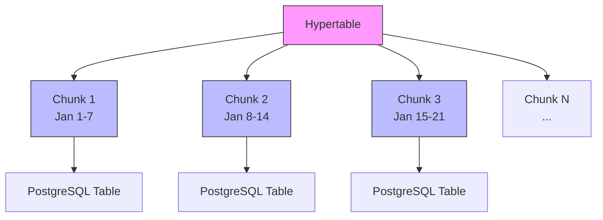
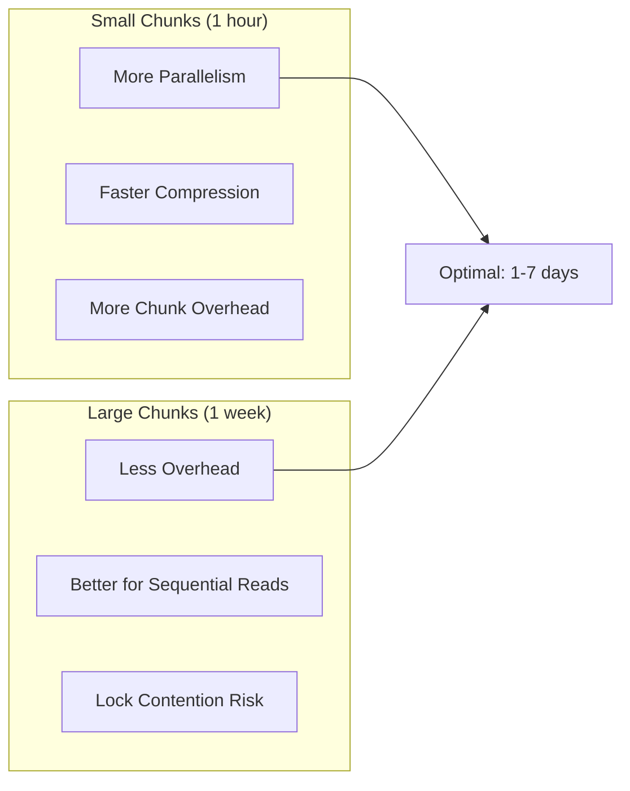
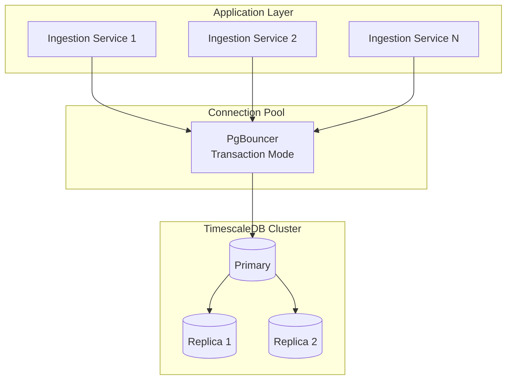
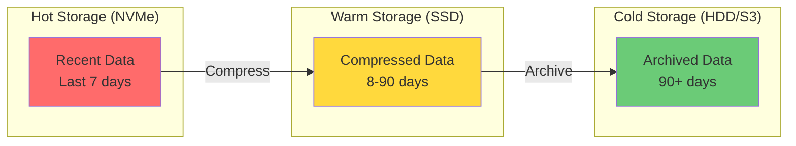

# How to Handle High-Ingestion Workloads in TimescaleDB

Author: [nawazdhandala](https://github.com/nawazdhandala)

Tags: TimescaleDB, PostgreSQL, Time-Series, Performance, Database, Ingestion

Description: Learn how to handle high-ingestion workloads in TimescaleDB with practical strategies including batch inserts, chunk optimization, compression policies, parallel workers, and partitioning techniques.

---

Time-series data grows rapidly. IoT sensors, application metrics, financial transactions, and observability data can generate millions of rows per second. TimescaleDB extends PostgreSQL specifically for these workloads, but achieving maximum ingestion rates requires careful tuning. The following guide covers proven strategies for handling high-volume data ingestion.

## Understanding TimescaleDB Architecture

TimescaleDB organizes data into hypertables, which are partitioned into chunks based on time intervals. Each chunk is a regular PostgreSQL table, enabling efficient queries and automatic data lifecycle management.



## Initial Setup for High Ingestion

### Creating Optimized Hypertables

When creating a hypertable, chunk interval significantly impacts ingestion performance. Smaller chunks mean more frequent chunk creation but better parallelism. Larger chunks reduce overhead but may cause lock contention.

```sql
-- Create the base table with appropriate data types
-- Using TIMESTAMPTZ for time column ensures proper timezone handling
CREATE TABLE metrics (
    time        TIMESTAMPTZ NOT NULL,
    device_id   INTEGER NOT NULL,
    sensor_type TEXT NOT NULL,
    value       DOUBLE PRECISION,
    metadata    JSONB
);

-- Convert to hypertable with a 1-day chunk interval
-- Chunk interval should be chosen based on your data volume
-- Rule of thumb: each chunk should contain 10-100 million rows
SELECT create_hypertable(
    'metrics',
    'time',
    chunk_time_interval => INTERVAL '1 day'
);

-- Add space partitioning for even better parallelism
-- Partitioning by device_id distributes writes across multiple chunks
SELECT add_dimension(
    'metrics',
    'device_id',
    number_partitions => 4
);
```

### Tuning PostgreSQL Configuration

PostgreSQL's default settings are conservative. High-ingestion workloads require aggressive tuning of memory, WAL, and checkpoint settings.

```sql
-- These settings should be added to postgresql.conf
-- Adjust values based on your available RAM (assuming 64GB total)

-- Shared buffers: 25% of RAM for dedicated database servers
-- shared_buffers = '16GB'

-- Work memory for sorting and hashing operations
-- Higher values speed up complex queries but consume more RAM per connection
-- work_mem = '256MB'

-- Maintenance work memory for VACUUM, CREATE INDEX, etc.
-- maintenance_work_mem = '2GB'

-- Effective cache size: 75% of RAM, tells planner about OS cache
-- effective_cache_size = '48GB'

-- WAL settings for high write throughput
-- wal_buffers = '256MB'
-- max_wal_size = '8GB'
-- min_wal_size = '2GB'

-- Checkpoint settings to reduce I/O spikes
-- checkpoint_completion_target = 0.9
-- checkpoint_timeout = '15min'

-- Background writer settings for smoother I/O
-- bgwriter_delay = '10ms'
-- bgwriter_lru_maxpages = 1000
-- bgwriter_lru_multiplier = 10.0
```

Run the following query to verify current settings and compare with recommended values.

```sql
-- Check current settings
SELECT name, setting, unit, context
FROM pg_settings
WHERE name IN (
    'shared_buffers',
    'work_mem',
    'maintenance_work_mem',
    'effective_cache_size',
    'wal_buffers',
    'max_wal_size',
    'checkpoint_completion_target'
)
ORDER BY name;
```

## Batch Insert Strategies

### Using COPY for Maximum Throughput

COPY is the fastest method for bulk loading data into PostgreSQL. It bypasses the SQL parser and writes directly to the table.

```sql
-- Load data from a CSV file using COPY
-- COPY is significantly faster than individual INSERT statements
-- Can achieve 100,000+ rows per second on modern hardware
COPY metrics (time, device_id, sensor_type, value, metadata)
FROM '/path/to/data.csv'
WITH (FORMAT csv, HEADER true);
```

### Programmatic Batch Inserts

When COPY is not suitable, use multi-row INSERT statements with prepared statements. Batching 1000-5000 rows per statement provides optimal throughput.

```python
import psycopg2
from psycopg2.extras import execute_values
from datetime import datetime, timedelta
import random

# Connection with optimized settings for bulk inserts
conn = psycopg2.connect(
    host="localhost",
    database="timescale_db",
    user="postgres",
    password="password",
    # Disable autocommit for batch control
    # Larger batches within a single transaction are faster
)

def insert_metrics_batch(cursor, metrics):
    """
    Insert a batch of metrics using execute_values.
    execute_values is optimized for multi-row inserts and
    significantly outperforms executemany or individual inserts.
    """
    query = """
        INSERT INTO metrics (time, device_id, sensor_type, value, metadata)
        VALUES %s
    """
    # page_size controls how many rows are sent per round trip
    # Higher values reduce network overhead but increase memory usage
    execute_values(
        cursor,
        query,
        metrics,
        page_size=5000
    )

# Generate sample data for demonstration
def generate_metrics(count):
    """Generate sample metrics data."""
    base_time = datetime.now()
    metrics = []
    for i in range(count):
        metrics.append((
            base_time + timedelta(milliseconds=i),
            random.randint(1, 1000),  # device_id
            random.choice(['temperature', 'humidity', 'pressure']),
            random.uniform(0, 100),
            {'source': 'sensor_batch'}
        ))
    return metrics

# Insert in batches of 10,000 rows
BATCH_SIZE = 10000
TOTAL_ROWS = 1000000

cursor = conn.cursor()

for batch_num in range(TOTAL_ROWS // BATCH_SIZE):
    metrics = generate_metrics(BATCH_SIZE)
    insert_metrics_batch(cursor, metrics)

    # Commit every batch to prevent transaction log bloat
    # Adjust commit frequency based on your durability requirements
    if batch_num % 10 == 0:
        conn.commit()
        print(f"Committed batch {batch_num}")

conn.commit()
cursor.close()
conn.close()
```

### Using TimescaleDB's Parallel COPY

TimescaleDB supports parallel COPY operations through the timescaledb-parallel-copy tool, which can dramatically increase ingestion rates.

```bash
# Install timescaledb-parallel-copy
go install github.com/timescale/timescaledb-parallel-copy/cmd/timescaledb-parallel-copy@latest

# Use parallel copy with multiple workers
# --workers: number of parallel workers (typically 2x CPU cores)
# --batch-size: rows per batch (5000-10000 is usually optimal)
# --reporting-period: progress reporting interval
timescaledb-parallel-copy \
    --connection "host=localhost user=postgres dbname=timescale_db" \
    --table metrics \
    --file /path/to/large_data.csv \
    --workers 8 \
    --batch-size 5000 \
    --reporting-period 30s
```

## Chunk Optimization

### Choosing the Right Chunk Interval

Chunk interval affects both ingestion and query performance. The following diagram shows the trade-offs.



Adjust chunk interval based on your ingestion rate and query patterns.

```sql
-- Check current chunk sizes to evaluate if interval is appropriate
-- Each chunk should ideally be 10-100 million rows
SELECT
    hypertable_name,
    chunk_name,
    range_start,
    range_end,
    pg_size_pretty(total_bytes) as size,
    pg_size_pretty(table_bytes) as table_size,
    pg_size_pretty(index_bytes) as index_size
FROM timescaledb_information.chunks
WHERE hypertable_name = 'metrics'
ORDER BY range_start DESC
LIMIT 10;

-- Modify chunk interval for future chunks if needed
-- Existing chunks are not affected
SELECT set_chunk_time_interval('metrics', INTERVAL '12 hours');
```

### Managing Chunk Count

Too many small chunks degrade query performance. Monitor and consolidate if necessary.

```sql
-- Count chunks per hypertable
-- If you have thousands of chunks, consider larger intervals
SELECT
    hypertable_name,
    COUNT(*) as chunk_count,
    MIN(range_start) as oldest_chunk,
    MAX(range_end) as newest_chunk
FROM timescaledb_information.chunks
GROUP BY hypertable_name;

-- View chunk statistics including compression status
SELECT
    hypertable_schema,
    hypertable_name,
    chunk_schema,
    chunk_name,
    is_compressed,
    before_compression_total_bytes,
    after_compression_total_bytes
FROM chunk_compression_stats('metrics')
ORDER BY chunk_name DESC
LIMIT 20;
```

## Compression for Improved Performance

### Enabling Compression

Compression reduces storage by 90-95% and improves query performance on historical data. Configure compression to run automatically on older chunks.

```sql
-- Enable compression on the hypertable
-- segment_by: columns used to group compressed data (filter columns)
-- order_by: ordering within segments (time is typical)
ALTER TABLE metrics SET (
    timescaledb.compress,
    timescaledb.compress_segmentby = 'device_id, sensor_type',
    timescaledb.compress_orderby = 'time DESC'
);

-- Create a compression policy to automatically compress old data
-- Chunks older than 7 days will be compressed
-- Adjust the age threshold based on your query patterns
SELECT add_compression_policy('metrics', INTERVAL '7 days');

-- Manually compress a specific chunk if needed
SELECT compress_chunk('_timescaledb_internal._hyper_1_1_chunk');

-- Compress all chunks older than a certain age
SELECT compress_chunk(i.chunk_name::regclass)
FROM timescaledb_information.chunks i
WHERE i.hypertable_name = 'metrics'
  AND i.range_end < NOW() - INTERVAL '7 days'
  AND NOT i.is_compressed;
```

### Compression Performance Monitoring

Track compression ratios and timing to optimize your compression strategy.

```sql
-- View compression statistics for each chunk
SELECT
    chunk_name,
    pg_size_pretty(before_compression_total_bytes) as before_size,
    pg_size_pretty(after_compression_total_bytes) as after_size,
    ROUND(
        (1 - after_compression_total_bytes::numeric /
         NULLIF(before_compression_total_bytes, 0)) * 100,
        2
    ) as compression_ratio_pct
FROM chunk_compression_stats('metrics')
WHERE is_compressed = true
ORDER BY chunk_name DESC;
```

## Indexing Strategies

### Minimal Indexes for Write Performance

Indexes slow down inserts. For high-ingestion tables, use minimal indexes and rely on chunk exclusion for query performance.

```sql
-- TimescaleDB automatically creates a time index
-- Only add additional indexes if queries require them

-- Composite index for common query patterns
-- Place equality columns first, then range columns
CREATE INDEX idx_metrics_device_time
ON metrics (device_id, time DESC);

-- Partial index for specific query patterns
-- Only indexes rows matching the WHERE condition
CREATE INDEX idx_metrics_alerts
ON metrics (device_id, time DESC)
WHERE value > 90;

-- BRIN index for large sequential scans
-- Very small index size, good for time-ordered data
CREATE INDEX idx_metrics_time_brin
ON metrics USING BRIN (time);
```

### Index Performance Analysis

```sql
-- Check index usage statistics
-- Indexes with low idx_scan count may be candidates for removal
SELECT
    schemaname,
    tablename,
    indexname,
    idx_scan,
    idx_tup_read,
    idx_tup_fetch,
    pg_size_pretty(pg_relation_size(indexrelid)) as index_size
FROM pg_stat_user_indexes
WHERE schemaname NOT LIKE '_timescaledb%'
ORDER BY idx_scan DESC;

-- Find unused indexes (potential candidates for removal)
SELECT
    schemaname || '.' || tablename as table,
    indexname,
    pg_size_pretty(pg_relation_size(indexrelid)) as size
FROM pg_stat_user_indexes
WHERE idx_scan = 0
  AND schemaname NOT LIKE '_timescaledb%'
ORDER BY pg_relation_size(indexrelid) DESC;
```

## Parallel Workers and Concurrency

### Configuring Parallel Ingestion

Enable parallel workers to distribute insert workload across CPU cores.

```sql
-- PostgreSQL parallel worker settings
-- max_parallel_workers_per_gather: workers per query
ALTER SYSTEM SET max_parallel_workers_per_gather = 4;

-- max_parallel_workers: total workers available
ALTER SYSTEM SET max_parallel_workers = 16;

-- max_parallel_maintenance_workers: workers for VACUUM, INDEX
ALTER SYSTEM SET max_parallel_maintenance_workers = 4;

-- TimescaleDB specific settings
-- Enable parallel chunk creation for better ingestion
ALTER SYSTEM SET timescaledb.max_background_workers = 8;

-- Reload configuration
SELECT pg_reload_conf();
```

### Connection Pooling Architecture

High-ingestion workloads benefit from connection pooling to reduce connection overhead.



PgBouncer configuration for high-throughput ingestion.

```ini
; pgbouncer.ini
[databases]
timescale_db = host=localhost port=5432 dbname=timescale_db

[pgbouncer]
; Listen on all interfaces
listen_addr = *
listen_port = 6432

; Authentication
auth_type = md5
auth_file = /etc/pgbouncer/userlist.txt

; Pool sizing
; pool_mode: transaction mode allows connection reuse between transactions
pool_mode = transaction

; Maximum client connections
max_client_conn = 1000

; Connections per database-user pair
default_pool_size = 50

; Reserve connections for admin
reserve_pool_size = 5

; Timeout waiting for server connection
server_connect_timeout = 5

; Close server connection after this many seconds of inactivity
server_idle_timeout = 60
```

## Data Retention Policies

### Automatic Data Expiration

Configure retention policies to automatically drop old data and prevent unbounded growth.

```sql
-- Create a retention policy to automatically drop chunks older than 90 days
-- Runs in the background without blocking ingestion
SELECT add_retention_policy('metrics', INTERVAL '90 days');

-- View all active policies
SELECT * FROM timescaledb_information.jobs
WHERE proc_name IN ('policy_retention', 'policy_compression');

-- Manually drop old chunks if needed
SELECT drop_chunks('metrics', older_than => INTERVAL '90 days');

-- Preview which chunks would be dropped without actually dropping
SELECT show_chunks('metrics', older_than => INTERVAL '90 days');
```

### Tiered Storage Strategy

Move older data to cheaper storage while keeping recent data on fast disks.



```sql
-- Move chunks to different tablespaces based on age
-- First, create tablespaces for different storage tiers
-- CREATE TABLESPACE warm_storage LOCATION '/mnt/ssd/postgresql';
-- CREATE TABLESPACE cold_storage LOCATION '/mnt/hdd/postgresql';

-- Move old chunks to warm storage
SELECT move_chunk(
    chunk => '_timescaledb_internal._hyper_1_10_chunk',
    destination_tablespace => 'warm_storage',
    index_destination_tablespace => 'warm_storage'
);

-- Automate with a scheduled job
CREATE OR REPLACE FUNCTION move_old_chunks_to_warm()
RETURNS void AS $$
DECLARE
    chunk_record RECORD;
BEGIN
    FOR chunk_record IN
        SELECT chunk_name
        FROM timescaledb_information.chunks
        WHERE hypertable_name = 'metrics'
          AND range_end < NOW() - INTERVAL '7 days'
          AND range_end > NOW() - INTERVAL '90 days'
    LOOP
        PERFORM move_chunk(
            chunk => chunk_record.chunk_name::regclass,
            destination_tablespace => 'warm_storage',
            index_destination_tablespace => 'warm_storage'
        );
    END LOOP;
END;
$$ LANGUAGE plpgsql;
```

## Monitoring Ingestion Performance

### Essential Metrics to Track

```sql
-- Monitor insert rate per second
SELECT
    hypertable_name,
    total_bytes,
    num_chunks,
    ROUND(total_bytes / (EXTRACT(EPOCH FROM (NOW() - stats_start)) + 1)) as bytes_per_sec
FROM hypertable_detailed_size('metrics')
CROSS JOIN (SELECT MIN(range_start) as stats_start FROM timescaledb_information.chunks) t;

-- Check for lock contention during inserts
SELECT
    relation::regclass,
    mode,
    granted,
    pid,
    query
FROM pg_locks l
JOIN pg_stat_activity a ON l.pid = a.pid
WHERE relation::regclass::text LIKE '%metrics%'
  AND NOT granted;

-- Monitor checkpoint and WAL activity
SELECT
    checkpoints_timed,
    checkpoints_req,
    buffers_checkpoint,
    buffers_clean,
    buffers_backend,
    pg_size_pretty(pg_wal_lsn_diff(pg_current_wal_lsn(), '0/0')) as wal_generated
FROM pg_stat_bgwriter;
```

### Performance Dashboard Query

Create a comprehensive view of your ingestion health.

```sql
-- Create a monitoring view for ingestion metrics
CREATE OR REPLACE VIEW ingestion_dashboard AS
SELECT
    h.hypertable_name,
    pg_size_pretty(h.total_bytes) as total_size,
    h.num_chunks as chunk_count,
    c.compressed_chunks,
    c.uncompressed_chunks,
    COALESCE(c.compression_ratio, 0) as avg_compression_ratio,
    r.approximate_row_count as approx_rows
FROM hypertable_detailed_size('metrics') h
LEFT JOIN (
    SELECT
        hypertable_name,
        COUNT(*) FILTER (WHERE is_compressed) as compressed_chunks,
        COUNT(*) FILTER (WHERE NOT is_compressed) as uncompressed_chunks,
        AVG(
            CASE WHEN after_compression_total_bytes > 0
            THEN 1 - (after_compression_total_bytes::numeric / before_compression_total_bytes)
            END
        ) as compression_ratio
    FROM chunk_compression_stats('metrics')
    GROUP BY hypertable_name
) c ON h.hypertable_name = c.hypertable_name
LEFT JOIN (
    SELECT
        hypertable_name,
        approximate_row_count(format('%I.%I', hypertable_schema, hypertable_name)::regclass) as approximate_row_count
    FROM timescaledb_information.hypertables
) r ON h.hypertable_name = r.hypertable_name;

-- Query the dashboard
SELECT * FROM ingestion_dashboard;
```

## Troubleshooting Common Issues

### Handling Chunk Lock Contention

When multiple writers target the same chunk, lock contention occurs. Space partitioning helps distribute the load.

```sql
-- Check for chunk lock contention
SELECT
    blocked_locks.relation::regclass as blocked_relation,
    blocked_activity.pid as blocked_pid,
    blocking_locks.relation::regclass as blocking_relation,
    blocking_activity.pid as blocking_pid,
    blocked_activity.query as blocked_query,
    blocking_activity.query as blocking_query
FROM pg_catalog.pg_locks blocked_locks
JOIN pg_catalog.pg_stat_activity blocked_activity
    ON blocked_activity.pid = blocked_locks.pid
JOIN pg_catalog.pg_locks blocking_locks
    ON blocking_locks.locktype = blocked_locks.locktype
    AND blocking_locks.relation = blocked_locks.relation
    AND blocking_locks.pid != blocked_locks.pid
JOIN pg_catalog.pg_stat_activity blocking_activity
    ON blocking_activity.pid = blocking_locks.pid
WHERE NOT blocked_locks.granted;

-- Add space partitioning to reduce contention
-- Only works for new data after the dimension is added
SELECT add_dimension(
    'metrics',
    'device_id',
    number_partitions => 8  -- Increase partitions for more parallelism
);
```

### WAL Accumulation Issues

If WAL files accumulate faster than they can be archived, ingestion slows down.

```sql
-- Check WAL accumulation
SELECT
    pg_size_pretty(pg_wal_lsn_diff(pg_current_wal_lsn(), sent_lsn)) as send_lag,
    pg_size_pretty(pg_wal_lsn_diff(sent_lsn, write_lsn)) as write_lag,
    pg_size_pretty(pg_wal_lsn_diff(write_lsn, flush_lsn)) as flush_lag,
    pg_size_pretty(pg_wal_lsn_diff(flush_lsn, replay_lsn)) as replay_lag
FROM pg_stat_replication;

-- If WAL is accumulating, consider:
-- 1. Increasing max_wal_size
-- 2. Reducing checkpoint_timeout
-- 3. Using asynchronous commit for non-critical data
ALTER TABLE metrics SET (synchronous_commit = off);
```

## Summary

| Strategy | Impact | Implementation Effort |
|----------|--------|----------------------|
| Batch inserts | High | Low |
| Chunk optimization | High | Medium |
| Compression | Very High | Low |
| Minimal indexes | Medium | Low |
| Parallel workers | Medium | Low |
| Connection pooling | High | Medium |
| Retention policies | High | Low |

High-ingestion workloads in TimescaleDB require a holistic approach combining proper schema design, batch operations, compression, and continuous monitoring. Start with batch inserts and compression, then tune chunk intervals and add space partitioning as your workload grows. Regular monitoring of chunk sizes, lock contention, and WAL accumulation helps identify bottlenecks before they impact performance.
