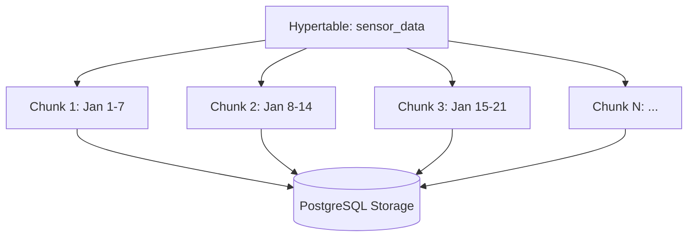
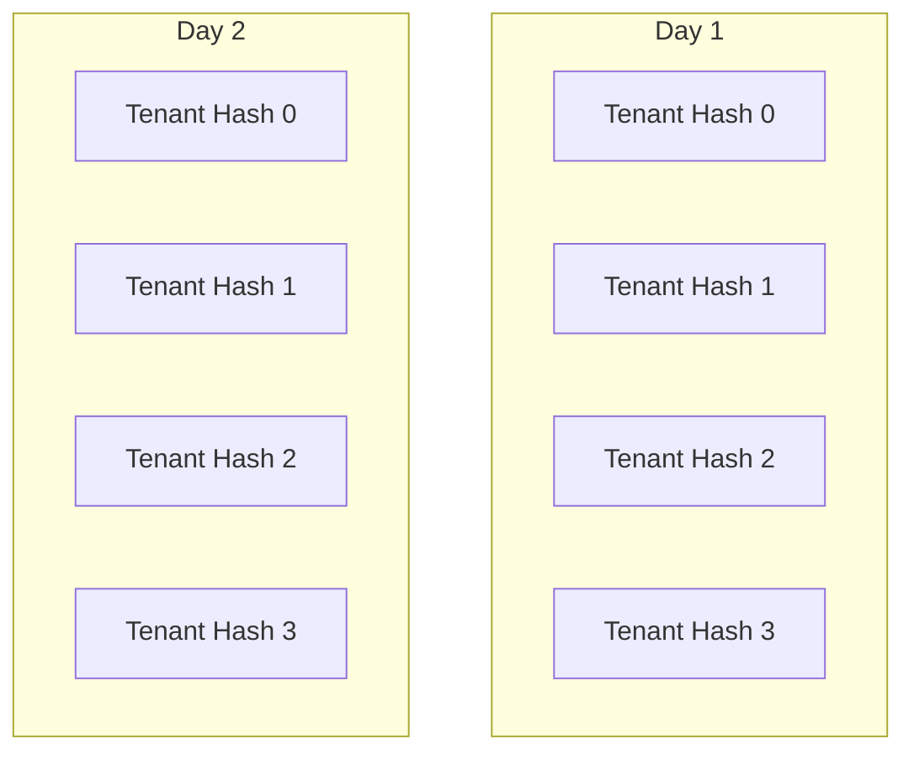

# How to Create Hypertables in TimescaleDB

Author: [nawazdhandala](https://www.github.com/nawazdhandala)

Tags: TimescaleDB, Time-Series, PostgreSQL, Database, Hypertables

Description: Learn how to create and configure hypertables in TimescaleDB for efficient time-series data storage, including partitioning strategies and best practices.

---

> TimescaleDB extends PostgreSQL to handle time-series data at scale. The key to its performance is the hypertable, which automatically partitions your data by time. This guide walks you through creating hypertables and configuring them for production workloads.

If you're storing metrics, logs, IoT sensor readings, or any data with timestamps, hypertables will dramatically improve your query performance and data management.

---

## What is a Hypertable?

A hypertable looks and acts like a regular PostgreSQL table, but behind the scenes, it automatically splits your data into smaller chunks based on time intervals. This partitioning strategy provides several benefits:

- Faster queries that target specific time ranges
- Efficient data retention policies (drop old data without vacuum overhead)
- Better compression ratios on older data
- Parallelized queries across chunks



Each chunk is a regular PostgreSQL table, so you get all the benefits of PostgreSQL (indexes, constraints, ACID) while gaining time-series optimizations.

---

## Prerequisites

Before creating hypertables, you need TimescaleDB installed. Here's a quick setup for common platforms.

Install TimescaleDB on Ubuntu/Debian:

```bash
# Add TimescaleDB repository
sudo sh -c "echo 'deb https://packagecloud.io/timescale/timescaledb/ubuntu/ $(lsb_release -c -s) main' > /etc/apt/sources.list.d/timescaledb.list"

# Import GPG key
wget --quiet -O - https://packagecloud.io/timescale/timescaledb/gpgkey | sudo apt-key add -

# Install TimescaleDB for PostgreSQL 15
sudo apt-get update
sudo apt-get install timescaledb-2-postgresql-15

# Run the setup script
sudo timescaledb-tune
sudo systemctl restart postgresql
```

Enable the extension in your database:

```sql
-- Connect to your database and enable TimescaleDB
CREATE EXTENSION IF NOT EXISTS timescaledb;

-- Verify installation
SELECT extversion FROM pg_extension WHERE extname = 'timescaledb';
```

---

## Creating Your First Hypertable

The process involves two steps: create a regular table, then convert it to a hypertable.

### Step 1: Create the Base Table

Start with a regular PostgreSQL table. The only requirement is that it must have a time column (timestamp, timestamptz, or date):

```sql
-- Create a table for storing sensor readings
-- This is a standard PostgreSQL table at this point
CREATE TABLE sensor_data (
    time        TIMESTAMPTZ NOT NULL,  -- Required: time column for partitioning
    sensor_id   INTEGER NOT NULL,       -- Identifies which sensor
    temperature DOUBLE PRECISION,       -- Temperature reading
    humidity    DOUBLE PRECISION,       -- Humidity reading
    location    TEXT                    -- Optional metadata
);
```

### Step 2: Convert to Hypertable

Use the `create_hypertable` function to convert your table. This is a one-time operation that sets up automatic time-based partitioning:

```sql
-- Convert the regular table to a hypertable
-- 'sensor_data' is the table name
-- 'time' is the column to partition by
SELECT create_hypertable('sensor_data', 'time');
```

That's it. Your table now automatically partitions data by time. You can interact with it using standard SQL.

---

## Configuring Chunk Time Intervals

By default, TimescaleDB creates 7-day chunks. You can customize this based on your data volume and query patterns.

Specify a custom chunk interval when creating the hypertable. The interval should be based on how much data you ingest and how you typically query it:

```sql
-- Create hypertable with 1-day chunks
-- Good for high-volume data (millions of rows per day)
SELECT create_hypertable(
    'sensor_data',
    'time',
    chunk_time_interval => INTERVAL '1 day'
);

-- Create hypertable with 1-hour chunks
-- For very high-volume data (IoT, metrics at sub-second intervals)
SELECT create_hypertable(
    'high_frequency_metrics',
    'time',
    chunk_time_interval => INTERVAL '1 hour'
);

-- Create hypertable with 1-month chunks
-- For lower-volume data or long-term storage
SELECT create_hypertable(
    'monthly_reports',
    'time',
    chunk_time_interval => INTERVAL '1 month'
);
```

### Choosing the Right Chunk Interval

The ideal chunk size depends on your workload:

| Data Volume | Recommended Interval | Reasoning |
|------------|---------------------|-----------|
| < 10K rows/day | 1 week - 1 month | Fewer chunks, simpler management |
| 10K - 1M rows/day | 1 day | Balance between chunk count and size |
| 1M - 100M rows/day | 1 hour - 6 hours | Smaller chunks for faster operations |
| > 100M rows/day | 15 min - 1 hour | Very granular for high-volume workloads |

A good rule of thumb: aim for chunks between 25-100 GB each.

---

## Space Partitioning for Multi-tenant Data

When you have high cardinality on a dimension like `sensor_id` or `tenant_id`, you can add space partitioning alongside time partitioning.

Create a hypertable with both time and space partitioning. This is useful for multi-tenant applications where queries often filter by tenant:

```sql
-- Create table for multi-tenant metrics
CREATE TABLE tenant_metrics (
    time        TIMESTAMPTZ NOT NULL,
    tenant_id   INTEGER NOT NULL,
    metric_name TEXT NOT NULL,
    value       DOUBLE PRECISION
);

-- Create hypertable with space partitioning
-- Partitions by time AND by tenant_id hash
SELECT create_hypertable(
    'tenant_metrics',
    'time',
    partitioning_column => 'tenant_id',
    number_partitions => 4,  -- Creates 4 space partitions per time chunk
    chunk_time_interval => INTERVAL '1 day'
);
```

This creates a grid of chunks - each time interval has multiple space partitions:



---

## Creating Indexes on Hypertables

Indexes work just like regular PostgreSQL tables. TimescaleDB automatically creates an index on the time column, but you'll want additional indexes for your query patterns.

Create indexes for common query patterns. These are automatically applied to all chunks, including future ones:

```sql
-- Index for queries that filter by sensor_id and time
-- This is the most common pattern for time-series queries
CREATE INDEX idx_sensor_time ON sensor_data (sensor_id, time DESC);

-- Index for location-based queries
CREATE INDEX idx_location ON sensor_data (location);

-- Composite index for filtering on multiple columns
CREATE INDEX idx_sensor_location_time ON sensor_data (sensor_id, location, time DESC);
```

Check your index usage to ensure they're being used:

```sql
-- View index usage statistics
SELECT
    indexrelname AS index_name,
    idx_scan AS times_used,
    idx_tup_read AS rows_read,
    idx_tup_fetch AS rows_fetched
FROM pg_stat_user_indexes
WHERE schemaname = 'public'
ORDER BY idx_scan DESC;
```

---

## Inserting Data

Insert data exactly as you would with a regular PostgreSQL table. TimescaleDB handles routing to the correct chunk automatically.

Standard INSERT statements work normally. Data is automatically routed to the appropriate time-based chunk:

```sql
-- Single row insert
INSERT INTO sensor_data (time, sensor_id, temperature, humidity, location)
VALUES (NOW(), 1, 23.5, 65.2, 'warehouse-a');

-- Batch insert for better performance
INSERT INTO sensor_data (time, sensor_id, temperature, humidity, location)
VALUES
    (NOW() - INTERVAL '1 hour', 1, 22.1, 63.5, 'warehouse-a'),
    (NOW() - INTERVAL '2 hours', 1, 21.8, 64.0, 'warehouse-a'),
    (NOW() - INTERVAL '3 hours', 1, 21.5, 64.5, 'warehouse-a'),
    (NOW(), 2, 25.0, 58.0, 'warehouse-b');
```

For high-volume inserts, use COPY for best performance:

```sql
-- COPY is significantly faster for bulk inserts
COPY sensor_data (time, sensor_id, temperature, humidity, location)
FROM '/path/to/data.csv'
WITH (FORMAT csv, HEADER true);
```

---

## Querying Hypertables

Queries work with standard SQL. TimescaleDB optimizes queries that include time predicates by only scanning relevant chunks.

Query your hypertable using familiar SQL. TimescaleDB automatically prunes chunks that don't match your time filter:

```sql
-- Get recent data - only scans the latest chunk(s)
SELECT * FROM sensor_data
WHERE time > NOW() - INTERVAL '1 hour'
ORDER BY time DESC;

-- Aggregate data by time bucket - TimescaleDB's time_bucket function
-- Groups data into 5-minute intervals
SELECT
    time_bucket('5 minutes', time) AS bucket,
    sensor_id,
    AVG(temperature) AS avg_temp,
    MAX(temperature) AS max_temp,
    MIN(temperature) AS min_temp
FROM sensor_data
WHERE time > NOW() - INTERVAL '24 hours'
GROUP BY bucket, sensor_id
ORDER BY bucket DESC;

-- Get the latest reading per sensor
SELECT DISTINCT ON (sensor_id)
    sensor_id,
    time,
    temperature,
    humidity
FROM sensor_data
ORDER BY sensor_id, time DESC;
```

### Time Bucket Functions

TimescaleDB provides powerful time-based aggregation functions:

```sql
-- Various time bucket sizes
SELECT
    time_bucket('1 minute', time) AS minute_bucket,
    time_bucket('1 hour', time) AS hour_bucket,
    time_bucket('1 day', time) AS day_bucket,
    AVG(temperature) AS avg_temp
FROM sensor_data
WHERE time > NOW() - INTERVAL '7 days'
GROUP BY minute_bucket, hour_bucket, day_bucket
ORDER BY minute_bucket;

-- Time bucket with origin for custom alignment
-- Aligns to business hours (9 AM)
SELECT
    time_bucket('1 hour', time, TIMESTAMPTZ '2024-01-01 09:00:00') AS bucket,
    COUNT(*) AS readings
FROM sensor_data
GROUP BY bucket
ORDER BY bucket;
```

---

## Converting Existing Tables

If you have an existing PostgreSQL table with data, you can migrate it to a hypertable.

Migrate an existing table to a hypertable. The `migrate_data` parameter moves existing rows into the appropriate chunks:

```sql
-- Convert existing table with data
-- This may take time for large tables
SELECT create_hypertable(
    'existing_metrics_table',
    'time',
    migrate_data => true,
    chunk_time_interval => INTERVAL '1 day'
);
```

For large tables, consider migrating in batches to avoid long locks:

```sql
-- Create new hypertable
CREATE TABLE sensor_data_new (LIKE sensor_data INCLUDING ALL);
SELECT create_hypertable('sensor_data_new', 'time');

-- Migrate in batches
INSERT INTO sensor_data_new
SELECT * FROM sensor_data
WHERE time >= '2024-01-01' AND time < '2024-02-01';

-- Repeat for other time ranges...

-- Swap tables
ALTER TABLE sensor_data RENAME TO sensor_data_old;
ALTER TABLE sensor_data_new RENAME TO sensor_data;
```

---

## Viewing Hypertable Information

TimescaleDB provides functions to inspect your hypertables and chunks.

Check your hypertable configuration and chunk information:

```sql
-- List all hypertables
SELECT
    hypertable_schema,
    hypertable_name,
    num_chunks,
    compression_enabled
FROM timescaledb_information.hypertables;

-- View chunk details for a specific hypertable
SELECT
    chunk_schema,
    chunk_name,
    range_start,
    range_end,
    is_compressed
FROM timescaledb_information.chunks
WHERE hypertable_name = 'sensor_data'
ORDER BY range_start DESC
LIMIT 10;

-- Check hypertable disk usage
SELECT
    hypertable_name,
    pg_size_pretty(hypertable_size(format('%I.%I', hypertable_schema, hypertable_name)::regclass)) AS total_size,
    pg_size_pretty(pg_total_relation_size(format('%I.%I', hypertable_schema, hypertable_name)::regclass)) AS table_size
FROM timescaledb_information.hypertables;

-- Detailed chunk sizes
SELECT
    chunk_name,
    pg_size_pretty(pg_total_relation_size(format('%I.%I', chunk_schema, chunk_name)::regclass)) AS chunk_size
FROM timescaledb_information.chunks
WHERE hypertable_name = 'sensor_data'
ORDER BY range_start DESC;
```

---

## Data Retention Policies

One of the biggest advantages of hypertables is efficient data retention. Dropping old chunks is instant compared to DELETE operations.

Set up automatic data retention to drop chunks older than a specified age:

```sql
-- Automatically drop chunks older than 30 days
SELECT add_retention_policy('sensor_data', INTERVAL '30 days');

-- Check existing retention policies
SELECT * FROM timescaledb_information.jobs
WHERE proc_name = 'policy_retention';

-- Manually drop old chunks (if you prefer manual control)
SELECT drop_chunks('sensor_data', OLDER_THAN => INTERVAL '30 days');

-- Remove retention policy if needed
SELECT remove_retention_policy('sensor_data');
```

---

## Compression for Cost Savings

TimescaleDB can compress older chunks to save storage space, often achieving 90%+ compression ratios.

Enable compression on a hypertable and set up automatic compression for older data:

```sql
-- Enable compression on the hypertable
ALTER TABLE sensor_data SET (
    timescaledb.compress,
    timescaledb.compress_segmentby = 'sensor_id',  -- Group compressed data by sensor
    timescaledb.compress_orderby = 'time DESC'     -- Order within segments
);

-- Set up automatic compression for chunks older than 7 days
SELECT add_compression_policy('sensor_data', INTERVAL '7 days');

-- Manually compress a specific chunk
SELECT compress_chunk('_timescaledb_internal._hyper_1_1_chunk');

-- Check compression savings
SELECT
    chunk_name,
    before_compression_total_bytes,
    after_compression_total_bytes,
    ROUND(
        (1 - after_compression_total_bytes::numeric / before_compression_total_bytes) * 100,
        2
    ) AS compression_ratio_pct
FROM timescaledb_information.compressed_chunk_stats
WHERE hypertable_name = 'sensor_data';
```

---

## Complete Example: IoT Sensor Monitoring

Here's a complete example putting it all together for an IoT monitoring use case.

Full setup for a production IoT sensor monitoring system:

```sql
-- 1. Create the hypertable
CREATE TABLE iot_readings (
    time        TIMESTAMPTZ NOT NULL,
    device_id   TEXT NOT NULL,
    metric_type TEXT NOT NULL,
    value       DOUBLE PRECISION NOT NULL,
    metadata    JSONB
);

-- Convert to hypertable with 1-day chunks
SELECT create_hypertable(
    'iot_readings',
    'time',
    chunk_time_interval => INTERVAL '1 day'
);

-- 2. Create indexes for common query patterns
CREATE INDEX idx_device_time ON iot_readings (device_id, time DESC);
CREATE INDEX idx_metric_type ON iot_readings (metric_type, time DESC);

-- 3. Enable compression for cost savings
ALTER TABLE iot_readings SET (
    timescaledb.compress,
    timescaledb.compress_segmentby = 'device_id, metric_type',
    timescaledb.compress_orderby = 'time DESC'
);

-- Compress chunks older than 7 days
SELECT add_compression_policy('iot_readings', INTERVAL '7 days');

-- 4. Set up data retention - keep 90 days of data
SELECT add_retention_policy('iot_readings', INTERVAL '90 days');

-- 5. Create a continuous aggregate for dashboards
CREATE MATERIALIZED VIEW iot_hourly_stats
WITH (timescaledb.continuous) AS
SELECT
    time_bucket('1 hour', time) AS bucket,
    device_id,
    metric_type,
    AVG(value) AS avg_value,
    MIN(value) AS min_value,
    MAX(value) AS max_value,
    COUNT(*) AS reading_count
FROM iot_readings
GROUP BY bucket, device_id, metric_type;

-- Refresh the continuous aggregate automatically
SELECT add_continuous_aggregate_policy('iot_hourly_stats',
    start_offset => INTERVAL '3 hours',
    end_offset => INTERVAL '1 hour',
    schedule_interval => INTERVAL '1 hour');
```

Query the system for a device dashboard:

```sql
-- Get recent readings for a specific device
SELECT
    time,
    metric_type,
    value
FROM iot_readings
WHERE device_id = 'sensor-001'
    AND time > NOW() - INTERVAL '1 hour'
ORDER BY time DESC;

-- Get hourly averages from the continuous aggregate (fast!)
SELECT
    bucket,
    metric_type,
    avg_value,
    reading_count
FROM iot_hourly_stats
WHERE device_id = 'sensor-001'
    AND bucket > NOW() - INTERVAL '24 hours'
ORDER BY bucket DESC;

-- Find devices with anomalous readings
SELECT
    device_id,
    AVG(value) AS avg_temp,
    MAX(value) AS max_temp
FROM iot_readings
WHERE metric_type = 'temperature'
    AND time > NOW() - INTERVAL '1 hour'
GROUP BY device_id
HAVING MAX(value) > 50  -- Alert threshold
ORDER BY max_temp DESC;
```

---

## Common Pitfalls to Avoid

### 1. Forgetting the Time Column

The time column must be NOT NULL:

```sql
-- This will fail
CREATE TABLE bad_example (time TIMESTAMPTZ);  -- Missing NOT NULL
SELECT create_hypertable('bad_example', 'time');  -- Error!

-- Correct
CREATE TABLE good_example (time TIMESTAMPTZ NOT NULL);
SELECT create_hypertable('good_example', 'time');  -- Works
```

### 2. Wrong Chunk Interval

Too small chunks create overhead, too large chunks reduce benefits:

```sql
-- Bad: Creates thousands of chunks per day
SELECT create_hypertable('data', 'time', chunk_time_interval => INTERVAL '1 minute');

-- Better: Appropriate for most workloads
SELECT create_hypertable('data', 'time', chunk_time_interval => INTERVAL '1 day');
```

### 3. Missing Indexes

Time column is indexed automatically, but you need indexes for other filter columns:

```sql
-- If you frequently query by device_id
CREATE INDEX idx_device_time ON sensor_data (device_id, time DESC);
```

---

## Conclusion

Hypertables are the foundation of TimescaleDB's time-series capabilities. Key takeaways:

- **Create hypertables** from regular PostgreSQL tables with `create_hypertable()`
- **Choose chunk intervals** based on your data volume - aim for 25-100 GB per chunk
- **Add indexes** for columns you filter on frequently
- **Enable compression** on older chunks to save 90%+ storage
- **Set retention policies** to automatically drop old data
- **Use continuous aggregates** for pre-computed rollups

With proper hypertable configuration, you can handle millions of time-series data points while maintaining fast query performance.

---

*Need to monitor your TimescaleDB instances? [OneUptime](https://oneuptime.com) provides database monitoring with query performance tracking, storage alerts, and automatic anomaly detection for your time-series workloads.*
