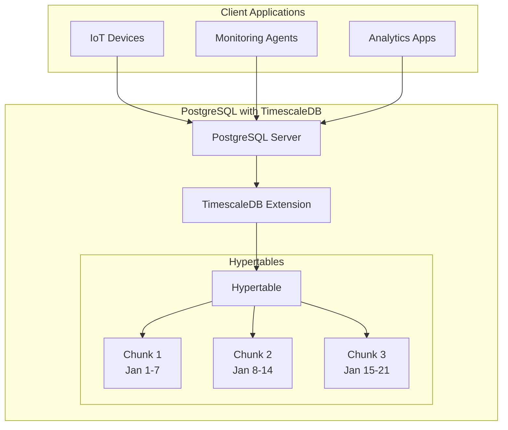
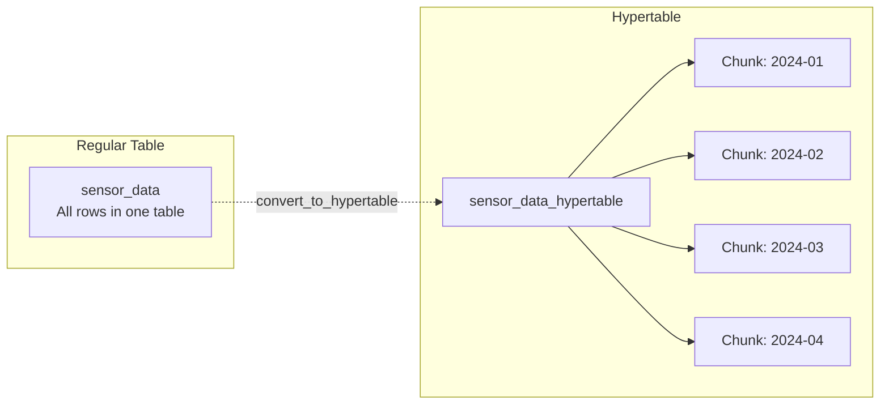
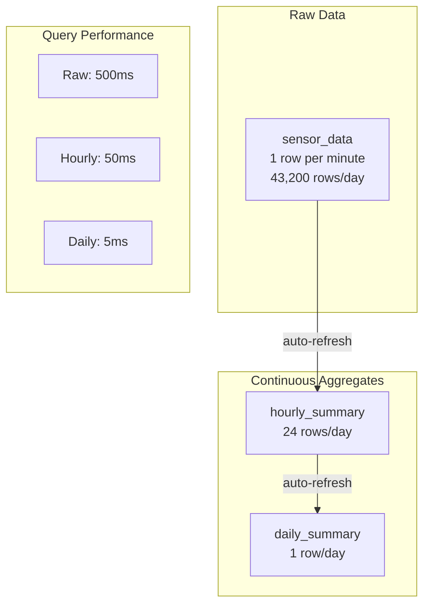

# How to Install TimescaleDB on PostgreSQL

Author: [nawazdhandala](https://www.github.com/nawazdhandala)

Tags: PostgreSQL, TimescaleDB, Time-Series, Database, Installation, Linux, Docker

Description: A comprehensive guide to installing TimescaleDB on PostgreSQL. Learn how to set up TimescaleDB on Ubuntu, CentOS, macOS, and Docker, configure hypertables, and optimize your time-series database for production workloads.

---

TimescaleDB transforms PostgreSQL into a powerful time-series database while preserving full SQL compatibility. Whether you're building IoT applications, monitoring systems, or analytics platforms, TimescaleDB provides the scalability and performance needed for time-series data at scale.

## Understanding TimescaleDB Architecture



TimescaleDB automatically partitions data into chunks based on time intervals, enabling efficient queries and data management without manual partitioning.

## Prerequisites

Before installation, ensure your system meets these requirements:

- PostgreSQL 13, 14, 15, or 16
- At least 2GB RAM (4GB+ recommended for production)
- 20GB+ free disk space
- Root or sudo access

## Installation on Ubuntu/Debian

### Step 1: Add the TimescaleDB Repository

The following commands add the official TimescaleDB APT repository to your system.

```bash
# Add the TimescaleDB repository GPG key
sudo apt-get update
sudo apt-get install -y gnupg postgresql-common apt-transport-https lsb-release wget

# Add the repository
echo "deb https://packagecloud.io/timescale/timescaledb/ubuntu/ $(lsb_release -c -s) main" | sudo tee /etc/apt/sources.list.d/timescaledb.list

# Import the repository signing key
wget --quiet -O - https://packagecloud.io/timescale/timescaledb/gpgkey | sudo apt-key add -

# Update package lists
sudo apt-get update
```

### Step 2: Install TimescaleDB

Install TimescaleDB for your specific PostgreSQL version. Replace `16` with your PostgreSQL version number.

```bash
# Install TimescaleDB for PostgreSQL 16
sudo apt-get install -y timescaledb-2-postgresql-16

# For PostgreSQL 15, use:
# sudo apt-get install -y timescaledb-2-postgresql-15

# For PostgreSQL 14, use:
# sudo apt-get install -y timescaledb-2-postgresql-14
```

### Step 3: Run the Configuration Wizard

TimescaleDB includes a tuning wizard that automatically configures PostgreSQL for optimal time-series performance.

```bash
# Run the TimescaleDB tuning utility
sudo timescaledb-tune --quiet --yes

# Restart PostgreSQL to apply changes
sudo systemctl restart postgresql
```

### Step 4: Enable the Extension

Connect to your database and enable the TimescaleDB extension.

```bash
# Connect to PostgreSQL
sudo -u postgres psql

# Create the extension in your database
CREATE EXTENSION IF NOT EXISTS timescaledb;

# Verify installation
\dx timescaledb
```

## Installation on CentOS/RHEL/Rocky Linux

### Step 1: Add the TimescaleDB Repository

Create the repository configuration file for yum/dnf package manager.

```bash
# Create the TimescaleDB repository file
sudo tee /etc/yum.repos.d/timescale_timescaledb.repo <<EOF
[timescale_timescaledb]
name=timescale_timescaledb
baseurl=https://packagecloud.io/timescale/timescaledb/el/\$releasever/\$basearch
repo_gpgcheck=1
gpgcheck=0
enabled=1
gpgkey=https://packagecloud.io/timescale/timescaledb/gpgkey
sslverify=1
sslcacert=/etc/pki/tls/certs/ca-bundle.crt
metadata_expire=300
EOF
```

### Step 2: Install TimescaleDB

Install TimescaleDB using dnf or yum, depending on your system.

```bash
# Update package cache and install TimescaleDB for PostgreSQL 16
sudo dnf update -y
sudo dnf install -y timescaledb-2-postgresql-16

# For older systems using yum:
# sudo yum update -y
# sudo yum install -y timescaledb-2-postgresql-16
```

### Step 3: Configure and Enable

Run the configuration wizard and restart PostgreSQL.

```bash
# Run the tuning utility
sudo timescaledb-tune --quiet --yes

# Restart PostgreSQL
sudo systemctl restart postgresql-16

# Enable PostgreSQL to start on boot
sudo systemctl enable postgresql-16
```

## Installation on macOS

### Using Homebrew

Homebrew provides the simplest installation method for macOS users.

```bash
# Tap the TimescaleDB repository
brew tap timescale/tap

# Install TimescaleDB
brew install timescaledb

# Run the post-installation setup
timescaledb_move.sh

# Restart PostgreSQL
brew services restart postgresql@16
```

### Manual Configuration on macOS

After installation, verify the configuration file includes TimescaleDB.

```bash
# Find your PostgreSQL configuration file
psql -c "SHOW config_file;"

# Edit the configuration (usually at /opt/homebrew/var/postgresql@16/postgresql.conf)
# Ensure this line exists:
# shared_preload_libraries = 'timescaledb'

# Restart PostgreSQL
brew services restart postgresql@16
```

## Installation with Docker

### Basic Docker Setup

Docker provides the fastest way to get TimescaleDB running for development and testing.

```bash
# Pull the latest TimescaleDB image
docker pull timescale/timescaledb:latest-pg16

# Run TimescaleDB container
docker run -d \
  --name timescaledb \
  -p 5432:5432 \
  -e POSTGRES_PASSWORD=your_secure_password \
  -v timescaledb_data:/var/lib/postgresql/data \
  timescale/timescaledb:latest-pg16

# Verify the container is running
docker ps | grep timescaledb
```

### Docker Compose Configuration

For production-like environments, use Docker Compose with proper resource limits and configuration.

```yaml
# docker-compose.yml
version: '3.8'

services:
  timescaledb:
    image: timescale/timescaledb:latest-pg16
    container_name: timescaledb
    restart: unless-stopped
    ports:
      - "5432:5432"
    environment:
      POSTGRES_USER: postgres
      POSTGRES_PASSWORD: your_secure_password
      POSTGRES_DB: timeseries_db
    volumes:
      - timescaledb_data:/var/lib/postgresql/data
      - ./init-scripts:/docker-entrypoint-initdb.d
    command: >
      postgres
        -c shared_preload_libraries=timescaledb
        -c max_connections=200
        -c shared_buffers=2GB
        -c effective_cache_size=6GB
        -c maintenance_work_mem=512MB
        -c work_mem=64MB
        -c timescaledb.max_background_workers=8
    deploy:
      resources:
        limits:
          memory: 8G
          cpus: '4'

volumes:
  timescaledb_data:
```

Start the Docker Compose stack with proper initialization.

```bash
# Start TimescaleDB
docker-compose up -d

# Check logs for any errors
docker-compose logs -f timescaledb

# Connect to the database
docker exec -it timescaledb psql -U postgres -d timeseries_db
```

## Verifying Your Installation

### Check Extension Status

Run these queries to verify TimescaleDB is properly installed and configured.

```sql
-- Connect to your database
\c your_database

-- Enable TimescaleDB extension
CREATE EXTENSION IF NOT EXISTS timescaledb;

-- Check TimescaleDB version
SELECT extversion FROM pg_extension WHERE extname = 'timescaledb';

-- View detailed version information
SELECT * FROM timescaledb_information.version();

-- List all TimescaleDB functions
\df *timescale*
```

### Verify Configuration

Check that PostgreSQL is configured correctly for TimescaleDB.

```sql
-- Check if TimescaleDB is loaded
SHOW shared_preload_libraries;
-- Should include 'timescaledb'

-- Check TimescaleDB-specific settings
SHOW timescaledb.max_background_workers;
SHOW timescaledb.telemetry_level;

-- View all TimescaleDB settings
SELECT name, setting, unit, context
FROM pg_settings
WHERE name LIKE 'timescaledb%';
```

## Creating Your First Hypertable

### Understanding Hypertables



### Create a Hypertable for Sensor Data

Create a table and convert it to a hypertable for automatic time-based partitioning.

```sql
-- Create a regular PostgreSQL table
CREATE TABLE sensor_data (
    time        TIMESTAMPTZ       NOT NULL,
    sensor_id   INTEGER           NOT NULL,
    temperature DOUBLE PRECISION  NULL,
    humidity    DOUBLE PRECISION  NULL,
    location    TEXT              NOT NULL
);

-- Convert to a hypertable, partitioned by time
-- Chunks are created automatically every 7 days
SELECT create_hypertable(
    'sensor_data',
    'time',
    chunk_time_interval => INTERVAL '7 days'
);

-- Add an index for common queries
CREATE INDEX ON sensor_data (sensor_id, time DESC);
CREATE INDEX ON sensor_data (location, time DESC);
```

### Insert Sample Data

Insert test data to verify the hypertable is working correctly.

```sql
-- Insert sample data
INSERT INTO sensor_data (time, sensor_id, temperature, humidity, location)
SELECT
    generate_series(
        NOW() - INTERVAL '30 days',
        NOW(),
        INTERVAL '1 minute'
    ) AS time,
    (random() * 100)::INTEGER AS sensor_id,
    20 + (random() * 15) AS temperature,
    40 + (random() * 40) AS humidity,
    CASE (random() * 3)::INTEGER
        WHEN 0 THEN 'warehouse-a'
        WHEN 1 THEN 'warehouse-b'
        ELSE 'warehouse-c'
    END AS location;

-- Check row count
SELECT COUNT(*) FROM sensor_data;

-- View chunk information
SELECT chunk_name, range_start, range_end
FROM timescaledb_information.chunks
WHERE hypertable_name = 'sensor_data'
ORDER BY range_start;
```

## Essential TimescaleDB Configuration

### Memory and Performance Settings

Optimize PostgreSQL settings for time-series workloads.

```sql
-- View recommended settings based on your system
SELECT * FROM timescaledb_information.version();
```

Edit your `postgresql.conf` file with these recommended settings for a server with 16GB RAM.

```bash
# Memory settings
shared_buffers = 4GB                    # 25% of total RAM
effective_cache_size = 12GB             # 75% of total RAM
work_mem = 64MB                         # Per-operation memory
maintenance_work_mem = 1GB              # For maintenance operations

# TimescaleDB-specific settings
timescaledb.max_background_workers = 8  # For parallel chunk operations
max_parallel_workers_per_gather = 4     # Parallel query execution
max_parallel_workers = 8                # Total parallel workers

# Write-ahead log settings for time-series workloads
wal_buffers = 64MB
min_wal_size = 1GB
max_wal_size = 4GB
checkpoint_completion_target = 0.9

# Connection settings
max_connections = 200
```

### Automated Tuning with timescaledb-tune

The tuning utility automatically configures PostgreSQL based on your system resources.

```bash
# Run with interactive prompts
sudo timescaledb-tune

# Run with automatic yes to all prompts
sudo timescaledb-tune --quiet --yes

# Specify memory explicitly
sudo timescaledb-tune --memory=16GB --yes

# Preview changes without applying
sudo timescaledb-tune --dry-run
```

## Data Retention and Compression

### Setting Up Automatic Data Retention

Configure policies to automatically drop old data, keeping your database size manageable.

```sql
-- Add a retention policy to drop data older than 90 days
SELECT add_retention_policy('sensor_data', INTERVAL '90 days');

-- View active retention policies
SELECT * FROM timescaledb_information.jobs
WHERE proc_name = 'policy_retention';

-- Manually drop old chunks (for one-time cleanup)
SELECT drop_chunks('sensor_data', OLDER_THAN => INTERVAL '90 days');
```

### Enabling Compression

Compression can reduce storage by 90% or more for time-series data.

```sql
-- Enable compression on the hypertable
ALTER TABLE sensor_data SET (
    timescaledb.compress,
    timescaledb.compress_segmentby = 'sensor_id, location',
    timescaledb.compress_orderby = 'time DESC'
);

-- Add a compression policy to compress chunks older than 7 days
SELECT add_compression_policy('sensor_data', INTERVAL '7 days');

-- View compression status
SELECT
    chunk_name,
    before_compression_total_bytes,
    after_compression_total_bytes,
    compression_ratio
FROM chunk_compression_stats('sensor_data');

-- Manually compress all eligible chunks
SELECT compress_chunk(c)
FROM show_chunks('sensor_data', older_than => INTERVAL '7 days') c;
```

## Continuous Aggregates

### Creating Real-Time Rollups

Continuous aggregates automatically maintain pre-computed summaries, dramatically speeding up analytical queries.



Create continuous aggregates for common query patterns.

```sql
-- Create an hourly summary continuous aggregate
CREATE MATERIALIZED VIEW sensor_hourly_summary
WITH (timescaledb.continuous) AS
SELECT
    time_bucket('1 hour', time) AS bucket,
    sensor_id,
    location,
    AVG(temperature) AS avg_temp,
    MIN(temperature) AS min_temp,
    MAX(temperature) AS max_temp,
    AVG(humidity) AS avg_humidity,
    COUNT(*) AS reading_count
FROM sensor_data
GROUP BY bucket, sensor_id, location
WITH NO DATA;

-- Add a refresh policy to keep the aggregate up to date
SELECT add_continuous_aggregate_policy('sensor_hourly_summary',
    start_offset => INTERVAL '3 hours',
    end_offset => INTERVAL '1 hour',
    schedule_interval => INTERVAL '1 hour'
);

-- Manually refresh the aggregate for historical data
CALL refresh_continuous_aggregate('sensor_hourly_summary', NULL, NOW());

-- Query the continuous aggregate (much faster than raw data)
SELECT * FROM sensor_hourly_summary
WHERE bucket >= NOW() - INTERVAL '7 days'
AND sensor_id = 42
ORDER BY bucket DESC;
```

## Monitoring TimescaleDB

### Check Hypertable Statistics

Monitor your hypertables to ensure optimal performance.

```sql
-- View hypertable size and statistics
SELECT
    hypertable_name,
    total_bytes,
    pg_size_pretty(total_bytes) AS total_size,
    num_chunks
FROM hypertable_detailed_size('sensor_data');

-- View chunk details
SELECT
    chunk_name,
    range_start,
    range_end,
    pg_size_pretty(chunk_total_bytes) AS size,
    is_compressed
FROM timescaledb_information.chunks
WHERE hypertable_name = 'sensor_data'
ORDER BY range_start DESC
LIMIT 10;

-- View background job status
SELECT
    job_id,
    application_name,
    schedule_interval,
    last_run_status,
    last_run_started_at,
    next_start
FROM timescaledb_information.jobs
WHERE application_name LIKE '%sensor_data%';
```

### Performance Monitoring Queries

Track query performance and identify slow queries.

```sql
-- Enable query statistics extension
CREATE EXTENSION IF NOT EXISTS pg_stat_statements;

-- Find slowest queries on TimescaleDB tables
SELECT
    calls,
    round(total_exec_time::numeric, 2) AS total_time_ms,
    round(mean_exec_time::numeric, 2) AS mean_time_ms,
    round(rows::numeric / calls, 2) AS avg_rows,
    query
FROM pg_stat_statements
WHERE query LIKE '%sensor_data%'
ORDER BY total_exec_time DESC
LIMIT 10;
```

## Troubleshooting Common Issues

### Extension Load Failure

If TimescaleDB fails to load, check the shared preload libraries configuration.

```bash
# Check PostgreSQL error log
sudo tail -100 /var/log/postgresql/postgresql-16-main.log

# Verify shared_preload_libraries setting
sudo grep shared_preload_libraries /etc/postgresql/16/main/postgresql.conf

# Fix if missing or incorrect
sudo sed -i "s/#shared_preload_libraries = ''/shared_preload_libraries = 'timescaledb'/" /etc/postgresql/16/main/postgresql.conf

# Restart PostgreSQL
sudo systemctl restart postgresql
```

### Permission Issues

Ensure proper permissions for the extension.

```sql
-- Grant necessary permissions to application user
GRANT USAGE ON SCHEMA timescaledb_information TO your_app_user;
GRANT SELECT ON ALL TABLES IN SCHEMA timescaledb_information TO your_app_user;

-- Grant permissions on hypertables
GRANT ALL ON sensor_data TO your_app_user;
```

### Chunk Not Compressing

Check why chunks are not being compressed automatically.

```sql
-- View compression policy status
SELECT * FROM timescaledb_information.jobs
WHERE proc_name = 'policy_compression';

-- Check for chunks that should be compressed
SELECT chunk_name, range_end, is_compressed
FROM timescaledb_information.chunks
WHERE hypertable_name = 'sensor_data'
AND is_compressed = false
AND range_end < NOW() - INTERVAL '7 days';

-- Run compression manually to see errors
SELECT compress_chunk(chunk_name::regclass)
FROM timescaledb_information.chunks
WHERE hypertable_name = 'sensor_data'
AND is_compressed = false
AND range_end < NOW() - INTERVAL '7 days';
```

## Production Best Practices

Following these guidelines will help you run TimescaleDB reliably in production:

1. **Use dedicated storage**: Place PostgreSQL data on fast SSDs with RAID for reliability
2. **Configure proper backups**: Use pg_dump or pg_basebackup with WAL archiving
3. **Set up monitoring**: Track chunk sizes, compression ratios, and query performance
4. **Plan for retention**: Configure retention policies before your disk fills up
5. **Use connection pooling**: Deploy PgBouncer to manage database connections
6. **Test compression settings**: Different segment-by columns affect compression ratios
7. **Monitor background jobs**: Ensure compression and retention jobs complete successfully
8. **Plan chunk intervals**: Smaller chunks for high-frequency data, larger for low-frequency

---

TimescaleDB brings time-series superpowers to PostgreSQL without sacrificing SQL compatibility or requiring a new database system. With proper installation and configuration, you can handle millions of data points per second while maintaining fast query performance. Start with the basic setup, add compression and continuous aggregates as your data grows, and monitor your hypertables to ensure optimal performance.
