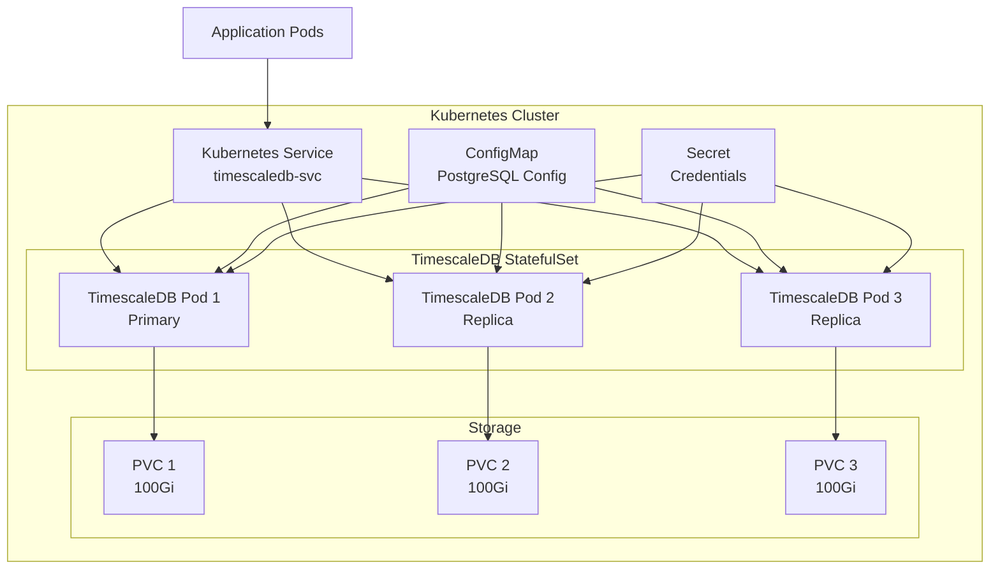
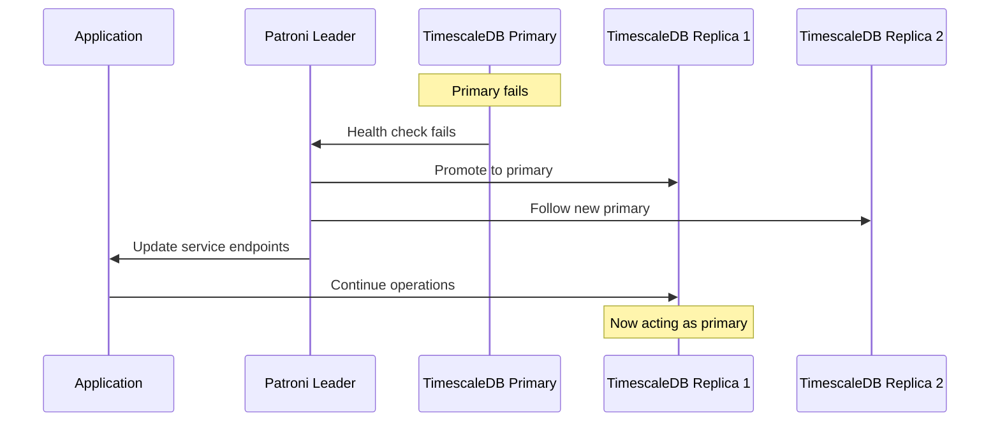
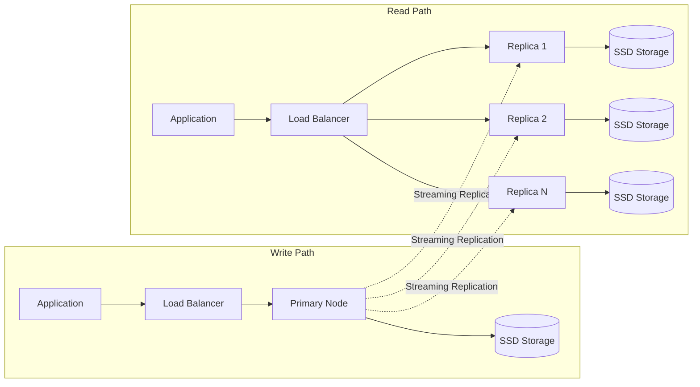

# How to Use TimescaleDB with Kubernetes

Author: [nawazdhandala](https://github.com/nawazdhandala)

Tags: TimescaleDB, Kubernetes, PostgreSQL, Time-Series, DevOps, Database

Description: Learn how to deploy and manage TimescaleDB on Kubernetes for time-series workloads. Covers Helm installation, persistent storage configuration, high availability setup, backup strategies, and performance tuning for production environments.

---

Time-series data powers observability platforms, IoT systems, and financial applications. TimescaleDB extends PostgreSQL with automatic partitioning, compression, and continuous aggregates designed specifically for time-series workloads. Running TimescaleDB on Kubernetes combines the power of time-series analytics with container orchestration, enabling scalable and resilient database deployments.

## Architecture Overview

Before diving into implementation, understanding the components involved helps with design decisions.



## Prerequisites

Ensure your Kubernetes cluster meets these requirements before proceeding:

- Kubernetes 1.25 or later
- kubectl configured with cluster access
- Helm 3.x installed
- Storage class supporting dynamic provisioning
- At least 3 worker nodes for high availability

## Installing TimescaleDB with Helm

The TimescaleDB Helm chart simplifies deployment and configuration. Start by adding the Timescale Helm repository.

```bash
# Add the Timescale Helm repository
helm repo add timescale https://charts.timescale.com

# Update Helm repositories to fetch latest charts
helm repo update

# Create a dedicated namespace for TimescaleDB
kubectl create namespace timescaledb
```

## Creating Configuration Files

Before installation, prepare the configuration values. The following configuration file sets up a production-ready deployment.

```yaml
# values-production.yaml
# Production configuration for TimescaleDB on Kubernetes

# Enable high availability with multiple replicas
replicaCount: 3

# Docker image configuration
image:
  repository: timescale/timescaledb-ha
  tag: pg15-latest
  pullPolicy: IfNotPresent

# Resource allocation - adjust based on workload
resources:
  requests:
    memory: "4Gi"
    cpu: "2"
  limits:
    memory: "8Gi"
    cpu: "4"

# Persistent storage configuration
persistentVolume:
  enabled: true
  size: 100Gi
  storageClass: "standard"  # Replace with your storage class

# PostgreSQL configuration
postgresql:
  # Maximum connections - calculate based on expected load
  max_connections: 200

  # Shared buffers - typically 25% of available memory
  shared_buffers: "2GB"

  # Effective cache size - typically 75% of available memory
  effective_cache_size: "6GB"

  # Work memory for complex queries
  work_mem: "64MB"

  # Maintenance operations memory
  maintenance_work_mem: "512MB"

  # Checkpoint settings for write-heavy workloads
  checkpoint_completion_target: 0.9
  wal_buffers: "64MB"

  # TimescaleDB specific settings
  timescaledb.max_background_workers: 8

# Patroni configuration for HA
patroni:
  # Synchronous replication for data safety
  synchronous_mode: true

  # Maximum lag before replica is removed from sync group
  maximum_lag_on_failover: 1048576  # 1MB

# Enable metrics for monitoring
prometheus:
  enabled: true

# Backup configuration
backup:
  enabled: true
  schedule: "0 2 * * *"  # Daily at 2 AM
  retention: 7  # Keep 7 days of backups
```

Deploy TimescaleDB using the prepared configuration.

```bash
# Install TimescaleDB with custom values
helm install timescaledb timescale/timescaledb-single \
  --namespace timescaledb \
  --values values-production.yaml \
  --wait

# Verify the installation
kubectl get pods -n timescaledb -w
```

## Creating Secrets for Database Credentials

Store database credentials securely using Kubernetes Secrets.

```yaml
# timescaledb-secrets.yaml
# Kubernetes Secret for TimescaleDB credentials
apiVersion: v1
kind: Secret
metadata:
  name: timescaledb-credentials
  namespace: timescaledb
type: Opaque
stringData:
  # Superuser password - use a strong, randomly generated password
  PATRONI_SUPERUSER_PASSWORD: "your-secure-superuser-password"

  # Replication user password for streaming replication
  PATRONI_REPLICATION_PASSWORD: "your-secure-replication-password"

  # Application user password
  PATRONI_admin_PASSWORD: "your-secure-admin-password"
```

Apply the secrets before deploying TimescaleDB.

```bash
# Apply the secrets
kubectl apply -f timescaledb-secrets.yaml

# Verify secret creation
kubectl get secrets -n timescaledb
```

## Configuring Persistent Storage

For production workloads, use a storage class optimized for database operations. Here is an example using a high-performance storage class.

```yaml
# storage-class.yaml
# Storage class optimized for database workloads
apiVersion: storage.k8s.io/v1
kind: StorageClass
metadata:
  name: timescaledb-storage
provisioner: kubernetes.io/gce-pd  # Adjust for your cloud provider
parameters:
  type: pd-ssd
  fsType: ext4
reclaimPolicy: Retain  # Prevent accidental data loss
allowVolumeExpansion: true  # Allow resizing volumes
volumeBindingMode: WaitForFirstConsumer
```

For bare-metal clusters using Longhorn or Ceph, adjust the provisioner accordingly.

```yaml
# storage-class-longhorn.yaml
# Storage class for Longhorn on bare-metal
apiVersion: storage.k8s.io/v1
kind: StorageClass
metadata:
  name: timescaledb-storage
provisioner: driver.longhorn.io
parameters:
  numberOfReplicas: "3"
  staleReplicaTimeout: "2880"
  dataLocality: "best-effort"
reclaimPolicy: Retain
allowVolumeExpansion: true
```

## Connecting to TimescaleDB

After deployment, connect to the database to verify the installation and create your schema.

```bash
# Get the primary pod name
export TSDB_POD=$(kubectl get pods -n timescaledb \
  -l app=timescaledb,role=master \
  -o jsonpath='{.items[0].metadata.name}')

# Connect to the database using psql
kubectl exec -it $TSDB_POD -n timescaledb -- psql -U postgres
```

Create a time-series table using TimescaleDB hypertables.

```sql
-- Create a database for your application
CREATE DATABASE metrics_db;

-- Connect to the new database
\c metrics_db

-- Create a table for time-series metrics
CREATE TABLE sensor_data (
    time        TIMESTAMPTZ NOT NULL,
    sensor_id   INTEGER NOT NULL,
    temperature DOUBLE PRECISION,
    humidity    DOUBLE PRECISION,
    pressure    DOUBLE PRECISION
);

-- Convert to a hypertable for automatic time-based partitioning
-- Chunks are created every 7 days by default
SELECT create_hypertable('sensor_data', 'time');

-- Create an index for fast queries by sensor
CREATE INDEX idx_sensor_data_sensor_id ON sensor_data (sensor_id, time DESC);

-- Enable compression for older data to save storage
ALTER TABLE sensor_data SET (
    timescaledb.compress,
    timescaledb.compress_segmentby = 'sensor_id'
);

-- Add a compression policy - compress chunks older than 7 days
SELECT add_compression_policy('sensor_data', INTERVAL '7 days');

-- Create a continuous aggregate for hourly averages
CREATE MATERIALIZED VIEW sensor_hourly
WITH (timescaledb.continuous) AS
SELECT
    time_bucket('1 hour', time) AS bucket,
    sensor_id,
    AVG(temperature) AS avg_temp,
    AVG(humidity) AS avg_humidity,
    AVG(pressure) AS avg_pressure,
    COUNT(*) AS sample_count
FROM sensor_data
GROUP BY bucket, sensor_id;

-- Add a refresh policy for the continuous aggregate
SELECT add_continuous_aggregate_policy('sensor_hourly',
    start_offset => INTERVAL '3 hours',
    end_offset => INTERVAL '1 hour',
    schedule_interval => INTERVAL '1 hour'
);
```

## Kubernetes Service Configuration

Expose TimescaleDB within the cluster using a headless service for StatefulSet DNS resolution and a regular service for load-balanced access.

```yaml
# timescaledb-service.yaml
# Headless service for StatefulSet DNS resolution
apiVersion: v1
kind: Service
metadata:
  name: timescaledb-headless
  namespace: timescaledb
  labels:
    app: timescaledb
spec:
  type: ClusterIP
  clusterIP: None
  ports:
    - port: 5432
      targetPort: 5432
      name: postgresql
  selector:
    app: timescaledb
---
# Load-balanced service for read replicas
apiVersion: v1
kind: Service
metadata:
  name: timescaledb-read
  namespace: timescaledb
  labels:
    app: timescaledb
spec:
  type: ClusterIP
  ports:
    - port: 5432
      targetPort: 5432
      name: postgresql
  selector:
    app: timescaledb
    role: replica
---
# Service for primary (write) access
apiVersion: v1
kind: Service
metadata:
  name: timescaledb-primary
  namespace: timescaledb
  labels:
    app: timescaledb
spec:
  type: ClusterIP
  ports:
    - port: 5432
      targetPort: 5432
      name: postgresql
  selector:
    app: timescaledb
    role: master
```

## Application Connection Configuration

Configure your application to connect to TimescaleDB. Here is an example using Node.js with separate connections for reads and writes.

```javascript
// db-config.js
// Database connection configuration for TimescaleDB on Kubernetes

const { Pool } = require('pg');

// Primary connection for write operations
const primaryPool = new Pool({
  host: 'timescaledb-primary.timescaledb.svc.cluster.local',
  port: 5432,
  database: 'metrics_db',
  user: 'admin',
  password: process.env.TSDB_PASSWORD,

  // Connection pool settings optimized for write workloads
  max: 20,                    // Maximum connections in pool
  idleTimeoutMillis: 30000,   // Close idle connections after 30 seconds
  connectionTimeoutMillis: 5000,  // Timeout for new connections
});

// Replica connection for read operations
const replicaPool = new Pool({
  host: 'timescaledb-read.timescaledb.svc.cluster.local',
  port: 5432,
  database: 'metrics_db',
  user: 'admin',
  password: process.env.TSDB_PASSWORD,

  // Larger pool for read-heavy workloads
  max: 50,
  idleTimeoutMillis: 30000,
  connectionTimeoutMillis: 5000,
});

// Insert sensor data using the primary connection
async function insertSensorData(sensorId, temperature, humidity, pressure) {
  const query = `
    INSERT INTO sensor_data (time, sensor_id, temperature, humidity, pressure)
    VALUES (NOW(), $1, $2, $3, $4)
  `;

  try {
    await primaryPool.query(query, [sensorId, temperature, humidity, pressure]);
  } catch (error) {
    console.error('Failed to insert sensor data:', error.message);
    throw error;
  }
}

// Query recent data using the replica connection
async function getRecentData(sensorId, hours = 24) {
  const query = `
    SELECT time, temperature, humidity, pressure
    FROM sensor_data
    WHERE sensor_id = $1
      AND time > NOW() - INTERVAL '${hours} hours'
    ORDER BY time DESC
    LIMIT 1000
  `;

  try {
    const result = await replicaPool.query(query, [sensorId]);
    return result.rows;
  } catch (error) {
    console.error('Failed to query sensor data:', error.message);
    throw error;
  }
}

// Query hourly aggregates from the continuous aggregate
async function getHourlyAverages(sensorId, days = 7) {
  const query = `
    SELECT bucket, avg_temp, avg_humidity, avg_pressure, sample_count
    FROM sensor_hourly
    WHERE sensor_id = $1
      AND bucket > NOW() - INTERVAL '${days} days'
    ORDER BY bucket DESC
  `;

  try {
    const result = await replicaPool.query(query, [sensorId]);
    return result.rows;
  } catch (error) {
    console.error('Failed to query hourly averages:', error.message);
    throw error;
  }
}

// Graceful shutdown - close all connections
async function shutdown() {
  await primaryPool.end();
  await replicaPool.end();
}

module.exports = {
  insertSensorData,
  getRecentData,
  getHourlyAverages,
  shutdown,
};
```

## High Availability Configuration

The following diagram illustrates the failover process when the primary node fails.



Patroni handles automatic failover, but you need to configure it properly for your requirements.

```yaml
# patroni-config.yaml
# ConfigMap for Patroni configuration
apiVersion: v1
kind: ConfigMap
metadata:
  name: timescaledb-patroni
  namespace: timescaledb
data:
  patroni.yaml: |
    scope: timescaledb
    namespace: /timescaledb/
    name: timescaledb

    restapi:
      listen: 0.0.0.0:8008
      connect_address: ${POD_IP}:8008

    bootstrap:
      dcs:
        ttl: 30
        loop_wait: 10
        retry_timeout: 10
        maximum_lag_on_failover: 1048576
        synchronous_mode: true
        postgresql:
          use_pg_rewind: true
          parameters:
            max_connections: 200
            shared_buffers: 2GB
            effective_cache_size: 6GB
            maintenance_work_mem: 512MB
            checkpoint_completion_target: 0.9
            wal_buffers: 64MB
            default_statistics_target: 100
            random_page_cost: 1.1
            effective_io_concurrency: 200
            min_wal_size: 1GB
            max_wal_size: 4GB
            max_worker_processes: 8
            max_parallel_workers_per_gather: 4
            max_parallel_workers: 8
            # TimescaleDB settings
            shared_preload_libraries: 'timescaledb'
            timescaledb.max_background_workers: 8

    postgresql:
      listen: 0.0.0.0:5432
      connect_address: ${POD_IP}:5432
      data_dir: /var/lib/postgresql/data
      authentication:
        superuser:
          username: postgres
          password: ${PATRONI_SUPERUSER_PASSWORD}
        replication:
          username: replicator
          password: ${PATRONI_REPLICATION_PASSWORD}
```

## Backup and Recovery

Implement a robust backup strategy using pgBackRest or pg_dump. Here is a Kubernetes CronJob for automated backups.

```yaml
# backup-cronjob.yaml
# CronJob for automated TimescaleDB backups
apiVersion: batch/v1
kind: CronJob
metadata:
  name: timescaledb-backup
  namespace: timescaledb
spec:
  schedule: "0 2 * * *"  # Daily at 2 AM UTC
  concurrencyPolicy: Forbid
  successfulJobsHistoryLimit: 3
  failedJobsHistoryLimit: 3
  jobTemplate:
    spec:
      template:
        spec:
          restartPolicy: OnFailure
          containers:
            - name: backup
              image: timescale/timescaledb-ha:pg15-latest
              env:
                - name: PGHOST
                  value: timescaledb-primary.timescaledb.svc.cluster.local
                - name: PGPORT
                  value: "5432"
                - name: PGUSER
                  value: postgres
                - name: PGPASSWORD
                  valueFrom:
                    secretKeyRef:
                      name: timescaledb-credentials
                      key: PATRONI_SUPERUSER_PASSWORD
                - name: AWS_ACCESS_KEY_ID
                  valueFrom:
                    secretKeyRef:
                      name: backup-s3-credentials
                      key: access-key
                - name: AWS_SECRET_ACCESS_KEY
                  valueFrom:
                    secretKeyRef:
                      name: backup-s3-credentials
                      key: secret-key
              command:
                - /bin/bash
                - -c
                - |
                  set -e
                  BACKUP_DATE=$(date +%Y-%m-%d_%H-%M-%S)
                  BACKUP_FILE="/tmp/backup_${BACKUP_DATE}.sql.gz"

                  echo "Starting backup at ${BACKUP_DATE}"

                  # Create compressed backup of all databases
                  pg_dumpall | gzip > ${BACKUP_FILE}

                  # Upload to S3
                  aws s3 cp ${BACKUP_FILE} s3://your-backup-bucket/timescaledb/${BACKUP_FILE}

                  # Clean up local file
                  rm ${BACKUP_FILE}

                  echo "Backup completed successfully"
              resources:
                requests:
                  memory: "256Mi"
                  cpu: "100m"
                limits:
                  memory: "1Gi"
                  cpu: "500m"
```

## Monitoring and Alerting

Deploy monitoring to track TimescaleDB performance. Use the built-in PostgreSQL exporter for Prometheus metrics.

```yaml
# monitoring-config.yaml
# ServiceMonitor for Prometheus scraping
apiVersion: monitoring.coreos.com/v1
kind: ServiceMonitor
metadata:
  name: timescaledb-monitor
  namespace: timescaledb
  labels:
    app: timescaledb
spec:
  selector:
    matchLabels:
      app: timescaledb
  endpoints:
    - port: metrics
      interval: 30s
      path: /metrics
---
# PrometheusRule for alerting
apiVersion: monitoring.coreos.com/v1
kind: PrometheusRule
metadata:
  name: timescaledb-alerts
  namespace: timescaledb
spec:
  groups:
    - name: timescaledb.rules
      rules:
        # Alert when replication lag exceeds 1MB
        - alert: TimescaleDBReplicationLag
          expr: pg_replication_lag_bytes > 1048576
          for: 5m
          labels:
            severity: warning
          annotations:
            summary: "TimescaleDB replication lag detected"
            description: "Replica {{ $labels.instance }} is {{ $value }} bytes behind"

        # Alert when connections are near limit
        - alert: TimescaleDBHighConnections
          expr: pg_stat_activity_count / pg_settings_max_connections > 0.8
          for: 10m
          labels:
            severity: warning
          annotations:
            summary: "TimescaleDB connection usage high"
            description: "Connection usage is {{ $value | humanizePercentage }}"

        # Alert when disk usage exceeds 80%
        - alert: TimescaleDBDiskUsageHigh
          expr: (pg_database_size_bytes / pg_tablespace_size_bytes) > 0.8
          for: 10m
          labels:
            severity: warning
          annotations:
            summary: "TimescaleDB disk usage high"
            description: "Disk usage for database {{ $labels.datname }} is above 80%"
```

## Performance Tuning

Fine-tune TimescaleDB for your specific workload. The following settings optimize for high-throughput time-series ingestion.

```sql
-- Performance tuning queries for TimescaleDB

-- Check current chunk intervals
SELECT hypertable_name, chunk_interval
FROM timescaledb_information.dimensions
WHERE dimension_type = 'Time';

-- Adjust chunk interval based on data volume
-- Smaller chunks (1 day) for high-volume data
SELECT set_chunk_time_interval('sensor_data', INTERVAL '1 day');

-- Check compression status
SELECT
    hypertable_name,
    chunk_name,
    before_compression_total_bytes,
    after_compression_total_bytes,
    round(100 * (1 - after_compression_total_bytes::numeric / before_compression_total_bytes), 2) AS compression_ratio
FROM chunk_compression_stats('sensor_data')
ORDER BY chunk_name DESC
LIMIT 10;

-- Manually compress chunks for immediate space savings
SELECT compress_chunk(chunk)
FROM show_chunks('sensor_data', older_than => INTERVAL '7 days') AS chunk;

-- Check hypertable statistics
SELECT
    hypertable_name,
    num_chunks,
    compression_enabled,
    total_bytes,
    pg_size_pretty(total_bytes) AS total_size
FROM hypertable_detailed_size('sensor_data');

-- Add retention policy to automatically drop old data
SELECT add_retention_policy('sensor_data', INTERVAL '90 days');

-- View active background jobs
SELECT * FROM timescaledb_information.jobs;

-- Check job statistics
SELECT
    job_id,
    total_runs,
    total_successes,
    total_failures,
    last_run_duration
FROM timescaledb_information.job_stats;
```

## Scaling Considerations

Plan your scaling strategy based on workload patterns.



## Troubleshooting Common Issues

### Pod Stuck in Pending State

```bash
# Check events for the pod
kubectl describe pod timescaledb-0 -n timescaledb

# Common causes:
# - Insufficient resources: Scale up nodes or reduce resource requests
# - PVC not bound: Check storage class and PV availability
kubectl get pvc -n timescaledb

# Check storage class provisioner logs
kubectl logs -n kube-system -l app=csi-provisioner
```

### Replication Lag Issues

```bash
# Connect to primary and check replication status
kubectl exec -it timescaledb-0 -n timescaledb -- psql -U postgres -c "
SELECT
    client_addr,
    state,
    sent_lsn,
    write_lsn,
    flush_lsn,
    replay_lsn,
    pg_wal_lsn_diff(sent_lsn, replay_lsn) AS lag_bytes
FROM pg_stat_replication;
"

# Check Patroni cluster status
kubectl exec -it timescaledb-0 -n timescaledb -- patronictl list
```

### High Memory Usage

```bash
# Check memory consumption by query
kubectl exec -it timescaledb-0 -n timescaledb -- psql -U postgres -c "
SELECT
    pid,
    usename,
    state,
    query,
    pg_size_pretty(pg_total_relation_size(query)) AS query_size
FROM pg_stat_activity
WHERE state = 'active'
ORDER BY query_start;
"

# Tune work_mem if needed
ALTER SYSTEM SET work_mem = '32MB';
SELECT pg_reload_conf();
```

## Security Best Practices

Secure your TimescaleDB deployment with network policies and encryption.

```yaml
# network-policy.yaml
# Network policy to restrict database access
apiVersion: networking.k8s.io/v1
kind: NetworkPolicy
metadata:
  name: timescaledb-network-policy
  namespace: timescaledb
spec:
  podSelector:
    matchLabels:
      app: timescaledb
  policyTypes:
    - Ingress
    - Egress
  ingress:
    # Allow connections from application namespace
    - from:
        - namespaceSelector:
            matchLabels:
              name: application
      ports:
        - protocol: TCP
          port: 5432
    # Allow Patroni communication between pods
    - from:
        - podSelector:
            matchLabels:
              app: timescaledb
      ports:
        - protocol: TCP
          port: 8008
        - protocol: TCP
          port: 5432
  egress:
    # Allow DNS resolution
    - to:
        - namespaceSelector: {}
      ports:
        - protocol: UDP
          port: 53
    # Allow communication between TimescaleDB pods
    - to:
        - podSelector:
            matchLabels:
              app: timescaledb
      ports:
        - protocol: TCP
          port: 5432
        - protocol: TCP
          port: 8008
```

## Summary

Running TimescaleDB on Kubernetes requires careful attention to storage configuration, high availability, and operational tooling. Key takeaways include:

| Aspect | Recommendation |
|--------|----------------|
| **Storage** | Use SSD-backed persistent volumes with appropriate storage class |
| **High Availability** | Deploy with Patroni for automatic failover |
| **Backups** | Implement automated backups to external storage |
| **Monitoring** | Export metrics to Prometheus and set up alerts |
| **Scaling** | Scale reads with replicas, use continuous aggregates for queries |
| **Security** | Apply network policies and use secrets for credentials |

TimescaleDB combined with Kubernetes provides a solid foundation for time-series workloads. Start with the production configuration, monitor closely during initial deployment, and tune based on your specific access patterns and data volume.
