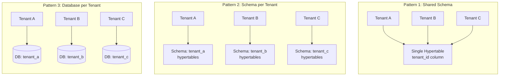
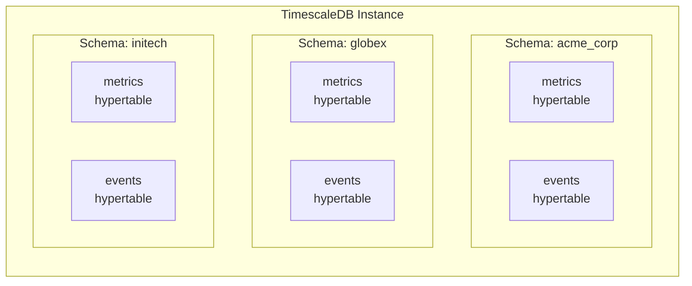
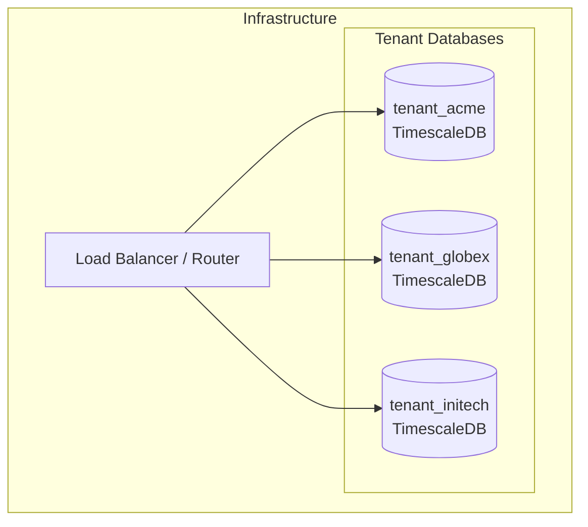
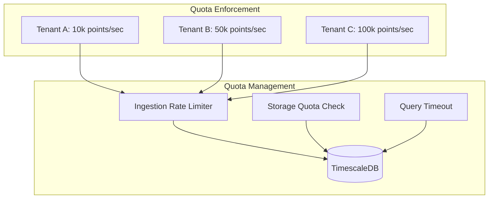

# How to Handle Multi-Tenancy in TimescaleDB

Author: [nawazdhandala](https://www.github.com/nawazdhandala)

Tags: TimescaleDB, Multi-Tenancy, PostgreSQL, Time-Series, Database Architecture, SaaS

Description: Learn how to implement multi-tenancy in TimescaleDB for SaaS applications. Covers shared schema, schema-per-tenant, and database-per-tenant patterns with practical examples, performance considerations, and data isolation strategies.

---

Multi-tenancy allows a single database instance to serve multiple customers while keeping their data logically or physically separated. TimescaleDB, built on PostgreSQL, offers powerful time-series capabilities that make it an excellent choice for multi-tenant applications collecting metrics, events, or IoT data. Choosing the right multi-tenancy strategy affects scalability, performance, data isolation, and operational complexity.

## Multi-Tenancy Patterns Overview

Three primary patterns exist for implementing multi-tenancy in TimescaleDB, each with distinct tradeoffs.



### Comparison Matrix

| Factor | Shared Schema | Schema per Tenant | Database per Tenant |
|--------|---------------|-------------------|---------------------|
| Data Isolation | Low | Medium | High |
| Resource Efficiency | High | Medium | Low |
| Operational Complexity | Low | Medium | High |
| Query Performance | Good with indexes | Good | Best |
| Tenant Onboarding | Instant | Minutes | Minutes to hours |
| Cross-tenant Queries | Easy | Possible | Difficult |
| Backup/Restore per Tenant | Difficult | Possible | Easy |
| Max Tenants | Thousands | Hundreds | Tens to hundreds |

## Pattern 1: Shared Schema with Tenant ID

The shared schema approach stores all tenant data in the same hypertables, using a tenant identifier column to separate data. Best suited for applications with many small to medium tenants that require efficient resource utilization.

### Creating the Schema

The following creates a metrics table with tenant isolation built into the primary key and chunk structure. Including tenant_id in the primary key ensures data locality within chunks.

```sql
-- Create the metrics hypertable with tenant isolation
CREATE TABLE metrics (
    time        TIMESTAMPTZ NOT NULL,
    tenant_id   UUID NOT NULL,
    metric_name VARCHAR(255) NOT NULL,
    value       DOUBLE PRECISION NOT NULL,
    tags        JSONB DEFAULT '{}',
    CONSTRAINT pk_metrics PRIMARY KEY (tenant_id, time, metric_name)
);

-- Convert to hypertable with time-based partitioning
-- Chunk interval of 1 day balances query performance and compression
SELECT create_hypertable(
    'metrics',
    'time',
    chunk_time_interval => INTERVAL '1 day'
);

-- Add space partitioning by tenant_id for better data locality
-- Number of partitions should match expected concurrent tenant queries
SELECT add_dimension(
    'metrics',
    'tenant_id',
    number_partitions => 16
);
```

### Indexing for Multi-Tenant Queries

Composite indexes with tenant_id as the leading column ensure queries always filter by tenant first. The ordering matters significantly for query performance.

```sql
-- Primary query pattern: metrics for a specific tenant and time range
CREATE INDEX idx_metrics_tenant_time ON metrics (tenant_id, time DESC);

-- Query by metric name within a tenant
CREATE INDEX idx_metrics_tenant_metric ON metrics (tenant_id, metric_name, time DESC);

-- For tag-based filtering within a tenant
CREATE INDEX idx_metrics_tenant_tags ON metrics
USING GIN (tenant_id, tags);
```

### Row-Level Security for Data Isolation

Row-level security (RLS) ensures tenants can only access their own data, even if application code has bugs. Enabling RLS provides a security safety net at the database level.

```sql
-- Enable row-level security
ALTER TABLE metrics ENABLE ROW LEVEL SECURITY;

-- Create policy that restricts access to current tenant
CREATE POLICY tenant_isolation ON metrics
    FOR ALL
    USING (tenant_id = current_setting('app.current_tenant')::UUID)
    WITH CHECK (tenant_id = current_setting('app.current_tenant')::UUID);

-- Create application role with RLS enforced
CREATE ROLE app_user;
GRANT SELECT, INSERT, UPDATE, DELETE ON metrics TO app_user;

-- Superuser bypasses RLS by default, create a non-superuser for the app
CREATE USER app_service WITH PASSWORD 'secure_password';
GRANT app_user TO app_service;
```

### Setting Tenant Context

Before executing queries, set the tenant context. The application layer handles this based on authentication.

```sql
-- Set tenant context at connection or transaction start
SET app.current_tenant = 'a1b2c3d4-e5f6-7890-abcd-ef1234567890';

-- Now all queries automatically filter by tenant
SELECT time, metric_name, value
FROM metrics
WHERE time > NOW() - INTERVAL '1 hour'
ORDER BY time DESC;

-- RLS automatically adds: AND tenant_id = 'a1b2c3d4-...'
```

### Connection Pooling with Tenant Context

When using connection poolers like PgBouncer, set tenant context at the transaction level to avoid context leakage between requests.

```sql
-- For transaction-level pooling, always set at transaction start
BEGIN;
SET LOCAL app.current_tenant = 'a1b2c3d4-e5f6-7890-abcd-ef1234567890';

-- Your queries here
SELECT * FROM metrics WHERE time > NOW() - INTERVAL '1 hour';

COMMIT;
-- Context is cleared when transaction ends
```

## Pattern 2: Schema per Tenant

Schema-per-tenant provides stronger isolation while sharing the same database. Each tenant gets dedicated hypertables within their schema. Ideal for medium-sized deployments with tenants requiring data isolation.



### Tenant Provisioning

The following function creates a complete schema with hypertables and proper permissions for a new tenant.

```sql
-- Function to provision a new tenant schema
CREATE OR REPLACE FUNCTION provision_tenant_schema(p_tenant_slug VARCHAR)
RETURNS VOID AS $$
DECLARE
    v_schema_name VARCHAR;
BEGIN
    -- Sanitize tenant slug for schema name
    v_schema_name := 'tenant_' || regexp_replace(p_tenant_slug, '[^a-z0-9_]', '_', 'gi');

    -- Create schema
    EXECUTE format('CREATE SCHEMA IF NOT EXISTS %I', v_schema_name);

    -- Create metrics hypertable in tenant schema
    EXECUTE format('
        CREATE TABLE %I.metrics (
            time        TIMESTAMPTZ NOT NULL,
            metric_name VARCHAR(255) NOT NULL,
            value       DOUBLE PRECISION NOT NULL,
            tags        JSONB DEFAULT ''{}''
        )', v_schema_name);

    -- Convert to hypertable
    PERFORM create_hypertable(
        format('%I.metrics', v_schema_name),
        'time',
        chunk_time_interval => INTERVAL '1 day',
        if_not_exists => TRUE
    );

    -- Create indexes
    EXECUTE format('
        CREATE INDEX idx_%s_metrics_time ON %I.metrics (time DESC);
        CREATE INDEX idx_%s_metrics_name_time ON %I.metrics (metric_name, time DESC);
    ', v_schema_name, v_schema_name, v_schema_name, v_schema_name);

    -- Create tenant-specific role
    EXECUTE format('
        CREATE ROLE %I;
        GRANT USAGE ON SCHEMA %I TO %I;
        GRANT SELECT, INSERT, UPDATE, DELETE ON ALL TABLES IN SCHEMA %I TO %I;
        ALTER DEFAULT PRIVILEGES IN SCHEMA %I
            GRANT SELECT, INSERT, UPDATE, DELETE ON TABLES TO %I;
    ', v_schema_name || '_role', v_schema_name, v_schema_name || '_role',
       v_schema_name, v_schema_name || '_role', v_schema_name, v_schema_name || '_role');

    RAISE NOTICE 'Provisioned tenant schema: %', v_schema_name;
END;
$$ LANGUAGE plpgsql;

-- Provision a new tenant
SELECT provision_tenant_schema('acme_corp');
```

### Schema Search Path for Routing

Route queries to the correct tenant schema by setting the search path. The application sets this based on the authenticated tenant.

```sql
-- Set search path for current session/transaction
SET search_path TO tenant_acme_corp, public;

-- Now queries automatically use tenant's schema
INSERT INTO metrics (time, metric_name, value, tags)
VALUES (NOW(), 'cpu_usage', 75.5, '{"host": "server-01"}');

SELECT * FROM metrics WHERE time > NOW() - INTERVAL '1 hour';
```

### Compression Configuration per Tenant

Different tenants may have different retention and compression requirements. Configure these at the schema level.

```sql
-- Enable compression on tenant's metrics hypertable
ALTER TABLE tenant_acme_corp.metrics SET (
    timescaledb.compress,
    timescaledb.compress_segmentby = 'metric_name',
    timescaledb.compress_orderby = 'time DESC'
);

-- Add compression policy - compress chunks older than 7 days
SELECT add_compression_policy(
    'tenant_acme_corp.metrics',
    INTERVAL '7 days'
);

-- Different policy for high-volume tenant - compress after 1 day
SELECT add_compression_policy(
    'tenant_highvolume.metrics',
    INTERVAL '1 day'
);
```

### Per-Tenant Retention Policies

Configure data retention policies based on tenant subscription tiers or requirements.

```sql
-- Standard tier: 30-day retention
SELECT add_retention_policy(
    'tenant_standard.metrics',
    INTERVAL '30 days'
);

-- Premium tier: 90-day retention
SELECT add_retention_policy(
    'tenant_premium.metrics',
    INTERVAL '90 days'
);

-- Enterprise tier: 365-day retention
SELECT add_retention_policy(
    'tenant_enterprise.metrics',
    INTERVAL '365 days'
);
```

## Pattern 3: Database per Tenant

Database-per-tenant offers maximum isolation, making it suitable for enterprise customers with strict compliance requirements or extremely high data volumes.



### Tenant Database Provisioning

Automate database creation with a provisioning script. Use a template database for consistent configuration.

```sql
-- Create template database with TimescaleDB configured
CREATE DATABASE tenant_template;
\c tenant_template

-- Enable TimescaleDB extension
CREATE EXTENSION IF NOT EXISTS timescaledb;

-- Create standard schema structure
CREATE TABLE metrics (
    time        TIMESTAMPTZ NOT NULL,
    metric_name VARCHAR(255) NOT NULL,
    value       DOUBLE PRECISION NOT NULL,
    tags        JSONB DEFAULT '{}'
);

SELECT create_hypertable('metrics', 'time', chunk_time_interval => INTERVAL '1 day');

-- Create standard indexes
CREATE INDEX idx_metrics_time ON metrics (time DESC);
CREATE INDEX idx_metrics_name_time ON metrics (metric_name, time DESC);
CREATE INDEX idx_metrics_tags ON metrics USING GIN (tags);

-- Enable compression
ALTER TABLE metrics SET (
    timescaledb.compress,
    timescaledb.compress_segmentby = 'metric_name',
    timescaledb.compress_orderby = 'time DESC'
);

-- Prevent modifications to template
\c postgres
UPDATE pg_database SET datistemplate = TRUE WHERE datname = 'tenant_template';
```

### Provisioning New Tenant Databases

Create new tenant databases from the template for consistent configuration.

```sql
-- Create new tenant database from template
CREATE DATABASE tenant_newcustomer TEMPLATE tenant_template;

-- Create tenant-specific user
CREATE USER newcustomer_app WITH PASSWORD 'secure_generated_password';
GRANT CONNECT ON DATABASE tenant_newcustomer TO newcustomer_app;

-- Connect to new database and grant permissions
\c tenant_newcustomer
GRANT ALL PRIVILEGES ON ALL TABLES IN SCHEMA public TO newcustomer_app;
GRANT ALL PRIVILEGES ON ALL SEQUENCES IN SCHEMA public TO newcustomer_app;
ALTER DEFAULT PRIVILEGES IN SCHEMA public
    GRANT ALL PRIVILEGES ON TABLES TO newcustomer_app;
```

### Connection Router Implementation

Implement a connection router at the application level to direct requests to the correct database.

```python
# Python example: Tenant-aware connection pool
import psycopg2
from psycopg2 import pool
from functools import lru_cache

class TenantConnectionManager:
    """Manages connection pools for multi-tenant TimescaleDB deployments."""

    def __init__(self, host: str, port: int = 5432):
        self.host = host
        self.port = port
        self._pools: dict[str, pool.ThreadedConnectionPool] = {}

    def get_connection(self, tenant_id: str):
        """
        Get a connection from the tenant-specific pool.
        Creates the pool if it does not exist.
        """
        if tenant_id not in self._pools:
            self._pools[tenant_id] = pool.ThreadedConnectionPool(
                minconn=2,
                maxconn=10,
                host=self.host,
                port=self.port,
                database=f"tenant_{tenant_id}",
                user=f"{tenant_id}_app",
                password=self._get_tenant_password(tenant_id)
            )

        return self._pools[tenant_id].getconn()

    def return_connection(self, tenant_id: str, conn):
        """Return a connection to the tenant's pool."""
        if tenant_id in self._pools:
            self._pools[tenant_id].putconn(conn)

    def _get_tenant_password(self, tenant_id: str) -> str:
        """Retrieve tenant password from secrets manager."""
        # Implement your secrets retrieval logic here
        # Example: AWS Secrets Manager, HashiCorp Vault, etc.
        pass

    def close_tenant_pool(self, tenant_id: str):
        """Close all connections for a specific tenant."""
        if tenant_id in self._pools:
            self._pools[tenant_id].closeall()
            del self._pools[tenant_id]


# Usage in request handler
manager = TenantConnectionManager(host="timescale.internal")

def handle_metrics_query(tenant_id: str, time_range: str):
    """Query metrics for a specific tenant."""
    conn = manager.get_connection(tenant_id)
    try:
        with conn.cursor() as cur:
            cur.execute("""
                SELECT time, metric_name, value
                FROM metrics
                WHERE time > NOW() - %s::INTERVAL
                ORDER BY time DESC
                LIMIT 1000
            """, (time_range,))
            return cur.fetchall()
    finally:
        manager.return_connection(tenant_id, conn)
```

## Continuous Aggregates for Multi-Tenant Analytics

Continuous aggregates pre-compute rollups, providing fast analytics queries. Configuration varies by multi-tenancy pattern.

### Shared Schema Continuous Aggregates

For shared schema deployments, include tenant_id in the continuous aggregate definition.

```sql
-- Create continuous aggregate for hourly metrics by tenant
CREATE MATERIALIZED VIEW metrics_hourly
WITH (timescaledb.continuous) AS
SELECT
    tenant_id,
    time_bucket('1 hour', time) AS bucket,
    metric_name,
    COUNT(*) AS sample_count,
    AVG(value) AS avg_value,
    MIN(value) AS min_value,
    MAX(value) AS max_value,
    PERCENTILE_CONT(0.95) WITHIN GROUP (ORDER BY value) AS p95_value
FROM metrics
GROUP BY tenant_id, bucket, metric_name
WITH NO DATA;

-- Add refresh policy to update aggregates automatically
SELECT add_continuous_aggregate_policy(
    'metrics_hourly',
    start_offset => INTERVAL '3 hours',
    end_offset => INTERVAL '1 hour',
    schedule_interval => INTERVAL '1 hour'
);

-- Create index for tenant queries on the aggregate
CREATE INDEX idx_metrics_hourly_tenant
ON metrics_hourly (tenant_id, bucket DESC);
```

### Querying Continuous Aggregates

Query the continuous aggregate for fast dashboard rendering.

```sql
-- Fast dashboard query using continuous aggregate
SELECT
    bucket,
    metric_name,
    avg_value,
    p95_value
FROM metrics_hourly
WHERE tenant_id = 'a1b2c3d4-e5f6-7890-abcd-ef1234567890'
AND bucket > NOW() - INTERVAL '24 hours'
AND metric_name IN ('cpu_usage', 'memory_usage', 'disk_io')
ORDER BY bucket DESC;
```

## Resource Quotas and Fair Usage

Implement resource quotas to prevent noisy neighbors from affecting other tenants.



### Tenant Quota Tracking

Create a system to track and enforce tenant quotas.

```sql
-- Quota configuration and tracking table
CREATE TABLE tenant_quotas (
    tenant_id UUID PRIMARY KEY,
    max_points_per_second INT DEFAULT 10000,
    max_storage_gb INT DEFAULT 100,
    max_query_timeout_seconds INT DEFAULT 30,
    current_storage_bytes BIGINT DEFAULT 0,
    points_today BIGINT DEFAULT 0,
    last_quota_reset TIMESTAMPTZ DEFAULT NOW()
);

-- Function to check and update ingestion quota
CREATE OR REPLACE FUNCTION check_ingestion_quota(
    p_tenant_id UUID,
    p_point_count INT
) RETURNS BOOLEAN AS $$
DECLARE
    v_quota RECORD;
    v_allowed BOOLEAN;
BEGIN
    SELECT * INTO v_quota FROM tenant_quotas WHERE tenant_id = p_tenant_id;

    IF NOT FOUND THEN
        -- Create default quota for new tenant
        INSERT INTO tenant_quotas (tenant_id) VALUES (p_tenant_id);
        RETURN TRUE;
    END IF;

    -- Reset daily counter if needed
    IF v_quota.last_quota_reset < CURRENT_DATE THEN
        UPDATE tenant_quotas
        SET points_today = 0, last_quota_reset = NOW()
        WHERE tenant_id = p_tenant_id;
        v_quota.points_today := 0;
    END IF;

    -- Check if within rate limit (simplified daily check)
    v_allowed := (v_quota.points_today + p_point_count) <
                 (v_quota.max_points_per_second * 86400);

    IF v_allowed THEN
        UPDATE tenant_quotas
        SET points_today = points_today + p_point_count
        WHERE tenant_id = p_tenant_id;
    END IF;

    RETURN v_allowed;
END;
$$ LANGUAGE plpgsql;
```

### Storage Quota Monitoring

Track storage usage per tenant for shared schema deployments.

```sql
-- Function to calculate tenant storage usage
CREATE OR REPLACE FUNCTION get_tenant_storage_bytes(p_tenant_id UUID)
RETURNS BIGINT AS $$
DECLARE
    v_total_bytes BIGINT := 0;
    v_chunk RECORD;
BEGIN
    -- Calculate storage across all chunks
    FOR v_chunk IN
        SELECT c.chunk_name, c.chunk_schema
        FROM timescaledb_information.chunks c
        WHERE c.hypertable_name = 'metrics'
    LOOP
        EXECUTE format(
            'SELECT COALESCE(SUM(pg_column_size(t.*)), 0)
             FROM %I.%I t WHERE tenant_id = $1',
            v_chunk.chunk_schema, v_chunk.chunk_name
        ) INTO v_total_bytes USING p_tenant_id;
    END LOOP;

    RETURN v_total_bytes;
END;
$$ LANGUAGE plpgsql;

-- Update storage tracking periodically
CREATE OR REPLACE PROCEDURE update_all_tenant_storage()
LANGUAGE plpgsql AS $$
DECLARE
    v_tenant RECORD;
BEGIN
    FOR v_tenant IN SELECT DISTINCT tenant_id FROM tenant_quotas LOOP
        UPDATE tenant_quotas
        SET current_storage_bytes = get_tenant_storage_bytes(v_tenant.tenant_id)
        WHERE tenant_id = v_tenant.tenant_id;

        COMMIT;  -- Commit after each tenant to avoid long transactions
    END LOOP;
END;
$$;
```

### Query Timeout Enforcement

Set per-tenant query timeouts to prevent resource hogging.

```sql
-- Function to set tenant-specific query timeout
CREATE OR REPLACE FUNCTION set_tenant_query_timeout(p_tenant_id UUID)
RETURNS VOID AS $$
DECLARE
    v_timeout INT;
BEGIN
    SELECT max_query_timeout_seconds INTO v_timeout
    FROM tenant_quotas
    WHERE tenant_id = p_tenant_id;

    IF v_timeout IS NOT NULL THEN
        EXECUTE format('SET LOCAL statement_timeout = ''%ss''', v_timeout);
    ELSE
        SET LOCAL statement_timeout = '30s';  -- Default timeout
    END IF;
END;
$$ LANGUAGE plpgsql;

-- Use in application before running tenant queries
BEGIN;
SELECT set_tenant_query_timeout('a1b2c3d4-e5f6-7890-abcd-ef1234567890');
-- Tenant's queries here, will timeout according to their quota
COMMIT;
```

## Tenant Onboarding and Offboarding

### Automated Tenant Provisioning

Create a complete provisioning workflow for new tenants.

```sql
-- Complete tenant provisioning for shared schema pattern
CREATE OR REPLACE FUNCTION provision_tenant(
    p_tenant_id UUID,
    p_tenant_name VARCHAR,
    p_tier VARCHAR DEFAULT 'standard'
) RETURNS VOID AS $$
DECLARE
    v_max_points INT;
    v_max_storage INT;
    v_retention INTERVAL;
BEGIN
    -- Set tier-based limits
    CASE p_tier
        WHEN 'enterprise' THEN
            v_max_points := 1000000;
            v_max_storage := 1000;
            v_retention := INTERVAL '365 days';
        WHEN 'premium' THEN
            v_max_points := 100000;
            v_max_storage := 500;
            v_retention := INTERVAL '90 days';
        ELSE  -- standard
            v_max_points := 10000;
            v_max_storage := 100;
            v_retention := INTERVAL '30 days';
    END CASE;

    -- Create tenant metadata
    INSERT INTO tenants (id, name, tier, created_at)
    VALUES (p_tenant_id, p_tenant_name, p_tier, NOW())
    ON CONFLICT (id) DO UPDATE SET
        name = EXCLUDED.name,
        tier = EXCLUDED.tier;

    -- Create quota record
    INSERT INTO tenant_quotas (
        tenant_id,
        max_points_per_second,
        max_storage_gb,
        max_query_timeout_seconds
    ) VALUES (
        p_tenant_id,
        v_max_points,
        v_max_storage,
        CASE WHEN p_tier = 'enterprise' THEN 120 ELSE 30 END
    )
    ON CONFLICT (tenant_id) DO UPDATE SET
        max_points_per_second = EXCLUDED.max_points_per_second,
        max_storage_gb = EXCLUDED.max_storage_gb;

    RAISE NOTICE 'Provisioned tenant % with % tier', p_tenant_name, p_tier;
END;
$$ LANGUAGE plpgsql;
```

### Tenant Data Export

Export tenant data before offboarding or for compliance requests.

```sql
-- Export tenant data to CSV format
CREATE OR REPLACE FUNCTION export_tenant_data(
    p_tenant_id UUID,
    p_export_path VARCHAR
) RETURNS BIGINT AS $$
DECLARE
    v_row_count BIGINT;
BEGIN
    -- Export to CSV using COPY
    EXECUTE format(
        'COPY (
            SELECT time, metric_name, value, tags
            FROM metrics
            WHERE tenant_id = %L
            ORDER BY time
        ) TO %L WITH CSV HEADER',
        p_tenant_id, p_export_path
    );

    GET DIAGNOSTICS v_row_count = ROW_COUNT;
    RETURN v_row_count;
END;
$$ LANGUAGE plpgsql;
```

### Tenant Offboarding

Safely remove tenant data while maintaining referential integrity.

```sql
-- Soft delete tenant data with archival option
CREATE OR REPLACE FUNCTION offboard_tenant(
    p_tenant_id UUID,
    p_archive BOOLEAN DEFAULT TRUE
) RETURNS VOID AS $$
BEGIN
    -- Archive if requested (run export first)
    IF p_archive THEN
        PERFORM export_tenant_data(
            p_tenant_id,
            format('/tmp/tenant_%s_archive.csv', p_tenant_id)
        );
    END IF;

    -- Delete in batches to avoid long locks
    LOOP
        DELETE FROM metrics
        WHERE tenant_id = p_tenant_id
        AND ctid IN (
            SELECT ctid FROM metrics
            WHERE tenant_id = p_tenant_id
            LIMIT 10000
        );

        EXIT WHEN NOT FOUND;

        COMMIT;
        PERFORM pg_sleep(0.1);  -- Brief pause between batches
    END LOOP;

    -- Remove quota record
    DELETE FROM tenant_quotas WHERE tenant_id = p_tenant_id;

    -- Mark tenant as deleted
    UPDATE tenants
    SET deleted_at = NOW(), status = 'deleted'
    WHERE id = p_tenant_id;

    RAISE NOTICE 'Offboarded tenant %', p_tenant_id;
END;
$$ LANGUAGE plpgsql;
```

## Performance Optimization

### Chunk Sizing for Multi-Tenant Workloads

Optimal chunk sizing depends on your tenant distribution and query patterns.

```sql
-- Analyze chunk sizes and tenant distribution
SELECT
    h.hypertable_name,
    c.chunk_name,
    pg_size_pretty(c.total_bytes) as chunk_size,
    c.range_start,
    c.range_end
FROM timescaledb_information.hypertables h
JOIN LATERAL (
    SELECT
        chunk_name,
        range_start,
        range_end,
        pg_total_relation_size(format('%I.%I', chunk_schema, chunk_name)) as total_bytes
    FROM timescaledb_information.chunks
    WHERE hypertable_name = h.hypertable_name
) c ON TRUE
ORDER BY c.range_start DESC
LIMIT 20;

-- Adjust chunk interval based on data volume
-- For high-volume multi-tenant: smaller chunks (1-4 hours)
SELECT set_chunk_time_interval('metrics', INTERVAL '4 hours');

-- For lower-volume: larger chunks (1-7 days)
SELECT set_chunk_time_interval('metrics', INTERVAL '7 days');
```

### Query Optimization with EXPLAIN

Use EXPLAIN ANALYZE to verify queries are using tenant indexes effectively.

```sql
-- Verify query plan uses tenant_id index
EXPLAIN (ANALYZE, BUFFERS, FORMAT TEXT)
SELECT time, metric_name, value
FROM metrics
WHERE tenant_id = 'a1b2c3d4-e5f6-7890-abcd-ef1234567890'
AND time > NOW() - INTERVAL '1 hour'
AND metric_name = 'cpu_usage'
ORDER BY time DESC
LIMIT 100;

-- Look for:
-- - Index Scan using idx_metrics_tenant_time
-- - Chunk exclusion (only relevant chunks scanned)
-- - No Seq Scan on large tables
```

## Monitoring Multi-Tenant Health

Track key metrics for each tenant to identify issues early.

```sql
-- Create monitoring view for tenant health
CREATE VIEW tenant_health_metrics AS
SELECT
    t.id AS tenant_id,
    t.name AS tenant_name,
    t.tier,
    q.current_storage_bytes,
    q.max_storage_gb * 1024 * 1024 * 1024 AS max_storage_bytes,
    ROUND(100.0 * q.current_storage_bytes /
          NULLIF(q.max_storage_gb * 1024 * 1024 * 1024, 0), 2) AS storage_usage_pct,
    q.points_today,
    q.max_points_per_second * 86400 AS max_points_daily,
    ROUND(100.0 * q.points_today /
          NULLIF(q.max_points_per_second * 86400, 0), 2) AS ingestion_usage_pct
FROM tenants t
JOIN tenant_quotas q ON t.id = q.tenant_id
WHERE t.deleted_at IS NULL;

-- Alert on tenants approaching limits
SELECT
    tenant_id,
    tenant_name,
    storage_usage_pct,
    ingestion_usage_pct
FROM tenant_health_metrics
WHERE storage_usage_pct > 80
   OR ingestion_usage_pct > 80
ORDER BY GREATEST(storage_usage_pct, ingestion_usage_pct) DESC;
```

## Summary

Choosing the right multi-tenancy pattern for TimescaleDB depends on your specific requirements:

1. **Shared Schema** - Best for SaaS applications with many small tenants. Provides efficient resource utilization with row-level security for isolation. Use this when you have hundreds to thousands of tenants with similar data volumes.

2. **Schema per Tenant** - Balances isolation and efficiency. Good for applications where tenants need independent retention policies or compression settings. Suitable for tens to hundreds of tenants.

3. **Database per Tenant** - Maximum isolation for enterprise customers with compliance requirements. Use for high-value tenants requiring complete data separation. Best for tens of tenants or fewer.

Key implementation considerations:
- Always include tenant_id in indexes as the leading column
- Enable row-level security as a safety net for data isolation
- Configure per-tenant compression and retention policies
- Implement quota management to prevent noisy neighbors
- Monitor tenant health metrics proactively
- Automate provisioning and offboarding workflows

The right architecture evolves with your application. Starting with shared schema and migrating high-value tenants to dedicated databases is a common growth pattern that balances operational simplicity with customer requirements.

---

**Need to monitor your multi-tenant TimescaleDB deployment?** [OneUptime](https://oneuptime.com) provides comprehensive database monitoring with per-tenant metrics, query performance tracking, and storage usage alerts. Set up dashboards for each tenant tier and get notified when quotas approach limits. Start monitoring your time-series infrastructure today with OneUptime's free tier.
