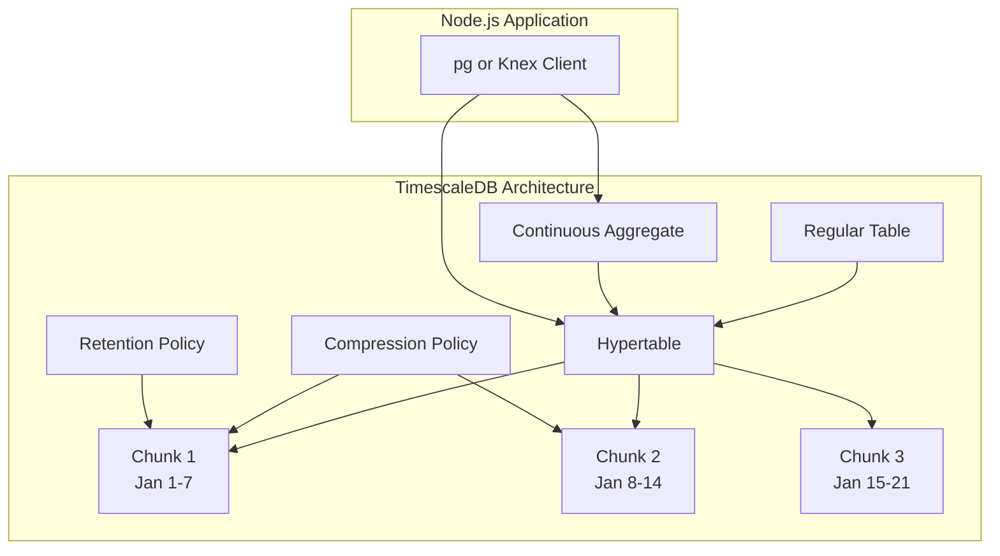
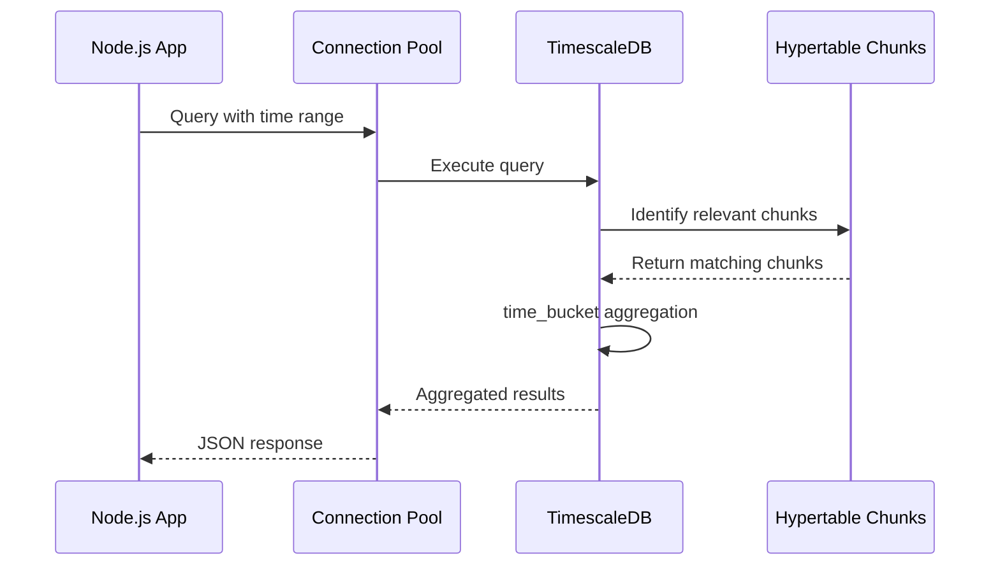
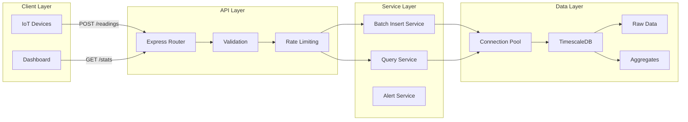

# How to Use TimescaleDB with Node.js

Author: [nawazdhandala](https://github.com/nawazdhandala)

Tags: TimescaleDB, Node.js, PostgreSQL, Time-Series, Database, Backend

Description: Learn how to use TimescaleDB with Node.js to build scalable time-series applications. Covers setup, hypertables, continuous aggregates, data retention policies, and best practices for IoT and monitoring use cases.

---

TimescaleDB extends PostgreSQL with powerful time-series capabilities, making it an excellent choice for IoT applications, monitoring systems, and analytics platforms. Node.js developers can leverage familiar PostgreSQL libraries while gaining automatic partitioning, compression, and specialized time-series functions.

## Understanding TimescaleDB Architecture

Before diving into code, understanding how TimescaleDB organizes data helps you make better design decisions.



## Setting Up TimescaleDB with Node.js

### Prerequisites

You need a running TimescaleDB instance. Docker provides the quickest setup for local development.

```bash
# Pull and run TimescaleDB container
docker run -d --name timescaledb \
  -p 5432:5432 \
  -e POSTGRES_PASSWORD=password \
  -e POSTGRES_DB=sensor_data \
  timescale/timescaledb:latest-pg15

# Verify connection
psql -h localhost -U postgres -d sensor_data
```

### Installing Dependencies

The pg library handles PostgreSQL connections. Knex adds query building capabilities that simplify complex time-series queries.

```bash
npm init -y
npm install pg knex dotenv
npm install --save-dev typescript @types/node @types/pg
```

### Database Connection Configuration

Connection pooling is essential for handling concurrent time-series writes efficiently.

```javascript
// src/db/connection.js
const { Pool } = require('pg');

// Connection pool configuration optimized for time-series workloads
const pool = new Pool({
  host: process.env.TIMESCALE_HOST || 'localhost',
  port: parseInt(process.env.TIMESCALE_PORT || '5432'),
  database: process.env.TIMESCALE_DB || 'sensor_data',
  user: process.env.TIMESCALE_USER || 'postgres',
  password: process.env.TIMESCALE_PASSWORD || 'password',

  // Pool sizing - adjust based on your workload
  max: 20,                    // Maximum connections in pool
  min: 5,                     // Minimum connections to maintain
  idleTimeoutMillis: 30000,   // Close idle connections after 30 seconds
  connectionTimeoutMillis: 5000, // Timeout for new connections
});

// Monitor pool events for debugging
pool.on('connect', () => {
  console.log('New client connected to TimescaleDB');
});

pool.on('error', (err) => {
  console.error('Unexpected pool error:', err);
});

// Helper function for single queries
async function query(text, params) {
  const start = Date.now();
  const result = await pool.query(text, params);
  const duration = Date.now() - start;

  // Log slow queries for optimization
  if (duration > 100) {
    console.log('Slow query:', { text, duration, rows: result.rowCount });
  }

  return result;
}

// Helper for transactions
async function withTransaction(callback) {
  const client = await pool.connect();
  try {
    await client.query('BEGIN');
    const result = await callback(client);
    await client.query('COMMIT');
    return result;
  } catch (error) {
    await client.query('ROLLBACK');
    throw error;
  } finally {
    client.release();
  }
}

module.exports = { pool, query, withTransaction };
```

## Creating Hypertables

Hypertables are TimescaleDB's core feature, automatically partitioning data by time into chunks for optimal performance.

### Schema Design for Time-Series Data

Time-series tables should have a timestamp column as the primary dimension. Additional columns for device or source identification enable efficient filtering.

```javascript
// src/db/schema.js
const { query, withTransaction } = require('./connection');

async function createSchema() {
  await withTransaction(async (client) => {
    // Enable TimescaleDB extension
    await client.query(`
      CREATE EXTENSION IF NOT EXISTS timescaledb CASCADE;
    `);

    // Create the base table for sensor readings
    // Note: We use TIMESTAMPTZ for proper timezone handling
    await client.query(`
      CREATE TABLE IF NOT EXISTS sensor_readings (
        time        TIMESTAMPTZ NOT NULL,
        sensor_id   TEXT NOT NULL,
        location    TEXT,
        temperature DOUBLE PRECISION,
        humidity    DOUBLE PRECISION,
        pressure    DOUBLE PRECISION,
        battery     DOUBLE PRECISION,
        metadata    JSONB DEFAULT '{}'::jsonb
      );
    `);

    // Convert to hypertable with 1-day chunks
    // chunk_time_interval determines partition size
    await client.query(`
      SELECT create_hypertable(
        'sensor_readings',
        'time',
        chunk_time_interval => INTERVAL '1 day',
        if_not_exists => TRUE
      );
    `);

    // Create indexes for common query patterns
    // Compound index on sensor_id and time speeds up device-specific queries
    await client.query(`
      CREATE INDEX IF NOT EXISTS idx_sensor_readings_sensor_time
      ON sensor_readings (sensor_id, time DESC);
    `);

    // Index for location-based queries
    await client.query(`
      CREATE INDEX IF NOT EXISTS idx_sensor_readings_location
      ON sensor_readings (location, time DESC);
    `);

    console.log('Schema created successfully');
  });
}

// Create table for device metadata
async function createDeviceTable() {
  await query(`
    CREATE TABLE IF NOT EXISTS devices (
      sensor_id   TEXT PRIMARY KEY,
      name        TEXT NOT NULL,
      location    TEXT,
      device_type TEXT,
      installed   TIMESTAMPTZ DEFAULT NOW(),
      active      BOOLEAN DEFAULT TRUE,
      config      JSONB DEFAULT '{}'::jsonb
    );
  `);
}

module.exports = { createSchema, createDeviceTable };
```

## Inserting Time-Series Data

Efficient data insertion is critical for time-series applications. Batch inserts dramatically improve throughput compared to individual inserts.

### Single Record Insertion

Use single inserts for low-volume, real-time data streams.

```javascript
// src/services/sensorService.js
const { query } = require('../db/connection');

async function insertReading(reading) {
  const { sensorId, temperature, humidity, pressure, battery, location, metadata } = reading;

  // Use parameterized queries to prevent SQL injection
  const result = await query(
    `INSERT INTO sensor_readings
     (time, sensor_id, location, temperature, humidity, pressure, battery, metadata)
     VALUES (NOW(), $1, $2, $3, $4, $5, $6, $7)
     RETURNING *`,
    [sensorId, location, temperature, humidity, pressure, battery, metadata || {}]
  );

  return result.rows[0];
}
```

### Batch Insertion for High-Volume Data

Batch inserts reduce network round trips and transaction overhead. A buffer collects readings before flushing to the database.

```javascript
// src/services/batchInsertService.js
const { query, withTransaction } = require('../db/connection');

class BatchInsertService {
  constructor(options = {}) {
    this.batchSize = options.batchSize || 1000;
    this.flushInterval = options.flushInterval || 5000; // 5 seconds
    this.buffer = [];
    this.timer = null;
  }

  // Add reading to buffer, flush when batch size reached
  async addReading(reading) {
    this.buffer.push({
      time: reading.time || new Date(),
      sensorId: reading.sensorId,
      location: reading.location,
      temperature: reading.temperature,
      humidity: reading.humidity,
      pressure: reading.pressure,
      battery: reading.battery,
      metadata: reading.metadata || {}
    });

    if (this.buffer.length >= this.batchSize) {
      await this.flush();
    } else if (!this.timer) {
      // Start timer for time-based flushing
      this.timer = setTimeout(() => this.flush(), this.flushInterval);
    }
  }

  // Flush buffer to database using multi-row INSERT
  async flush() {
    if (this.buffer.length === 0) return;

    const readings = [...this.buffer];
    this.buffer = [];

    if (this.timer) {
      clearTimeout(this.timer);
      this.timer = null;
    }

    // Build multi-row INSERT statement
    // Generates: INSERT INTO ... VALUES ($1,$2...), ($9,$10...), ...
    const values = [];
    const params = [];

    readings.forEach((reading, i) => {
      const offset = i * 8;
      values.push(`($${offset + 1}, $${offset + 2}, $${offset + 3}, $${offset + 4}, $${offset + 5}, $${offset + 6}, $${offset + 7}, $${offset + 8})`);
      params.push(
        reading.time,
        reading.sensorId,
        reading.location,
        reading.temperature,
        reading.humidity,
        reading.pressure,
        reading.battery,
        JSON.stringify(reading.metadata)
      );
    });

    const sql = `
      INSERT INTO sensor_readings
      (time, sensor_id, location, temperature, humidity, pressure, battery, metadata)
      VALUES ${values.join(', ')}
    `;

    try {
      await query(sql, params);
      console.log(`Flushed ${readings.length} readings to database`);
    } catch (error) {
      console.error('Batch insert failed:', error);
      // Re-add failed readings to buffer for retry
      this.buffer = [...readings, ...this.buffer];
      throw error;
    }
  }

  // Graceful shutdown - flush remaining data
  async shutdown() {
    if (this.timer) {
      clearTimeout(this.timer);
    }
    await this.flush();
  }
}

module.exports = { BatchInsertService };
```

## Querying Time-Series Data

TimescaleDB provides specialized functions that simplify common time-series queries.

### Data Flow for Time-Series Queries



### Time Bucket Aggregations

The time_bucket function groups data into fixed intervals, essential for creating charts and dashboards.

```javascript
// src/services/queryService.js
const { query } = require('../db/connection');

// Get average readings per hour for a sensor
async function getHourlyAverages(sensorId, startTime, endTime) {
  const result = await query(
    `SELECT
       time_bucket('1 hour', time) AS bucket,
       sensor_id,
       AVG(temperature) AS avg_temperature,
       AVG(humidity) AS avg_humidity,
       AVG(pressure) AS avg_pressure,
       MIN(temperature) AS min_temperature,
       MAX(temperature) AS max_temperature,
       COUNT(*) AS reading_count
     FROM sensor_readings
     WHERE sensor_id = $1
       AND time >= $2
       AND time < $3
     GROUP BY bucket, sensor_id
     ORDER BY bucket DESC`,
    [sensorId, startTime, endTime]
  );

  return result.rows;
}

// Get readings with flexible bucket size
async function getAggregatedReadings(options) {
  const {
    sensorId,
    startTime,
    endTime,
    bucketSize = '1 hour',
    location
  } = options;

  // Build dynamic WHERE clause
  const conditions = ['time >= $1', 'time < $2'];
  const params = [startTime, endTime];
  let paramIndex = 3;

  if (sensorId) {
    conditions.push(`sensor_id = $${paramIndex}`);
    params.push(sensorId);
    paramIndex++;
  }

  if (location) {
    conditions.push(`location = $${paramIndex}`);
    params.push(location);
    paramIndex++;
  }

  const result = await query(
    `SELECT
       time_bucket($${paramIndex}, time) AS bucket,
       sensor_id,
       location,
       AVG(temperature) AS avg_temperature,
       AVG(humidity) AS avg_humidity,
       PERCENTILE_CONT(0.5) WITHIN GROUP (ORDER BY temperature) AS median_temperature,
       STDDEV(temperature) AS stddev_temperature,
       COUNT(*) AS sample_count
     FROM sensor_readings
     WHERE ${conditions.join(' AND ')}
     GROUP BY bucket, sensor_id, location
     ORDER BY bucket DESC`,
    [...params, bucketSize]
  );

  return result.rows;
}
```

### Recent Data Queries

Fetching the most recent readings for each sensor is a common dashboard requirement.

```javascript
// Get latest reading for each sensor using DISTINCT ON
async function getLatestReadings() {
  const result = await query(`
    SELECT DISTINCT ON (sensor_id)
      time,
      sensor_id,
      location,
      temperature,
      humidity,
      pressure,
      battery
    FROM sensor_readings
    ORDER BY sensor_id, time DESC
  `);

  return result.rows;
}

// Get readings from last N minutes
async function getRecentReadings(sensorId, minutes = 60) {
  const result = await query(
    `SELECT *
     FROM sensor_readings
     WHERE sensor_id = $1
       AND time > NOW() - INTERVAL '${minutes} minutes'
     ORDER BY time DESC`,
    [sensorId]
  );

  return result.rows;
}

// Time-weighted average for irregular data
async function getTimeWeightedAverage(sensorId, startTime, endTime) {
  const result = await query(
    `SELECT
       sensor_id,
       time_weight('Linear', time, temperature) AS tw_temperature,
       average(time_weight('Linear', time, temperature)) AS avg_temperature
     FROM sensor_readings
     WHERE sensor_id = $1
       AND time >= $2
       AND time < $3
     GROUP BY sensor_id`,
    [sensorId, startTime, endTime]
  );

  return result.rows[0];
}
```

## Continuous Aggregates

Continuous aggregates pre-compute and materialize aggregated data, dramatically speeding up dashboard queries.

### Creating Continuous Aggregates

```javascript
// src/db/continuousAggregates.js
const { query } = require('./connection');

async function createHourlyAggregate() {
  // Create materialized view that auto-updates
  await query(`
    CREATE MATERIALIZED VIEW IF NOT EXISTS sensor_hourly
    WITH (timescaledb.continuous) AS
    SELECT
      time_bucket('1 hour', time) AS bucket,
      sensor_id,
      location,
      AVG(temperature) AS avg_temperature,
      MIN(temperature) AS min_temperature,
      MAX(temperature) AS max_temperature,
      AVG(humidity) AS avg_humidity,
      AVG(pressure) AS avg_pressure,
      COUNT(*) AS sample_count
    FROM sensor_readings
    GROUP BY bucket, sensor_id, location
    WITH NO DATA;
  `);

  // Add refresh policy - refresh hourly, covering last 3 hours
  await query(`
    SELECT add_continuous_aggregate_policy('sensor_hourly',
      start_offset => INTERVAL '3 hours',
      end_offset => INTERVAL '1 hour',
      schedule_interval => INTERVAL '1 hour',
      if_not_exists => TRUE
    );
  `);

  console.log('Hourly continuous aggregate created');
}

async function createDailyAggregate() {
  await query(`
    CREATE MATERIALIZED VIEW IF NOT EXISTS sensor_daily
    WITH (timescaledb.continuous) AS
    SELECT
      time_bucket('1 day', time) AS bucket,
      sensor_id,
      location,
      AVG(temperature) AS avg_temperature,
      MIN(temperature) AS min_temperature,
      MAX(temperature) AS max_temperature,
      AVG(humidity) AS avg_humidity,
      PERCENTILE_CONT(0.5) WITHIN GROUP (ORDER BY temperature) AS median_temperature,
      COUNT(*) AS sample_count
    FROM sensor_readings
    GROUP BY bucket, sensor_id, location
    WITH NO DATA;
  `);

  await query(`
    SELECT add_continuous_aggregate_policy('sensor_daily',
      start_offset => INTERVAL '3 days',
      end_offset => INTERVAL '1 day',
      schedule_interval => INTERVAL '1 day',
      if_not_exists => TRUE
    );
  `);

  console.log('Daily continuous aggregate created');
}

module.exports = { createHourlyAggregate, createDailyAggregate };
```

### Querying Continuous Aggregates

Queries against continuous aggregates use the same syntax as regular tables but execute much faster.

```javascript
// Query pre-aggregated hourly data
async function getHourlyStats(sensorId, days = 7) {
  const result = await query(
    `SELECT
       bucket,
       avg_temperature,
       min_temperature,
       max_temperature,
       avg_humidity,
       sample_count
     FROM sensor_hourly
     WHERE sensor_id = $1
       AND bucket > NOW() - INTERVAL '${days} days'
     ORDER BY bucket DESC`,
    [sensorId]
  );

  return result.rows;
}

// Dashboard query - combines real-time and aggregated data
async function getDashboardData(sensorId) {
  // Recent detailed data (last 4 hours from raw table)
  const recentPromise = query(
    `SELECT
       time_bucket('5 minutes', time) AS bucket,
       AVG(temperature) AS avg_temperature,
       AVG(humidity) AS avg_humidity
     FROM sensor_readings
     WHERE sensor_id = $1
       AND time > NOW() - INTERVAL '4 hours'
     GROUP BY bucket
     ORDER BY bucket DESC`,
    [sensorId]
  );

  // Historical data (from continuous aggregate)
  const historicalPromise = query(
    `SELECT
       bucket,
       avg_temperature,
       avg_humidity
     FROM sensor_hourly
     WHERE sensor_id = $1
       AND bucket > NOW() - INTERVAL '7 days'
       AND bucket <= NOW() - INTERVAL '4 hours'
     ORDER BY bucket DESC`,
    [sensorId]
  );

  const [recent, historical] = await Promise.all([recentPromise, historicalPromise]);

  return {
    recent: recent.rows,
    historical: historical.rows
  };
}
```

## Data Retention and Compression

Managing data lifecycle is essential for time-series databases. TimescaleDB provides automated policies for compression and retention.

### Compression Configuration

```javascript
// src/db/policies.js
const { query } = require('./connection');

async function setupCompression() {
  // Enable compression on the hypertable
  // segment_by groups data that's queried together
  // order_by determines compression order within segments
  await query(`
    ALTER TABLE sensor_readings SET (
      timescaledb.compress,
      timescaledb.compress_segmentby = 'sensor_id',
      timescaledb.compress_orderby = 'time DESC'
    );
  `);

  // Add automatic compression policy
  // Compress chunks older than 7 days
  await query(`
    SELECT add_compression_policy(
      'sensor_readings',
      compress_after => INTERVAL '7 days',
      if_not_exists => TRUE
    );
  `);

  console.log('Compression policy configured');
}

// Check compression status
async function getCompressionStats() {
  const result = await query(`
    SELECT
      chunk_schema,
      chunk_name,
      compression_status,
      before_compression_total_bytes,
      after_compression_total_bytes,
      ROUND(
        100.0 * (1 - after_compression_total_bytes::numeric /
                     NULLIF(before_compression_total_bytes, 0)),
        2
      ) AS compression_ratio
    FROM chunk_compression_stats('sensor_readings')
    ORDER BY chunk_name DESC
    LIMIT 10;
  `);

  return result.rows;
}
```

### Data Retention Policies

```javascript
async function setupRetention() {
  // Automatically drop chunks older than 90 days
  await query(`
    SELECT add_retention_policy(
      'sensor_readings',
      drop_after => INTERVAL '90 days',
      if_not_exists => TRUE
    );
  `);

  // Retention for continuous aggregates
  // Keep hourly data for 1 year
  await query(`
    SELECT add_retention_policy(
      'sensor_hourly',
      drop_after => INTERVAL '1 year',
      if_not_exists => TRUE
    );
  `);

  console.log('Retention policies configured');
}

// View all active policies
async function listPolicies() {
  const result = await query(`
    SELECT
      application_name,
      schedule_interval,
      config,
      next_start
    FROM timescaledb_information.jobs
    WHERE application_name LIKE 'Compression%'
       OR application_name LIKE 'Retention%'
       OR application_name LIKE 'Refresh%';
  `);

  return result.rows;
}
```

## Building a Complete API

Combining all components into a working Express API demonstrates practical usage patterns.

### API Architecture



### Express API Implementation

```javascript
// src/app.js
const express = require('express');
const { query } = require('./db/connection');
const { BatchInsertService } = require('./services/batchInsertService');
const {
  getHourlyAverages,
  getLatestReadings,
  getAggregatedReadings
} = require('./services/queryService');

const app = express();
app.use(express.json());

// Initialize batch insert service
const batchService = new BatchInsertService({
  batchSize: 500,
  flushInterval: 3000
});

// Health check endpoint
app.get('/health', async (req, res) => {
  try {
    await query('SELECT 1');
    res.json({ status: 'healthy', timestamp: new Date().toISOString() });
  } catch (error) {
    res.status(503).json({ status: 'unhealthy', error: error.message });
  }
});

// Ingest single reading
app.post('/api/readings', async (req, res) => {
  try {
    const { sensorId, temperature, humidity, pressure, battery, location, metadata } = req.body;

    // Validate required fields
    if (!sensorId || temperature === undefined) {
      return res.status(400).json({ error: 'sensorId and temperature are required' });
    }

    await batchService.addReading({
      sensorId,
      temperature,
      humidity,
      pressure,
      battery,
      location,
      metadata
    });

    res.status(202).json({ status: 'accepted' });
  } catch (error) {
    console.error('Insert error:', error);
    res.status(500).json({ error: 'Failed to insert reading' });
  }
});

// Ingest batch of readings
app.post('/api/readings/batch', async (req, res) => {
  try {
    const { readings } = req.body;

    if (!Array.isArray(readings) || readings.length === 0) {
      return res.status(400).json({ error: 'readings array is required' });
    }

    for (const reading of readings) {
      await batchService.addReading(reading);
    }

    res.status(202).json({
      status: 'accepted',
      count: readings.length
    });
  } catch (error) {
    console.error('Batch insert error:', error);
    res.status(500).json({ error: 'Failed to insert readings' });
  }
});

// Get latest readings for all sensors
app.get('/api/readings/latest', async (req, res) => {
  try {
    const readings = await getLatestReadings();
    res.json(readings);
  } catch (error) {
    console.error('Query error:', error);
    res.status(500).json({ error: 'Failed to fetch readings' });
  }
});

// Get aggregated statistics
app.get('/api/readings/stats', async (req, res) => {
  try {
    const {
      sensor_id,
      start_time,
      end_time,
      bucket_size = '1 hour',
      location
    } = req.query;

    const startTime = start_time ? new Date(start_time) : new Date(Date.now() - 24 * 60 * 60 * 1000);
    const endTime = end_time ? new Date(end_time) : new Date();

    const stats = await getAggregatedReadings({
      sensorId: sensor_id,
      startTime,
      endTime,
      bucketSize: bucket_size,
      location
    });

    res.json({
      query: { startTime, endTime, bucketSize: bucket_size },
      data: stats
    });
  } catch (error) {
    console.error('Stats query error:', error);
    res.status(500).json({ error: 'Failed to fetch statistics' });
  }
});

// Get hourly averages for a specific sensor
app.get('/api/sensors/:sensorId/hourly', async (req, res) => {
  try {
    const { sensorId } = req.params;
    const { days = 7 } = req.query;

    const startTime = new Date(Date.now() - days * 24 * 60 * 60 * 1000);
    const endTime = new Date();

    const data = await getHourlyAverages(sensorId, startTime, endTime);
    res.json(data);
  } catch (error) {
    console.error('Hourly query error:', error);
    res.status(500).json({ error: 'Failed to fetch hourly data' });
  }
});

// Hypertable information endpoint
app.get('/api/admin/hypertable-info', async (req, res) => {
  try {
    const result = await query(`
      SELECT
        hypertable_name,
        num_chunks,
        compression_enabled,
        tablespaces
      FROM timescaledb_information.hypertables
      WHERE hypertable_name = 'sensor_readings';
    `);

    const chunkInfo = await query(`
      SELECT
        chunk_name,
        range_start,
        range_end,
        is_compressed
      FROM timescaledb_information.chunks
      WHERE hypertable_name = 'sensor_readings'
      ORDER BY range_start DESC
      LIMIT 10;
    `);

    res.json({
      hypertable: result.rows[0],
      recentChunks: chunkInfo.rows
    });
  } catch (error) {
    console.error('Admin query error:', error);
    res.status(500).json({ error: 'Failed to fetch hypertable info' });
  }
});

// Graceful shutdown
process.on('SIGTERM', async () => {
  console.log('Shutting down...');
  await batchService.shutdown();
  process.exit(0);
});

const PORT = process.env.PORT || 3000;
app.listen(PORT, () => {
  console.log(`Server running on port ${PORT}`);
});

module.exports = app;
```

## Using Knex.js with TimescaleDB

Knex provides a cleaner query building interface while maintaining access to raw SQL for TimescaleDB-specific features.

```javascript
// src/db/knex.js
const knex = require('knex');

const db = knex({
  client: 'pg',
  connection: {
    host: process.env.TIMESCALE_HOST || 'localhost',
    port: parseInt(process.env.TIMESCALE_PORT || '5432'),
    database: process.env.TIMESCALE_DB || 'sensor_data',
    user: process.env.TIMESCALE_USER || 'postgres',
    password: process.env.TIMESCALE_PASSWORD || 'password'
  },
  pool: {
    min: 2,
    max: 10
  }
});

// Query builder examples
async function getReadingsKnex(sensorId, startTime, endTime) {
  return db('sensor_readings')
    .select('*')
    .where('sensor_id', sensorId)
    .whereBetween('time', [startTime, endTime])
    .orderBy('time', 'desc');
}

// Raw query for time_bucket (TimescaleDB-specific)
async function getHourlyAveragesKnex(sensorId, days) {
  return db.raw(`
    SELECT
      time_bucket('1 hour', time) AS bucket,
      AVG(temperature) AS avg_temperature,
      AVG(humidity) AS avg_humidity,
      COUNT(*) AS count
    FROM sensor_readings
    WHERE sensor_id = ?
      AND time > NOW() - INTERVAL '? days'
    GROUP BY bucket
    ORDER BY bucket DESC
  `, [sensorId, days]);
}

// Batch insert with Knex
async function batchInsertKnex(readings) {
  const formattedReadings = readings.map(r => ({
    time: r.time || new Date(),
    sensor_id: r.sensorId,
    location: r.location,
    temperature: r.temperature,
    humidity: r.humidity,
    pressure: r.pressure,
    battery: r.battery,
    metadata: JSON.stringify(r.metadata || {})
  }));

  return db('sensor_readings')
    .insert(formattedReadings)
    .returning('*');
}

module.exports = { db, getReadingsKnex, getHourlyAveragesKnex, batchInsertKnex };
```

## Performance Best Practices

Following these practices ensures optimal performance for time-series workloads.

### Query Optimization

```javascript
// src/services/optimizedQueries.js
const { query } = require('../db/connection');

// Always filter by time first - TimescaleDB uses chunk exclusion
async function getReadingsOptimized(sensorId, startTime, endTime) {
  // Good: Time filter comes first, enabling chunk exclusion
  return query(
    `SELECT * FROM sensor_readings
     WHERE time >= $1 AND time < $2
       AND sensor_id = $3
     ORDER BY time DESC
     LIMIT 1000`,
    [startTime, endTime, sensorId]
  );
}

// Use approximate aggregates for large datasets
async function getApproximateCount(sensorId, days) {
  const result = await query(
    `SELECT approximate_row_count('sensor_readings') AS count`
  );
  return result.rows[0].count;
}

// Parallel queries for dashboard data
async function getDashboardDataParallel(sensorId) {
  const [latest, hourly, daily, alerts] = await Promise.all([
    query(
      `SELECT * FROM sensor_readings
       WHERE sensor_id = $1
       ORDER BY time DESC LIMIT 1`,
      [sensorId]
    ),
    query(
      `SELECT * FROM sensor_hourly
       WHERE sensor_id = $1
         AND bucket > NOW() - INTERVAL '24 hours'
       ORDER BY bucket DESC`,
      [sensorId]
    ),
    query(
      `SELECT * FROM sensor_daily
       WHERE sensor_id = $1
         AND bucket > NOW() - INTERVAL '30 days'
       ORDER BY bucket DESC`,
      [sensorId]
    ),
    query(
      `SELECT * FROM sensor_readings
       WHERE sensor_id = $1
         AND time > NOW() - INTERVAL '1 hour'
         AND (temperature > 35 OR temperature < 10)
       ORDER BY time DESC`,
      [sensorId]
    )
  ]);

  return {
    latest: latest.rows[0],
    hourlyTrend: hourly.rows,
    dailyTrend: daily.rows,
    recentAlerts: alerts.rows
  };
}
```

### Connection Management

```javascript
// src/db/connectionManager.js
const { Pool } = require('pg');

class ConnectionManager {
  constructor() {
    this.pools = new Map();
  }

  // Separate pools for read and write operations
  getPool(type = 'write') {
    if (!this.pools.has(type)) {
      const config = {
        host: process.env.TIMESCALE_HOST,
        port: process.env.TIMESCALE_PORT,
        database: process.env.TIMESCALE_DB,
        user: process.env.TIMESCALE_USER,
        password: process.env.TIMESCALE_PASSWORD
      };

      if (type === 'read') {
        // Read replica configuration
        config.host = process.env.TIMESCALE_READ_HOST || config.host;
        config.max = 30;  // More connections for reads
      } else {
        config.max = 10;  // Fewer connections for writes
      }

      this.pools.set(type, new Pool(config));
    }

    return this.pools.get(type);
  }

  async readQuery(text, params) {
    return this.getPool('read').query(text, params);
  }

  async writeQuery(text, params) {
    return this.getPool('write').query(text, params);
  }

  async shutdown() {
    for (const pool of this.pools.values()) {
      await pool.end();
    }
  }
}

module.exports = new ConnectionManager();
```

## Summary

| Feature | Implementation |
|---------|----------------|
| **Hypertables** | Automatic time-based partitioning |
| **Batch Inserts** | Buffer and flush pattern for throughput |
| **Time Bucket** | Flexible aggregation intervals |
| **Continuous Aggregates** | Pre-computed materialized views |
| **Compression** | Automatic chunk compression policies |
| **Retention** | Automated data lifecycle management |
| **Connection Pooling** | Optimized pool configuration |

TimescaleDB with Node.js provides a powerful foundation for building time-series applications. The combination of PostgreSQL compatibility and specialized time-series features means you can use familiar tools and patterns while gaining significant performance benefits for temporal data workloads. Whether you are building IoT platforms, monitoring systems, or analytics dashboards, proper use of hypertables, continuous aggregates, and data retention policies ensures your application scales efficiently.
