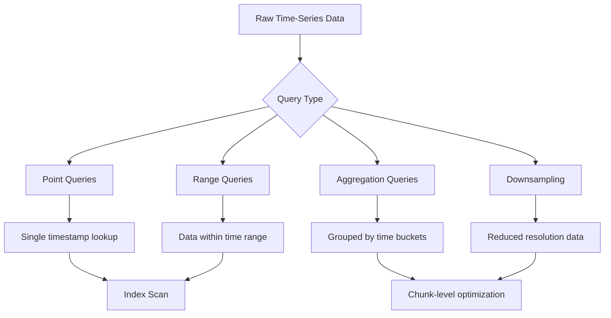
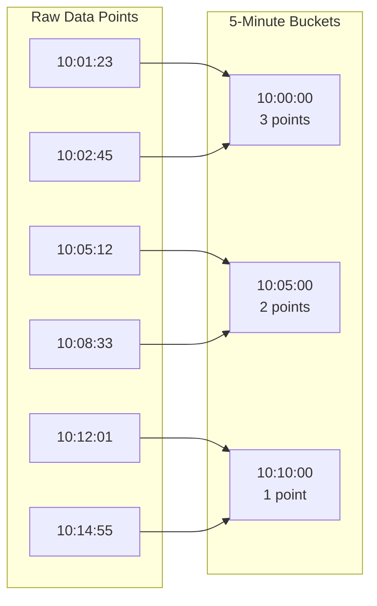
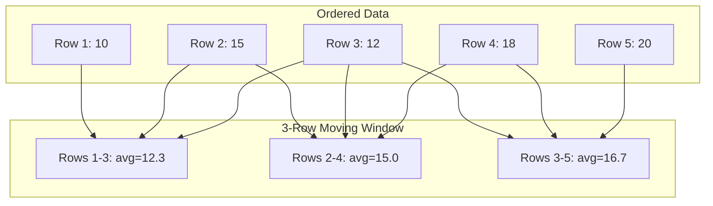
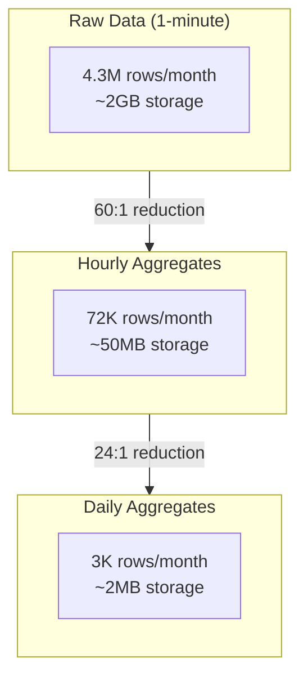
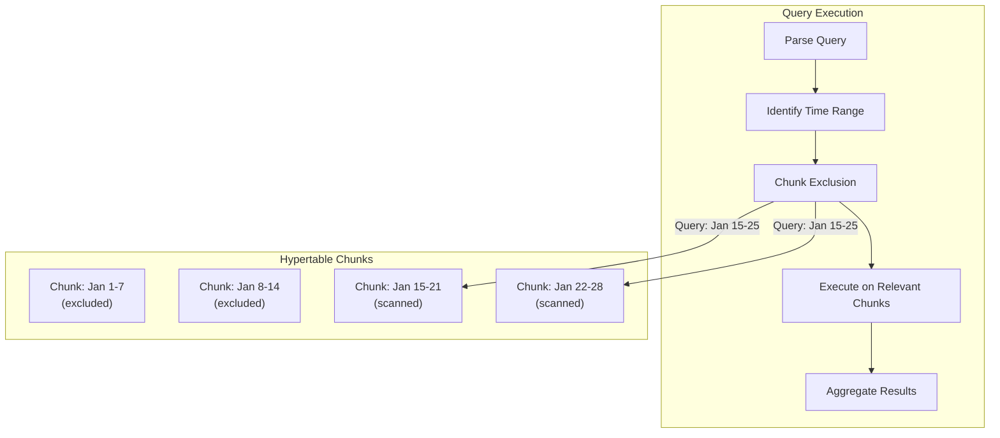

# How to Query Time-Series Data in TimescaleDB

Author: [nawazdhandala](https://www.github.com/nawazdhandala)

Tags: TimescaleDB, Time-Series, SQL, Analytics, PostgreSQL, Hypertables

Description: Master querying time-series data in TimescaleDB with practical examples covering time bucketing, window functions, gap filling, downsampling, and performance optimization techniques.

---

> Time-series data demands specialized query patterns. TimescaleDB extends PostgreSQL with powerful functions designed specifically for temporal data analysis. This guide shows you how to write efficient queries that extract meaningful insights from your time-series data.

## Understanding Time-Series Query Patterns

Time-series data has unique characteristics that influence how you query it. Data arrives continuously, ordered by time, and analysis typically focuses on trends, aggregations, and patterns within specific time windows.

Traditional SQL works, but TimescaleDB provides optimized functions that make time-series queries both easier to write and faster to execute. The key difference lies in how the database handles time-based operations internally.



## Setting Up Sample Data

Before diving into queries, let us create a realistic dataset. This schema represents server metrics that you might collect from a monitoring system.

The following SQL creates a hypertable partitioned by time, which is essential for time-series performance.

```sql
-- Create extension if not already installed
CREATE EXTENSION IF NOT EXISTS timescaledb;

-- Create a table for server metrics
-- This structure supports typical monitoring use cases
CREATE TABLE server_metrics (
    time        TIMESTAMPTZ NOT NULL,
    server_id   TEXT NOT NULL,
    region      TEXT NOT NULL,
    cpu_percent DOUBLE PRECISION,
    memory_percent DOUBLE PRECISION,
    disk_iops   INTEGER,
    network_mbps DOUBLE PRECISION,
    active_connections INTEGER
);

-- Convert to hypertable with automatic partitioning by time
-- Chunks are created for each 1-day interval by default
SELECT create_hypertable(
    'server_metrics',
    'time',
    chunk_time_interval => INTERVAL '1 day'
);

-- Create index for common query patterns
-- The (server_id, time DESC) pattern optimizes latest-value lookups
CREATE INDEX idx_server_metrics_server_time
    ON server_metrics (server_id, time DESC);

-- Create index for region-based queries
CREATE INDEX idx_server_metrics_region_time
    ON server_metrics (region, time DESC);
```

Now let us populate it with sample data spanning 30 days.

```sql
-- Generate realistic sample data for 30 days
-- This creates approximately 4.3 million rows (100 servers x 30 days x 1440 minutes)
INSERT INTO server_metrics
SELECT
    -- Generate timestamps at 1-minute intervals
    time,
    -- Distribute across 100 servers
    'server-' || LPAD((server_num)::text, 3, '0') AS server_id,
    -- Assign servers to regions
    CASE (server_num % 4)
        WHEN 0 THEN 'us-east'
        WHEN 1 THEN 'us-west'
        WHEN 2 THEN 'eu-west'
        ELSE 'ap-south'
    END AS region,
    -- CPU with realistic patterns (higher during business hours)
    25 + (40 * sin(EXTRACT(hour FROM time) * pi() / 12))
        + (random() * 20) AS cpu_percent,
    -- Memory usage relatively stable with gradual increase
    50 + (random() * 30) + (EXTRACT(day FROM time) * 0.5) AS memory_percent,
    -- Disk IOPS with spikes
    (500 + random() * 1000 +
        CASE WHEN random() > 0.95 THEN 2000 ELSE 0 END)::integer AS disk_iops,
    -- Network throughput
    10 + (random() * 50) AS network_mbps,
    -- Active connections varying by time of day
    (50 + 100 * sin(EXTRACT(hour FROM time) * pi() / 12)
        + random() * 30)::integer AS active_connections
FROM
    generate_series(
        NOW() - INTERVAL '30 days',
        NOW(),
        INTERVAL '1 minute'
    ) AS time,
    generate_series(1, 100) AS server_num;
```

## Time Bucketing with time_bucket

The `time_bucket` function is the foundation of time-series analysis in TimescaleDB. It groups timestamps into fixed-size intervals, enabling aggregations over consistent time periods.



This query calculates average CPU usage per server in 15-minute buckets.

```sql
-- Aggregate CPU usage into 15-minute buckets
-- This is ideal for dashboard visualizations
SELECT
    time_bucket('15 minutes', time) AS bucket,
    server_id,
    -- Round to 2 decimal places for readability
    ROUND(AVG(cpu_percent)::numeric, 2) AS avg_cpu,
    ROUND(MAX(cpu_percent)::numeric, 2) AS max_cpu,
    ROUND(MIN(cpu_percent)::numeric, 2) AS min_cpu,
    COUNT(*) AS sample_count
FROM server_metrics
WHERE
    time >= NOW() - INTERVAL '24 hours'
    AND server_id = 'server-001'
GROUP BY bucket, server_id
ORDER BY bucket DESC;
```

You can use various interval specifications with time_bucket.

```sql
-- Different bucket sizes for different use cases
-- 1-minute buckets for real-time monitoring
SELECT time_bucket('1 minute', time) AS bucket, AVG(cpu_percent)
FROM server_metrics WHERE time > NOW() - INTERVAL '1 hour'
GROUP BY bucket ORDER BY bucket;

-- Hourly buckets for daily trends
SELECT time_bucket('1 hour', time) AS bucket, AVG(cpu_percent)
FROM server_metrics WHERE time > NOW() - INTERVAL '7 days'
GROUP BY bucket ORDER BY bucket;

-- Daily buckets for monthly reports
SELECT time_bucket('1 day', time) AS bucket, AVG(cpu_percent)
FROM server_metrics WHERE time > NOW() - INTERVAL '30 days'
GROUP BY bucket ORDER BY bucket;

-- Weekly buckets for long-term analysis
SELECT time_bucket('1 week', time) AS bucket, AVG(cpu_percent)
FROM server_metrics WHERE time > NOW() - INTERVAL '1 year'
GROUP BY bucket ORDER BY bucket;
```

## Range Queries and Time Filters

Efficient time-range filtering is critical for performance. TimescaleDB automatically prunes chunks that fall outside your query range, but proper filter construction ensures optimal execution.

This query retrieves all metrics for a specific server within a time range.

```sql
-- Retrieve metrics for analysis window
-- The time filter should always come first for chunk exclusion
SELECT
    time,
    cpu_percent,
    memory_percent,
    disk_iops,
    network_mbps
FROM server_metrics
WHERE
    -- Time filter enables chunk exclusion
    time >= '2026-01-15 00:00:00'::timestamptz
    AND time < '2026-01-16 00:00:00'::timestamptz
    -- Additional filters narrow within chunks
    AND server_id = 'server-042'
ORDER BY time;
```

For relative time ranges, use interval arithmetic.

```sql
-- Last 4 hours of data
SELECT * FROM server_metrics
WHERE time >= NOW() - INTERVAL '4 hours';

-- Specific time window relative to now
SELECT * FROM server_metrics
WHERE time BETWEEN NOW() - INTERVAL '2 hours' AND NOW() - INTERVAL '1 hour';

-- Beginning of current day (midnight) to now
SELECT * FROM server_metrics
WHERE time >= date_trunc('day', NOW());

-- Same hour yesterday for comparison
SELECT * FROM server_metrics
WHERE time >= NOW() - INTERVAL '25 hours'
  AND time < NOW() - INTERVAL '24 hours';
```

## Advanced Aggregations

Beyond simple averages, time-series analysis often requires percentiles, standard deviations, and other statistical measures.

This query calculates comprehensive statistics for each server over the past week.

```sql
-- Comprehensive statistical summary per server
-- Useful for capacity planning and anomaly baseline establishment
SELECT
    server_id,
    region,
    -- Central tendency
    ROUND(AVG(cpu_percent)::numeric, 2) AS avg_cpu,
    ROUND(PERCENTILE_CONT(0.50) WITHIN GROUP (ORDER BY cpu_percent)::numeric, 2) AS median_cpu,
    -- Dispersion
    ROUND(STDDEV(cpu_percent)::numeric, 2) AS stddev_cpu,
    -- Extremes
    ROUND(MIN(cpu_percent)::numeric, 2) AS min_cpu,
    ROUND(MAX(cpu_percent)::numeric, 2) AS max_cpu,
    -- High percentiles for capacity planning
    ROUND(PERCENTILE_CONT(0.95) WITHIN GROUP (ORDER BY cpu_percent)::numeric, 2) AS p95_cpu,
    ROUND(PERCENTILE_CONT(0.99) WITHIN GROUP (ORDER BY cpu_percent)::numeric, 2) AS p99_cpu,
    -- Sample size
    COUNT(*) AS total_samples
FROM server_metrics
WHERE time >= NOW() - INTERVAL '7 days'
GROUP BY server_id, region
ORDER BY avg_cpu DESC;
```

For time-bucketed percentiles, combine time_bucket with percentile functions.

```sql
-- Hourly percentile analysis
-- Helps identify performance degradation patterns
SELECT
    time_bucket('1 hour', time) AS bucket,
    server_id,
    ROUND(PERCENTILE_CONT(0.50) WITHIN GROUP (ORDER BY cpu_percent)::numeric, 2) AS p50_cpu,
    ROUND(PERCENTILE_CONT(0.90) WITHIN GROUP (ORDER BY cpu_percent)::numeric, 2) AS p90_cpu,
    ROUND(PERCENTILE_CONT(0.99) WITHIN GROUP (ORDER BY cpu_percent)::numeric, 2) AS p99_cpu
FROM server_metrics
WHERE
    time >= NOW() - INTERVAL '24 hours'
    AND server_id = 'server-001'
GROUP BY bucket, server_id
ORDER BY bucket;
```

## Window Functions for Time-Series

Window functions enable calculations across rows without collapsing them into groups. This is essential for calculating moving averages, rate of change, and lag comparisons.



This query calculates a moving average alongside raw values.

```sql
-- Calculate 5-point moving average for smoothing
-- Useful for trend visualization and noise reduction
SELECT
    time,
    cpu_percent,
    -- Moving average over previous 5 data points
    ROUND(
        AVG(cpu_percent) OVER (
            PARTITION BY server_id
            ORDER BY time
            ROWS BETWEEN 4 PRECEDING AND CURRENT ROW
        )::numeric, 2
    ) AS moving_avg_5,
    -- Moving average over previous 15 data points
    ROUND(
        AVG(cpu_percent) OVER (
            PARTITION BY server_id
            ORDER BY time
            ROWS BETWEEN 14 PRECEDING AND CURRENT ROW
        )::numeric, 2
    ) AS moving_avg_15
FROM server_metrics
WHERE
    server_id = 'server-001'
    AND time >= NOW() - INTERVAL '2 hours'
ORDER BY time;
```

Calculate rate of change between consecutive readings.

```sql
-- Rate of change analysis
-- Helps detect rapid spikes or drops
SELECT
    time,
    cpu_percent,
    -- Previous value for comparison
    LAG(cpu_percent) OVER (PARTITION BY server_id ORDER BY time) AS prev_cpu,
    -- Absolute change from previous reading
    ROUND(
        (cpu_percent - LAG(cpu_percent) OVER (PARTITION BY server_id ORDER BY time))::numeric,
        2
    ) AS cpu_delta,
    -- Percentage change from previous reading
    ROUND(
        ((cpu_percent - LAG(cpu_percent) OVER (PARTITION BY server_id ORDER BY time))
        / NULLIF(LAG(cpu_percent) OVER (PARTITION BY server_id ORDER BY time), 0) * 100)::numeric,
        2
    ) AS cpu_pct_change
FROM server_metrics
WHERE
    server_id = 'server-001'
    AND time >= NOW() - INTERVAL '1 hour'
ORDER BY time;
```

Cumulative calculations within time periods.

```sql
-- Cumulative disk I/O within each hour
-- Useful for tracking resource consumption over time
SELECT
    time,
    disk_iops,
    -- Running total within the current hour
    SUM(disk_iops) OVER (
        PARTITION BY server_id, date_trunc('hour', time)
        ORDER BY time
    ) AS cumulative_iops_hourly,
    -- Row number within the hour
    ROW_NUMBER() OVER (
        PARTITION BY server_id, date_trunc('hour', time)
        ORDER BY time
    ) AS reading_num
FROM server_metrics
WHERE
    server_id = 'server-001'
    AND time >= NOW() - INTERVAL '3 hours'
ORDER BY time;
```

## Gap Filling with time_bucket_gapfill

Real-world time-series data often has gaps due to network issues, server downtime, or sampling irregularities. The `time_bucket_gapfill` function creates complete time series by filling in missing buckets.

```sql
-- Fill gaps in hourly data with previous values
-- Essential for visualization tools that expect continuous series
SELECT
    time_bucket_gapfill('1 hour', time) AS bucket,
    server_id,
    -- Use last observed value for gaps
    LOCF(AVG(cpu_percent)) AS avg_cpu_filled,
    -- Or use linear interpolation
    INTERPOLATE(AVG(cpu_percent)) AS avg_cpu_interpolated,
    -- Track whether data was actual or filled
    COALESCE(COUNT(*), 0) AS actual_samples
FROM server_metrics
WHERE
    time >= NOW() - INTERVAL '24 hours'
    AND time < NOW()
    AND server_id = 'server-001'
GROUP BY bucket, server_id
ORDER BY bucket;
```

LOCF (Last Observation Carried Forward) fills gaps with the most recent known value.

```sql
-- LOCF is appropriate when values persist until changed
-- Example: configuration state, feature flags, or status indicators
SELECT
    time_bucket_gapfill('15 minutes', time) AS bucket,
    server_id,
    LOCF(AVG(memory_percent)) AS memory_locf,
    LOCF(MAX(active_connections)) AS connections_locf
FROM server_metrics
WHERE
    time >= NOW() - INTERVAL '6 hours'
    AND time < NOW()
    AND server_id IN ('server-001', 'server-002')
GROUP BY bucket, server_id
ORDER BY bucket, server_id;
```

Linear interpolation estimates values based on surrounding data points.

```sql
-- Interpolation is better for continuous measurements
-- Example: temperature, pressure, or gradually changing metrics
SELECT
    time_bucket_gapfill('5 minutes', time) AS bucket,
    server_id,
    INTERPOLATE(AVG(cpu_percent)) AS cpu_interpolated,
    INTERPOLATE(AVG(network_mbps)) AS network_interpolated
FROM server_metrics
WHERE
    time >= NOW() - INTERVAL '2 hours'
    AND time < NOW()
    AND server_id = 'server-001'
GROUP BY bucket, server_id
ORDER BY bucket;
```

## Downsampling for Long-Term Storage

Downsampling reduces data granularity to save storage while preserving analytical value. This is essential for maintaining years of historical data efficiently.



Create a downsampled table for historical data.

```sql
-- Create table for hourly summaries
CREATE TABLE server_metrics_hourly (
    bucket      TIMESTAMPTZ NOT NULL,
    server_id   TEXT NOT NULL,
    region      TEXT NOT NULL,
    -- Preserve multiple aggregates for flexibility
    avg_cpu     DOUBLE PRECISION,
    max_cpu     DOUBLE PRECISION,
    min_cpu     DOUBLE PRECISION,
    avg_memory  DOUBLE PRECISION,
    max_memory  DOUBLE PRECISION,
    total_iops  BIGINT,
    avg_network DOUBLE PRECISION,
    max_connections INTEGER,
    sample_count INTEGER,
    PRIMARY KEY (bucket, server_id)
);

-- Convert to hypertable
SELECT create_hypertable(
    'server_metrics_hourly',
    'bucket',
    chunk_time_interval => INTERVAL '1 week'
);
```

Populate with downsampled data.

```sql
-- Downsample raw data to hourly summaries
-- Run this periodically (e.g., via cron or pg_cron)
INSERT INTO server_metrics_hourly
SELECT
    time_bucket('1 hour', time) AS bucket,
    server_id,
    region,
    AVG(cpu_percent) AS avg_cpu,
    MAX(cpu_percent) AS max_cpu,
    MIN(cpu_percent) AS min_cpu,
    AVG(memory_percent) AS avg_memory,
    MAX(memory_percent) AS max_memory,
    SUM(disk_iops) AS total_iops,
    AVG(network_mbps) AS avg_network,
    MAX(active_connections) AS max_connections,
    COUNT(*) AS sample_count
FROM server_metrics
WHERE
    time >= NOW() - INTERVAL '25 hours'
    AND time < NOW() - INTERVAL '1 hour'
GROUP BY bucket, server_id, region
ON CONFLICT (bucket, server_id) DO UPDATE SET
    avg_cpu = EXCLUDED.avg_cpu,
    max_cpu = EXCLUDED.max_cpu,
    min_cpu = EXCLUDED.min_cpu,
    avg_memory = EXCLUDED.avg_memory,
    max_memory = EXCLUDED.max_memory,
    total_iops = EXCLUDED.total_iops,
    avg_network = EXCLUDED.avg_network,
    max_connections = EXCLUDED.max_connections,
    sample_count = EXCLUDED.sample_count;
```

## Latest Value Queries

Finding the most recent value for each entity is a common requirement for dashboards and status pages.

```sql
-- Get latest metrics for all servers
-- Uses DISTINCT ON for efficient single-pass execution
SELECT DISTINCT ON (server_id)
    server_id,
    region,
    time AS last_seen,
    cpu_percent,
    memory_percent,
    disk_iops,
    network_mbps,
    active_connections
FROM server_metrics
WHERE time >= NOW() - INTERVAL '1 hour'
ORDER BY server_id, time DESC;
```

Alternative using window functions for additional context.

```sql
-- Latest value with comparison to previous
SELECT * FROM (
    SELECT
        server_id,
        time,
        cpu_percent,
        LAG(cpu_percent) OVER (PARTITION BY server_id ORDER BY time) AS prev_cpu,
        ROW_NUMBER() OVER (PARTITION BY server_id ORDER BY time DESC) AS rn
    FROM server_metrics
    WHERE time >= NOW() - INTERVAL '30 minutes'
) sub
WHERE rn = 1
ORDER BY server_id;
```

## Comparing Time Periods

Analyzing how metrics compare across different time periods helps identify trends and anomalies.

```sql
-- Compare current hour to same hour yesterday
WITH current_hour AS (
    SELECT
        server_id,
        AVG(cpu_percent) AS avg_cpu,
        MAX(cpu_percent) AS max_cpu
    FROM server_metrics
    WHERE time >= date_trunc('hour', NOW())
    GROUP BY server_id
),
yesterday_same_hour AS (
    SELECT
        server_id,
        AVG(cpu_percent) AS avg_cpu,
        MAX(cpu_percent) AS max_cpu
    FROM server_metrics
    WHERE
        time >= date_trunc('hour', NOW()) - INTERVAL '1 day'
        AND time < date_trunc('hour', NOW()) - INTERVAL '1 day' + INTERVAL '1 hour'
    GROUP BY server_id
)
SELECT
    c.server_id,
    ROUND(c.avg_cpu::numeric, 2) AS current_avg_cpu,
    ROUND(y.avg_cpu::numeric, 2) AS yesterday_avg_cpu,
    ROUND((c.avg_cpu - y.avg_cpu)::numeric, 2) AS cpu_change,
    ROUND(((c.avg_cpu - y.avg_cpu) / NULLIF(y.avg_cpu, 0) * 100)::numeric, 2) AS cpu_pct_change
FROM current_hour c
LEFT JOIN yesterday_same_hour y ON c.server_id = y.server_id
ORDER BY cpu_pct_change DESC NULLS LAST;
```

Week-over-week comparison by day of week.

```sql
-- Weekly pattern comparison
-- Useful for detecting weekly seasonality
SELECT
    EXTRACT(dow FROM time) AS day_of_week,
    CASE EXTRACT(dow FROM time)
        WHEN 0 THEN 'Sunday'
        WHEN 1 THEN 'Monday'
        WHEN 2 THEN 'Tuesday'
        WHEN 3 THEN 'Wednesday'
        WHEN 4 THEN 'Thursday'
        WHEN 5 THEN 'Friday'
        WHEN 6 THEN 'Saturday'
    END AS day_name,
    ROUND(AVG(cpu_percent)::numeric, 2) AS avg_cpu,
    ROUND(MAX(cpu_percent)::numeric, 2) AS max_cpu,
    COUNT(*) / COUNT(DISTINCT date_trunc('day', time)) AS avg_samples_per_day
FROM server_metrics
WHERE
    time >= NOW() - INTERVAL '4 weeks'
    AND server_id = 'server-001'
GROUP BY EXTRACT(dow FROM time)
ORDER BY EXTRACT(dow FROM time);
```

## Anomaly Detection Queries

Identify outliers and unusual patterns in your time-series data.

```sql
-- Detect CPU spikes using z-score
-- Values more than 3 standard deviations from mean are flagged
WITH stats AS (
    SELECT
        AVG(cpu_percent) AS mean_cpu,
        STDDEV(cpu_percent) AS stddev_cpu
    FROM server_metrics
    WHERE
        time >= NOW() - INTERVAL '7 days'
        AND server_id = 'server-001'
)
SELECT
    m.time,
    m.cpu_percent,
    ROUND(((m.cpu_percent - s.mean_cpu) / NULLIF(s.stddev_cpu, 0))::numeric, 2) AS z_score,
    CASE
        WHEN ABS((m.cpu_percent - s.mean_cpu) / NULLIF(s.stddev_cpu, 0)) > 3
        THEN 'ANOMALY'
        WHEN ABS((m.cpu_percent - s.mean_cpu) / NULLIF(s.stddev_cpu, 0)) > 2
        THEN 'WARNING'
        ELSE 'NORMAL'
    END AS status
FROM server_metrics m
CROSS JOIN stats s
WHERE
    m.time >= NOW() - INTERVAL '24 hours'
    AND m.server_id = 'server-001'
    AND ABS((m.cpu_percent - s.mean_cpu) / NULLIF(s.stddev_cpu, 0)) > 2
ORDER BY m.time DESC;
```

Detect sudden changes using rate of change.

```sql
-- Find rapid metric changes
-- Useful for detecting incidents as they begin
SELECT
    time,
    server_id,
    cpu_percent,
    prev_cpu,
    cpu_delta
FROM (
    SELECT
        time,
        server_id,
        cpu_percent,
        LAG(cpu_percent) OVER (PARTITION BY server_id ORDER BY time) AS prev_cpu,
        cpu_percent - LAG(cpu_percent) OVER (PARTITION BY server_id ORDER BY time) AS cpu_delta
    FROM server_metrics
    WHERE time >= NOW() - INTERVAL '1 hour'
) sub
WHERE ABS(cpu_delta) > 20
ORDER BY ABS(cpu_delta) DESC
LIMIT 50;
```

## Query Performance Optimization

Optimizing time-series queries requires understanding how TimescaleDB processes data.



Always filter on time first.

```sql
-- GOOD: Time filter enables chunk exclusion
EXPLAIN ANALYZE
SELECT AVG(cpu_percent)
FROM server_metrics
WHERE
    time >= NOW() - INTERVAL '1 day'  -- This filter is evaluated first
    AND server_id = 'server-001';

-- LESS OPTIMAL: Function on time column prevents optimization
-- Avoid this pattern when possible
EXPLAIN ANALYZE
SELECT AVG(cpu_percent)
FROM server_metrics
WHERE
    date_trunc('day', time) = date_trunc('day', NOW())
    AND server_id = 'server-001';
```

Use appropriate indexes.

```sql
-- Check existing indexes
SELECT
    indexname,
    indexdef
FROM pg_indexes
WHERE tablename = 'server_metrics';

-- Create composite index for common query patterns
-- Order matters: put equality columns first, then range columns
CREATE INDEX idx_server_region_time
    ON server_metrics (server_id, region, time DESC);

-- For queries that filter on time range and aggregate by server
CREATE INDEX idx_time_server
    ON server_metrics (time DESC, server_id);
```

Analyze query plans.

```sql
-- Use EXPLAIN ANALYZE to understand query execution
EXPLAIN (ANALYZE, BUFFERS, FORMAT TEXT)
SELECT
    time_bucket('1 hour', time) AS bucket,
    server_id,
    AVG(cpu_percent) AS avg_cpu
FROM server_metrics
WHERE
    time >= NOW() - INTERVAL '7 days'
    AND region = 'us-east'
GROUP BY bucket, server_id
ORDER BY bucket DESC, avg_cpu DESC
LIMIT 100;
```

## Best Practices Summary

**Time Filtering**

- Always include explicit time range filters in WHERE clauses
- Place time filters before other conditions
- Use timestamp comparisons rather than functions on time columns
- For relative ranges, prefer `NOW() - INTERVAL` over date arithmetic

**Aggregation Strategy**

- Choose bucket sizes based on query use case, not data granularity
- Use continuous aggregates for frequently-run queries
- Pre-aggregate at multiple resolutions for multi-zoom dashboards
- Consider approximate percentiles for high-cardinality data

**Index Design**

- Include time in composite indexes for time-series tables
- Order index columns by selectivity (most selective first)
- Create covering indexes for common query patterns
- Monitor index usage and drop unused indexes

**Gap Handling**

- Use `time_bucket_gapfill` for visualization queries
- Choose LOCF for state-like data, interpolation for measurements
- Document gap-filling strategy in your application code
- Consider whether gaps represent missing data or zero values

**Performance Monitoring**

- Regularly run EXPLAIN ANALYZE on critical queries
- Monitor chunk exclusion effectiveness
- Watch for sequential scans on large time ranges
- Use pg_stat_statements to identify slow queries

**Data Lifecycle**

- Implement retention policies to manage data growth
- Downsample old data to appropriate resolutions
- Enable compression for historical chunks
- Test backup and restore procedures regularly

## Conclusion

TimescaleDB provides a powerful toolkit for querying time-series data efficiently. The combination of standard SQL with specialized functions like `time_bucket`, `time_bucket_gapfill`, and window functions enables sophisticated analysis without leaving the familiar PostgreSQL environment.

The key to effective time-series queries lies in understanding your access patterns and designing your schema, indexes, and aggregation strategy accordingly. Start with simple queries, measure their performance, and progressively optimize based on actual usage.

For monitoring your TimescaleDB queries and database health, consider [OneUptime](https://oneuptime.com), an open-source observability platform that provides comprehensive database monitoring, query performance tracking, and alerting capabilities.
