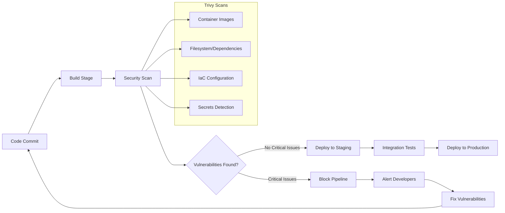
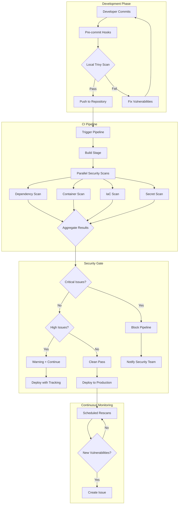

# How to Configure Trivy in CI/CD

Author: [nawazdhandala](https://www.github.com/nawazdhandala)

Tags: Trivy, CI/CD, Security, Scanning, DevSecOps, Vulnerability Management, Container Security, GitHub Actions, GitLab CI, Jenkins

Description: A comprehensive guide to configuring Trivy vulnerability scanner in CI/CD pipelines, covering GitHub Actions, GitLab CI, Jenkins, and best practices for automated security scanning.

---

> "The best time to find a vulnerability is before your code reaches production. Integrating Trivy into your CI/CD pipeline transforms security from a gate at the end into a continuous practice throughout development."

## Introduction to Trivy in CI/CD

Security scanning in CI/CD pipelines has become essential for modern software development. Trivy, developed by Aqua Security, is a comprehensive vulnerability scanner that can detect security issues in container images, filesystems, git repositories, and Infrastructure as Code (IaC) configurations. Unlike traditional security tools that require complex setup, Trivy runs as a single binary and automatically downloads its vulnerability database.

This guide covers how to configure Trivy across different CI/CD platforms, implement advanced scanning strategies, and establish security gates that protect your production environments without slowing down your development velocity.

## Understanding the CI/CD Security Pipeline

Before diving into configuration, it is important to understand where Trivy fits in your CI/CD pipeline and what it can scan.



Trivy can scan multiple targets in your pipeline:

1. **Container Images**: Detect vulnerabilities in OS packages and application dependencies within Docker images
2. **Filesystem**: Scan your project directory for vulnerable dependencies in package managers (npm, pip, go.mod, etc.)
3. **IaC**: Check Terraform, CloudFormation, Kubernetes manifests, and Dockerfiles for misconfigurations
4. **Secrets**: Detect accidentally committed credentials, API keys, and tokens

## GitHub Actions Configuration

GitHub Actions provides an excellent platform for running Trivy scans. The official Trivy Action simplifies integration while providing flexibility for advanced configurations.

### Basic Container Image Scanning

The following workflow builds a Docker image and scans it for vulnerabilities on every push and pull request.

```yaml
# .github/workflows/trivy-scan.yml
# This workflow builds a Docker image and scans it with Trivy
# Runs on pushes to main and all pull requests

name: Trivy Security Scan

on:
  push:
    branches: [main, master]
  pull_request:
    branches: [main, master]

jobs:
  build-and-scan:
    name: Build and Scan Container Image
    runs-on: ubuntu-latest

    steps:
      # Checkout the repository code
      - name: Checkout code
        uses: actions/checkout@v4

      # Set up Docker Buildx for better build performance
      - name: Set up Docker Buildx
        uses: docker/setup-buildx-action@v3

      # Build the Docker image locally for scanning
      # Using the commit SHA ensures each build is uniquely identifiable
      - name: Build Docker image
        uses: docker/build-push-action@v5
        with:
          context: .
          push: false
          load: true
          tags: my-app:${{ github.sha }}
          cache-from: type=gha
          cache-to: type=gha,mode=max

      # Run Trivy vulnerability scanner on the built image
      # This step will fail if HIGH or CRITICAL vulnerabilities are found
      - name: Scan image with Trivy
        uses: aquasecurity/trivy-action@master
        with:
          image-ref: 'my-app:${{ github.sha }}'
          format: 'table'
          exit-code: '1'
          ignore-unfixed: true
          vuln-type: 'os,library'
          severity: 'HIGH,CRITICAL'
```

### Advanced Multi-Scan Workflow

This comprehensive workflow performs multiple types of scans and uploads results to GitHub Security.

```yaml
# .github/workflows/trivy-comprehensive.yml
# Comprehensive security scanning workflow with multiple Trivy scan types
# Includes container, filesystem, IaC, and secret scanning

name: Comprehensive Security Scan

on:
  push:
    branches: [main, master]
  pull_request:
    branches: [main, master]
  schedule:
    # Run daily at midnight UTC to catch newly disclosed vulnerabilities
    - cron: '0 0 * * *'

env:
  # Define severity threshold for blocking the pipeline
  SEVERITY_THRESHOLD: 'HIGH,CRITICAL'
  # Registry and image name for container scanning
  REGISTRY: ghcr.io
  IMAGE_NAME: ${{ github.repository }}

jobs:
  # Job 1: Scan filesystem for vulnerable dependencies
  dependency-scan:
    name: Dependency Vulnerability Scan
    runs-on: ubuntu-latest
    steps:
      - name: Checkout code
        uses: actions/checkout@v4

      # Scan the filesystem for package vulnerabilities
      # Detects issues in package.json, requirements.txt, go.mod, etc.
      - name: Scan dependencies
        uses: aquasecurity/trivy-action@master
        with:
          scan-type: 'fs'
          scan-ref: '.'
          format: 'sarif'
          output: 'trivy-fs-results.sarif'
          severity: ${{ env.SEVERITY_THRESHOLD }}

      # Upload results to GitHub Security tab
      - name: Upload dependency scan results
        uses: github/codeql-action/upload-sarif@v3
        if: always()
        with:
          sarif_file: 'trivy-fs-results.sarif'
          category: 'trivy-dependency-scan'

  # Job 2: Scan Infrastructure as Code configurations
  iac-scan:
    name: IaC Configuration Scan
    runs-on: ubuntu-latest
    steps:
      - name: Checkout code
        uses: actions/checkout@v4

      # Scan Terraform, Kubernetes manifests, Dockerfiles for misconfigurations
      - name: Scan IaC configurations
        uses: aquasecurity/trivy-action@master
        with:
          scan-type: 'config'
          scan-ref: '.'
          format: 'sarif'
          output: 'trivy-iac-results.sarif'
          # IaC scans use different severity classification
          severity: 'MEDIUM,HIGH,CRITICAL'

      - name: Upload IaC scan results
        uses: github/codeql-action/upload-sarif@v3
        if: always()
        with:
          sarif_file: 'trivy-iac-results.sarif'
          category: 'trivy-iac-scan'

  # Job 3: Scan for accidentally committed secrets
  secret-scan:
    name: Secret Detection Scan
    runs-on: ubuntu-latest
    steps:
      - name: Checkout code
        uses: actions/checkout@v4
        with:
          # Fetch full history to scan all commits
          fetch-depth: 0

      # Scan repository for secrets
      - name: Scan for secrets
        uses: aquasecurity/trivy-action@master
        with:
          scan-type: 'repo'
          scan-ref: '.'
          scanners: 'secret'
          format: 'sarif'
          output: 'trivy-secret-results.sarif'

      - name: Upload secret scan results
        uses: github/codeql-action/upload-sarif@v3
        if: always()
        with:
          sarif_file: 'trivy-secret-results.sarif'
          category: 'trivy-secret-scan'

  # Job 4: Build and scan container image
  container-scan:
    name: Container Image Scan
    runs-on: ubuntu-latest
    permissions:
      contents: read
      packages: write
      security-events: write

    steps:
      - name: Checkout code
        uses: actions/checkout@v4

      - name: Set up Docker Buildx
        uses: docker/setup-buildx-action@v3

      # Build the image for scanning
      - name: Build Docker image
        uses: docker/build-push-action@v5
        with:
          context: .
          push: false
          load: true
          tags: ${{ env.REGISTRY }}/${{ env.IMAGE_NAME }}:${{ github.sha }}

      # Scan the container image
      - name: Scan container image
        uses: aquasecurity/trivy-action@master
        with:
          image-ref: '${{ env.REGISTRY }}/${{ env.IMAGE_NAME }}:${{ github.sha }}'
          format: 'sarif'
          output: 'trivy-image-results.sarif'
          severity: ${{ env.SEVERITY_THRESHOLD }}
          ignore-unfixed: true

      - name: Upload container scan results
        uses: github/codeql-action/upload-sarif@v3
        if: always()
        with:
          sarif_file: 'trivy-image-results.sarif'
          category: 'trivy-container-scan'

  # Job 5: Gate deployment based on scan results
  security-gate:
    name: Security Gate
    runs-on: ubuntu-latest
    needs: [dependency-scan, iac-scan, secret-scan, container-scan]
    steps:
      - name: Security gate passed
        run: echo "All security scans completed successfully"
```

### Caching Trivy Database

Trivy downloads a vulnerability database on each run. Caching this database significantly speeds up your pipeline.

```yaml
# Workflow with Trivy database caching
# Reduces scan time by caching the vulnerability database between runs

name: Trivy Scan with Cache

on:
  push:
    branches: [main]

jobs:
  scan:
    runs-on: ubuntu-latest
    steps:
      - name: Checkout code
        uses: actions/checkout@v4

      # Cache Trivy database to speed up subsequent scans
      # The database is updated daily, so we use the date as part of the cache key
      - name: Cache Trivy database
        uses: actions/cache@v4
        with:
          path: |
            ~/.cache/trivy
          key: trivy-db-${{ runner.os }}-${{ hashFiles('.github/workflows/trivy-scan.yml') }}
          restore-keys: |
            trivy-db-${{ runner.os }}-

      # Run Trivy with cached database
      - name: Run Trivy scan
        uses: aquasecurity/trivy-action@master
        with:
          scan-type: 'fs'
          scan-ref: '.'
          format: 'table'
          severity: 'HIGH,CRITICAL'
        env:
          # Use the cached database location
          TRIVY_CACHE_DIR: ~/.cache/trivy
```

## GitLab CI Configuration

GitLab CI provides native container scanning integration with Trivy. You can use either the built-in templates or custom configurations.

### Basic GitLab CI Configuration

```yaml
# .gitlab-ci.yml
# Basic Trivy scanning configuration for GitLab CI
# Integrates with GitLab Security Dashboard

stages:
  - build
  - test
  - security
  - deploy

variables:
  # Docker image settings
  DOCKER_HOST: tcp://docker:2375
  DOCKER_TLS_CERTDIR: ""
  # Trivy configuration
  TRIVY_NO_PROGRESS: "true"
  TRIVY_CACHE_DIR: ".trivycache/"

# Build the Docker image
build:
  stage: build
  image: docker:24
  services:
    - docker:24-dind
  script:
    # Build and push to GitLab Container Registry
    - docker login -u $CI_REGISTRY_USER -p $CI_REGISTRY_PASSWORD $CI_REGISTRY
    - docker build -t $CI_REGISTRY_IMAGE:$CI_COMMIT_SHA .
    - docker push $CI_REGISTRY_IMAGE:$CI_COMMIT_SHA
  only:
    - main
    - merge_requests

# Scan container image with Trivy
container_scanning:
  stage: security
  image:
    name: aquasec/trivy:latest
    entrypoint: [""]
  cache:
    # Cache the Trivy database between pipeline runs
    key: trivy-cache
    paths:
      - .trivycache/
  script:
    # Update vulnerability database
    - trivy image --download-db-only --cache-dir .trivycache/

    # Scan the container image
    # Generate GitLab-compatible report format
    - trivy image
        --exit-code 0
        --cache-dir .trivycache/
        --format template
        --template "@/contrib/gitlab.tpl"
        --output gl-container-scanning-report.json
        $CI_REGISTRY_IMAGE:$CI_COMMIT_SHA

    # Also generate table output for logs
    - trivy image
        --exit-code 1
        --cache-dir .trivycache/
        --severity HIGH,CRITICAL
        --ignore-unfixed
        $CI_REGISTRY_IMAGE:$CI_COMMIT_SHA
  artifacts:
    reports:
      # GitLab automatically displays these in merge requests
      container_scanning: gl-container-scanning-report.json
    paths:
      - gl-container-scanning-report.json
    when: always
  dependencies:
    - build
  only:
    - main
    - merge_requests
```

### Advanced GitLab CI with Multiple Scan Types

```yaml
# .gitlab-ci.yml
# Advanced Trivy configuration with multiple scan types
# Includes dependency scanning, container scanning, and IaC scanning

stages:
  - build
  - security
  - deploy

variables:
  TRIVY_NO_PROGRESS: "true"
  TRIVY_CACHE_DIR: ".trivycache/"
  SEVERITY_THRESHOLD: "HIGH,CRITICAL"

# Cache configuration shared across security jobs
.trivy-cache:
  cache:
    key: trivy-$CI_COMMIT_REF_SLUG
    paths:
      - .trivycache/
    policy: pull-push

# Scan dependencies for vulnerabilities
dependency_scanning:
  stage: security
  extends: .trivy-cache
  image:
    name: aquasec/trivy:latest
    entrypoint: [""]
  script:
    # Scan filesystem for package vulnerabilities
    - trivy fs
        --cache-dir .trivycache/
        --exit-code 0
        --format template
        --template "@/contrib/gitlab.tpl"
        --output gl-dependency-scanning-report.json
        .

    # Fail pipeline on critical vulnerabilities
    - trivy fs
        --cache-dir .trivycache/
        --exit-code 1
        --severity $SEVERITY_THRESHOLD
        --ignore-unfixed
        .
  artifacts:
    reports:
      dependency_scanning: gl-dependency-scanning-report.json
    when: always
  allow_failure: false

# Scan IaC configurations
iac_scanning:
  stage: security
  extends: .trivy-cache
  image:
    name: aquasec/trivy:latest
    entrypoint: [""]
  script:
    # Scan for IaC misconfigurations
    - trivy config
        --cache-dir .trivycache/
        --exit-code 0
        --format json
        --output iac-report.json
        .

    # Check for critical misconfigurations
    - trivy config
        --cache-dir .trivycache/
        --exit-code 1
        --severity $SEVERITY_THRESHOLD
        .
  artifacts:
    paths:
      - iac-report.json
    when: always
  allow_failure: true

# Scan for exposed secrets
secret_scanning:
  stage: security
  extends: .trivy-cache
  image:
    name: aquasec/trivy:latest
    entrypoint: [""]
  script:
    # Detect secrets in the repository
    - trivy repo
        --cache-dir .trivycache/
        --scanners secret
        --exit-code 1
        --severity $SEVERITY_THRESHOLD
        .
  artifacts:
    paths:
      - secret-report.json
    when: always
  allow_failure: false

# Build container image
build_image:
  stage: build
  image: docker:24
  services:
    - docker:24-dind
  variables:
    DOCKER_HOST: tcp://docker:2375
    DOCKER_TLS_CERTDIR: ""
  script:
    - docker login -u $CI_REGISTRY_USER -p $CI_REGISTRY_PASSWORD $CI_REGISTRY
    - docker build -t $CI_REGISTRY_IMAGE:$CI_COMMIT_SHA .
    - docker push $CI_REGISTRY_IMAGE:$CI_COMMIT_SHA

# Scan container image
container_scanning:
  stage: security
  extends: .trivy-cache
  needs: [build_image]
  image:
    name: aquasec/trivy:latest
    entrypoint: [""]
  variables:
    TRIVY_USERNAME: $CI_REGISTRY_USER
    TRIVY_PASSWORD: $CI_REGISTRY_PASSWORD
  script:
    # Scan container image from registry
    - trivy image
        --cache-dir .trivycache/
        --exit-code 0
        --format template
        --template "@/contrib/gitlab.tpl"
        --output gl-container-scanning-report.json
        $CI_REGISTRY_IMAGE:$CI_COMMIT_SHA

    - trivy image
        --cache-dir .trivycache/
        --exit-code 1
        --severity $SEVERITY_THRESHOLD
        --ignore-unfixed
        $CI_REGISTRY_IMAGE:$CI_COMMIT_SHA
  artifacts:
    reports:
      container_scanning: gl-container-scanning-report.json
    when: always
```

## Jenkins Pipeline Configuration

Jenkins provides flexibility for running Trivy scans through both declarative and scripted pipelines.

### Declarative Pipeline

```groovy
// Jenkinsfile
// Declarative pipeline with Trivy security scanning
// Includes parallel scanning stages for faster execution

pipeline {
    agent any

    environment {
        // Docker image configuration
        REGISTRY = 'your-registry.example.com'
        IMAGE_NAME = 'my-application'
        IMAGE_TAG = "${env.BUILD_NUMBER}-${env.GIT_COMMIT.take(7)}"

        // Trivy configuration
        TRIVY_SEVERITY = 'HIGH,CRITICAL'
        TRIVY_TIMEOUT = '15m'
    }

    stages {
        stage('Checkout') {
            steps {
                checkout scm
            }
        }

        stage('Build Image') {
            steps {
                script {
                    // Build the Docker image
                    docker.build("${IMAGE_NAME}:${IMAGE_TAG}")
                }
            }
        }

        stage('Security Scans') {
            parallel {
                // Run dependency scan and container scan in parallel
                stage('Dependency Scan') {
                    steps {
                        script {
                            // Scan filesystem for vulnerable dependencies
                            sh '''
                                docker run --rm \
                                    -v ${WORKSPACE}:/src \
                                    aquasec/trivy:latest fs \
                                    --exit-code 0 \
                                    --format json \
                                    --output /src/dependency-report.json \
                                    /src
                            '''

                            // Check for critical issues
                            sh '''
                                docker run --rm \
                                    -v ${WORKSPACE}:/src \
                                    aquasec/trivy:latest fs \
                                    --exit-code 1 \
                                    --severity ${TRIVY_SEVERITY} \
                                    --ignore-unfixed \
                                    /src
                            '''
                        }
                    }
                    post {
                        always {
                            archiveArtifacts artifacts: 'dependency-report.json', allowEmptyArchive: true
                        }
                    }
                }

                stage('Container Scan') {
                    steps {
                        script {
                            // Scan the built container image
                            sh '''
                                docker run --rm \
                                    -v /var/run/docker.sock:/var/run/docker.sock \
                                    -v ${WORKSPACE}:/output \
                                    aquasec/trivy:latest image \
                                    --exit-code 0 \
                                    --format template \
                                    --template "@contrib/html.tpl" \
                                    --output /output/container-report.html \
                                    ${IMAGE_NAME}:${IMAGE_TAG}
                            '''

                            // Fail on critical vulnerabilities
                            sh '''
                                docker run --rm \
                                    -v /var/run/docker.sock:/var/run/docker.sock \
                                    aquasec/trivy:latest image \
                                    --exit-code 1 \
                                    --severity ${TRIVY_SEVERITY} \
                                    --ignore-unfixed \
                                    --timeout ${TRIVY_TIMEOUT} \
                                    ${IMAGE_NAME}:${IMAGE_TAG}
                            '''
                        }
                    }
                    post {
                        always {
                            archiveArtifacts artifacts: 'container-report.html', allowEmptyArchive: true
                            publishHTML([
                                reportName: 'Trivy Container Scan',
                                reportDir: '.',
                                reportFiles: 'container-report.html',
                                keepAll: true,
                                alwaysLinkToLastBuild: true
                            ])
                        }
                    }
                }

                stage('IaC Scan') {
                    steps {
                        script {
                            // Scan IaC configurations
                            sh '''
                                docker run --rm \
                                    -v ${WORKSPACE}:/src \
                                    aquasec/trivy:latest config \
                                    --exit-code 0 \
                                    --format json \
                                    --output /src/iac-report.json \
                                    /src
                            '''
                        }
                    }
                    post {
                        always {
                            archiveArtifacts artifacts: 'iac-report.json', allowEmptyArchive: true
                        }
                    }
                }
            }
        }

        stage('Push Image') {
            when {
                expression { currentBuild.result == null || currentBuild.result == 'SUCCESS' }
            }
            steps {
                script {
                    docker.withRegistry("https://${REGISTRY}", 'docker-credentials') {
                        docker.image("${IMAGE_NAME}:${IMAGE_TAG}").push()
                        docker.image("${IMAGE_NAME}:${IMAGE_TAG}").push('latest')
                    }
                }
            }
        }
    }

    post {
        failure {
            // Notify team of security scan failures
            emailext(
                subject: "Security Scan Failed: ${env.JOB_NAME} #${env.BUILD_NUMBER}",
                body: """
                    Security vulnerabilities were found in build ${env.BUILD_NUMBER}.

                    View the full report: ${env.BUILD_URL}

                    Please review and address the vulnerabilities before merging.
                """,
                recipientProviders: [culprits(), requestor()]
            )
        }
        always {
            // Clean up Docker images
            sh "docker rmi ${IMAGE_NAME}:${IMAGE_TAG} || true"
        }
    }
}
```

### Shared Library for Reusable Scans

```groovy
// vars/trivyScan.groovy
// Jenkins shared library for reusable Trivy scans
// Import into your Jenkinsfile with @Library('your-shared-lib')

def call(Map config = [:]) {
    // Default configuration values
    def imageRef = config.imageRef ?: ''
    def scanType = config.scanType ?: 'image'
    def severity = config.severity ?: 'HIGH,CRITICAL'
    def exitCode = config.exitCode ?: '1'
    def ignoreUnfixed = config.ignoreUnfixed ?: true
    def outputFormat = config.outputFormat ?: 'table'
    def outputFile = config.outputFile ?: ''

    // Build the Trivy command
    def trivyCmd = "docker run --rm"

    // Add volume mounts based on scan type
    if (scanType == 'image') {
        trivyCmd += " -v /var/run/docker.sock:/var/run/docker.sock"
    } else if (scanType == 'fs' || scanType == 'config') {
        trivyCmd += " -v ${env.WORKSPACE}:/src"
    }

    // Add output volume if file output is specified
    if (outputFile) {
        trivyCmd += " -v ${env.WORKSPACE}:/output"
    }

    trivyCmd += " aquasec/trivy:latest ${scanType}"
    trivyCmd += " --exit-code ${exitCode}"
    trivyCmd += " --severity ${severity}"

    if (ignoreUnfixed) {
        trivyCmd += " --ignore-unfixed"
    }

    if (outputFile) {
        trivyCmd += " --format ${outputFormat}"
        trivyCmd += " --output /output/${outputFile}"
    }

    // Add scan target
    if (scanType == 'image') {
        trivyCmd += " ${imageRef}"
    } else {
        trivyCmd += " /src"
    }

    // Execute the scan
    sh trivyCmd
}
```

## Azure DevOps Configuration

Azure DevOps pipelines can integrate Trivy using either the command line or the Trivy extension.

```yaml
# azure-pipelines.yml
# Azure DevOps pipeline with Trivy security scanning
# Publishes results to Azure DevOps Security tab

trigger:
  branches:
    include:
      - main
      - develop

pool:
  vmImage: 'ubuntu-latest'

variables:
  dockerRegistryServiceConnection: 'your-service-connection'
  imageRepository: 'my-application'
  containerRegistry: 'yourregistry.azurecr.io'
  dockerfilePath: '$(Build.SourcesDirectory)/Dockerfile'
  tag: '$(Build.BuildId)'
  trivySeverity: 'HIGH,CRITICAL'

stages:
  - stage: Build
    displayName: Build Stage
    jobs:
      - job: Build
        displayName: Build Docker Image
        steps:
          # Build Docker image
          - task: Docker@2
            displayName: Build image
            inputs:
              containerRegistry: $(dockerRegistryServiceConnection)
              repository: $(imageRepository)
              command: build
              Dockerfile: $(dockerfilePath)
              tags: $(tag)

  - stage: Security
    displayName: Security Scan Stage
    dependsOn: Build
    jobs:
      - job: TrivyScan
        displayName: Trivy Security Scan
        steps:
          # Install Trivy
          - script: |
              sudo apt-get install wget apt-transport-https gnupg lsb-release -y
              wget -qO - https://aquasecurity.github.io/trivy-repo/deb/public.key | sudo apt-key add -
              echo "deb https://aquasecurity.github.io/trivy-repo/deb $(lsb_release -sc) main" | sudo tee /etc/apt/sources.list.d/trivy.list
              sudo apt-get update
              sudo apt-get install trivy -y
            displayName: Install Trivy

          # Scan filesystem for dependencies
          - script: |
              trivy fs \
                --exit-code 0 \
                --format json \
                --output $(Build.ArtifactStagingDirectory)/dependency-report.json \
                $(Build.SourcesDirectory)
            displayName: Scan Dependencies

          # Scan container image
          - script: |
              trivy image \
                --exit-code 0 \
                --format json \
                --output $(Build.ArtifactStagingDirectory)/container-report.json \
                $(containerRegistry)/$(imageRepository):$(tag)

              # Fail on critical vulnerabilities
              trivy image \
                --exit-code 1 \
                --severity $(trivySeverity) \
                --ignore-unfixed \
                $(containerRegistry)/$(imageRepository):$(tag)
            displayName: Scan Container Image

          # Publish scan results
          - task: PublishBuildArtifacts@1
            displayName: Publish Trivy Reports
            inputs:
              pathToPublish: $(Build.ArtifactStagingDirectory)
              artifactName: security-reports
            condition: always()

  - stage: Deploy
    displayName: Deploy Stage
    dependsOn: Security
    condition: succeeded()
    jobs:
      - deployment: Deploy
        displayName: Deploy to Environment
        environment: 'production'
        strategy:
          runOnce:
            deploy:
              steps:
                - script: echo "Deploying application..."
                  displayName: Deploy Application
```

## Creating Custom Trivy Configuration

Trivy supports a configuration file for consistent settings across environments.

```yaml
# trivy.yaml
# Central configuration file for Trivy scans
# Place in repository root or specify with --config flag

# Global scan settings
scan:
  # Scanners to enable
  scanners:
    - vuln        # Vulnerability scanning
    - secret      # Secret detection
    - misconfig   # IaC misconfiguration detection

  # Skip directories
  skip-dirs:
    - node_modules
    - vendor
    - .git
    - test
    - __pycache__

# Vulnerability scanning options
vulnerability:
  # Severity levels to report
  severity:
    - HIGH
    - CRITICAL

  # Only report vulnerabilities with available fixes
  ignore-unfixed: true

  # Vulnerability types to scan
  type:
    - os
    - library

# Misconfiguration scanning options
misconfiguration:
  # Severity levels for IaC issues
  severity:
    - MEDIUM
    - HIGH
    - CRITICAL

  # Include passed checks in output
  include-non-failures: false

# Secret scanning options
secret:
  # Enable secret scanning
  enable: true

# Cache settings
cache:
  # Cache directory
  dir: /tmp/trivy-cache

  # Cache backend (fs, redis)
  backend: fs

# Output settings
output:
  # Default format
  format: table

  # Show dependency tree
  dependency-tree: true
```

## Managing False Positives and Exceptions

Real-world pipelines need mechanisms to handle false positives and accepted risks.

### Using .trivyignore

```
# .trivyignore
# List of CVE IDs to ignore during scans
# Each line should include a comment explaining why

# False positive: this function is not used in our codebase
# Reviewed: 2026-01-15 by security team
CVE-2024-12345

# Accepted risk: vulnerability requires local access
# Approved by: security-team@example.com
# Review date: 2026-03-01
CVE-2024-67890

# Temporary ignore: waiting for upstream patch
# Tracking issue: JIRA-1234
# Expires: 2026-02-28
CVE-2024-11111
```

### Advanced Policy with YAML

```yaml
# .trivy-policy.yaml
# Advanced vulnerability exception policy
# Supports expiration dates and conditional ignores

vulnerabilities:
  # Ignore specific CVE with documentation
  - id: CVE-2024-12345
    statement: |
      This vulnerability only affects Windows systems.
      Our application runs exclusively on Linux containers.
    expiry: 2026-06-01

  # Ignore CVE in specific packages
  - id: CVE-2024-67890
    paths:
      - "usr/lib/python3.*/site-packages/dev-dependency/*"
    statement: "Development dependency not included in production image"

  # Ignore vulnerabilities in test fixtures
  - id: "*"
    paths:
      - "test/fixtures/*"
      - "tests/data/*"
    statement: "Test fixtures are not deployed"

misconfigurations:
  # Accept specific misconfigurations
  - id: DS002
    avd-id: AVD-DS-0002
    statement: "Root user required for this specific workload"
    paths:
      - "Dockerfile.admin"
```

## Best Practices for Trivy in CI/CD

The following diagram illustrates a mature security scanning pipeline.



### Key Best Practices

**1. Scan Early and Often**

Integrate Trivy at multiple points in your pipeline. Run lightweight scans on pull requests and comprehensive scans before deployment. The earlier you catch vulnerabilities, the cheaper they are to fix.

**2. Set Appropriate Severity Thresholds**

Block pipelines only on CRITICAL and HIGH severity vulnerabilities. Lower severity issues should generate warnings but not stop deployment. This prevents alert fatigue while maintaining security standards.

**3. Use ignore-unfixed Wisely**

Enable `--ignore-unfixed` in production pipelines to avoid blocking on vulnerabilities with no available fix. However, track these vulnerabilities separately and set up alerts for when fixes become available.

**4. Cache the Vulnerability Database**

Trivy downloads a large vulnerability database on each run. Caching this database between pipeline runs can reduce scan time by several minutes. All major CI/CD platforms support caching.

**5. Document Exceptions**

Every ignored vulnerability should have documentation explaining why it was ignored, who approved the exception, and when it should be reviewed. Use expiration dates for temporary ignores.

**6. Generate SBOMs**

Use Trivy to generate Software Bill of Materials (SBOM) in CycloneDX or SPDX format. SBOMs help with compliance and enable faster incident response when new vulnerabilities are disclosed.

**7. Implement Scheduled Rescans**

Vulnerabilities are discovered after images are built. Set up scheduled pipeline runs to rescan deployed images and alert teams when new vulnerabilities affect production systems.

**8. Centralize Configuration**

Use a shared `trivy.yaml` configuration file across all projects. This ensures consistent security standards and makes it easy to update policies organization-wide.

**9. Integrate with Security Dashboards**

Use SARIF output format to integrate with GitHub Security, GitLab Security Dashboard, or other security management tools. Centralized visibility helps security teams prioritize remediation efforts.

**10. Fail Gracefully**

Configure pipelines to archive scan results even when scans fail. This ensures teams can review what vulnerabilities were found and plan remediation even if the pipeline is blocked.

## Troubleshooting Common Issues

### Database Download Failures

If Trivy fails to download the vulnerability database, check network connectivity and proxy settings.

```bash
# Manually download database for offline use
trivy image --download-db-only

# Use a mirror or local database server
trivy image --db-repository your-mirror.example.com/trivy-db nginx:latest

# Skip database update (use existing cache)
trivy image --skip-db-update nginx:latest
```

### Timeout Issues

Large images or slow networks can cause scan timeouts.

```bash
# Increase timeout for large images
trivy image --timeout 30m large-image:latest

# Scan only specific layers
trivy image --ignore-policy ignore-layers.rego large-image:latest
```

### Memory Issues

Scanning very large images can consume significant memory.

```bash
# Reduce memory usage by scanning layers sequentially
trivy image --parallel 1 large-image:latest

# Skip large files
trivy fs --skip-files "**/*.tar.gz,**/*.zip" .
```

---

Security scanning with Trivy transforms your CI/CD pipeline from a deployment mechanism into a security gate. By following the configurations and best practices in this guide, you establish automated security checks that catch vulnerabilities before they reach production. For monitoring your applications after deployment, [OneUptime](https://oneuptime.com) provides comprehensive observability to detect anomalies and ensure your services remain healthy and secure in production.
