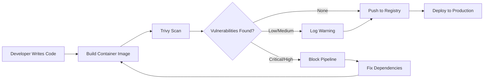

# How to Scan Container Images with Trivy

Author: [nawazdhandala](https://www.github.com/nawazdhandala)

Tags: Trivy, Security, Container, Vulnerability Scanning, DevSecOps

Description: Learn how to scan container images for vulnerabilities using Trivy, covering installation, basic scanning, CI/CD integration, and interpreting results.

---

> Container security starts before deployment. Trivy makes it easy to catch vulnerabilities in your images before they reach production.

Container images often contain outdated packages with known vulnerabilities. A single unpatched library can expose your entire infrastructure. Trivy is a fast, comprehensive vulnerability scanner that checks your images against multiple vulnerability databases.

---

## What Trivy Scans

| Target | Description | Example |
|--------|-------------|---------|
| **OS Packages** | Alpine, Debian, Ubuntu, RHEL packages | CVE in libssl |
| **Language Libraries** | npm, pip, gem, cargo dependencies | Vulnerable lodash version |
| **Infrastructure as Code** | Terraform, CloudFormation misconfigurations | Open S3 buckets |
| **Secrets** | Hardcoded credentials | API keys in Dockerfiles |
| **Licenses** | OSS license compliance | GPL violations |

---

## Installing Trivy

Trivy supports multiple installation methods. Pick the one that fits your environment.

### macOS with Homebrew

```bash
# Install Trivy using Homebrew
brew install trivy

# Verify installation
trivy --version
```

### Linux with apt

```bash
# Add Trivy repository to apt sources
sudo apt-get install wget apt-transport-https gnupg lsb-release
wget -qO - https://aquasecurity.github.io/trivy-repo/deb/public.key | sudo apt-key add -
echo deb https://aquasecurity.github.io/trivy-repo/deb $(lsb_release -sc) main | sudo tee -a /etc/apt/sources.list.d/trivy.list

# Update and install
sudo apt-get update
sudo apt-get install trivy
```

### Docker (No Installation Required)

```bash
# Run Trivy as a container - useful for CI/CD environments
docker run --rm -v /var/run/docker.sock:/var/run/docker.sock \
  aquasec/trivy:latest image nginx:latest
```

---

## Basic Image Scanning

The simplest way to scan an image is to pass its name to Trivy.

### Scanning a Public Image

```bash
# Scan the official nginx image for vulnerabilities
# Trivy downloads the vulnerability database on first run
trivy image nginx:latest
```

Output shows vulnerabilities grouped by severity:

```
nginx:latest (debian 12.4)
===========================
Total: 142 (UNKNOWN: 0, LOW: 89, MEDIUM: 42, HIGH: 9, CRITICAL: 2)

+-----------------+------------------+----------+-------------------+---------------+
|     LIBRARY     | VULNERABILITY ID | SEVERITY | INSTALLED VERSION | FIXED VERSION |
+-----------------+------------------+----------+-------------------+---------------+
| libssl3         | CVE-2024-0727    | CRITICAL | 3.0.11-1          | 3.0.13-1      |
| libcurl4        | CVE-2024-2398    | HIGH     | 7.88.1-10         | 7.88.1-10+deb |
+-----------------+------------------+----------+-------------------+---------------+
```

### Scanning a Local Image

```bash
# Build your image first
docker build -t myapp:latest .

# Scan the locally built image
trivy image myapp:latest
```

### Scanning from a Tar Archive

```bash
# Export image to tar file
docker save myapp:latest -o myapp.tar

# Scan the tar archive - useful when Docker daemon is not available
trivy image --input myapp.tar
```

---

## Filtering Scan Results

Real-world images often have hundreds of vulnerabilities. Filtering helps you focus on what matters.

### Filter by Severity

```bash
# Only show HIGH and CRITICAL vulnerabilities
# Ignores LOW and MEDIUM to reduce noise
trivy image --severity HIGH,CRITICAL nginx:latest
```

### Filter by Fix Availability

```bash
# Only show vulnerabilities that have fixes available
# Helps prioritize actionable items
trivy image --ignore-unfixed nginx:latest
```

### Combining Filters

```bash
# Show only fixable HIGH and CRITICAL vulnerabilities
# This is typically what you want in CI/CD pipelines
trivy image --severity HIGH,CRITICAL --ignore-unfixed nginx:latest
```

---

## Output Formats

Trivy supports multiple output formats for different use cases.

### JSON for Automation

```bash
# Output as JSON for programmatic processing
trivy image --format json --output results.json nginx:latest

# Parse with jq to extract specific fields
cat results.json | jq '.Results[].Vulnerabilities[] | select(.Severity == "CRITICAL")'
```

### SARIF for GitHub Security

```bash
# SARIF format integrates with GitHub Security tab
trivy image --format sarif --output results.sarif nginx:latest
```

### Table Format (Default)

```bash
# Human-readable table format - good for terminal output
trivy image --format table nginx:latest
```

### Template for Custom Output

```bash
# Create custom output using Go templates
# This example outputs a simple list of CVE IDs
trivy image --format template \
  --template "{{range .Results}}{{range .Vulnerabilities}}{{.VulnerabilityID}}\n{{end}}{{end}}" \
  nginx:latest
```

---

## Scanning Workflow

Here's how container scanning fits into a typical development workflow.



---

## CI/CD Integration

### GitHub Actions

This workflow scans your image on every push and blocks merges if critical vulnerabilities exist.

```yaml
# .github/workflows/security-scan.yml
name: Container Security Scan

on:
  push:
    branches: [main]
  pull_request:
    branches: [main]

jobs:
  trivy-scan:
    runs-on: ubuntu-latest
    steps:
      # Check out the repository code
      - name: Checkout code
        uses: actions/checkout@v4

      # Build the Docker image from Dockerfile
      - name: Build image
        run: docker build -t myapp:${{ github.sha }} .

      # Run Trivy scanner on the built image
      # exit-code: 1 causes the job to fail if vulnerabilities are found
      - name: Run Trivy vulnerability scanner
        uses: aquasecurity/trivy-action@master
        with:
          image-ref: myapp:${{ github.sha }}
          format: sarif
          output: trivy-results.sarif
          severity: CRITICAL,HIGH
          exit-code: 1

      # Upload results to GitHub Security tab
      # This runs even if the scan found vulnerabilities
      - name: Upload Trivy scan results
        uses: github/codeql-action/upload-sarif@v2
        if: always()
        with:
          sarif_file: trivy-results.sarif
```

### GitLab CI

```yaml
# .gitlab-ci.yml
stages:
  - build
  - scan
  - deploy

# Build the container image and store it for later stages
build:
  stage: build
  image: docker:latest
  services:
    - docker:dind
  script:
    - docker build -t $CI_REGISTRY_IMAGE:$CI_COMMIT_SHA .
    - docker save $CI_REGISTRY_IMAGE:$CI_COMMIT_SHA -o image.tar
  artifacts:
    paths:
      - image.tar

# Scan the built image for vulnerabilities
trivy-scan:
  stage: scan
  image:
    name: aquasec/trivy:latest
    entrypoint: [""]
  script:
    # Scan the saved tar file from the build stage
    - trivy image --input image.tar --severity HIGH,CRITICAL --exit-code 1
  dependencies:
    - build
  allow_failure: false
```

### Jenkins Pipeline

```groovy
// Jenkinsfile
pipeline {
    agent any

    stages {
        stage('Build') {
            steps {
                sh 'docker build -t myapp:${BUILD_NUMBER} .'
            }
        }

        stage('Security Scan') {
            steps {
                // Run Trivy scan and fail if HIGH or CRITICAL vulnerabilities found
                sh '''
                    trivy image \
                        --severity HIGH,CRITICAL \
                        --exit-code 1 \
                        --format json \
                        --output trivy-report.json \
                        myapp:${BUILD_NUMBER}
                '''
            }
            post {
                always {
                    // Archive the scan report for review
                    archiveArtifacts artifacts: 'trivy-report.json'
                }
            }
        }

        stage('Push') {
            when {
                // Only push if scan passed (previous stage did not fail)
                expression { currentBuild.result == null }
            }
            steps {
                sh 'docker push myapp:${BUILD_NUMBER}'
            }
        }
    }
}
```

---

## Ignoring False Positives

Some vulnerabilities don't apply to your use case. Trivy supports ignore files for these situations.

### Create Ignore File

```yaml
# .trivyignore.yaml
# Ignore specific CVEs with explanation
vulnerabilities:
  # This CVE only affects Windows, we run on Linux
  - id: CVE-2024-1234
    statement: Not applicable - Windows only vulnerability

  # Mitigated by network policy - service not exposed
  - id: CVE-2024-5678
    statement: Mitigated by network isolation
    expires: 2024-12-31  # Review this decision later
```

### Use the Ignore File

```bash
# Trivy automatically reads .trivyignore.yaml from current directory
trivy image --ignorefile .trivyignore.yaml myapp:latest

# Or specify a custom path
trivy image --ignorefile /path/to/ignore-rules.yaml myapp:latest
```

---

## Scanning Best Practices

### 1. Scan Base Images First

```bash
# Check your base image before building on top of it
trivy image python:3.12-slim

# If the base has critical vulnerabilities, consider alternatives
trivy image python:3.12-alpine
```

### 2. Scan in Multiple Stages

```bash
# During development - see all issues
trivy image --severity LOW,MEDIUM,HIGH,CRITICAL myapp:dev

# In CI/CD - block on critical issues only
trivy image --severity CRITICAL --exit-code 1 myapp:prod
```

### 3. Keep the Vulnerability Database Updated

```bash
# Update the database before scanning
trivy image --download-db-only

# Skip database update if recently updated (speeds up CI)
trivy image --skip-db-update myapp:latest
```

### 4. Use Caching in CI/CD

```yaml
# GitHub Actions example with caching
- name: Cache Trivy DB
  uses: actions/cache@v3
  with:
    path: ~/.cache/trivy
    key: trivy-db-${{ github.run_id }}
    restore-keys: trivy-db-
```

---

## Interpreting Results

Understanding Trivy output helps you prioritize fixes.

### Severity Levels

| Severity | CVSS Score | Action |
|----------|------------|--------|
| **CRITICAL** | 9.0 - 10.0 | Fix immediately |
| **HIGH** | 7.0 - 8.9 | Fix within days |
| **MEDIUM** | 4.0 - 6.9 | Plan for next release |
| **LOW** | 0.1 - 3.9 | Track but don't block |

### What to Fix First

1. **Critical with exploit available** - Active attacks in the wild
2. **Critical with fix available** - Easy to patch
3. **High in internet-facing services** - Exposed attack surface
4. **High with fix available** - Update dependencies

### Common Fixes

```dockerfile
# Fix: Update base image to latest patch version
FROM python:3.12.1-slim  # Not FROM python:3.12-slim

# Fix: Update specific packages
RUN apt-get update && apt-get upgrade -y libssl3

# Fix: Use multi-stage builds to reduce attack surface
FROM python:3.12-slim AS builder
COPY requirements.txt .
RUN pip install --target=/install -r requirements.txt

FROM python:3.12-slim
COPY --from=builder /install /usr/local/lib/python3.12/site-packages
```

---

## Scanning in Air-Gapped Environments

Some environments don't have internet access. Trivy can work offline.

```bash
# On a machine with internet access, download the database
trivy image --download-db-only
trivy image --download-java-db-only

# Copy the database to the air-gapped environment
# Default location: ~/.cache/trivy/

# On the air-gapped machine, skip database download
trivy image --skip-db-update --offline-scan myapp:latest
```

---

## Summary

Trivy gives you visibility into container vulnerabilities before they become production incidents. The key points:

- Install Trivy locally and in CI/CD pipelines
- Filter by severity to focus on critical issues
- Use exit codes to block vulnerable images from deploying
- Maintain ignore files for false positives
- Update vulnerability databases regularly
- Start with base image scanning

Regular scanning catches vulnerabilities early when they're cheapest to fix.

---

*Need visibility into your container security posture? [OneUptime](https://oneuptime.com) helps you monitor your infrastructure and get alerted when something goes wrong.*
