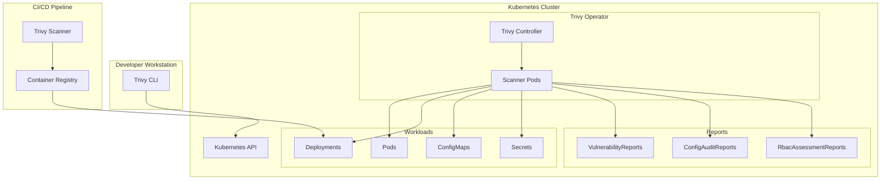
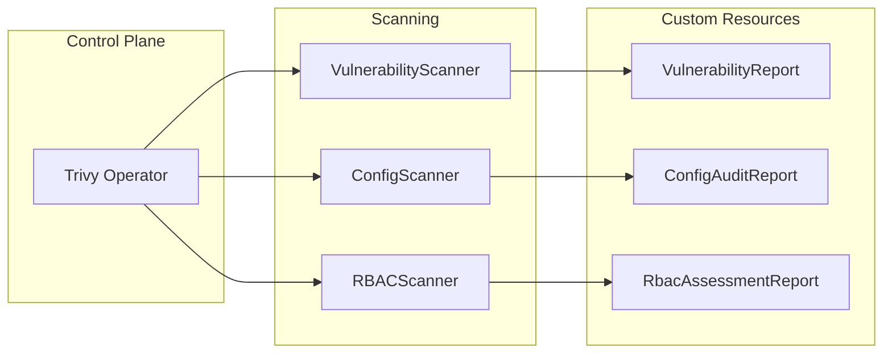
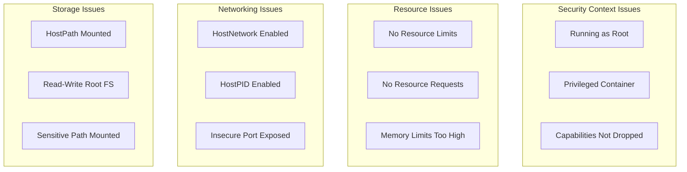
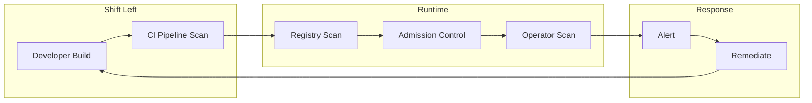

# How to Scan Kubernetes with Trivy

Author: [nawazdhandala](https://www.github.com/nawazdhandala)

Tags: Kubernetes, Trivy, Security, Container Security, Vulnerability Scanning, DevSecOps, Compliance

Description: A hands-on guide to scanning Kubernetes clusters with Trivy for vulnerabilities, misconfigurations, and compliance issues. Learn how to integrate Trivy into your security workflow and automate cluster-wide scanning.

---

> Security vulnerabilities in Kubernetes clusters can expose your entire infrastructure. Trivy provides comprehensive scanning capabilities for container images, configurations, and infrastructure as code. With Trivy, you can detect vulnerabilities before they reach production.

Kubernetes environments present unique security challenges. Container images may contain outdated packages with known CVEs. Workload configurations might expose sensitive data or grant excessive privileges. Trivy addresses these concerns by offering a unified scanning solution.

---

## What is Trivy?

Aqua Security developed Trivy as an open-source security scanner. Unlike traditional vulnerability scanners that focus on a single area, Trivy scans multiple targets:

| Target Type | What Trivy Scans |
|------------|------------------|
| Container Images | OS packages, application dependencies |
| Filesystems | Sensitive files, secrets, misconfigurations |
| Git Repositories | Infrastructure as code, secrets in history |
| Kubernetes | Cluster misconfigurations, RBAC issues |
| SBOM | Software Bill of Materials analysis |

---

## Trivy Scanning Architecture

The following diagram illustrates how Trivy integrates with your Kubernetes cluster:



---

## Installing Trivy

Multiple installation options exist for different operating systems and use cases.

### macOS Installation

Install Trivy using Homebrew on macOS:

```bash
# Install Trivy via Homebrew
brew install trivy

# Verify the installation
trivy version
```

### Linux Installation

Download and install the Trivy binary on Linux systems:

```bash
# Download the latest Trivy release
curl -sfL https://raw.githubusercontent.com/aquasecurity/trivy/main/contrib/install.sh | sh -s -- -b /usr/local/bin

# Verify installation
trivy version
```

### Running Trivy in a Container

Run Trivy as a Docker container without local installation:

```bash
# Pull the official Trivy image
docker pull aquasec/trivy:latest

# Run Trivy to scan an image
docker run --rm aquasec/trivy:latest image nginx:latest
```

---

## Scanning Container Images

Before deploying containers to Kubernetes, scan images for vulnerabilities.

### Basic Image Scanning

Scan a container image to identify known vulnerabilities in OS packages and application dependencies:

```bash
# Scan a specific image for vulnerabilities
trivy image nginx:1.25

# Scan with only HIGH and CRITICAL severity
trivy image --severity HIGH,CRITICAL nginx:1.25

# Output results in JSON format for automation
trivy image --format json --output results.json nginx:1.25
```

### Scanning Images in Private Registries

Configure authentication for scanning images from private registries:

```bash
# Set registry credentials via environment variables
export TRIVY_USERNAME=your-username
export TRIVY_PASSWORD=your-password

# Scan an image from a private registry
trivy image your-registry.example.com/app:v1.0.0

# Alternatively, use Docker config for authentication
trivy image --registry-token $(cat ~/.docker/config.json | jq -r '.auths["your-registry.example.com"].auth') \
    your-registry.example.com/app:v1.0.0
```

### Scanning with Custom Policies

Define custom policies to enforce organization-specific security requirements:

```bash
# Create a custom policy directory
mkdir -p policies/

# Scan using custom policies
trivy image --config-policy ./policies/ nginx:1.25
```

Here is an example custom policy written in Rego that denies images running as root:

```rego
# policies/deny_root.rego
# Deny containers that run as root user

package user.deny_root

import future.keywords.if

deny[msg] if {
    input.User == "root"
    msg := "Container should not run as root user"
}

deny[msg] if {
    input.User == "0"
    msg := "Container should not run as UID 0"
}
```

---

## Scanning Kubernetes Clusters

Trivy can scan your entire Kubernetes cluster for misconfigurations and security issues.

### Cluster-Wide Scanning

Scan all resources in a Kubernetes cluster using kubectl integration:

```bash
# Scan all resources in the current cluster
trivy k8s --report summary cluster

# Scan specific namespaces
trivy k8s --namespace production --report summary all

# Generate detailed report with all findings
trivy k8s --report all --format json --output cluster-scan.json cluster
```

### Scanning Specific Resources

Target specific resource types for focused security assessments:

```bash
# Scan all deployments in a namespace
trivy k8s --namespace default --report summary deployments

# Scan a specific deployment
trivy k8s --namespace default deployment/nginx

# Scan pods with vulnerabilities only
trivy k8s --namespace default --scanners vuln pods
```

### Understanding Scan Output

Trivy provides detailed output categorized by severity. Here is an example of scanning a deployment:

```bash
# Scan a deployment and see detailed findings
trivy k8s deployment/web-app --namespace production --report summary
```

Sample output structure:

```
Namespace: production
Resource: deployment/web-app

MISCONFIGURATIONS
=================
Tests: 28 (SUCCESSES: 20, FAILURES: 8, EXCEPTIONS: 0)
Failures: 8 (HIGH: 3, MEDIUM: 4, LOW: 1)

HIGH: Container should not run as root
  Container 'web' is configured to run as root

HIGH: Resource limits not set
  Container 'web' has no resource limits configured

MEDIUM: Readiness probe not configured
  Container 'web' lacks readiness probe
```

---

## Installing the Trivy Operator

The Trivy Operator provides continuous security scanning within your Kubernetes cluster.

### Operator Architecture



### Installing with Helm

Deploy the Trivy Operator using Helm:

```bash
# Add the Aqua Security Helm repository
helm repo add aqua https://aquasecurity.github.io/helm-charts/
helm repo update

# Create namespace for the operator
kubectl create namespace trivy-system

# Install the Trivy Operator with default configuration
helm install trivy-operator aqua/trivy-operator \
    --namespace trivy-system \
    --set trivy.ignoreUnfixed=true

# Verify the installation
kubectl get pods -n trivy-system
```

### Customizing Operator Configuration

Configure the operator to match your security requirements:

```yaml
# trivy-operator-values.yaml
# Custom Helm values for Trivy Operator installation

trivy:
  # Only report vulnerabilities with available fixes
  ignoreUnfixed: true

  # Set severity threshold for reporting
  severity: HIGH,CRITICAL

  # Configure resource limits for scanner pods
  resources:
    requests:
      cpu: 100m
      memory: 128Mi
    limits:
      cpu: 500m
      memory: 512Mi

# Configure scanning schedule (cron format)
operator:
  # Rescan interval for vulnerability reports
  vulnerabilityScannerScanOnlyCurrentRevisions: true

  # Number of concurrent scans
  concurrentScanJobsLimit: 5

  # Scan timeout in seconds
  scanJobTimeout: 300

# Enable specific scanners
scanners:
  vulnerability:
    enabled: true
  misconfiguration:
    enabled: true
  rbac:
    enabled: true
  secret:
    enabled: true
```

Install with custom values:

```bash
# Install with custom configuration
helm install trivy-operator aqua/trivy-operator \
    --namespace trivy-system \
    --values trivy-operator-values.yaml
```

---

## Working with Vulnerability Reports

The Trivy Operator generates VulnerabilityReport resources for each scanned workload.

### Viewing Vulnerability Reports

Query vulnerability reports using kubectl:

```bash
# List all vulnerability reports in a namespace
kubectl get vulnerabilityreports -n default

# View detailed report for a specific workload
kubectl get vulnerabilityreport -n default \
    -l trivy-operator.resource.name=nginx \
    -o yaml

# Get summary of vulnerabilities across the cluster
kubectl get vulnerabilityreports -A -o json | \
    jq '.items[] | {namespace: .metadata.namespace, name: .metadata.name, critical: .report.summary.criticalCount, high: .report.summary.highCount}'
```

### Report Structure

VulnerabilityReports contain detailed information about each finding:

```yaml
# Example VulnerabilityReport structure
apiVersion: aquasecurity.github.io/v1alpha1
kind: VulnerabilityReport
metadata:
  name: replicaset-nginx-6d4cf56db6-nginx
  namespace: default
  labels:
    trivy-operator.resource.kind: ReplicaSet
    trivy-operator.resource.name: nginx-6d4cf56db6
    trivy-operator.container.name: nginx
spec:
  # Scanner metadata
  scanner:
    name: Trivy
    version: 0.48.0
report:
  # Summary counts by severity
  summary:
    criticalCount: 2
    highCount: 5
    mediumCount: 12
    lowCount: 8
    unknownCount: 0
  # Detailed vulnerability list
  vulnerabilities:
    - vulnerabilityID: CVE-2023-12345
      resource: libssl3
      installedVersion: 3.0.8
      fixedVersion: 3.0.9
      severity: CRITICAL
      title: "Buffer overflow in SSL handling"
      primaryLink: "https://nvd.nist.gov/vuln/detail/CVE-2023-12345"
```

---

## Configuration Audit Reports

Trivy Operator scans workload configurations against security best practices.

### Viewing Configuration Audits

Access configuration audit findings:

```bash
# List all config audit reports
kubectl get configauditreports -n default

# View detailed configuration issues
kubectl get configauditreport -n default \
    -l trivy-operator.resource.name=nginx \
    -o yaml

# Count misconfigurations by severity
kubectl get configauditreports -A -o json | \
    jq '[.items[].report.summary] | {critical: map(.criticalCount) | add, high: map(.highCount) | add}'
```

### Common Misconfigurations

The Trivy Operator detects various configuration issues:



### Example ConfigAuditReport

```yaml
# Example ConfigAuditReport structure
apiVersion: aquasecurity.github.io/v1alpha1
kind: ConfigAuditReport
metadata:
  name: replicaset-nginx-6d4cf56db6
  namespace: default
spec:
  scanner:
    name: Trivy
    version: 0.48.0
report:
  summary:
    criticalCount: 1
    highCount: 2
    mediumCount: 3
    lowCount: 2
  checks:
    - checkID: KSV001
      title: "Process can elevate its own privileges"
      severity: HIGH
      category: "Kubernetes Security Check"
      description: "Container can escalate privileges"
      success: false
      messages:
        - "Container 'nginx' allows privilege escalation"
    - checkID: KSV003
      title: "Default capabilities not dropped"
      severity: MEDIUM
      category: "Kubernetes Security Check"
      success: false
```

---

## RBAC Assessment Reports

Scan Role-Based Access Control configurations for security issues.

### Viewing RBAC Reports

Query RBAC assessment findings:

```bash
# List RBAC assessment reports
kubectl get rbacassessmentreports -n default

# View cluster-wide RBAC issues
kubectl get clusterrbacassessmentreports

# Get details of a specific role assessment
kubectl get rbacassessmentreport -n default \
    role-developer -o yaml
```

### RBAC Security Checks

The operator evaluates RBAC configurations against these criteria:

```yaml
# Example RbacAssessmentReport
apiVersion: aquasecurity.github.io/v1alpha1
kind: RbacAssessmentReport
metadata:
  name: role-developer
  namespace: default
report:
  summary:
    criticalCount: 0
    highCount: 1
    mediumCount: 2
  checks:
    - checkID: KSV041
      title: "Role permits wildcard verb"
      severity: HIGH
      success: false
      messages:
        - "Role permits '*' verb on secrets"
    - checkID: KSV044
      title: "Role permits access to secrets"
      severity: MEDIUM
      success: false
```

---

## Integrating Trivy in CI/CD

Shift security left by scanning images before deployment.

### GitHub Actions Integration

Add Trivy scanning to your GitHub Actions workflow:

```yaml
# .github/workflows/security-scan.yaml
name: Security Scan

on:
  push:
    branches: [main]
  pull_request:
    branches: [main]

jobs:
  trivy-scan:
    runs-on: ubuntu-latest
    steps:
      - name: Checkout code
        uses: actions/checkout@v4

      # Build the container image
      - name: Build Docker image
        run: docker build -t myapp:${{ github.sha }} .

      # Scan the built image for vulnerabilities
      - name: Run Trivy vulnerability scanner
        uses: aquasecurity/trivy-action@master
        with:
          image-ref: 'myapp:${{ github.sha }}'
          format: 'sarif'
          output: 'trivy-results.sarif'
          severity: 'HIGH,CRITICAL'
          exit-code: '1'

      # Upload results to GitHub Security tab
      - name: Upload Trivy scan results to GitHub Security tab
        uses: github/codeql-action/upload-sarif@v3
        if: always()
        with:
          sarif_file: 'trivy-results.sarif'

      # Scan Kubernetes manifests for misconfigurations
      - name: Scan Kubernetes manifests
        uses: aquasecurity/trivy-action@master
        with:
          scan-type: 'config'
          scan-ref: './k8s/'
          format: 'table'
          exit-code: '1'
          severity: 'HIGH,CRITICAL'
```

### GitLab CI Integration

Configure Trivy in GitLab CI pipelines:

```yaml
# .gitlab-ci.yml
stages:
  - build
  - security
  - deploy

variables:
  TRIVY_NO_PROGRESS: "true"
  TRIVY_CACHE_DIR: ".trivy-cache"

# Build stage creates the container image
build:
  stage: build
  script:
    - docker build -t $CI_REGISTRY_IMAGE:$CI_COMMIT_SHA .
    - docker push $CI_REGISTRY_IMAGE:$CI_COMMIT_SHA

# Security stage scans for vulnerabilities
trivy-scan:
  stage: security
  image:
    name: aquasec/trivy:latest
    entrypoint: [""]
  cache:
    paths:
      - .trivy-cache/
  script:
    # Scan container image
    - trivy image --exit-code 1 --severity HIGH,CRITICAL $CI_REGISTRY_IMAGE:$CI_COMMIT_SHA
    # Scan IaC files
    - trivy config --exit-code 1 --severity HIGH,CRITICAL ./k8s/
  allow_failure: false
  artifacts:
    reports:
      container_scanning: gl-container-scanning-report.json
```

---

## Automating Remediation

Create automated workflows to respond to security findings.

### Alerting on Critical Vulnerabilities

Configure alerts when critical vulnerabilities are detected using a Kubernetes controller:

```yaml
# alert-controller.yaml
# ConfigMap containing the alerting script
apiVersion: v1
kind: ConfigMap
metadata:
  name: vuln-alert-script
  namespace: trivy-system
data:
  alert.sh: |
    #!/bin/bash
    # Script to check vulnerability reports and send alerts

    # Get critical vulnerabilities
    CRITICAL=$(kubectl get vulnerabilityreports -A -o json | \
      jq '[.items[].report.summary.criticalCount] | add')

    if [ "$CRITICAL" -gt 0 ]; then
      # Send alert via webhook
      curl -X POST "$WEBHOOK_URL" \
        -H "Content-Type: application/json" \
        -d "{\"text\": \"Critical vulnerabilities detected: $CRITICAL\"}"
    fi
---
# CronJob to run periodic vulnerability checks
apiVersion: batch/v1
kind: CronJob
metadata:
  name: vuln-alert
  namespace: trivy-system
spec:
  # Run every hour
  schedule: "0 * * * *"
  jobTemplate:
    spec:
      template:
        spec:
          serviceAccountName: trivy-alert-sa
          containers:
            - name: alerter
              image: bitnami/kubectl:latest
              command: ["/bin/bash", "/scripts/alert.sh"]
              env:
                - name: WEBHOOK_URL
                  valueFrom:
                    secretKeyRef:
                      name: alert-webhook
                      key: url
              volumeMounts:
                - name: scripts
                  mountPath: /scripts
          volumes:
            - name: scripts
              configMap:
                name: vuln-alert-script
                defaultMode: 0755
          restartPolicy: OnFailure
```

### Creating a Prometheus Exporter

Export Trivy findings to Prometheus for monitoring dashboards:

```yaml
# prometheus-exporter.yaml
# Deployment for the Trivy metrics exporter
apiVersion: apps/v1
kind: Deployment
metadata:
  name: trivy-exporter
  namespace: trivy-system
spec:
  replicas: 1
  selector:
    matchLabels:
      app: trivy-exporter
  template:
    metadata:
      labels:
        app: trivy-exporter
      annotations:
        prometheus.io/scrape: "true"
        prometheus.io/port: "8080"
    spec:
      serviceAccountName: trivy-exporter
      containers:
        - name: exporter
          image: aquasecurity/trivy-operator:latest
          args:
            - --metrics-bind-address=:8080
          ports:
            - containerPort: 8080
              name: metrics
          resources:
            limits:
              cpu: 100m
              memory: 128Mi
---
# ServiceMonitor for Prometheus Operator
apiVersion: monitoring.coreos.com/v1
kind: ServiceMonitor
metadata:
  name: trivy-operator
  namespace: trivy-system
spec:
  selector:
    matchLabels:
      app: trivy-operator
  endpoints:
    - port: metrics
      interval: 30s
```

---

## Best Practices

### Scanning Strategy

Follow these practices for effective vulnerability management:



### Configuration Recommendations

Apply these settings for production environments:

```yaml
# production-values.yaml
# Production-ready Trivy Operator configuration

trivy:
  # Ignore unfixed vulnerabilities in reporting
  ignoreUnfixed: true

  # Focus on actionable findings
  severity: HIGH,CRITICAL

  # Offline mode for air-gapped environments
  # offlineScan: true

  # Custom database mirror if needed
  # dbRepository: your-registry.example.com/trivy-db

operator:
  # Limit concurrent scans to avoid resource contention
  concurrentScanJobsLimit: 3

  # Set reasonable timeout
  scanJobTimeout: 600

  # Batch scan updates
  batchIdleTimeout: 30s
  batchDeleteDelay: 10s

# Enable all relevant scanners
scanners:
  vulnerability:
    enabled: true
  misconfiguration:
    enabled: true
  rbac:
    enabled: true
  secret:
    enabled: true
  exposedSecret:
    enabled: true

# Configure resource usage
resources:
  requests:
    cpu: 200m
    memory: 256Mi
  limits:
    cpu: 1000m
    memory: 1Gi

# Set appropriate security context
securityContext:
  runAsNonRoot: true
  runAsUser: 10001
```

### Exclusions and Exceptions

Create policies for acceptable risks:

```yaml
# trivy-ignore.yaml
# ConfigMap for Trivy ignore patterns
apiVersion: v1
kind: ConfigMap
metadata:
  name: trivy-ignore
  namespace: trivy-system
data:
  trivyignore: |
    # Ignore specific CVEs that have been reviewed
    CVE-2023-12345
    CVE-2023-67890

    # Ignore findings in test namespaces
    # (Use namespace selectors in operator config instead)
```

---

## Troubleshooting

### Common Issues

Address frequent problems with Trivy scanning:

**Scanner pods failing to start:**

```bash
# Check scanner pod logs
kubectl logs -n trivy-system -l app.kubernetes.io/name=trivy-operator

# Verify RBAC permissions
kubectl auth can-i list pods --as=system:serviceaccount:trivy-system:trivy-operator -n default

# Check resource quotas
kubectl describe resourcequota -n trivy-system
```

**Database download failures:**

```bash
# Check network connectivity
kubectl run test-net --rm -it --image=busybox -- wget -O- https://ghcr.io

# Use a database mirror if needed
helm upgrade trivy-operator aqua/trivy-operator \
    --namespace trivy-system \
    --set trivy.dbRepository=your-mirror.example.com/trivy-db
```

**Slow scanning performance:**

```bash
# Increase scanner resources
helm upgrade trivy-operator aqua/trivy-operator \
    --namespace trivy-system \
    --set trivy.resources.limits.memory=1Gi \
    --set trivy.resources.limits.cpu=1000m

# Reduce concurrent scans
helm upgrade trivy-operator aqua/trivy-operator \
    --namespace trivy-system \
    --set operator.concurrentScanJobsLimit=2
```

---

## Compliance Reporting

Generate compliance reports for security audits.

### Built-in Compliance Checks

Run compliance scans against industry standards:

```bash
# Scan against NSA/CISA Kubernetes Hardening Guide
trivy k8s --compliance k8s-nsa --report summary cluster

# Scan against CIS Kubernetes Benchmark
trivy k8s --compliance k8s-cis --report summary cluster

# Scan against Pod Security Standards
trivy k8s --compliance k8s-pss-baseline --report summary cluster

# Generate detailed compliance report
trivy k8s --compliance k8s-cis --report all \
    --format json --output cis-report.json cluster
```

### Compliance Report Output

```bash
# Sample compliance check output
$ trivy k8s --compliance k8s-nsa --report summary cluster

Summary Report for compliance: k8s-nsa
======================================

Control: 1.1 Pod Security Standards
  PASS: 45
  FAIL: 12

Control: 1.2 Network Policies
  PASS: 8
  FAIL: 23

Control: 2.1 Audit Logging
  PASS: 5
  FAIL: 2
```

---

## Conclusion

Trivy provides comprehensive security scanning for Kubernetes environments. By integrating Trivy into your workflow, you can:

- **Detect vulnerabilities** in container images before deployment
- **Identify misconfigurations** in workload definitions
- **Audit RBAC** settings for excessive permissions
- **Generate compliance reports** for security audits
- **Automate scanning** with the Trivy Operator

Start with image scanning in your CI/CD pipeline, then deploy the operator for continuous cluster monitoring. Regular scanning helps maintain a strong security posture as your Kubernetes environment evolves.

---

*Want comprehensive monitoring for your Kubernetes clusters? [OneUptime](https://oneuptime.com) provides unified observability with metrics, logs, traces, and alerting to keep your infrastructure secure and reliable.*

**Related Reading:**
- [How to Monitor K3s Clusters](https://oneuptime.com/blog/post/2026-02-02-k3s-monitoring/view)
- [How to Configure Kubernetes Multi-Tenancy](https://oneuptime.com/blog/post/2026-02-02-kubernetes-multi-tenancy/view)
