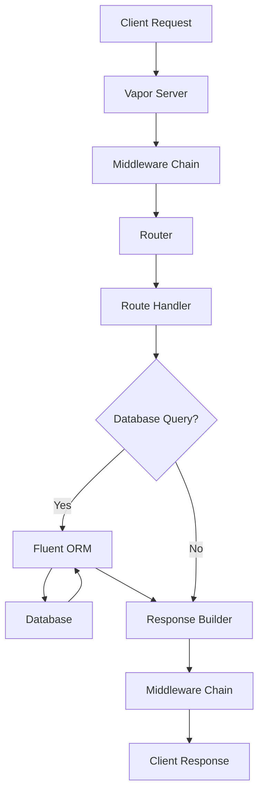
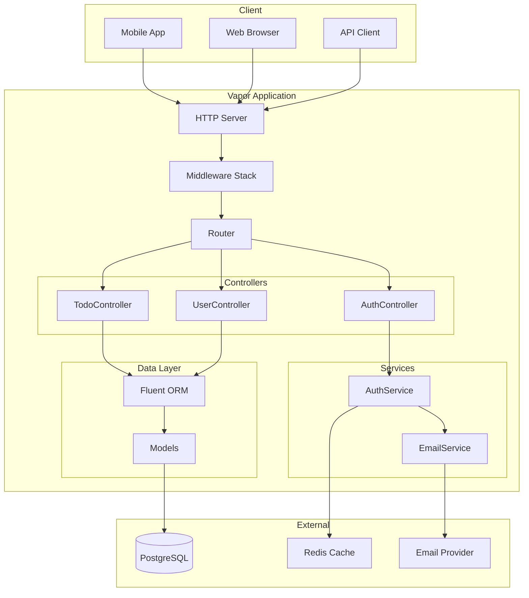
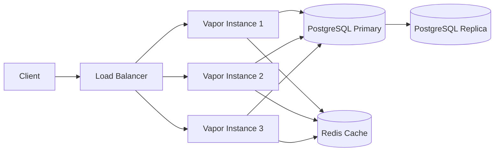

# How to Build Server-Side Swift with Vapor

Author: [nawazdhandala](https://www.github.com/nawazdhandala)

Tags: Swift, Vapor, Server-Side, Backend, API, Web Development

Description: A comprehensive guide to building server-side applications with Swift and Vapor. Learn how to create REST APIs, handle databases, implement authentication, and deploy production-ready Swift backends.

---

> Swift is not just for iOS and macOS development anymore. With Vapor, you can leverage your Swift expertise to build high-performance, type-safe server-side applications. This guide walks you through everything you need to know to get started with server-side Swift.

Server-side Swift has matured significantly over the years. Vapor, the most popular Swift web framework, provides a complete toolkit for building web applications, REST APIs, and microservices. It combines Swift's safety features with excellent performance, making it an attractive choice for backend development.

---

## Why Choose Vapor for Backend Development?

| Feature | Benefit |
|---------|---------|
| **Type Safety** | Compile-time error checking prevents runtime crashes |
| **Performance** | Native compilation provides excellent throughput |
| **Async/Await** | Modern concurrency model built into Swift |
| **Codable** | Seamless JSON encoding and decoding |
| **Cross-Platform** | Runs on Linux and macOS |
| **Familiar Syntax** | iOS/macOS developers can reuse their skills |

---

## Request Lifecycle in Vapor

The following diagram illustrates how a request flows through a Vapor application:



---

## Setting Up Your Development Environment

Before writing any code, you need to install Swift and the Vapor toolbox on your system.

### Installing Swift on macOS

Swift comes pre-installed with Xcode. You can verify your installation by running:

```bash
# Check Swift version - Vapor 4 requires Swift 5.6 or later
swift --version

# Output should show something like:
# swift-driver version: 1.75.2 Apple Swift version 5.9
```

### Installing Swift on Linux

For Ubuntu or Debian-based systems, you can install Swift using the official toolchain:

```bash
# Download and install Swift on Ubuntu
wget https://download.swift.org/swift-5.9.2-release/ubuntu2204/swift-5.9.2-RELEASE/swift-5.9.2-RELEASE-ubuntu22.04.tar.gz
tar xzf swift-5.9.2-RELEASE-ubuntu22.04.tar.gz
sudo mv swift-5.9.2-RELEASE-ubuntu22.04 /usr/local/swift
echo 'export PATH=/usr/local/swift/usr/bin:$PATH' >> ~/.bashrc
source ~/.bashrc
```

### Installing Vapor Toolbox

The Vapor toolbox provides convenient commands for creating and managing projects:

```bash
# Install Vapor toolbox using Homebrew on macOS
brew install vapor

# Or install from source on Linux
git clone https://github.com/vapor/toolbox.git
cd toolbox
swift build -c release
sudo mv .build/release/vapor /usr/local/bin
```

---

## Creating Your First Vapor Project

With the toolbox installed, creating a new project takes just one command:

```bash
# Create a new Vapor project with Fluent ORM and PostgreSQL
vapor new HelloVapor --fluent --db postgres

# Navigate into the project directory
cd HelloVapor
```

### Project Structure

A fresh Vapor project has this structure:

```
HelloVapor/
├── Package.swift           # Swift Package Manager manifest
├── Sources/
│   └── App/
│       ├── Controllers/    # Route handlers organized by feature
│       ├── Migrations/     # Database schema migrations
│       ├── Models/         # Data models and entities
│       ├── configure.swift # Application configuration
│       ├── entrypoint.swift # Application entry point
│       └── routes.swift    # Route definitions
├── Tests/
│   └── AppTests/           # Unit and integration tests
└── Resources/
    └── Views/              # Leaf templates (if using)
```

---

## Understanding the Package.swift File

The Package.swift file defines your project's dependencies and targets:

```swift
// Package.swift
// This file defines all dependencies and build targets for your Vapor application
// swift-tools-version:5.9
import PackageDescription

let package = Package(
    // The name of your package - used for the executable
    name: "HelloVapor",

    // Supported platforms - Vapor requires macOS 12+ or Linux
    platforms: [
       .macOS(.v12)
    ],

    // External dependencies from Swift Package Manager
    dependencies: [
        // Vapor web framework - the core of your application
        .package(url: "https://github.com/vapor/vapor.git", from: "4.89.0"),

        // Fluent ORM - provides database abstraction
        .package(url: "https://github.com/vapor/fluent.git", from: "4.8.0"),

        // PostgreSQL driver for Fluent
        .package(url: "https://github.com/vapor/fluent-postgres-driver.git", from: "2.7.0"),
    ],

    // Build targets
    targets: [
        // Main application target
        .executableTarget(
            name: "App",
            dependencies: [
                .product(name: "Vapor", package: "vapor"),
                .product(name: "Fluent", package: "fluent"),
                .product(name: "FluentPostgresDriver", package: "fluent-postgres-driver"),
            ]
        ),

        // Test target for unit and integration tests
        .testTarget(name: "AppTests", dependencies: [
            .target(name: "App"),
            .product(name: "XCTVapor", package: "vapor"),
        ])
    ]
)
```

---

## Building Your First Route

Routes define how your application responds to HTTP requests. Let's start with a simple example:

```swift
// Sources/App/routes.swift
// This file defines all the routes for your application
import Vapor

func routes(_ app: Application) throws {
    // Simple GET route that returns plain text
    // Accessible at: GET /
    app.get { req in
        return "Hello, Vapor!"
    }

    // Route with a path parameter
    // Accessible at: GET /hello/:name (e.g., /hello/World)
    app.get("hello", ":name") { req -> String in
        // Extract the name parameter from the URL
        guard let name = req.parameters.get("name") else {
            throw Abort(.badRequest, reason: "Missing name parameter")
        }
        return "Hello, \(name)!"
    }

    // POST route that accepts JSON data
    // Accessible at: POST /greet
    app.post("greet") { req -> String in
        // Decode the request body as a Greeting struct
        let greeting = try req.content.decode(Greeting.self)
        return "Hello, \(greeting.name)! You are \(greeting.age) years old."
    }
}

// Define a Codable struct for request body parsing
// Codable provides automatic JSON encoding/decoding
struct Greeting: Content {
    let name: String
    let age: Int
}
```

---

## Creating RESTful Controllers

For larger applications, organize your routes into controllers. Here is a complete CRUD controller:

```swift
// Sources/App/Controllers/TodoController.swift
// Controller for managing Todo items with full CRUD operations
import Vapor
import Fluent

struct TodoController: RouteCollection {
    // Register all routes for this controller
    // Called automatically when you register the controller with the app
    func boot(routes: RoutesBuilder) throws {
        // Create a route group with the "todos" prefix
        let todos = routes.grouped("todos")

        // GET /todos - List all todos
        todos.get(use: index)

        // POST /todos - Create a new todo
        todos.post(use: create)

        // GET /todos/:todoID - Get a specific todo
        todos.get(":todoID", use: show)

        // PUT /todos/:todoID - Update a todo
        todos.put(":todoID", use: update)

        // DELETE /todos/:todoID - Delete a todo
        todos.delete(":todoID", use: delete)
    }

    // Handler for GET /todos
    // Returns all todos as a JSON array
    func index(req: Request) async throws -> [TodoDTO] {
        // Fetch all todos from the database
        let todos = try await Todo.query(on: req.db).all()

        // Convert to DTOs (Data Transfer Objects) for the response
        return todos.map { $0.toDTO() }
    }

    // Handler for POST /todos
    // Creates a new todo from the request body
    func create(req: Request) async throws -> TodoDTO {
        // Validate the request body
        try CreateTodoRequest.validate(content: req)

        // Decode the request body
        let createRequest = try req.content.decode(CreateTodoRequest.self)

        // Create a new Todo model
        let todo = Todo(title: createRequest.title, isCompleted: false)

        // Save to the database
        try await todo.save(on: req.db)

        // Return the created todo as a DTO
        return todo.toDTO()
    }

    // Handler for GET /todos/:todoID
    // Returns a single todo by ID
    func show(req: Request) async throws -> TodoDTO {
        // Find the todo by ID or throw a 404 error
        guard let todo = try await Todo.find(req.parameters.get("todoID"), on: req.db) else {
            throw Abort(.notFound, reason: "Todo not found")
        }

        return todo.toDTO()
    }

    // Handler for PUT /todos/:todoID
    // Updates an existing todo
    func update(req: Request) async throws -> TodoDTO {
        // Find the existing todo
        guard let todo = try await Todo.find(req.parameters.get("todoID"), on: req.db) else {
            throw Abort(.notFound, reason: "Todo not found")
        }

        // Decode the update request
        let updateRequest = try req.content.decode(UpdateTodoRequest.self)

        // Update fields if provided
        if let title = updateRequest.title {
            todo.title = title
        }
        if let isCompleted = updateRequest.isCompleted {
            todo.isCompleted = isCompleted
        }

        // Save changes to the database
        try await todo.save(on: req.db)

        return todo.toDTO()
    }

    // Handler for DELETE /todos/:todoID
    // Deletes a todo by ID
    func delete(req: Request) async throws -> HTTPStatus {
        guard let todo = try await Todo.find(req.parameters.get("todoID"), on: req.db) else {
            throw Abort(.notFound, reason: "Todo not found")
        }

        try await todo.delete(on: req.db)

        // Return 204 No Content on successful deletion
        return .noContent
    }
}

// Request DTOs with validation
struct CreateTodoRequest: Content, Validatable {
    let title: String

    // Define validation rules for the request
    static func validations(_ validations: inout Validations) {
        validations.add("title", as: String.self, is: !.empty)
        validations.add("title", as: String.self, is: .count(1...255))
    }
}

struct UpdateTodoRequest: Content {
    let title: String?
    let isCompleted: Bool?
}
```

---

## Working with Fluent ORM

Fluent is Vapor's ORM (Object-Relational Mapping) that provides type-safe database operations.

### Defining Models

Models represent database tables. Here is a complete Todo model:

```swift
// Sources/App/Models/Todo.swift
// Database model for Todo items
import Vapor
import Fluent

// The Model protocol makes this class persistable to the database
// The Content protocol allows it to be encoded/decoded as JSON
final class Todo: Model, Content {
    // Define the database table name
    static let schema = "todos"

    // Primary key - UUID provides unique identifiers
    // @ID property wrapper marks this as the primary key
    @ID(key: .id)
    var id: UUID?

    // Required field - the todo title
    // @Field property wrapper maps to a database column
    @Field(key: "title")
    var title: String

    // Boolean field with a default value
    @Field(key: "is_completed")
    var isCompleted: Bool

    // Timestamp for when the record was created
    // @Timestamp automatically manages this field
    @Timestamp(key: "created_at", on: .create)
    var createdAt: Date?

    // Timestamp for when the record was last updated
    @Timestamp(key: "updated_at", on: .update)
    var updatedAt: Date?

    // Optional relationship - a todo belongs to a user
    // @OptionalParent creates a foreign key relationship
    @OptionalParent(key: "user_id")
    var user: User?

    // Empty initializer required by Fluent
    init() {}

    // Convenience initializer for creating new todos
    init(id: UUID? = nil, title: String, isCompleted: Bool = false, userID: UUID? = nil) {
        self.id = id
        self.title = title
        self.isCompleted = isCompleted
        self.$user.id = userID
    }

    // Convert to a Data Transfer Object for API responses
    func toDTO() -> TodoDTO {
        TodoDTO(
            id: self.id,
            title: self.title,
            isCompleted: self.isCompleted,
            createdAt: self.createdAt,
            updatedAt: self.updatedAt
        )
    }
}

// DTO for API responses - separates internal model from external representation
struct TodoDTO: Content {
    let id: UUID?
    let title: String
    let isCompleted: Bool
    let createdAt: Date?
    let updatedAt: Date?
}
```

### Creating Database Migrations

Migrations define how your database schema evolves over time:

```swift
// Sources/App/Migrations/CreateTodo.swift
// Migration to create the todos table
import Fluent

struct CreateTodo: AsyncMigration {
    // Called when the migration runs
    // Defines the table structure
    func prepare(on database: Database) async throws {
        try await database.schema("todos")
            // Primary key column
            .id()
            // String column for the title - required, max 255 chars
            .field("title", .string, .required)
            // Boolean column with a default value
            .field("is_completed", .bool, .required, .custom("DEFAULT FALSE"))
            // Timestamp columns
            .field("created_at", .datetime)
            .field("updated_at", .datetime)
            // Foreign key to users table (optional)
            .field("user_id", .uuid, .references("users", "id", onDelete: .setNull))
            // Create the table
            .create()
    }

    // Called when the migration is reverted
    // Removes the table
    func revert(on database: Database) async throws {
        try await database.schema("todos").delete()
    }
}
```

### Querying the Database

Fluent provides a fluent query builder for database operations:

```swift
// Sources/App/Controllers/TodoQueryExamples.swift
// Examples of various Fluent queries
import Vapor
import Fluent

struct TodoQueryExamples {
    // Example: Find all completed todos
    func getCompletedTodos(req: Request) async throws -> [Todo] {
        return try await Todo.query(on: req.db)
            .filter(\.$isCompleted == true)
            .all()
    }

    // Example: Search todos by title
    func searchTodos(req: Request) async throws -> [Todo] {
        // Get search query from URL parameters
        guard let searchTerm = req.query[String.self, at: "q"] else {
            throw Abort(.badRequest, reason: "Missing search query")
        }

        return try await Todo.query(on: req.db)
            // Case-insensitive contains search
            .filter(\.$title, .custom("ILIKE"), "%\(searchTerm)%")
            .all()
    }

    // Example: Paginated results
    func getPaginatedTodos(req: Request) async throws -> Page<Todo> {
        return try await Todo.query(on: req.db)
            // Sort by creation date, newest first
            .sort(\.$createdAt, .descending)
            // Paginate with default page size of 10
            .paginate(for: req)
    }

    // Example: Aggregate query - count todos by completion status
    func getTodoStats(req: Request) async throws -> TodoStats {
        let total = try await Todo.query(on: req.db).count()
        let completed = try await Todo.query(on: req.db)
            .filter(\.$isCompleted == true)
            .count()

        return TodoStats(total: total, completed: completed, pending: total - completed)
    }

    // Example: Join query - get todos with user info
    func getTodosWithUsers(req: Request) async throws -> [Todo] {
        return try await Todo.query(on: req.db)
            // Eager load the user relationship
            .with(\.$user)
            .all()
    }

    // Example: Transaction - update multiple records atomically
    func markAllComplete(req: Request) async throws -> HTTPStatus {
        try await req.db.transaction { database in
            // Get all incomplete todos
            let todos = try await Todo.query(on: database)
                .filter(\.$isCompleted == false)
                .all()

            // Update each one
            for todo in todos {
                todo.isCompleted = true
                try await todo.save(on: database)
            }
        }

        return .ok
    }
}

struct TodoStats: Content {
    let total: Int
    let completed: Int
    let pending: Int
}
```

---

## Implementing Authentication

Secure your API with JWT (JSON Web Token) authentication:

```swift
// Sources/App/Models/User.swift
// User model with password hashing
import Vapor
import Fluent

final class User: Model, Content {
    static let schema = "users"

    @ID(key: .id)
    var id: UUID?

    @Field(key: "email")
    var email: String

    // Store the hashed password, never the plain text
    @Field(key: "password_hash")
    var passwordHash: String

    @Timestamp(key: "created_at", on: .create)
    var createdAt: Date?

    // One-to-many relationship with todos
    @Children(for: \.$user)
    var todos: [Todo]

    init() {}

    init(id: UUID? = nil, email: String, passwordHash: String) {
        self.id = id
        self.email = email
        self.passwordHash = passwordHash
    }
}

// Make User authenticatable with username/password
extension User: ModelAuthenticatable {
    // The field used as the username
    static let usernameKey = \User.$email
    // The field containing the password hash
    static let passwordHashKey = \User.$passwordHash

    // Verify the password against the stored hash
    func verify(password: String) throws -> Bool {
        try Bcrypt.verify(password, created: self.passwordHash)
    }
}

// Extension for generating JWTs
extension User {
    func generateToken() throws -> String {
        // Create a payload with user info and expiration
        let payload = UserPayload(
            subject: .init(value: self.id!.uuidString),
            expiration: .init(value: Date().addingTimeInterval(3600 * 24)) // 24 hours
        )

        // Sign and return the token
        return try JWTSigner.hs256(key: "your-secret-key").sign(payload)
    }
}
```

### JWT Payload and Middleware

```swift
// Sources/App/Auth/UserPayload.swift
// JWT payload structure for user authentication
import Vapor
import JWT

struct UserPayload: JWTPayload {
    // Standard JWT claims
    var subject: SubjectClaim
    var expiration: ExpirationClaim

    // Verify the token is valid
    func verify(using signer: JWTSigner) throws {
        // Check if the token has expired
        try self.expiration.verifyNotExpired()
    }
}

// Sources/App/Auth/JWTAuthenticator.swift
// Middleware to authenticate requests using JWT
import Vapor
import JWT

struct JWTAuthenticator: AsyncBearerAuthenticator {
    func authenticate(bearer: BearerAuthorization, for request: Request) async throws {
        // Verify and decode the JWT
        let payload = try request.jwt.verify(as: UserPayload.self)

        // Extract the user ID from the token
        guard let userID = UUID(payload.subject.value) else {
            return
        }

        // Find the user in the database
        guard let user = try await User.find(userID, on: request.db) else {
            return
        }

        // Login the user for this request
        request.auth.login(user)
    }
}
```

### Authentication Controller

```swift
// Sources/App/Controllers/AuthController.swift
// Handles user registration and login
import Vapor
import Fluent

struct AuthController: RouteCollection {
    func boot(routes: RoutesBuilder) throws {
        let auth = routes.grouped("auth")

        // POST /auth/register - Create a new user
        auth.post("register", use: register)

        // POST /auth/login - Get a JWT token
        auth.post("login", use: login)

        // Protected routes - require authentication
        let protected = auth.grouped(JWTAuthenticator(), User.guardMiddleware())

        // GET /auth/me - Get current user info
        protected.get("me", use: me)
    }

    // Handler for user registration
    func register(req: Request) async throws -> UserResponse {
        // Validate the request
        try RegisterRequest.validate(content: req)
        let registerRequest = try req.content.decode(RegisterRequest.self)

        // Check if email is already taken
        let existingUser = try await User.query(on: req.db)
            .filter(\.$email == registerRequest.email)
            .first()

        if existingUser != nil {
            throw Abort(.conflict, reason: "Email already registered")
        }

        // Hash the password before storing
        let passwordHash = try Bcrypt.hash(registerRequest.password)

        // Create and save the user
        let user = User(email: registerRequest.email, passwordHash: passwordHash)
        try await user.save(on: req.db)

        return UserResponse(id: user.id!, email: user.email)
    }

    // Handler for user login
    func login(req: Request) async throws -> TokenResponse {
        let loginRequest = try req.content.decode(LoginRequest.self)

        // Find user by email
        guard let user = try await User.query(on: req.db)
            .filter(\.$email == loginRequest.email)
            .first()
        else {
            throw Abort(.unauthorized, reason: "Invalid credentials")
        }

        // Verify password
        guard try user.verify(password: loginRequest.password) else {
            throw Abort(.unauthorized, reason: "Invalid credentials")
        }

        // Generate and return a JWT
        let token = try user.generateToken()

        return TokenResponse(token: token)
    }

    // Handler for getting current user info
    func me(req: Request) async throws -> UserResponse {
        let user = try req.auth.require(User.self)
        return UserResponse(id: user.id!, email: user.email)
    }
}

// Request and response DTOs
struct RegisterRequest: Content, Validatable {
    let email: String
    let password: String

    static func validations(_ validations: inout Validations) {
        validations.add("email", as: String.self, is: .email)
        validations.add("password", as: String.self, is: .count(8...))
    }
}

struct LoginRequest: Content {
    let email: String
    let password: String
}

struct TokenResponse: Content {
    let token: String
}

struct UserResponse: Content {
    let id: UUID
    let email: String
}
```

---

## Middleware for Cross-Cutting Concerns

Middleware lets you intercept requests and responses for logging, authentication, and more:

```swift
// Sources/App/Middleware/RequestLoggerMiddleware.swift
// Logs all incoming requests with timing information
import Vapor

struct RequestLoggerMiddleware: AsyncMiddleware {
    func respond(to request: Request, chainingTo next: AsyncResponder) async throws -> Response {
        // Record the start time
        let startTime = Date()

        // Log the incoming request
        request.logger.info("Incoming request: \(request.method) \(request.url.path)")

        // Process the request through the rest of the middleware chain
        let response = try await next.respond(to: request)

        // Calculate request duration
        let duration = Date().timeIntervalSince(startTime)

        // Log the response with timing
        request.logger.info(
            "Response: \(response.status.code) - \(String(format: "%.3f", duration * 1000))ms"
        )

        return response
    }
}

// Sources/App/Middleware/ErrorMiddleware.swift
// Custom error handling middleware
import Vapor

struct CustomErrorMiddleware: AsyncMiddleware {
    func respond(to request: Request, chainingTo next: AsyncResponder) async throws -> Response {
        do {
            return try await next.respond(to: request)
        } catch let abort as Abort {
            // Handle Abort errors with custom response
            return try await errorResponse(
                request: request,
                status: abort.status,
                message: abort.reason
            )
        } catch {
            // Handle unexpected errors
            request.logger.error("Unexpected error: \(error)")
            return try await errorResponse(
                request: request,
                status: .internalServerError,
                message: "An unexpected error occurred"
            )
        }
    }

    private func errorResponse(request: Request, status: HTTPStatus, message: String) async throws -> Response {
        let body = ErrorResponse(error: true, message: message)
        let response = Response(status: status)
        try response.content.encode(body)
        return response
    }
}

struct ErrorResponse: Content {
    let error: Bool
    let message: String
}

// Sources/App/Middleware/CORSMiddleware.swift
// Configure CORS for API access from browsers
import Vapor

extension Application {
    func configureCORS() {
        let corsConfiguration = CORSMiddleware.Configuration(
            allowedOrigin: .all,
            allowedMethods: [.GET, .POST, .PUT, .DELETE, .PATCH, .OPTIONS],
            allowedHeaders: [
                .accept,
                .authorization,
                .contentType,
                .origin,
                .xRequestedWith
            ],
            allowCredentials: true,
            cacheExpiration: 600
        )

        let cors = CORSMiddleware(configuration: corsConfiguration)
        self.middleware.use(cors, at: .beginning)
    }
}
```

---

## Application Configuration

The configure.swift file sets up your application:

```swift
// Sources/App/configure.swift
// Main application configuration
import Vapor
import Fluent
import FluentPostgresDriver
import JWT

public func configure(_ app: Application) async throws {
    // Configure server settings
    app.http.server.configuration.hostname = "0.0.0.0"
    app.http.server.configuration.port = 8080

    // Configure CORS for cross-origin requests
    app.configureCORS()

    // Add custom middleware
    app.middleware.use(RequestLoggerMiddleware())
    app.middleware.use(CustomErrorMiddleware())

    // Configure database connection
    // Uses environment variables for sensitive configuration
    let databaseURL = Environment.get("DATABASE_URL") ?? "postgres://localhost/vapor"
    try app.databases.use(.postgres(url: databaseURL), as: .psql)

    // Configure JWT signing key
    let jwtSecret = Environment.get("JWT_SECRET") ?? "your-development-secret"
    app.jwt.signers.use(.hs256(key: jwtSecret))

    // Register database migrations
    app.migrations.add(CreateUser())
    app.migrations.add(CreateTodo())

    // Run migrations automatically in development
    if app.environment == .development {
        try await app.autoMigrate()
    }

    // Register routes
    try routes(app)
}
```

---

## Architecture Overview

Here is a visual overview of a typical Vapor application architecture:



---

## Testing Your Vapor Application

Vapor provides excellent testing support with XCTVapor:

```swift
// Tests/AppTests/TodoTests.swift
// Integration tests for the Todo API
import XCTVapor
@testable import App

final class TodoTests: XCTestCase {
    var app: Application!

    // Set up a fresh app before each test
    override func setUp() async throws {
        app = Application(.testing)
        try await configure(app)

        // Use an in-memory database for tests
        app.databases.use(.sqlite(.memory), as: .sqlite)

        // Run migrations
        try await app.autoMigrate()
    }

    // Clean up after each test
    override func tearDown() async throws {
        app.shutdown()
    }

    // Test creating a todo
    func testCreateTodo() async throws {
        // Create the request body
        let createRequest = CreateTodoRequest(title: "Test Todo")

        // Make the request and verify the response
        try app.test(.POST, "todos", beforeRequest: { req in
            try req.content.encode(createRequest)
        }, afterResponse: { res in
            // Verify status code
            XCTAssertEqual(res.status, .ok)

            // Verify response body
            let todo = try res.content.decode(TodoDTO.self)
            XCTAssertEqual(todo.title, "Test Todo")
            XCTAssertEqual(todo.isCompleted, false)
            XCTAssertNotNil(todo.id)
        })
    }

    // Test listing todos
    func testListTodos() async throws {
        // Create some test data
        let todo1 = Todo(title: "First Todo")
        let todo2 = Todo(title: "Second Todo")
        try await todo1.save(on: app.db)
        try await todo2.save(on: app.db)

        // Make the request
        try app.test(.GET, "todos", afterResponse: { res in
            XCTAssertEqual(res.status, .ok)

            let todos = try res.content.decode([TodoDTO].self)
            XCTAssertEqual(todos.count, 2)
        })
    }

    // Test updating a todo
    func testUpdateTodo() async throws {
        // Create a todo
        let todo = Todo(title: "Original Title")
        try await todo.save(on: app.db)

        // Update it
        let updateRequest = UpdateTodoRequest(title: "Updated Title", isCompleted: true)

        try app.test(.PUT, "todos/\(todo.id!)", beforeRequest: { req in
            try req.content.encode(updateRequest)
        }, afterResponse: { res in
            XCTAssertEqual(res.status, .ok)

            let updated = try res.content.decode(TodoDTO.self)
            XCTAssertEqual(updated.title, "Updated Title")
            XCTAssertEqual(updated.isCompleted, true)
        })
    }

    // Test deleting a todo
    func testDeleteTodo() async throws {
        // Create a todo
        let todo = Todo(title: "To Be Deleted")
        try await todo.save(on: app.db)

        // Delete it
        try app.test(.DELETE, "todos/\(todo.id!)", afterResponse: { res in
            XCTAssertEqual(res.status, .noContent)
        })

        // Verify it is gone
        let deleted = try await Todo.find(todo.id, on: app.db)
        XCTAssertNil(deleted)
    }

    // Test validation errors
    func testCreateTodoValidation() async throws {
        // Try to create a todo with an empty title
        let invalidRequest = ["title": ""]

        try app.test(.POST, "todos", beforeRequest: { req in
            try req.content.encode(invalidRequest)
        }, afterResponse: { res in
            // Should return a validation error
            XCTAssertEqual(res.status, .badRequest)
        })
    }
}
```

---

## Deploying to Production

### Docker Deployment

Create a Dockerfile for containerized deployment:

```dockerfile
# Dockerfile
# Multi-stage build for smaller production images

# Build stage - compile the Swift application
FROM swift:5.9-jammy as builder

WORKDIR /app

# Copy package files first for better caching
COPY Package.swift Package.resolved ./

# Fetch dependencies
RUN swift package resolve

# Copy source code
COPY Sources ./Sources
COPY Tests ./Tests

# Build the release binary
RUN swift build -c release --static-swift-stdlib

# Runtime stage - minimal image for running
FROM ubuntu:22.04

WORKDIR /app

# Install required runtime libraries
RUN apt-get update && apt-get install -y \
    libcurl4 \
    libxml2 \
    && rm -rf /var/lib/apt/lists/*

# Copy the compiled binary
COPY --from=builder /app/.build/release/App ./

# Copy any resources
COPY Resources ./Resources

# Set environment variables
ENV ENVIRONMENT=production

# Expose the port
EXPOSE 8080

# Run the application
ENTRYPOINT ["./App"]
CMD ["serve", "--env", "production"]
```

### Docker Compose for Local Development

```yaml
# docker-compose.yml
version: '3.8'

services:
  app:
    build: .
    ports:
      - "8080:8080"
    environment:
      - DATABASE_URL=postgres://vapor:password@db:5432/vapor
      - JWT_SECRET=${JWT_SECRET:-development-secret}
      - ENVIRONMENT=development
    depends_on:
      - db
    volumes:
      - .:/app:cached
    command: swift run App serve --env development --hostname 0.0.0.0

  db:
    image: postgres:15
    environment:
      - POSTGRES_USER=vapor
      - POSTGRES_PASSWORD=password
      - POSTGRES_DB=vapor
    volumes:
      - postgres_data:/var/lib/postgresql/data
    ports:
      - "5432:5432"

volumes:
  postgres_data:
```

---

## Best Practices

### 1. Use Environment Variables for Configuration

```swift
// Never hardcode sensitive values
let databaseURL = Environment.get("DATABASE_URL")
    ?? "postgres://localhost/vapor_dev"

let jwtSecret = Environment.get("JWT_SECRET")
    ?? (app.environment == .development ? "dev-secret" : nil)

guard jwtSecret != nil else {
    fatalError("JWT_SECRET must be set in production")
}
```

### 2. Separate DTOs from Models

```swift
// Models contain database logic
final class User: Model {
    @Field(key: "password_hash")
    var passwordHash: String  // Never expose this
}

// DTOs control what clients see
struct UserResponse: Content {
    let id: UUID
    let email: String
    // passwordHash is not included
}
```

### 3. Use Async/Await Throughout

```swift
// Prefer async/await over EventLoopFutures
func getTodos(req: Request) async throws -> [Todo] {
    return try await Todo.query(on: req.db).all()
}

// Avoid callback-based patterns when possible
```

### 4. Implement Proper Error Handling

```swift
enum AppError: AbortError {
    case userNotFound
    case invalidCredentials
    case duplicateEmail

    var status: HTTPStatus {
        switch self {
        case .userNotFound: return .notFound
        case .invalidCredentials: return .unauthorized
        case .duplicateEmail: return .conflict
        }
    }

    var reason: String {
        switch self {
        case .userNotFound: return "User not found"
        case .invalidCredentials: return "Invalid email or password"
        case .duplicateEmail: return "Email already registered"
        }
    }
}
```

### 5. Add Health Check Endpoints

```swift
// Sources/App/Controllers/HealthController.swift
struct HealthController: RouteCollection {
    func boot(routes: RoutesBuilder) throws {
        routes.get("health", use: health)
        routes.get("ready", use: ready)
    }

    // Basic liveness check
    func health(req: Request) async throws -> HTTPStatus {
        return .ok
    }

    // Readiness check - verify dependencies
    func ready(req: Request) async throws -> HealthStatus {
        var status = HealthStatus(status: "ok")

        // Check database connection
        do {
            _ = try await req.db.execute(query: .raw("SELECT 1"))
            status.database = "connected"
        } catch {
            status.database = "disconnected"
            status.status = "degraded"
        }

        return status
    }
}

struct HealthStatus: Content {
    var status: String
    var database: String = "unknown"
}
```

---

## Performance Considerations



### Connection Pooling

```swift
// Configure database connection pool for production
app.databases.use(.postgres(
    hostname: Environment.get("DB_HOST") ?? "localhost",
    port: 5432,
    username: Environment.get("DB_USER") ?? "vapor",
    password: Environment.get("DB_PASSWORD") ?? "",
    database: Environment.get("DB_NAME") ?? "vapor",
    tlsConfiguration: .clientDefault,
    connectionPoolTimeout: .seconds(10)
), as: .psql, isDefault: true)
```

### Caching with Redis

```swift
// Add Redis for caching
import Redis

app.redis.configuration = try RedisConfiguration(
    hostname: Environment.get("REDIS_HOST") ?? "localhost"
)

// Cache frequently accessed data
func getCachedTodos(req: Request) async throws -> [Todo] {
    let cacheKey = RedisKey("todos:all")

    // Try cache first
    if let cached = try await req.redis.get(cacheKey, as: [Todo].self) {
        return cached
    }

    // Fetch from database
    let todos = try await Todo.query(on: req.db).all()

    // Store in cache for 5 minutes
    try await req.redis.setex(cacheKey, toJSON: todos, expirationInSeconds: 300)

    return todos
}
```

---

## Conclusion

Vapor provides a robust foundation for building server-side applications with Swift. Key takeaways:

- **Type Safety**: Swift's strong typing catches errors at compile time
- **Modern Concurrency**: Async/await makes asynchronous code readable
- **Fluent ORM**: Type-safe database queries prevent SQL injection
- **JWT Authentication**: Secure your APIs with industry-standard tokens
- **Middleware**: Handle cross-cutting concerns elegantly
- **Testing**: XCTVapor enables comprehensive integration testing

With these patterns and practices, you can build production-ready APIs that leverage Swift's performance and safety features.

---

*Need to monitor your Vapor application in production? [OneUptime](https://oneuptime.com) provides comprehensive observability with metrics, logs, and traces to keep your Swift backend running smoothly.*

**Related Reading:**
- [How to Implement Health Checks for Kubernetes](https://oneuptime.com/blog/post/2025-01-06-python-health-checks-kubernetes/view)
- [How to Monitor Node.js Applications with OpenTelemetry](https://oneuptime.com/blog/post/2026-01-06-nodejs-express-opentelemetry-instrumentation/view)
