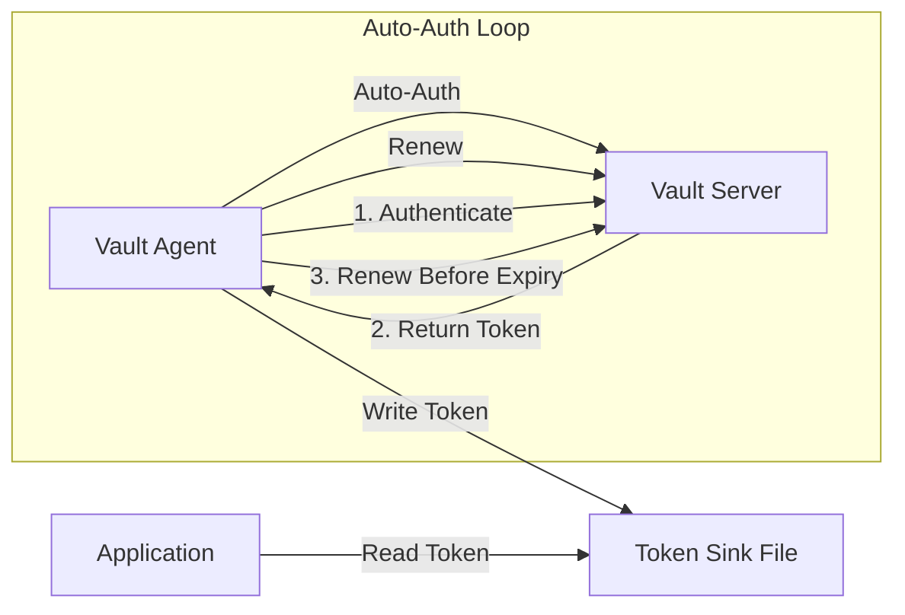
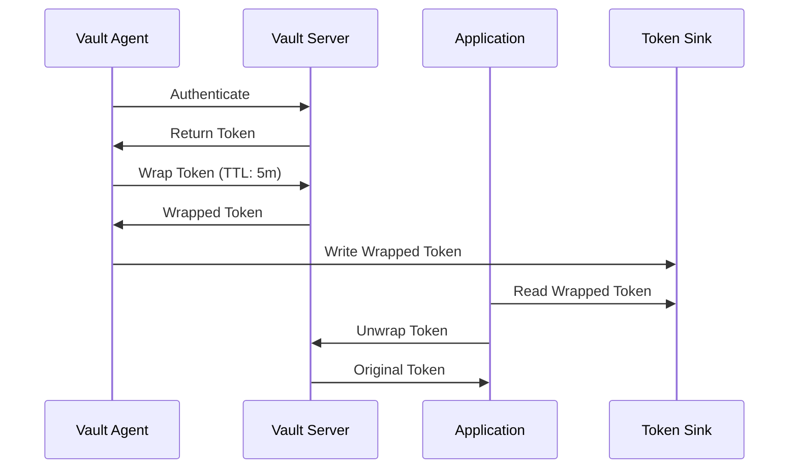
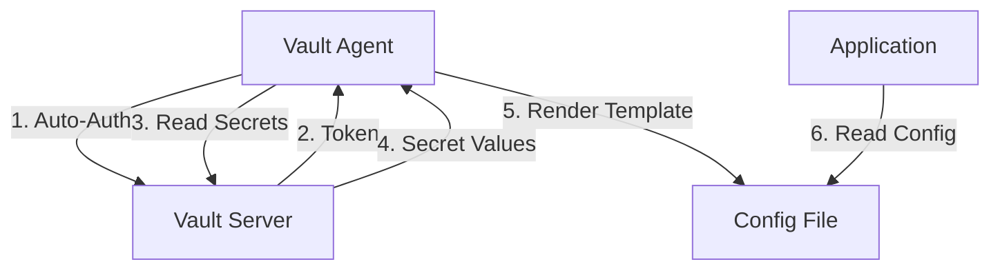
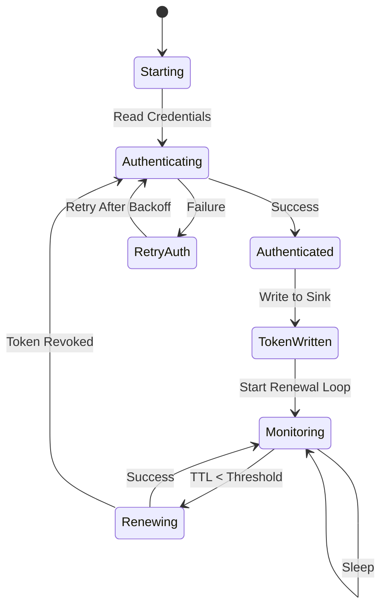

# How to Use Vault Agent for Auto-Auth

Author: [nawazdhandala](https://www.github.com/nawazdhandala)

Tags: HashiCorp Vault, Secrets Management, Auto-Auth, Security, DevOps, Kubernetes, Authentication

Description: A comprehensive guide to using HashiCorp Vault Agent for automatic authentication, covering all supported auth methods, configuration options, token management, and production best practices.

---

Managing Vault tokens manually is error-prone and insecure. Vault Agent solves that problem by handling authentication automatically, keeping tokens fresh, and providing seamless access to secrets. Applications never need to know how authentication happens.

## What Is Vault Agent Auto-Auth?

Vault Agent is a client daemon that runs alongside your applications. Auto-Auth is its most powerful feature, automatically authenticating to Vault and managing the token lifecycle without any application changes.



Key benefits:
- **Zero application changes** - Applications read tokens from files or use the Agent API
- **Automatic renewal** - Tokens stay valid without manual intervention
- **Multiple auth methods** - Support for AWS, Kubernetes, AppRole, and more
- **Secure by default** - Credentials never touch application code

## Installing Vault Agent

Vault Agent ships with the Vault binary. No separate installation is required.

The following command downloads and installs Vault, which includes the Agent:

```bash
# macOS
brew tap hashicorp/tap
brew install hashicorp/tap/vault

# Linux (Debian/Ubuntu)
wget -O- https://apt.releases.hashicorp.com/gpg | sudo gpg --dearmor -o /usr/share/keyrings/hashicorp-archive-keyring.gpg
echo "deb [signed-by=/usr/share/keyrings/hashicorp-archive-keyring.gpg] https://apt.releases.hashicorp.com $(lsb_release -cs) main" | sudo tee /etc/apt/sources.list.d/hashicorp.list
sudo apt update && sudo apt install vault

# Verify installation
vault version
```

## Basic Auto-Auth Configuration

Every Auto-Auth configuration needs three components: the method (how to authenticate), the sink (where to write tokens), and the Vault connection settings.

The following configuration demonstrates the minimum required setup using AppRole authentication:

```hcl
# vault-agent.hcl - Basic Auto-Auth configuration

# Connection to Vault server
vault {
  address = "https://vault.example.com:8200"
}

# Auto-Auth configuration
auto_auth {
  # Authentication method configuration
  method {
    type = "approle"

    config = {
      role_id_file_path   = "/etc/vault/role-id"
      secret_id_file_path = "/etc/vault/secret-id"
      remove_secret_id_file_after_reading = true
    }
  }

  # Where to write the token
  sink {
    type = "file"

    config = {
      path = "/etc/vault/token"
      mode = 0640
    }
  }
}
```

Start the Agent with the configuration file:

```bash
vault agent -config=vault-agent.hcl
```

## Authentication Methods

Vault Agent supports all Vault authentication methods. Each method requires specific configuration based on the authentication mechanism.

### AppRole Authentication

AppRole is ideal for machine-to-machine authentication. Applications authenticate using a Role ID and Secret ID combination.

The following configuration sets up AppRole with automatic Secret ID cleanup:

```hcl
# AppRole authentication configuration
auto_auth {
  method {
    type = "approle"

    config = {
      # Role ID identifies the application
      role_id_file_path = "/etc/vault/role-id"

      # Secret ID provides the credential
      secret_id_file_path = "/etc/vault/secret-id"

      # Remove Secret ID file after reading for security
      remove_secret_id_file_after_reading = true

      # Response wrapping for enhanced security
      secret_id_response_wrapping_path = "auth/approle/role/myapp/secret-id"
    }
  }

  sink {
    type = "file"
    config = {
      path = "/etc/vault/token"
    }
  }
}
```

Setting up AppRole in Vault requires enabling the auth method and creating roles:

```bash
# Enable AppRole auth method
vault auth enable approle

# Create a role for the application
vault write auth/approle/role/myapp \
  token_ttl=1h \
  token_max_ttl=4h \
  token_policies="myapp-policy" \
  secret_id_ttl=24h \
  secret_id_num_uses=1

# Get Role ID (static identifier)
vault read auth/approle/role/myapp/role-id

# Generate Secret ID (dynamic credential)
vault write -f auth/approle/role/myapp/secret-id
```

### Kubernetes Authentication

Kubernetes auth uses service account tokens for authentication. Pods automatically receive tokens, making setup seamless.

The following configuration authenticates using the pod's service account:

```hcl
# Kubernetes authentication configuration
auto_auth {
  method {
    type = "kubernetes"

    config = {
      # Role configured in Vault
      role = "myapp"

      # Service account token path (default location in pods)
      token_path = "/var/run/secrets/kubernetes.io/serviceaccount/token"
    }
  }

  sink {
    type = "file"
    config = {
      path = "/vault/token"
    }
  }
}
```

Configure Kubernetes auth in Vault with proper RBAC:

```bash
# Enable Kubernetes auth method
vault auth enable kubernetes

# Configure Kubernetes auth with cluster details
vault write auth/kubernetes/config \
  kubernetes_host="https://kubernetes.default.svc" \
  kubernetes_ca_cert=@/var/run/secrets/kubernetes.io/serviceaccount/ca.crt

# Create a role binding service accounts to policies
vault write auth/kubernetes/role/myapp \
  bound_service_account_names=myapp-sa \
  bound_service_account_namespaces=production \
  policies=myapp-policy \
  ttl=1h
```

### AWS Authentication

AWS auth supports IAM roles, EC2 instance metadata, and Lambda execution roles.

The following configuration uses IAM authentication for EC2 instances or ECS tasks:

```hcl
# AWS IAM authentication configuration
auto_auth {
  method {
    type = "aws"

    config = {
      # Authentication type: iam or ec2
      type = "iam"

      # Vault role to authenticate as
      role = "myapp-role"

      # AWS region
      region = "us-east-1"

      # Optional: specify IAM role ARN for cross-account
      # role_arn = "arn:aws:iam::123456789012:role/VaultAuth"
    }
  }

  sink {
    type = "file"
    config = {
      path = "/etc/vault/token"
    }
  }
}
```

Configure AWS auth in Vault to trust specific IAM entities:

```bash
# Enable AWS auth method
vault auth enable aws

# Configure AWS auth backend
vault write auth/aws/config/client \
  secret_key=$AWS_SECRET_ACCESS_KEY \
  access_key=$AWS_ACCESS_KEY_ID

# Create IAM role binding
vault write auth/aws/role/myapp-role \
  auth_type=iam \
  bound_iam_principal_arn="arn:aws:iam::123456789012:role/MyAppRole" \
  policies=myapp-policy \
  ttl=1h
```

### Azure Authentication

Azure auth uses Managed Service Identity (MSI) for seamless authentication from Azure VMs and services.

The following configuration authenticates using Azure Managed Identity:

```hcl
# Azure MSI authentication configuration
auto_auth {
  method {
    type = "azure"

    config = {
      # Vault role to authenticate as
      role = "myapp-azure"

      # Azure resource group and subscription
      resource = "https://management.azure.com/"

      # Optional: specify client_id for user-assigned identity
      # client_id = "00000000-0000-0000-0000-000000000000"
    }
  }

  sink {
    type = "file"
    config = {
      path = "/etc/vault/token"
    }
  }
}
```

### GCP Authentication

GCP auth supports both IAM and GCE instance identity authentication.

The following configuration uses GCP IAM service account authentication:

```hcl
# GCP IAM authentication configuration
auto_auth {
  method {
    type = "gcp"

    config = {
      # Authentication type: iam or gce
      type = "iam"

      # Vault role
      role = "myapp-gcp"

      # Service account email
      service_account = "myapp@project-id.iam.gserviceaccount.com"

      # Path to service account key (optional with Workload Identity)
      # credentials = "/etc/vault/gcp-credentials.json"
    }
  }

  sink {
    type = "file"
    config = {
      path = "/etc/vault/token"
    }
  }
}
```

### JWT/OIDC Authentication

JWT auth works with any OIDC-compliant identity provider, including GitHub Actions and GitLab CI.

The following configuration sets up JWT authentication for CI/CD pipelines:

```hcl
# JWT authentication configuration
auto_auth {
  method {
    type = "jwt"

    config = {
      # Vault role
      role = "ci-pipeline"

      # Path to JWT token file
      path = "/var/run/secrets/tokens/vault-token"

      # Remove token file after reading
      remove_jwt_after_reading = true
    }
  }

  sink {
    type = "file"
    config = {
      path = "/tmp/vault-token"
    }
  }
}
```

## Token Sinks

Sinks define where Vault Agent writes authenticated tokens. Multiple sinks allow different applications to access tokens in different locations.

### File Sink

File sinks write tokens to the filesystem with configurable permissions.

The following configuration demonstrates multiple sinks with different permissions:

```hcl
# Multiple file sinks configuration
auto_auth {
  method {
    type = "kubernetes"
    config = {
      role = "myapp"
    }
  }

  # Primary sink for the main application
  sink {
    type = "file"

    config = {
      path = "/vault/secrets/token"
      mode = 0400
    }

    # Optional: wrap token for enhanced security
    wrap_ttl = "5m"
  }

  # Secondary sink for sidecar containers
  sink {
    type = "file"

    config = {
      path = "/shared/vault-token"
      mode = 0440
    }
  }
}
```

### Response Wrapping

Response wrapping adds an extra security layer by wrapping tokens in single-use wrapper tokens.

The following diagram shows the unwrapping flow:



Configure response wrapping with the wrap_ttl parameter:

```hcl
# Response wrapping configuration
auto_auth {
  method {
    type = "approle"
    config = {
      role_id_file_path   = "/etc/vault/role-id"
      secret_id_file_path = "/etc/vault/secret-id"
    }
  }

  sink {
    type = "file"

    config = {
      path = "/etc/vault/wrapped-token"
    }

    # Wrap the token with a 5-minute TTL
    wrap_ttl = "5m"
  }
}
```

Applications must unwrap tokens before use:

```python
# Python example: Unwrapping a wrapped token
import hvac

# Read the wrapped token from the sink file
with open('/etc/vault/wrapped-token', 'r') as f:
    wrapped_token = f.read().strip()

# Create a Vault client
client = hvac.Client(url='https://vault.example.com:8200')

# Unwrap to get the actual token
unwrap_response = client.sys.unwrap(wrapped_token)
actual_token = unwrap_response['auth']['client_token']

# Use the actual token
client.token = actual_token
```

## Template Rendering

Vault Agent can render templates that contain secrets, combining auto-auth with secret retrieval.



The following configuration combines auto-auth with template rendering:

```hcl
# Complete configuration with auto-auth and templates
vault {
  address = "https://vault.example.com:8200"
}

auto_auth {
  method {
    type = "kubernetes"
    config = {
      role = "myapp"
    }
  }

  sink {
    type = "file"
    config = {
      path = "/vault/token"
    }
  }
}

# Template rendering configuration
template_config {
  # Exit on template render error
  exit_on_retry_failure = true

  # Static secret render interval
  static_secret_render_interval = "5m"
}

# Database credentials template
template {
  source      = "/etc/vault/templates/database.tpl"
  destination = "/app/config/database.env"

  # Run command after rendering
  command     = "systemctl reload myapp"

  # Permissions for rendered file
  perms       = 0600

  # Error behavior
  error_on_missing_key = true
}

# API keys template
template {
  source      = "/etc/vault/templates/api-keys.tpl"
  destination = "/app/config/api-keys.json"
  perms       = 0600
}
```

Create template files using the Consul Template syntax:

```go
{{/* /etc/vault/templates/database.tpl */}}
{{- with secret "database/creds/myapp" -}}
DB_USERNAME={{ .Data.username }}
DB_PASSWORD={{ .Data.password }}
{{- end }}
```

```go
{{/* /etc/vault/templates/api-keys.tpl */}}
{
{{- with secret "secret/data/myapp/api-keys" }}
  "stripe_key": "{{ .Data.data.stripe_key }}",
  "sendgrid_key": "{{ .Data.data.sendgrid_key }}"
{{- end }}
}
```

## Caching

Vault Agent can cache tokens and secret responses to reduce load on the Vault server and improve performance.

The following configuration enables caching with automatic renewal:

```hcl
# Caching configuration
vault {
  address = "https://vault.example.com:8200"
}

# Cache configuration
cache {
  # Use auto-auth token for caching
  use_auto_auth_token = true

  # Persistent cache survives restarts
  persist = {
    type = "kubernetes"
    path = "/vault/agent-cache"
    keep_after_import = true
    exit_on_err = true
  }
}

# Listener for cached responses
listener "tcp" {
  address     = "127.0.0.1:8100"
  tls_disable = true
}

auto_auth {
  method {
    type = "kubernetes"
    config = {
      role = "myapp"
    }
  }
}
```

Applications can connect to the local Agent listener instead of Vault directly:

```python
# Python example: Using Vault Agent cache
import hvac

# Connect to local Vault Agent instead of Vault server
client = hvac.Client(url='http://127.0.0.1:8100')

# No authentication needed - Agent handles it
secret = client.secrets.kv.v2.read_secret_version(path='myapp/config')
print(secret['data']['data'])
```

## Kubernetes Deployment

Running Vault Agent as a sidecar in Kubernetes provides seamless secret injection.

The following manifest shows a complete deployment with Vault Agent sidecar:

```yaml
# Kubernetes deployment with Vault Agent sidecar
apiVersion: v1
kind: ConfigMap
metadata:
  name: vault-agent-config
  namespace: production
data:
  vault-agent.hcl: |
    vault {
      address = "https://vault.example.com:8200"
    }

    auto_auth {
      method {
        type = "kubernetes"
        config = {
          role = "myapp"
        }
      }

      sink {
        type = "file"
        config = {
          path = "/vault/secrets/token"
        }
      }
    }

    template_config {
      exit_on_retry_failure = true
    }

    template {
      contents = <<EOF
    {{- with secret "secret/data/myapp/config" }}
    export API_KEY="{{ .Data.data.api_key }}"
    export DB_PASSWORD="{{ .Data.data.db_password }}"
    {{- end }}
    EOF
      destination = "/vault/secrets/config.env"
    }

  entrypoint.sh: |
    #!/bin/sh
    source /vault/secrets/config.env
    exec "$@"
---
apiVersion: apps/v1
kind: Deployment
metadata:
  name: myapp
  namespace: production
spec:
  replicas: 3
  selector:
    matchLabels:
      app: myapp
  template:
    metadata:
      labels:
        app: myapp
    spec:
      serviceAccountName: myapp-sa

      # Init container runs Vault Agent once to fetch initial secrets
      initContainers:
        - name: vault-agent-init
          image: hashicorp/vault:1.15
          args:
            - agent
            - -config=/etc/vault/vault-agent.hcl
            - -exit-after-auth
          volumeMounts:
            - name: vault-config
              mountPath: /etc/vault
            - name: vault-secrets
              mountPath: /vault/secrets

      containers:
        # Main application container
        - name: myapp
          image: myapp:latest
          command: ["/scripts/entrypoint.sh"]
          args: ["./myapp"]
          volumeMounts:
            - name: vault-secrets
              mountPath: /vault/secrets
            - name: vault-config
              mountPath: /scripts
              subPath: entrypoint.sh
          env:
            - name: VAULT_TOKEN_PATH
              value: /vault/secrets/token

        # Sidecar container keeps secrets fresh
        - name: vault-agent
          image: hashicorp/vault:1.15
          args:
            - agent
            - -config=/etc/vault/vault-agent.hcl
          volumeMounts:
            - name: vault-config
              mountPath: /etc/vault
            - name: vault-secrets
              mountPath: /vault/secrets
          resources:
            requests:
              memory: "64Mi"
              cpu: "50m"
            limits:
              memory: "128Mi"
              cpu: "100m"

      volumes:
        - name: vault-config
          configMap:
            name: vault-agent-config
        - name: vault-secrets
          emptyDir:
            medium: Memory
---
apiVersion: v1
kind: ServiceAccount
metadata:
  name: myapp-sa
  namespace: production
```

## Auto-Auth Workflow

Understanding the complete auto-auth workflow helps with troubleshooting and optimization.



The following configuration demonstrates all auto-auth options:

```hcl
# Complete auto-auth configuration with all options
vault {
  address = "https://vault.example.com:8200"

  # TLS configuration
  ca_cert = "/etc/vault/ca.crt"
  client_cert = "/etc/vault/client.crt"
  client_key = "/etc/vault/client.key"

  # Retry configuration
  retry {
    num_retries = 5
  }
}

auto_auth {
  method {
    type = "kubernetes"

    # Namespace for namespaced Vault Enterprise
    namespace = "admin"

    # Mount path if not default
    mount_path = "auth/k8s-prod"

    # Wrap the auth token
    wrap_ttl = "5m"

    # Max backoff for retries
    max_backoff = "5m"

    config = {
      role = "myapp"
      token_path = "/var/run/secrets/kubernetes.io/serviceaccount/token"
    }
  }

  # Primary sink
  sink "file" {
    config = {
      path = "/vault/secrets/token"
      mode = 0400
    }
  }

  # Backup sink
  sink "file" {
    config = {
      path = "/tmp/vault-token"
      mode = 0400
    }
    wrap_ttl = "10m"
  }
}
```

## Error Handling and Retry

Vault Agent handles transient failures automatically with configurable retry behavior.

The following configuration shows retry and error handling options:

```hcl
# Error handling configuration
vault {
  address = "https://vault.example.com:8200"

  retry {
    # Number of retries for connection failures
    num_retries = 5
  }
}

auto_auth {
  method {
    type = "kubernetes"

    # Maximum backoff between retries
    max_backoff = "5m"

    # Minimum backoff (default: 1s)
    min_backoff = "1s"

    config = {
      role = "myapp"
    }
  }

  sink {
    type = "file"
    config = {
      path = "/vault/token"
    }
  }
}

# Exit codes for orchestration
exit_after_auth = false
```

Monitor Agent health with logging:

```hcl
# Logging configuration
log_level = "info"
log_file = "/var/log/vault-agent.log"

# Telemetry for monitoring
telemetry {
  prometheus_retention_time = "60s"
  disable_hostname = true
}
```

## Security Best Practices

Follow these practices to maximize security when using Vault Agent Auto-Auth.

### 1. Minimize Token Permissions

Create policies with minimum required permissions:

```hcl
# Minimal policy example
path "secret/data/myapp/*" {
  capabilities = ["read"]
}

path "database/creds/myapp-readonly" {
  capabilities = ["read"]
}
```

### 2. Use Short Token TTLs

Configure short TTLs with automatic renewal:

```bash
# Configure auth method with short TTLs
vault write auth/kubernetes/role/myapp \
  bound_service_account_names=myapp-sa \
  bound_service_account_namespaces=production \
  policies=myapp-policy \
  ttl=15m \
  max_ttl=1h
```

### 3. Secure Sink Files

Restrict sink file permissions and use memory-backed filesystems:

```hcl
# Secure sink configuration
sink {
  type = "file"
  config = {
    path = "/vault/secrets/token"
    mode = 0400  # Owner read-only
  }
}
```

```yaml
# Kubernetes: Use memory-backed volume
volumes:
  - name: vault-secrets
    emptyDir:
      medium: Memory
      sizeLimit: 64Mi
```

### 4. Enable Audit Logging

Ensure Vault audit logging captures all token operations:

```bash
# Enable file audit device
vault audit enable file file_path=/var/log/vault/audit.log

# Enable syslog for centralized logging
vault audit enable syslog tag="vault" facility="AUTH"
```

### 5. Rotate Credentials Regularly

For AppRole, rotate Secret IDs frequently:

```bash
# Generate new Secret ID
vault write -f auth/approle/role/myapp/secret-id

# Configure Secret ID with limited uses
vault write auth/approle/role/myapp \
  secret_id_num_uses=1 \
  secret_id_ttl=24h
```

## Troubleshooting

Common issues and their solutions when working with Vault Agent Auto-Auth.

### Agent Cannot Authenticate

Check authentication method configuration and credentials:

```bash
# Test authentication manually
vault login -method=kubernetes role=myapp

# Check Kubernetes service account
kubectl get serviceaccount myapp-sa -o yaml

# Verify service account token
cat /var/run/secrets/kubernetes.io/serviceaccount/token | jwt decode -
```

### Token Not Written to Sink

Verify sink path permissions and Agent logs:

```bash
# Check Agent logs
journalctl -u vault-agent -f

# Verify sink directory exists and is writable
ls -la /vault/secrets/

# Check SELinux/AppArmor if applicable
sestatus
aa-status
```

### Token Expires Before Renewal

Adjust TTL and renewal threshold:

```hcl
# Vault Agent automatically renews at 2/3 of TTL
# Ensure TTL is long enough for renewal to succeed
vault write auth/kubernetes/role/myapp \
  ttl=30m \
  max_ttl=2h
```

### Connection Refused

Verify network connectivity and TLS configuration:

```bash
# Test connectivity
curl -v https://vault.example.com:8200/v1/sys/health

# Verify CA certificate
openssl s_client -connect vault.example.com:8200 -CAfile /etc/vault/ca.crt
```

---

Vault Agent Auto-Auth eliminates the complexity of manual token management. Start with a simple configuration using your preferred authentication method, then add caching and templates as needed. Applications gain secure, automatic access to secrets without any code changes.
