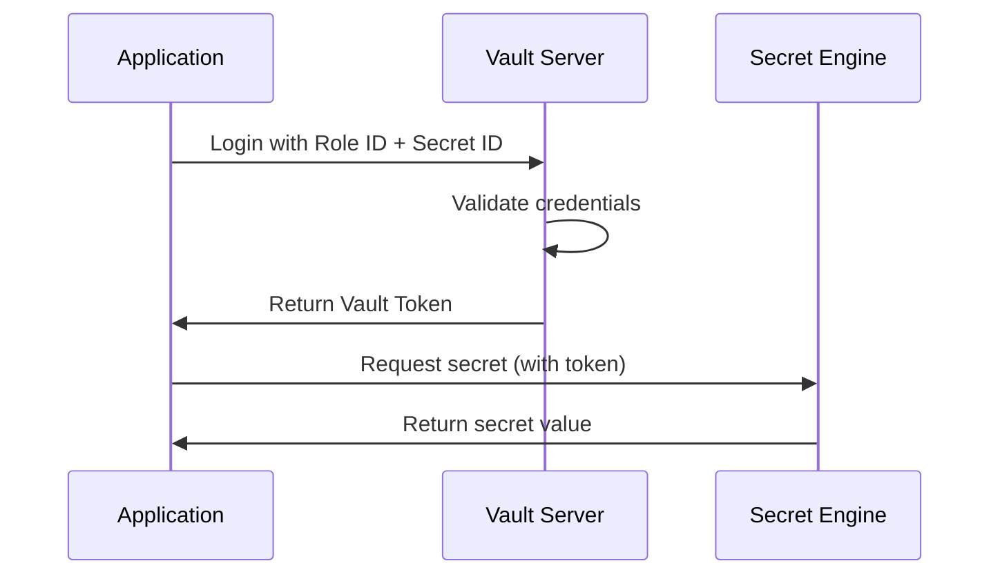
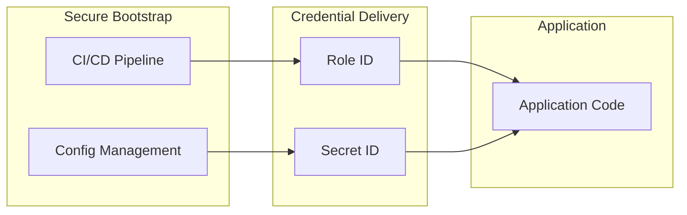
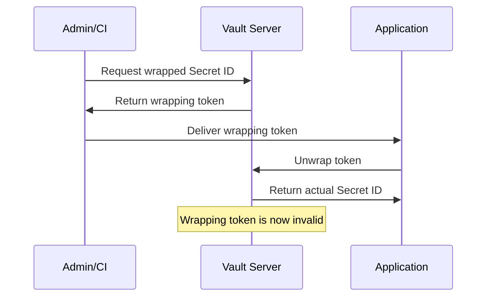

# How to Implement Vault AppRole Authentication

Author: [nawazdhandala](https://www.github.com/nawazdhandala)

Tags: HashiCorp Vault, Security, Authentication, Secrets Management, DevOps, Microservices

Description: A comprehensive guide to implementing Vault AppRole authentication for machine-to-machine scenarios. Covers role configuration, secret ID management, token policies, and production best practices for secure secrets retrieval.

---

Managing secrets in distributed applications requires a secure, automated approach. HashiCorp Vault's AppRole authentication method provides machine-to-machine authentication that eliminates the need for human intervention while maintaining strong security guarantees.

## Understanding AppRole Authentication

AppRole authentication works through two credentials: a Role ID (similar to a username) and a Secret ID (similar to a password). Together, they authenticate an application and return a Vault token for accessing secrets.



### Why AppRole Over Other Methods?

- **Automated**: No human interaction required for authentication
- **Secure**: Secret IDs can be single-use and time-limited
- **Flexible**: Policies control exactly what each role can access
- **Auditable**: Every access is logged with the role identity

## Prerequisites

Before implementing AppRole, ensure you have Vault installed and running. Here we initialize a development server for learning purposes.

```bash
# Start Vault in development mode (for testing only)
vault server -dev

# In another terminal, export the Vault address
export VAULT_ADDR='http://127.0.0.1:8200'
export VAULT_TOKEN='<root-token-from-dev-output>'

# Verify connection
vault status
```

## Step 1: Enable the AppRole Auth Method

Enable the AppRole authentication method on your Vault server before creating roles.

```bash
# Enable the AppRole authentication method
vault auth enable approle

# Verify it's enabled
vault auth list
```

Expected output:

```
Path         Type        Description
----         ----        -----------
approle/     approle     n/a
token/       token       token based credentials
```

## Step 2: Create a Policy for Your Application

Policies define what secrets an authenticated application can access. Create a policy that grants the minimum required permissions.

```bash
# Create a policy file for the web application
cat <<EOF > webapp-policy.hcl
# Allow reading database credentials
path "secret/data/webapp/database" {
  capabilities = ["read"]
}

# Allow reading API keys
path "secret/data/webapp/api-keys" {
  capabilities = ["read"]
}

# Allow listing secrets in the webapp path
path "secret/metadata/webapp/*" {
  capabilities = ["list"]
}
EOF

# Write the policy to Vault
vault policy write webapp webapp-policy.hcl

# Verify the policy was created
vault policy read webapp
```

## Step 3: Create an AppRole

Create the AppRole with specific security constraints based on your application's needs.

```bash
# Create an AppRole for the web application
vault write auth/approle/role/webapp \
    token_policies="webapp" \
    token_ttl=1h \
    token_max_ttl=4h \
    secret_id_ttl=10m \
    secret_id_num_uses=1

# View the role configuration
vault read auth/approle/role/webapp
```

### Understanding AppRole Parameters

| Parameter | Description | Recommended Value |
|-----------|-------------|-------------------|
| token_policies | Policies attached to generated tokens | Application-specific policy |
| token_ttl | Initial token lifetime | 1h for short-lived workloads |
| token_max_ttl | Maximum token lifetime after renewal | 4-24h depending on use case |
| secret_id_ttl | How long a Secret ID remains valid | 10m for tight security |
| secret_id_num_uses | Number of times a Secret ID can be used | 1 for single-use tokens |

## Step 4: Retrieve Role ID and Secret ID

The Role ID is static and can be embedded in configuration. The Secret ID should be delivered through a secure channel.

```bash
# Get the Role ID (this is static and reusable)
vault read auth/approle/role/webapp/role-id

# Generate a Secret ID (this should be delivered securely)
vault write -f auth/approle/role/webapp/secret-id
```

The architecture for credential delivery looks like the following diagram.



## Step 5: Authenticate and Retrieve Secrets

Now your application can authenticate with Vault using both credentials. Here is an example using the Vault CLI.

```bash
# Authenticate with AppRole (replace with your actual values)
ROLE_ID="your-role-id"
SECRET_ID="your-secret-id"

# Login and get a token
vault write auth/approle/login \
    role_id="$ROLE_ID" \
    secret_id="$SECRET_ID"
```

## Implementing AppRole in Code

### Node.js Implementation

Use the node-vault library to integrate AppRole authentication into your Node.js application.

```javascript
// Install: npm install node-vault

const vault = require('node-vault')({
  apiVersion: 'v1',
  endpoint: process.env.VAULT_ADDR || 'http://127.0.0.1:8200'
});

class VaultClient {
  constructor() {
    this.token = null;
    this.tokenExpiry = null;
  }

  // Authenticate with AppRole and obtain a Vault token
  async authenticate() {
    const roleId = process.env.VAULT_ROLE_ID;
    const secretId = process.env.VAULT_SECRET_ID;

    if (!roleId || !secretId) {
      throw new Error('VAULT_ROLE_ID and VAULT_SECRET_ID must be set');
    }

    try {
      const result = await vault.approleLogin({
        role_id: roleId,
        secret_id: secretId
      });

      this.token = result.auth.client_token;
      vault.token = this.token;

      // Calculate token expiry time
      const ttl = result.auth.lease_duration;
      this.tokenExpiry = Date.now() + (ttl * 1000);

      console.log(`Authenticated successfully. Token TTL: ${ttl}s`);
      return this.token;
    } catch (error) {
      console.error('AppRole authentication failed:', error.message);
      throw error;
    }
  }

  // Check if the current token is still valid
  isTokenValid() {
    if (!this.token || !this.tokenExpiry) {
      return false;
    }
    // Consider token invalid 5 minutes before actual expiry
    const buffer = 5 * 60 * 1000;
    return Date.now() < (this.tokenExpiry - buffer);
  }

  // Retrieve a secret from Vault with automatic re-authentication
  async getSecret(path) {
    if (!this.isTokenValid()) {
      await this.authenticate();
    }

    try {
      const result = await vault.read(path);
      return result.data.data;
    } catch (error) {
      if (error.response && error.response.statusCode === 403) {
        // Token might be revoked, try re-authenticating
        await this.authenticate();
        const result = await vault.read(path);
        return result.data.data;
      }
      throw error;
    }
  }
}

// Usage example demonstrating secret retrieval
async function main() {
  const client = new VaultClient();

  try {
    // Fetch database credentials
    const dbCreds = await client.getSecret('secret/data/webapp/database');
    console.log('Database host:', dbCreds.host);
    console.log('Database user:', dbCreds.username);

    // Fetch API keys
    const apiKeys = await client.getSecret('secret/data/webapp/api-keys');
    console.log('API key loaded successfully');
  } catch (error) {
    console.error('Failed to retrieve secrets:', error.message);
    process.exit(1);
  }
}

main();
```

### Python Implementation

Use the hvac library for AppRole authentication in Python applications.

```python
# Install: pip install hvac

import os
import time
import hvac
from functools import wraps

class VaultClient:
    def __init__(self):
        self.client = hvac.Client(
            url=os.environ.get('VAULT_ADDR', 'http://127.0.0.1:8200')
        )
        self.token_expiry = None
        self._authenticate()

    def _authenticate(self):
        """Authenticate with Vault using AppRole credentials."""
        role_id = os.environ.get('VAULT_ROLE_ID')
        secret_id = os.environ.get('VAULT_SECRET_ID')

        if not role_id or not secret_id:
            raise ValueError('VAULT_ROLE_ID and VAULT_SECRET_ID must be set')

        try:
            response = self.client.auth.approle.login(
                role_id=role_id,
                secret_id=secret_id
            )

            # Extract token metadata
            auth_data = response['auth']
            self.client.token = auth_data['client_token']
            ttl = auth_data['lease_duration']
            self.token_expiry = time.time() + ttl

            print(f"Authenticated successfully. Token TTL: {ttl}s")
        except Exception as e:
            print(f"AppRole authentication failed: {e}")
            raise

    def _ensure_authenticated(self):
        """Re-authenticate if the token is expired or about to expire."""
        if self.token_expiry is None:
            self._authenticate()
            return

        # Re-authenticate 5 minutes before expiry
        buffer = 5 * 60
        if time.time() >= (self.token_expiry - buffer):
            print("Token expiring soon, re-authenticating...")
            self._authenticate()

    def get_secret(self, path):
        """Retrieve a secret from Vault KV v2 engine."""
        self._ensure_authenticated()

        try:
            response = self.client.secrets.kv.v2.read_secret_version(
                path=path,
                mount_point='secret'
            )
            return response['data']['data']
        except hvac.exceptions.Forbidden:
            # Try re-authenticating on permission error
            self._authenticate()
            response = self.client.secrets.kv.v2.read_secret_version(
                path=path,
                mount_point='secret'
            )
            return response['data']['data']

    def get_database_credentials(self):
        """Retrieve database credentials from Vault."""
        return self.get_secret('webapp/database')

    def get_api_keys(self):
        """Retrieve API keys from Vault."""
        return self.get_secret('webapp/api-keys')


# Usage example demonstrating the VaultClient
def main():
    vault = VaultClient()

    # Fetch and use database credentials
    db_creds = vault.get_database_credentials()
    print(f"Database host: {db_creds['host']}")
    print(f"Database user: {db_creds['username']}")

    # Fetch API keys
    api_keys = vault.get_api_keys()
    print("API keys loaded successfully")


if __name__ == '__main__':
    main()
```

### Go Implementation

Use the official Vault Go client for AppRole authentication in Go applications.

```go
// Install: go get github.com/hashicorp/vault/api

package main

import (
    "context"
    "fmt"
    "log"
    "os"
    "sync"
    "time"

    vault "github.com/hashicorp/vault/api"
    auth "github.com/hashicorp/vault/api/auth/approle"
)

// VaultClient wraps the Vault API client with automatic token management
type VaultClient struct {
    client      *vault.Client
    roleID      string
    secretID    string
    tokenExpiry time.Time
    mu          sync.RWMutex
}

// NewVaultClient creates a new Vault client configured for AppRole authentication
func NewVaultClient() (*VaultClient, error) {
    config := vault.DefaultConfig()
    config.Address = os.Getenv("VAULT_ADDR")
    if config.Address == "" {
        config.Address = "http://127.0.0.1:8200"
    }

    client, err := vault.NewClient(config)
    if err != nil {
        return nil, fmt.Errorf("failed to create vault client: %w", err)
    }

    vc := &VaultClient{
        client:   client,
        roleID:   os.Getenv("VAULT_ROLE_ID"),
        secretID: os.Getenv("VAULT_SECRET_ID"),
    }

    if vc.roleID == "" || vc.secretID == "" {
        return nil, fmt.Errorf("VAULT_ROLE_ID and VAULT_SECRET_ID must be set")
    }

    // Perform initial authentication
    if err := vc.authenticate(context.Background()); err != nil {
        return nil, err
    }

    return vc, nil
}

// authenticate performs AppRole login and updates the client token
func (vc *VaultClient) authenticate(ctx context.Context) error {
    vc.mu.Lock()
    defer vc.mu.Unlock()

    appRoleAuth, err := auth.NewAppRoleAuth(
        vc.roleID,
        &auth.SecretID{FromString: vc.secretID},
    )
    if err != nil {
        return fmt.Errorf("failed to create approle auth: %w", err)
    }

    authInfo, err := vc.client.Auth().Login(ctx, appRoleAuth)
    if err != nil {
        return fmt.Errorf("approle login failed: %w", err)
    }

    ttl, err := authInfo.TokenTTL()
    if err != nil {
        return fmt.Errorf("failed to get token TTL: %w", err)
    }

    vc.tokenExpiry = time.Now().Add(ttl)
    log.Printf("Authenticated successfully. Token TTL: %v", ttl)

    return nil
}

// ensureAuthenticated checks token validity and re-authenticates if needed
func (vc *VaultClient) ensureAuthenticated(ctx context.Context) error {
    vc.mu.RLock()
    // Check if token expires within 5 minutes
    needsRefresh := time.Now().Add(5 * time.Minute).After(vc.tokenExpiry)
    vc.mu.RUnlock()

    if needsRefresh {
        log.Println("Token expiring soon, re-authenticating...")
        return vc.authenticate(ctx)
    }
    return nil
}

// GetSecret retrieves a secret from Vault KV v2 engine
func (vc *VaultClient) GetSecret(ctx context.Context, path string) (map[string]interface{}, error) {
    if err := vc.ensureAuthenticated(ctx); err != nil {
        return nil, err
    }

    secret, err := vc.client.KVv2("secret").Get(ctx, path)
    if err != nil {
        return nil, fmt.Errorf("failed to read secret at %s: %w", path, err)
    }

    return secret.Data, nil
}

func main() {
    ctx := context.Background()

    // Initialize the Vault client
    client, err := NewVaultClient()
    if err != nil {
        log.Fatalf("Failed to initialize Vault client: %v", err)
    }

    // Fetch database credentials
    dbCreds, err := client.GetSecret(ctx, "webapp/database")
    if err != nil {
        log.Fatalf("Failed to get database credentials: %v", err)
    }

    fmt.Printf("Database host: %s\n", dbCreds["host"])
    fmt.Printf("Database user: %s\n", dbCreds["username"])

    // Fetch API keys
    apiKeys, err := client.GetSecret(ctx, "webapp/api-keys")
    if err != nil {
        log.Fatalf("Failed to get API keys: %v", err)
    }

    fmt.Printf("API keys loaded: %d keys\n", len(apiKeys))
}
```

## Secure Secret ID Delivery

The Secret ID is the sensitive half of AppRole credentials. Here are patterns for secure delivery.

### Response Wrapping

Response wrapping provides single-use, time-limited delivery of Secret IDs.

```bash
# Generate a wrapped Secret ID (valid for 120 seconds)
vault write -wrap-ttl=120s -f auth/approle/role/webapp/secret-id

# The output contains a wrapping token, not the actual secret ID
# Wrapping Token: hvs.CAESIJ...
```

The following diagram illustrates the response wrapping flow.



Unwrap the token in your application to get the actual Secret ID.

```bash
# Unwrap to get the actual Secret ID
VAULT_TOKEN=<wrapping-token> vault unwrap
```

### Kubernetes Integration

For Kubernetes deployments, use the Vault Agent Injector to automatically handle AppRole authentication.

```yaml
# Deployment with Vault Agent Injector annotations
apiVersion: apps/v1
kind: Deployment
metadata:
  name: webapp
spec:
  template:
    metadata:
      annotations:
        # Enable Vault Agent injection
        vault.hashicorp.com/agent-inject: "true"

        # Use AppRole authentication
        vault.hashicorp.com/auth-path: "auth/approle"
        vault.hashicorp.com/role: "webapp"

        # Inject database credentials as a file
        vault.hashicorp.com/agent-inject-secret-database: "secret/data/webapp/database"
        vault.hashicorp.com/agent-inject-template-database: |
          {{- with secret "secret/data/webapp/database" -}}
          export DB_HOST="{{ .Data.data.host }}"
          export DB_USER="{{ .Data.data.username }}"
          export DB_PASS="{{ .Data.data.password }}"
          {{- end -}}
    spec:
      serviceAccountName: webapp
      containers:
        - name: webapp
          image: myapp:latest
          command: ["/bin/sh", "-c", "source /vault/secrets/database && ./start.sh"]
```

## Production Best Practices

### 1. Use CIDR Restrictions

Bind Secret IDs to specific IP ranges to prevent credential theft.

```bash
# Create AppRole with CIDR binding
vault write auth/approle/role/webapp \
    token_policies="webapp" \
    secret_id_bound_cidrs="10.0.0.0/8,172.16.0.0/12" \
    token_bound_cidrs="10.0.0.0/8,172.16.0.0/12"
```

### 2. Implement Token Renewal

Renew tokens instead of re-authenticating to reduce Secret ID usage.

```javascript
// Node.js token renewal implementation
async function renewToken() {
  try {
    const result = await vault.tokenRenewSelf();
    const newTtl = result.auth.lease_duration;
    console.log(`Token renewed. New TTL: ${newTtl}s`);
    return newTtl;
  } catch (error) {
    console.error('Token renewal failed, re-authenticating...');
    return authenticate();
  }
}

// Set up automatic renewal at 50% of TTL
function scheduleRenewal(ttlSeconds) {
  const renewalTime = (ttlSeconds * 0.5) * 1000;
  setTimeout(async () => {
    const newTtl = await renewToken();
    scheduleRenewal(newTtl);
  }, renewalTime);
}
```

### 3. Monitor Authentication Events

Enable audit logging to track all authentication attempts.

```bash
# Enable file audit device
vault audit enable file file_path=/var/log/vault/audit.log

# Enable syslog audit device
vault audit enable syslog tag="vault" facility="AUTH"
```

### 4. Implement Health Checks

Verify Vault connectivity before your application starts serving traffic.

```python
# Health check implementation for Python applications
def vault_health_check():
    """Check if Vault is reachable and the token is valid."""
    try:
        # Check Vault seal status
        if client.sys.is_sealed():
            return False, "Vault is sealed"

        # Check token validity
        token_info = client.auth.token.lookup_self()
        ttl = token_info['data']['ttl']

        if ttl < 300:  # Less than 5 minutes remaining
            return False, f"Token expiring soon: {ttl}s remaining"

        return True, "Healthy"
    except Exception as e:
        return False, str(e)
```

### 5. Use Separate Roles for Different Environments

Create distinct AppRoles for development, staging, and production environments.

```bash
# Development role with relaxed settings
vault write auth/approle/role/webapp-dev \
    token_policies="webapp-dev" \
    token_ttl=24h \
    secret_id_ttl=0 \
    secret_id_num_uses=0

# Production role with strict settings
vault write auth/approle/role/webapp-prod \
    token_policies="webapp-prod" \
    token_ttl=1h \
    token_max_ttl=4h \
    secret_id_ttl=10m \
    secret_id_num_uses=1 \
    secret_id_bound_cidrs="10.0.0.0/8"
```

## Troubleshooting Common Issues

### Permission Denied Errors

Check that the policy grants access to the correct path and the AppRole is configured with the policy.

```bash
# Verify policy is attached to the role
vault read auth/approle/role/webapp

# Test the policy with a token
vault token capabilities <token> secret/data/webapp/database
```

### Secret ID Expired

If Secret IDs expire before use, increase the TTL or generate them closer to when they are needed.

```bash
# Check current Secret ID configuration
vault read auth/approle/role/webapp | grep secret_id

# Update Secret ID TTL if needed
vault write auth/approle/role/webapp secret_id_ttl=30m
```

### Token Not Renewable

Ensure the AppRole allows token renewal by checking the token_num_uses parameter.

```bash
# Tokens with limited uses cannot be renewed
# Set token_num_uses=0 for renewable tokens
vault write auth/approle/role/webapp token_num_uses=0
```

## Security Checklist

Use the following checklist when implementing AppRole authentication in production.

- [ ] Secret IDs are single-use (secret_id_num_uses=1)
- [ ] Secret IDs have short TTLs (under 30 minutes)
- [ ] CIDR restrictions are configured
- [ ] Policies follow least-privilege principle
- [ ] Audit logging is enabled
- [ ] Token renewal is implemented
- [ ] Health checks verify Vault connectivity
- [ ] Different roles exist for each environment
- [ ] Secret ID delivery uses response wrapping
- [ ] Application handles Vault unavailability gracefully

---

AppRole authentication provides a secure, automated method for applications to authenticate with Vault. By following these patterns and best practices, you can build a robust secrets management system that scales with your infrastructure while maintaining strong security guarantees. Start with strict settings and loosen them only when necessary, always erring on the side of security.
