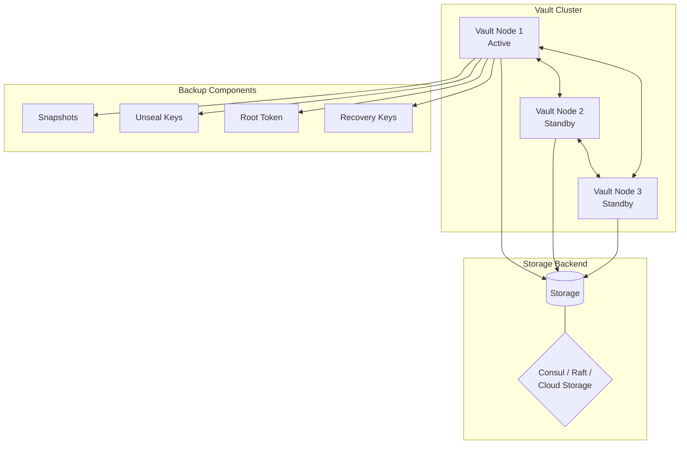
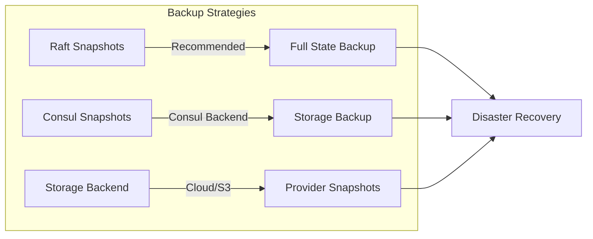
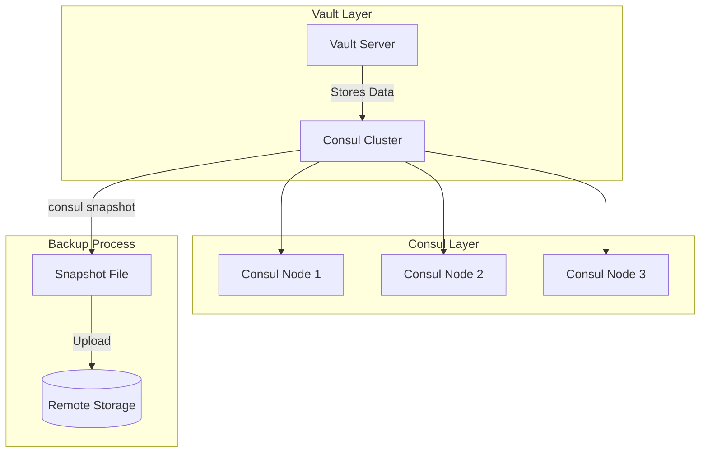
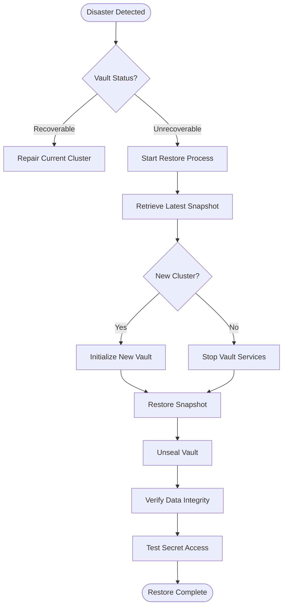
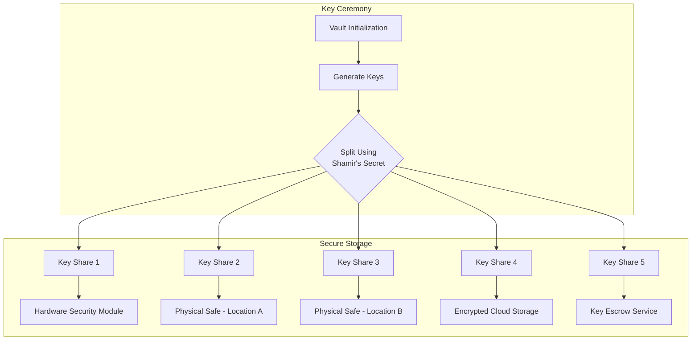
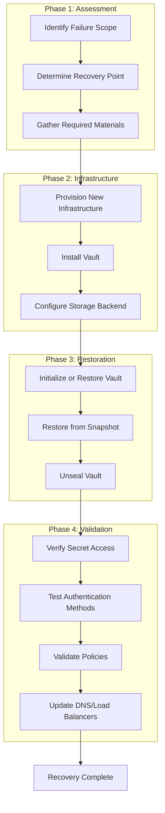

# How to Back Up and Restore Vault

Author: [nawazdhandala](https://www.github.com/nawazdhandala)

Tags: Vault, HashiCorp, Backup, Disaster Recovery, Secrets Management, DevOps, Security

Description: A comprehensive guide to backing up and restoring HashiCorp Vault, covering snapshot operations, automated backups, disaster recovery procedures, and production best practices for protecting your secrets infrastructure.

---

HashiCorp Vault stores your organization's most sensitive data - API keys, database credentials, certificates, and encryption keys. Losing Vault without a backup means losing access to every secret your applications depend on. Here's how to protect your Vault deployment with proper backup and restore procedures.

## Understanding Vault Architecture for Backups



## Vault Backup Methods Overview



## Prerequisites

Before starting, ensure you have the following:
- Vault CLI installed
- Root or admin-level Vault token
- Access to the Vault server
- Sufficient storage for snapshots

The following command verifies your Vault CLI installation and authentication status.

```bash
# Check Vault version
vault version

# Verify Vault status
vault status

# Set Vault address (if not already set)
export VAULT_ADDR='https://vault.example.com:8200'

# Authenticate with Vault
vault login
```

## Raft Integrated Storage Backups

Raft is the recommended storage backend for Vault. It provides built-in snapshot capabilities.

### Manual Raft Snapshot

Taking a manual snapshot captures the complete Vault state including all secrets, policies, and configurations.

```bash
# Create a snapshot of the current Vault state
# The snapshot file contains encrypted data that requires unseal keys to restore
vault operator raft snapshot save backup-$(date +%Y%m%d-%H%M%S).snap

# Verify the snapshot was created successfully
ls -la backup-*.snap
```

### Automated Raft Snapshot Script

Automating backups ensures consistent protection without manual intervention. The script below handles snapshot creation, verification, and retention management.

```bash
#!/bin/bash
# vault-backup.sh - Automated Vault backup script

set -euo pipefail

# Configuration
BACKUP_DIR="/var/backups/vault"
RETENTION_DAYS=30
VAULT_ADDR="${VAULT_ADDR:-https://127.0.0.1:8200}"
LOG_FILE="/var/log/vault-backup.log"

# Ensure backup directory exists
mkdir -p "$BACKUP_DIR"

# Generate timestamp for backup file
TIMESTAMP=$(date +%Y%m%d-%H%M%S)
SNAPSHOT_FILE="$BACKUP_DIR/vault-snapshot-$TIMESTAMP.snap"

log() {
    echo "[$(date '+%Y-%m-%d %H:%M:%S')] $1" | tee -a "$LOG_FILE"
}

log "Starting Vault backup"

# Check Vault status before backup
if ! vault status > /dev/null 2>&1; then
    log "ERROR: Vault is not accessible"
    exit 1
fi

# Create the snapshot
if vault operator raft snapshot save "$SNAPSHOT_FILE"; then
    log "Snapshot created: $SNAPSHOT_FILE"

    # Get snapshot size
    SIZE=$(du -h "$SNAPSHOT_FILE" | cut -f1)
    log "Snapshot size: $SIZE"
else
    log "ERROR: Failed to create snapshot"
    exit 1
fi

# Clean up old snapshots
log "Cleaning up snapshots older than $RETENTION_DAYS days"
find "$BACKUP_DIR" -name "vault-snapshot-*.snap" -type f -mtime +$RETENTION_DAYS -delete

# Count remaining backups
BACKUP_COUNT=$(ls -1 "$BACKUP_DIR"/vault-snapshot-*.snap 2>/dev/null | wc -l)
log "Total backups retained: $BACKUP_COUNT"

log "Backup completed successfully"
```

### Systemd Timer for Scheduled Backups

Using systemd timers provides reliable scheduling with logging and failure notifications.

Create the service unit file to define the backup job.

```ini
# /etc/systemd/system/vault-backup.service
[Unit]
Description=Vault Backup Service
After=network.target vault.service

[Service]
Type=oneshot
User=vault
Group=vault
Environment="VAULT_ADDR=https://127.0.0.1:8200"
Environment="VAULT_TOKEN_FILE=/etc/vault.d/backup-token"
ExecStartPre=/bin/bash -c 'export VAULT_TOKEN=$(cat $VAULT_TOKEN_FILE)'
ExecStart=/usr/local/bin/vault-backup.sh
StandardOutput=journal
StandardError=journal
```

Create the timer unit file to schedule hourly backups.

```ini
# /etc/systemd/system/vault-backup.timer
[Unit]
Description=Vault Backup Timer
Requires=vault-backup.service

[Timer]
OnCalendar=hourly
Persistent=true
RandomizedDelaySec=300

[Install]
WantedBy=timers.target
```

Enable and start the timer with the following commands.

```bash
# Reload systemd to pick up new units
sudo systemctl daemon-reload

# Enable the timer to start on boot
sudo systemctl enable vault-backup.timer

# Start the timer immediately
sudo systemctl start vault-backup.timer

# Check timer status
sudo systemctl list-timers vault-backup.timer
```

## Consul Storage Backend Backups

For Vault deployments using Consul as the storage backend, you need to back up Consul instead.



### Consul Snapshot Commands

Consul provides built-in snapshot capabilities that capture all data including Vault's encrypted secrets.

```bash
# Save a Consul snapshot
# The snapshot includes all KV data where Vault stores its encrypted state
consul snapshot save consul-vault-backup-$(date +%Y%m%d-%H%M%S).snap

# Verify the snapshot integrity
consul snapshot inspect consul-vault-backup-*.snap
```

### Automated Consul Backup Script

Regular automated backups protect against data loss. The script below handles both local and S3 storage.

```bash
#!/bin/bash
# consul-vault-backup.sh - Backup Consul for Vault

set -euo pipefail

BACKUP_DIR="/var/backups/consul"
S3_BUCKET="s3://my-backups/consul-vault"
TIMESTAMP=$(date +%Y%m%d-%H%M%S)
SNAPSHOT_FILE="$BACKUP_DIR/consul-vault-$TIMESTAMP.snap"

mkdir -p "$BACKUP_DIR"

echo "Creating Consul snapshot..."
consul snapshot save "$SNAPSHOT_FILE"

# Verify snapshot
echo "Verifying snapshot..."
consul snapshot inspect "$SNAPSHOT_FILE"

# Upload to S3 for offsite storage
echo "Uploading to S3..."
aws s3 cp "$SNAPSHOT_FILE" "$S3_BUCKET/"

# Encrypt the local copy for additional security
echo "Encrypting local backup..."
gpg --symmetric --cipher-algo AES256 "$SNAPSHOT_FILE"
rm "$SNAPSHOT_FILE"

# Cleanup old local backups (keep last 7 days)
find "$BACKUP_DIR" -name "consul-vault-*.snap.gpg" -mtime +7 -delete

echo "Backup completed: $SNAPSHOT_FILE.gpg"
```

## Backing Up to Cloud Storage

### AWS S3 Backup Script

Storing backups in S3 provides durability, versioning, and cross-region replication capabilities.

```bash
#!/bin/bash
# vault-s3-backup.sh - Vault backup with S3 storage

set -euo pipefail

# Configuration
S3_BUCKET="your-vault-backup-bucket"
S3_PREFIX="vault-snapshots"
VAULT_ADDR="${VAULT_ADDR:-https://127.0.0.1:8200}"
TEMP_DIR="/tmp/vault-backup"
TIMESTAMP=$(date +%Y%m%d-%H%M%S)
SNAPSHOT_FILE="vault-snapshot-$TIMESTAMP.snap"

# Cleanup function for temporary files
cleanup() {
    rm -rf "$TEMP_DIR"
}
trap cleanup EXIT

mkdir -p "$TEMP_DIR"
cd "$TEMP_DIR"

echo "Creating Vault snapshot..."
vault operator raft snapshot save "$SNAPSHOT_FILE"

# Calculate checksum for integrity verification
echo "Calculating checksum..."
sha256sum "$SNAPSHOT_FILE" > "$SNAPSHOT_FILE.sha256"

# Compress the snapshot
echo "Compressing snapshot..."
gzip -9 "$SNAPSHOT_FILE"

# Upload to S3 with server-side encryption
echo "Uploading to S3..."
aws s3 cp "$SNAPSHOT_FILE.gz" "s3://$S3_BUCKET/$S3_PREFIX/$SNAPSHOT_FILE.gz" \
    --sse aws:kms \
    --sse-kms-key-id alias/vault-backup-key

aws s3 cp "$SNAPSHOT_FILE.sha256" "s3://$S3_BUCKET/$S3_PREFIX/$SNAPSHOT_FILE.sha256" \
    --sse aws:kms \
    --sse-kms-key-id alias/vault-backup-key

# Apply lifecycle policy for old backups
# Configure S3 lifecycle rules to transition old backups to Glacier

echo "Backup uploaded successfully: s3://$S3_BUCKET/$S3_PREFIX/$SNAPSHOT_FILE.gz"
```

### Google Cloud Storage Backup

GCS provides similar capabilities with strong consistency guarantees.

```bash
#!/bin/bash
# vault-gcs-backup.sh - Vault backup with GCS storage

set -euo pipefail

GCS_BUCKET="gs://your-vault-backups"
TIMESTAMP=$(date +%Y%m%d-%H%M%S)
SNAPSHOT_FILE="vault-snapshot-$TIMESTAMP.snap"
TEMP_DIR="/tmp/vault-backup-$$"

mkdir -p "$TEMP_DIR"
cd "$TEMP_DIR"

# Create snapshot
vault operator raft snapshot save "$SNAPSHOT_FILE"

# Compress and upload
gzip -9 "$SNAPSHOT_FILE"
gsutil cp "$SNAPSHOT_FILE.gz" "$GCS_BUCKET/snapshots/"

# Set retention policy on the object
gsutil retention temp set "$GCS_BUCKET/snapshots/$SNAPSHOT_FILE.gz"

# Cleanup
rm -rf "$TEMP_DIR"

echo "Backup completed: $GCS_BUCKET/snapshots/$SNAPSHOT_FILE.gz"
```

## Kubernetes CronJob for Vault Backup

For Vault running in Kubernetes, use a CronJob to schedule backups.

```yaml
# vault-backup-cronjob.yaml
apiVersion: batch/v1
kind: CronJob
metadata:
  name: vault-backup
  namespace: vault
spec:
  schedule: "0 */4 * * *"  # Every 4 hours
  concurrencyPolicy: Forbid
  successfulJobsHistoryLimit: 3
  failedJobsHistoryLimit: 3
  jobTemplate:
    spec:
      backoffLimit: 3
      template:
        spec:
          serviceAccountName: vault-backup
          containers:
            - name: backup
              image: hashicorp/vault:1.15
              env:
                - name: VAULT_ADDR
                  value: "https://vault.vault.svc.cluster.local:8200"
                - name: VAULT_TOKEN
                  valueFrom:
                    secretKeyRef:
                      name: vault-backup-token
                      key: token
                - name: VAULT_SKIP_VERIFY
                  value: "true"
                - name: AWS_ACCESS_KEY_ID
                  valueFrom:
                    secretKeyRef:
                      name: aws-credentials
                      key: access-key
                - name: AWS_SECRET_ACCESS_KEY
                  valueFrom:
                    secretKeyRef:
                      name: aws-credentials
                      key: secret-key
              command:
                - /bin/sh
                - -c
                - |
                  set -e

                  # Install AWS CLI
                  apk add --no-cache aws-cli

                  TIMESTAMP=$(date +%Y%m%d-%H%M%S)
                  SNAPSHOT="/tmp/vault-$TIMESTAMP.snap"

                  echo "Creating Vault snapshot..."
                  vault operator raft snapshot save "$SNAPSHOT"

                  echo "Uploading to S3..."
                  aws s3 cp "$SNAPSHOT" "s3://vault-backups/snapshots/vault-$TIMESTAMP.snap" \
                    --sse AES256

                  echo "Backup completed successfully"
              resources:
                requests:
                  memory: "64Mi"
                  cpu: "100m"
                limits:
                  memory: "256Mi"
                  cpu: "500m"
          restartPolicy: OnFailure
```

Create the required ServiceAccount and RBAC resources.

```yaml
# vault-backup-rbac.yaml
apiVersion: v1
kind: ServiceAccount
metadata:
  name: vault-backup
  namespace: vault
---
apiVersion: v1
kind: Secret
metadata:
  name: vault-backup-token
  namespace: vault
type: Opaque
stringData:
  token: "your-vault-backup-token"
---
apiVersion: v1
kind: Secret
metadata:
  name: aws-credentials
  namespace: vault
type: Opaque
stringData:
  access-key: "YOUR_AWS_ACCESS_KEY"
  secret-key: "YOUR_AWS_SECRET_KEY"
```

## Restoring Vault from Backup



### Restoring Raft Snapshot

Restoring from a Raft snapshot requires the unseal keys and careful coordination.

```bash
#!/bin/bash
# vault-restore.sh - Restore Vault from snapshot

set -euo pipefail

SNAPSHOT_FILE=$1
FORCE=${2:-false}

if [ -z "$SNAPSHOT_FILE" ]; then
    echo "Usage: $0 <snapshot-file> [--force]"
    exit 1
fi

echo "=== Vault Restore Process ==="
echo "Snapshot: $SNAPSHOT_FILE"
echo ""

# Verify the snapshot file exists
if [ ! -f "$SNAPSHOT_FILE" ]; then
    echo "ERROR: Snapshot file not found: $SNAPSHOT_FILE"
    exit 1
fi

# Check Vault status
echo "Checking Vault status..."
vault status || true

# Warning prompt
echo ""
echo "WARNING: Restoring will replace ALL current Vault data!"
echo "Ensure you have the unseal keys ready."
echo ""

if [ "$FORCE" != "--force" ]; then
    read -p "Are you sure you want to proceed? (yes/no): " CONFIRM
    if [ "$CONFIRM" != "yes" ]; then
        echo "Restore cancelled."
        exit 0
    fi
fi

# Perform the restore
echo ""
echo "Restoring from snapshot..."
vault operator raft snapshot restore -force "$SNAPSHOT_FILE"

echo ""
echo "Snapshot restored. Vault will need to be unsealed."
echo ""

# Check new status
vault status || echo "Vault is sealed. Please unseal to complete restoration."
```

### Restoring from S3

Download and verify the snapshot before restoration.

```bash
#!/bin/bash
# vault-restore-s3.sh - Restore Vault from S3 backup

set -euo pipefail

S3_BUCKET="your-vault-backup-bucket"
S3_PREFIX="vault-snapshots"
TEMP_DIR="/tmp/vault-restore-$$"

# List available backups
echo "Available backups:"
aws s3 ls "s3://$S3_BUCKET/$S3_PREFIX/" | tail -10

echo ""
read -p "Enter snapshot filename to restore: " SNAPSHOT_NAME

if [ -z "$SNAPSHOT_NAME" ]; then
    echo "No snapshot specified"
    exit 1
fi

mkdir -p "$TEMP_DIR"
cd "$TEMP_DIR"

# Download the snapshot and checksum
echo "Downloading snapshot..."
aws s3 cp "s3://$S3_BUCKET/$S3_PREFIX/$SNAPSHOT_NAME" .
aws s3 cp "s3://$S3_BUCKET/$S3_PREFIX/${SNAPSHOT_NAME%.gz}.sha256" . 2>/dev/null || true

# Decompress
echo "Decompressing..."
gunzip "$SNAPSHOT_NAME"
SNAPSHOT_FILE="${SNAPSHOT_NAME%.gz}"

# Verify checksum if available
if [ -f "${SNAPSHOT_FILE}.sha256" ]; then
    echo "Verifying checksum..."
    sha256sum -c "${SNAPSHOT_FILE}.sha256"
fi

# Restore
echo "Restoring Vault..."
vault operator raft snapshot restore -force "$SNAPSHOT_FILE"

# Cleanup
rm -rf "$TEMP_DIR"

echo ""
echo "Restore complete. Please unseal Vault."
vault status
```

### Consul Backend Restoration

For Consul-backed Vault, restore the Consul cluster first.

```bash
#!/bin/bash
# consul-vault-restore.sh - Restore Consul for Vault

set -euo pipefail

SNAPSHOT_FILE=$1

if [ -z "$SNAPSHOT_FILE" ]; then
    echo "Usage: $0 <consul-snapshot-file>"
    exit 1
fi

echo "=== Consul Restore for Vault ==="

# Stop Vault before Consul restore
echo "Stopping Vault services..."
sudo systemctl stop vault || true

# Restore Consul snapshot
echo "Restoring Consul from snapshot..."
consul snapshot restore "$SNAPSHOT_FILE"

# Verify Consul cluster health
echo "Verifying Consul cluster..."
consul members
consul operator raft list-peers

# Start Vault
echo "Starting Vault..."
sudo systemctl start vault

# Wait for Vault to be ready
sleep 10

# Check Vault status
echo "Vault status:"
vault status || echo "Vault is sealed"

echo ""
echo "Consul restore complete. Unseal Vault to resume operations."
```

## Backing Up Unseal Keys and Root Token

Unseal keys and root tokens are critical for Vault recovery. Store them securely and separately from snapshots.

### Secure Key Storage Strategy



### Key Backup Script

Secure handling of unseal keys requires encryption and careful access control.

```bash
#!/bin/bash
# backup-vault-keys.sh - Securely backup Vault keys

set -euo pipefail

# Configuration
KEYS_DIR="/secure/vault-keys"
GPG_RECIPIENT="security-team@example.com"
TIMESTAMP=$(date +%Y%m%d-%H%M%S)

mkdir -p "$KEYS_DIR"
chmod 700 "$KEYS_DIR"

# Create a key backup document
cat > "$KEYS_DIR/vault-keys-$TIMESTAMP.txt" << 'EOF'
VAULT KEY BACKUP
================
Generated: $(date)
Cluster: production

UNSEAL KEYS (Shamir's Secret Sharing - 3 of 5 required):
Key 1: <REDACTED - Store separately>
Key 2: <REDACTED - Store separately>
Key 3: <REDACTED - Store separately>
Key 4: <REDACTED - Store separately>
Key 5: <REDACTED - Store separately>

ROOT TOKEN:
<REDACTED - Store separately>

RECOVERY KEYS (if using auto-unseal):
Recovery Key 1: <REDACTED>
Recovery Key 2: <REDACTED>
Recovery Key 3: <REDACTED>

NOTES:
- Store each key share with a different custodian
- Never store all keys in the same location
- Test recovery procedures quarterly
EOF

# Encrypt the document
gpg --encrypt --recipient "$GPG_RECIPIENT" "$KEYS_DIR/vault-keys-$TIMESTAMP.txt"

# Securely delete the plaintext
shred -u "$KEYS_DIR/vault-keys-$TIMESTAMP.txt"

echo "Keys backed up to: $KEYS_DIR/vault-keys-$TIMESTAMP.txt.gpg"
echo "Encrypted for: $GPG_RECIPIENT"
```

## Monitoring Backup Health

### Prometheus Metrics and Alerts

Monitor backup job success and alert on failures.

```yaml
# prometheus-vault-backup-alerts.yaml
apiVersion: monitoring.coreos.com/v1
kind: PrometheusRule
metadata:
  name: vault-backup-alerts
  namespace: monitoring
spec:
  groups:
    - name: vault-backup
      rules:
        - alert: VaultBackupFailed
          expr: |
            increase(vault_backup_failures_total[1h]) > 0
          for: 5m
          labels:
            severity: critical
          annotations:
            summary: "Vault backup job failed"
            description: "Vault backup has failed in the last hour"

        - alert: VaultBackupMissing
          expr: |
            time() - vault_backup_last_success_timestamp > 14400
          for: 10m
          labels:
            severity: warning
          annotations:
            summary: "Vault backup overdue"
            description: "No successful Vault backup in the last 4 hours"

        - alert: VaultBackupSizeAnomaly
          expr: |
            abs(vault_backup_size_bytes - avg_over_time(vault_backup_size_bytes[7d]))
            > (stddev_over_time(vault_backup_size_bytes[7d]) * 3)
          for: 5m
          labels:
            severity: warning
          annotations:
            summary: "Vault backup size anomaly"
            description: "Backup size differs significantly from normal"
```

### Backup Verification Script

Regular verification ensures backups are actually restorable.

```bash
#!/bin/bash
# verify-vault-backup.sh - Verify Vault backup integrity

set -euo pipefail

BACKUP_FILE=$1
REPORT_FILE="/var/log/vault-backup-verification.log"

log() {
    echo "[$(date '+%Y-%m-%d %H:%M:%S')] $1" | tee -a "$REPORT_FILE"
}

if [ -z "$BACKUP_FILE" ]; then
    echo "Usage: $0 <snapshot-file>"
    exit 1
fi

log "=== Starting backup verification ==="
log "File: $BACKUP_FILE"

# Check file exists and is readable
if [ ! -r "$BACKUP_FILE" ]; then
    log "ERROR: Cannot read backup file"
    exit 1
fi

# Check file size
SIZE=$(stat -f%z "$BACKUP_FILE" 2>/dev/null || stat -c%s "$BACKUP_FILE")
log "File size: $SIZE bytes"

if [ "$SIZE" -lt 1000 ]; then
    log "ERROR: Backup file suspiciously small"
    exit 1
fi

# Check file header (Raft snapshots have specific format)
HEADER=$(head -c 4 "$BACKUP_FILE" | xxd -p)
log "File header: $HEADER"

# Decompress if needed and check structure
if [[ "$BACKUP_FILE" == *.gz ]]; then
    log "Checking gzip integrity..."
    if ! gzip -t "$BACKUP_FILE"; then
        log "ERROR: Gzip file is corrupted"
        exit 1
    fi
    log "Gzip integrity: OK"
fi

# Report success
log "=== Verification complete: PASSED ==="

# Send metrics (for Prometheus pushgateway)
# echo "vault_backup_verification_success 1" | curl --data-binary @- http://pushgateway:9091/metrics/job/vault-backup
```

## Disaster Recovery Procedures

### Complete Cluster Recovery Runbook



### Automated Recovery Script

Comprehensive recovery script for disaster scenarios.

```bash
#!/bin/bash
# vault-disaster-recovery.sh - Full Vault disaster recovery

set -euo pipefail

# Configuration
S3_BUCKET="vault-backups"
VAULT_CONFIG="/etc/vault.d/vault.hcl"
LOG_FILE="/var/log/vault-recovery-$(date +%Y%m%d-%H%M%S).log"

log() {
    echo "[$(date '+%Y-%m-%d %H:%M:%S')] $1" | tee -a "$LOG_FILE"
}

log "=== Vault Disaster Recovery Started ==="

# Step 1: Stop any existing Vault process
log "Stopping existing Vault processes..."
sudo systemctl stop vault 2>/dev/null || true
pkill -9 vault 2>/dev/null || true

# Step 2: Clean existing data (be careful!)
log "Cleaning existing Vault data..."
sudo rm -rf /opt/vault/data/*

# Step 3: Find latest backup
log "Finding latest backup from S3..."
LATEST_BACKUP=$(aws s3 ls "s3://$S3_BUCKET/snapshots/" | sort | tail -1 | awk '{print $4}')

if [ -z "$LATEST_BACKUP" ]; then
    log "ERROR: No backups found in S3"
    exit 1
fi

log "Latest backup: $LATEST_BACKUP"

# Step 4: Download backup
log "Downloading backup..."
TEMP_DIR="/tmp/vault-recovery-$$"
mkdir -p "$TEMP_DIR"
aws s3 cp "s3://$S3_BUCKET/snapshots/$LATEST_BACKUP" "$TEMP_DIR/"

# Step 5: Decompress if needed
cd "$TEMP_DIR"
if [[ "$LATEST_BACKUP" == *.gz ]]; then
    log "Decompressing backup..."
    gunzip "$LATEST_BACKUP"
    SNAPSHOT_FILE="${LATEST_BACKUP%.gz}"
else
    SNAPSHOT_FILE="$LATEST_BACKUP"
fi

# Step 6: Start Vault in recovery mode
log "Starting Vault..."
sudo systemctl start vault

# Wait for Vault to be ready
sleep 10

# Step 7: Restore snapshot
log "Restoring from snapshot..."
vault operator raft snapshot restore -force "$TEMP_DIR/$SNAPSHOT_FILE"

# Step 8: Display status
log "Recovery snapshot restored."
log ""
log "NEXT STEPS:"
log "1. Unseal Vault using your unseal keys"
log "2. Verify secret access"
log "3. Update DNS/load balancer if needed"
log "4. Notify application teams"

# Cleanup
rm -rf "$TEMP_DIR"

log "=== Recovery script complete ==="
```

## Best Practices Summary

### Backup Frequency and Retention

| Environment | Backup Frequency | Retention Period | Offsite Copies |
|-------------|------------------|------------------|----------------|
| Development | Daily | 7 days | Optional |
| Staging | Every 4 hours | 14 days | Recommended |
| Production | Hourly | 30-90 days | Required |

### Security Checklist

1. **Encrypt backups at rest** - Use KMS or GPG encryption for all backup files
2. **Encrypt backups in transit** - Use TLS for all backup transfers
3. **Separate key storage** - Never store unseal keys with snapshots
4. **Access controls** - Limit backup access to authorized personnel only
5. **Audit logging** - Log all backup and restore operations
6. **Test restores regularly** - Quarterly restore tests at minimum
7. **Document procedures** - Maintain up-to-date runbooks

### What Backups Include and Exclude

Vault snapshots capture:
- All secrets and secret versions
- Policies and ACLs
- Authentication method configurations
- Audit device configurations
- Lease information

Vault snapshots do NOT include:
- Unseal keys or root token
- Recovery keys (for auto-unseal)
- External PKI certificates
- External identity provider configurations

---

Protecting your Vault deployment with proper backups is essential for business continuity. A single Vault failure without backups can lock your entire organization out of critical secrets. Set up automated backups today, store unseal keys securely, and test your recovery procedures regularly. Your future self will thank you when disaster strikes.
