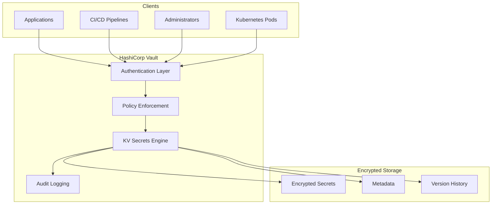
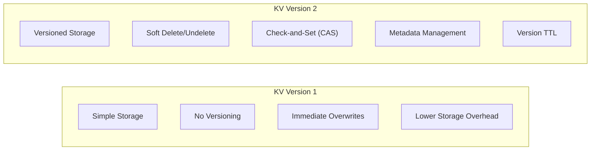
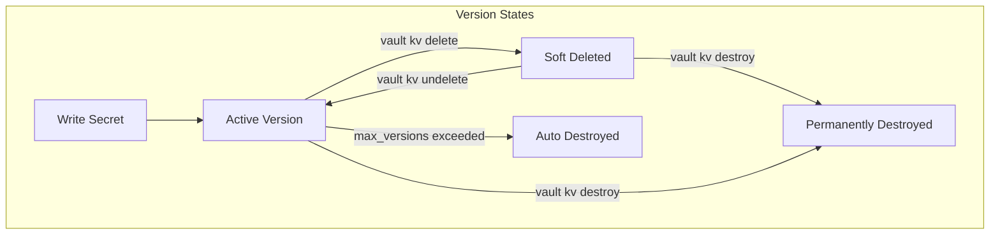
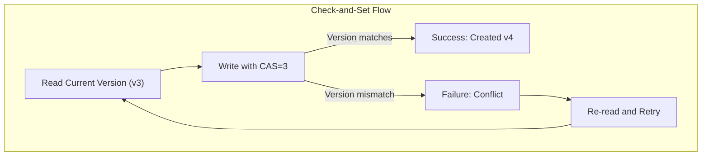

# How to Use Vault KV Secrets Engine

Author: [nawazdhandala](https://github.com/nawazdhandala)

Tags: Vault, Secrets, KV, Security

Description: A comprehensive guide to using the HashiCorp Vault KV (Key-Value) Secrets Engine for storing, managing, and retrieving secrets. Learn about KV v1 vs v2, CLI and API operations, programmatic access, and production best practices.

---

> Secrets are the foundation of secure applications. API keys, database credentials, encryption keys, and service tokens need a secure home with proper access controls, audit trails, and lifecycle management. The Vault KV Secrets Engine provides exactly that.

Managing secrets in modern infrastructure requires more than environment variables or configuration files. You need encryption at rest, access policies, audit logging, and versioning. HashiCorp Vault's KV (Key-Value) Secrets Engine is purpose-built for these requirements.

---

## What is the KV Secrets Engine?

The KV Secrets Engine is a generic secret storage mechanism in HashiCorp Vault. It allows you to store arbitrary key-value pairs at specified paths. Think of it as a secure, encrypted key-value store with robust access controls.



The KV Secrets Engine comes in two versions:

- **KV v1**: Simple key-value storage without versioning
- **KV v2**: Advanced storage with versioning, soft delete, and metadata

---

## KV v1 vs KV v2: Which to Choose?

Understanding the differences helps you choose the right version for your use case.



| Feature | KV v1 | KV v2 |
|---------|-------|-------|
| Versioning | No | Yes |
| Soft Delete | No | Yes |
| Undelete | No | Yes |
| Check-and-Set | No | Yes |
| Metadata | Limited | Full |
| Storage Overhead | Lower | Higher |
| API Path | `secret/<path>` | `secret/data/<path>` |

**Use KV v1 when**: You need simple storage, have limited space, and do not need version history.

**Use KV v2 when**: You need version control, audit history, rollback capability, or soft delete functionality.

---

## Enabling the KV Secrets Engine

### Enable KV v2 (Recommended)

KV v2 is the recommended version for most use cases due to its versioning and safety features.

```bash
# Enable KV v2 at the default 'secret' path
# The -version=2 flag specifies the KV version
vault secrets enable -version=2 -path=secret kv

# Verify the secrets engine is enabled
vault secrets list
```

Expected output:

```
Path          Type         Accessor              Description
----          ----         --------              -----------
cubbyhole/    cubbyhole    cubbyhole_xxxxxxxx    per-token private secret storage
identity/     identity     identity_xxxxxxxx     identity store
secret/       kv           kv_xxxxxxxx           n/a
sys/          system       system_xxxxxxxx       system endpoints
```

### Enable KV v1 (Legacy)

For simple use cases where versioning is not required:

```bash
# Enable KV v1 at a custom path
vault secrets enable -version=1 -path=legacy-secrets kv

# List enabled secrets engines
vault secrets list
```

### Enable Multiple KV Engines

You can enable multiple KV engines at different paths for organizational purposes.

```bash
# Enable separate KV engines for different environments
vault secrets enable -version=2 -path=prod-secrets kv
vault secrets enable -version=2 -path=staging-secrets kv
vault secrets enable -version=2 -path=dev-secrets kv

# Enable a KV engine for a specific application
vault secrets enable -version=2 -path=myapp kv
```

---

## Basic Operations with CLI

### Writing Secrets

Store secrets using the `vault kv put` command.

```bash
# Write a simple secret with multiple key-value pairs
# Format: vault kv put <path> key1=value1 key2=value2
vault kv put secret/myapp/database \
    host="db.example.com" \
    port="5432" \
    username="app_user" \
    password="supersecret123"

# Write a secret from a file (useful for certificates or large values)
vault kv put secret/myapp/certificate cert=@/path/to/cert.pem

# Write a secret from stdin (for scripted workflows)
echo '{"api_key": "abc123", "api_secret": "xyz789"}' | vault kv put secret/myapp/api -
```

### Reading Secrets

Retrieve secrets using the `vault kv get` command.

```bash
# Read the entire secret at a path
vault kv get secret/myapp/database

# Read a specific field from the secret
vault kv get -field=password secret/myapp/database

# Output as JSON for scripting
vault kv get -format=json secret/myapp/database

# Output only the data portion as JSON
vault kv get -format=json secret/myapp/database | jq '.data.data'
```

Example output:

```
======= Secret Path =======
secret/data/myapp/database

======= Metadata =======
Key                Value
---                -----
created_time       2026-02-02T10:30:00.000000Z
custom_metadata    <nil>
deletion_time      n/a
destroyed          false
version            1

====== Data ======
Key         Value
---         -----
host        db.example.com
password    supersecret123
port        5432
username    app_user
```

### Updating Secrets

Updates create new versions (in KV v2) while preserving history.

```bash
# Update the secret - this creates version 2
vault kv put secret/myapp/database \
    host="db-new.example.com" \
    port="5432" \
    username="app_user" \
    password="newsecretpassword"

# Patch a secret to update only specific keys (preserves other keys)
vault kv patch secret/myapp/database \
    password="rotatedpassword123"
```

### Deleting Secrets

KV v2 provides both soft delete (recoverable) and hard delete (permanent).

```bash
# Soft delete the latest version (can be recovered)
vault kv delete secret/myapp/database

# Soft delete specific versions
vault kv delete -versions="1,2" secret/myapp/database

# Permanently destroy specific versions (cannot be recovered)
vault kv destroy -versions="1" secret/myapp/database

# Delete all versions and metadata (complete removal)
vault kv metadata delete secret/myapp/database
```

### Recovering Deleted Secrets

Recover soft-deleted secrets using undelete.

```bash
# Undelete specific versions
vault kv undelete -versions="1,2" secret/myapp/database

# Verify recovery by reading the secret
vault kv get -version=1 secret/myapp/database
```

---

## Working with Versions

One of KV v2's most powerful features is version management.

### Version Lifecycle



### Reading Specific Versions

Access any version of a secret for auditing or rollback purposes.

```bash
# Read the current (latest) version
vault kv get secret/myapp/database

# Read a specific version
vault kv get -version=1 secret/myapp/database

# Read version 2
vault kv get -version=2 secret/myapp/database

# Get JSON output for a specific version
vault kv get -format=json -version=1 secret/myapp/database
```

### Viewing Version Metadata

Get a complete history of all versions for a secret.

```bash
# View metadata including all versions
vault kv metadata get secret/myapp/database
```

Output:

```
========== Metadata ==========
Key                     Value
---                     -----
cas_required            false
created_time            2026-02-02T10:00:00.000000Z
current_version         3
custom_metadata         <nil>
delete_version_after    0s
max_versions            0
oldest_version          1
updated_time            2026-02-02T14:30:00.000000Z

====== Version 1 ======
Key              Value
---              -----
created_time     2026-02-02T10:00:00.000000Z
deletion_time    n/a
destroyed        false

====== Version 2 ======
Key              Value
---              -----
created_time     2026-02-02T12:00:00.000000Z
deletion_time    n/a
destroyed        false

====== Version 3 ======
Key              Value
---              -----
created_time     2026-02-02T14:30:00.000000Z
deletion_time    n/a
destroyed        false
```

### Configuring Version Limits

Control how many versions to retain to manage storage.

```bash
# Set maximum versions globally for the secrets engine
vault write secret/config max_versions=10

# Set maximum versions for a specific secret path
vault kv metadata put -max-versions=5 secret/myapp/database

# Set auto-delete after a time period (e.g., 30 days = 720 hours)
vault kv metadata put -delete-version-after="720h" secret/myapp/database
```

---

## API Operations

For programmatic access, use the Vault HTTP API directly.

### Writing Secrets via API

```bash
# Write a secret using the API
# Note: For KV v2, the path includes 'data' after the mount point
curl -X POST \
    -H "X-Vault-Token: $VAULT_TOKEN" \
    -H "Content-Type: application/json" \
    -d '{
        "data": {
            "username": "admin",
            "password": "secret123",
            "connection_string": "postgresql://localhost:5432/mydb"
        }
    }' \
    "$VAULT_ADDR/v1/secret/data/myapp/database"
```

### Reading Secrets via API

```bash
# Read the latest version
curl -H "X-Vault-Token: $VAULT_TOKEN" \
    "$VAULT_ADDR/v1/secret/data/myapp/database"

# Read a specific version by adding the version parameter
curl -H "X-Vault-Token: $VAULT_TOKEN" \
    "$VAULT_ADDR/v1/secret/data/myapp/database?version=2"
```

### Listing Secrets via API

```bash
# List all secrets at a path
# Note: Use 'metadata' in the path for listing
curl -X LIST \
    -H "X-Vault-Token: $VAULT_TOKEN" \
    "$VAULT_ADDR/v1/secret/metadata/myapp"
```

### Delete and Undelete via API

```bash
# Soft delete specific versions
curl -X POST \
    -H "X-Vault-Token: $VAULT_TOKEN" \
    -H "Content-Type: application/json" \
    -d '{"versions": [1, 2]}' \
    "$VAULT_ADDR/v1/secret/delete/myapp/database"

# Undelete specific versions
curl -X POST \
    -H "X-Vault-Token: $VAULT_TOKEN" \
    -H "Content-Type: application/json" \
    -d '{"versions": [1, 2]}' \
    "$VAULT_ADDR/v1/secret/undelete/myapp/database"

# Permanently destroy versions
curl -X POST \
    -H "X-Vault-Token: $VAULT_TOKEN" \
    -H "Content-Type: application/json" \
    -d '{"versions": [1]}' \
    "$VAULT_ADDR/v1/secret/destroy/myapp/database"
```

---

## Programmatic Access with Python

Use the `hvac` library for Python applications.

### Installation

```bash
pip install hvac
```

### Complete Python Example

```python
# vault_kv_example.py
# A comprehensive example for working with Vault KV secrets engine

import hvac
import os
import json
from typing import Dict, Any, Optional

def create_vault_client() -> hvac.Client:
    """
    Create and authenticate a Vault client.
    Uses environment variables for configuration.
    """
    # Initialize the client with Vault server address
    client = hvac.Client(
        url=os.getenv('VAULT_ADDR', 'http://127.0.0.1:8200'),
        token=os.getenv('VAULT_TOKEN')
    )

    # Verify authentication is successful
    if not client.is_authenticated():
        raise Exception("Vault authentication failed. Check VAULT_TOKEN.")

    return client


def write_secret(
    client: hvac.Client,
    path: str,
    data: Dict[str, Any],
    mount_point: str = 'secret'
) -> int:
    """
    Write a secret to the KV v2 secrets engine.
    Returns the version number of the created secret.
    """
    response = client.secrets.kv.v2.create_or_update_secret(
        path=path,
        secret=data,
        mount_point=mount_point
    )

    version = response['data']['version']
    print(f"Secret written to {path}, version: {version}")
    return version


def read_secret(
    client: hvac.Client,
    path: str,
    version: Optional[int] = None,
    mount_point: str = 'secret'
) -> Dict[str, Any]:
    """
    Read a secret from the KV v2 secrets engine.
    If version is None, reads the latest version.
    """
    response = client.secrets.kv.v2.read_secret_version(
        path=path,
        version=version,
        mount_point=mount_point
    )

    metadata = response['data']['metadata']
    data = response['data']['data']

    print(f"Read {path} version {metadata['version']}")
    return data


def list_secrets(
    client: hvac.Client,
    path: str,
    mount_point: str = 'secret'
) -> list:
    """
    List all secrets at a given path.
    Returns a list of secret names.
    """
    response = client.secrets.kv.v2.list_secrets(
        path=path,
        mount_point=mount_point
    )

    secrets = response['data']['keys']
    print(f"Found {len(secrets)} secrets at {path}")
    return secrets


def delete_secret(
    client: hvac.Client,
    path: str,
    versions: Optional[list] = None,
    mount_point: str = 'secret'
) -> None:
    """
    Soft delete a secret or specific versions.
    Deleted secrets can be recovered with undelete.
    """
    if versions:
        # Delete specific versions
        client.secrets.kv.v2.delete_secret_versions(
            path=path,
            versions=versions,
            mount_point=mount_point
        )
        print(f"Deleted versions {versions} of {path}")
    else:
        # Delete latest version
        client.secrets.kv.v2.delete_latest_version_of_secret(
            path=path,
            mount_point=mount_point
        )
        print(f"Deleted latest version of {path}")


def undelete_secret(
    client: hvac.Client,
    path: str,
    versions: list,
    mount_point: str = 'secret'
) -> None:
    """
    Recover soft-deleted secret versions.
    """
    client.secrets.kv.v2.undelete_secret_versions(
        path=path,
        versions=versions,
        mount_point=mount_point
    )
    print(f"Recovered versions {versions} of {path}")


def destroy_secret(
    client: hvac.Client,
    path: str,
    versions: list,
    mount_point: str = 'secret'
) -> None:
    """
    Permanently destroy secret versions.
    This action cannot be undone.
    """
    client.secrets.kv.v2.destroy_secret_versions(
        path=path,
        versions=versions,
        mount_point=mount_point
    )
    print(f"Permanently destroyed versions {versions} of {path}")


def get_secret_metadata(
    client: hvac.Client,
    path: str,
    mount_point: str = 'secret'
) -> Dict[str, Any]:
    """
    Get metadata about a secret including version history.
    """
    response = client.secrets.kv.v2.read_secret_metadata(
        path=path,
        mount_point=mount_point
    )

    metadata = response['data']
    print(f"Current version: {metadata['current_version']}")
    print(f"Oldest version: {metadata['oldest_version']}")
    return metadata


# Example usage demonstrating full workflow
if __name__ == "__main__":
    # Create the Vault client
    client = create_vault_client()

    # Define the secret path
    secret_path = "myapp/database"

    # Write initial secret (creates version 1)
    write_secret(client, secret_path, {
        "host": "db-primary.example.com",
        "port": "5432",
        "username": "app_user",
        "password": "initial_password_v1"
    })

    # Update secret (creates version 2)
    write_secret(client, secret_path, {
        "host": "db-primary.example.com",
        "port": "5432",
        "username": "app_user",
        "password": "rotated_password_v2"
    })

    # Read latest version
    latest_secret = read_secret(client, secret_path)
    print(f"Latest password: {latest_secret['password']}")

    # Read specific version
    v1_secret = read_secret(client, secret_path, version=1)
    print(f"Version 1 password: {v1_secret['password']}")

    # Get metadata
    metadata = get_secret_metadata(client, secret_path)

    # List secrets
    secrets = list_secrets(client, "myapp")

    # Soft delete version 1
    delete_secret(client, secret_path, versions=[1])

    # Recover version 1
    undelete_secret(client, secret_path, versions=[1])
```

---

## Programmatic Access with Go

Use the official Vault Go client for Go applications.

### Go Example

```go
// main.go
// Example demonstrating Vault KV operations in Go

package main

import (
    "context"
    "fmt"
    "log"
    "os"

    vault "github.com/hashicorp/vault/api"
)

func main() {
    // Create a new Vault client with default configuration
    config := vault.DefaultConfig()

    // Set the Vault address (defaults to VAULT_ADDR env var)
    if addr := os.Getenv("VAULT_ADDR"); addr != "" {
        config.Address = addr
    }

    // Create the client
    client, err := vault.NewClient(config)
    if err != nil {
        log.Fatalf("Failed to create Vault client: %v", err)
    }

    // Set the authentication token
    // In production, use AppRole or another auth method
    client.SetToken(os.Getenv("VAULT_TOKEN"))

    ctx := context.Background()

    // Get the KV v2 client for the 'secret' mount
    kv := client.KVv2("secret")

    // Write a secret
    secretData := map[string]interface{}{
        "host":     "db.example.com",
        "port":     "5432",
        "username": "app_user",
        "password": "supersecret",
    }

    // Write the secret to the specified path
    writeResult, err := kv.Put(ctx, "myapp/database", secretData)
    if err != nil {
        log.Fatalf("Failed to write secret: %v", err)
    }
    fmt.Printf("Secret written, version: %d\n", writeResult.VersionMetadata.Version)

    // Read the secret back
    readResult, err := kv.Get(ctx, "myapp/database")
    if err != nil {
        log.Fatalf("Failed to read secret: %v", err)
    }

    // Access individual fields
    host := readResult.Data["host"].(string)
    password := readResult.Data["password"].(string)
    fmt.Printf("Host: %s\n", host)
    fmt.Printf("Password: %s\n", password)

    // Read a specific version
    v1Result, err := kv.GetVersion(ctx, "myapp/database", 1)
    if err != nil {
        log.Fatalf("Failed to read version 1: %v", err)
    }
    fmt.Printf("Version 1 data: %v\n", v1Result.Data)

    // Get metadata about the secret
    metadata, err := kv.GetMetadata(ctx, "myapp/database")
    if err != nil {
        log.Fatalf("Failed to get metadata: %v", err)
    }
    fmt.Printf("Current version: %d\n", metadata.CurrentVersion)
    fmt.Printf("Oldest version: %d\n", metadata.OldestVersion)

    // Soft delete the latest version
    err = kv.Delete(ctx, "myapp/database")
    if err != nil {
        log.Fatalf("Failed to delete secret: %v", err)
    }
    fmt.Println("Secret deleted (soft delete)")

    // Undelete the version
    err = kv.Undelete(ctx, "myapp/database", []int{1})
    if err != nil {
        log.Fatalf("Failed to undelete: %v", err)
    }
    fmt.Println("Version 1 recovered")
}
```

---

## Programmatic Access with Node.js

Use the `node-vault` library for JavaScript/TypeScript applications.

### Node.js Example

```javascript
// vault-kv.js
// Example demonstrating Vault KV operations in Node.js

const vault = require('node-vault');

// Initialize the Vault client
// Configuration is picked up from environment variables
const client = vault({
    apiVersion: 'v1',
    endpoint: process.env.VAULT_ADDR || 'http://127.0.0.1:8200',
    token: process.env.VAULT_TOKEN
});

/**
 * Write a secret to the KV v2 secrets engine.
 * @param {string} path - The secret path (without mount point prefix)
 * @param {object} data - The secret data to store
 */
async function writeSecret(path, data) {
    // For KV v2, the API path includes 'data' after the mount point
    const result = await client.write(`secret/data/${path}`, {
        data: data
    });

    console.log(`Secret written to ${path}, version: ${result.data.version}`);
    return result.data.version;
}

/**
 * Read a secret from the KV v2 secrets engine.
 * @param {string} path - The secret path
 * @param {number} version - Optional specific version to read
 */
async function readSecret(path, version = null) {
    let apiPath = `secret/data/${path}`;
    if (version) {
        apiPath += `?version=${version}`;
    }

    const result = await client.read(apiPath);

    // For KV v2, data is nested under data.data
    console.log(`Read ${path} version ${result.data.metadata.version}`);
    return result.data.data;
}

/**
 * List secrets at a given path.
 * @param {string} path - The path to list
 */
async function listSecrets(path) {
    // Use 'metadata' path for listing
    const result = await client.list(`secret/metadata/${path}`);
    console.log(`Found ${result.data.keys.length} secrets at ${path}`);
    return result.data.keys;
}

/**
 * Soft delete specific versions of a secret.
 * @param {string} path - The secret path
 * @param {number[]} versions - Array of version numbers to delete
 */
async function deleteSecretVersions(path, versions) {
    await client.write(`secret/delete/${path}`, {
        versions: versions
    });
    console.log(`Deleted versions ${versions} of ${path}`);
}

/**
 * Recover soft-deleted versions.
 * @param {string} path - The secret path
 * @param {number[]} versions - Array of version numbers to recover
 */
async function undeleteSecretVersions(path, versions) {
    await client.write(`secret/undelete/${path}`, {
        versions: versions
    });
    console.log(`Recovered versions ${versions} of ${path}`);
}

// Main execution
async function main() {
    try {
        // Write a secret
        await writeSecret('myapp/config', {
            database_url: 'postgresql://localhost:5432/myapp',
            redis_url: 'redis://localhost:6379',
            api_key: 'my-secret-api-key'
        });

        // Update the secret (creates new version)
        await writeSecret('myapp/config', {
            database_url: 'postgresql://db.example.com:5432/myapp',
            redis_url: 'redis://redis.example.com:6379',
            api_key: 'rotated-api-key'
        });

        // Read the latest version
        const latest = await readSecret('myapp/config');
        console.log('Latest config:', latest);

        // Read version 1
        const v1 = await readSecret('myapp/config', 1);
        console.log('Version 1 config:', v1);

        // List all secrets under myapp
        const secrets = await listSecrets('myapp');
        console.log('Secrets:', secrets);

        // Soft delete version 1
        await deleteSecretVersions('myapp/config', [1]);

        // Recover version 1
        await undeleteSecretVersions('myapp/config', [1]);

    } catch (error) {
        console.error('Vault error:', error.message);
        process.exit(1);
    }
}

main();
```

---

## Policies for KV Access Control

Control who can access what secrets using Vault policies.

### Read-Only Policy

Create a policy that allows only reading secrets.

```hcl
# readonly-policy.hcl
# This policy grants read-only access to secrets under a specific path

# Allow reading secrets at the myapp path
path "secret/data/myapp/*" {
    capabilities = ["read"]
}

# Allow listing secrets at the myapp path
path "secret/metadata/myapp/*" {
    capabilities = ["read", "list"]
}
```

### Read-Write Policy

Create a policy for applications that need to manage their own secrets.

```hcl
# readwrite-policy.hcl
# This policy grants full access to secrets under a specific path

# Full access to secrets data
path "secret/data/myapp/*" {
    capabilities = ["create", "read", "update", "delete"]
}

# Full access to secrets metadata (for versioning operations)
path "secret/metadata/myapp/*" {
    capabilities = ["create", "read", "update", "delete", "list"]
}

# Allow destroying versions
path "secret/destroy/myapp/*" {
    capabilities = ["update"]
}

# Allow undeleting versions
path "secret/undelete/myapp/*" {
    capabilities = ["update"]
}
```

### Admin Policy

Create an admin policy for full secrets engine management.

```hcl
# admin-policy.hcl
# This policy grants administrative access to the KV secrets engine

# Full access to all secrets
path "secret/*" {
    capabilities = ["create", "read", "update", "delete", "list"]
}

# Allow configuring the secrets engine
path "secret/config" {
    capabilities = ["read", "update"]
}

# Allow mounting and unmounting secrets engines
path "sys/mounts/secret" {
    capabilities = ["create", "read", "update", "delete"]
}
```

### Applying Policies

```bash
# Create the policies
vault policy write myapp-readonly readonly-policy.hcl
vault policy write myapp-readwrite readwrite-policy.hcl
vault policy write secrets-admin admin-policy.hcl

# Create a token with the readonly policy
vault token create -policy=myapp-readonly -ttl=1h

# Create an AppRole with the readwrite policy
vault write auth/approle/role/myapp \
    policies="myapp-readwrite" \
    token_ttl=1h \
    token_max_ttl=4h
```

---

## Check-and-Set (CAS) for Safe Updates

CAS prevents race conditions when multiple processes update the same secret.



### Enabling CAS Requirement

```bash
# Require CAS for all writes to the secrets engine
vault write secret/config cas_required=true

# Require CAS for a specific secret path
vault kv metadata put -cas-required=true secret/myapp/critical-config
```

### Using CAS in Writes

```bash
# First write - use cas=0 to indicate creating a new secret
vault kv put -cas=0 secret/myapp/config key="value"

# Update - must specify current version number
vault kv put -cas=1 secret/myapp/config key="updated-value"

# This fails if someone else updated the secret
vault kv put -cas=1 secret/myapp/config key="another-value"
# Error: check-and-set parameter did not match the current version
```

### CAS in Python

```python
# cas_example.py
# Example demonstrating Check-and-Set operations

import hvac
import os

def safe_update_secret(client, path, updates, mount_point='secret'):
    """
    Safely update a secret using CAS to prevent race conditions.
    Retries on CAS mismatch.
    """
    max_retries = 3

    for attempt in range(max_retries):
        # Read current version
        try:
            response = client.secrets.kv.v2.read_secret_version(
                path=path,
                mount_point=mount_point
            )
            current_version = response['data']['metadata']['version']
            current_data = response['data']['data']
        except hvac.exceptions.InvalidPath:
            # Secret does not exist, use CAS=0
            current_version = 0
            current_data = {}

        # Merge updates with current data
        new_data = {**current_data, **updates}

        try:
            # Write with CAS
            response = client.secrets.kv.v2.create_or_update_secret(
                path=path,
                secret=new_data,
                cas=current_version,
                mount_point=mount_point
            )
            print(f"Updated {path} to version {response['data']['version']}")
            return response
        except hvac.exceptions.InvalidRequest as e:
            if "check-and-set" in str(e):
                print(f"CAS conflict, retrying... (attempt {attempt + 1})")
                continue
            raise

    raise Exception(f"Failed to update secret after {max_retries} retries")


# Usage
client = hvac.Client(
    url=os.getenv('VAULT_ADDR'),
    token=os.getenv('VAULT_TOKEN')
)

safe_update_secret(client, 'myapp/config', {'new_key': 'new_value'})
```

---

## Best Practices

### 1. Organize Secrets by Path

Use a logical path hierarchy that mirrors your organization.

```
secret/
  prod/
    myapp/
      database
      api-keys
      certificates
    other-app/
      database
  staging/
    myapp/
      database
  shared/
    common-config
```

### 2. Use Appropriate Version Limits

Set version limits based on your needs and storage capacity.

```bash
# For frequently changing secrets (e.g., rotated credentials)
vault kv metadata put -max-versions=5 secret/prod/myapp/rotating-creds

# For stable configuration (keep more history)
vault kv metadata put -max-versions=25 secret/prod/myapp/config

# For compliance requirements (auto-delete old versions)
vault kv metadata put -delete-version-after="2160h" secret/prod/myapp/pii-data
```

### 3. Implement Least Privilege

Create granular policies that grant minimum required access.

```hcl
# Application policy - read only what it needs
path "secret/data/prod/myapp/database" {
    capabilities = ["read"]
}

# CI/CD policy - rotate specific secrets
path "secret/data/prod/myapp/api-keys" {
    capabilities = ["read", "update"]
}
```

### 4. Enable Audit Logging

Always enable audit logging in production for compliance and troubleshooting.

```bash
# Enable file-based audit logging
vault audit enable file file_path=/var/log/vault/audit.log

# Enable syslog audit logging
vault audit enable syslog tag="vault" facility="AUTH"
```

### 5. Use CAS for Critical Secrets

Enable CAS for secrets that should not be accidentally overwritten.

```bash
vault kv metadata put -cas-required=true secret/prod/myapp/critical-config
```

### 6. Implement Secret Rotation

Automate secret rotation with versioning support.

```python
# rotation_example.py
def rotate_database_password(client, path):
    """
    Rotate a database password and store the new version.
    Returns the new password for updating the database.
    """
    import secrets

    # Generate new password
    new_password = secrets.token_urlsafe(32)

    # Read current secret
    current = client.secrets.kv.v2.read_secret_version(
        path=path,
        mount_point='secret'
    )
    current_data = current['data']['data']

    # Update with new password
    current_data['password'] = new_password
    current_data['previous_password'] = current['data']['data'].get('password')
    current_data['rotation_time'] = datetime.utcnow().isoformat()

    # Write new version
    client.secrets.kv.v2.create_or_update_secret(
        path=path,
        secret=current_data,
        mount_point='secret'
    )

    return new_password
```

---

## Troubleshooting Common Issues

### Permission Denied Errors

```bash
# Check your current token's policies
vault token lookup

# Verify policy allows the operation
vault policy read <policy-name>

# Test with a specific capability check
vault token capabilities secret/data/myapp/config
```

### Version Not Found

```bash
# Check available versions
vault kv metadata get secret/myapp/config

# Verify the version exists and is not destroyed
# Look for 'destroyed: false' in the output
```

### CAS Mismatch

```bash
# Read current version first
vault kv get -format=json secret/myapp/config | jq '.data.metadata.version'

# Use that version number in your write
vault kv put -cas=<version> secret/myapp/config key=value
```

---

## Conclusion

The Vault KV Secrets Engine provides a robust foundation for managing secrets in your infrastructure. Key takeaways:

- **Choose KV v2** for most use cases to benefit from versioning and soft delete
- **Organize secrets logically** using path hierarchies
- **Implement least privilege** with granular policies
- **Use CAS** for critical secrets to prevent accidental overwrites
- **Enable audit logging** for compliance and debugging
- **Automate rotation** using the version history for safe rollbacks

The KV Secrets Engine is often the first step in your Vault journey. As your needs grow, explore other secrets engines like database dynamic credentials, PKI certificates, and cloud provider secrets.

---

*Need visibility into your Vault infrastructure? [OneUptime](https://oneuptime.com) provides comprehensive monitoring for HashiCorp Vault, alerting you to seal status changes, token expirations, and performance issues before they impact your applications.*
