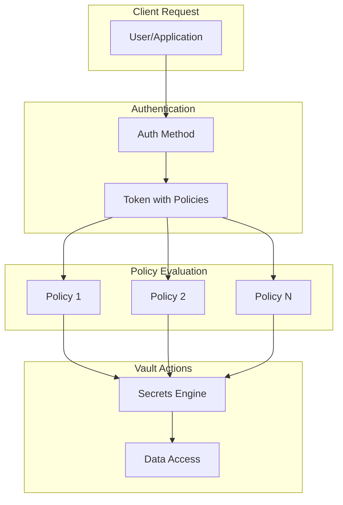
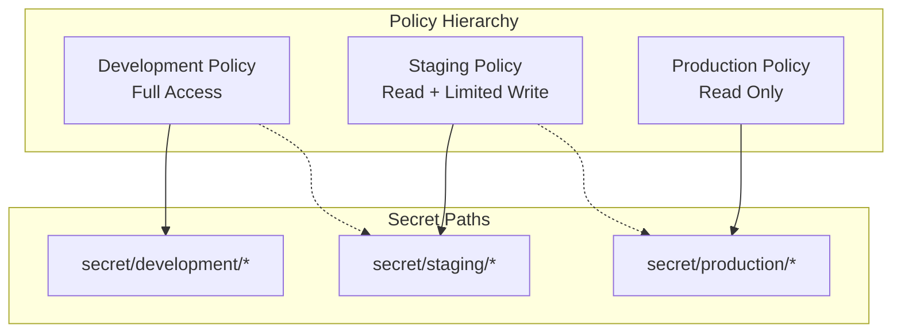

# How to Configure Vault Policies

Author: [nawazdhandala](https://www.github.com/nawazdhandala)

Tags: HashiCorp Vault, Security, Secrets Management, DevOps, Infrastructure, Access Control

Description: A comprehensive guide to configuring HashiCorp Vault policies for secure secrets management, covering policy syntax, path patterns, capabilities, and real-world access control patterns.

---

HashiCorp Vault uses policies to govern access to secrets and system functionality. Policies define what paths a user or application can access and what operations they can perform. Without proper policies, Vault's security model falls apart.

## Understanding Vault Policies

Vault policies are written in HCL (HashiCorp Configuration Language) or JSON. They define rules that grant or deny access to specific paths within Vault.



### Built-in Policies

Vault comes with two built-in policies that cannot be modified or deleted:

- **default** - Attached to all tokens by default, provides basic functionality
- **root** - Grants unlimited access, should only be used for initial setup

## Policy Syntax Fundamentals

### Basic Policy Structure

A policy defines paths and the capabilities allowed on those paths.

```hcl
# Allow read access to the secret at secret/data/myapp
path "secret/data/myapp" {
  capabilities = ["read"]
}
```

### Available Capabilities

Vault supports several capabilities that control what operations are permitted:

| Capability | Description | HTTP Methods |
|------------|-------------|--------------|
| create | Create new data | POST/PUT |
| read | Read data | GET |
| update | Modify existing data | POST/PUT |
| delete | Delete data | DELETE |
| list | List keys at path | LIST |
| sudo | Access root-protected paths | Various |
| deny | Explicitly deny access | None |

### Combining Multiple Capabilities

Most real-world policies require multiple capabilities on a single path.

```hcl
# Grant full CRUD access to application secrets
path "secret/data/myapp/*" {
  capabilities = ["create", "read", "update", "delete", "list"]
}
```

## Path Patterns and Wildcards

### Glob Patterns

Vault supports glob patterns for flexible path matching.

```hcl
# Single asterisk matches any single path segment
# Matches: secret/data/myapp/config, secret/data/myapp/creds
# Does NOT match: secret/data/myapp/nested/config
path "secret/data/myapp/*" {
  capabilities = ["read"]
}

# Plus sign matches one or more path segments
# Matches: secret/data/myapp/config
# Matches: secret/data/myapp/nested/deep/config
path "secret/data/myapp/+" {
  capabilities = ["read"]
}
```

### Path Segment Variables

Use templating to create dynamic paths based on identity information.

```hcl
# Allow users to manage their own secrets
# {{identity.entity.name}} is replaced with the entity name
path "secret/data/users/{{identity.entity.name}}/*" {
  capabilities = ["create", "read", "update", "delete", "list"]
}
```

## Real-World Policy Examples

### Application Read-Only Policy

Applications typically need read-only access to their specific secrets.

```hcl
# Policy: app-readonly
# Purpose: Allow application to read its configuration secrets

# Allow reading secrets from the application's path
path "secret/data/production/myapp/*" {
  capabilities = ["read"]
}

# Allow listing secret keys to discover available configs
path "secret/metadata/production/myapp/*" {
  capabilities = ["list"]
}
```

### Developer Policy

Developers need broader access in non-production environments.

```hcl
# Policy: developer
# Purpose: Allow developers to manage secrets in development

# Full access to development secrets
path "secret/data/development/*" {
  capabilities = ["create", "read", "update", "delete", "list"]
}

path "secret/metadata/development/*" {
  capabilities = ["list", "read", "delete"]
}

# Read-only access to staging for debugging
path "secret/data/staging/*" {
  capabilities = ["read"]
}

path "secret/metadata/staging/*" {
  capabilities = ["list"]
}

# Explicitly deny access to production
path "secret/data/production/*" {
  capabilities = ["deny"]
}
```

### Database Credentials Policy

For dynamic database credentials, applications need access to the database secrets engine.

```hcl
# Policy: db-app
# Purpose: Allow application to request database credentials

# Allow generating database credentials
path "database/creds/myapp-role" {
  capabilities = ["read"]
}

# Allow checking credential lease status
path "sys/leases/lookup" {
  capabilities = ["update"]
}

# Allow renewing credential leases
path "sys/leases/renew" {
  capabilities = ["update"]
}
```

### PKI Certificate Policy

Applications requesting TLS certificates need specific PKI engine access.

```hcl
# Policy: pki-issuer
# Purpose: Allow requesting TLS certificates

# Allow issuing certificates from the intermediate CA
path "pki_int/issue/myapp-domain" {
  capabilities = ["create", "update"]
}

# Allow reading CA certificate chain
path "pki_int/ca/pem" {
  capabilities = ["read"]
}

path "pki_int/cert/ca_chain" {
  capabilities = ["read"]
}
```

### Admin Policy

Administrative users need broader system access with appropriate restrictions.

```hcl
# Policy: admin
# Purpose: Administrative access without root privileges

# Manage secrets engines
path "sys/mounts/*" {
  capabilities = ["create", "read", "update", "delete", "list"]
}

# Manage auth methods
path "sys/auth/*" {
  capabilities = ["create", "read", "update", "delete", "list"]
}

# Manage policies
path "sys/policies/acl/*" {
  capabilities = ["create", "read", "update", "delete", "list"]
}

# Read system health
path "sys/health" {
  capabilities = ["read"]
}

# Manage entities and groups
path "identity/*" {
  capabilities = ["create", "read", "update", "delete", "list"]
}

# View audit logs
path "sys/audit" {
  capabilities = ["read", "list"]
}

# Deny access to root token generation
path "auth/token/create-orphan" {
  capabilities = ["deny"]
}

path "auth/token/create/root" {
  capabilities = ["deny"]
}
```

## Creating and Managing Policies

### Writing a Policy File

Save your policy to a file with the .hcl extension.

```bash
# Create a policy file
cat > myapp-policy.hcl << 'EOF'
# Policy for MyApp application
# Version: 1.0
# Last Updated: 2026-02-02

path "secret/data/myapp/*" {
  capabilities = ["read"]
}

path "secret/metadata/myapp/*" {
  capabilities = ["list"]
}
EOF
```

### Uploading Policies to Vault

Use the Vault CLI to create or update policies.

```bash
# Create a new policy
vault policy write myapp myapp-policy.hcl

# Verify the policy was created
vault policy read myapp

# List all policies
vault policy list
```

### Updating Existing Policies

Policy updates take effect immediately for new token creation, but existing tokens retain their original policy evaluation until renewed.

```bash
# Update an existing policy
vault policy write myapp myapp-policy-v2.hcl

# Force re-evaluation by revoking and reissuing tokens
vault token revoke -mode=path auth/approle/login
```

### Deleting Policies

Remove policies when they are no longer needed.

```bash
# Delete a policy
vault policy delete myapp

# Verify deletion
vault policy list
```

## Policy Assignment

### Assigning Policies to Tokens

Tokens can be created with specific policies attached.

```bash
# Create a token with specific policies
vault token create -policy=myapp -policy=default

# Create a token with limited TTL
vault token create -policy=myapp -ttl=1h -explicit-max-ttl=24h
```

### Assigning Policies to Auth Methods

Most authentication methods allow policy assignment during configuration.

```bash
# Configure AppRole with policies
vault write auth/approle/role/myapp \
    token_policies="myapp,default" \
    token_ttl=1h \
    token_max_ttl=24h \
    secret_id_ttl=10m
```

### Using Identity Groups for Policy Management

Groups simplify policy management across multiple entities.

```bash
# Create an identity group with policies
vault write identity/group \
    name="developers" \
    policies="developer,default" \
    member_entity_ids="entity-id-1,entity-id-2"
```

## Advanced Policy Features

### Required Parameters

Policies can mandate specific parameter values in requests.

```hcl
# Require specific parameters when creating secrets
path "secret/data/production/*" {
  capabilities = ["create", "update"]

  required_parameters = ["owner", "expiration"]
}
```

### Allowed and Denied Parameters

Control which parameters can be included in requests.

```hcl
# Only allow specific fields in database role creation
path "database/roles/*" {
  capabilities = ["create", "update"]

  allowed_parameters = {
    "db_name" = []
    "creation_statements" = []
    "default_ttl" = []
    "max_ttl" = []
  }

  denied_parameters = {
    "root_rotation_statements" = []
  }
}
```

### Parameter Constraints

Restrict parameter values to specific allowed values.

```hcl
# Only allow specific environments
path "secret/data/{{identity.entity.name}}/*" {
  capabilities = ["create", "update"]

  allowed_parameters = {
    "environment" = ["development", "staging"]
  }
}
```

### Min and Max Wrapping TTL

Control response wrapping behavior for sensitive operations.

```hcl
# Require response wrapping for sensitive credentials
path "database/creds/admin-role" {
  capabilities = ["read"]

  min_wrapping_ttl = "1m"
  max_wrapping_ttl = "5m"
}
```

## Policy Testing and Validation

### Testing Policies with Vault CLI

Vault provides tools to test policy evaluation without making actual requests.

```bash
# Check if a token can perform an operation
vault token capabilities secret/data/myapp/config

# Check capabilities for a specific token
vault token capabilities -accessor <accessor> secret/data/myapp/config
```

### Policy Syntax Validation

Validate policy syntax before applying to production.

```bash
# Validate policy file syntax
vault policy fmt myapp-policy.hcl

# Parse and check for errors
vault policy write -output-policy myapp myapp-policy.hcl
```

### Audit Log Analysis

Review audit logs to understand policy evaluation results.

```bash
# Enable file audit device
vault audit enable file file_path=/var/log/vault/audit.log

# Search for policy denials
grep "permission denied" /var/log/vault/audit.log | jq '.request.path'
```

## Policy Design Patterns

### Environment-Based Hierarchy

Organize policies by environment with increasing restrictions.



### Service Mesh Integration

Policies for services in a service mesh architecture.

```hcl
# Policy: service-mesh-app
# Purpose: Allow service to authenticate and retrieve peer certificates

# Read own service certificate
path "pki_int/issue/{{identity.entity.aliases.auth_kubernetes_.metadata.service_account_name}}" {
  capabilities = ["create", "update"]
}

# Read peer service certificates for mTLS
path "pki_int/cert/*" {
  capabilities = ["read"]
}

# Authenticate using Kubernetes service account
path "auth/kubernetes/login" {
  capabilities = ["create", "update"]
}
```

### Break-Glass Emergency Access

Create policies for emergency situations with appropriate auditing.

```hcl
# Policy: emergency-access
# Purpose: Break-glass access for critical incidents
# Note: Requires MFA and generates high-priority alerts

path "secret/data/production/*" {
  capabilities = ["read", "list"]

  # Require control group approval
  control_group = {
    factor "authorizers" {
      identity {
        group_names = ["security-team"]
        approvals = 2
      }
    }
  }
}

path "sys/leases/revoke-prefix/database/creds/" {
  capabilities = ["sudo"]
}
```

## Common Policy Mistakes

### Overly Permissive Wildcards

Avoid using wildcards that grant unintended access.

```hcl
# BAD: Grants access to ALL secrets
path "secret/*" {
  capabilities = ["read"]
}

# GOOD: Grants access only to specific application secrets
path "secret/data/myapp/*" {
  capabilities = ["read"]
}
```

### Missing Metadata Paths

KV v2 secrets engine requires separate paths for data and metadata.

```hcl
# Incomplete: Cannot list secrets without metadata access
path "secret/data/myapp/*" {
  capabilities = ["read"]
}

# Complete: Includes both data and metadata access
path "secret/data/myapp/*" {
  capabilities = ["read"]
}

path "secret/metadata/myapp/*" {
  capabilities = ["list", "read"]
}
```

### Forgetting Deny Rules

Explicit deny rules take precedence and should be used for sensitive paths.

```hcl
# Allow access to most admin functions
path "sys/*" {
  capabilities = ["read", "list"]
}

# Explicitly deny access to seal/unseal operations
path "sys/seal" {
  capabilities = ["deny"]
}

path "sys/unseal" {
  capabilities = ["deny"]
}
```

## Policy Management Best Practices

### Version Control

Store all policies in version control with proper review processes.

```
vault-policies/
    README.md
    policies/
        base/
            default-additions.hcl
        applications/
            myapp.hcl
            payment-service.hcl
        roles/
            admin.hcl
            developer.hcl
            readonly.hcl
        environments/
            production.hcl
            staging.hcl
```

### Automated Policy Deployment

Use CI/CD pipelines to deploy policy changes.

```yaml
# .github/workflows/vault-policies.yml
name: Deploy Vault Policies

on:
  push:
    branches: [main]
    paths:
      - 'policies/**'

jobs:
  deploy:
    runs-on: ubuntu-latest
    steps:
      - uses: actions/checkout@v4

      - name: Setup Vault CLI
        uses: hashicorp/setup-vault@v2

      - name: Validate Policies
        run: |
          for policy in policies/**/*.hcl; do
            vault policy fmt -check "$policy"
          done

      - name: Deploy Policies
        env:
          VAULT_ADDR: ${{ secrets.VAULT_ADDR }}
          VAULT_TOKEN: ${{ secrets.VAULT_TOKEN }}
        run: |
          for policy in policies/**/*.hcl; do
            name=$(basename "$policy" .hcl)
            vault policy write "$name" "$policy"
          done
```

### Regular Policy Audits

Schedule regular reviews of policy effectiveness.

```bash
#!/bin/bash
# Policy audit script

# List all policies
echo "=== Current Policies ==="
vault policy list

# Check for overly permissive policies
echo -e "\n=== Checking for Wildcards ==="
for policy in $(vault policy list); do
    content=$(vault policy read "$policy")
    if echo "$content" | grep -q 'path ".*\*"'; then
        echo "WARNING: $policy contains wildcard paths"
    fi
done

# List tokens and their policies
echo -e "\n=== Active Token Policies ==="
vault list auth/token/accessors 2>/dev/null | while read accessor; do
    vault token lookup -accessor "$accessor" 2>/dev/null | grep -E "policies|display_name"
done
```

## Troubleshooting Policy Issues

### Permission Denied Errors

When encountering permission denied errors, follow these diagnostic steps.

```bash
# Check current token policies
vault token lookup

# Test specific capability
vault token capabilities secret/data/myapp/config

# Read the policy to verify rules
vault policy read myapp

# Check if path exists (might be wrong path)
vault kv list secret/myapp/
```

### Policy Not Taking Effect

New policy assignments require token refresh to take effect.

```bash
# Current token still uses old policy
# Solution 1: Create new token
vault token create -policy=myapp-updated

# Solution 2: Re-authenticate
vault login -method=approle \
    role_id=$ROLE_ID \
    secret_id=$SECRET_ID
```

### Debugging Policy Evaluation

Enable verbose logging to understand policy decisions.

```bash
# Set log level to trace (requires Vault restart)
vault server -log-level=trace

# Or use audit logs for specific request tracing
vault audit enable file file_path=/var/log/vault/audit.log log_raw=true
```

---

Vault policies form the backbone of secure secrets management. Start with the principle of least privilege, use explicit paths rather than wildcards, and always test policies before deploying to production. Regular audits and version-controlled policy management ensure your security posture remains strong as your infrastructure evolves.
