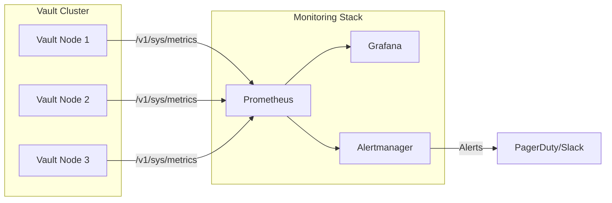
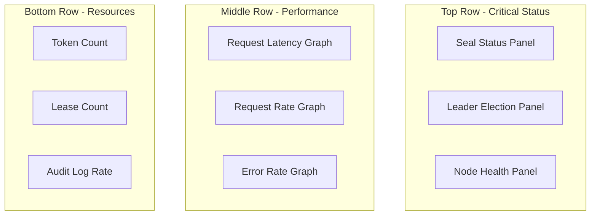
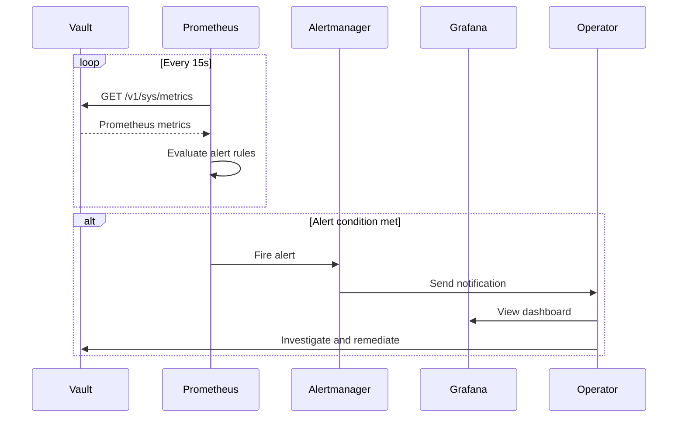

# How to Monitor Vault with Prometheus

Author: [nawazdhandala](https://www.github.com/nawazdhandala)

Tags: Vault, Prometheus, Monitoring, Observability, HashiCorp, Secrets Management, DevOps

Description: Learn how to monitor HashiCorp Vault with Prometheus, including enabling telemetry, configuring scrape targets, building dashboards, and setting up alerts for critical Vault metrics.

> Keep your secrets manager healthy. Monitoring Vault with Prometheus ensures you catch seal events, token expirations, and performance issues before they become outages.

HashiCorp Vault is the backbone of secrets management for many organizations. When Vault goes down or becomes unresponsive, applications cannot retrieve credentials, certificates expire without renewal, and deployments grind to a halt. Proactive monitoring transforms Vault from a black box into an observable service with clear health indicators.

Prometheus provides the ideal monitoring stack for Vault. Native telemetry support, a powerful query language, and seamless integration with alerting tools make it straightforward to build comprehensive Vault observability.

## Architecture Overview

Before diving into configuration, understanding how Vault telemetry flows to Prometheus helps you design the right setup for your environment.



Vault exposes metrics through its API at the `/v1/sys/metrics` endpoint. Prometheus scrapes each Vault node independently, aggregates the data, and feeds it to Grafana for visualization and Alertmanager for notifications.

## Enabling Vault Telemetry

Vault does not expose Prometheus metrics by default. You need to enable telemetry in the Vault configuration file.

The following configuration enables Prometheus metrics output and sets reasonable defaults for metric collection:

```hcl
# vault.hcl - Vault server configuration
storage "raft" {
  path = "/opt/vault/data"
  node_id = "vault-1"
}

listener "tcp" {
  address = "0.0.0.0:8200"
  tls_cert_file = "/opt/vault/tls/vault.crt"
  tls_key_file = "/opt/vault/tls/vault.key"
}

# Telemetry configuration for Prometheus
telemetry {
  # Disable hostname prepending for cleaner metric names
  disable_hostname = true

  # Enable Prometheus metrics endpoint
  prometheus_retention_time = "30s"

  # Optional: Add usage gauges for more detailed metrics
  usage_gauge_period = "10m"

  # Optional: Enable lease metrics for tracking secret lifecycles
  lease_metrics_epsilon = "1h"
  num_lease_metrics_buckets = 168
}
```

After updating the configuration, restart Vault to apply the changes. Verify telemetry is working by accessing the metrics endpoint.

The curl command below retrieves metrics from a running Vault instance:

```bash
# Fetch metrics from Vault (requires a valid token with appropriate permissions)
curl -H "X-Vault-Token: $VAULT_TOKEN" \
     https://vault.example.com:8200/v1/sys/metrics?format=prometheus

# Example output (truncated)
# HELP vault_core_unsealed Whether Vault is unsealed
# TYPE vault_core_unsealed gauge
vault_core_unsealed 1
# HELP vault_token_count Number of tokens in Vault
# TYPE vault_token_count gauge
vault_token_count 42
```

## Creating a Prometheus Scrape Token

Prometheus needs a Vault token to authenticate when scraping metrics. Creating a dedicated policy and token for monitoring follows the principle of least privilege.

First, create a policy that grants read access to the metrics endpoint only:

```hcl
# prometheus-metrics-policy.hcl
# Allows reading Vault metrics for monitoring purposes

path "sys/metrics" {
  capabilities = ["read"]
}
```

Apply the policy and create a long-lived token for Prometheus:

```bash
# Write the policy to Vault
vault policy write prometheus-metrics prometheus-metrics-policy.hcl

# Create a periodic token that auto-renews
# The period should be longer than your monitoring interval
vault token create \
  -policy="prometheus-metrics" \
  -period=768h \
  -display-name="prometheus-scraper" \
  -orphan
```

Store the generated token securely. Prometheus will use it for all metric scrape requests.

## Configuring Prometheus

Prometheus needs proper configuration to scrape Vault metrics with authentication. The setup varies depending on whether you run a single Vault instance or a cluster.

The following Prometheus configuration scrapes a three-node Vault cluster:

```yaml
# prometheus.yml
global:
  scrape_interval: 15s
  evaluation_interval: 15s

scrape_configs:
  # Scrape job for Vault cluster
  - job_name: 'vault'
    # Vault requires a token for the metrics endpoint
    authorization:
      type: Bearer
      credentials_file: /etc/prometheus/vault-token

    # Vault uses the Prometheus format via query parameter
    params:
      format: ['prometheus']

    # Metrics path for Vault
    metrics_path: /v1/sys/metrics

    # TLS configuration - adjust based on your certificate setup
    scheme: https
    tls_config:
      ca_file: /etc/prometheus/vault-ca.crt
      # Set to true only in dev environments
      insecure_skip_verify: false

    # Static targets for Vault nodes
    static_configs:
      - targets:
        - 'vault-1.example.com:8200'
        - 'vault-2.example.com:8200'
        - 'vault-3.example.com:8200'
        labels:
          environment: production
          cluster: primary

  # Optional: Scrape Vault Agent metrics if using agents
  - job_name: 'vault-agent'
    static_configs:
      - targets:
        - 'app-server-1:8200'
        - 'app-server-2:8200'
    metrics_path: /metrics
```

Create the token file that Prometheus will read:

```bash
# Store the Vault token in a file readable by Prometheus
echo "hvs.your-prometheus-token-here" > /etc/prometheus/vault-token
chmod 400 /etc/prometheus/vault-token
chown prometheus:prometheus /etc/prometheus/vault-token
```

## Key Metrics to Monitor

Vault exposes hundreds of metrics. Focusing on the most critical ones prevents dashboard overload while ensuring you catch real problems.

```mermaid
flowchart TB
    subgraph Critical Metrics
        SEAL[vault_core_unsealed]
        LEADER[vault_core_active]
        HA[vault_ha_active]
    end

    subgraph Performance Metrics
        LATENCY[vault_*_latency]
        TOKENS[vault_token_count]
        LEASES[vault_expire_num_leases]
    end

    subgraph Resource Metrics
        AUDIT[vault_audit_*]
        BARRIER[vault_barrier_*]
        CACHE[vault_cache_*]
    end

    Critical Metrics --> ALERT[Immediate Alert]
    Performance Metrics --> WARN[Warning Alert]
    Resource Metrics --> DASH[Dashboard Only]
```

### Seal Status

The most critical metric determines whether Vault is operational:

```promql
# Returns 1 if Vault is unsealed, 0 if sealed
vault_core_unsealed

# Alert if any Vault node becomes sealed
# A sealed Vault cannot serve requests
sum(vault_core_unsealed{job="vault"}) < 3
```

### Leadership and High Availability

In HA mode, exactly one node should be active while others stand by:

```promql
# Active node indicator (1 = active, 0 = standby)
vault_core_active

# HA status - should always be 1 for healthy HA clusters
vault_ha_active

# Count active nodes - should be exactly 1
sum(vault_core_active{job="vault"})
```

### Token and Lease Metrics

Token and lease accumulation often indicates application misconfiguration:

```promql
# Total number of tokens in Vault
vault_token_count

# Number of active leases
vault_expire_num_leases

# Rate of lease expiration over time
rate(vault_expire_num_leases[5m])
```

### Request Latency

Slow Vault responses impact all dependent applications:

```promql
# Average latency for secret reads
vault_secret_kv_get_latency_ms

# 99th percentile request latency
histogram_quantile(0.99, rate(vault_core_handle_request_duration_seconds_bucket[5m]))

# Request rate by mount point
sum by (mount_point) (rate(vault_route_count[5m]))
```

## Building Grafana Dashboards

Visualizing Vault metrics in Grafana provides at-a-glance health status. The dashboard layout should prioritize critical indicators.



The following Grafana dashboard JSON demonstrates a production-ready Vault monitoring panel:

```json
{
  "title": "Vault Cluster Health",
  "panels": [
    {
      "title": "Seal Status",
      "type": "stat",
      "targets": [
        {
          "expr": "sum(vault_core_unsealed{job=\"vault\"})",
          "legendFormat": "Unsealed Nodes"
        }
      ],
      "fieldConfig": {
        "defaults": {
          "thresholds": {
            "steps": [
              { "value": 0, "color": "red" },
              { "value": 2, "color": "yellow" },
              { "value": 3, "color": "green" }
            ]
          }
        }
      }
    },
    {
      "title": "Request Latency P99",
      "type": "timeseries",
      "targets": [
        {
          "expr": "histogram_quantile(0.99, sum(rate(vault_core_handle_request_duration_seconds_bucket[5m])) by (le))",
          "legendFormat": "P99 Latency"
        }
      ]
    },
    {
      "title": "Active Leases",
      "type": "timeseries",
      "targets": [
        {
          "expr": "vault_expire_num_leases",
          "legendFormat": "{{ instance }}"
        }
      ]
    }
  ]
}
```

## Alerting Rules

Proactive alerting catches Vault issues before they cascade into application failures. Configure Alertmanager rules for critical conditions.

The following alert rules cover the most important Vault failure scenarios:

```yaml
# vault-alerts.yml
groups:
  - name: vault-critical
    rules:
      # Alert immediately if any node becomes sealed
      - alert: VaultSealed
        expr: vault_core_unsealed == 0
        for: 0m
        labels:
          severity: critical
        annotations:
          summary: "Vault instance {{ $labels.instance }} is sealed"
          description: "Vault node has been sealed. Immediate action required to unseal."
          runbook_url: "https://wiki.example.com/runbooks/vault-sealed"

      # Alert if no active leader exists
      - alert: VaultNoLeader
        expr: sum(vault_core_active) == 0
        for: 1m
        labels:
          severity: critical
        annotations:
          summary: "No active Vault leader"
          description: "No Vault node is currently active. HA failover may have failed."

      # Alert on multiple active nodes (split brain)
      - alert: VaultSplitBrain
        expr: sum(vault_core_active) > 1
        for: 0m
        labels:
          severity: critical
        annotations:
          summary: "Multiple active Vault leaders detected"
          description: "Split brain condition detected with {{ $value }} active nodes."

  - name: vault-warning
    rules:
      # Alert on high request latency
      - alert: VaultHighLatency
        expr: histogram_quantile(0.99, sum(rate(vault_core_handle_request_duration_seconds_bucket[5m])) by (le)) > 1
        for: 5m
        labels:
          severity: warning
        annotations:
          summary: "Vault request latency is high"
          description: "P99 latency has exceeded 1 second for 5 minutes."

      # Alert on lease accumulation
      - alert: VaultLeaseAccumulation
        expr: vault_expire_num_leases > 100000
        for: 10m
        labels:
          severity: warning
        annotations:
          summary: "High number of active leases"
          description: "Vault has {{ $value }} active leases. Applications may not be revoking secrets properly."

      # Alert on token count growth
      - alert: VaultTokenAccumulation
        expr: vault_token_count > 10000
        for: 10m
        labels:
          severity: warning
        annotations:
          summary: "High number of tokens in Vault"
          description: "Vault has {{ $value }} tokens. Check for orphaned tokens or missing revocations."

      # Alert if Vault becomes unreachable
      - alert: VaultUnreachable
        expr: up{job="vault"} == 0
        for: 1m
        labels:
          severity: critical
        annotations:
          summary: "Vault instance {{ $labels.instance }} is unreachable"
          description: "Prometheus cannot scrape metrics from Vault node."
```

## Monitoring Vault in Kubernetes

Running Vault on Kubernetes requires additional configuration for service discovery. Prometheus can automatically discover Vault pods using Kubernetes labels.

The following ServiceMonitor resource configures Prometheus Operator to scrape Vault:

```yaml
# vault-servicemonitor.yaml
apiVersion: monitoring.coreos.com/v1
kind: ServiceMonitor
metadata:
  name: vault
  namespace: monitoring
  labels:
    app: vault
spec:
  selector:
    matchLabels:
      app.kubernetes.io/name: vault
  namespaceSelector:
    matchNames:
      - vault
  endpoints:
    - port: http
      path: /v1/sys/metrics
      params:
        format:
          - prometheus
      scheme: https
      tlsConfig:
        insecureSkipVerify: false
        caFile: /etc/prometheus/secrets/vault-tls/ca.crt
      bearerTokenSecret:
        name: vault-prometheus-token
        key: token
      interval: 30s
      scrapeTimeout: 10s
```

Create the secret containing the Prometheus scrape token:

```bash
# Create secret with Vault token for Prometheus
kubectl create secret generic vault-prometheus-token \
  --namespace monitoring \
  --from-literal=token="hvs.your-prometheus-token"
```

## Advanced Monitoring Patterns

### Audit Log Metrics

Vault audit logs contain security-relevant events. Monitoring audit log throughput helps detect both security incidents and performance issues.

```promql
# Audit log write rate
rate(vault_audit_log_request_count[5m])

# Failed audit writes - indicates potential compliance issues
rate(vault_audit_log_request_failure[5m]) > 0
```

### Storage Backend Health

Backend storage performance directly impacts Vault responsiveness:

```promql
# Raft storage latency
histogram_quantile(0.99, rate(vault_raft_commitTime_bucket[5m]))

# Raft peer count - should match expected cluster size
vault_raft_peers

# Storage barrier operations
rate(vault_barrier_get_count[5m])
rate(vault_barrier_put_count[5m])
```

### Policy and Auth Method Usage

Understanding which authentication methods and policies are used helps with capacity planning:

```promql
# Login attempts by auth method
sum by (auth_method) (rate(vault_core_handle_login_request_count[5m]))

# Policy evaluation count
rate(vault_policy_get_policy_count[5m])
```

## Complete Monitoring Flow

The following diagram shows the complete monitoring architecture from metric collection through alerting:



## Troubleshooting Common Issues

### Metrics Endpoint Returns 403

Permission denied errors indicate token issues:

```bash
# Verify token has correct policy
vault token lookup <prometheus-token>

# Check policy allows metrics access
vault policy read prometheus-metrics

# Test metrics access manually
curl -H "X-Vault-Token: <token>" https://vault:8200/v1/sys/metrics
```

### Missing Metrics After Upgrade

Vault metric names change between versions. Check the changelog and update PromQL queries accordingly:

```bash
# List all available metrics
curl -s -H "X-Vault-Token: $VAULT_TOKEN" \
  "https://vault:8200/v1/sys/metrics?format=prometheus" | grep "^vault_" | cut -d'{' -f1 | sort -u
```

### High Cardinality Issues

Some Vault metrics include high-cardinality labels. Configure metric relabeling to reduce storage requirements:

```yaml
# prometheus.yml - metric relabeling
metric_relabel_configs:
  # Drop high-cardinality mount_point label from some metrics
  - source_labels: [__name__]
    regex: 'vault_route_.*'
    action: drop
```

## Integration with OneUptime

OneUptime provides native Prometheus integration for Vault monitoring. Configure your Prometheus instance to remote write metrics to OneUptime for unified observability.

```yaml
# prometheus.yml - remote write to OneUptime
remote_write:
  - url: "https://oneuptime.com/api/prometheus/write"
    authorization:
      type: Bearer
      credentials: "<your-oneuptime-api-key>"
    write_relabel_configs:
      - source_labels: [job]
        regex: 'vault'
        action: keep
```

OneUptime automatically creates dashboards and alerts for Vault metrics, reducing the manual configuration burden.

## Summary

Monitoring Vault with Prometheus requires careful attention to authentication, metric selection, and alert thresholds. The key takeaways are:

1. **Enable telemetry** in Vault configuration with appropriate retention settings
2. **Create dedicated tokens** with minimal permissions for Prometheus scraping
3. **Focus on critical metrics** - seal status, leadership, and latency matter most
4. **Configure actionable alerts** that give operators time to respond before user impact
5. **Use Grafana dashboards** for visual health assessment and troubleshooting

A well-monitored Vault cluster becomes predictable infrastructure rather than a mysterious dependency. When you can see token accumulation trends, latency spikes, and storage performance in real-time, capacity planning and incident response become straightforward engineering tasks instead of firefighting exercises.
