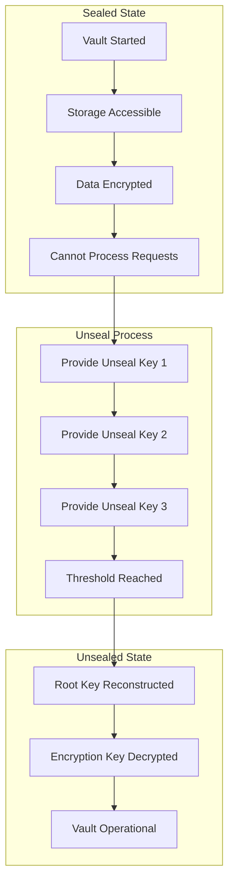
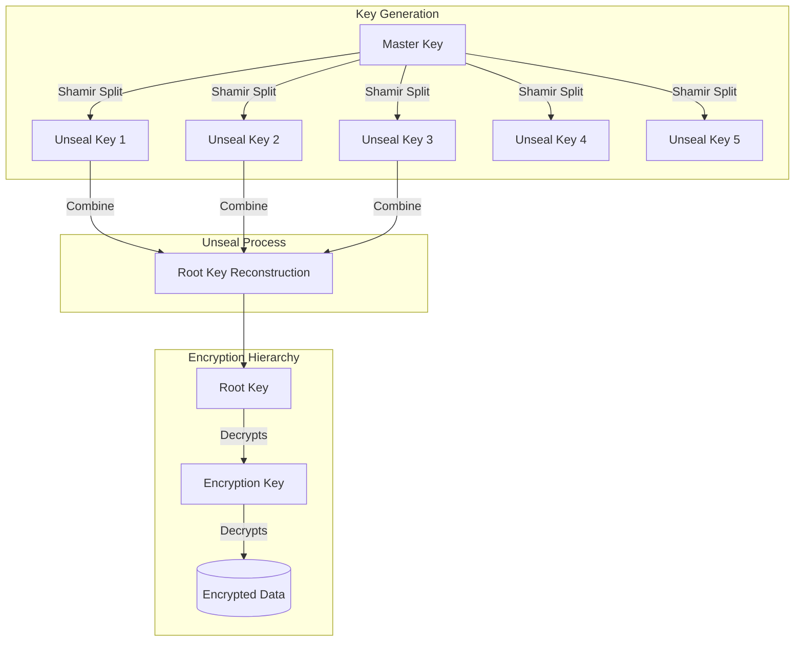
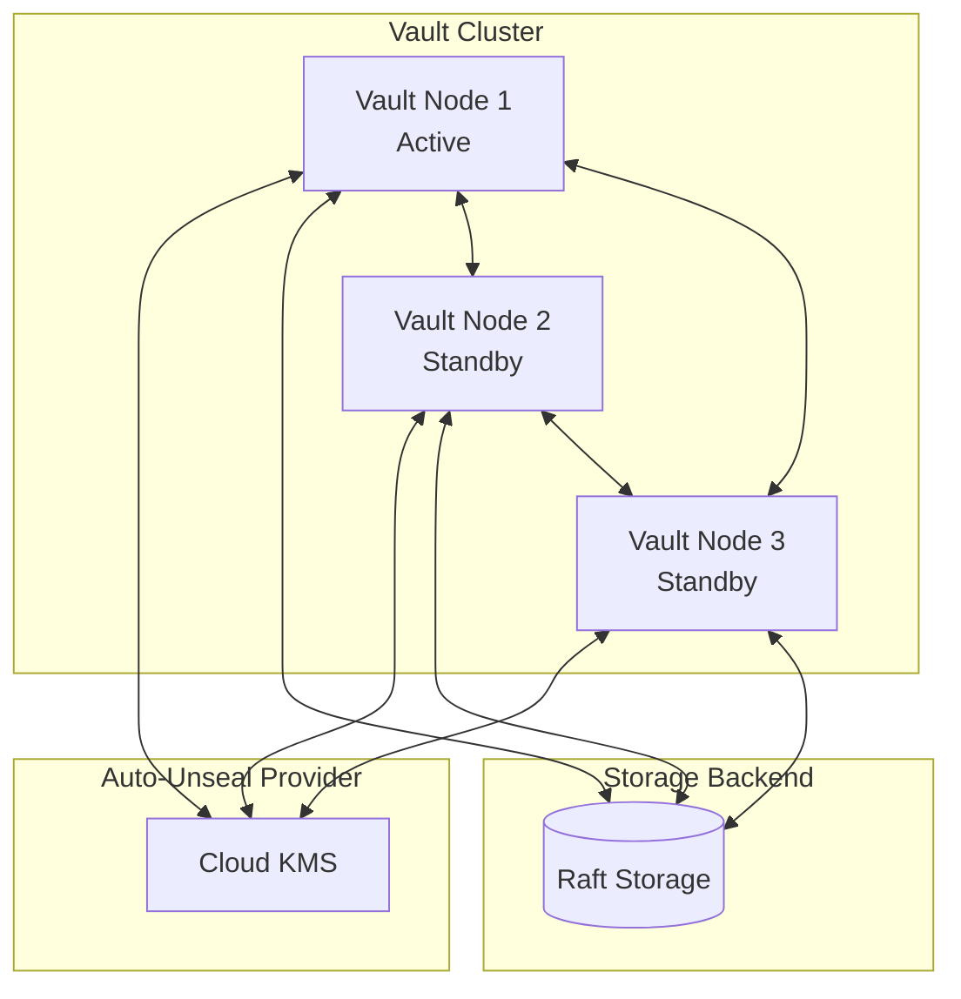
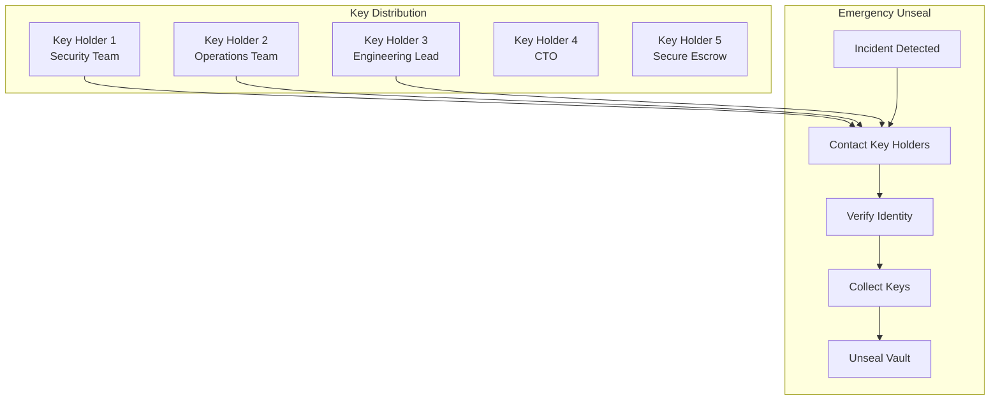

# How to Implement Vault Seal/Unseal

Author: [nawazdhandala](https://www.github.com/nawazdhandala)

Tags: HashiCorp Vault, Security, Secrets Management, DevOps, Encryption, High Availability

Description: A comprehensive guide to understanding and implementing HashiCorp Vault seal and unseal operations, including auto-unseal configurations, key management best practices, and production deployment strategies.

---

HashiCorp Vault protects your secrets with a powerful encryption mechanism that requires explicit unsealing before the vault becomes operational. Understanding the seal/unseal process is critical for running Vault in production environments where security and availability must be balanced.

## Understanding Vault Seal/Unseal

When Vault starts, it begins in a sealed state. In the sealed state, Vault knows where and how to access physical storage, but cannot decrypt any data. Unsealing requires a threshold of unseal keys to reconstruct the root key that decrypts the encryption key.



## Initializing Vault

Before you can seal or unseal Vault, you must initialize it. Initialization generates the encryption keys and root token.

The following command initializes Vault with 5 key shares and a threshold of 3, meaning any 3 of the 5 keys can unseal Vault.

```bash
# Initialize Vault with Shamir's Secret Sharing
# -key-shares: Total number of unseal keys to generate
# -key-threshold: Minimum keys required to unseal
vault operator init -key-shares=5 -key-threshold=3
```

Sample output from initialization:

```
Unseal Key 1: 4jYbl2CBIv6SpkKj6Hos9iD32k5RfGkLzlosrrq/JgOm
Unseal Key 2: B05G1DRtfYckFV5BbdBvXq0wkK5HFqB9g2jcDmNfTQiS
Unseal Key 3: Arig0N9rN9ezkTRo7qTB7gsIZDaonOcc53EHo83F5chA
Unseal Key 4: 0cZE0C/gEk3YHaKjIWxhyyfs8REhqkRW/CSXTnmTilv+
Unseal Key 5: fYhZOseRgzxmJCmIqUdxEm9C3jB5Q27AowER9w4FC2Ck

Initial Root Token: hvs.jkHNq7ZjHYWX2uQm2vKShkQd
```

## Manual Unseal Process

Each unseal key holder provides their key to reconstruct the root key. You need to reach the threshold to complete unsealing.

The first unseal command starts the process and shows progress toward the threshold.

```bash
# First unseal key - progress 1/3
vault operator unseal 4jYbl2CBIv6SpkKj6Hos9iD32k5RfGkLzlosrrq/JgOm
```

Continue providing keys until the threshold is reached.

```bash
# Second unseal key - progress 2/3
vault operator unseal B05G1DRtfYckFV5BbdBvXq0wkK5HFqB9g2jcDmNfTQiS

# Third unseal key - threshold reached, Vault unsealed
vault operator unseal Arig0N9rN9ezkTRo7qTB7gsIZDaonOcc53EHo83F5chA
```

Check the seal status to verify Vault is operational.

```bash
# Verify Vault status
vault status
```

Expected output when unsealed:

```
Key             Value
---             -----
Seal Type       shamir
Initialized     true
Sealed          false
Total Shares    5
Threshold       3
Version         1.15.4
Build Date      2023-12-04T17:45:28Z
Storage Type    raft
Cluster Name    vault-cluster-a1b2c3d4
Cluster ID      e5f6g7h8-i9j0-k1l2-m3n4-o5p6q7r8s9t0
HA Enabled      true
HA Cluster      https://127.0.0.1:8201
HA Mode         active
Active Since    2024-01-15T10:30:00.000000Z
Raft Committed  1234
Raft Applied    1234
```

## Sealing Vault

Sealing Vault can be done manually for maintenance or security purposes. When sealed, all secrets become inaccessible.

```bash
# Seal Vault manually
# Requires authentication with appropriate permissions
vault operator seal
```

## Seal/Unseal Architecture



## Auto-Unseal Configuration

Manual unsealing is impractical for production environments. Auto-unseal delegates the unsealing process to a trusted service.

### AWS KMS Auto-Unseal

Configure Vault to use AWS KMS for automatic unsealing. Create the KMS key first in AWS.

```hcl
# vault-config.hcl
# Configure Vault to use AWS KMS for auto-unseal
# The KMS key must have appropriate IAM permissions

storage "raft" {
  path = "/opt/vault/data"
  node_id = "vault-node-1"
}

listener "tcp" {
  address     = "0.0.0.0:8200"
  tls_disable = false
  tls_cert_file = "/opt/vault/tls/vault.crt"
  tls_key_file  = "/opt/vault/tls/vault.key"
}

# AWS KMS seal configuration
seal "awskms" {
  region     = "us-east-1"
  kms_key_id = "alias/vault-unseal-key"

  # Optional: specify endpoint for VPC endpoints
  # endpoint   = "https://kms.us-east-1.amazonaws.com"
}

api_addr = "https://vault.example.com:8200"
cluster_addr = "https://vault-node-1:8201"
ui = true
```

Set up the required IAM policy for Vault to access the KMS key.

```json
{
  "Version": "2012-10-17",
  "Statement": [
    {
      "Effect": "Allow",
      "Action": [
        "kms:Encrypt",
        "kms:Decrypt",
        "kms:DescribeKey"
      ],
      "Resource": "arn:aws:kms:us-east-1:123456789012:key/your-key-id"
    }
  ]
}
```

### Azure Key Vault Auto-Unseal

Configure Vault to use Azure Key Vault for automatic unsealing.

```hcl
# vault-config.hcl
# Configure Vault to use Azure Key Vault for auto-unseal

storage "raft" {
  path = "/opt/vault/data"
  node_id = "vault-node-1"
}

listener "tcp" {
  address     = "0.0.0.0:8200"
  tls_disable = false
  tls_cert_file = "/opt/vault/tls/vault.crt"
  tls_key_file  = "/opt/vault/tls/vault.key"
}

# Azure Key Vault seal configuration
seal "azurekeyvault" {
  tenant_id      = "your-tenant-id"
  client_id      = "your-client-id"
  client_secret  = "your-client-secret"
  vault_name     = "your-keyvault-name"
  key_name       = "vault-unseal-key"
}

api_addr = "https://vault.example.com:8200"
cluster_addr = "https://vault-node-1:8201"
ui = true
```

### GCP Cloud KMS Auto-Unseal

Configure Vault to use GCP Cloud KMS for automatic unsealing.

```hcl
# vault-config.hcl
# Configure Vault to use GCP Cloud KMS for auto-unseal

storage "raft" {
  path = "/opt/vault/data"
  node_id = "vault-node-1"
}

listener "tcp" {
  address     = "0.0.0.0:8200"
  tls_disable = false
  tls_cert_file = "/opt/vault/tls/vault.crt"
  tls_key_file  = "/opt/vault/tls/vault.key"
}

# GCP Cloud KMS seal configuration
seal "gcpckms" {
  project     = "your-gcp-project"
  region      = "global"
  key_ring    = "vault-keyring"
  crypto_key  = "vault-unseal-key"
}

api_addr = "https://vault.example.com:8200"
cluster_addr = "https://vault-node-1:8201"
ui = true
```

## Kubernetes Deployment with Auto-Unseal

Deploy Vault on Kubernetes with AWS KMS auto-unseal using a Helm values file.

```yaml
# values.yaml
# Helm values for Vault deployment with auto-unseal

global:
  enabled: true
  tlsDisable: false

server:
  image:
    repository: hashicorp/vault
    tag: 1.15.4

  # Number of Vault server replicas
  replicas: 3

  # Resource limits and requests
  resources:
    requests:
      memory: 256Mi
      cpu: 250m
    limits:
      memory: 512Mi
      cpu: 500m

  # Vault configuration
  extraEnvironmentVars:
    VAULT_CACERT: /vault/userconfig/vault-tls/ca.crt
    AWS_REGION: us-east-1

  # ServiceAccount for AWS IAM
  serviceAccount:
    create: true
    annotations:
      eks.amazonaws.com/role-arn: arn:aws:iam::123456789012:role/vault-unseal-role

  # Vault server configuration
  ha:
    enabled: true
    replicas: 3

    raft:
      enabled: true
      setNodeId: true

      config: |
        ui = true

        listener "tcp" {
          tls_disable = false
          address = "[::]:8200"
          cluster_address = "[::]:8201"
          tls_cert_file = "/vault/userconfig/vault-tls/vault.crt"
          tls_key_file = "/vault/userconfig/vault-tls/vault.key"
          tls_client_ca_file = "/vault/userconfig/vault-tls/ca.crt"
        }

        storage "raft" {
          path = "/vault/data"

          retry_join {
            leader_api_addr = "https://vault-0.vault-internal:8200"
            leader_ca_cert_file = "/vault/userconfig/vault-tls/ca.crt"
            leader_client_cert_file = "/vault/userconfig/vault-tls/vault.crt"
            leader_client_key_file = "/vault/userconfig/vault-tls/vault.key"
          }

          retry_join {
            leader_api_addr = "https://vault-1.vault-internal:8200"
            leader_ca_cert_file = "/vault/userconfig/vault-tls/ca.crt"
            leader_client_cert_file = "/vault/userconfig/vault-tls/vault.crt"
            leader_client_key_file = "/vault/userconfig/vault-tls/vault.key"
          }

          retry_join {
            leader_api_addr = "https://vault-2.vault-internal:8200"
            leader_ca_cert_file = "/vault/userconfig/vault-tls/ca.crt"
            leader_client_cert_file = "/vault/userconfig/vault-tls/vault.crt"
            leader_client_key_file = "/vault/userconfig/vault-tls/vault.key"
          }
        }

        seal "awskms" {
          region     = "us-east-1"
          kms_key_id = "alias/vault-unseal-key"
        }

        service_registration "kubernetes" {}

  # Volume mounts for TLS certificates
  volumes:
    - name: vault-tls
      secret:
        secretName: vault-tls

  volumeMounts:
    - name: vault-tls
      mountPath: /vault/userconfig/vault-tls
      readOnly: true

# Vault UI configuration
ui:
  enabled: true
  serviceType: ClusterIP
```

Deploy Vault using Helm with the configuration above.

```bash
# Add HashiCorp Helm repository
helm repo add hashicorp https://helm.releases.hashicorp.com
helm repo update

# Install Vault with custom values
helm install vault hashicorp/vault \
  --namespace vault \
  --create-namespace \
  -f values.yaml
```

## High Availability Seal Operations



## Migration from Shamir to Auto-Unseal

Migrate an existing Vault instance from Shamir seals to auto-unseal without downtime.

First, update the configuration file to include the new seal stanza.

```hcl
# vault-config.hcl
# Configuration for migrating from Shamir to AWS KMS auto-unseal

storage "raft" {
  path = "/opt/vault/data"
  node_id = "vault-node-1"
}

listener "tcp" {
  address     = "0.0.0.0:8200"
  tls_disable = false
  tls_cert_file = "/opt/vault/tls/vault.crt"
  tls_key_file  = "/opt/vault/tls/vault.key"
}

# New seal configuration
seal "awskms" {
  region     = "us-east-1"
  kms_key_id = "alias/vault-unseal-key"
}

api_addr = "https://vault.example.com:8200"
cluster_addr = "https://vault-node-1:8201"
```

Run the migration process with the unseal keys.

```bash
# Step 1: Stop Vault
systemctl stop vault

# Step 2: Start Vault with the new config (it will detect migration needed)
vault server -config=/etc/vault.d/vault.hcl

# Step 3: In another terminal, perform the migration
# You need to provide Shamir keys to migrate to auto-unseal
vault operator unseal -migrate
# Enter unseal key 1
vault operator unseal -migrate
# Enter unseal key 2
vault operator unseal -migrate
# Enter unseal key 3 (threshold reached, migration completes)

# Step 4: Verify the seal type has changed
vault status
```

## Recovery Keys

When using auto-unseal, Vault generates recovery keys instead of unseal keys. Recovery keys can be used to generate a new root token but cannot unseal Vault.

Generate new recovery keys if needed for disaster recovery scenarios.

```bash
# Generate new recovery keys
# Requires existing recovery key threshold
vault operator generate-root -init

# Use recovery keys to complete root token generation
vault operator generate-root \
  -nonce=<nonce-from-init> \
  -otp=<otp-from-init>
```

Rekey recovery keys to change the threshold or number of shares.

```bash
# Initialize rekeying process for recovery keys
vault operator rekey -init -target=recovery -key-shares=5 -key-threshold=3

# Provide existing recovery keys
vault operator rekey -target=recovery
# Enter recovery key 1...
```

## Monitoring Seal Status

Create a script to monitor Vault seal status and alert on issues.

```bash
#!/bin/bash
# vault-seal-monitor.sh
# Monitor Vault seal status and alert if sealed

VAULT_ADDR=${VAULT_ADDR:-"https://vault.example.com:8200"}
ALERT_WEBHOOK=${ALERT_WEBHOOK:-"https://hooks.slack.com/services/xxx"}

# Check seal status
STATUS=$(curl -s "${VAULT_ADDR}/v1/sys/seal-status")
SEALED=$(echo "$STATUS" | jq -r '.sealed')

if [ "$SEALED" = "true" ]; then
    # Vault is sealed - send alert
    CLUSTER_NAME=$(echo "$STATUS" | jq -r '.cluster_name')

    curl -X POST "$ALERT_WEBHOOK" \
        -H 'Content-Type: application/json' \
        -d "{
            \"text\": \"ALERT: Vault cluster $CLUSTER_NAME is SEALED!\",
            \"attachments\": [{
                \"color\": \"danger\",
                \"fields\": [
                    {\"title\": \"Status\", \"value\": \"Sealed\", \"short\": true},
                    {\"title\": \"Cluster\", \"value\": \"$CLUSTER_NAME\", \"short\": true}
                ]
            }]
        }"

    exit 1
fi

echo "Vault is unsealed and operational"
exit 0
```

Prometheus metrics endpoint provides seal status for monitoring dashboards.

```yaml
# prometheus-vault-alerts.yaml
# Prometheus alerting rules for Vault seal status

groups:
  - name: vault-seal
    rules:
      - alert: VaultSealed
        expr: vault_core_unsealed == 0
        for: 1m
        labels:
          severity: critical
        annotations:
          summary: "Vault is sealed"
          description: "Vault instance {{ $labels.instance }} is sealed and cannot process requests."

      - alert: VaultAutoUnsealFailing
        expr: increase(vault_seal_unwrap_error[5m]) > 0
        for: 2m
        labels:
          severity: critical
        annotations:
          summary: "Vault auto-unseal is failing"
          description: "Vault instance {{ $labels.instance }} is experiencing auto-unseal errors."

      - alert: VaultSealWrapAccessError
        expr: increase(vault_barrier_put_error[5m]) > 0
        for: 5m
        labels:
          severity: warning
        annotations:
          summary: "Vault seal wrap errors detected"
          description: "Vault instance {{ $labels.instance }} has seal wrap access errors."
```

## Unseal Automation Script

Automate the unsealing process for development and testing environments.

```python
#!/usr/bin/env python3
"""
vault_unseal.py
Automated Vault unsealing script for development environments
WARNING: Do not use in production - store unseal keys securely
"""

import os
import sys
import time
import requests
from typing import List, Optional

class VaultUnsealer:
    def __init__(self, vault_addr: str):
        # Initialize with Vault address
        self.vault_addr = vault_addr.rstrip('/')
        self.session = requests.Session()
        # Skip TLS verification for development only
        self.session.verify = os.getenv('VAULT_SKIP_VERIFY', 'false').lower() == 'true'

    def get_seal_status(self) -> dict:
        """Retrieve current seal status from Vault."""
        response = self.session.get(f"{self.vault_addr}/v1/sys/seal-status")
        response.raise_for_status()
        return response.json()

    def is_sealed(self) -> bool:
        """Check if Vault is currently sealed."""
        status = self.get_seal_status()
        return status.get('sealed', True)

    def unseal(self, key: str) -> dict:
        """Submit an unseal key to Vault."""
        response = self.session.put(
            f"{self.vault_addr}/v1/sys/unseal",
            json={"key": key}
        )
        response.raise_for_status()
        return response.json()

    def unseal_with_keys(self, keys: List[str]) -> bool:
        """
        Unseal Vault using a list of unseal keys.
        Returns True if successfully unsealed.
        """
        for i, key in enumerate(keys, 1):
            if not self.is_sealed():
                print(f"Vault is already unsealed")
                return True

            print(f"Submitting unseal key {i}/{len(keys)}...")
            result = self.unseal(key)

            progress = result.get('progress', 0)
            threshold = result.get('t', 0)
            sealed = result.get('sealed', True)

            print(f"  Progress: {progress}/{threshold}")

            if not sealed:
                print("Vault successfully unsealed!")
                return True

        # Check final status
        return not self.is_sealed()


def main():
    # Get configuration from environment variables
    vault_addr = os.getenv('VAULT_ADDR', 'http://127.0.0.1:8200')

    # Unseal keys should be provided via environment variable
    # Format: comma-separated list of keys
    keys_env = os.getenv('VAULT_UNSEAL_KEYS', '')

    if not keys_env:
        print("ERROR: VAULT_UNSEAL_KEYS environment variable not set")
        print("Set it as a comma-separated list of unseal keys")
        sys.exit(1)

    unseal_keys = [k.strip() for k in keys_env.split(',') if k.strip()]

    if not unseal_keys:
        print("ERROR: No valid unseal keys provided")
        sys.exit(1)

    print(f"Connecting to Vault at {vault_addr}")

    unsealer = VaultUnsealer(vault_addr)

    # Wait for Vault to be available
    max_retries = 30
    for attempt in range(max_retries):
        try:
            status = unsealer.get_seal_status()
            print(f"Vault status: initialized={status.get('initialized')}, sealed={status.get('sealed')}")
            break
        except requests.exceptions.ConnectionError:
            print(f"Waiting for Vault to be available... ({attempt + 1}/{max_retries})")
            time.sleep(2)
    else:
        print("ERROR: Vault not available after maximum retries")
        sys.exit(1)

    # Perform unseal
    if unsealer.unseal_with_keys(unseal_keys):
        print("Vault is now unsealed and ready for use")
        sys.exit(0)
    else:
        print("ERROR: Failed to unseal Vault")
        sys.exit(1)


if __name__ == '__main__':
    main()
```

## Seal/Unseal Best Practices

### Security Guidelines

1. **Never store unseal keys together** - Distribute keys to different trusted individuals
2. **Use auto-unseal in production** - Reduces operational burden and human error
3. **Rotate unseal keys periodically** - Use the rekey operation to generate new keys
4. **Monitor seal status continuously** - Alert immediately when Vault becomes sealed
5. **Test recovery procedures** - Regularly practice unsealing from a sealed state

### Operational Guidelines



### Disaster Recovery Checklist

Create a runbook for Vault seal emergencies.

```markdown
## Vault Seal Emergency Runbook

### Immediate Actions
1. [ ] Verify Vault seal status via monitoring
2. [ ] Check auto-unseal provider (KMS) health
3. [ ] Review Vault logs for root cause

### If Auto-Unseal Fails
1. [ ] Check cloud provider KMS permissions
2. [ ] Verify network connectivity to KMS
3. [ ] Check IAM role/service account credentials
4. [ ] Review KMS key policy

### Manual Unseal Procedure
1. [ ] Contact key holders (minimum threshold)
2. [ ] Verify identity of each key holder
3. [ ] Collect unseal keys securely
4. [ ] Execute unseal commands
5. [ ] Verify Vault is operational
6. [ ] Document incident

### Post-Incident
1. [ ] Root cause analysis
2. [ ] Update monitoring if needed
3. [ ] Review and update runbook
4. [ ] Consider key rotation if compromise suspected
```

## Troubleshooting Common Issues

### Auto-Unseal Failures

Debug auto-unseal issues by checking Vault logs.

```bash
# Check Vault logs for seal-related errors
journalctl -u vault -f | grep -i seal

# Common issues:
# - KMS key not found: Check key alias or ID
# - Permission denied: Review IAM policy
# - Network timeout: Check security groups and VPC endpoints
```

### Recovery from Corrupted Seal

If the seal configuration becomes corrupted, recovery requires the recovery keys.

```bash
# Generate a new root token using recovery keys
vault operator generate-root -init

# Output provides nonce and OTP
# Nonce: abc123...
# OTP: xyz789...

# Use recovery keys to complete the process
vault operator generate-root -nonce=abc123...
# Enter recovery key...

# Decode the encoded root token using the OTP
vault operator generate-root -decode=<encoded-token> -otp=xyz789...
```

---

Implementing proper seal/unseal mechanisms is fundamental to running HashiCorp Vault securely in production. Auto-unseal reduces operational complexity while maintaining security through cloud KMS integration. Always have manual recovery procedures documented and tested for when automation fails.
