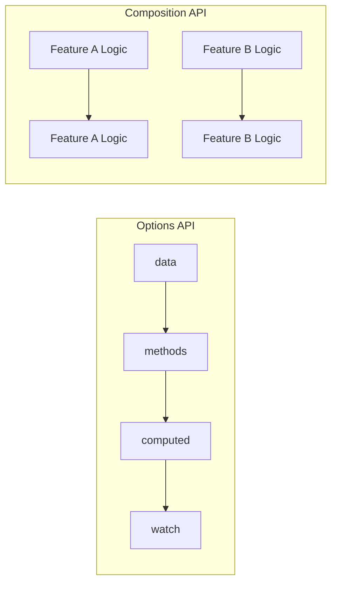

# How to Use Vue Composition API

Author: [nawazdhandala](https://www.github.com/nawazdhandala)

Tags: Vue.js, Composition API, JavaScript, Frontend, Reactivity

Description: A practical guide to using Vue's Composition API for building maintainable, reusable, and scalable frontend applications.

---

The Composition API was introduced in Vue 3 to address limitations in the Options API when building large-scale applications. Instead of organizing code by option types (data, methods, computed, watch), the Composition API lets you organize code by logical concerns, making it easier to extract and reuse logic across components.

## Why Use the Composition API?

The Options API works great for simple components, but as components grow, related logic gets scattered across multiple options. With the Composition API, you can:

- Group related logic together
- Extract and reuse logic via composables
- Get better TypeScript support
- Reduce "this" context confusion

Here's how the mental model shifts:



## Setting Up a Component with Composition API

The entry point to the Composition API is the `setup` function or the `<script setup>` syntax sugar.

### Using script setup (Recommended)

This example shows the basic structure of a Composition API component using the modern `<script setup>` syntax. Variables and functions declared at the top level are automatically available in the template.

```vue
<script setup>
import { ref, computed, onMounted } from 'vue'

// Reactive state - ref() wraps primitives to make them reactive
const count = ref(0)
const userName = ref('Guest')

// Computed property - automatically recalculates when dependencies change
const doubleCount = computed(() => count.value * 2)

// Methods - just regular functions
function increment() {
  count.value++
}

// Lifecycle hooks - called when component mounts
onMounted(() => {
  console.log('Component mounted, count is:', count.value)
})
</script>

<template>
  <div>
    <p>Hello, {{ userName }}</p>
    <p>Count: {{ count }}</p>
    <p>Double: {{ doubleCount }}</p>
    <button @click="increment">Increment</button>
  </div>
</template>
```

### Using the setup() Function

If you need more control or are working with the Options API alongside Composition API, use the `setup()` function. Note that you must return values for them to be accessible in the template.

```vue
<script>
import { ref, computed, onMounted } from 'vue'

export default {
  // setup() runs before component creation, before data/computed/methods
  setup() {
    const count = ref(0)
    const doubleCount = computed(() => count.value * 2)

    function increment() {
      count.value++
    }

    onMounted(() => {
      console.log('Mounted!')
    })

    // Everything returned is available in the template
    return {
      count,
      doubleCount,
      increment
    }
  }
}
</script>
```

## Reactive State with ref() and reactive()

Vue provides two main ways to create reactive state.

### ref() for Primitives and Objects

Use `ref()` when working with primitive values (strings, numbers, booleans) or when you need to reassign the entire value. Access the value using `.value` in JavaScript, but Vue automatically unwraps it in templates.

```vue
<script setup>
import { ref, watch } from 'vue'

// Primitives - must use .value to access/modify
const message = ref('Hello')
const isLoading = ref(false)
const count = ref(0)

// Objects - ref works here too, and is often preferred
const user = ref({
  name: 'John',
  email: 'john@example.com'
})

function updateMessage() {
  // Access value with .value in JavaScript
  message.value = 'Updated!'
}

function updateUser() {
  // Can reassign the entire object
  user.value = { name: 'Jane', email: 'jane@example.com' }

  // Or modify properties directly
  user.value.name = 'Bob'
}

// Watch a ref - callback fires when value changes
watch(count, (newVal, oldVal) => {
  console.log(`Count changed from ${oldVal} to ${newVal}`)
})
</script>

<template>
  <!-- No .value needed in templates - Vue unwraps automatically -->
  <p>{{ message }}</p>
  <p>{{ user.name }} - {{ user.email }}</p>
</template>
```

### reactive() for Objects

Use `reactive()` for objects when you don't need to reassign the entire object. It provides a more natural syntax without `.value`, but has limitations.

```vue
<script setup>
import { reactive, toRefs } from 'vue'

// reactive() makes entire object reactive without needing .value
const state = reactive({
  count: 0,
  user: {
    name: 'John',
    age: 30
  },
  items: []
})

function increment() {
  // Direct access - no .value needed
  state.count++
}

function addItem(item) {
  state.items.push(item)
}

// toRefs() lets you destructure while keeping reactivity
const { count, user } = toRefs(state)
// Now count is a ref, access with count.value
</script>

<template>
  <p>Count: {{ state.count }}</p>
  <p>User: {{ state.user.name }}, {{ state.user.age }}</p>
</template>
```

### When to Use ref() vs reactive()

| Use Case | Recommendation |
|----------|----------------|
| Primitive values (string, number, boolean) | `ref()` |
| Replacing entire object | `ref()` |
| Object that won't be reassigned | `reactive()` |
| Need to destructure | `ref()` or `toRefs()` |
| TypeScript projects | `ref()` (better type inference) |

## Computed Properties

Computed properties automatically track their reactive dependencies and only recalculate when those dependencies change.

```vue
<script setup>
import { ref, computed } from 'vue'

const firstName = ref('John')
const lastName = ref('Doe')
const items = ref([
  { name: 'Apple', price: 1.5, quantity: 3 },
  { name: 'Banana', price: 0.75, quantity: 5 }
])

// Simple computed - recalculates when firstName or lastName changes
const fullName = computed(() => `${firstName.value} ${lastName.value}`)

// Computed with complex logic
const cartTotal = computed(() => {
  return items.value.reduce((total, item) => {
    return total + (item.price * item.quantity)
  }, 0)
})

// Writable computed - useful for v-model on computed values
const fullNameWritable = computed({
  get() {
    return `${firstName.value} ${lastName.value}`
  },
  set(newValue) {
    // Split the input and update individual refs
    const parts = newValue.split(' ')
    firstName.value = parts[0] || ''
    lastName.value = parts.slice(1).join(' ') || ''
  }
})
</script>

<template>
  <p>{{ fullName }}</p>
  <p>Cart Total: ${{ cartTotal.toFixed(2) }}</p>
  <input v-model="fullNameWritable" placeholder="Enter full name">
</template>
```

## Watchers

Watchers let you perform side effects when reactive values change.

```vue
<script setup>
import { ref, watch, watchEffect } from 'vue'

const searchQuery = ref('')
const userId = ref(1)
const user = ref(null)

// Basic watch - runs when searchQuery changes
watch(searchQuery, (newQuery, oldQuery) => {
  console.log(`Search changed from "${oldQuery}" to "${newQuery}"`)
  // Debounced API call would go here
})

// Watch with options - immediate runs on mount, deep watches nested objects
watch(
  userId,
  async (newId) => {
    // Fetch user when ID changes
    const response = await fetch(`/api/users/${newId}`)
    user.value = await response.json()
  },
  { immediate: true } // Run immediately on component mount
)

// Watch multiple sources - fires when either changes
const firstName = ref('John')
const lastName = ref('Doe')

watch(
  [firstName, lastName],
  ([newFirst, newLast], [oldFirst, oldLast]) => {
    console.log(`Name changed from ${oldFirst} ${oldLast} to ${newFirst} ${newLast}`)
  }
)

// watchEffect - automatically tracks dependencies, runs immediately
watchEffect(() => {
  // This runs immediately and re-runs whenever searchQuery.value changes
  console.log('Current search:', searchQuery.value)
  document.title = searchQuery.value ? `Search: ${searchQuery.value}` : 'Home'
})
</script>
```

### watch vs watchEffect

| Feature | watch | watchEffect |
|---------|-------|-------------|
| Explicit dependencies | Yes | No (auto-tracked) |
| Access old value | Yes | No |
| Lazy by default | Yes | No (runs immediately) |
| Use case | Specific reactions | Side effects that depend on multiple values |

## Lifecycle Hooks

The Composition API provides lifecycle hooks as functions that you import and call inside `setup()`.

```vue
<script setup>
import {
  onBeforeMount,
  onMounted,
  onBeforeUpdate,
  onUpdated,
  onBeforeUnmount,
  onUnmounted,
  onErrorCaptured
} from 'vue'

// Before DOM is created
onBeforeMount(() => {
  console.log('Component is about to mount')
})

// DOM is ready - most common hook for data fetching
onMounted(() => {
  console.log('Component mounted, DOM is accessible')
  // Initialize third-party libraries, fetch data, set up subscriptions
})

// Before re-render due to reactive state change
onBeforeUpdate(() => {
  console.log('Component is about to re-render')
})

// After re-render
onUpdated(() => {
  console.log('Component re-rendered')
})

// Cleanup before component is destroyed
onBeforeUnmount(() => {
  console.log('Component is about to be destroyed')
  // Clean up timers, subscriptions, event listeners
})

// Component destroyed
onUnmounted(() => {
  console.log('Component destroyed')
})

// Capture errors from child components
onErrorCaptured((error, instance, info) => {
  console.error('Error captured:', error)
  return false // Prevent error from propagating
})
</script>
```

## Building Reusable Composables

Composables are the killer feature of the Composition API. They let you extract and reuse stateful logic across components.

### Example: useFetch Composable

This composable handles API fetching with loading and error states. It can be reused in any component that needs to fetch data.

```javascript
// composables/useFetch.js
import { ref, watchEffect, toValue } from 'vue'

export function useFetch(url) {
  const data = ref(null)
  const error = ref(null)
  const isLoading = ref(false)

  async function fetchData() {
    // toValue() unwraps refs or returns raw values
    const urlValue = toValue(url)

    isLoading.value = true
    error.value = null

    try {
      const response = await fetch(urlValue)
      if (!response.ok) {
        throw new Error(`HTTP error: ${response.status}`)
      }
      data.value = await response.json()
    } catch (e) {
      error.value = e.message
    } finally {
      isLoading.value = false
    }
  }

  // If url is reactive, refetch when it changes
  watchEffect(() => {
    fetchData()
  })

  // Return reactive values and refetch function
  return { data, error, isLoading, refetch: fetchData }
}
```

Using the composable in a component:

```vue
<script setup>
import { ref, computed } from 'vue'
import { useFetch } from '@/composables/useFetch'

const userId = ref(1)
// URL is computed so it reacts to userId changes
const url = computed(() => `https://api.example.com/users/${userId.value}`)

// Destructure reactive values from composable
const { data: user, error, isLoading } = useFetch(url)

function nextUser() {
  userId.value++
}
</script>

<template>
  <div v-if="isLoading">Loading...</div>
  <div v-else-if="error">Error: {{ error }}</div>
  <div v-else-if="user">
    <h2>{{ user.name }}</h2>
    <p>{{ user.email }}</p>
  </div>
  <button @click="nextUser">Next User</button>
</template>
```

### Example: useLocalStorage Composable

This composable syncs a reactive value with localStorage, persisting state across page reloads.

```javascript
// composables/useLocalStorage.js
import { ref, watch } from 'vue'

export function useLocalStorage(key, defaultValue) {
  // Initialize from localStorage or use default
  const stored = localStorage.getItem(key)
  const value = ref(stored ? JSON.parse(stored) : defaultValue)

  // Sync to localStorage whenever value changes
  watch(
    value,
    (newValue) => {
      if (newValue === null || newValue === undefined) {
        localStorage.removeItem(key)
      } else {
        localStorage.setItem(key, JSON.stringify(newValue))
      }
    },
    { deep: true } // Watch nested object changes
  )

  return value
}
```

Using it:

```vue
<script setup>
import { useLocalStorage } from '@/composables/useLocalStorage'

// This value persists across page reloads
const theme = useLocalStorage('theme', 'light')
const userPreferences = useLocalStorage('preferences', {
  notifications: true,
  language: 'en'
})

function toggleTheme() {
  theme.value = theme.value === 'light' ? 'dark' : 'light'
}
</script>

<template>
  <button @click="toggleTheme">
    Current theme: {{ theme }}
  </button>
</template>
```

### Example: useDebounce Composable

Debouncing is common for search inputs. This composable returns a debounced version of any reactive value.

```javascript
// composables/useDebounce.js
import { ref, watch } from 'vue'

export function useDebounce(value, delay = 300) {
  const debouncedValue = ref(value.value)
  let timeout = null

  watch(value, (newValue) => {
    // Clear previous timeout
    if (timeout) {
      clearTimeout(timeout)
    }
    // Set new timeout
    timeout = setTimeout(() => {
      debouncedValue.value = newValue
    }, delay)
  })

  return debouncedValue
}
```

Using it for a search input:

```vue
<script setup>
import { ref, watch } from 'vue'
import { useDebounce } from '@/composables/useDebounce'
import { useFetch } from '@/composables/useFetch'

const searchQuery = ref('')
// Only updates 500ms after user stops typing
const debouncedQuery = useDebounce(searchQuery, 500)

// API call only triggers on debounced value changes
const searchUrl = computed(() =>
  debouncedQuery.value
    ? `https://api.example.com/search?q=${debouncedQuery.value}`
    : null
)
const { data: results, isLoading } = useFetch(searchUrl)
</script>

<template>
  <input v-model="searchQuery" placeholder="Search...">
  <div v-if="isLoading">Searching...</div>
  <ul v-else-if="results">
    <li v-for="item in results" :key="item.id">{{ item.name }}</li>
  </ul>
</template>
```

## Props and Emits with Composition API

Handle component props and events in `<script setup>`.

```vue
<script setup>
import { computed, toRefs } from 'vue'

// Define props with types and defaults
const props = defineProps({
  title: {
    type: String,
    required: true
  },
  count: {
    type: Number,
    default: 0
  },
  user: {
    type: Object,
    default: () => ({ name: 'Guest' })
  }
})

// Define emits with validation
const emit = defineEmits({
  // No validation
  'update:count': null,
  // With validation - return false to warn in console
  'submit': (payload) => {
    if (!payload.email) {
      console.warn('Submit event requires email')
      return false
    }
    return true
  }
})

// Use toRefs to maintain reactivity when destructuring props
const { title, count } = toRefs(props)

// Computed based on props
const displayTitle = computed(() => `${title.value} (${count.value})`)

function increment() {
  // Emit event to parent for v-model support
  emit('update:count', props.count + 1)
}

function handleSubmit() {
  emit('submit', { email: 'user@example.com' })
}
</script>

<template>
  <div>
    <h1>{{ displayTitle }}</h1>
    <p>Hello, {{ user.name }}</p>
    <button @click="increment">Increment</button>
    <button @click="handleSubmit">Submit</button>
  </div>
</template>
```

## Template Refs

Access DOM elements or child component instances with template refs.

```vue
<script setup>
import { ref, onMounted } from 'vue'

// Create a ref with null initial value
const inputRef = ref(null)
const childComponentRef = ref(null)

onMounted(() => {
  // DOM element is now available
  inputRef.value.focus()

  // Access child component's exposed methods/properties
  console.log(childComponentRef.value.someExposedMethod())
})

function focusInput() {
  inputRef.value?.focus()
}
</script>

<template>
  <!-- Connect ref to element using same name -->
  <input ref="inputRef" type="text">
  <ChildComponent ref="childComponentRef" />
  <button @click="focusInput">Focus Input</button>
</template>
```

For child components, explicitly expose what parent can access:

```vue
<!-- ChildComponent.vue -->
<script setup>
import { ref } from 'vue'

const count = ref(0)
const privateData = ref('secret')

function increment() {
  count.value++
}

function reset() {
  count.value = 0
}

// Only these will be accessible via template ref
defineExpose({
  count,
  increment,
  reset
})
</script>
```

## Provide and Inject

Share data between ancestor and descendant components without prop drilling.

```vue
<!-- GrandparentComponent.vue -->
<script setup>
import { provide, ref, readonly } from 'vue'

const theme = ref('light')
const user = ref({ name: 'John', role: 'admin' })

function toggleTheme() {
  theme.value = theme.value === 'light' ? 'dark' : 'light'
}

// Provide reactive values to all descendants
provide('theme', readonly(theme)) // readonly prevents mutations
provide('user', user)
provide('toggleTheme', toggleTheme)
</script>
```

```vue
<!-- DeeplyNestedChild.vue -->
<script setup>
import { inject } from 'vue'

// Inject values provided by ancestor
const theme = inject('theme')
const user = inject('user')
const toggleTheme = inject('toggleTheme')

// With default value if not provided
const locale = inject('locale', 'en-US')
</script>

<template>
  <div :class="theme">
    <p>Hello, {{ user.name }}</p>
    <p>Locale: {{ locale }}</p>
    <button @click="toggleTheme">Toggle Theme</button>
  </div>
</template>
```

## TypeScript with Composition API

The Composition API has excellent TypeScript support.

```vue
<script setup lang="ts">
import { ref, computed, PropType } from 'vue'

// Typed refs
const count = ref<number>(0)
const user = ref<User | null>(null)
const items = ref<string[]>([])

// Interface for complex types
interface User {
  id: number
  name: string
  email: string
}

// Typed props
const props = defineProps<{
  title: string
  count?: number
  user: User
}>()

// Props with defaults using withDefaults
const propsWithDefaults = withDefaults(defineProps<{
  title: string
  count?: number
  items?: string[]
}>(), {
  count: 0,
  items: () => []
})

// Typed emits
const emit = defineEmits<{
  (e: 'update:count', value: number): void
  (e: 'submit', user: User): void
}>()

// Typed computed
const fullName = computed<string>(() => {
  return user.value ? user.value.name : 'Guest'
})

// Generic composable example
function useLocalStorage<T>(key: string, defaultValue: T) {
  const stored = localStorage.getItem(key)
  const value = ref<T>(stored ? JSON.parse(stored) : defaultValue)
  return value
}
</script>
```

## Summary

| Concept | Options API | Composition API |
|---------|-------------|-----------------|
| Reactive state | `data()` | `ref()`, `reactive()` |
| Computed | `computed: {}` | `computed()` |
| Methods | `methods: {}` | Plain functions |
| Watch | `watch: {}` | `watch()`, `watchEffect()` |
| Lifecycle | `mounted()`, etc. | `onMounted()`, etc. |
| Reusable logic | Mixins (problematic) | Composables |

The Composition API is not about replacing the Options API entirely. It's about giving you better tools for organizing complex logic, extracting reusable code, and building maintainable Vue applications at scale.

---

*Building complex Vue applications? [OneUptime](https://oneuptime.com) helps you monitor your frontend performance, track errors, and ensure your users have a great experience. Set up real user monitoring to catch issues before your users report them.*
