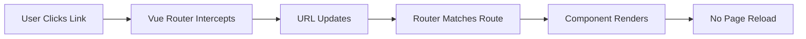
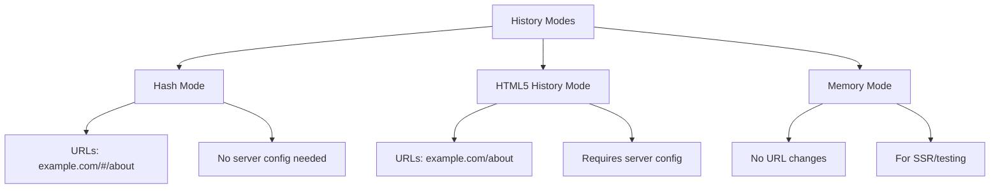
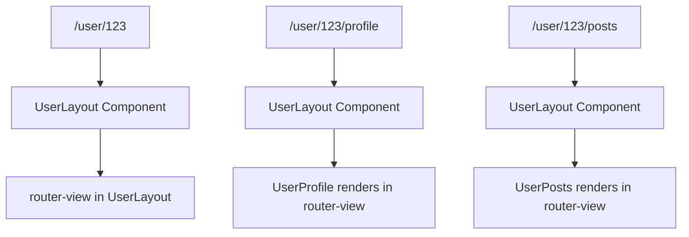
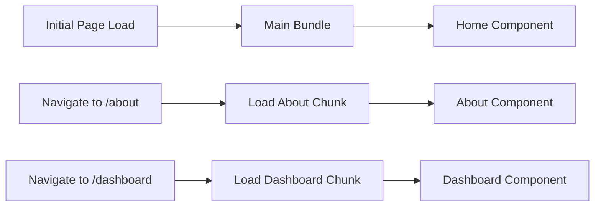
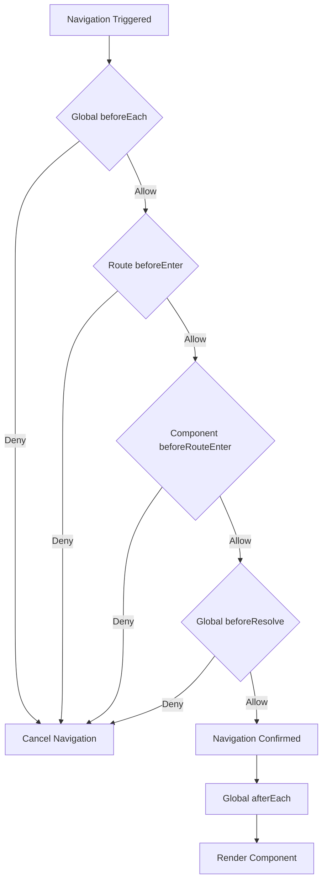

# How to Use Vue Router

Author: [nawazdhandala](https://www.github.com/nawazdhandala)

Tags: Vue.js, Vue Router, Routing, JavaScript, Frontend, SPA, Navigation, Web Development

Description: A comprehensive guide to using Vue Router in Vue.js applications. Learn installation, configuration, dynamic routing, nested routes, navigation guards, route parameters, and best practices for building single-page applications.

---

> Vue Router is the official routing library for Vue.js. It deeply integrates with Vue.js core to make building Single Page Applications (SPAs) with Vue.js a seamless experience.

This guide covers everything you need to know about Vue Router, from basic setup to advanced patterns for building production-ready applications.

---

## What is Vue Router?

Vue Router enables navigation between different views in a Vue.js application without requiring full page reloads. It provides a way to map URLs to components, creating a smooth, app-like experience for users.



### Key Features

- **Nested route/view mapping**: Create complex layouts with nested components
- **Dynamic routing**: Add routes at runtime
- **Route params and query**: Pass data through URLs
- **Navigation guards**: Control access to routes
- **Scroll behavior**: Customize scroll position on navigation
- **Lazy loading**: Load components on demand

---

## Installation

Before using Vue Router, you need to install it in your Vue.js project.

### Installing Vue Router with npm

The following command installs Vue Router 4, which is compatible with Vue 3.

```bash
# Install Vue Router for Vue 3
npm install vue-router@4
```

### Installing with Yarn

If you prefer Yarn as your package manager, use this command instead.

```bash
# Install Vue Router using Yarn
yarn add vue-router@4
```

### Creating a New Project with Vue Router

When creating a new Vue project, you can include Vue Router from the start.

```bash
# Create a new Vue project with routing enabled
npm create vue@latest my-app
# Select "Yes" when prompted for Vue Router
```

---

## Basic Configuration

Setting up Vue Router requires creating a router instance and registering it with your Vue application.

### Creating the Router Instance

This code creates a basic router configuration with two routes. The `createWebHistory` function enables HTML5 history mode for clean URLs without hash symbols.

```javascript
// src/router/index.js
import { createRouter, createWebHistory } from 'vue-router'

// Import your view components
import HomeView from '../views/HomeView.vue'
import AboutView from '../views/AboutView.vue'

// Define your routes as an array of route objects
// Each route maps a URL path to a component
const routes = [
  {
    path: '/',           // The URL path
    name: 'home',        // A unique name for the route
    component: HomeView  // The component to render
  },
  {
    path: '/about',
    name: 'about',
    component: AboutView
  }
]

// Create the router instance with history mode and routes
const router = createRouter({
  history: createWebHistory(import.meta.env.BASE_URL),
  routes
})

// Export the router for use in main.js
export default router
```

### Registering the Router with Vue

After creating the router, you must register it with your Vue application. This makes the router available to all components.

```javascript
// src/main.js
import { createApp } from 'vue'
import App from './App.vue'
import router from './router'

// Create the Vue app and use the router
const app = createApp(App)
app.use(router)  // Register the router plugin
app.mount('#app')
```

### Adding Router View to Your App

The `router-view` component is where matched route components are rendered. Place it in your App.vue to display routed content.

```vue
<!-- src/App.vue -->
<template>
  <div id="app">
    <!-- Navigation links -->
    <nav>
      <router-link to="/">Home</router-link>
      <router-link to="/about">About</router-link>
    </nav>

    <!-- This is where route components are rendered -->
    <router-view />
  </div>
</template>

<script setup>
// No additional script needed for basic routing
</script>

<style>
nav {
  padding: 20px;
}

nav a {
  margin-right: 15px;
  color: #42b983;
  text-decoration: none;
}

nav a.router-link-active {
  font-weight: bold;
}
</style>
```

---

## History Modes

Vue Router supports different history modes that affect how URLs appear and behave.



### Hash Mode

Hash mode uses the URL hash to simulate a full URL. It does not require any server configuration, making it suitable for static hosting.

```javascript
// Hash mode configuration
// URLs will look like: http://example.com/#/about
import { createRouter, createWebHashHistory } from 'vue-router'

const router = createRouter({
  history: createWebHashHistory(),
  routes
})
```

### HTML5 History Mode

History mode creates clean URLs without the hash. It requires server configuration to handle direct URL access.

```javascript
// HTML5 History mode configuration
// URLs will look like: http://example.com/about
import { createRouter, createWebHistory } from 'vue-router'

const router = createRouter({
  history: createWebHistory(),
  routes
})
```

### Server Configuration for History Mode

When using history mode, your server must be configured to return index.html for all routes. Here are examples for common servers.

```nginx
# Nginx configuration for history mode
# Add this to your server block
location / {
  try_files $uri $uri/ /index.html;
}
```

```apache
# Apache .htaccess configuration
<IfModule mod_rewrite.c>
  RewriteEngine On
  RewriteBase /
  RewriteRule ^index\.html$ - [L]
  RewriteCond %{REQUEST_FILENAME} !-f
  RewriteCond %{REQUEST_FILENAME} !-d
  RewriteRule . /index.html [L]
</IfModule>
```

---

## Dynamic Route Matching

Dynamic routes allow you to capture values from the URL and use them in your components.

### Basic Dynamic Routes

Use a colon to define dynamic segments in your route paths. The captured values are available as route params.

```javascript
// src/router/index.js
const routes = [
  {
    // :id is a dynamic segment that captures any value
    // /user/123 matches with params.id = '123'
    // /user/john matches with params.id = 'john'
    path: '/user/:id',
    name: 'user',
    component: () => import('../views/UserView.vue')
  },
  {
    // Multiple dynamic segments are supported
    // /posts/2024/01 matches with params.year = '2024', params.month = '01'
    path: '/posts/:year/:month',
    name: 'posts-archive',
    component: () => import('../views/PostsArchive.vue')
  }
]
```

### Accessing Route Parameters

You can access route parameters in your components using the Composition API or Options API.

```vue
<!-- src/views/UserView.vue -->
<template>
  <div class="user-profile">
    <h1>User Profile</h1>
    <p>User ID: {{ userId }}</p>
    <p>Full route params: {{ route.params }}</p>
  </div>
</template>

<script setup>
import { computed } from 'vue'
import { useRoute } from 'vue-router'

// Get the current route object
const route = useRoute()

// Access the id parameter from the URL
// Using computed ensures reactivity when params change
const userId = computed(() => route.params.id)
</script>
```

### Custom Regex Patterns

You can constrain dynamic segments using custom regular expressions. This allows for more precise route matching.

```javascript
// src/router/index.js
const routes = [
  {
    // Only match numeric IDs using a custom regex
    // /user/123 matches
    // /user/abc does not match
    path: '/user/:id(\\d+)',
    name: 'user-by-id',
    component: UserView
  },
  {
    // Match one or more path segments with +
    // /files/documents/report.pdf matches
    // params.pathMatch = ['documents', 'report.pdf']
    path: '/files/:pathMatch(.*)+',
    name: 'file-viewer',
    component: FileViewer
  },
  {
    // Optional parameter with ?
    // Both /users and /users/123 match
    path: '/users/:id?',
    name: 'users',
    component: UsersView
  }
]
```

---

## Nested Routes

Nested routes allow you to create complex layouts where child components render inside parent components.



### Defining Nested Routes

Use the `children` property to define routes that render inside a parent route's `router-view`.

```javascript
// src/router/index.js
const routes = [
  {
    path: '/user/:id',
    component: () => import('../views/UserLayout.vue'),
    // Children routes render inside the parent's router-view
    children: [
      {
        // When /user/123 is visited, UserHome renders in the nested router-view
        path: '',  // Empty path means this is the default child route
        name: 'user-home',
        component: () => import('../views/user/UserHome.vue')
      },
      {
        // When /user/123/profile is visited
        path: 'profile',
        name: 'user-profile',
        component: () => import('../views/user/UserProfile.vue')
      },
      {
        // When /user/123/posts is visited
        path: 'posts',
        name: 'user-posts',
        component: () => import('../views/user/UserPosts.vue')
      },
      {
        // When /user/123/settings is visited
        path: 'settings',
        name: 'user-settings',
        component: () => import('../views/user/UserSettings.vue'),
        // Nested routes can have their own children
        children: [
          {
            path: 'notifications',
            name: 'user-notifications',
            component: () => import('../views/user/settings/Notifications.vue')
          }
        ]
      }
    ]
  }
]
```

### Parent Layout Component

The parent component contains a `router-view` where child components are rendered.

```vue
<!-- src/views/UserLayout.vue -->
<template>
  <div class="user-layout">
    <!-- Shared header for all user pages -->
    <header class="user-header">
      <h1>User Dashboard</h1>
      <nav class="user-nav">
        <router-link :to="{ name: 'user-home', params: { id: userId } }">
          Home
        </router-link>
        <router-link :to="{ name: 'user-profile', params: { id: userId } }">
          Profile
        </router-link>
        <router-link :to="{ name: 'user-posts', params: { id: userId } }">
          Posts
        </router-link>
        <router-link :to="{ name: 'user-settings', params: { id: userId } }">
          Settings
        </router-link>
      </nav>
    </header>

    <!-- Child routes render here -->
    <main class="user-content">
      <router-view />
    </main>

    <!-- Shared footer for all user pages -->
    <footer class="user-footer">
      <p>User ID: {{ userId }}</p>
    </footer>
  </div>
</template>

<script setup>
import { computed } from 'vue'
import { useRoute } from 'vue-router'

const route = useRoute()
const userId = computed(() => route.params.id)
</script>

<style scoped>
.user-layout {
  display: flex;
  flex-direction: column;
  min-height: 100vh;
}

.user-nav {
  display: flex;
  gap: 1rem;
  padding: 1rem;
  background-color: #f5f5f5;
}

.user-content {
  flex: 1;
  padding: 2rem;
}
</style>
```

---

## Programmatic Navigation

Besides using `router-link` for navigation, you can navigate programmatically using the router instance.

### Using the Router Instance

The `useRouter` composable provides access to the router instance for programmatic navigation.

```vue
<template>
  <div>
    <button @click="goToHome">Go to Home</button>
    <button @click="goToUser(123)">View User 123</button>
    <button @click="goBack">Go Back</button>
    <button @click="goForward">Go Forward</button>
  </div>
</template>

<script setup>
import { useRouter } from 'vue-router'

// Get the router instance
const router = useRouter()

// Navigate to a path
function goToHome() {
  router.push('/')
}

// Navigate using a route name with params
function goToUser(id) {
  router.push({
    name: 'user',
    params: { id }
  })
}

// Navigate back in history
function goBack() {
  router.back()
  // Equivalent to: router.go(-1)
}

// Navigate forward in history
function goForward() {
  router.forward()
  // Equivalent to: router.go(1)
}
</script>
```

### Navigation Methods Comparison

Understanding the differences between push, replace, and go is essential for proper navigation.

```javascript
// src/composables/useNavigation.js
import { useRouter } from 'vue-router'

export function useNavigation() {
  const router = useRouter()

  // push - Adds a new entry to the history stack
  // User can click back to return to the previous page
  function navigateWithHistory(path) {
    router.push(path)
  }

  // replace - Replaces the current history entry
  // User cannot click back to return to the replaced page
  function navigateWithoutHistory(path) {
    router.replace(path)
  }

  // go - Navigate to a specific history entry
  // Positive numbers go forward, negative numbers go back
  function navigateInHistory(delta) {
    router.go(delta)
  }

  // Navigate with query parameters
  function navigateWithQuery(path, query) {
    router.push({
      path,
      query  // { search: 'vue', page: 1 } becomes ?search=vue&page=1
    })
  }

  // Navigate with hash
  function navigateWithHash(path, hash) {
    router.push({
      path,
      hash  // '#section' scrolls to element with id="section"
    })
  }

  return {
    navigateWithHistory,
    navigateWithoutHistory,
    navigateInHistory,
    navigateWithQuery,
    navigateWithHash
  }
}
```

### Handling Navigation Results

Navigation methods return a Promise that resolves when navigation completes or rejects if navigation fails.

```javascript
// Handling navigation results
async function handleNavigation() {
  try {
    // Wait for navigation to complete
    await router.push('/dashboard')
    console.log('Navigation successful')
  } catch (error) {
    // Handle navigation failure
    if (error.name === 'NavigationDuplicated') {
      // Trying to navigate to the same route
      console.log('Already on this page')
    } else {
      console.error('Navigation failed:', error)
    }
  }
}
```

---

## Named Routes and Views

Named routes provide a cleaner way to reference routes, and named views allow multiple router-views in a single layout.

### Using Named Routes

Named routes make your code more maintainable by decoupling navigation from URL paths.

```javascript
// src/router/index.js
const routes = [
  {
    path: '/products/:category/:id',
    name: 'product-detail',  // Give the route a unique name
    component: ProductDetail
  }
]
```

```vue
<!-- Using named routes in templates -->
<template>
  <div>
    <!-- Navigate using route name instead of path -->
    <router-link :to="{ name: 'product-detail', params: { category: 'electronics', id: 42 } }">
      View Product
    </router-link>

    <!-- The same navigation programmatically -->
    <button @click="viewProduct">View Product</button>
  </div>
</template>

<script setup>
import { useRouter } from 'vue-router'

const router = useRouter()

function viewProduct() {
  // Using named routes makes refactoring URLs easier
  // If you change the path, links using names still work
  router.push({
    name: 'product-detail',
    params: { category: 'electronics', id: 42 }
  })
}
</script>
```

### Named Views

Named views allow you to render multiple components for a single route, useful for complex layouts.

```javascript
// src/router/index.js
const routes = [
  {
    path: '/dashboard',
    // Use 'components' (plural) for named views
    components: {
      default: DashboardMain,    // Renders in <router-view />
      sidebar: DashboardSidebar, // Renders in <router-view name="sidebar" />
      header: DashboardHeader    // Renders in <router-view name="header" />
    }
  }
]
```

```vue
<!-- App.vue with named views -->
<template>
  <div class="app-layout">
    <!-- Named view for header -->
    <router-view name="header" class="app-header" />

    <div class="app-body">
      <!-- Named view for sidebar -->
      <router-view name="sidebar" class="app-sidebar" />

      <!-- Default (unnamed) view for main content -->
      <router-view class="app-main" />
    </div>
  </div>
</template>

<style>
.app-layout {
  display: flex;
  flex-direction: column;
  min-height: 100vh;
}

.app-body {
  display: flex;
  flex: 1;
}

.app-sidebar {
  width: 250px;
  background: #f0f0f0;
}

.app-main {
  flex: 1;
  padding: 20px;
}
</style>
```

---

## Route Meta Fields

Meta fields allow you to attach arbitrary data to routes, useful for authentication, permissions, and page configuration.

### Defining Meta Fields

Add a `meta` object to your route definitions to store custom data.

```javascript
// src/router/index.js
const routes = [
  {
    path: '/',
    name: 'home',
    component: HomeView,
    meta: {
      title: 'Home',
      requiresAuth: false,
      layout: 'default'
    }
  },
  {
    path: '/dashboard',
    name: 'dashboard',
    component: DashboardView,
    meta: {
      title: 'Dashboard',
      requiresAuth: true,     // User must be logged in
      roles: ['user', 'admin'], // Allowed roles
      layout: 'dashboard'
    }
  },
  {
    path: '/admin',
    name: 'admin',
    component: AdminView,
    meta: {
      title: 'Admin Panel',
      requiresAuth: true,
      roles: ['admin'],       // Only admins can access
      layout: 'admin'
    }
  }
]
```

### Accessing Meta Fields

Access meta fields through the route object to implement dynamic behavior.

```vue
<!-- src/App.vue -->
<template>
  <component :is="layoutComponent">
    <router-view />
  </component>
</template>

<script setup>
import { computed } from 'vue'
import { useRoute } from 'vue-router'
import DefaultLayout from './layouts/DefaultLayout.vue'
import DashboardLayout from './layouts/DashboardLayout.vue'
import AdminLayout from './layouts/AdminLayout.vue'

const route = useRoute()

// Dynamically select layout based on route meta
const layoutComponent = computed(() => {
  const layouts = {
    default: DefaultLayout,
    dashboard: DashboardLayout,
    admin: AdminLayout
  }
  // Access the layout from route meta, default to 'default'
  return layouts[route.meta.layout] || DefaultLayout
})
</script>
```

### Dynamic Page Title with Meta

Use meta fields to set the page title dynamically on navigation.

```javascript
// src/router/index.js
import { createRouter, createWebHistory } from 'vue-router'

const router = createRouter({
  history: createWebHistory(),
  routes
})

// Update document title on each navigation
router.afterEach((to) => {
  // Get title from route meta or use a default
  const title = to.meta.title || 'My Vue App'
  document.title = title
})

export default router
```

---

## Lazy Loading Routes

Lazy loading improves initial page load performance by splitting your application into smaller chunks that load on demand.



### Basic Lazy Loading

Use dynamic imports to lazy load route components. Webpack and Vite automatically create separate chunks for these imports.

```javascript
// src/router/index.js
const routes = [
  {
    path: '/',
    name: 'home',
    // Eager loading - included in main bundle
    component: HomeView
  },
  {
    path: '/about',
    name: 'about',
    // Lazy loading - loaded when route is visited
    // Creates a separate chunk file
    component: () => import('../views/AboutView.vue')
  },
  {
    path: '/dashboard',
    name: 'dashboard',
    // Named chunk for better debugging
    // Creates dashboard.js chunk
    component: () => import(/* webpackChunkName: "dashboard" */ '../views/DashboardView.vue')
  }
]
```

### Grouping Chunks

Group related routes into the same chunk to reduce the number of network requests.

```javascript
// src/router/index.js
const routes = [
  // All user routes in one chunk
  {
    path: '/user/:id',
    component: () => import(/* webpackChunkName: "user" */ '../views/UserLayout.vue'),
    children: [
      {
        path: '',
        // Same chunk name groups these together
        component: () => import(/* webpackChunkName: "user" */ '../views/user/UserHome.vue')
      },
      {
        path: 'profile',
        component: () => import(/* webpackChunkName: "user" */ '../views/user/UserProfile.vue')
      },
      {
        path: 'settings',
        component: () => import(/* webpackChunkName: "user" */ '../views/user/UserSettings.vue')
      }
    ]
  }
]
```

### Loading State for Lazy Routes

Show a loading indicator while lazy-loaded components are being fetched.

```vue
<!-- src/App.vue -->
<template>
  <Suspense>
    <template #default>
      <router-view />
    </template>
    <template #fallback>
      <div class="loading-container">
        <div class="loading-spinner"></div>
        <p>Loading...</p>
      </div>
    </template>
  </Suspense>
</template>

<style>
.loading-container {
  display: flex;
  flex-direction: column;
  align-items: center;
  justify-content: center;
  min-height: 200px;
}

.loading-spinner {
  width: 40px;
  height: 40px;
  border: 4px solid #f3f3f3;
  border-top: 4px solid #42b983;
  border-radius: 50%;
  animation: spin 1s linear infinite;
}

@keyframes spin {
  0% { transform: rotate(0deg); }
  100% { transform: rotate(360deg); }
}
</style>
```

---

## Route Query Parameters

Query parameters provide a way to pass optional data through the URL without affecting route matching.

### Reading Query Parameters

Access query parameters through the route object using the Composition API.

```vue
<!-- src/views/ProductsView.vue -->
<template>
  <div class="products">
    <h1>Products</h1>

    <!-- Filter controls -->
    <div class="filters">
      <select v-model="selectedCategory" @change="updateFilters">
        <option value="">All Categories</option>
        <option value="electronics">Electronics</option>
        <option value="clothing">Clothing</option>
      </select>

      <input
        v-model="searchQuery"
        @input="updateFilters"
        placeholder="Search products..."
      />

      <select v-model="sortBy" @change="updateFilters">
        <option value="name">Name</option>
        <option value="price">Price</option>
        <option value="date">Date</option>
      </select>
    </div>

    <!-- Current filters display -->
    <p>Category: {{ category || 'All' }}</p>
    <p>Search: {{ search || 'None' }}</p>
    <p>Sort: {{ sort }}</p>
    <p>Page: {{ page }}</p>
  </div>
</template>

<script setup>
import { ref, computed, watch } from 'vue'
import { useRoute, useRouter } from 'vue-router'

const route = useRoute()
const router = useRouter()

// Read query parameters with defaults
const category = computed(() => route.query.category || '')
const search = computed(() => route.query.search || '')
const sort = computed(() => route.query.sort || 'name')
const page = computed(() => parseInt(route.query.page) || 1)

// Local state for form controls
const selectedCategory = ref(category.value)
const searchQuery = ref(search.value)
const sortBy = ref(sort.value)

// Update URL when filters change
function updateFilters() {
  router.push({
    path: '/products',
    query: {
      // Only include non-empty values
      ...(selectedCategory.value && { category: selectedCategory.value }),
      ...(searchQuery.value && { search: searchQuery.value }),
      sort: sortBy.value,
      page: 1  // Reset to first page on filter change
    }
  })
}

// Watch for URL changes (browser back/forward)
watch(
  () => route.query,
  (newQuery) => {
    selectedCategory.value = newQuery.category || ''
    searchQuery.value = newQuery.search || ''
    sortBy.value = newQuery.sort || 'name'
  }
)
</script>
```

### Preserving Query Parameters

Sometimes you want to keep certain query parameters when navigating.

```javascript
// Preserve existing query parameters while adding new ones
function addQueryParam(key, value) {
  router.push({
    path: route.path,
    query: {
      ...route.query,  // Keep existing query params
      [key]: value     // Add or update the new param
    }
  })
}

// Remove a specific query parameter
function removeQueryParam(key) {
  const query = { ...route.query }
  delete query[key]
  router.push({
    path: route.path,
    query
  })
}
```

---

## Scroll Behavior

Vue Router allows you to customize scroll behavior when navigating between routes.

### Basic Scroll Configuration

Configure scroll behavior when creating the router instance.

```javascript
// src/router/index.js
import { createRouter, createWebHistory } from 'vue-router'

const router = createRouter({
  history: createWebHistory(),
  routes,
  // Customize scroll behavior
  scrollBehavior(to, from, savedPosition) {
    // savedPosition is available when using browser back/forward
    if (savedPosition) {
      // Return to saved position when using browser navigation
      return savedPosition
    }

    // Scroll to hash if present (e.g., #section-id)
    if (to.hash) {
      return {
        el: to.hash,          // Element selector
        behavior: 'smooth'    // Smooth scrolling animation
      }
    }

    // Default: scroll to top of page
    return { top: 0 }
  }
})
```

### Advanced Scroll Behavior

Implement more complex scroll behavior based on route meta or other conditions.

```javascript
// src/router/index.js
const router = createRouter({
  history: createWebHistory(),
  routes,
  scrollBehavior(to, from, savedPosition) {
    // Use saved position for browser back/forward
    if (savedPosition) {
      return savedPosition
    }

    // Handle hash scrolling with offset for fixed headers
    if (to.hash) {
      return {
        el: to.hash,
        top: 80,  // Offset for fixed header height
        behavior: 'smooth'
      }
    }

    // Check route meta for custom scroll behavior
    if (to.meta.scrollToTop === false) {
      // Don't scroll for this route
      return {}
    }

    // Smooth scroll to top for page transitions
    return new Promise((resolve) => {
      // Delay scroll to wait for transition
      setTimeout(() => {
        resolve({
          top: 0,
          behavior: 'smooth'
        })
      }, 300)  // Match your transition duration
    })
  }
})
```

---

## Error Handling and 404 Pages

Properly handle navigation errors and missing routes for a better user experience.

### Catch-All 404 Route

Add a catch-all route at the end of your routes array to handle unknown paths.

```javascript
// src/router/index.js
const routes = [
  // ... your other routes ...

  // Catch-all route for 404 errors
  // Must be at the end of the routes array
  {
    path: '/:pathMatch(.*)*',  // Match any path
    name: 'not-found',
    component: () => import('../views/NotFoundView.vue'),
    meta: {
      title: 'Page Not Found'
    }
  }
]
```

### 404 Page Component

Create a user-friendly 404 page that helps users navigate back to valid content.

```vue
<!-- src/views/NotFoundView.vue -->
<template>
  <div class="not-found">
    <h1>404</h1>
    <h2>Page Not Found</h2>
    <p>The page you are looking for does not exist or has been moved.</p>
    <p>Attempted URL: {{ attemptedPath }}</p>

    <div class="actions">
      <router-link to="/" class="btn btn-primary">
        Go to Home
      </router-link>
      <button @click="goBack" class="btn btn-secondary">
        Go Back
      </button>
    </div>
  </div>
</template>

<script setup>
import { computed } from 'vue'
import { useRoute, useRouter } from 'vue-router'

const route = useRoute()
const router = useRouter()

// Show the URL that was attempted
const attemptedPath = computed(() => route.fullPath)

function goBack() {
  // Go back in history, or go home if no history
  if (window.history.length > 2) {
    router.back()
  } else {
    router.push('/')
  }
}
</script>

<style scoped>
.not-found {
  text-align: center;
  padding: 60px 20px;
}

.not-found h1 {
  font-size: 120px;
  margin: 0;
  color: #42b983;
}

.not-found h2 {
  font-size: 28px;
  margin: 10px 0;
}

.actions {
  margin-top: 30px;
  display: flex;
  gap: 15px;
  justify-content: center;
}

.btn {
  padding: 12px 24px;
  border-radius: 4px;
  text-decoration: none;
  cursor: pointer;
}

.btn-primary {
  background-color: #42b983;
  color: white;
}

.btn-secondary {
  background-color: #ccc;
  color: #333;
  border: none;
}
</style>
```

### Navigation Error Handling

Handle navigation errors globally using the router's error handler.

```javascript
// src/router/index.js
import { createRouter, createWebHistory, isNavigationFailure, NavigationFailureType } from 'vue-router'

const router = createRouter({
  history: createWebHistory(),
  routes
})

// Global error handler for navigation failures
router.onError((error, to, from) => {
  console.error('Navigation error:', error)

  // Handle chunk loading errors (lazy loading failures)
  if (error.message.includes('Failed to fetch dynamically imported module')) {
    // Reload the page to get fresh assets
    window.location.reload()
  }
})

// Handle navigation failures
router.afterEach((to, from, failure) => {
  if (failure) {
    if (isNavigationFailure(failure, NavigationFailureType.duplicated)) {
      // Navigation to the same route
      console.log('Already on this page')
    } else if (isNavigationFailure(failure, NavigationFailureType.aborted)) {
      // Navigation was aborted by a guard
      console.log('Navigation was cancelled')
    } else if (isNavigationFailure(failure, NavigationFailureType.cancelled)) {
      // Navigation was cancelled by a new navigation
      console.log('Navigation was replaced by another navigation')
    }
  }
})

export default router
```

---

## Navigation Guards Overview

Navigation guards provide hooks to control navigation flow. For a deep dive into guards, see our dedicated guide on Vue Router Navigation Guards.



### Basic Authentication Guard

A simple example of protecting routes with authentication.

```javascript
// src/router/index.js
import { createRouter, createWebHistory } from 'vue-router'
import { useAuthStore } from '@/stores/auth'

const routes = [
  {
    path: '/login',
    name: 'login',
    component: () => import('../views/LoginView.vue'),
    meta: { requiresGuest: true }
  },
  {
    path: '/dashboard',
    name: 'dashboard',
    component: () => import('../views/DashboardView.vue'),
    meta: { requiresAuth: true }
  }
]

const router = createRouter({
  history: createWebHistory(),
  routes
})

// Global navigation guard
router.beforeEach((to, from) => {
  const authStore = useAuthStore()

  // Check if route requires authentication
  if (to.meta.requiresAuth && !authStore.isAuthenticated) {
    // Redirect to login with return URL
    return {
      name: 'login',
      query: { redirect: to.fullPath }
    }
  }

  // Prevent authenticated users from accessing guest-only pages
  if (to.meta.requiresGuest && authStore.isAuthenticated) {
    return { name: 'dashboard' }
  }

  // Allow navigation
  return true
})

export default router
```

---

## Best Practices

### Route Organization

Keep your routes organized and maintainable with proper file structure.

```javascript
// src/router/routes/index.js
// Main routes file that combines all route modules
import authRoutes from './auth'
import userRoutes from './user'
import adminRoutes from './admin'
import publicRoutes from './public'

export default [
  ...publicRoutes,
  ...authRoutes,
  ...userRoutes,
  ...adminRoutes,
  // 404 catch-all must be last
  {
    path: '/:pathMatch(.*)*',
    name: 'not-found',
    component: () => import('@/views/NotFoundView.vue')
  }
]
```

```javascript
// src/router/routes/user.js
// User-related routes
export default [
  {
    path: '/user/:id',
    component: () => import('@/views/UserLayout.vue'),
    meta: { requiresAuth: true },
    children: [
      {
        path: '',
        name: 'user-home',
        component: () => import('@/views/user/UserHome.vue')
      },
      {
        path: 'profile',
        name: 'user-profile',
        component: () => import('@/views/user/UserProfile.vue')
      }
    ]
  }
]
```

### Type Safety with TypeScript

Use TypeScript to add type safety to your router configuration.

```typescript
// src/router/types.ts
import type { RouteRecordRaw } from 'vue-router'

// Extend route meta with custom fields
declare module 'vue-router' {
  interface RouteMeta {
    title?: string
    requiresAuth?: boolean
    requiresGuest?: boolean
    roles?: string[]
    layout?: 'default' | 'dashboard' | 'admin'
  }
}

// Type-safe route definitions
export const routes: RouteRecordRaw[] = [
  {
    path: '/',
    name: 'home',
    component: () => import('@/views/HomeView.vue'),
    meta: {
      title: 'Home',
      requiresAuth: false,
      layout: 'default'
    }
  }
]
```

### Performance Tips

Optimize your router configuration for better performance.

```javascript
// 1. Use lazy loading for all non-critical routes
const routes = [
  // Eager load only the most critical route
  {
    path: '/',
    component: HomeView  // Included in main bundle
  },
  // Lazy load everything else
  {
    path: '/about',
    component: () => import('@/views/AboutView.vue')
  }
]

// 2. Prefetch important routes
// In your main layout or landing page
import { useRouter } from 'vue-router'

const router = useRouter()

// Prefetch routes the user is likely to visit
onMounted(() => {
  // This triggers the chunk download without navigating
  router.getRoutes()
    .filter(route => route.meta.prefetch)
    .forEach(route => {
      if (typeof route.components?.default === 'function') {
        route.components.default()
      }
    })
})

// 3. Use route-level code splitting with meaningful chunk names
{
  path: '/admin',
  component: () => import(/* webpackChunkName: "admin" */ '@/views/AdminView.vue')
}
```

---

## Summary

Vue Router is a powerful and flexible routing solution for Vue.js applications. This guide covered:

1. **Installation and Setup**: How to install Vue Router and configure it with your Vue application
2. **History Modes**: Choosing between hash mode and HTML5 history mode based on your deployment needs
3. **Dynamic Routes**: Capturing URL parameters and using custom regex patterns for route matching
4. **Nested Routes**: Creating complex layouts with parent-child route relationships
5. **Programmatic Navigation**: Navigating using JavaScript methods instead of links
6. **Named Routes and Views**: Using names for cleaner code and multiple router-views for complex layouts
7. **Route Meta Fields**: Attaching custom data to routes for authentication, titles, and layouts
8. **Lazy Loading**: Improving performance by loading route components on demand
9. **Query Parameters**: Passing and reading optional data through URLs
10. **Scroll Behavior**: Customizing scroll position on navigation
11. **Error Handling**: Creating 404 pages and handling navigation errors
12. **Navigation Guards**: Protecting routes and controlling navigation flow
13. **Best Practices**: Organizing routes, using TypeScript, and optimizing performance

With these concepts, you can build sophisticated single-page applications that provide smooth, app-like navigation experiences while maintaining clean, maintainable code.

For more advanced guard patterns and authentication strategies, see our guide on Vue Router Navigation Guards.
