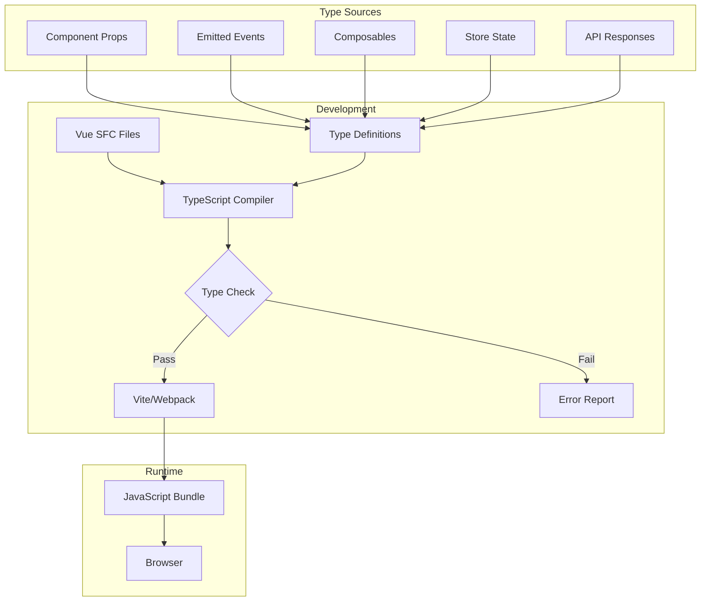
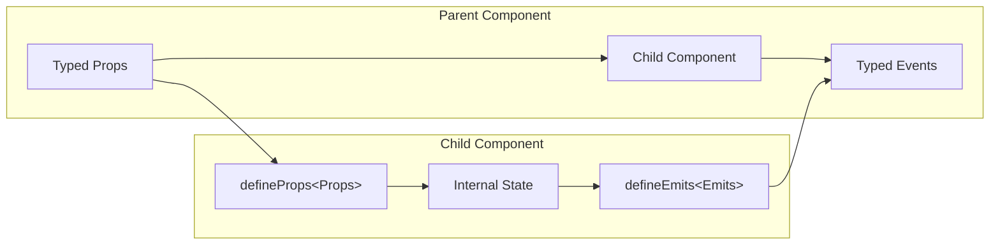
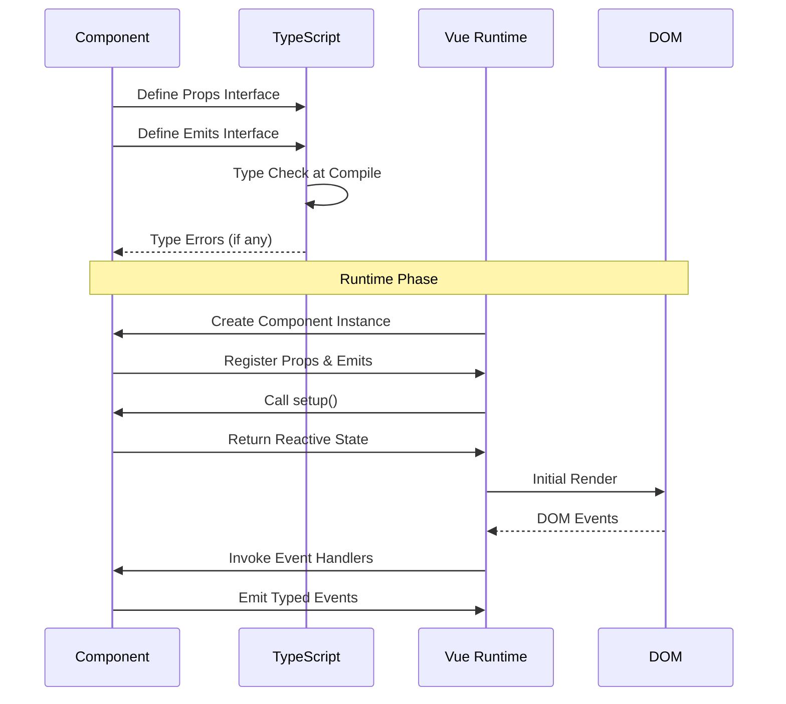

# How to Use Vue with TypeScript

Author: [nawazdhandala](https://www.github.com/nawazdhandala)

Tags: Vue, TypeScript, Frontend, Web Development, JavaScript, Type Safety, Vue 3, Composition API

Description: A hands-on guide to building Vue applications with TypeScript, covering component patterns, reactive data typing, event handling, API integration, and real-world examples for production-ready code.

---

> Vue 3 and TypeScript work together seamlessly, offering type inference, IDE autocomplete, and compile-time error detection. Mastering their integration leads to fewer bugs and more maintainable codebases.

Combining Vue with TypeScript transforms how you build frontend applications. Instead of discovering bugs at runtime, you catch them during development. Your IDE becomes smarter, offering precise autocomplete and refactoring support. The initial learning curve pays dividends across the entire project lifecycle.

---

## Why TypeScript with Vue?

| Benefit | Impact |
|---------|--------|
| **Compile-time errors** | Catch bugs before they reach production |
| **IDE intelligence** | Better autocomplete and refactoring |
| **Self-documenting code** | Types serve as inline documentation |
| **Refactoring confidence** | Change code without fear of breaking things |
| **Team collaboration** | Clearer contracts between components |

---

## Vue TypeScript Architecture



---

## Typing Reactive Data

Vue's reactivity system works flawlessly with TypeScript. Here's how to properly type your reactive state.

### Refs with Type Annotations

The ref function infers types automatically, but explicit annotations help when the initial value doesn't represent all possible states.

```typescript
// src/composables/useCounter.ts
import { ref, computed, watch } from 'vue'
import type { Ref, ComputedRef } from 'vue'

// Type inference works automatically for simple values
const count = ref(0)  // Ref<number>
const name = ref('Vue')  // Ref<string>

// Explicit typing is needed for complex or nullable types
const user = ref<User | null>(null)
const items = ref<Product[]>([])
const status = ref<'idle' | 'loading' | 'success' | 'error'>('idle')

// Interface for structured data
interface User {
  id: number
  name: string
  email: string
  role: 'admin' | 'editor' | 'viewer'
}

interface Product {
  id: string
  name: string
  price: number
  inStock: boolean
}

// Using typed refs in a composable
export function useUserManager() {
  const currentUser = ref<User | null>(null)
  const isLoading = ref(false)
  const errorMessage = ref<string | null>(null)

  // Computed values infer types from their return statements
  const isAuthenticated = computed(() => currentUser.value !== null)

  const userDisplayName = computed(() => {
    if (!currentUser.value) return 'Guest'
    return currentUser.value.name
  })

  // Watch with typed parameters
  watch(currentUser, (newUser, oldUser) => {
    // TypeScript knows newUser and oldUser are User | null
    if (newUser && !oldUser) {
      console.log(`User logged in: ${newUser.name}`)
    }
  })

  return {
    currentUser,
    isLoading,
    errorMessage,
    isAuthenticated,
    userDisplayName
  }
}
```

### Reactive Objects with Interfaces

For complex state objects, defining interfaces upfront keeps your code organized and type-safe.

```typescript
// src/types/app.ts
export interface AppState {
  theme: 'light' | 'dark' | 'system'
  language: string
  notifications: Notification[]
  settings: UserSettings
}

export interface Notification {
  id: string
  type: 'info' | 'warning' | 'error' | 'success'
  message: string
  timestamp: Date
  read: boolean
}

export interface UserSettings {
  emailNotifications: boolean
  pushNotifications: boolean
  timezone: string
  dateFormat: string
}
```

The reactive function preserves types when working with objects.

```typescript
// src/composables/useAppState.ts
import { reactive, toRefs } from 'vue'
import type { AppState } from '@/types/app'

export function useAppState() {
  // Reactive preserves the interface structure
  const state = reactive<AppState>({
    theme: 'system',
    language: 'en',
    notifications: [],
    settings: {
      emailNotifications: true,
      pushNotifications: false,
      timezone: 'UTC',
      dateFormat: 'YYYY-MM-DD'
    }
  })

  function setTheme(theme: AppState['theme']) {
    state.theme = theme
  }

  function addNotification(notification: Omit<Notification, 'id' | 'timestamp' | 'read'>) {
    state.notifications.push({
      ...notification,
      id: crypto.randomUUID(),
      timestamp: new Date(),
      read: false
    })
  }

  function markNotificationRead(id: string) {
    const notification = state.notifications.find(n => n.id === id)
    if (notification) {
      notification.read = true
    }
  }

  // toRefs maintains reactivity when destructuring
  return {
    ...toRefs(state),
    setTheme,
    addNotification,
    markNotificationRead
  }
}
```

---

## Component Props and Events

Defining props and events with TypeScript provides compile-time validation and better IDE support.

### Typed Props with Defaults

The defineProps macro accepts a TypeScript interface, making prop definitions clean and type-safe.

```vue
<!-- src/components/UserProfile.vue -->
<script setup lang="ts">
// Define the shape of user data
interface UserData {
  id: number
  name: string
  email: string
  avatar?: string
  joinDate: Date
  role: 'admin' | 'moderator' | 'member'
}

// Props interface defines all component inputs
interface Props {
  user: UserData
  showEmail?: boolean
  compact?: boolean
  maxBioLength?: number
}

// withDefaults provides default values while maintaining types
const props = withDefaults(defineProps<Props>(), {
  showEmail: true,
  compact: false,
  maxBioLength: 200
})

// Access props with full type safety
const formattedJoinDate = computed(() => {
  return props.user.joinDate.toLocaleDateString('en-US', {
    year: 'numeric',
    month: 'long',
    day: 'numeric'
  })
})

// Role-based styling
const roleColor = computed(() => {
  const colors: Record<UserData['role'], string> = {
    admin: 'text-red-600',
    moderator: 'text-blue-600',
    member: 'text-gray-600'
  }
  return colors[props.user.role]
})
</script>

<template>
  <div :class="{ 'p-4': !compact, 'p-2': compact }">
    <div class="flex items-center gap-3">
      
      <div>
        <h3 :class="roleColor">{{ user.name }}</h3>
        <p v-if="showEmail" class="text-sm text-gray-500">{{ user.email }}</p>
        <p v-if="!compact" class="text-xs text-gray-400">
          Member since {{ formattedJoinDate }}
        </p>
      </div>
    </div>
  </div>
</template>
```

### Typed Events with Payloads

Event definitions ensure both the emitting component and parent components agree on event shapes.

```vue
<!-- src/components/TaskItem.vue -->
<script setup lang="ts">
import { ref, computed } from 'vue'

interface Task {
  id: string
  title: string
  description: string
  priority: 'low' | 'medium' | 'high'
  completed: boolean
  dueDate: Date | null
}

interface Props {
  task: Task
}

// Define events with their payload types
// The tuple syntax (Vue 3.3+) provides named parameters
interface Emits {
  (e: 'update', task: Task): void
  (e: 'delete', taskId: string): void
  (e: 'toggleComplete', taskId: string, completed: boolean): void
  (e: 'priorityChange', taskId: string, priority: Task['priority']): void
}

const props = defineProps<Props>()
const emit = defineEmits<Emits>()

const isEditing = ref(false)
const editedTitle = ref('')
const editedDescription = ref('')

// Computed property for priority badge styling
const priorityBadge = computed(() => {
  const badges: Record<Task['priority'], { bg: string; text: string }> = {
    low: { bg: 'bg-green-100', text: 'text-green-800' },
    medium: { bg: 'bg-yellow-100', text: 'text-yellow-800' },
    high: { bg: 'bg-red-100', text: 'text-red-800' }
  }
  return badges[props.task.priority]
})

function startEditing() {
  editedTitle.value = props.task.title
  editedDescription.value = props.task.description
  isEditing.value = true
}

function saveChanges() {
  // Emit the updated task with type safety
  emit('update', {
    ...props.task,
    title: editedTitle.value,
    description: editedDescription.value
  })
  isEditing.value = false
}

function handleToggle() {
  emit('toggleComplete', props.task.id, !props.task.completed)
}

function handleDelete() {
  emit('delete', props.task.id)
}

function changePriority(newPriority: Task['priority']) {
  emit('priorityChange', props.task.id, newPriority)
}
</script>

<template>
  <div class="border rounded-lg p-4" :class="{ 'opacity-50': task.completed }">
    <div v-if="!isEditing" class="flex justify-between items-start">
      <div class="flex items-center gap-3">
        <input
          type="checkbox"
          :checked="task.completed"
          @change="handleToggle"
        />
        <div>
          <h4 :class="{ 'line-through': task.completed }">{{ task.title }}</h4>
          <p class="text-sm text-gray-500">{{ task.description }}</p>
        </div>
      </div>
      <div class="flex items-center gap-2">
        <span
          :class="[priorityBadge.bg, priorityBadge.text]"
          class="px-2 py-1 rounded text-xs"
        >
          {{ task.priority }}
        </span>
        <button @click="startEditing">Edit</button>
        <button @click="handleDelete" class="text-red-600">Delete</button>
      </div>
    </div>

    <div v-else class="space-y-3">
      <input v-model="editedTitle" class="w-full border rounded px-2 py-1" />
      <textarea v-model="editedDescription" class="w-full border rounded px-2 py-1" />
      <div class="flex gap-2">
        <button @click="saveChanges" class="bg-blue-500 text-white px-3 py-1 rounded">
          Save
        </button>
        <button @click="isEditing = false">Cancel</button>
      </div>
    </div>
  </div>
</template>
```

---

## Data Flow with TypeScript



---

## API Integration Patterns

TypeScript shines when working with external APIs. Defining response types catches data shape mismatches early.

### Typed API Client

Creating a reusable API client with TypeScript ensures consistent error handling and response typing.

```typescript
// src/api/client.ts
interface ApiError {
  message: string
  code: string
  details?: Record<string, string[]>
}

interface ApiResponse<T> {
  data: T
  meta?: {
    page: number
    perPage: number
    total: number
    totalPages: number
  }
}

// Result type for explicit error handling
type Result<T, E = ApiError> =
  | { success: true; data: T }
  | { success: false; error: E }

class ApiClient {
  private baseUrl: string
  private headers: HeadersInit

  constructor(baseUrl: string) {
    this.baseUrl = baseUrl
    this.headers = {
      'Content-Type': 'application/json'
    }
  }

  setAuthToken(token: string) {
    this.headers = {
      ...this.headers,
      Authorization: `Bearer ${token}`
    }
  }

  // Generic GET method with typed response
  async get<T>(endpoint: string): Promise<Result<T>> {
    try {
      const response = await fetch(`${this.baseUrl}${endpoint}`, {
        method: 'GET',
        headers: this.headers
      })

      if (!response.ok) {
        const error: ApiError = await response.json()
        return { success: false, error }
      }

      const data: T = await response.json()
      return { success: true, data }
    } catch (err) {
      return {
        success: false,
        error: {
          message: err instanceof Error ? err.message : 'Network error',
          code: 'NETWORK_ERROR'
        }
      }
    }
  }

  // Generic POST method
  async post<T, B = unknown>(endpoint: string, body: B): Promise<Result<T>> {
    try {
      const response = await fetch(`${this.baseUrl}${endpoint}`, {
        method: 'POST',
        headers: this.headers,
        body: JSON.stringify(body)
      })

      if (!response.ok) {
        const error: ApiError = await response.json()
        return { success: false, error }
      }

      const data: T = await response.json()
      return { success: true, data }
    } catch (err) {
      return {
        success: false,
        error: {
          message: err instanceof Error ? err.message : 'Network error',
          code: 'NETWORK_ERROR'
        }
      }
    }
  }

  // Generic PUT method
  async put<T, B = unknown>(endpoint: string, body: B): Promise<Result<T>> {
    try {
      const response = await fetch(`${this.baseUrl}${endpoint}`, {
        method: 'PUT',
        headers: this.headers,
        body: JSON.stringify(body)
      })

      if (!response.ok) {
        const error: ApiError = await response.json()
        return { success: false, error }
      }

      const data: T = await response.json()
      return { success: true, data }
    } catch (err) {
      return {
        success: false,
        error: {
          message: err instanceof Error ? err.message : 'Network error',
          code: 'NETWORK_ERROR'
        }
      }
    }
  }

  // Generic DELETE method
  async delete<T = void>(endpoint: string): Promise<Result<T>> {
    try {
      const response = await fetch(`${this.baseUrl}${endpoint}`, {
        method: 'DELETE',
        headers: this.headers
      })

      if (!response.ok) {
        const error: ApiError = await response.json()
        return { success: false, error }
      }

      // Some DELETE endpoints return no content
      if (response.status === 204) {
        return { success: true, data: undefined as T }
      }

      const data: T = await response.json()
      return { success: true, data }
    } catch (err) {
      return {
        success: false,
        error: {
          message: err instanceof Error ? err.message : 'Network error',
          code: 'NETWORK_ERROR'
        }
      }
    }
  }
}

export const api = new ApiClient(import.meta.env.VITE_API_URL)
```

### Domain-Specific API Modules

Organize API calls by domain with strongly typed request and response objects.

```typescript
// src/api/users.ts
import { api } from './client'

// Request/Response types for the users domain
export interface User {
  id: number
  email: string
  name: string
  avatar: string | null
  createdAt: string
  updatedAt: string
}

export interface CreateUserRequest {
  email: string
  name: string
  password: string
}

export interface UpdateUserRequest {
  name?: string
  avatar?: string
}

export interface UsersListResponse {
  users: User[]
  pagination: {
    page: number
    perPage: number
    total: number
  }
}

// Typed API functions
export const usersApi = {
  list: (page = 1, perPage = 20) =>
    api.get<UsersListResponse>(`/users?page=${page}&perPage=${perPage}`),

  getById: (id: number) =>
    api.get<User>(`/users/${id}`),

  create: (data: CreateUserRequest) =>
    api.post<User, CreateUserRequest>('/users', data),

  update: (id: number, data: UpdateUserRequest) =>
    api.put<User, UpdateUserRequest>(`/users/${id}`, data),

  delete: (id: number) =>
    api.delete(`/users/${id}`)
}
```

### Using the API in Components

The typed API makes consuming data in components straightforward and safe.

```vue
<!-- src/views/UsersView.vue -->
<script setup lang="ts">
import { ref, onMounted } from 'vue'
import { usersApi, type User } from '@/api/users'

const users = ref<User[]>([])
const isLoading = ref(true)
const error = ref<string | null>(null)
const currentPage = ref(1)
const totalPages = ref(1)

async function fetchUsers(page: number) {
  isLoading.value = true
  error.value = null

  const result = await usersApi.list(page)

  if (result.success) {
    users.value = result.data.users
    currentPage.value = result.data.pagination.page
    totalPages.value = Math.ceil(
      result.data.pagination.total / result.data.pagination.perPage
    )
  } else {
    error.value = result.error.message
  }

  isLoading.value = false
}

async function deleteUser(id: number) {
  const result = await usersApi.delete(id)

  if (result.success) {
    // Remove from local state
    users.value = users.value.filter(u => u.id !== id)
  } else {
    error.value = result.error.message
  }
}

onMounted(() => fetchUsers(1))
</script>

<template>
  <div class="container mx-auto p-4">
    <h1 class="text-2xl font-bold mb-4">Users</h1>

    <div v-if="isLoading" class="text-center py-8">
      Loading users...
    </div>

    <div v-else-if="error" class="bg-red-100 text-red-700 p-4 rounded">
      {{ error }}
    </div>

    <div v-else>
      <ul class="space-y-2">
        <li
          v-for="user in users"
          :key="user.id"
          class="flex justify-between items-center p-3 border rounded"
        >
          <div>
            <strong>{{ user.name }}</strong>
            <span class="text-gray-500 ml-2">{{ user.email }}</span>
          </div>
          <button
            @click="deleteUser(user.id)"
            class="text-red-600 hover:text-red-800"
          >
            Delete
          </button>
        </li>
      </ul>

      <div class="flex justify-center gap-2 mt-4">
        <button
          v-for="page in totalPages"
          :key="page"
          @click="fetchUsers(page)"
          :class="page === currentPage ? 'bg-blue-500 text-white' : 'bg-gray-200'"
          class="px-3 py-1 rounded"
        >
          {{ page }}
        </button>
      </div>
    </div>
  </div>
</template>
```

---

## Form Handling with TypeScript

Forms benefit greatly from type safety, especially when dealing with validation and submission.

### Typed Form State and Validation

Creating a reusable form composable with TypeScript provides consistent form behavior across your application.

```typescript
// src/composables/useForm.ts
import { ref, computed, reactive } from 'vue'
import type { Ref, ComputedRef } from 'vue'

// Validation rule type
type ValidationRule<T> = (value: T) => string | true

// Form field configuration
interface FieldConfig<T> {
  initialValue: T
  rules?: ValidationRule<T>[]
}

// Form configuration type
type FormConfig<T> = {
  [K in keyof T]: FieldConfig<T[K]>
}

// Form field state
interface FieldState<T> {
  value: T
  error: string | null
  touched: boolean
}

// Form state type
type FormState<T> = {
  [K in keyof T]: FieldState<T[K]>
}

// Return type for useForm
interface UseFormReturn<T> {
  fields: FormState<T>
  values: ComputedRef<T>
  errors: ComputedRef<Partial<Record<keyof T, string>>>
  isValid: ComputedRef<boolean>
  isDirty: ComputedRef<boolean>
  validate: () => boolean
  validateField: (field: keyof T) => boolean
  reset: () => void
  setFieldValue: <K extends keyof T>(field: K, value: T[K]) => void
}

export function useForm<T extends Record<string, unknown>>(
  config: FormConfig<T>
): UseFormReturn<T> {
  // Initialize form state
  const fields = reactive<FormState<T>>(
    Object.entries(config).reduce((acc, [key, fieldConfig]) => {
      acc[key as keyof T] = {
        value: fieldConfig.initialValue,
        error: null,
        touched: false
      }
      return acc
    }, {} as FormState<T>)
  )

  // Store initial values for reset
  const initialValues = Object.entries(config).reduce((acc, [key, fieldConfig]) => {
    acc[key as keyof T] = fieldConfig.initialValue
    return acc
  }, {} as T)

  // Computed current values
  const values = computed<T>(() => {
    return Object.entries(fields).reduce((acc, [key, field]) => {
      acc[key as keyof T] = field.value
      return acc
    }, {} as T)
  })

  // Computed errors
  const errors = computed(() => {
    return Object.entries(fields).reduce((acc, [key, field]) => {
      if (field.error) {
        acc[key as keyof T] = field.error
      }
      return acc
    }, {} as Partial<Record<keyof T, string>>)
  })

  // Check if form is valid
  const isValid = computed(() => {
    return Object.values(fields).every(field => !field.error)
  })

  // Check if form has been modified
  const isDirty = computed(() => {
    return Object.entries(fields).some(([key, field]) => {
      return field.value !== initialValues[key as keyof T]
    })
  })

  // Validate a single field
  function validateField(fieldName: keyof T): boolean {
    const field = fields[fieldName]
    const fieldConfig = config[fieldName]

    if (!fieldConfig.rules) {
      field.error = null
      return true
    }

    for (const rule of fieldConfig.rules) {
      const result = rule(field.value)
      if (result !== true) {
        field.error = result
        return false
      }
    }

    field.error = null
    return true
  }

  // Validate all fields
  function validate(): boolean {
    let isValid = true
    for (const fieldName of Object.keys(fields) as (keyof T)[]) {
      fields[fieldName].touched = true
      if (!validateField(fieldName)) {
        isValid = false
      }
    }
    return isValid
  }

  // Reset form to initial state
  function reset() {
    for (const [key, fieldConfig] of Object.entries(config)) {
      const field = fields[key as keyof T]
      field.value = fieldConfig.initialValue
      field.error = null
      field.touched = false
    }
  }

  // Set field value programmatically
  function setFieldValue<K extends keyof T>(fieldName: K, value: T[K]) {
    fields[fieldName].value = value
    fields[fieldName].touched = true
    validateField(fieldName)
  }

  return {
    fields,
    values,
    errors,
    isValid,
    isDirty,
    validate,
    validateField,
    reset,
    setFieldValue
  }
}

// Common validation rules
export const validators = {
  required: (message = 'Required') =>
    (value: unknown): string | true => {
      if (value === null || value === undefined || value === '') {
        return message
      }
      return true
    },

  email: (message = 'Invalid email') =>
    (value: string): string | true => {
      const emailRegex = /^[^\s@]+@[^\s@]+\.[^\s@]+$/
      if (!emailRegex.test(value)) {
        return message
      }
      return true
    },

  minLength: (min: number, message?: string) =>
    (value: string): string | true => {
      if (value.length < min) {
        return message || `Must be at least ${min} characters`
      }
      return true
    },

  maxLength: (max: number, message?: string) =>
    (value: string): string | true => {
      if (value.length > max) {
        return message || `Must be at most ${max} characters`
      }
      return true
    },

  pattern: (regex: RegExp, message: string) =>
    (value: string): string | true => {
      if (!regex.test(value)) {
        return message
      }
      return true
    }
}
```

### Using the Form Composable

Apply the typed form composable to create validated forms with minimal boilerplate.

```vue
<!-- src/components/RegistrationForm.vue -->
<script setup lang="ts">
import { useForm, validators } from '@/composables/useForm'
import { usersApi } from '@/api/users'
import { ref } from 'vue'

// Define form data shape
interface RegistrationFormData {
  name: string
  email: string
  password: string
  confirmPassword: string
}

// Initialize form with typed configuration
const { fields, values, errors, isValid, validate, reset } = useForm<RegistrationFormData>({
  name: {
    initialValue: '',
    rules: [
      validators.required('Name is required'),
      validators.minLength(2, 'Name must be at least 2 characters')
    ]
  },
  email: {
    initialValue: '',
    rules: [
      validators.required('Email is required'),
      validators.email('Please enter a valid email')
    ]
  },
  password: {
    initialValue: '',
    rules: [
      validators.required('Password is required'),
      validators.minLength(8, 'Password must be at least 8 characters'),
      validators.pattern(
        /^(?=.*[a-z])(?=.*[A-Z])(?=.*\d)/,
        'Password must contain uppercase, lowercase, and number'
      )
    ]
  },
  confirmPassword: {
    initialValue: '',
    rules: [
      validators.required('Please confirm your password'),
      (value) => {
        if (value !== fields.password.value) {
          return 'Passwords do not match'
        }
        return true
      }
    ]
  }
})

const isSubmitting = ref(false)
const submitError = ref<string | null>(null)
const submitSuccess = ref(false)

async function handleSubmit() {
  submitError.value = null

  if (!validate()) {
    return
  }

  isSubmitting.value = true

  const result = await usersApi.create({
    name: values.value.name,
    email: values.value.email,
    password: values.value.password
  })

  isSubmitting.value = false

  if (result.success) {
    submitSuccess.value = true
    reset()
  } else {
    submitError.value = result.error.message
  }
}

function handleBlur(fieldName: keyof RegistrationFormData) {
  fields[fieldName].touched = true
}
</script>

<template>
  <form @submit.prevent="handleSubmit" class="max-w-md mx-auto space-y-4">
    <h2 class="text-xl font-bold">Create Account</h2>

    <div v-if="submitSuccess" class="bg-green-100 text-green-700 p-4 rounded">
      Account created successfully!
    </div>

    <div v-if="submitError" class="bg-red-100 text-red-700 p-4 rounded">
      {{ submitError }}
    </div>

    <div>
      <label class="block text-sm font-medium mb-1">Name</label>
      <input
        v-model="fields.name.value"
        @blur="handleBlur('name')"
        type="text"
        class="w-full border rounded px-3 py-2"
        :class="{ 'border-red-500': fields.name.touched && fields.name.error }"
      />
      <p
        v-if="fields.name.touched && fields.name.error"
        class="text-red-500 text-sm mt-1"
      >
        {{ fields.name.error }}
      </p>
    </div>

    <div>
      <label class="block text-sm font-medium mb-1">Email</label>
      <input
        v-model="fields.email.value"
        @blur="handleBlur('email')"
        type="email"
        class="w-full border rounded px-3 py-2"
        :class="{ 'border-red-500': fields.email.touched && fields.email.error }"
      />
      <p
        v-if="fields.email.touched && fields.email.error"
        class="text-red-500 text-sm mt-1"
      >
        {{ fields.email.error }}
      </p>
    </div>

    <div>
      <label class="block text-sm font-medium mb-1">Password</label>
      <input
        v-model="fields.password.value"
        @blur="handleBlur('password')"
        type="password"
        class="w-full border rounded px-3 py-2"
        :class="{ 'border-red-500': fields.password.touched && fields.password.error }"
      />
      <p
        v-if="fields.password.touched && fields.password.error"
        class="text-red-500 text-sm mt-1"
      >
        {{ fields.password.error }}
      </p>
    </div>

    <div>
      <label class="block text-sm font-medium mb-1">Confirm Password</label>
      <input
        v-model="fields.confirmPassword.value"
        @blur="handleBlur('confirmPassword')"
        type="password"
        class="w-full border rounded px-3 py-2"
        :class="{ 'border-red-500': fields.confirmPassword.touched && fields.confirmPassword.error }"
      />
      <p
        v-if="fields.confirmPassword.touched && fields.confirmPassword.error"
        class="text-red-500 text-sm mt-1"
      >
        {{ fields.confirmPassword.error }}
      </p>
    </div>

    <button
      type="submit"
      :disabled="isSubmitting"
      class="w-full bg-blue-500 text-white py-2 rounded hover:bg-blue-600 disabled:opacity-50"
    >
      {{ isSubmitting ? 'Creating Account...' : 'Create Account' }}
    </button>
  </form>
</template>
```

---

## Generic Components

Vue 3.3 introduced native generic component support, enabling truly reusable typed components.

### Building a Generic Data Table

A data table component that maintains type safety for any data structure demonstrates the power of generics.

```vue
<!-- src/components/DataTable.vue -->
<script setup lang="ts" generic="T extends Record<string, unknown>">
import { computed } from 'vue'

// Column definition with typed accessors
interface Column<T> {
  key: keyof T | string
  label: string
  sortable?: boolean
  width?: string
  align?: 'left' | 'center' | 'right'
  // Custom formatter receives the full row and returns display value
  format?: (value: unknown, row: T) => string
}

interface Props {
  data: T[]
  columns: Column<T>[]
  keyField: keyof T
  loading?: boolean
  emptyMessage?: string
}

interface Emits {
  (e: 'rowClick', row: T): void
  (e: 'sort', column: keyof T, direction: 'asc' | 'desc'): void
}

const props = withDefaults(defineProps<Props>(), {
  loading: false,
  emptyMessage: 'No data available'
})

const emit = defineEmits<Emits>()

// Get cell value with dot notation support
function getCellValue(row: T, key: string): unknown {
  if (key.includes('.')) {
    return key.split('.').reduce((obj, k) => {
      return obj && typeof obj === 'object' ? (obj as Record<string, unknown>)[k] : undefined
    }, row as unknown)
  }
  return row[key as keyof T]
}

// Format cell value
function formatCell(row: T, column: Column<T>): string {
  const value = getCellValue(row, column.key as string)

  if (column.format) {
    return column.format(value, row)
  }

  if (value === null || value === undefined) {
    return '-'
  }

  return String(value)
}

function handleRowClick(row: T) {
  emit('rowClick', row)
}
</script>

<template>
  <div class="overflow-x-auto">
    <table class="min-w-full divide-y divide-gray-200">
      <thead class="bg-gray-50">
        <tr>
          <th
            v-for="column in columns"
            :key="String(column.key)"
            :style="{ width: column.width }"
            :class="[
              'px-6 py-3 text-xs font-medium text-gray-500 uppercase tracking-wider',
              column.align === 'right' ? 'text-right' : column.align === 'center' ? 'text-center' : 'text-left'
            ]"
          >
            {{ column.label }}
          </th>
        </tr>
      </thead>

      <tbody class="bg-white divide-y divide-gray-200">
        <tr v-if="loading">
          <td :colspan="columns.length" class="px-6 py-4 text-center text-gray-500">
            Loading...
          </td>
        </tr>

        <tr v-else-if="data.length === 0">
          <td :colspan="columns.length" class="px-6 py-4 text-center text-gray-500">
            {{ emptyMessage }}
          </td>
        </tr>

        <tr
          v-else
          v-for="row in data"
          :key="String(row[keyField])"
          @click="handleRowClick(row)"
          class="hover:bg-gray-50 cursor-pointer"
        >
          <td
            v-for="column in columns"
            :key="String(column.key)"
            :class="[
              'px-6 py-4 whitespace-nowrap text-sm',
              column.align === 'right' ? 'text-right' : column.align === 'center' ? 'text-center' : 'text-left'
            ]"
          >
            <slot :name="`cell-${String(column.key)}`" :row="row" :value="getCellValue(row, column.key as string)">
              {{ formatCell(row, column) }}
            </slot>
          </td>
        </tr>
      </tbody>
    </table>
  </div>
</template>
```

### Using the Generic Table

The table component maintains full type safety when used with specific data types.

```vue
<!-- src/views/ProductsView.vue -->
<script setup lang="ts">
import { ref } from 'vue'
import DataTable from '@/components/DataTable.vue'

interface Product {
  id: string
  name: string
  price: number
  category: string
  inStock: boolean
  createdAt: string
}

const products = ref<Product[]>([
  { id: '1', name: 'Laptop', price: 999.99, category: 'Electronics', inStock: true, createdAt: '2024-01-15' },
  { id: '2', name: 'Desk Chair', price: 299.99, category: 'Furniture', inStock: false, createdAt: '2024-02-20' },
  { id: '3', name: 'Monitor', price: 449.99, category: 'Electronics', inStock: true, createdAt: '2024-03-10' }
])

// Column definitions are typed to Product
const columns = [
  { key: 'name', label: 'Product Name', sortable: true },
  {
    key: 'price',
    label: 'Price',
    align: 'right' as const,
    format: (value: unknown) => `$${(value as number).toFixed(2)}`
  },
  { key: 'category', label: 'Category' },
  {
    key: 'inStock',
    label: 'Status',
    format: (value: unknown) => (value as boolean) ? 'In Stock' : 'Out of Stock'
  },
  {
    key: 'createdAt',
    label: 'Created',
    format: (value: unknown) => new Date(value as string).toLocaleDateString()
  }
]

function handleProductClick(product: Product) {
  console.log('Selected product:', product.name)
}
</script>

<template>
  <div class="p-4">
    <h1 class="text-2xl font-bold mb-4">Products</h1>

    <DataTable
      :data="products"
      :columns="columns"
      key-field="id"
      @row-click="handleProductClick"
    >
      <!-- Custom cell template with typed slot props -->
      <template #cell-inStock="{ value }">
        <span
          :class="value ? 'bg-green-100 text-green-800' : 'bg-red-100 text-red-800'"
          class="px-2 py-1 rounded-full text-xs"
        >
          {{ value ? 'In Stock' : 'Out of Stock' }}
        </span>
      </template>
    </DataTable>
  </div>
</template>
```

---

## Component Lifecycle Flow



---

## State Management with Pinia

Pinia, the official Vue state management library, integrates naturally with TypeScript.

### Typed Store Definition

Defining stores with the Composition API style provides excellent type inference.

```typescript
// src/stores/cart.ts
import { defineStore } from 'pinia'
import { ref, computed } from 'vue'

export interface CartItem {
  productId: string
  name: string
  price: number
  quantity: number
  imageUrl?: string
}

export interface CartSummary {
  itemCount: number
  subtotal: number
  tax: number
  total: number
}

export const useCartStore = defineStore('cart', () => {
  // State
  const items = ref<CartItem[]>([])
  const isLoading = ref(false)
  const lastUpdated = ref<Date | null>(null)

  // Getters
  const itemCount = computed(() => {
    return items.value.reduce((sum, item) => sum + item.quantity, 0)
  })

  const subtotal = computed(() => {
    return items.value.reduce((sum, item) => sum + item.price * item.quantity, 0)
  })

  const tax = computed(() => {
    return subtotal.value * 0.08 // 8% tax
  })

  const total = computed(() => {
    return subtotal.value + tax.value
  })

  const summary = computed<CartSummary>(() => ({
    itemCount: itemCount.value,
    subtotal: subtotal.value,
    tax: tax.value,
    total: total.value
  }))

  const isEmpty = computed(() => items.value.length === 0)

  // Find item by product ID
  function findItem(productId: string): CartItem | undefined {
    return items.value.find(item => item.productId === productId)
  }

  // Actions
  function addItem(product: Omit<CartItem, 'quantity'>, quantity = 1) {
    const existing = findItem(product.productId)

    if (existing) {
      existing.quantity += quantity
    } else {
      items.value.push({
        ...product,
        quantity
      })
    }

    lastUpdated.value = new Date()
  }

  function removeItem(productId: string) {
    const index = items.value.findIndex(item => item.productId === productId)
    if (index !== -1) {
      items.value.splice(index, 1)
      lastUpdated.value = new Date()
    }
  }

  function updateQuantity(productId: string, quantity: number) {
    const item = findItem(productId)
    if (item) {
      if (quantity <= 0) {
        removeItem(productId)
      } else {
        item.quantity = quantity
        lastUpdated.value = new Date()
      }
    }
  }

  function clearCart() {
    items.value = []
    lastUpdated.value = new Date()
  }

  // Persist to localStorage
  function saveToStorage() {
    localStorage.setItem('cart', JSON.stringify(items.value))
  }

  function loadFromStorage() {
    const saved = localStorage.getItem('cart')
    if (saved) {
      try {
        items.value = JSON.parse(saved)
      } catch {
        console.error('Failed to parse cart from storage')
      }
    }
  }

  return {
    // State
    items,
    isLoading,
    lastUpdated,
    // Getters
    itemCount,
    subtotal,
    tax,
    total,
    summary,
    isEmpty,
    // Actions
    findItem,
    addItem,
    removeItem,
    updateQuantity,
    clearCart,
    saveToStorage,
    loadFromStorage
  }
})

// Export store type for use in components
export type CartStore = ReturnType<typeof useCartStore>
```

### Using the Store in Components

Components consume the typed store with full autocomplete and type checking.

```vue
<!-- src/components/CartSidebar.vue -->
<script setup lang="ts">
import { useCartStore } from '@/stores/cart'
import { storeToRefs } from 'pinia'

const cart = useCartStore()

// Destructure reactive state while preserving reactivity
const { items, summary, isEmpty } = storeToRefs(cart)

// Actions can be destructured directly
const { updateQuantity, removeItem, clearCart } = cart

function formatCurrency(amount: number): string {
  return new Intl.NumberFormat('en-US', {
    style: 'currency',
    currency: 'USD'
  }).format(amount)
}

function handleQuantityChange(productId: string, event: Event) {
  const target = event.target as HTMLInputElement
  const newQuantity = parseInt(target.value, 10)
  if (!isNaN(newQuantity)) {
    updateQuantity(productId, newQuantity)
  }
}
</script>

<template>
  <aside class="w-80 bg-white shadow-lg p-4">
    <h2 class="text-lg font-bold mb-4">Shopping Cart</h2>

    <div v-if="isEmpty" class="text-center text-gray-500 py-8">
      Your cart is empty
    </div>

    <div v-else>
      <ul class="space-y-4 mb-4">
        <li
          v-for="item in items"
          :key="item.productId"
          class="flex gap-3 pb-4 border-b"
        >
          
          <div class="flex-1">
            <h3 class="font-medium">{{ item.name }}</h3>
            <p class="text-sm text-gray-500">{{ formatCurrency(item.price) }}</p>
            <div class="flex items-center gap-2 mt-1">
              <input
                type="number"
                :value="item.quantity"
                @change="handleQuantityChange(item.productId, $event)"
                min="1"
                class="w-16 border rounded px-2 py-1 text-sm"
              />
              <button
                @click="removeItem(item.productId)"
                class="text-red-500 text-sm hover:text-red-700"
              >
                Remove
              </button>
            </div>
          </div>
        </li>
      </ul>

      <div class="space-y-2 pt-4 border-t">
        <div class="flex justify-between text-sm">
          <span>Subtotal ({{ summary.itemCount }} items)</span>
          <span>{{ formatCurrency(summary.subtotal) }}</span>
        </div>
        <div class="flex justify-between text-sm text-gray-500">
          <span>Tax</span>
          <span>{{ formatCurrency(summary.tax) }}</span>
        </div>
        <div class="flex justify-between font-bold">
          <span>Total</span>
          <span>{{ formatCurrency(summary.total) }}</span>
        </div>
      </div>

      <div class="mt-4 space-y-2">
        <button class="w-full bg-blue-500 text-white py-2 rounded hover:bg-blue-600">
          Checkout
        </button>
        <button
          @click="clearCart"
          class="w-full border border-gray-300 py-2 rounded hover:bg-gray-50"
        >
          Clear Cart
        </button>
      </div>
    </div>
  </aside>
</template>
```

---

## Utility Types for Vue

Creating specialized utility types improves code reuse and type safety across your application.

```typescript
// src/types/utils.ts

import type { Ref, ComputedRef } from 'vue'

// Extract the value type from a Ref
type UnwrapRef<T> = T extends Ref<infer V> ? V : T

// Make all properties of T optional except those in K
type PartialExcept<T, K extends keyof T> = Partial<T> & Pick<T, K>

// Make specified properties required
type RequiredProps<T, K extends keyof T> = T & Required<Pick<T, K>>

// Async function return type
type AsyncReturnType<T extends (...args: unknown[]) => Promise<unknown>> =
  T extends (...args: unknown[]) => Promise<infer R> ? R : never

// Component props type helper
type PropsOf<T> = T extends { $props: infer P } ? P : never

// Event handler type
type EventHandler<T = Event> = (event: T) => void

// Form field type
interface FormField<T> {
  value: T
  error: string | null
  touched: boolean
  validate: () => boolean
}

// API pagination params
interface PaginationParams {
  page: number
  perPage: number
  sortBy?: string
  sortOrder?: 'asc' | 'desc'
}

// Sorting configuration
interface SortConfig<T> {
  field: keyof T
  direction: 'asc' | 'desc'
}

// Filter configuration
interface FilterConfig<T> {
  field: keyof T
  operator: 'eq' | 'ne' | 'gt' | 'gte' | 'lt' | 'lte' | 'contains' | 'startsWith'
  value: unknown
}

// Table column type with generics
interface TableColumn<T> {
  key: keyof T | string
  header: string
  sortable?: boolean
  filterable?: boolean
  render?: (value: T[keyof T], row: T) => string
}

// Composable return type pattern
interface UseAsyncReturn<T> {
  data: Ref<T | null>
  error: Ref<Error | null>
  isLoading: Ref<boolean>
  execute: () => Promise<void>
  reset: () => void
}

export type {
  UnwrapRef,
  PartialExcept,
  RequiredProps,
  AsyncReturnType,
  PropsOf,
  EventHandler,
  FormField,
  PaginationParams,
  SortConfig,
  FilterConfig,
  TableColumn,
  UseAsyncReturn
}
```

---

## Common TypeScript Patterns

### Type Guards for Runtime Safety

Type guards narrow types at runtime, ensuring safe access to properties.

```typescript
// src/utils/typeGuards.ts

// Check if value is defined (not null or undefined)
export function isDefined<T>(value: T | null | undefined): value is T {
  return value !== null && value !== undefined
}

// Check if value is an object
export function isObject(value: unknown): value is Record<string, unknown> {
  return typeof value === 'object' && value !== null && !Array.isArray(value)
}

// Check if value has a specific property
export function hasProperty<K extends string>(
  value: unknown,
  key: K
): value is Record<K, unknown> {
  return isObject(value) && key in value
}

// Check API response shape
interface ApiError {
  message: string
  code: string
}

export function isApiError(value: unknown): value is ApiError {
  return (
    isObject(value) &&
    typeof value.message === 'string' &&
    typeof value.code === 'string'
  )
}

// Discriminated union type guard
interface SuccessResult<T> {
  type: 'success'
  data: T
}

interface ErrorResult {
  type: 'error'
  error: string
}

type Result<T> = SuccessResult<T> | ErrorResult

export function isSuccess<T>(result: Result<T>): result is SuccessResult<T> {
  return result.type === 'success'
}

export function isError<T>(result: Result<T>): result is ErrorResult {
  return result.type === 'error'
}
```

### Using Type Guards in Components

Apply type guards to handle uncertain data shapes safely.

```vue
<script setup lang="ts">
import { ref, onMounted } from 'vue'
import { isDefined, isSuccess } from '@/utils/typeGuards'
import type { User } from '@/types'

const user = ref<User | null>(null)
const error = ref<string | null>(null)

async function fetchUser(id: number) {
  const response = await fetch(`/api/users/${id}`)
  const result = await response.json()

  if (isSuccess<User>(result)) {
    user.value = result.data
  } else {
    error.value = result.error
  }
}

// Safe access with type guard
function getUserEmail(): string {
  if (isDefined(user.value)) {
    return user.value.email
  }
  return 'Not logged in'
}

onMounted(() => fetchUser(1))
</script>
```

---

## Debugging TypeScript in Vue

| Issue | Solution |
|-------|----------|
| Props type not inferred | Use `defineProps<Props>()` syntax |
| Emit payload not typed | Define emit interface with `defineEmits<Emits>()` |
| Ref type too narrow | Provide explicit generic `ref<Type | null>(null)` |
| Module not found | Check path aliases in tsconfig.json |
| Vue file types missing | Add vue-tsc and type declarations |
| Pinia store not typed | Use Composition API style with explicit return type |

---

## Conclusion

Building Vue applications with TypeScript delivers tangible benefits throughout the development lifecycle. Type checking catches errors before they reach production. IDE support accelerates development with intelligent autocomplete. Refactoring becomes safer when the compiler validates changes across the codebase.

Key practices for successful Vue TypeScript development:

- Define interfaces for all component props and events
- Use the Composition API for better type inference
- Create typed composables for reusable logic
- Build generic components for maximum reusability
- Apply type guards for runtime safety
- Leverage Pinia with the Composition API style for typed state management

Investing in TypeScript pays off with more maintainable code and fewer runtime errors.

---

*Looking to monitor your Vue TypeScript applications in production? [OneUptime](https://oneuptime.com) provides comprehensive frontend monitoring with error tracking, performance metrics, and real-time alerting.*

**Related Reading:**
- [How to Configure Vue with TypeScript](https://oneuptime.com/blog/post/2026-01-24-vue-typescript-configuration/view)
- [How to Handle Vue Composition API Migration](https://oneuptime.com/blog/post/2026-01-24-vue-composition-api-migration/view)
