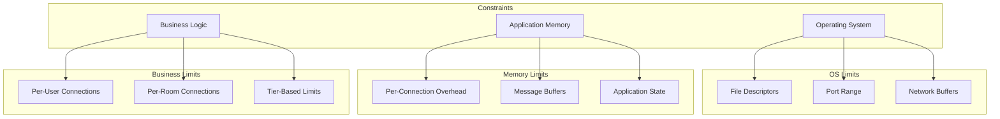
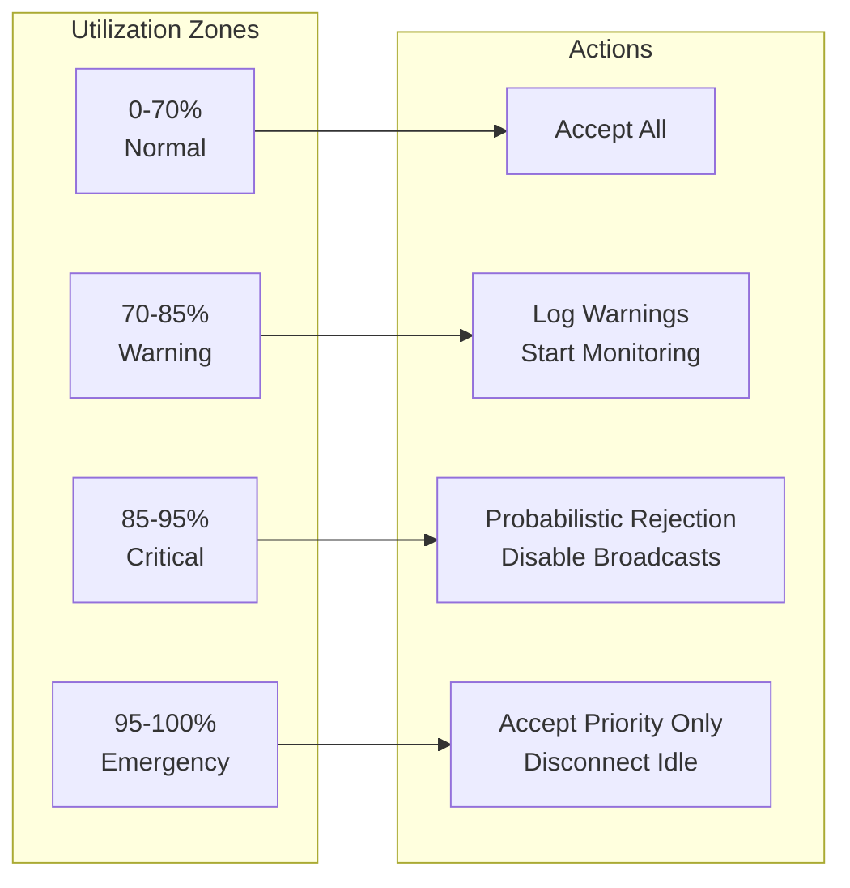

# How to Handle Connection Limits in WebSockets

Author: [nawazdhandala](https://github.com/nawazdhandala)

Tags: WebSocket, Connection Management, Node.js, Python, Go, Scaling, Real-time

Description: Learn how to handle WebSocket connection limits effectively with practical implementations including connection tracking, graceful rejection, load shedding strategies, and monitoring across Node.js, Python, and Go.

---

WebSocket servers face a fundamental challenge: each connection consumes resources, and those resources are finite. Whether you're hitting operating system file descriptor limits, memory constraints, or simply want to protect your server from overload, you need strategies to handle connection limits gracefully. This guide covers practical implementations for tracking, limiting, and managing WebSocket connections across different languages and scenarios.

## Understanding Connection Limits

Before implementing limits, you need to understand where constraints come from. Connection limits exist at multiple levels, and your application must work within all of them.



A typical WebSocket connection consumes 2-4KB of memory at minimum, plus any application state you maintain. At scale, these small allocations add up quickly.

## Connection Tracking Fundamentals

The foundation of handling connection limits is accurate tracking. You need to know how many connections you have before you can limit them.

### Node.js Connection Tracker

This tracker maintains connection counts with metadata for debugging and metrics.

```javascript
// connection-tracker.js
// Tracks active WebSocket connections with metadata for monitoring and limiting

class ConnectionTracker {
  constructor(options = {}) {
    // Maximum connections the server will accept
    this.maxConnections = options.maxConnections || 10000;
    // Maximum connections from a single IP address
    this.maxPerIP = options.maxPerIP || 100;
    // Maximum connections per authenticated user
    this.maxPerUser = options.maxPerUser || 10;

    // Storage for connection metadata
    this.connections = new Map();
    // Count of connections per IP address
    this.connectionsByIP = new Map();
    // Count of connections per user ID
    this.connectionsByUser = new Map();

    // Track statistics for monitoring
    this.stats = {
      totalAccepted: 0,
      totalRejected: 0,
      currentConnections: 0,
      peakConnections: 0
    };
  }

  // Attempt to register a new connection
  // Returns an object with success status and reason if rejected
  addConnection(connectionId, metadata = {}) {
    const { ip, userId } = metadata;

    // Check global connection limit
    if (this.connections.size >= this.maxConnections) {
      this.stats.totalRejected++;
      return {
        allowed: false,
        reason: 'server_limit',
        message: 'Server connection limit reached'
      };
    }

    // Check per-IP limit to prevent single client overload
    const ipCount = this.connectionsByIP.get(ip) || 0;
    if (ipCount >= this.maxPerIP) {
      this.stats.totalRejected++;
      return {
        allowed: false,
        reason: 'ip_limit',
        message: `IP ${ip} has too many connections`
      };
    }

    // Check per-user limit for authenticated connections
    if (userId) {
      const userCount = this.connectionsByUser.get(userId) || 0;
      if (userCount >= this.maxPerUser) {
        this.stats.totalRejected++;
        return {
          allowed: false,
          reason: 'user_limit',
          message: `User ${userId} has too many connections`
        };
      }
    }

    // All checks passed, register the connection
    this.connections.set(connectionId, {
      ip,
      userId,
      connectedAt: Date.now(),
      lastActivity: Date.now()
    });

    // Update counters
    this.connectionsByIP.set(ip, ipCount + 1);
    if (userId) {
      const userCount = this.connectionsByUser.get(userId) || 0;
      this.connectionsByUser.set(userId, userCount + 1);
    }

    // Update statistics
    this.stats.totalAccepted++;
    this.stats.currentConnections = this.connections.size;
    if (this.connections.size > this.stats.peakConnections) {
      this.stats.peakConnections = this.connections.size;
    }

    return { allowed: true };
  }

  // Remove a connection and update all counters
  removeConnection(connectionId) {
    const conn = this.connections.get(connectionId);
    if (!conn) return;

    // Decrement IP counter
    const ipCount = this.connectionsByIP.get(conn.ip) || 0;
    if (ipCount <= 1) {
      this.connectionsByIP.delete(conn.ip);
    } else {
      this.connectionsByIP.set(conn.ip, ipCount - 1);
    }

    // Decrement user counter
    if (conn.userId) {
      const userCount = this.connectionsByUser.get(conn.userId) || 0;
      if (userCount <= 1) {
        this.connectionsByUser.delete(conn.userId);
      } else {
        this.connectionsByUser.set(conn.userId, userCount - 1);
      }
    }

    this.connections.delete(connectionId);
    this.stats.currentConnections = this.connections.size;
  }

  // Update activity timestamp for a connection
  updateActivity(connectionId) {
    const conn = this.connections.get(connectionId);
    if (conn) {
      conn.lastActivity = Date.now();
    }
  }

  // Get current utilization as a percentage
  getUtilization() {
    return (this.connections.size / this.maxConnections) * 100;
  }

  // Export statistics for monitoring systems
  getStats() {
    return {
      ...this.stats,
      utilization: this.getUtilization().toFixed(2) + '%',
      uniqueIPs: this.connectionsByIP.size,
      uniqueUsers: this.connectionsByUser.size
    };
  }
}

module.exports = { ConnectionTracker };
```

### Python Connection Tracker with Async Support

Python's asyncio requires careful handling of shared state. This implementation uses locks to prevent race conditions.

```python
# connection_tracker.py
# Thread-safe connection tracker for async Python WebSocket servers

import asyncio
from dataclasses import dataclass, field
from datetime import datetime
from typing import Dict, Optional
from enum import Enum

class RejectionReason(Enum):
    SERVER_LIMIT = "server_limit"
    IP_LIMIT = "ip_limit"
    USER_LIMIT = "user_limit"

@dataclass
class ConnectionMetadata:
    """Stores metadata for each active connection"""
    ip: str
    user_id: Optional[str]
    connected_at: datetime = field(default_factory=datetime.utcnow)
    last_activity: datetime = field(default_factory=datetime.utcnow)

@dataclass
class ConnectionResult:
    """Result of attempting to add a connection"""
    allowed: bool
    reason: Optional[RejectionReason] = None
    message: Optional[str] = None

class ConnectionTracker:
    """
    Tracks WebSocket connections with limits enforcement.
    Thread-safe for use with asyncio.
    """

    def __init__(
        self,
        max_connections: int = 10000,
        max_per_ip: int = 100,
        max_per_user: int = 10
    ):
        self.max_connections = max_connections
        self.max_per_ip = max_per_ip
        self.max_per_user = max_per_user

        # Connection storage
        self._connections: Dict[str, ConnectionMetadata] = {}
        self._connections_by_ip: Dict[str, int] = {}
        self._connections_by_user: Dict[str, int] = {}

        # Lock for thread-safe operations
        self._lock = asyncio.Lock()

        # Statistics
        self.total_accepted = 0
        self.total_rejected = 0
        self.peak_connections = 0

    async def add_connection(
        self,
        connection_id: str,
        ip: str,
        user_id: Optional[str] = None
    ) -> ConnectionResult:
        """
        Attempt to register a new connection.
        Returns ConnectionResult indicating if the connection was allowed.
        """
        async with self._lock:
            # Check global limit
            if len(self._connections) >= self.max_connections:
                self.total_rejected += 1
                return ConnectionResult(
                    allowed=False,
                    reason=RejectionReason.SERVER_LIMIT,
                    message="Server connection limit reached"
                )

            # Check per-IP limit
            ip_count = self._connections_by_ip.get(ip, 0)
            if ip_count >= self.max_per_ip:
                self.total_rejected += 1
                return ConnectionResult(
                    allowed=False,
                    reason=RejectionReason.IP_LIMIT,
                    message=f"IP {ip} has too many connections"
                )

            # Check per-user limit
            if user_id:
                user_count = self._connections_by_user.get(user_id, 0)
                if user_count >= self.max_per_user:
                    self.total_rejected += 1
                    return ConnectionResult(
                        allowed=False,
                        reason=RejectionReason.USER_LIMIT,
                        message=f"User {user_id} has too many connections"
                    )

            # Register the connection
            self._connections[connection_id] = ConnectionMetadata(
                ip=ip,
                user_id=user_id
            )

            # Update counters
            self._connections_by_ip[ip] = ip_count + 1
            if user_id:
                self._connections_by_user[user_id] = \
                    self._connections_by_user.get(user_id, 0) + 1

            # Update statistics
            self.total_accepted += 1
            if len(self._connections) > self.peak_connections:
                self.peak_connections = len(self._connections)

            return ConnectionResult(allowed=True)

    async def remove_connection(self, connection_id: str) -> None:
        """Remove a connection and update all counters."""
        async with self._lock:
            conn = self._connections.get(connection_id)
            if not conn:
                return

            # Decrement IP counter
            ip_count = self._connections_by_ip.get(conn.ip, 0)
            if ip_count <= 1:
                self._connections_by_ip.pop(conn.ip, None)
            else:
                self._connections_by_ip[conn.ip] = ip_count - 1

            # Decrement user counter
            if conn.user_id:
                user_count = self._connections_by_user.get(conn.user_id, 0)
                if user_count <= 1:
                    self._connections_by_user.pop(conn.user_id, None)
                else:
                    self._connections_by_user[conn.user_id] = user_count - 1

            del self._connections[connection_id]

    @property
    def current_connections(self) -> int:
        """Current number of active connections."""
        return len(self._connections)

    @property
    def utilization(self) -> float:
        """Current utilization as a percentage."""
        return (len(self._connections) / self.max_connections) * 100

    def get_stats(self) -> dict:
        """Export statistics for monitoring."""
        return {
            "current_connections": self.current_connections,
            "max_connections": self.max_connections,
            "utilization": f"{self.utilization:.2f}%",
            "total_accepted": self.total_accepted,
            "total_rejected": self.total_rejected,
            "peak_connections": self.peak_connections,
            "unique_ips": len(self._connections_by_ip),
            "unique_users": len(self._connections_by_user)
        }
```

### Go Connection Tracker

Go's concurrency model requires mutex protection for shared state. This implementation provides a clean API for integration with any WebSocket library.

```go
// connection_tracker.go
// Thread-safe connection tracker for Go WebSocket servers

package connections

import (
    "sync"
    "time"
)

// RejectionReason indicates why a connection was rejected
type RejectionReason string

const (
    ReasonServerLimit RejectionReason = "server_limit"
    ReasonIPLimit     RejectionReason = "ip_limit"
    ReasonUserLimit   RejectionReason = "user_limit"
)

// ConnectionMetadata stores information about an active connection
type ConnectionMetadata struct {
    IP           string
    UserID       string
    ConnectedAt  time.Time
    LastActivity time.Time
}

// ConnectionResult indicates whether a connection was allowed
type ConnectionResult struct {
    Allowed bool
    Reason  RejectionReason
    Message string
}

// ConnectionTracker manages WebSocket connections with configurable limits
type ConnectionTracker struct {
    maxConnections int
    maxPerIP       int
    maxPerUser     int

    // Protected by mutex
    mu               sync.RWMutex
    connections      map[string]*ConnectionMetadata
    connectionsByIP  map[string]int
    connectionsByUser map[string]int

    // Statistics
    totalAccepted   int64
    totalRejected   int64
    peakConnections int
}

// NewConnectionTracker creates a tracker with the specified limits
func NewConnectionTracker(maxConnections, maxPerIP, maxPerUser int) *ConnectionTracker {
    return &ConnectionTracker{
        maxConnections:    maxConnections,
        maxPerIP:          maxPerIP,
        maxPerUser:        maxPerUser,
        connections:       make(map[string]*ConnectionMetadata),
        connectionsByIP:   make(map[string]int),
        connectionsByUser: make(map[string]int),
    }
}

// AddConnection attempts to register a new connection
// Returns a result indicating if the connection was allowed
func (ct *ConnectionTracker) AddConnection(connID, ip, userID string) ConnectionResult {
    ct.mu.Lock()
    defer ct.mu.Unlock()

    // Check global limit
    if len(ct.connections) >= ct.maxConnections {
        ct.totalRejected++
        return ConnectionResult{
            Allowed: false,
            Reason:  ReasonServerLimit,
            Message: "Server connection limit reached",
        }
    }

    // Check per-IP limit
    ipCount := ct.connectionsByIP[ip]
    if ipCount >= ct.maxPerIP {
        ct.totalRejected++
        return ConnectionResult{
            Allowed: false,
            Reason:  ReasonIPLimit,
            Message: "Too many connections from this IP",
        }
    }

    // Check per-user limit
    if userID != "" {
        userCount := ct.connectionsByUser[userID]
        if userCount >= ct.maxPerUser {
            ct.totalRejected++
            return ConnectionResult{
                Allowed: false,
                Reason:  ReasonUserLimit,
                Message: "Too many connections for this user",
            }
        }
    }

    // Register the connection
    now := time.Now()
    ct.connections[connID] = &ConnectionMetadata{
        IP:           ip,
        UserID:       userID,
        ConnectedAt:  now,
        LastActivity: now,
    }

    // Update counters
    ct.connectionsByIP[ip] = ipCount + 1
    if userID != "" {
        ct.connectionsByUser[userID]++
    }

    // Update statistics
    ct.totalAccepted++
    if len(ct.connections) > ct.peakConnections {
        ct.peakConnections = len(ct.connections)
    }

    return ConnectionResult{Allowed: true}
}

// RemoveConnection removes a connection and updates counters
func (ct *ConnectionTracker) RemoveConnection(connID string) {
    ct.mu.Lock()
    defer ct.mu.Unlock()

    conn, exists := ct.connections[connID]
    if !exists {
        return
    }

    // Decrement IP counter
    if ct.connectionsByIP[conn.IP] <= 1 {
        delete(ct.connectionsByIP, conn.IP)
    } else {
        ct.connectionsByIP[conn.IP]--
    }

    // Decrement user counter
    if conn.UserID != "" {
        if ct.connectionsByUser[conn.UserID] <= 1 {
            delete(ct.connectionsByUser, conn.UserID)
        } else {
            ct.connectionsByUser[conn.UserID]--
        }
    }

    delete(ct.connections, connID)
}

// CurrentConnections returns the number of active connections
func (ct *ConnectionTracker) CurrentConnections() int {
    ct.mu.RLock()
    defer ct.mu.RUnlock()
    return len(ct.connections)
}

// Utilization returns the current usage as a percentage
func (ct *ConnectionTracker) Utilization() float64 {
    ct.mu.RLock()
    defer ct.mu.RUnlock()
    return float64(len(ct.connections)) / float64(ct.maxConnections) * 100
}

// Stats holds tracker statistics for monitoring
type Stats struct {
    CurrentConnections int     `json:"current_connections"`
    MaxConnections     int     `json:"max_connections"`
    Utilization        float64 `json:"utilization"`
    TotalAccepted      int64   `json:"total_accepted"`
    TotalRejected      int64   `json:"total_rejected"`
    PeakConnections    int     `json:"peak_connections"`
    UniqueIPs          int     `json:"unique_ips"`
    UniqueUsers        int     `json:"unique_users"`
}

// GetStats returns current statistics
func (ct *ConnectionTracker) GetStats() Stats {
    ct.mu.RLock()
    defer ct.mu.RUnlock()

    return Stats{
        CurrentConnections: len(ct.connections),
        MaxConnections:     ct.maxConnections,
        Utilization:        float64(len(ct.connections)) / float64(ct.maxConnections) * 100,
        TotalAccepted:      ct.totalAccepted,
        TotalRejected:      ct.totalRejected,
        PeakConnections:    ct.peakConnections,
        UniqueIPs:          len(ct.connectionsByIP),
        UniqueUsers:        len(ct.connectionsByUser),
    }
}
```

## Graceful Connection Rejection

When you hit a limit, how you reject connections matters. A good rejection tells the client why it was rejected and when to retry.

### HTTP Upgrade Rejection with Retry Headers

The WebSocket handshake starts as an HTTP upgrade request. Rejecting at this stage lets you send proper HTTP status codes.

```javascript
// graceful-rejection.js
// Handle WebSocket upgrade requests with proper rejection responses

const http = require('http');
const WebSocket = require('ws');
const { ConnectionTracker } = require('./connection-tracker');

const tracker = new ConnectionTracker({
  maxConnections: 10000,
  maxPerIP: 100
});

const server = http.createServer();
const wss = new WebSocket.Server({ noServer: true });

// Handle upgrade requests manually for fine-grained control
server.on('upgrade', (request, socket, head) => {
  // Extract client IP, handling proxies
  const ip = request.headers['x-forwarded-for']?.split(',')[0].trim()
           || request.socket.remoteAddress;

  // Generate a unique connection ID
  const connectionId = `${Date.now()}-${Math.random().toString(36).substr(2, 9)}`;

  // Attempt to register the connection
  const result = tracker.addConnection(connectionId, { ip });

  if (!result.allowed) {
    // Calculate retry delay based on rejection reason
    const retryAfter = result.reason === 'server_limit' ? 30 : 10;

    // Send appropriate HTTP response based on rejection type
    let statusCode, statusText;

    switch (result.reason) {
      case 'server_limit':
        statusCode = 503;
        statusText = 'Service Unavailable';
        break;
      case 'ip_limit':
        statusCode = 429;
        statusText = 'Too Many Requests';
        break;
      default:
        statusCode = 400;
        statusText = 'Bad Request';
    }

    // Write HTTP response with helpful headers
    socket.write(
      `HTTP/1.1 ${statusCode} ${statusText}\r\n` +
      `Retry-After: ${retryAfter}\r\n` +
      `X-RateLimit-Limit: ${tracker.maxConnections}\r\n` +
      `X-RateLimit-Remaining: 0\r\n` +
      `X-Rejection-Reason: ${result.reason}\r\n` +
      `Content-Type: application/json\r\n` +
      `Connection: close\r\n\r\n` +
      JSON.stringify({
        error: result.reason,
        message: result.message,
        retryAfter
      })
    );
    socket.destroy();
    return;
  }

  // Connection allowed, complete the WebSocket handshake
  wss.handleUpgrade(request, socket, head, (ws) => {
    ws.connectionId = connectionId;
    ws.clientIP = ip;
    wss.emit('connection', ws, request);
  });
});

wss.on('connection', (ws) => {
  ws.on('close', () => {
    tracker.removeConnection(ws.connectionId);
  });

  ws.on('error', () => {
    tracker.removeConnection(ws.connectionId);
  });
});

server.listen(8080);
```

### Python FastAPI WebSocket with Graceful Rejection

FastAPI's dependency injection makes it easy to implement connection limits as a reusable component.

```python
# fastapi_websocket_limits.py
# FastAPI WebSocket endpoint with connection limit enforcement

from fastapi import FastAPI, WebSocket, WebSocketDisconnect, HTTPException, status
from fastapi.responses import JSONResponse
import uuid
from connection_tracker import ConnectionTracker, RejectionReason

app = FastAPI()
tracker = ConnectionTracker(
    max_connections=10000,
    max_per_ip=100,
    max_per_user=10
)

def get_client_ip(websocket: WebSocket) -> str:
    """Extract client IP, handling reverse proxies."""
    forwarded = websocket.headers.get("x-forwarded-for")
    if forwarded:
        return forwarded.split(",")[0].strip()
    return websocket.client.host

@app.websocket("/ws")
async def websocket_endpoint(websocket: WebSocket):
    """
    WebSocket endpoint with connection limit enforcement.
    Rejects connections gracefully when limits are exceeded.
    """
    connection_id = str(uuid.uuid4())
    client_ip = get_client_ip(websocket)

    # Check limits before accepting the connection
    result = await tracker.add_connection(
        connection_id=connection_id,
        ip=client_ip,
        user_id=None  # Add user_id from auth if available
    )

    if not result.allowed:
        # Reject the connection with a close code and reason
        # Close code 1013 indicates "Try Again Later"
        await websocket.close(
            code=1013,
            reason=result.message
        )
        return

    try:
        await websocket.accept()

        # Send connection acknowledgment with current limits
        await websocket.send_json({
            "type": "connection_established",
            "connection_id": connection_id,
            "server_utilization": tracker.utilization
        })

        # Main message loop
        while True:
            data = await websocket.receive_json()
            # Process messages here
            await websocket.send_json({"received": data})

    except WebSocketDisconnect:
        pass
    finally:
        await tracker.remove_connection(connection_id)

@app.get("/ws/stats")
async def get_websocket_stats():
    """Endpoint to check WebSocket server statistics."""
    return tracker.get_stats()
```

## Load Shedding Strategies

When approaching limits, intelligent load shedding can maintain service quality for existing connections while gracefully reducing new connections.



### Adaptive Load Shedding Implementation

This implementation adjusts behavior based on current server load, providing graceful degradation.

```javascript
// load-shedder.js
// Adaptive load shedding based on connection utilization

class LoadShedder {
  constructor(tracker, options = {}) {
    this.tracker = tracker;

    // Utilization thresholds (percentages)
    this.warningThreshold = options.warningThreshold || 70;
    this.criticalThreshold = options.criticalThreshold || 85;
    this.emergencyThreshold = options.emergencyThreshold || 95;

    // Probability of accepting new connections in critical zone
    this.criticalAcceptProbability = options.criticalAcceptProbability || 0.5;

    // Idle timeout in milliseconds for emergency disconnection
    this.idleTimeout = options.idleTimeout || 300000; // 5 minutes

    // Callback for logging and alerts
    this.onStateChange = options.onStateChange || (() => {});

    this.currentState = 'normal';
  }

  // Determine if a new connection should be accepted
  shouldAcceptConnection(metadata = {}) {
    const utilization = this.tracker.getUtilization();
    const previousState = this.currentState;

    // Update state based on utilization
    if (utilization >= this.emergencyThreshold) {
      this.currentState = 'emergency';
    } else if (utilization >= this.criticalThreshold) {
      this.currentState = 'critical';
    } else if (utilization >= this.warningThreshold) {
      this.currentState = 'warning';
    } else {
      this.currentState = 'normal';
    }

    // Notify on state change
    if (previousState !== this.currentState) {
      this.onStateChange(previousState, this.currentState, utilization);
    }

    // Decision logic based on state
    switch (this.currentState) {
      case 'normal':
      case 'warning':
        // Accept all connections in normal and warning states
        return { accept: true, degraded: false };

      case 'critical':
        // Probabilistic acceptance in critical state
        // Priority connections (e.g., premium users) bypass this
        if (metadata.priority) {
          return { accept: true, degraded: true };
        }

        const accept = Math.random() < this.criticalAcceptProbability;
        return {
          accept,
          degraded: true,
          reason: accept ? null : 'probabilistic_rejection'
        };

      case 'emergency':
        // Only accept priority connections in emergency
        if (metadata.priority) {
          return { accept: true, degraded: true };
        }
        return {
          accept: false,
          degraded: true,
          reason: 'emergency_mode'
        };
    }
  }

  // Get current operational settings based on load
  getOperationalSettings() {
    switch (this.currentState) {
      case 'normal':
        return {
          broadcastEnabled: true,
          maxMessageSize: 1048576, // 1MB
          messagesPerSecond: 100,
          pingInterval: 30000
        };

      case 'warning':
        return {
          broadcastEnabled: true,
          maxMessageSize: 524288, // 512KB
          messagesPerSecond: 50,
          pingInterval: 45000
        };

      case 'critical':
        return {
          broadcastEnabled: false, // Disable broadcasts to reduce load
          maxMessageSize: 65536, // 64KB
          messagesPerSecond: 20,
          pingInterval: 60000
        };

      case 'emergency':
        return {
          broadcastEnabled: false,
          maxMessageSize: 16384, // 16KB
          messagesPerSecond: 5,
          pingInterval: 120000
        };
    }
  }

  // Identify connections that should be disconnected to free resources
  getConnectionsToShed() {
    if (this.currentState !== 'emergency') {
      return [];
    }

    const now = Date.now();
    const toShed = [];

    // Find idle connections (non-priority only)
    for (const [id, conn] of this.tracker.connections) {
      if (conn.priority) continue;

      const idleTime = now - conn.lastActivity;
      if (idleTime > this.idleTimeout) {
        toShed.push({
          connectionId: id,
          reason: 'idle_timeout',
          idleTime
        });
      }
    }

    // Sort by idle time, longest first
    toShed.sort((a, b) => b.idleTime - a.idleTime);

    // Return top connections to shed (up to 10% of current)
    const maxToShed = Math.ceil(this.tracker.connections.size * 0.1);
    return toShed.slice(0, maxToShed);
  }
}

module.exports = { LoadShedder };
```

## Connection Pooling and Queuing

For scenarios where you want to queue connections rather than reject them, implement a waiting room pattern.

```javascript
// connection-queue.js
// Queue connections when server is at capacity

class ConnectionQueue {
  constructor(options = {}) {
    // Maximum time a connection can wait in queue
    this.maxWaitTime = options.maxWaitTime || 30000;
    // Maximum queue size
    this.maxQueueSize = options.maxQueueSize || 1000;
    // Connections waiting to be accepted
    this.queue = [];
    // Callbacks for queue events
    this.onQueueUpdate = options.onQueueUpdate || (() => {});
  }

  // Add a connection to the waiting queue
  enqueue(socket, metadata = {}) {
    return new Promise((resolve, reject) => {
      if (this.queue.length >= this.maxQueueSize) {
        reject(new Error('Queue is full'));
        return;
      }

      const queueEntry = {
        socket,
        metadata,
        enqueuedAt: Date.now(),
        resolve,
        reject,
        position: this.queue.length + 1
      };

      this.queue.push(queueEntry);

      // Set timeout for max wait time
      queueEntry.timeout = setTimeout(() => {
        this.removeFromQueue(queueEntry);
        reject(new Error('Wait time exceeded'));
      }, this.maxWaitTime);

      // Notify client of their queue position
      this.notifyQueuePosition(queueEntry);
      this.onQueueUpdate(this.queue.length);
    });
  }

  // Process the next connection in queue
  dequeue() {
    if (this.queue.length === 0) {
      return null;
    }

    const entry = this.queue.shift();
    clearTimeout(entry.timeout);

    // Update positions for remaining entries
    this.queue.forEach((e, index) => {
      e.position = index + 1;
      this.notifyQueuePosition(e);
    });

    this.onQueueUpdate(this.queue.length);
    return entry;
  }

  // Remove a specific entry from the queue
  removeFromQueue(entry) {
    const index = this.queue.indexOf(entry);
    if (index > -1) {
      clearTimeout(entry.timeout);
      this.queue.splice(index, 1);

      // Update positions
      this.queue.forEach((e, idx) => {
        e.position = idx + 1;
      });

      this.onQueueUpdate(this.queue.length);
    }
  }

  // Notify a client of their current queue position
  notifyQueuePosition(entry) {
    const waitTime = Date.now() - entry.enqueuedAt;
    const estimatedWait = this.estimateWaitTime(entry.position);

    // Send queue status via raw socket before WebSocket upgrade
    const message = JSON.stringify({
      type: 'queue_status',
      position: entry.position,
      totalInQueue: this.queue.length,
      waitTime,
      estimatedWaitRemaining: estimatedWait
    });

    // This would be sent via a preliminary connection or polling
    if (entry.socket.send) {
      try {
        entry.socket.send(message);
      } catch (e) {
        // Socket may have been closed
      }
    }
  }

  // Estimate wait time based on recent dequeue rate
  estimateWaitTime(position) {
    // Simple estimation: assume 1 connection per second average
    return position * 1000;
  }

  get length() {
    return this.queue.length;
  }
}

module.exports = { ConnectionQueue };
```

## Monitoring and Alerting

Connection limits are only useful if you know when you're approaching them. Set up proper monitoring.

### Prometheus Metrics for Connection Tracking

```javascript
// metrics.js
// Export connection metrics for Prometheus

const prometheus = require('prom-client');

// Create a registry for WebSocket metrics
const register = new prometheus.Registry();

// Current connection count gauge
const connectionsGauge = new prometheus.Gauge({
  name: 'websocket_connections_current',
  help: 'Current number of active WebSocket connections',
  labelNames: ['state'],
  registers: [register]
});

// Connection counter for total connections over time
const connectionsTotal = new prometheus.Counter({
  name: 'websocket_connections_total',
  help: 'Total WebSocket connections since server start',
  labelNames: ['result'],
  registers: [register]
});

// Connection duration histogram
const connectionDuration = new prometheus.Histogram({
  name: 'websocket_connection_duration_seconds',
  help: 'Duration of WebSocket connections',
  buckets: [1, 5, 15, 30, 60, 300, 600, 1800, 3600],
  registers: [register]
});

// Rejected connections by reason
const rejectionsTotal = new prometheus.Counter({
  name: 'websocket_rejections_total',
  help: 'Total rejected WebSocket connections',
  labelNames: ['reason'],
  registers: [register]
});

// Server utilization gauge
const utilizationGauge = new prometheus.Gauge({
  name: 'websocket_utilization_percent',
  help: 'Current server utilization as percentage',
  registers: [register]
});

// Queue length gauge
const queueLengthGauge = new prometheus.Gauge({
  name: 'websocket_queue_length',
  help: 'Number of connections waiting in queue',
  registers: [register]
});

// Wrapper to update metrics from tracker
function updateMetrics(tracker, loadShedder, queue) {
  const stats = tracker.getStats();

  connectionsGauge.set({ state: 'active' }, stats.currentConnections);
  utilizationGauge.set(parseFloat(stats.utilization));

  if (loadShedder) {
    connectionsGauge.set({ state: loadShedder.currentState }, stats.currentConnections);
  }

  if (queue) {
    queueLengthGauge.set(queue.length);
  }
}

// Record a new connection
function recordConnection(accepted, rejectionReason = null) {
  if (accepted) {
    connectionsTotal.inc({ result: 'accepted' });
  } else {
    connectionsTotal.inc({ result: 'rejected' });
    if (rejectionReason) {
      rejectionsTotal.inc({ reason: rejectionReason });
    }
  }
}

// Record connection duration
function recordDuration(durationSeconds) {
  connectionDuration.observe(durationSeconds);
}

// HTTP endpoint for Prometheus scraping
async function metricsHandler(req, res) {
  res.set('Content-Type', register.contentType);
  res.end(await register.metrics());
}

module.exports = {
  updateMetrics,
  recordConnection,
  recordDuration,
  metricsHandler,
  register
};
```

### Alerting Rules

Create Prometheus alerting rules to catch connection limit issues before they impact users.

```yaml
# alerts.yml
# Prometheus alerting rules for WebSocket connection limits

groups:
  - name: websocket_connection_alerts
    interval: 30s
    rules:
      # Alert when utilization exceeds 80%
      - alert: WebSocketHighUtilization
        expr: websocket_utilization_percent > 80
        for: 5m
        labels:
          severity: warning
        annotations:
          summary: "WebSocket server utilization high"
          description: "WebSocket utilization is {{ $value }}% on {{ $labels.instance }}"

      # Alert when utilization exceeds 95%
      - alert: WebSocketCriticalUtilization
        expr: websocket_utilization_percent > 95
        for: 1m
        labels:
          severity: critical
        annotations:
          summary: "WebSocket server near capacity"
          description: "WebSocket utilization is {{ $value }}% on {{ $labels.instance }}"

      # Alert on high rejection rate
      - alert: WebSocketHighRejectionRate
        expr: rate(websocket_rejections_total[5m]) > 10
        for: 5m
        labels:
          severity: warning
        annotations:
          summary: "High WebSocket rejection rate"
          description: "Rejecting {{ $value }} connections per second on {{ $labels.instance }}"

      # Alert when queue is building up
      - alert: WebSocketQueueBacklog
        expr: websocket_queue_length > 100
        for: 2m
        labels:
          severity: warning
        annotations:
          summary: "WebSocket connection queue building"
          description: "{{ $value }} connections waiting in queue on {{ $labels.instance }}"
```

## Complete Example: Node.js Server with All Features

Here's a complete WebSocket server combining all the patterns discussed.

```javascript
// server.js
// Complete WebSocket server with connection limit handling

const http = require('http');
const WebSocket = require('ws');
const { ConnectionTracker } = require('./connection-tracker');
const { LoadShedder } = require('./load-shedder');
const { ConnectionQueue } = require('./connection-queue');
const metrics = require('./metrics');

// Configuration from environment
const config = {
  port: process.env.PORT || 8080,
  maxConnections: parseInt(process.env.MAX_CONNECTIONS) || 10000,
  maxPerIP: parseInt(process.env.MAX_PER_IP) || 100,
  enableQueue: process.env.ENABLE_QUEUE === 'true'
};

// Initialize components
const tracker = new ConnectionTracker({
  maxConnections: config.maxConnections,
  maxPerIP: config.maxPerIP
});

const loadShedder = new LoadShedder(tracker, {
  onStateChange: (from, to, utilization) => {
    console.log(`Load state changed: ${from} -> ${to} (${utilization.toFixed(1)}%)`);
  }
});

const queue = config.enableQueue ? new ConnectionQueue({
  maxQueueSize: 500,
  maxWaitTime: 30000
}) : null;

// Create servers
const server = http.createServer((req, res) => {
  if (req.url === '/metrics') {
    metrics.metricsHandler(req, res);
  } else if (req.url === '/health') {
    res.writeHead(200);
    res.end(JSON.stringify(tracker.getStats()));
  } else {
    res.writeHead(404);
    res.end();
  }
});

const wss = new WebSocket.Server({ noServer: true });

// Handle upgrade requests
server.on('upgrade', async (request, socket, head) => {
  const ip = request.headers['x-forwarded-for']?.split(',')[0].trim()
           || request.socket.remoteAddress;

  const connectionId = `${Date.now()}-${Math.random().toString(36).substr(2, 9)}`;
  const metadata = { ip, priority: request.headers['x-priority'] === 'true' };

  // Check load shedding policy
  const sheddingResult = loadShedder.shouldAcceptConnection(metadata);

  if (!sheddingResult.accept) {
    // Try queue if enabled
    if (queue && !metadata.priority) {
      try {
        await queue.enqueue(socket, metadata);
        // When dequeued, this promise resolves
        completeUpgrade(request, socket, head, connectionId, metadata);
        return;
      } catch (e) {
        rejectConnection(socket, 503, 'queue_full', 60);
        return;
      }
    }

    rejectConnection(socket, 503, sheddingResult.reason, 30);
    return;
  }

  // Check tracker limits
  const trackerResult = tracker.addConnection(connectionId, metadata);

  if (!trackerResult.allowed) {
    rejectConnection(socket,
      trackerResult.reason === 'ip_limit' ? 429 : 503,
      trackerResult.reason,
      trackerResult.reason === 'ip_limit' ? 10 : 30
    );
    return;
  }

  completeUpgrade(request, socket, head, connectionId, metadata);
});

function rejectConnection(socket, statusCode, reason, retryAfter) {
  const statusText = statusCode === 429 ? 'Too Many Requests' : 'Service Unavailable';

  socket.write(
    `HTTP/1.1 ${statusCode} ${statusText}\r\n` +
    `Retry-After: ${retryAfter}\r\n` +
    `X-Rejection-Reason: ${reason}\r\n` +
    `Connection: close\r\n\r\n`
  );
  socket.destroy();

  metrics.recordConnection(false, reason);
}

function completeUpgrade(request, socket, head, connectionId, metadata) {
  wss.handleUpgrade(request, socket, head, (ws) => {
    ws.connectionId = connectionId;
    ws.metadata = metadata;
    ws.connectedAt = Date.now();

    // Send operational settings based on current load
    const settings = loadShedder.getOperationalSettings();
    ws.send(JSON.stringify({
      type: 'connected',
      connectionId,
      settings,
      degraded: loadShedder.currentState !== 'normal'
    }));

    metrics.recordConnection(true);
    wss.emit('connection', ws, request);
  });
}

// WebSocket event handlers
wss.on('connection', (ws) => {
  ws.isAlive = true;

  ws.on('pong', () => {
    ws.isAlive = true;
    tracker.updateActivity(ws.connectionId);
  });

  ws.on('message', (data) => {
    tracker.updateActivity(ws.connectionId);
    // Handle message
  });

  ws.on('close', () => {
    const duration = (Date.now() - ws.connectedAt) / 1000;
    metrics.recordDuration(duration);
    tracker.removeConnection(ws.connectionId);

    // Process queue if enabled
    if (queue) {
      const next = queue.dequeue();
      if (next) {
        next.resolve();
      }
    }
  });
});

// Keepalive interval
const pingInterval = setInterval(() => {
  wss.clients.forEach((ws) => {
    if (!ws.isAlive) {
      tracker.removeConnection(ws.connectionId);
      return ws.terminate();
    }
    ws.isAlive = false;
    ws.ping();
  });
}, 30000);

// Metrics update interval
const metricsInterval = setInterval(() => {
  metrics.updateMetrics(tracker, loadShedder, queue);
}, 5000);

// Load shedding check interval
const shedInterval = setInterval(() => {
  const toShed = loadShedder.getConnectionsToShed();

  for (const entry of toShed) {
    wss.clients.forEach((ws) => {
      if (ws.connectionId === entry.connectionId) {
        ws.close(1001, 'Server shedding load');
      }
    });
  }
}, 60000);

// Graceful shutdown
process.on('SIGTERM', () => {
  clearInterval(pingInterval);
  clearInterval(metricsInterval);
  clearInterval(shedInterval);

  wss.clients.forEach((ws) => {
    ws.close(1001, 'Server shutting down');
  });

  server.close(() => {
    process.exit(0);
  });
});

server.listen(config.port, () => {
  console.log(`WebSocket server running on port ${config.port}`);
  console.log(`Max connections: ${config.maxConnections}`);
  console.log(`Queue enabled: ${config.enableQueue}`);
});
```

## Summary

| Strategy | When to Use | Trade-off |
|----------|-------------|-----------|
| Hard limits | Basic protection | Simple but abrupt |
| Per-IP limits | Prevent single-client abuse | May block legitimate NAT users |
| Per-user limits | Control authenticated users | Requires authentication |
| Load shedding | Maintain quality under load | Complexity in tuning thresholds |
| Connection queue | Critical applications | Memory overhead, user wait time |
| Graceful rejection | Always | Requires client-side handling |

Connection limits are about protecting your server while providing the best possible experience for clients. Start with basic tracking and hard limits, then add sophistication like load shedding and queuing as your needs grow. Monitor your metrics closely and adjust thresholds based on real-world behavior.

## Start Monitoring Your WebSocket Infrastructure

Handling connection limits is just one aspect of maintaining healthy real-time applications. [OneUptime](https://oneuptime.com) provides comprehensive monitoring for WebSocket servers, including connection tracking, latency monitoring, and alerting when you approach capacity limits. Set up dashboards to visualize your connection patterns and catch issues before they affect users.
