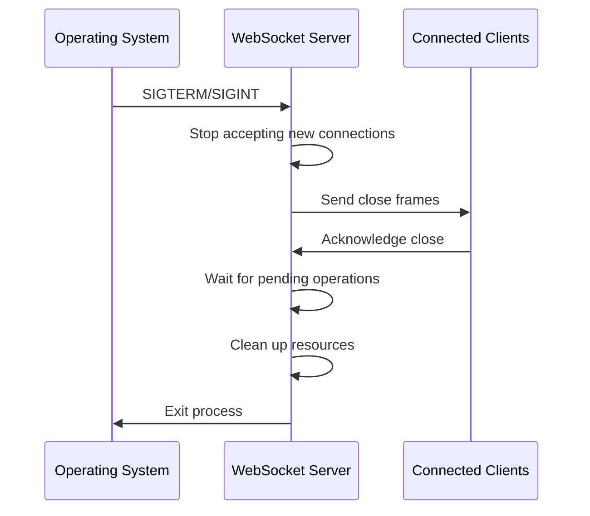
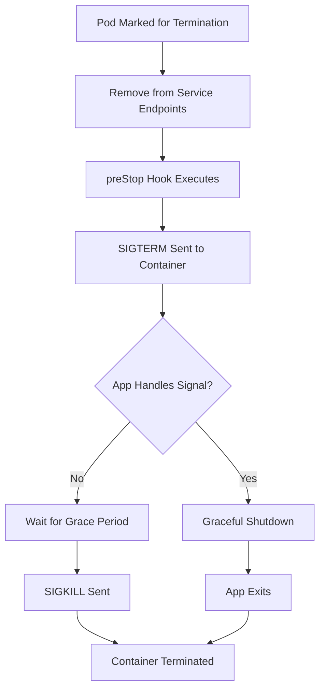
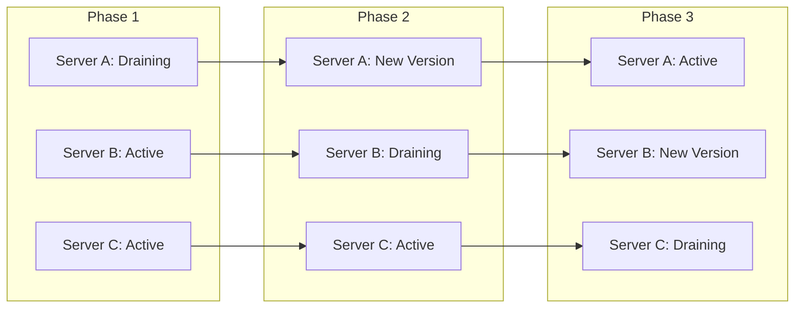

# How to Handle Graceful Shutdown for WebSocket Servers

Author: [nawazdhandala](https://www.github.com/nawazdhandala)

Tags: WebSocket, Graceful Shutdown, Node.js, Real-time, Server Management, Production

Description: Learn how to implement graceful shutdown for WebSocket servers to ensure clean connection termination, prevent data loss, and maintain reliability during deployments and restarts.

---

When you deploy a new version of your WebSocket server or need to restart it for maintenance, what happens to the thousands of connected clients? Without proper graceful shutdown handling, they all get abruptly disconnected. Messages in transit get lost. Reconnection storms overwhelm your infrastructure. Users see errors.

Graceful shutdown solves this by giving your server time to properly close connections, finish processing messages, and notify clients before shutting down. This guide covers everything you need to implement production-ready graceful shutdown for WebSocket servers.

## Why Graceful Shutdown Matters

WebSocket connections are persistent. Unlike HTTP requests that complete quickly, WebSocket clients stay connected for minutes, hours, or even days. When your server process terminates, these long-lived connections need special handling.

Without graceful shutdown:
- Clients receive no warning before disconnection
- In-flight messages get dropped
- All clients reconnect simultaneously, causing load spikes
- Stateful data may be lost

With graceful shutdown:
- Clients receive close frames with proper status codes
- In-flight messages complete before shutdown
- Clients can stagger their reconnections
- Application state persists correctly

## The Shutdown Lifecycle

A proper WebSocket server shutdown follows this sequence:



The key insight is that shutdown happens in phases. You stop accepting new work, complete existing work, notify clients, and then clean up. Rushing any of these phases causes problems.

## Implementing Graceful Shutdown in Node.js

Node.js is the most common platform for WebSocket servers. Let's build a complete graceful shutdown implementation using the popular `ws` library.

### Basic Server Setup

First, we create a WebSocket server with tracking for all connected clients. The clients Set is essential because we need to iterate through all connections during shutdown.

```javascript
const WebSocket = require('ws');
const http = require('http');

// Create HTTP server first for more control over shutdown
const httpServer = http.createServer();

// Create WebSocket server attached to HTTP server
const wss = new WebSocket.Server({ server: httpServer });

// Track all connected clients for cleanup during shutdown
const clients = new Set();

// Track server state to reject connections during shutdown
let isShuttingDown = false;

wss.on('connection', (ws, request) => {
    // Reject new connections if we're shutting down
    if (isShuttingDown) {
        ws.close(1001, 'Server is shutting down');
        return;
    }

    // Add client to our tracking set
    clients.add(ws);
    console.log(`Client connected. Total clients: ${clients.size}`);

    // Set up ping/pong for connection health monitoring
    ws.isAlive = true;
    ws.on('pong', () => {
        ws.isAlive = true;
    });

    ws.on('message', (message) => {
        // Handle incoming messages
        console.log(`Received: ${message}`);
    });

    ws.on('close', (code, reason) => {
        clients.delete(ws);
        console.log(`Client disconnected (${code}). Total clients: ${clients.size}`);
    });

    ws.on('error', (error) => {
        console.error('WebSocket error:', error);
        clients.delete(ws);
    });
});

// Start the server
const PORT = process.env.PORT || 8080;
httpServer.listen(PORT, () => {
    console.log(`WebSocket server running on port ${PORT}`);
});
```

### The Graceful Shutdown Handler

This function orchestrates the entire shutdown process. It stops accepting connections, notifies all clients with a proper close frame, waits for pending operations, and then exits cleanly.

```javascript
// Graceful shutdown function that handles all cleanup
async function gracefulShutdown(signal) {
    console.log(`Received ${signal}. Starting graceful shutdown...`);

    // Set flag to prevent new connections
    isShuttingDown = true;

    // Stop accepting new HTTP connections
    // This prevents new WebSocket upgrades
    httpServer.close((err) => {
        if (err) {
            console.error('Error closing HTTP server:', err);
        } else {
            console.log('HTTP server closed');
        }
    });

    // Send close frames to all connected clients
    // Using code 1001 (Going Away) to indicate server shutdown
    const closePromises = [];
    for (const client of clients) {
        if (client.readyState === WebSocket.OPEN) {
            closePromises.push(closeClientGracefully(client));
        }
    }

    // Wait for all close operations with a timeout
    // Don't wait forever if clients are unresponsive
    const closeTimeout = 10000; // 10 seconds
    await Promise.race([
        Promise.allSettled(closePromises),
        new Promise(resolve => setTimeout(resolve, closeTimeout))
    ]);

    // Force close any remaining connections
    for (const client of clients) {
        if (client.readyState !== WebSocket.CLOSED) {
            console.log('Force closing unresponsive client');
            client.terminate();
        }
    }

    console.log('All clients disconnected. Shutdown complete.');
    process.exit(0);
}
```

### Clean Client Disconnection

This helper function sends a proper close frame and waits for the client to acknowledge it. The promise-based approach lets us wait for all clients while handling timeouts properly.

```javascript
// Close a single client connection gracefully
function closeClientGracefully(client) {
    return new Promise((resolve) => {
        // Set a timeout in case the client doesn't respond
        const timeout = setTimeout(() => {
            console.log('Client close timeout, terminating');
            client.terminate();
            resolve();
        }, 5000);

        // Listen for the close event
        client.once('close', () => {
            clearTimeout(timeout);
            resolve();
        });

        // Send close frame with "Going Away" code
        // This tells clients the server is shutting down intentionally
        client.close(1001, 'Server shutting down');
    });
}
```

### Registering Signal Handlers

Unix systems send SIGTERM for normal shutdown requests and SIGINT when you press Ctrl+C. Windows uses different signals but Node.js normalizes some of them. We handle both to cover all deployment scenarios.

```javascript
// Handle termination signals
process.on('SIGTERM', () => gracefulShutdown('SIGTERM'));
process.on('SIGINT', () => gracefulShutdown('SIGINT'));

// Handle uncaught errors to prevent sudden crashes
process.on('uncaughtException', (error) => {
    console.error('Uncaught exception:', error);
    gracefulShutdown('uncaughtException');
});

process.on('unhandledRejection', (reason, promise) => {
    console.error('Unhandled rejection at:', promise, 'reason:', reason);
    gracefulShutdown('unhandledRejection');
});
```

## Handling Pending Messages

During shutdown, you may have messages being processed or queued. This enhanced version waits for pending operations to complete before closing connections.

### Message Queue Tracking

We track pending messages per client. The shutdown process waits for these to complete, ensuring no data is lost during the transition.

```javascript
// Track pending operations per client
const pendingOperations = new Map();

wss.on('connection', (ws) => {
    clients.add(ws);
    pendingOperations.set(ws, new Set());

    ws.on('message', async (message) => {
        // Create a unique operation ID
        const opId = Date.now() + Math.random();
        pendingOperations.get(ws).add(opId);

        try {
            // Process the message
            await processMessage(ws, message);
        } finally {
            // Mark operation as complete
            pendingOperations.get(ws).delete(opId);
        }
    });

    ws.on('close', () => {
        clients.delete(ws);
        pendingOperations.delete(ws);
    });
});

// Example async message processor
async function processMessage(ws, message) {
    // Simulate some async work
    await new Promise(resolve => setTimeout(resolve, 100));
    ws.send(`Echo: ${message}`);
}
```

### Waiting for Pending Operations

Before closing a client, we wait for their pending operations to complete. This prevents message loss during shutdown.

```javascript
// Enhanced close function that waits for pending operations
async function closeClientGracefully(client) {
    // Wait for pending operations to complete
    const pending = pendingOperations.get(client);
    if (pending && pending.size > 0) {
        console.log(`Waiting for ${pending.size} pending operations`);

        // Check every 100ms if operations are done
        const operationTimeout = 5000;
        const startTime = Date.now();

        while (pending.size > 0 && (Date.now() - startTime) < operationTimeout) {
            await new Promise(resolve => setTimeout(resolve, 100));
        }

        if (pending.size > 0) {
            console.log(`Timeout: ${pending.size} operations still pending`);
        }
    }

    return new Promise((resolve) => {
        const timeout = setTimeout(() => {
            client.terminate();
            resolve();
        }, 5000);

        client.once('close', () => {
            clearTimeout(timeout);
            resolve();
        });

        client.close(1001, 'Server shutting down');
    });
}
```

## Kubernetes Integration

When running in Kubernetes, graceful shutdown requires coordination with the container orchestrator. Kubernetes sends SIGTERM and expects your pod to exit within the termination grace period.

### Understanding the Shutdown Flow

Here is the sequence of events when Kubernetes terminates a pod:



### Kubernetes Deployment Configuration

This deployment configuration gives your WebSocket server 60 seconds to shut down. The preStop hook adds a delay to allow load balancers to stop routing traffic before shutdown begins.

```yaml
apiVersion: apps/v1
kind: Deployment
metadata:
  name: websocket-server
spec:
  replicas: 3
  selector:
    matchLabels:
      app: websocket-server
  template:
    metadata:
      labels:
        app: websocket-server
    spec:
      containers:
        - name: websocket
          image: your-registry/websocket-server:latest
          ports:
            - containerPort: 8080
          # Give the app time to close connections
          lifecycle:
            preStop:
              exec:
                # Sleep allows load balancer to drain
                command: ["/bin/sh", "-c", "sleep 5"]
          # Readiness probe stops traffic during shutdown
          readinessProbe:
            httpGet:
              path: /health
              port: 8080
            initialDelaySeconds: 5
            periodSeconds: 5
      # Total time allowed for graceful shutdown
      terminationGracePeriodSeconds: 60
```

### Health Check Endpoint

The health endpoint returns an error during shutdown, causing Kubernetes to stop sending new traffic to this pod.

```javascript
// Health check that respects shutdown state
httpServer.on('request', (req, res) => {
    if (req.url === '/health') {
        if (isShuttingDown) {
            res.writeHead(503);
            res.end('Shutting down');
        } else {
            res.writeHead(200);
            res.end('OK');
        }
    }
});
```

## Client-Side Reconnection Strategy

Graceful shutdown is only half the story. Clients need to handle disconnection gracefully too. Here is a client implementation that handles server shutdown properly.

### Smart Reconnection with Backoff

This client detects shutdown close codes and uses exponential backoff to prevent reconnection storms. When the server sends code 1001 (Going Away), the client knows this is an intentional shutdown and waits longer before reconnecting.

```javascript
class WebSocketClient {
    constructor(url) {
        this.url = url;
        this.reconnectAttempts = 0;
        this.maxReconnectAttempts = 10;
        this.baseDelay = 1000;
        this.maxDelay = 30000;
        this.ws = null;
        this.connect();
    }

    connect() {
        this.ws = new WebSocket(this.url);

        this.ws.onopen = () => {
            console.log('Connected');
            // Reset reconnect counter on successful connection
            this.reconnectAttempts = 0;
        };

        this.ws.onclose = (event) => {
            console.log(`Disconnected: ${event.code} - ${event.reason}`);

            // Handle different close codes appropriately
            if (event.code === 1001) {
                // Server going away - wait longer before reconnect
                console.log('Server shutting down, will reconnect soon');
                this.scheduleReconnect(5000);
            } else if (event.code >= 4000) {
                // Custom application error - may not want to reconnect
                console.log('Application error, not reconnecting');
            } else {
                // Normal disconnection - use exponential backoff
                this.scheduleReconnect();
            }
        };

        this.ws.onerror = (error) => {
            console.error('WebSocket error:', error);
        };

        this.ws.onmessage = (event) => {
            console.log('Received:', event.data);
        };
    }

    scheduleReconnect(overrideDelay = null) {
        if (this.reconnectAttempts >= this.maxReconnectAttempts) {
            console.log('Max reconnection attempts reached');
            return;
        }

        // Calculate delay with exponential backoff and jitter
        const exponentialDelay = Math.min(
            this.baseDelay * Math.pow(2, this.reconnectAttempts),
            this.maxDelay
        );

        // Add random jitter to prevent thundering herd
        const jitter = exponentialDelay * 0.2 * Math.random();
        const delay = overrideDelay || (exponentialDelay + jitter);

        console.log(`Reconnecting in ${Math.round(delay)}ms...`);

        setTimeout(() => {
            this.reconnectAttempts++;
            this.connect();
        }, delay);
    }

    send(message) {
        if (this.ws.readyState === WebSocket.OPEN) {
            this.ws.send(message);
        } else {
            console.log('Cannot send - connection not open');
        }
    }
}
```

## Handling Multiple Server Instances

In production, you typically run multiple WebSocket server instances behind a load balancer. Graceful shutdown becomes more complex because you need to coordinate across instances.

### Rolling Restart Strategy

This diagram shows how to perform rolling restarts without dropping connections:



### Connection Draining

Before shutting down a server, mark it as draining. New connections go to other servers while existing connections complete their work.

```javascript
const express = require('express');
const app = express();

// Separate HTTP server for load balancer health checks
const healthServer = express();
let isDraining = false;

// Load balancer checks this endpoint
healthServer.get('/health', (req, res) => {
    if (isDraining) {
        // Return unhealthy - load balancer will stop sending traffic
        res.status(503).json({ status: 'draining' });
    } else {
        res.status(200).json({ status: 'healthy', connections: clients.size });
    }
});

// Start draining before full shutdown
async function startDraining() {
    console.log('Starting connection drain...');
    isDraining = true;
    isShuttingDown = true;

    // Wait for load balancer to notice and stop sending traffic
    // This gives time for DNS/routing to update
    await new Promise(resolve => setTimeout(resolve, 10000));

    // Now proceed with graceful shutdown
    await gracefulShutdown('drain');
}

// Trigger drain via HTTP endpoint for orchestration
app.post('/admin/drain', (req, res) => {
    startDraining();
    res.json({ status: 'draining' });
});
```

## Broadcast During Shutdown

Sometimes you want to send a final message to all clients before disconnecting them. This is useful for warning users about maintenance or providing reconnection instructions.

### Shutdown Notification Message

This function broadcasts a warning message before closing connections. It gives clients time to prepare for the disconnection.

```javascript
// Send shutdown notification to all clients before closing
async function broadcastShutdownNotice(message, delayMs = 5000) {
    const notification = JSON.stringify({
        type: 'server_shutdown',
        message: message,
        reconnectIn: delayMs,
        timestamp: Date.now()
    });

    // Send to all connected clients
    for (const client of clients) {
        if (client.readyState === WebSocket.OPEN) {
            client.send(notification);
        }
    }

    // Wait before actually closing connections
    console.log(`Waiting ${delayMs}ms before closing connections...`);
    await new Promise(resolve => setTimeout(resolve, delayMs));
}

// Enhanced graceful shutdown with notification
async function gracefulShutdown(signal) {
    console.log(`Received ${signal}. Starting graceful shutdown...`);
    isShuttingDown = true;

    // Stop accepting new connections
    httpServer.close();

    // Notify clients about impending shutdown
    await broadcastShutdownNotice('Server is restarting for maintenance. Please wait.', 5000);

    // Close all connections
    const closePromises = [];
    for (const client of clients) {
        if (client.readyState === WebSocket.OPEN) {
            closePromises.push(closeClientGracefully(client));
        }
    }

    await Promise.race([
        Promise.allSettled(closePromises),
        new Promise(resolve => setTimeout(resolve, 10000))
    ]);

    // Force close remaining connections
    for (const client of clients) {
        if (client.readyState !== WebSocket.CLOSED) {
            client.terminate();
        }
    }

    console.log('Shutdown complete');
    process.exit(0);
}
```

## Testing Graceful Shutdown

Testing shutdown behavior is crucial. You want to verify that connections close properly and no messages are lost.

### Integration Test

This test verifies that clients receive proper close codes during shutdown and that all messages sent before shutdown are delivered.

```javascript
const WebSocket = require('ws');
const { spawn } = require('child_process');

async function testGracefulShutdown() {
    // Start the server as a child process
    const server = spawn('node', ['server.js']);

    // Wait for server to start
    await new Promise(resolve => setTimeout(resolve, 1000));

    // Connect multiple clients
    const clients = [];
    for (let i = 0; i < 5; i++) {
        const ws = new WebSocket('ws://localhost:8080');
        clients.push(ws);
    }

    // Wait for all connections
    await Promise.all(clients.map(ws =>
        new Promise(resolve => ws.on('open', resolve))
    ));

    console.log('All clients connected');

    // Track close events
    const closeEvents = [];
    clients.forEach((ws, index) => {
        ws.on('close', (code, reason) => {
            closeEvents.push({ index, code, reason: reason.toString() });
        });
    });

    // Send SIGTERM to trigger graceful shutdown
    server.kill('SIGTERM');

    // Wait for all clients to disconnect
    await new Promise(resolve => setTimeout(resolve, 15000));

    // Verify all clients received proper close code
    console.log('Close events:', closeEvents);

    const allGraceful = closeEvents.every(e => e.code === 1001);
    console.log(`All graceful closes: ${allGraceful}`);

    if (closeEvents.length !== clients.length) {
        console.error('Not all clients received close events');
    }
}

testGracefulShutdown().catch(console.error);
```

## Common Pitfalls and Solutions

### Pitfall 1: Not Handling Multiple Signals

Your shutdown handler might be called multiple times if users get impatient and send multiple signals.

```javascript
// Guard against multiple shutdown calls
let shutdownInProgress = false;

async function gracefulShutdown(signal) {
    if (shutdownInProgress) {
        console.log('Shutdown already in progress, ignoring signal');
        return;
    }
    shutdownInProgress = true;

    // ... rest of shutdown logic
}
```

### Pitfall 2: Infinite Wait for Unresponsive Clients

Always set timeouts when waiting for clients to close.

```javascript
// Always use timeouts when waiting for external events
const SHUTDOWN_TIMEOUT = 30000; // 30 seconds max

async function gracefulShutdown(signal) {
    // ... setup code

    // Wrap entire shutdown in a timeout
    const shutdownPromise = performShutdown();
    const timeoutPromise = new Promise((_, reject) =>
        setTimeout(() => reject(new Error('Shutdown timeout')), SHUTDOWN_TIMEOUT)
    );

    try {
        await Promise.race([shutdownPromise, timeoutPromise]);
    } catch (error) {
        console.error('Shutdown error:', error.message);
        // Force exit after timeout
        process.exit(1);
    }

    process.exit(0);
}
```

### Pitfall 3: Memory Leaks from Uncleared Intervals

Ping intervals and other timers must be cleared during shutdown.

```javascript
// Track intervals for cleanup
const intervals = [];

// Set up ping interval
const pingInterval = setInterval(() => {
    wss.clients.forEach((ws) => {
        if (ws.isAlive === false) {
            return ws.terminate();
        }
        ws.isAlive = false;
        ws.ping();
    });
}, 30000);

intervals.push(pingInterval);

// Clear all intervals during shutdown
function cleanup() {
    intervals.forEach(interval => clearInterval(interval));
    console.log('Cleared all intervals');
}
```

## Complete Production Example

Here is a complete, production-ready WebSocket server with all graceful shutdown features combined.

```javascript
const WebSocket = require('ws');
const http = require('http');

// Configuration
const PORT = process.env.PORT || 8080;
const PING_INTERVAL = 30000;
const CLOSE_TIMEOUT = 5000;
const SHUTDOWN_TIMEOUT = 30000;

// Server state
const clients = new Set();
const pendingOperations = new Map();
let isShuttingDown = false;
let shutdownInProgress = false;

// Create HTTP server
const httpServer = http.createServer((req, res) => {
    if (req.url === '/health') {
        if (isShuttingDown) {
            res.writeHead(503, { 'Content-Type': 'application/json' });
            res.end(JSON.stringify({ status: 'shutting_down' }));
        } else {
            res.writeHead(200, { 'Content-Type': 'application/json' });
            res.end(JSON.stringify({
                status: 'healthy',
                connections: clients.size
            }));
        }
    } else {
        res.writeHead(404);
        res.end('Not Found');
    }
});

// Create WebSocket server
const wss = new WebSocket.Server({ server: httpServer });

// Connection handler
wss.on('connection', (ws, request) => {
    if (isShuttingDown) {
        ws.close(1001, 'Server is shutting down');
        return;
    }

    clients.add(ws);
    pendingOperations.set(ws, new Set());
    ws.isAlive = true;

    console.log(`Client connected from ${request.socket.remoteAddress}. Total: ${clients.size}`);

    ws.on('pong', () => {
        ws.isAlive = true;
    });

    ws.on('message', async (message) => {
        if (isShuttingDown) return;

        const opId = `${Date.now()}-${Math.random()}`;
        pendingOperations.get(ws)?.add(opId);

        try {
            // Process message
            const data = message.toString();
            ws.send(`Echo: ${data}`);
        } catch (error) {
            console.error('Message processing error:', error);
        } finally {
            pendingOperations.get(ws)?.delete(opId);
        }
    });

    ws.on('close', (code, reason) => {
        clients.delete(ws);
        pendingOperations.delete(ws);
        console.log(`Client disconnected (${code}). Total: ${clients.size}`);
    });

    ws.on('error', (error) => {
        console.error('WebSocket error:', error);
        clients.delete(ws);
        pendingOperations.delete(ws);
    });
});

// Ping interval for connection health
const pingInterval = setInterval(() => {
    wss.clients.forEach((ws) => {
        if (ws.isAlive === false) {
            clients.delete(ws);
            pendingOperations.delete(ws);
            return ws.terminate();
        }
        ws.isAlive = false;
        ws.ping();
    });
}, PING_INTERVAL);

// Close single client gracefully
async function closeClientGracefully(client) {
    // Wait for pending operations
    const pending = pendingOperations.get(client);
    if (pending && pending.size > 0) {
        const startTime = Date.now();
        while (pending.size > 0 && (Date.now() - startTime) < 3000) {
            await new Promise(resolve => setTimeout(resolve, 100));
        }
    }

    return new Promise((resolve) => {
        const timeout = setTimeout(() => {
            client.terminate();
            resolve();
        }, CLOSE_TIMEOUT);

        client.once('close', () => {
            clearTimeout(timeout);
            resolve();
        });

        if (client.readyState === WebSocket.OPEN) {
            client.close(1001, 'Server shutting down');
        } else {
            clearTimeout(timeout);
            resolve();
        }
    });
}

// Graceful shutdown handler
async function gracefulShutdown(signal) {
    if (shutdownInProgress) {
        console.log('Shutdown already in progress');
        return;
    }
    shutdownInProgress = true;
    isShuttingDown = true;

    console.log(`\n${signal} received. Starting graceful shutdown...`);
    console.log(`Active connections: ${clients.size}`);

    // Stop accepting new connections
    httpServer.close(() => {
        console.log('HTTP server closed');
    });

    // Clear ping interval
    clearInterval(pingInterval);

    // Notify and close all clients
    const shutdownStart = Date.now();

    // Send shutdown notice
    const notice = JSON.stringify({
        type: 'server_shutdown',
        message: 'Server is shutting down'
    });

    for (const client of clients) {
        if (client.readyState === WebSocket.OPEN) {
            try {
                client.send(notice);
            } catch (e) {
                // Ignore send errors during shutdown
            }
        }
    }

    // Wait a moment for notice to be sent
    await new Promise(resolve => setTimeout(resolve, 500));

    // Close all connections
    const closePromises = Array.from(clients).map(client =>
        closeClientGracefully(client)
    );

    // Wait with timeout
    await Promise.race([
        Promise.allSettled(closePromises),
        new Promise(resolve => setTimeout(resolve, SHUTDOWN_TIMEOUT))
    ]);

    // Force close any remaining
    for (const client of clients) {
        if (client.readyState !== WebSocket.CLOSED) {
            client.terminate();
        }
    }

    const duration = Date.now() - shutdownStart;
    console.log(`Shutdown complete in ${duration}ms`);
    process.exit(0);
}

// Register signal handlers
process.on('SIGTERM', () => gracefulShutdown('SIGTERM'));
process.on('SIGINT', () => gracefulShutdown('SIGINT'));

// Start server
httpServer.listen(PORT, () => {
    console.log(`WebSocket server running on port ${PORT}`);
    console.log(`Health check: http://localhost:${PORT}/health`);
});
```

## Summary

Graceful shutdown is essential for production WebSocket servers. The key principles are:

1. **Stop accepting new connections** as soon as shutdown begins
2. **Complete pending operations** before closing connections
3. **Send proper close frames** so clients know the shutdown is intentional
4. **Set timeouts** to avoid waiting forever for unresponsive clients
5. **Coordinate with orchestrators** like Kubernetes using health checks
6. **Test your shutdown logic** to verify it works correctly

Implement these patterns and your WebSocket server will handle deployments, restarts, and scaling events without disrupting your users.

---

*Monitor your WebSocket server health and connection metrics with [OneUptime](https://oneuptime.com). Track connection counts, message rates, disconnection patterns, and get alerted when graceful shutdown takes too long. Start your free trial today.*
