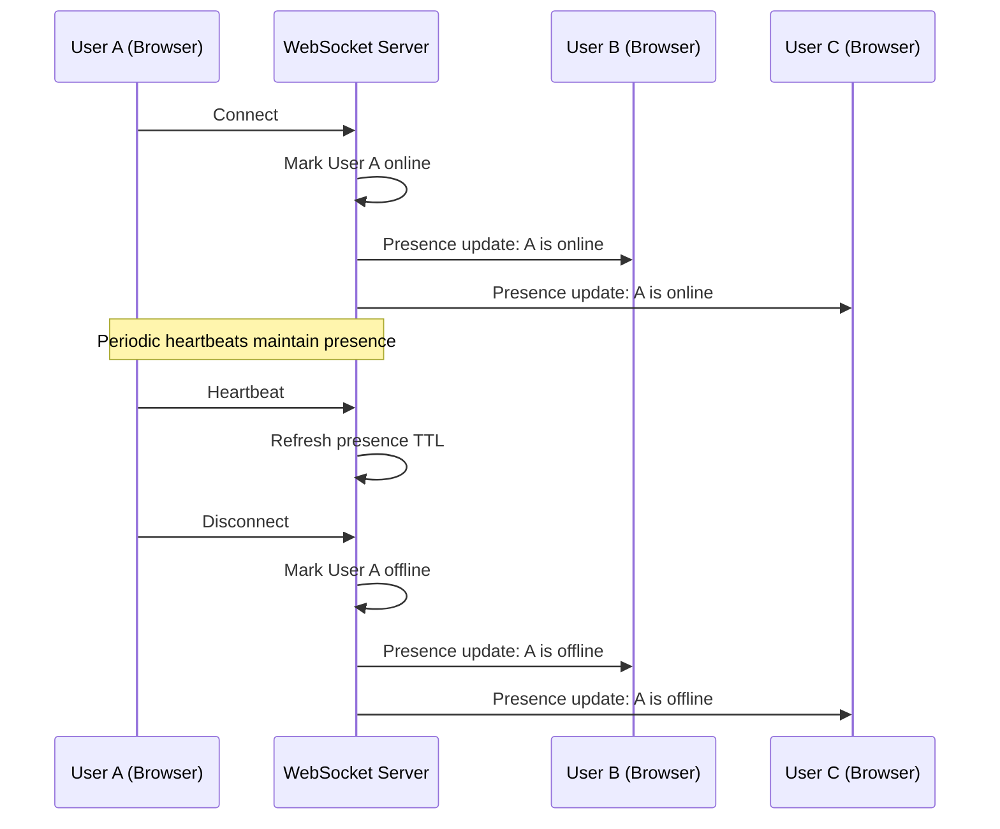
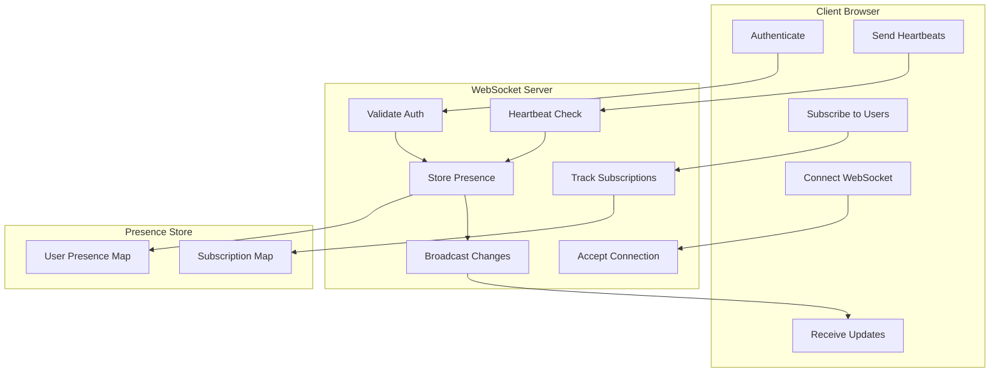
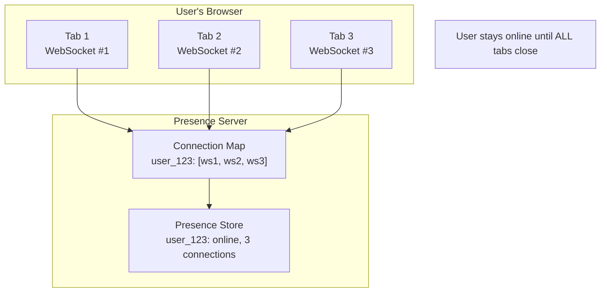
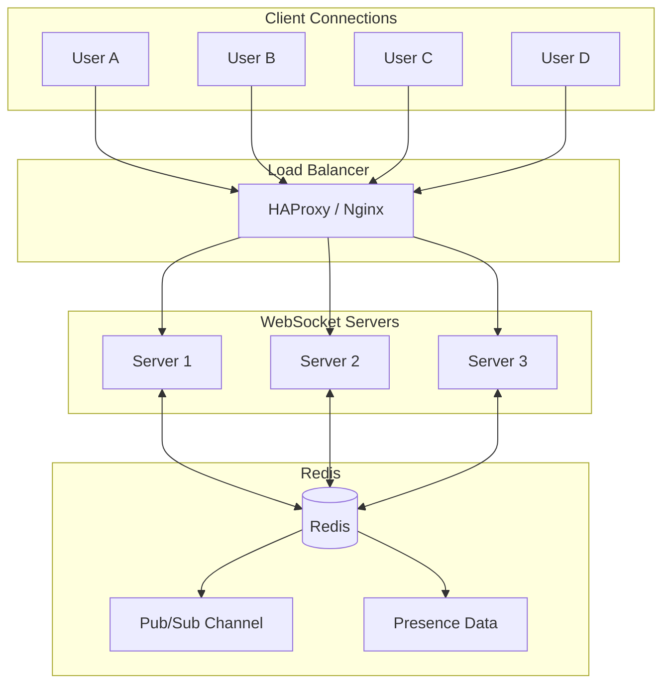

# How to Implement Presence Detection with WebSockets

Author: [nawazdhandala](https://www.github.com/nawazdhandala)

Tags: WebSocket, Presence Detection, Real-Time, Online Status, Node.js, JavaScript

Description: A comprehensive guide to implementing real-time presence detection with WebSockets. Learn how to track user online/offline status, handle heartbeats, manage presence across multiple tabs, and build scalable presence systems for chat applications and collaboration tools.

---

Presence detection tells users who is online, offline, or away in real-time. It is essential for chat applications, collaboration tools, and social platforms where knowing if someone is available matters. WebSockets provide the ideal foundation for presence detection because they maintain persistent bidirectional connections that can instantly detect when users connect or disconnect.

In this guide, we will build a complete presence detection system using WebSockets and Node.js. We will cover connection tracking, heartbeat mechanisms, multi-tab support, presence broadcasting, and production considerations.

## Understanding Presence Detection Architecture

Before diving into code, let us understand how presence detection works with WebSockets:



The core concept is simple: when a WebSocket connection opens, the user is online. When it closes, they are offline. Heartbeats handle edge cases where connections drop without proper close events.

## Project Setup

Let us set up a Node.js project for our presence system:

```bash
# Create project directory
mkdir websocket-presence && cd websocket-presence

# Initialize npm project
npm init -y

# Install dependencies
npm install ws express uuid
```

Our dependencies include:
- `ws`: A fast WebSocket implementation for Node.js
- `express`: For serving static files and HTTP endpoints
- `uuid`: For generating unique session identifiers

## Basic Presence Tracking

Here is a foundational presence system that tracks connected users.

The following code creates a WebSocket server that maintains a map of connected users and broadcasts presence changes to all clients:

```javascript
// server.js
const express = require('express');
const http = require('http');
const WebSocket = require('ws');
const { v4: uuidv4 } = require('uuid');
const path = require('path');

const app = express();
const server = http.createServer(app);
const wss = new WebSocket.Server({ server });

app.use(express.static(path.join(__dirname, 'public')));

// Store all connected users with their presence data
const presenceStore = new Map();

// Store WebSocket connections mapped to user IDs
const connections = new Map();

// Presence status constants
const PresenceStatus = {
    ONLINE: 'online',
    AWAY: 'away',
    BUSY: 'busy',
    OFFLINE: 'offline'
};

// Message types for the presence protocol
const MessageTypes = {
    // Client to server
    AUTHENTICATE: 'authenticate',
    SET_STATUS: 'set_status',
    HEARTBEAT: 'heartbeat',
    GET_PRESENCE: 'get_presence',
    SUBSCRIBE: 'subscribe',
    UNSUBSCRIBE: 'unsubscribe',

    // Server to client
    PRESENCE_UPDATE: 'presence_update',
    PRESENCE_LIST: 'presence_list',
    ERROR: 'error',
    AUTHENTICATED: 'authenticated'
};

// Handle new WebSocket connections
wss.on('connection', (ws) => {
    // Generate a unique session ID for this connection
    const sessionId = uuidv4();

    // Store connection metadata
    ws.sessionId = sessionId;
    ws.userId = null;
    ws.isAlive = true;
    ws.subscribedUsers = new Set();

    console.log(`New connection: ${sessionId}`);

    // Handle incoming messages
    ws.on('message', (data) => {
        handleMessage(ws, data);
    });

    // Handle connection close
    ws.on('close', () => {
        handleDisconnect(ws);
    });

    // Handle pong responses for heartbeat
    ws.on('pong', () => {
        ws.isAlive = true;
    });

    // Handle errors
    ws.on('error', (error) => {
        console.error(`WebSocket error for ${sessionId}:`, error.message);
    });
});

// Process incoming messages
function handleMessage(ws, data) {
    let message;

    try {
        message = JSON.parse(data);
    } catch (error) {
        sendError(ws, 'Invalid JSON format');
        return;
    }

    switch (message.type) {
        case MessageTypes.AUTHENTICATE:
            handleAuthenticate(ws, message);
            break;

        case MessageTypes.SET_STATUS:
            handleSetStatus(ws, message.status);
            break;

        case MessageTypes.HEARTBEAT:
            handleHeartbeat(ws);
            break;

        case MessageTypes.GET_PRESENCE:
            handleGetPresence(ws, message.userIds);
            break;

        case MessageTypes.SUBSCRIBE:
            handleSubscribe(ws, message.userIds);
            break;

        case MessageTypes.UNSUBSCRIBE:
            handleUnsubscribe(ws, message.userIds);
            break;

        default:
            sendError(ws, `Unknown message type: ${message.type}`);
    }
}

// Send error message to client
function sendError(ws, message) {
    if (ws.readyState === WebSocket.OPEN) {
        ws.send(JSON.stringify({
            type: MessageTypes.ERROR,
            message: message
        }));
    }
}

const PORT = process.env.PORT || 3000;
server.listen(PORT, () => {
    console.log(`Presence server running on port ${PORT}`);
});
```

## User Authentication and Connection

When users connect, they must authenticate to associate their WebSocket connection with their user identity.

This authentication handler validates the user and marks them as online in the presence store:

```javascript
// Authentication handler
function handleAuthenticate(ws, message) {
    const { userId, token } = message;

    // Validate required fields
    if (!userId || typeof userId !== 'string') {
        sendError(ws, 'User ID is required');
        return;
    }

    // In production, validate the token against your auth system
    // For this example, we accept any token
    if (!token) {
        sendError(ws, 'Authentication token is required');
        return;
    }

    // TODO: Validate token with your authentication service
    // const isValid = await authService.validateToken(token, userId);
    // if (!isValid) {
    //     sendError(ws, 'Invalid authentication token');
    //     return;
    // }

    // Store user ID on the WebSocket connection
    ws.userId = userId;

    // Register the connection
    if (!connections.has(userId)) {
        connections.set(userId, new Set());
    }
    connections.get(userId).add(ws);

    // Update presence store
    const now = new Date().toISOString();
    const existingPresence = presenceStore.get(userId);

    presenceStore.set(userId, {
        userId: userId,
        status: existingPresence?.status || PresenceStatus.ONLINE,
        lastSeen: now,
        connectedAt: existingPresence?.connectedAt || now,
        connectionCount: (existingPresence?.connectionCount || 0) + 1
    });

    // Send confirmation to the client
    ws.send(JSON.stringify({
        type: MessageTypes.AUTHENTICATED,
        userId: userId,
        presence: presenceStore.get(userId)
    }));

    // Broadcast presence update to subscribers
    broadcastPresenceUpdate(userId);

    console.log(`User authenticated: ${userId} (${connections.get(userId).size} connections)`);
}
```

## Handling Disconnections

When a WebSocket closes, we need to update the user's presence. However, we must handle the case where a user has multiple connections (multiple browser tabs).

This disconnect handler only marks the user offline when their last connection closes:

```javascript
// Handle WebSocket disconnect
function handleDisconnect(ws) {
    const userId = ws.userId;

    if (!userId) {
        console.log(`Anonymous connection closed: ${ws.sessionId}`);
        return;
    }

    // Remove this connection from the user's connection set
    const userConnections = connections.get(userId);

    if (userConnections) {
        userConnections.delete(ws);

        // If user has no more connections, mark them offline
        if (userConnections.size === 0) {
            connections.delete(userId);

            // Update presence to offline
            const presence = presenceStore.get(userId);

            if (presence) {
                presenceStore.set(userId, {
                    ...presence,
                    status: PresenceStatus.OFFLINE,
                    lastSeen: new Date().toISOString(),
                    connectionCount: 0
                });

                // Broadcast offline status
                broadcastPresenceUpdate(userId);
            }

            console.log(`User went offline: ${userId}`);
        } else {
            // User still has other connections, update count
            const presence = presenceStore.get(userId);

            if (presence) {
                presenceStore.set(userId, {
                    ...presence,
                    connectionCount: userConnections.size
                });
            }

            console.log(`User connection closed: ${userId} (${userConnections.size} remaining)`);
        }
    }

    // Clean up subscriptions from this connection
    ws.subscribedUsers.clear();
}
```

## Heartbeat Mechanism

Network issues can cause connections to become stale without triggering close events. A heartbeat mechanism ensures we detect dead connections.

The following code implements both server-initiated pings and client-initiated heartbeats:

```javascript
// Heartbeat interval for detecting dead connections (30 seconds)
const HEARTBEAT_INTERVAL = 30000;

// Timeout before considering a connection dead (35 seconds)
const HEARTBEAT_TIMEOUT = 35000;

// Server-side ping to detect dead connections
const heartbeatChecker = setInterval(() => {
    wss.clients.forEach((ws) => {
        if (ws.isAlive === false) {
            console.log(`Terminating dead connection: ${ws.sessionId}`);
            return ws.terminate();
        }

        ws.isAlive = false;
        ws.ping();
    });
}, HEARTBEAT_INTERVAL);

// Clean up interval on server close
wss.on('close', () => {
    clearInterval(heartbeatChecker);
});

// Handle client heartbeat messages
function handleHeartbeat(ws) {
    if (!ws.userId) {
        return;
    }

    ws.isAlive = true;

    // Update last seen timestamp
    const presence = presenceStore.get(ws.userId);

    if (presence) {
        presenceStore.set(ws.userId, {
            ...presence,
            lastSeen: new Date().toISOString()
        });
    }

    // Optionally send acknowledgment
    ws.send(JSON.stringify({
        type: 'heartbeat_ack',
        timestamp: new Date().toISOString()
    }));
}
```

## Status Updates

Users should be able to set their status to indicate availability.

This handler allows users to change their presence status and broadcasts the change to interested parties:

```javascript
// Handle status change requests
function handleSetStatus(ws, newStatus) {
    if (!ws.userId) {
        sendError(ws, 'Not authenticated');
        return;
    }

    // Validate status
    const validStatuses = Object.values(PresenceStatus);

    if (!validStatuses.includes(newStatus)) {
        sendError(ws, `Invalid status. Must be one of: ${validStatuses.join(', ')}`);
        return;
    }

    // Cannot set offline while connected
    if (newStatus === PresenceStatus.OFFLINE) {
        sendError(ws, 'Cannot manually set status to offline while connected');
        return;
    }

    const presence = presenceStore.get(ws.userId);

    if (presence) {
        presenceStore.set(ws.userId, {
            ...presence,
            status: newStatus,
            lastSeen: new Date().toISOString()
        });

        // Broadcast the status change
        broadcastPresenceUpdate(ws.userId);

        // Confirm to the user
        ws.send(JSON.stringify({
            type: 'status_updated',
            status: newStatus
        }));
    }
}
```

## Presence Subscriptions

Rather than broadcasting to all users, implement a subscription model where clients subscribe to specific users they care about.

This approach is more efficient for applications with many users:

```javascript
// Subscribe to presence updates for specific users
function handleSubscribe(ws, userIds) {
    if (!ws.userId) {
        sendError(ws, 'Not authenticated');
        return;
    }

    if (!Array.isArray(userIds)) {
        sendError(ws, 'userIds must be an array');
        return;
    }

    // Add users to this connection's subscription list
    userIds.forEach(userId => {
        ws.subscribedUsers.add(userId);
    });

    // Send current presence for subscribed users
    const presenceList = userIds.map(userId => {
        const presence = presenceStore.get(userId);
        return presence || {
            userId: userId,
            status: PresenceStatus.OFFLINE,
            lastSeen: null
        };
    });

    ws.send(JSON.stringify({
        type: MessageTypes.PRESENCE_LIST,
        presences: presenceList
    }));
}

// Unsubscribe from presence updates
function handleUnsubscribe(ws, userIds) {
    if (!Array.isArray(userIds)) {
        sendError(ws, 'userIds must be an array');
        return;
    }

    userIds.forEach(userId => {
        ws.subscribedUsers.delete(userId);
    });
}

// Get presence for specific users without subscribing
function handleGetPresence(ws, userIds) {
    if (!ws.userId) {
        sendError(ws, 'Not authenticated');
        return;
    }

    if (!Array.isArray(userIds)) {
        sendError(ws, 'userIds must be an array');
        return;
    }

    const presenceList = userIds.map(userId => {
        const presence = presenceStore.get(userId);
        return presence || {
            userId: userId,
            status: PresenceStatus.OFFLINE,
            lastSeen: null
        };
    });

    ws.send(JSON.stringify({
        type: MessageTypes.PRESENCE_LIST,
        presences: presenceList
    }));
}
```

## Broadcasting Presence Updates

When a user's presence changes, notify all subscribers.

This broadcast function finds all connections subscribed to a user and sends them the update:

```javascript
// Broadcast presence update to all subscribers
function broadcastPresenceUpdate(userId) {
    const presence = presenceStore.get(userId);

    if (!presence) {
        return;
    }

    const update = {
        type: MessageTypes.PRESENCE_UPDATE,
        presence: presence
    };

    const updateStr = JSON.stringify(update);

    // Find all connections subscribed to this user
    wss.clients.forEach((ws) => {
        if (ws.readyState !== WebSocket.OPEN) {
            return;
        }

        // Send to subscribers of this user
        if (ws.subscribedUsers.has(userId)) {
            ws.send(updateStr);
        }

        // Also send to the user themselves (for multi-tab sync)
        if (ws.userId === userId) {
            ws.send(updateStr);
        }
    });
}
```

## Presence Flow Diagram

Here is the complete flow for presence updates:



## Client-Side Implementation

Here is a complete client implementation that handles presence.

The following JavaScript creates a presence client with automatic reconnection and heartbeat:

```javascript
// public/presence-client.js

class PresenceClient {
    constructor(serverUrl, options = {}) {
        this.serverUrl = serverUrl;
        this.options = {
            heartbeatInterval: options.heartbeatInterval || 25000,
            reconnectInterval: options.reconnectInterval || 3000,
            maxReconnectAttempts: options.maxReconnectAttempts || 10
        };

        this.ws = null;
        this.userId = null;
        this.token = null;
        this.isAuthenticated = false;
        this.reconnectAttempts = 0;
        this.heartbeatTimer = null;
        this.subscribedUsers = new Set();

        // Event handlers
        this.onPresenceUpdate = null;
        this.onConnectionChange = null;
        this.onError = null;
    }

    // Connect to the presence server
    connect(userId, token) {
        this.userId = userId;
        this.token = token;

        return new Promise((resolve, reject) => {
            try {
                this.ws = new WebSocket(this.serverUrl);

                this.ws.onopen = () => {
                    console.log('WebSocket connected');
                    this.reconnectAttempts = 0;
                    this.authenticate();

                    if (this.onConnectionChange) {
                        this.onConnectionChange('connected');
                    }
                };

                this.ws.onmessage = (event) => {
                    const message = JSON.parse(event.data);
                    this.handleMessage(message, resolve, reject);
                };

                this.ws.onclose = () => {
                    console.log('WebSocket disconnected');
                    this.isAuthenticated = false;
                    this.stopHeartbeat();

                    if (this.onConnectionChange) {
                        this.onConnectionChange('disconnected');
                    }

                    this.attemptReconnect();
                };

                this.ws.onerror = (error) => {
                    console.error('WebSocket error:', error);

                    if (this.onError) {
                        this.onError(error);
                    }
                };
            } catch (error) {
                reject(error);
            }
        });
    }

    // Send authentication message
    authenticate() {
        this.send({
            type: 'authenticate',
            userId: this.userId,
            token: this.token
        });
    }

    // Handle incoming messages
    handleMessage(message, resolveConnect, rejectConnect) {
        switch (message.type) {
            case 'authenticated':
                this.isAuthenticated = true;
                this.startHeartbeat();

                // Resubscribe to previously subscribed users
                if (this.subscribedUsers.size > 0) {
                    this.subscribe(Array.from(this.subscribedUsers));
                }

                if (resolveConnect) {
                    resolveConnect(message.presence);
                }
                break;

            case 'presence_update':
                if (this.onPresenceUpdate) {
                    this.onPresenceUpdate(message.presence);
                }
                break;

            case 'presence_list':
                message.presences.forEach(presence => {
                    if (this.onPresenceUpdate) {
                        this.onPresenceUpdate(presence);
                    }
                });
                break;

            case 'error':
                console.error('Server error:', message.message);

                if (this.onError) {
                    this.onError(new Error(message.message));
                }

                if (rejectConnect && !this.isAuthenticated) {
                    rejectConnect(new Error(message.message));
                }
                break;

            case 'heartbeat_ack':
                // Heartbeat acknowledged
                break;
        }
    }

    // Send message to server
    send(message) {
        if (this.ws && this.ws.readyState === WebSocket.OPEN) {
            this.ws.send(JSON.stringify(message));
        }
    }

    // Set user status
    setStatus(status) {
        this.send({
            type: 'set_status',
            status: status
        });
    }

    // Subscribe to presence updates for users
    subscribe(userIds) {
        userIds.forEach(id => this.subscribedUsers.add(id));

        this.send({
            type: 'subscribe',
            userIds: userIds
        });
    }

    // Unsubscribe from presence updates
    unsubscribe(userIds) {
        userIds.forEach(id => this.subscribedUsers.delete(id));

        this.send({
            type: 'unsubscribe',
            userIds: userIds
        });
    }

    // Get presence for specific users
    getPresence(userIds) {
        this.send({
            type: 'get_presence',
            userIds: userIds
        });
    }

    // Start heartbeat timer
    startHeartbeat() {
        this.stopHeartbeat();

        this.heartbeatTimer = setInterval(() => {
            this.send({ type: 'heartbeat' });
        }, this.options.heartbeatInterval);
    }

    // Stop heartbeat timer
    stopHeartbeat() {
        if (this.heartbeatTimer) {
            clearInterval(this.heartbeatTimer);
            this.heartbeatTimer = null;
        }
    }

    // Attempt to reconnect
    attemptReconnect() {
        if (this.reconnectAttempts >= this.options.maxReconnectAttempts) {
            console.error('Max reconnection attempts reached');
            return;
        }

        this.reconnectAttempts++;

        console.log(`Reconnecting in ${this.options.reconnectInterval}ms (attempt ${this.reconnectAttempts})`);

        setTimeout(() => {
            if (this.userId && this.token) {
                this.connect(this.userId, this.token);
            }
        }, this.options.reconnectInterval);
    }

    // Disconnect from server
    disconnect() {
        this.stopHeartbeat();

        if (this.ws) {
            this.ws.close();
            this.ws = null;
        }

        this.isAuthenticated = false;
    }
}

// Export for use in browser
if (typeof window !== 'undefined') {
    window.PresenceClient = PresenceClient;
}

// Export for Node.js
if (typeof module !== 'undefined') {
    module.exports = PresenceClient;
}
```

## HTML Demo Page

Here is a simple HTML page to demonstrate the presence system.

This page allows users to connect, set their status, and see other users' presence:

```html
<!-- public/index.html -->
<!DOCTYPE html>
<html lang="en">
<head>
    <meta charset="UTF-8">
    <meta name="viewport" content="width=device-width, initial-scale=1.0">
    <title>WebSocket Presence Demo</title>
    <style>
        * {
            margin: 0;
            padding: 0;
            box-sizing: border-box;
        }

        body {
            font-family: -apple-system, BlinkMacSystemFont, 'Segoe UI', Roboto, sans-serif;
            background: #1a1a2e;
            color: #eee;
            min-height: 100vh;
            padding: 20px;
        }

        .container {
            max-width: 600px;
            margin: 0 auto;
        }

        h1 {
            text-align: center;
            margin-bottom: 30px;
            color: #e94560;
        }

        .panel {
            background: #16213e;
            border-radius: 12px;
            padding: 20px;
            margin-bottom: 20px;
        }

        .panel h2 {
            margin-bottom: 15px;
            font-size: 18px;
            color: #e94560;
        }

        .form-group {
            margin-bottom: 15px;
        }

        label {
            display: block;
            margin-bottom: 5px;
            color: #888;
        }

        input, select {
            width: 100%;
            padding: 12px;
            border: none;
            border-radius: 8px;
            background: #0f3460;
            color: #fff;
            font-size: 16px;
        }

        button {
            padding: 12px 24px;
            border: none;
            border-radius: 8px;
            background: #e94560;
            color: #fff;
            font-size: 16px;
            cursor: pointer;
            transition: background 0.2s;
        }

        button:hover {
            background: #ff6b6b;
        }

        button:disabled {
            background: #444;
            cursor: not-allowed;
        }

        .status-indicator {
            display: inline-block;
            width: 12px;
            height: 12px;
            border-radius: 50%;
            margin-right: 8px;
        }

        .status-online { background: #4ade80; }
        .status-away { background: #fbbf24; }
        .status-busy { background: #ef4444; }
        .status-offline { background: #6b7280; }

        .user-list {
            list-style: none;
        }

        .user-list li {
            padding: 12px;
            background: #0f3460;
            border-radius: 8px;
            margin-bottom: 8px;
            display: flex;
            align-items: center;
            justify-content: space-between;
        }

        .user-info {
            display: flex;
            align-items: center;
        }

        .last-seen {
            color: #888;
            font-size: 12px;
        }

        .connection-status {
            position: fixed;
            top: 20px;
            right: 20px;
            padding: 8px 16px;
            border-radius: 20px;
            font-size: 14px;
        }

        .connection-status.connected { background: #166534; }
        .connection-status.disconnected { background: #991b1b; }
        .connection-status.connecting { background: #92400e; }

        .hidden { display: none; }
    </style>
</head>
<body>
    <div class="container">
        <h1>Presence Detection Demo</h1>

        <!-- Login Panel -->
        <div id="login-panel" class="panel">
            <h2>Connect</h2>
            <div class="form-group">
                <label>Your User ID</label>
                <input type="text" id="user-id" placeholder="Enter your user ID">
            </div>
            <button id="connect-btn">Connect</button>
        </div>

        <!-- Status Panel -->
        <div id="status-panel" class="panel hidden">
            <h2>Your Status</h2>
            <div class="form-group">
                <select id="status-select">
                    <option value="online">Online</option>
                    <option value="away">Away</option>
                    <option value="busy">Busy</option>
                </select>
            </div>
            <button id="disconnect-btn">Disconnect</button>
        </div>

        <!-- Subscribe Panel -->
        <div id="subscribe-panel" class="panel hidden">
            <h2>Subscribe to Users</h2>
            <div class="form-group">
                <label>User IDs (comma separated)</label>
                <input type="text" id="subscribe-ids" placeholder="user1, user2, user3">
            </div>
            <button id="subscribe-btn">Subscribe</button>
        </div>

        <!-- Users Panel -->
        <div id="users-panel" class="panel hidden">
            <h2>User Presence</h2>
            <ul id="user-list" class="user-list">
                <!-- Users will be added here -->
            </ul>
        </div>
    </div>

    <div id="connection-status" class="connection-status disconnected">
        Disconnected
    </div>

    <script src="presence-client.js"></script>
    <script>
        // DOM Elements
        const loginPanel = document.getElementById('login-panel');
        const statusPanel = document.getElementById('status-panel');
        const subscribePanel = document.getElementById('subscribe-panel');
        const usersPanel = document.getElementById('users-panel');
        const connectionStatus = document.getElementById('connection-status');

        const userIdInput = document.getElementById('user-id');
        const connectBtn = document.getElementById('connect-btn');
        const disconnectBtn = document.getElementById('disconnect-btn');
        const statusSelect = document.getElementById('status-select');
        const subscribeIdsInput = document.getElementById('subscribe-ids');
        const subscribeBtn = document.getElementById('subscribe-btn');
        const userList = document.getElementById('user-list');

        // Presence data
        const presenceMap = new Map();

        // Create presence client
        const protocol = window.location.protocol === 'https:' ? 'wss:' : 'ws:';
        const client = new PresenceClient(`${protocol}//${window.location.host}`);

        // Handle presence updates
        client.onPresenceUpdate = (presence) => {
            presenceMap.set(presence.userId, presence);
            renderUserList();
        };

        // Handle connection changes
        client.onConnectionChange = (status) => {
            connectionStatus.className = `connection-status ${status}`;
            connectionStatus.textContent = status.charAt(0).toUpperCase() + status.slice(1);
        };

        // Connect button
        connectBtn.addEventListener('click', async () => {
            const userId = userIdInput.value.trim();

            if (!userId) {
                alert('Please enter a user ID');
                return;
            }

            connectionStatus.className = 'connection-status connecting';
            connectionStatus.textContent = 'Connecting...';

            try {
                await client.connect(userId, 'demo-token');
                loginPanel.classList.add('hidden');
                statusPanel.classList.remove('hidden');
                subscribePanel.classList.remove('hidden');
                usersPanel.classList.remove('hidden');
            } catch (error) {
                alert('Connection failed: ' + error.message);
            }
        });

        // Disconnect button
        disconnectBtn.addEventListener('click', () => {
            client.disconnect();
            loginPanel.classList.remove('hidden');
            statusPanel.classList.add('hidden');
            subscribePanel.classList.add('hidden');
            usersPanel.classList.add('hidden');
            presenceMap.clear();
            renderUserList();
        });

        // Status change
        statusSelect.addEventListener('change', () => {
            client.setStatus(statusSelect.value);
        });

        // Subscribe button
        subscribeBtn.addEventListener('click', () => {
            const ids = subscribeIdsInput.value
                .split(',')
                .map(id => id.trim())
                .filter(id => id.length > 0);

            if (ids.length > 0) {
                client.subscribe(ids);
                subscribeIdsInput.value = '';
            }
        });

        // Render user list
        function renderUserList() {
            userList.innerHTML = '';

            presenceMap.forEach((presence, userId) => {
                const li = document.createElement('li');

                const lastSeen = presence.lastSeen
                    ? new Date(presence.lastSeen).toLocaleString()
                    : 'Never';

                li.innerHTML = `
                    <div class="user-info">
                        <span class="status-indicator status-${presence.status}"></span>
                        <span>${userId}</span>
                    </div>
                    <span class="last-seen">${presence.status === 'offline' ? 'Last seen: ' + lastSeen : presence.status}</span>
                `;

                userList.appendChild(li);
            });
        }

        // Enter key handlers
        userIdInput.addEventListener('keypress', (e) => {
            if (e.key === 'Enter') connectBtn.click();
        });

        subscribeIdsInput.addEventListener('keypress', (e) => {
            if (e.key === 'Enter') subscribeBtn.click();
        });
    </script>
</body>
</html>
```

## Multi-Tab Presence

When a user has the same application open in multiple browser tabs, all tabs share the same presence status.

The following diagram shows how multi-tab presence works:



The server implementation we built already handles this. The `connections` Map stores a Set of WebSocket connections per user, and the user only goes offline when all connections close.

## Activity Detection

Enhance presence with automatic away detection based on user activity.

This client-side code detects inactivity and updates status automatically:

```javascript
// Activity detection for automatic away status
class ActivityDetector {
    constructor(presenceClient, options = {}) {
        this.client = presenceClient;
        this.options = {
            idleTimeout: options.idleTimeout || 300000, // 5 minutes
            awayTimeout: options.awayTimeout || 600000  // 10 minutes
        };

        this.lastActivity = Date.now();
        this.currentStatus = 'online';
        this.checkInterval = null;

        this.setupListeners();
        this.startChecking();
    }

    // Set up activity listeners
    setupListeners() {
        const activityEvents = [
            'mousedown',
            'mousemove',
            'keydown',
            'scroll',
            'touchstart',
            'click'
        ];

        const handleActivity = () => {
            this.lastActivity = Date.now();

            // If user was away, set back to online
            if (this.currentStatus !== 'online') {
                this.setStatus('online');
            }
        };

        activityEvents.forEach(event => {
            document.addEventListener(event, handleActivity, { passive: true });
        });

        // Handle visibility change
        document.addEventListener('visibilitychange', () => {
            if (document.hidden) {
                // Tab is hidden, check for away status sooner
                this.checkActivity();
            } else {
                // Tab is visible again
                handleActivity();
            }
        });
    }

    // Start periodic activity check
    startChecking() {
        this.checkInterval = setInterval(() => {
            this.checkActivity();
        }, 30000); // Check every 30 seconds
    }

    // Check activity and update status
    checkActivity() {
        const idle = Date.now() - this.lastActivity;

        if (idle >= this.options.awayTimeout && this.currentStatus !== 'away') {
            this.setStatus('away');
        }
    }

    // Set presence status
    setStatus(status) {
        if (this.currentStatus !== status) {
            this.currentStatus = status;
            this.client.setStatus(status);
        }
    }

    // Clean up
    destroy() {
        if (this.checkInterval) {
            clearInterval(this.checkInterval);
        }
    }
}

// Usage
// const activityDetector = new ActivityDetector(presenceClient, {
//     idleTimeout: 300000,  // 5 minutes until idle
//     awayTimeout: 600000   // 10 minutes until away
// });
```

## Scaling with Redis

For production systems with multiple server instances, use Redis to share presence state across servers.

Here is an architecture diagram for a scaled presence system:



The following code shows how to integrate Redis for distributed presence:

```javascript
// redis-presence.js
const Redis = require('ioredis');

class RedisPresenceStore {
    constructor(redisUrl) {
        // Create separate connections for pub/sub and commands
        this.redis = new Redis(redisUrl);
        this.subscriber = new Redis(redisUrl);
        this.publisher = new Redis(redisUrl);

        // Presence key TTL in seconds
        this.PRESENCE_TTL = 60;

        // Local handlers for presence updates from other servers
        this.updateHandlers = new Set();

        this.setupSubscriber();
    }

    // Set up Redis pub/sub subscriber
    setupSubscriber() {
        this.subscriber.subscribe('presence:updates');

        this.subscriber.on('message', (channel, message) => {
            if (channel === 'presence:updates') {
                const update = JSON.parse(message);

                // Notify local handlers
                this.updateHandlers.forEach(handler => {
                    handler(update);
                });
            }
        });
    }

    // Register handler for presence updates
    onUpdate(handler) {
        this.updateHandlers.add(handler);

        return () => {
            this.updateHandlers.delete(handler);
        };
    }

    // Set user presence
    async setPresence(userId, presence) {
        const key = `presence:${userId}`;

        // Store presence data with TTL
        await this.redis.setex(
            key,
            this.PRESENCE_TTL,
            JSON.stringify(presence)
        );

        // Publish update to all servers
        await this.publisher.publish(
            'presence:updates',
            JSON.stringify({
                type: 'presence_update',
                presence: presence
            })
        );
    }

    // Get user presence
    async getPresence(userId) {
        const key = `presence:${userId}`;
        const data = await this.redis.get(key);

        if (data) {
            return JSON.parse(data);
        }

        return {
            userId: userId,
            status: 'offline',
            lastSeen: null
        };
    }

    // Get multiple users' presence
    async getMultiplePresence(userIds) {
        const pipeline = this.redis.pipeline();

        userIds.forEach(userId => {
            pipeline.get(`presence:${userId}`);
        });

        const results = await pipeline.exec();

        return userIds.map((userId, index) => {
            const data = results[index][1];

            if (data) {
                return JSON.parse(data);
            }

            return {
                userId: userId,
                status: 'offline',
                lastSeen: null
            };
        });
    }

    // Refresh presence TTL (heartbeat)
    async refreshPresence(userId) {
        const key = `presence:${userId}`;
        await this.redis.expire(key, this.PRESENCE_TTL);
    }

    // Remove user presence
    async removePresence(userId) {
        const key = `presence:${userId}`;

        // Get current presence for last_seen
        const current = await this.getPresence(userId);

        // Delete the presence key
        await this.redis.del(key);

        // Publish offline update
        await this.publisher.publish(
            'presence:updates',
            JSON.stringify({
                type: 'presence_update',
                presence: {
                    userId: userId,
                    status: 'offline',
                    lastSeen: current.lastSeen || new Date().toISOString()
                }
            })
        );
    }

    // Get all online users
    async getOnlineUsers() {
        const keys = await this.redis.keys('presence:*');
        const userIds = keys.map(key => key.replace('presence:', ''));

        if (userIds.length === 0) {
            return [];
        }

        return this.getMultiplePresence(userIds);
    }

    // Clean up connections
    async close() {
        await this.subscriber.quit();
        await this.publisher.quit();
        await this.redis.quit();
    }
}

module.exports = RedisPresenceStore;
```

## Complete Scalable Server

Here is a complete server implementation using Redis for production deployments.

This server can run as multiple instances behind a load balancer:

```javascript
// server-redis.js
const express = require('express');
const http = require('http');
const WebSocket = require('ws');
const { v4: uuidv4 } = require('uuid');
const path = require('path');
const RedisPresenceStore = require('./redis-presence');

const app = express();
const server = http.createServer(app);
const wss = new WebSocket.Server({ server });

app.use(express.static(path.join(__dirname, 'public')));

// Initialize Redis presence store
const REDIS_URL = process.env.REDIS_URL || 'redis://localhost:6379';
const presenceStore = new RedisPresenceStore(REDIS_URL);

// Local connection tracking
const localConnections = new Map();

// Server ID for debugging
const SERVER_ID = uuidv4().substring(0, 8);

// Handle Redis presence updates from other servers
presenceStore.onUpdate((update) => {
    // Broadcast to local WebSocket connections that are subscribed
    wss.clients.forEach((ws) => {
        if (ws.readyState !== WebSocket.OPEN) return;

        const presence = update.presence;

        // Send to subscribers
        if (ws.subscribedUsers && ws.subscribedUsers.has(presence.userId)) {
            ws.send(JSON.stringify({
                type: 'presence_update',
                presence: presence
            }));
        }

        // Send to the user themselves for multi-tab sync
        if (ws.userId === presence.userId) {
            ws.send(JSON.stringify({
                type: 'presence_update',
                presence: presence
            }));
        }
    });
});

// WebSocket connection handler
wss.on('connection', (ws) => {
    ws.sessionId = uuidv4();
    ws.userId = null;
    ws.isAlive = true;
    ws.subscribedUsers = new Set();

    console.log(`[${SERVER_ID}] New connection: ${ws.sessionId}`);

    ws.on('message', (data) => handleMessage(ws, data));
    ws.on('close', () => handleDisconnect(ws));
    ws.on('pong', () => { ws.isAlive = true; });
});

// Message handler
async function handleMessage(ws, data) {
    let message;

    try {
        message = JSON.parse(data);
    } catch {
        ws.send(JSON.stringify({ type: 'error', message: 'Invalid JSON' }));
        return;
    }

    switch (message.type) {
        case 'authenticate':
            await handleAuthenticate(ws, message);
            break;
        case 'set_status':
            await handleSetStatus(ws, message.status);
            break;
        case 'heartbeat':
            await handleHeartbeat(ws);
            break;
        case 'subscribe':
            await handleSubscribe(ws, message.userIds);
            break;
        case 'get_presence':
            await handleGetPresence(ws, message.userIds);
            break;
    }
}

// Authentication
async function handleAuthenticate(ws, message) {
    const { userId, token } = message;

    if (!userId) {
        ws.send(JSON.stringify({ type: 'error', message: 'User ID required' }));
        return;
    }

    ws.userId = userId;

    // Track local connection
    if (!localConnections.has(userId)) {
        localConnections.set(userId, new Set());
    }
    localConnections.get(userId).add(ws);

    // Set presence in Redis
    const presence = {
        userId: userId,
        status: 'online',
        lastSeen: new Date().toISOString(),
        serverId: SERVER_ID
    };

    await presenceStore.setPresence(userId, presence);

    ws.send(JSON.stringify({
        type: 'authenticated',
        userId: userId,
        presence: presence
    }));

    console.log(`[${SERVER_ID}] User authenticated: ${userId}`);
}

// Status update
async function handleSetStatus(ws, status) {
    if (!ws.userId) return;

    const validStatuses = ['online', 'away', 'busy'];
    if (!validStatuses.includes(status)) return;

    const presence = {
        userId: ws.userId,
        status: status,
        lastSeen: new Date().toISOString(),
        serverId: SERVER_ID
    };

    await presenceStore.setPresence(ws.userId, presence);
}

// Heartbeat
async function handleHeartbeat(ws) {
    if (!ws.userId) return;

    ws.isAlive = true;
    await presenceStore.refreshPresence(ws.userId);

    ws.send(JSON.stringify({
        type: 'heartbeat_ack',
        timestamp: new Date().toISOString()
    }));
}

// Subscribe
async function handleSubscribe(ws, userIds) {
    if (!Array.isArray(userIds)) return;

    userIds.forEach(id => ws.subscribedUsers.add(id));

    const presences = await presenceStore.getMultiplePresence(userIds);

    ws.send(JSON.stringify({
        type: 'presence_list',
        presences: presences
    }));
}

// Get presence
async function handleGetPresence(ws, userIds) {
    if (!Array.isArray(userIds)) return;

    const presences = await presenceStore.getMultiplePresence(userIds);

    ws.send(JSON.stringify({
        type: 'presence_list',
        presences: presences
    }));
}

// Disconnect handler
async function handleDisconnect(ws) {
    const userId = ws.userId;
    if (!userId) return;

    const userConns = localConnections.get(userId);
    if (userConns) {
        userConns.delete(ws);

        if (userConns.size === 0) {
            localConnections.delete(userId);
            await presenceStore.removePresence(userId);
            console.log(`[${SERVER_ID}] User offline: ${userId}`);
        }
    }
}

// Heartbeat check interval
const heartbeatInterval = setInterval(() => {
    wss.clients.forEach((ws) => {
        if (!ws.isAlive) {
            return ws.terminate();
        }
        ws.isAlive = false;
        ws.ping();
    });
}, 30000);

wss.on('close', () => {
    clearInterval(heartbeatInterval);
});

// Graceful shutdown
process.on('SIGTERM', async () => {
    console.log(`[${SERVER_ID}] Shutting down...`);

    // Mark all local users as offline
    for (const userId of localConnections.keys()) {
        await presenceStore.removePresence(userId);
    }

    await presenceStore.close();
    server.close();
    process.exit(0);
});

const PORT = process.env.PORT || 3000;
server.listen(PORT, () => {
    console.log(`[${SERVER_ID}] Presence server running on port ${PORT}`);
});
```

## Testing the Presence System

Run your server and open multiple browser tabs to test.

Start the server:

```bash
node server.js
```

Open `http://localhost:3000` in multiple tabs. Connect with different user IDs and subscribe to each other to see real-time presence updates.

To test the distributed setup with Redis:

```bash
# Start Redis
docker run -d -p 6379:6379 redis

# Start multiple server instances
PORT=3001 node server-redis.js &
PORT=3002 node server-redis.js &
PORT=3003 node server-redis.js &
```

Use a load balancer to distribute connections across servers.

## Conclusion

WebSocket presence detection provides real-time visibility into user availability. Key takeaways from this guide:

- **Connection tracking** maps WebSocket connections to user identities
- **Heartbeat mechanisms** detect dead connections that did not close properly
- **Multi-tab support** keeps users online until all connections close
- **Subscription models** efficiently deliver updates only to interested parties
- **Activity detection** automatically sets away status after inactivity
- **Redis integration** enables horizontal scaling across multiple servers

These patterns form the foundation for presence in chat applications, collaboration tools, and any system where knowing user availability matters.

## Monitor Your Real-Time Applications with OneUptime

Building presence detection is just the beginning. To ensure your WebSocket servers remain healthy and responsive, you need comprehensive monitoring. [OneUptime](https://oneuptime.com) provides real-time monitoring for WebSocket endpoints, alerting you immediately when connections fail or latency increases. Track connection counts, monitor heartbeat intervals, and get notified before users experience issues. Start monitoring your presence system today with OneUptime's free tier.
